# 03 — System Architecture

**Project:** CareGrid AI
**Document type:** Technical architecture (how the system is decomposed and why)
**Status:** Baseline v1.0 — approved for implementation
**Related documents:** [01 Product Requirements Document](./01_PRODUCT_REQUIREMENTS_DOCUMENT.md) · [02 Technical Requirements Document](./02_TECHNICAL_REQUIREMENTS_DOCUMENT.md) · [05 Frontend Architecture](./05_FRONTEND_ARCHITECTURE.md) · [06 Backend Architecture](./06_BACKEND_ARCHITECTURE.md) · [07 Database Schema](./07_DATABASE_SCHEMA.md) · [08 API Specification](./08_API_SPECIFICATION.md) · [09 AI / Gemini Specification](./09_AI_GEMINI_SPECIFICATION.md) · [10 Authorization & Security](./10_AUTHORIZATION_SECURITY.md) · [11 Realtime System](./11_REALTIME_SYSTEM.md) · [23 Data Flow Diagrams](./23_DATA_FLOW_DIAGRAMS.md) · [26 Performance Requirements](./26_PERFORMANCE_REQUIREMENTS.md)

---

## 0. How to read this document

| Notation | Meaning |
| --- | --- |
| Solid box | A container or component **we own and deploy** |
| Cylinder | A managed datastore / object store |
| Dashed box | An external system we call but do not host |
| `◄──` | Authoritative source of truth for a value |
| `⇒` | Derives, never persists independently |
| `TS` | Trust boundary crossing — everything inside the box is trusted, everything outside is not |

**Three questions this document must answer, and where:**

| Question | Section |
| --- | --- |
| What are the moving parts and who owns them? | §1 context, §2 containers, §4 components, §11 deployment |
| What must each part never do? | §3 (per-layer "must not") and §7 (trust boundaries) |
| Why is it built this way and not the obvious other way? | §13 (ADR-001 … ADR-018) |

Layer names in §3 (`Client`, `Application`, `AI`, `Database`, `Storage`, `Maps`, `Notification`, `Auth`) are **normative**. Code directories map to layers as follows: `app/`, `components/`, `features/`, `hooks/` → Client; `app/api/**`, `lib/`, `services/` → Application; `services/ai/` → AI; `services/firestore/` → Database; Storage, Maps, Notification and Auth are cross-cutting integrations owned by `services/`.

---

## 1. Architecture at a glance

### 1.1 The ten design rules

Everything in this document follows from ten rules. When two rules conflict, the lower number wins.

| # | Rule | Consequence |
| --- | --- | --- |
| **R1** | **The AI is never on the critical path of recording an emergency.** | Gemini is called inside `POST /api/incidents` with a 20 s hard timeout, and *every* failure path terminates in a deterministic keyword fallback. The incident exists before the AI is consulted in any meaningful sense (FR-029, ADR-014) |
| **R2** | **A human holds dispatch power. Always.** | No code path lets an AI output or an automated rule create a `dispatches` document. `dispatches.dispatchedBy` is always a human uid or the literal `"system"` for a *suggestion* that a human accepted (DEC-05, [09](./09_AI_GEMINI_SPECIFICATION.md) §6.4) |
| **R3** | **Authorization is server-authoritative, resource-scoped, and re-evaluated per request.** | `users/{uid}.role` is read fresh on every protected route; a client-supplied role has no effect. Role alone is never sufficient — ownership is a second gate ([22](./22_USER_ROLES_PERMISSIONS.md) §5) |
| **R4** | **Every client-facing data read is bounded by `limit()`.** | No unbounded query, no listener without a `limit()`, no "fetch all and filter". The read budget in [26](./26_PERFORMANCE_REQUIREMENTS.md) §5 is an architectural constraint, not an optimisation |
| **R5** | **File bytes never transit a serverless function.** | The client `PUT`s directly to Cloud Storage with a short-lived signed URL (FR-007, ADR-004) |
| **R6** | **There is no client-side cache of server state.** | Server Components read once per request; Firestore listeners push changes; there is no Redux/Zustand-for-server-state, no TanStack Query, no SWR (ADR-009) |
| **R7** | **Realtime is push, never poll.** | `onSnapshot` only, ≤ 8 per client, always unsubscribed on unmount and on role change (FR-090, FR-091, FR-092) |
| **R8** | **Firestore is a document store without geo queries or aggregation, and the architecture pretends neither.** | Geohash cells + Haversine; precomputed `analyticsDaily` rollups (ADR-002, ADR-006) |
| **R9** | **Every state change is written by the server, in a transaction, with a history append and an audit entry.** | `lib/incidents/lifecycle.ts` is the only place a status can change (FR-052) |
| **R10** | **Every optional third-party service has a designed degradation path.** | AI, Maps, and notification providers each have a documented "what the user sees when it is down" answer (NFR-012) |

### 1.2 System context (C4 level 1)

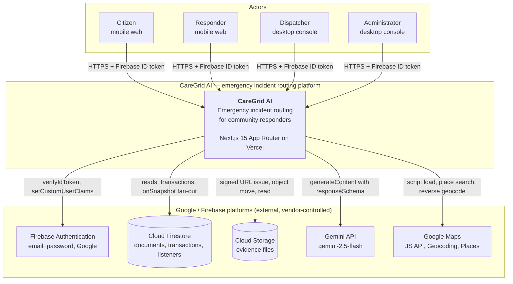

**What the citizen sees as one system is four role surfaces and one public page**, all served by the same deployable.

### 1.3 External system register

| External system | Owned by us? | Contract | If it is down | If it is compromised |
| --- | --- | --- | --- | --- |
| Firebase Authentication | No | ID tokens verified with `verifyIdToken`; roles as custom claims | Nobody can sign in. **Signed-in sessions continue** — the system is not a login-only product | Attacker can mint tokens for a project they control, not ours; the `projectId` claim is checked by the SDK |
| Cloud Firestore | No | `firebase-admin` (server, bypasses rules) + `firebase` (client listeners) | `DB_UNAVAILABLE` (503). This is the only third-party failure that breaks reporting | Full data plane compromise; mitigated by key restriction, rotation, and audit logs |
| Cloud Storage | No | Signed URLs; Storage rules | Uploads fail with `STORAGE_UNAVAILABLE`; a text-only report still succeeds | Evidence exposure is bounded by 15-minute signed URLs and path-scoped rules |
| Gemini API | No | `@google/genai`, `responseSchema`, hard timeout | **No visible effect** — keyword fallback, `triageSource: 'fallback'`, `aiNeedsReview: true` | A manipulated model can produce wrong advice; bounded by `.strict()`, safety rules R1–R10, and human verification before action |
| Google Maps | No | Maps JS API, Geocoding, Places | Map surfaces fall back to the static list with coordinates (FR-085); reverse geocoding leaves `placeName` null | A leaked *browser* key can exhaust our Maps credit (the $0 risk). A leaked *server* key is IP-restricted |
| Vercel | No | Next.js hosting, functions, cron, CDN | Whole application is unavailable. **Firestore listeners do not survive it** either, because the client code is served from the same origin | Platform-level compromise; outside our control (NFR-029 accepted trade-off) |
| npm | No | package supply chain | Builds fail | `npm ci` + lockfile + no install scripts in CI is the mitigation |

---

## 2. Containers (C4 level 2)

### 2.1 Container diagram

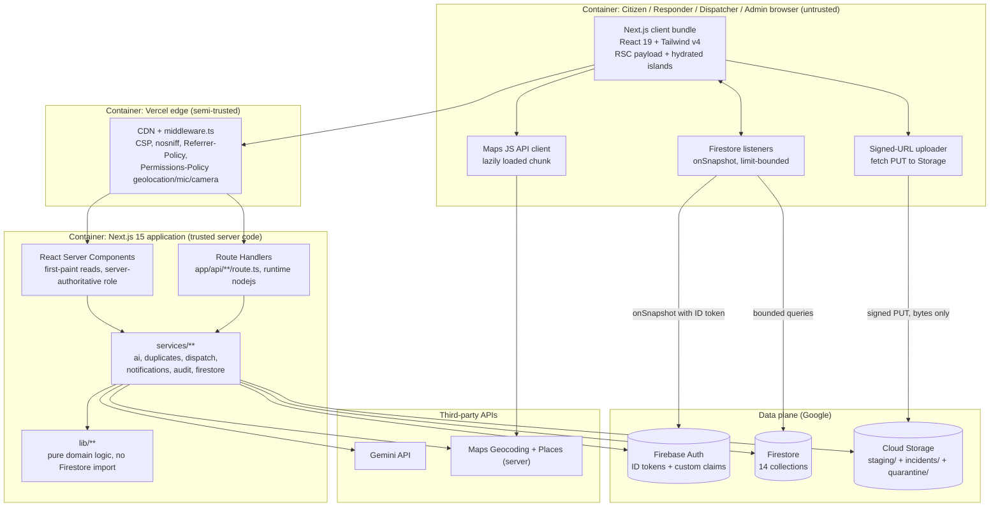

### 2.2 Container catalogue

| # | Container | Technology | Runs where | Trust | Owns |
| --- | --- | --- | --- | --- | --- |
| C1 | Client bundle | Next.js client components, React 19, Tailwind v4, shadcn/ui | User device | **Untrusted** | Presentation, local state, draft persistence, optimistic UI, media capture, geolocation capture, the responder action queue |
| C2 | Firestore listeners | `firebase` v11 `onSnapshot` | User device | Untrusted (but authorised by the ID token + rules) | Live queue, map layer, notification bell, responder assignments, own responder location write |
| C3 | Signed-URL uploader | `fetch` with `PUT` | User device | Untrusted | Transferring bytes to Storage and nothing else. Never touches the API contract |
| C4 | Maps JS client | Maps JavaScript API via `@vis.gl/react-google-maps` | User device | Untrusted | Rendering. Issues no business decision |
| C5 | Edge / middleware | Vercel CDN + `middleware.ts` | Vercel edge | Semi-trusted | Security headers, coarse routing, bot/liveness checks. **No business logic, no data access** |
| C6 | React Server Components | Next.js 15 RSC | Vercel function | Trusted | First-paint data reads, `no-store` discipline, per-resource `permissions[]` computation |
| C7 | Route Handlers | `app/api/**/route.ts`, `runtime = 'nodejs'` | Vercel function | **Trusted — the security boundary** | Auth, CSRF, rate limit, Zod validation, orchestration, transactions, audit, error envelope |
| C8 | Domain library | `lib/**` | Vercel function (and client where pure) | Trusted | Pure functions: haversine, jaccard, `classifyDuplicate`, lifecycle table, `riskScore`, `sanitize`, enums. **Zero Firestore imports** |
| C9 | Services | `services/**` | Vercel function | Trusted | All side effects: Admin SDK, Gemini, Storage moves, notification fan-out, audit writes |
| C10 | Firebase Auth | Google | Google | External | Identity and the role claim mirror |
| C11 | Firestore | Google | Google | External | The single datastore (DEC-15) |
| C12 | Cloud Storage | Google | Google | External | Evidence bytes, staging area, quarantine |
| C13 | Gemini API | Google AI Studio | Google | External, untrusted output | Triage |
| C14 | Maps server APIs | Google | Google | External | Reverse geocoding, place details |

---

## 3. Layers

### 3.1 Layer model

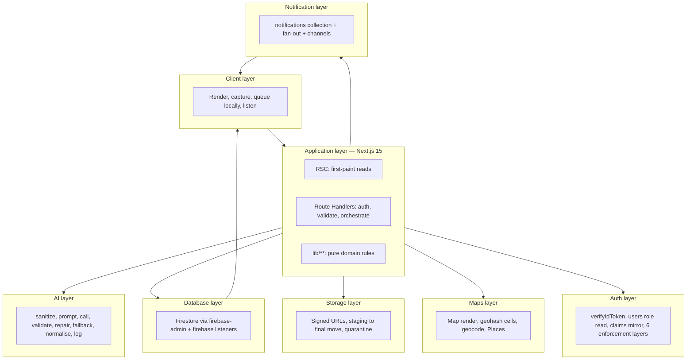

**Layering rule:** a layer may call *downward* only. `lib/**` calls nothing external. `services/ai` may not call `services/notifications`. The Notification layer is the only layer that fans out, and it is never called synchronously by another layer — it is invoked fire-and-forget (FR-107).

### 3.2 Client layer

| | |
| --- | --- |
| **Responsibilities** | Render every role surface; capture report input (text, image, voice); capture geolocation on explicit user action only (FR-030); persist a draft locally (FR-014); hold the responder offline action queue; run Firestore listeners within their `limit()`s; apply optimistic updates with visible rollback (FR-076); render degradation states (map failure, AI pending, offline, SLA breach) |
| **Technologies** | React 19, Next.js client components, Tailwind v4, shadcn/ui + Radix, Recharts (analytics only), `firebase` (listeners + Auth session), `@vis.gl/react-google-maps` (lazy), `navigator.geolocation`, `MediaRecorder`, IndexedDB/localStorage, sonner |
| **Must NOT** | (1) Read or write a role from anywhere but the server-computed `permissions[]` and never send a role ([22](./22_USER_ROLES_PERMISSIONS.md) §2). (2) Import `lib/env.ts` or any server secret ([21](./21_ENVIRONMENT_VARIABLES.md) §1 rule 3). (3) Write an incident status, an urgency, a merge, or a role — those are server-only. (4) Establish a listener without a `limit()` (FR-092). (5) Establish a listener on the login, marketing, or public tracking pages (FR-095). (6) Interpolate user content into HTML or into a Gemini prompt. (7) Poll. (8) Assume `slaState` computed client-side is authoritative — it is computed server-side (US-025 criterion 3). (9) Upload file bytes through the API (FR-007) |
| **Failure modes & degradation** | *Offline*: listeners report an error; a "Reconnecting…" banner appears (FR-094); the responder action queue buffers and replays in order (US-014); the citizen's draft survives (FR-014). *Maps script fails*: the map is replaced by the static list fallback with coordinates plus "Retry map" (FR-085). *`MediaRecorder` absent*: voice option hidden, text alternative shown. *Geolocation denied*: inline non-blocking message with three options — drop a pin, type an address, or continue without location (FR-033). *Bundle too heavy*: route-level dynamic imports; the report route must stay ≤ 140 KB gzip ([26](./26_PERFORMANCE_REQUIREMENTS.md) §2.2 B-2) |
| **Worst case** | A fully degraded client can still **report an emergency in text with a manually dropped pin** and **track its own report**. That is the floor we design to |

### 3.3 Application layer (RSC + Route Handlers)

| | |
| --- | --- |
| **Responsibilities** | The only place authorization decisions are made. Pipeline for every protected route, in this exact order: header → `verifyIdToken` → `users/{uid}` read → role resolution + claim cross-check → status gate → CSRF origin check → rate limit → Zod validation of body/query/**params** → orchestration → transaction → audit → envelope ([08](./08_API_SPECIFICATION.md) §1.6). Also: first-paint reads via RSC; per-resource `permissions[]`; `requestId` generation and propagation; `no-store` on user data; signed-URL issuance and magic-byte verification; notification fan-out; cron endpoints; CSV export |
| **Technologies** | Next.js 15 App Router, `runtime = 'nodejs'`, `firebase-admin` v13, `@google/genai`, Zod 4, `AbortSignal.timeout` (20 s AI / 8 s Maps / 5 s Firestore), Vercel functions |
| **Must NOT** | (1) Perform a Firestore, Storage, Maps, or Gemini call **before** Zod validation passes (FR-142). (2) Trust a role from the request body, query, or a header. (3) Trust a client-declared `contentType` (FR-008). (4) Trust a `storagePath` that was not issued to this uid within 30 minutes (FR-007). (5) Return a 403 where a 404 is required for a read of a resource the caller may not see (no existence oracle, US-005). (6) Return a stack trace or an internal id in an error body. (7) Interpolation of user input into a Firestore field path, a Storage path, a prompt string, or HTML ([08](./08_API_SPECIFICATION.md) §12.8). (8) Block or fail a request because a notification channel failed (FR-107). (9) Return HTML with interpolated data. (10) Return cached user data |
| **Failure modes & degradation** | *Firestore unavailable*: `DB_UNAVAILABLE` (503) after retries. *Gemini unavailable*: invisible — R1/ADR-014. *Maps server API unavailable*: `placeName` left null, incident still created. *Storage unavailable*: `STORAGE_UNAVAILABLE` (503) on sign/finalize; text-only reports unaffected. *Function cold start*: one-time latency on the first request after idle; the load plan in [26](./26_PERFORMANCE_REQUIREMENTS.md) §11 measures with warm-up excluded and documented. *A bug in a route handler*: caught by layers 4–5 (Firestore/Storage rules) and 6 (audit), per [22](./22_USER_ROLES_PERMISSIONS.md) §6 |
| **Worst case** | A dispatcher action is rejected with a catalogue code, a `requestId`, and a `sonner` toast with a retry affordance (FR-098). No screen is ever left in a half-mutated state, because optimistic updates roll back visibly (FR-076) |

### 3.4 AI layer

See [09](./09_AI_GEMINI_SPECIFICATION.md) for the normative prompt, schema, and safety rules. Architecture summary in §5.

| | |
| --- | --- |
| **Responsibilities** | Convert one report into the fixed `aiTriageOutputSchema` record. Own: sanitisation (the prompt-injection boundary), prompt construction, the Gemini call with `responseSchema`, Zod validation, exactly one repair attempt, deterministic fallback, `applySafetyRules` R1–R10, normalisation into `incidents.*` fields, and an `aiRuns` telemetry row per attempt |
| **Technologies** | `@google/genai`, `gemini-2.5-flash`, Zod 4, `crypto` SHA-256, `AbortSignal.timeout(20_000)` |
| **Must NOT** | (1) Dispatch, call, SMS, or alert any external service. (2) Configure tools/function calling at all. (3) Change lifecycle state beyond `new → triaged` — the AI output has no status field. (4) Verify, assign, resolve, close, or cancel. (5) Emit a coordinate, address, or a diagnosis. (6) Return `peopleAffected` other than an explicitly stated number or `null`. (7) Store raw model text or a prompt in `aiRuns`. (8) Send street-level location to the model. (9) Retry on a 400. (10) Escalate to a larger model after a failed repair |
| **Failure modes & degradation** | Every failure path terminates in the keyword fallback, whose confidence never exceeds 0.55 — so a fallback incident **always** carries `low_confidence` and displays "Needs review" (FR-024). A prompt-blocked report is forced to at least `high` urgency because someone describing something frightening enough to trip a filter needs a human. Quota exhaustion short-circuits before the network call |
| **Worst case** | An incident is created with `status: new`, `urgency: medium`, `triageSource: 'fallback'`, `triageError` recorded, and a dispatcher-visible "needs review" badge. **The report is never lost** (FR-029) |

### 3.5 Database layer

| | |
| --- | --- |
| **Responsibilities** | Own all durable state across 14 collections ([07](./07_DATABASE_SCHEMA.md) §1). Enforce the conventions: camelCase, `Timestamp` in UTC, absence ≠ null except where the contract says null, soft delete with `deletedAt`, subcollections for unbounded data, denormalised counters maintained in the same transaction, `schemaVersion` on documents |
| **Technologies** | Firestore Native mode; `firebase-admin` v13 server-side; `firebase` v11 listeners client-side; 11 composite indexes on `incidents` plus per-collection composites |
| **Must NOT** | (1) Store a document that grows without bound in `incidents` — use a subcollection (1 KB write-cost rule). (2) Accept a client write to `users`, `incidents` status/assignment fields, `dispatches`, `statusHistory`, `aiRuns`, or `auditLogs`. (3) Let an audit log be updated or deleted by anyone, including admin (FR-131). (4) Run a query without `deletedAt == null` in a default path ([07](./07_DATABASE_SCHEMA.md) §12.4). (5) Run a query without a `limit()`. (6) Perform a two-field range query (Firestore allows one inequality). (7) Combine `array-contains` with `in` without the composite index that exists for it. (8) Rely on TTL deletes for correctness — they fire "within 24 h of `expiresAt`". (9) Assume a transaction body can have side effects: it silently retries up to 5 times, so every body must be idempotent |
| **Failure modes & degradation** | *Quota exhausted*: `RESOURCE_EXHAUSTED` → `DB_UNAVAILABLE` (503). *Missing composite index*: the query fails loudly in development; deployment must ship `firestore.indexes.json` first. *Contention*: transactions retry; idempotency is what makes that safe. *Clock skew between clients*: `receivedAt` is always set by the server, and `responderLocations.stale` is computed against server time, not device time |
| **Worst case** | The application layer answers 503 with a retry affordance, and the read-heavy surfaces (dashboard KPIs) are the only things that visibly thin out |

### 3.6 Storage layer

| | |
| --- | --- |
| **Responsibilities** | Store, verify, relocate, and serve evidence. Issue 15-minute signed write URLs into `staging/{uid}/{mediaId}.{ext}`; verify bytes by magic-byte sniffing and measured size; move the object to `incidents/{incidentId}/{reports|supplements}/{reportId}/{mediaId}.{ext}`; issue 15-minute signed **read** URLs only for `scanStatus == 'clean'` media the caller may see; quarantine on delete; sweep orphans |
| **Technologies** | Cloud Storage for Firebase; `firebase-admin` `getSignedUrl`/`copy`/`delete`; Storage rules; Node `crypto` for SHA-256 |
| **Must NOT** | (1) Trust the client-declared MIME type (FR-008). (2) Issue a public or unauthenticated media URL. (3) Permit any client read or write under `incidents/**` or `quarantine/**` — those paths are `allow read, write, delete: if false` in Storage rules. (4) Let an unclaimed staging object live longer than `STAGING_UPLOAD_SWEEP_MIN=30`. (5) Hard-delete evidence inside a request; deletion moves to `quarantine/` and is purged later. (6) Persist reporter street-level address derived from reverse geocoding unless the reporter supplied it (FR-035) |
| **Failure modes & degradation** | *Upload fails*: per-file retry with progress; other files and the text are preserved (US-002). *Oversize*: rejected at sign time with `UPLOAD_TOO_LARGE` before any bandwidth is spent. *Signature mismatch*: the item is dropped; if that leaves no evidence and no text, `EMPTY_REPORT` (422). *Storage outage*: `STORAGE_UNAVAILABLE` (503); text-only reporting continues. *Orphan*: swept by `sweep-staging-uploads` |
| **Worst case** | An incident exists with text and no evidence, and `evidenceCount: 0`, honestly |

### 3.7 Maps layer

| | |
| --- | --- |
| **Responsibilities** | Render the live incident and responder map; the 500 m duplicate-radius ring; marker styling by urgency and status; viewport-bounded data queries; manual pin drop; debounced place search; geohash cell derivation for viewport queries |
| **Technologies** | `@vis.gl/react-google-maps`, Maps JavaScript API, Places Autocomplete + Details, Geocoding API (server), `ngeohash`, `NEXT_PUBLIC_GOOGLE_MAPS_*` and `GOOGLE_MAPS_SERVER_KEY` |
| **Must NOT** | (1) Be in the initial bundle of `/dashboard` (FR-086). (2) Issue a geocoding request per keystroke — debounce ≥ 300 ms (FR-087). (3) Request an unbounded viewport: ≤ 500 m or ≤ 25 documents (FR-037); per [07](./07_DATABASE_SCHEMA.md) §12.5, ≤ 150 incidents, ≤ 9 cell queries, ≤ 25 km span. (4) Show citizen report locations to other citizens (FR-088). (5) Show `offline` responders by default (FR-081). (6) Derive a `placeId` or coordinates from an AI output. (7) Assume `in` can be combined with `array-contains` — it cannot, which is why a viewport is up to 9 sequential reads |
| **Failure modes & degradation** | *Script fails to load*: the map is replaced by a static list with coordinates and a "Retry map" action (FR-085). *Key rejected (`REQUEST_DENIED`)*: same fallback, plus an admin-visible alert — this usually means a missing restriction, which is a security finding ([24](./24_THREAT_MODEL_SECURITY.md) T-14). *Quota overage*: **this costs money** — the one real cost risk ([02](./02_TECHNICAL_REQUIREMENTS_DOCUMENT.md) §7.5). *WebGL unavailable*: the map canvas degrades; the list fallback remains |
| **Worst case** | A dispatcher sees a table of incidents with coordinates, urgency, and age. The product still works; it is simply less spatial |

### 3.8 Notification layer

| | |
| --- | --- |
| **Responsibilities** | Fan out the 12 controlled `NotificationType` values per the dispatch matrix in [07](./07_DATABASE_SCHEMA.md) §10.2. Guarantee exactly one notification per `dedupeKey` (FR-108). Enforce `recipientUid == token.uid` on every read and read-flag write. Optional out-of-band channels behind a `NotificationChannel` interface with **no provider implemented** (FR-105, FR-106) |
| **Technologies** | The `notifications` Firestore collection; a client listener for the bell; a `NotificationChannel` interface with an in-app implementation; `NOTIFICATION_RETRY_LIMIT=2` |
| **Must NOT** | (1) Block or fail the originating API call (FR-107). (2) Accept a `recipientUid` parameter on any read endpoint. (3) Emit a notification for a state a human did not cause without a documented rule (e.g. `sla_breached` is emitted exactly once per incident, not once per render — US-025 criterion 2). (4) Render HTML in a title or body. (5) Delete a notification — it is soft-expired via `expiresAt` ([08](./08_API_SPECIFICATION.md) §6.5). (6) Implement an SMS/WhatsApp provider (no credentials exist, and none should) |
| **Failure modes & degradation** | *Channel failure*: logged, retried at most twice, never surfaced to the caller. *Listener error*: the bell shows its last known state plus a reconnect indicator. *Fan-out volume spike*: a `critical` incident notifies all dispatchers; this is bounded by the number of dispatchers (10 per NFR-008) |
| **Worst case** | A dispatcher sees a stale bell. The incident queue and the map are unaffected — they are separate data paths |

### 3.9 Auth layer

| | |
| --- | --- |
| **Responsibilities** | `verifyIdToken`; the authoritative `users/{uid}` read; role/claim cross-check with `ROLE_MISMATCH` drift detection; the `status != 'active'` gate; resource-level (Gate 2) authorization; field-level redaction in the response serialiser; the six enforcement layers in [22](./22_USER_ROLES_PERMISSIONS.md) §6; `auth.*` audit events; custom-claim synchronisation and the `roleChangePending` retry marker |
| **Technologies** | `firebase-admin` `auth`, Firestore `users`/`profiles`, custom claims, `getIdToken(true)` on the client, Firestore + Storage rules |
| **Must NOT** | (1) Trust a role from the client, ever. (2) Return 403 where the caller must not learn that a resource exists (404 instead). (3) Allow an admin to change their own role (`SELF_ROLE_CHANGE_FORBIDDEN`) or disable themselves (`SELF_DISABLE_FORBIDDEN`). (4) Allow any role to delete an audit log — no endpoint exists and rules deny it (FR-131). (5) Let a responder see `reporterUid`, `reporter.displayName`, `locationText`, or `reports[].text` (FR-068). (6) Treat the custom claim as authoritative. (7) Skip the `Origin`/`Referer` check on a non-GET request |
| **Failure modes & degradation** | *Claim drift* → `403 ROLE_MISMATCH` plus an audit entry. **Fail-closed by design**: the correct outcome for a mismatch is to refuse, not to guess. *`roleChangePending = true`* → the response is `202` and the affected user is told to refresh their token. *Suspended user* → `403 ACCOUNT_UNAVAILABLE`; all privileged data reads are server-mediated, so an un-expired token cannot read dispatcher data. *Firebase Auth outage* → no new sign-ins; existing sessions continue until token expiry |
| **Worst case** | A user is locked out of privileged features until they refresh their token. The system stays safe |

---

## 4. Component view of the Next.js application

### 4.1 Component diagram

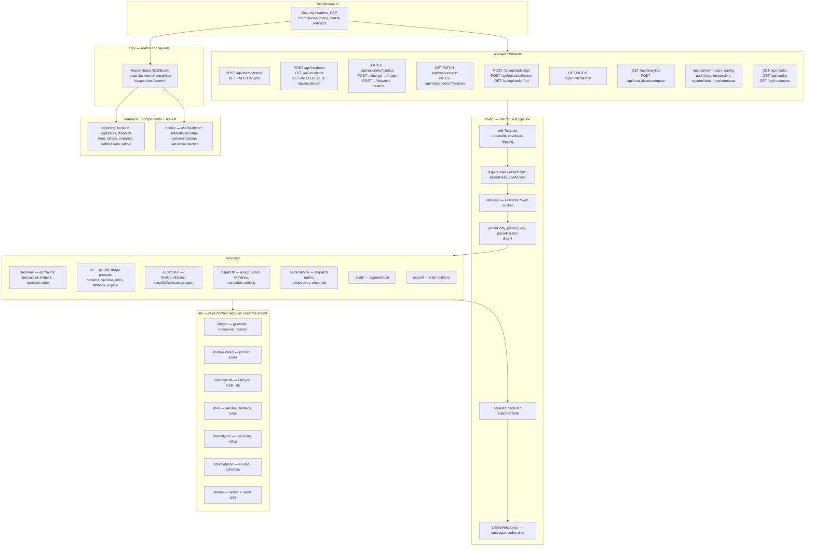

### 4.2 Component catalogue

| Group | Responsibility | Rule |
| --- | --- | --- |
| `app/**` | Routes, layouts, `route.ts` handlers, `loading.tsx`, `error.tsx` | Every `route.ts` declares `export const runtime = 'nodejs'` ([08](./08_API_SPECIFICATION.md) §1.1) |
| `middleware.ts` | Security headers, CSP, `Permissions-Policy`, coarse unauthenticated redirects | Contains **no** data access and **no** authorization decisions — role checks are in the route handlers and RSC |
| `lib/api/**` | The request pipeline: `withRequest` wrapper, `requireUser`, `assertRole`, `assertResourceAccess`, `rateLimit`, Zod parsers, serialisers, error mapping | The pipeline order is normative ([08](./08_API_SPECIFICATION.md) §1.6). A route that skips a step is a defect |
| `lib/**` domain | Pure functions | **No Firestore import.** This is what makes FR-049's "pure and unit-testable" requirement enforceable |
| `services/**` | All side effects | `services/ai` may not call `services/notifications`; notification fan-out is always fire-and-forget |
| `features/**` | Vertical slices, each with its own components, hooks, and validation | No component in `features/` or `components/` exceeds 400 lines (NFR-024) |
| `hooks/**` | `useRealtime*` (the listener factory), `useMediaRecorder`, `useGeolocation`, `useResilientAction` (optimistic + queue + rollback) | The listener factory is the single place listener limits and unsubscribe are enforced (FR-091, FR-092) |
| `scripts/**` | `seed.ts`, `create-admin.ts` | Guarded by `NODE_ENV !== 'production'` **and** `ALLOW_SEED=true` (FR-147) |

---

## 5. AI layer architecture

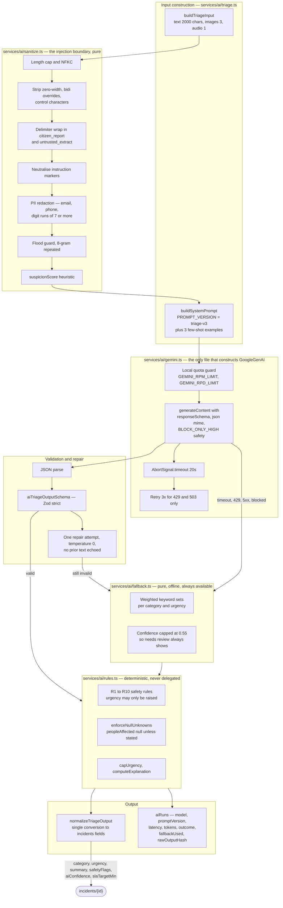

### 5.1 Pipeline contract

| Step | Function | Failure behaviour | Recorded in `aiRuns` |
| --- | --- | --- | --- |
| Build input | `buildTriageInput` | Non-fatal; empty media | `inputChannels`, `mediaCount`, `inputChars` |
| Sanitise | `sanitize` | Never fails; it only reduces | `floodGuardApplied` via metadata, `suspicionScore` |
| Quota guard | local RPM/RPD | **Short-circuits without a network call** | `outcome: 'error'`, `errorCode: 'AI_QUOTA'` |
| Call | `generateContent` | 20 s timeout, 3 retries for 429/503 | `latencyMs`, `promptTokens`, `responseTokens`, `finishReason` |
| Parse + validate | Zod `.strict()` | 1 repair attempt | `outcome: 'validation_failed'`, `attempt` |
| Repair | second call, temperature 0 | Then fallback. No escalation to a larger model | `attempt: 2`, `rawOutputHash` |
| Safety rules | `rules.ts` R1–R10 | Cannot fail; pure | `hallucinationFiltered` for R8 |
| Fallback | `fallback.ts` | Cannot fail; pure and offline | `fallbackUsed: true`, `fallbackKind: 'keyword_rules'` |
| Normalise | `normalizeTriageOutput` | Cannot fail | — |
| Log | `logAiRun` | Best-effort; a logging failure never fails the report | every field above |

### 5.2 What the AI layer is structurally incapable of doing

This is deliberate architecture, not policy:

1. **No outbound capability.** No tool or function is configured, so the model cannot call anything. There is no telephony integration anywhere in v1 ([09](./09_AI_GEMINI_SPECIFICATION.md) §1.2).
2. **No status field.** The output schema has no status key, so there is no value the model could return to move an incident.
3. **No location field beyond an approximation.** `location_hint` is free text ≤ 120 chars, is not stored on the incident, and is never treated as evidence.
4. **No unbounded confidence.** `AI_CONFIDENCE_REVIEW_THRESHOLD=0.6` gates the review badge; the fallback caps at 0.55; R7 caps a suspicious report at 0.4.
5. **No path from AI output to `dispatches`.** The dispatch route is `dispatcher`/`admin`-only and requires `responderUid` chosen from a human-reviewed ranked list.

---

## 6. Data flows between components

Full end-to-end diagrams are in [23 Data Flow Diagrams](./23_DATA_FLOW_DIAGRAMS.md). This section states, in prose, what crosses between **every pair** of major components, with the diagram for the non-obvious pairs.

### 6.1 Client ↔ Application (RSC first paint)

Prose: the browser requests a route with cookies/session. Vercel edge applies security headers. Next.js renders the Server Component tree on the server. Each server component that needs data calls `requireUser()` (Admin SDK token verification + `users/{uid}` read) and then a bounded query. HTML + the RSC payload stream back; only the interactive islands hydrate. **There is no API round-trip before first paint** — that is the NFR-001 lever. The client never learns a role it did not get from the server.

### 6.2 Client ↔ Application (mutation)

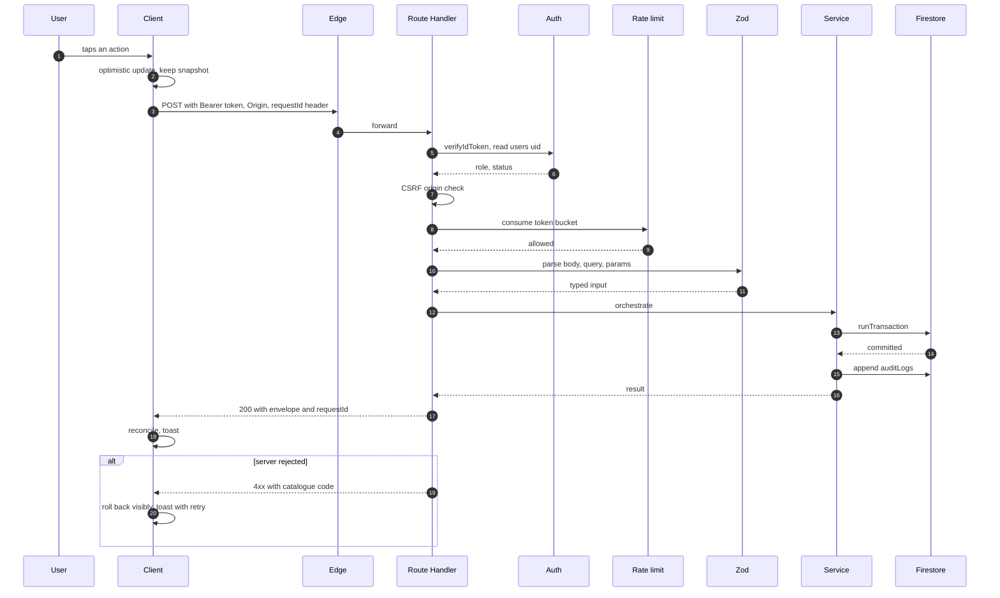

### 6.3 Application ↔ Database

Prose: **all** durable reads and writes go through `services/firestore/*` using `firebase-admin`. The client SDK writes to exactly three things, each rule-locked: the citizen's own `profile`, the responder's own `responderLocations` heartbeat, and the `read` flag on their own notification ([07](./07_DATABASE_SCHEMA.md) §2). Multi-document invariants are `runTransaction` bodies with a ≤ 20 write/second ceiling and a 500-doc `writeBatch` cap; bulk operations are chunked. Every default query includes `deletedAt == null`.

### 6.4 Application ↔ AI

Prose: called **only** from `POST /api/incidents` (and `POST /api/incidents/:id/triage` for a deliberate re-run). The 20 s budget is inside an 8 s p95 expectation, and the whole step is wrapped so that no throw can reach the client. The `aiRuns` row is written **outside** the incident transaction, because a write to a different document must not be able to roll back the incident.

### 6.5 Application ↔ Storage

Prose: the API never accepts file bytes. It issues a scoped, expiring write URL; the client PUTs; the API verifies by reading the first 4 KiB and the actual object size; on `POST /api/incidents` the API moves the object to its final path. Reads are always fresh 15-minute signed URLs issued after a resource-level authorization check. There is no public media URL in the entire system.

### 6.6 Application ↔ Maps

Prose: three distinct paths. (a) *Client-side render* — the Maps JS API loads in a lazy chunk, makes no calls to our server. (b) *Place search* — client-side, debounced ≥ 300 ms. (c) *Server-side geocoding* — `GOOGLE_MAPS_SERVER_KEY`, 8 s timeout, used for reverse geocoding a `GeoPoint` into `placeName` and for resolving an `address_text` location. The Maps layer **never** produces an authoritative location: coordinates come only from the device, a manual pin, or a supplied address (FR-031).

### 6.7 Application ↔ Notification

Prose: fan-out is invoked **after** the transaction commits and is never awaited by the request path. The deduplication contract is a transaction on `dedupeKey` (`type:recipientUid:incidentId:bucket`), so a replay produces exactly one notification (FR-108). The originating route's success is independent of the channel result (FR-107).

### 6.8 Application ↔ Auth

Prose: two calls on the happy path — `verifyIdToken` and a `users/{uid}` read — and one write on a role change. `verifyIdToken(token, true)` is used for revocation checks on the suspension path. A role change is Firestore-first, claim-second, with a `roleChangePending` marker and a `202` response on claim failure, because Auth custom claims are not transactional with Firestore ([07](./07_DATABASE_SCHEMA.md) §12.7).

### 6.9 Database → Client (realtime)

This is the only path where the database pushes to the client without the client asking for fresh data. See §9 for the listener lifecycle and the read accounting.

### 6.10 Client ↔ Storage (direct upload)

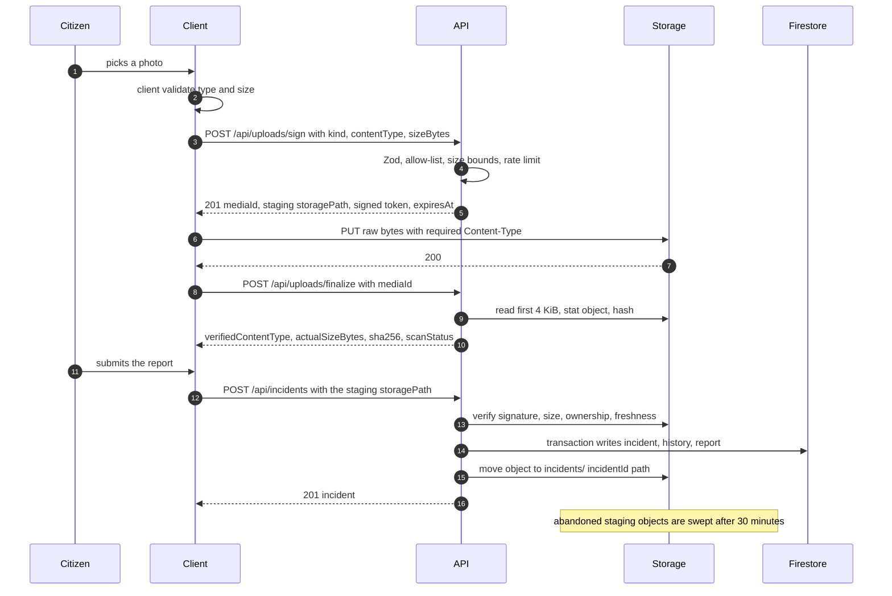

### 6.11 Client ↔ Auth (session establishment)

Prose: sign-up and sign-in happen **entirely client-side** through `firebase`; there is no `/api/auth/login` route ([08](./08_API_SPECIFICATION.md) §2). The client then calls `POST /api/me/bootstrap` to materialise `users/{uid}` (idempotent) and `GET /api/me` to obtain the server-computed `permissions[]` used for rendering affordances. Sign-out calls `POST /api/auth/event` best-effort and clears locally cached incident data (US-042 criterion 3).

### 6.12 AI ↔ anything else

Prose: **there are no edges out of the AI layer except back into the application layer.** This is the point. Gemini cannot reach the database, the notification layer, Storage, Maps, or any external system. The only outputs of the AI layer are validated fields written through `services/incidents` and an `aiRuns` telemetry row.

---

## 7. Trust boundaries

### 7.1 Trust boundary diagram

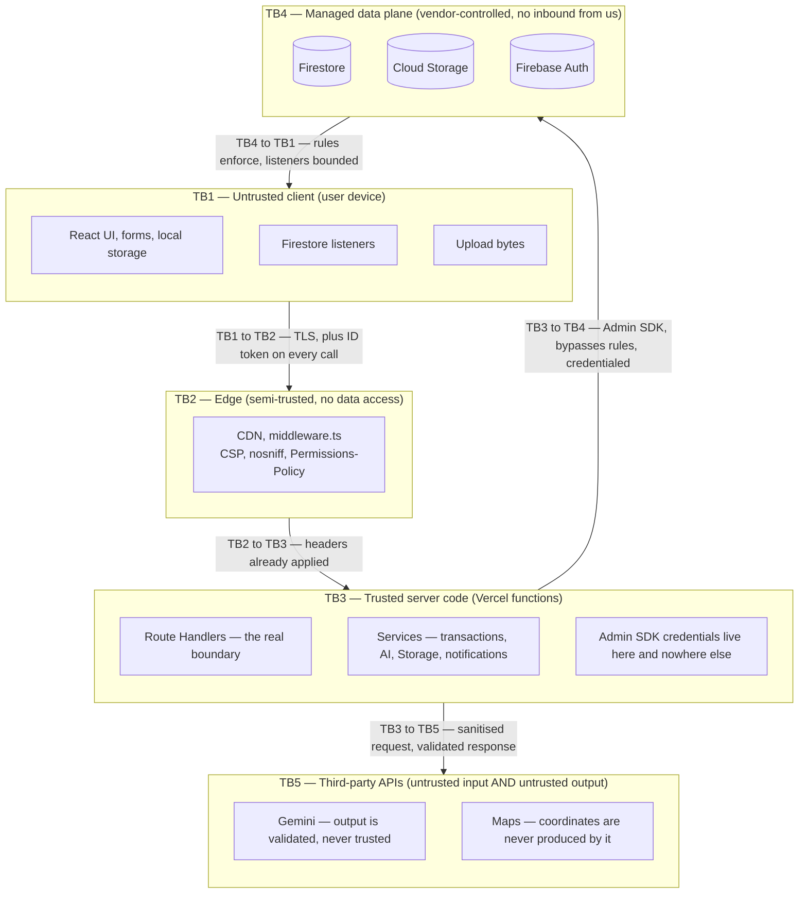

### 7.2 Boundary rules

| Boundary | Crossing direction | What may cross | What may **not** cross | Enforcement |
| --- | --- | --- | --- | --- |
| TB1 → TB2 | Request | A Firebase ID token, JSON body, query params, `Origin`, `Idempotency-Key` | Secrets; a role assertion; a file > 4.5 MB (rejected by the platform) | Middleware headers; validation at TB3 |
| TB2 → TB3 | Forward | The same request plus edge headers | Any pre-computed authorization decision | Middleware is intentionally logic-free |
| TB3 → TB4 | Read/write | Requests built by `services/**` from validated input | A Firestore field path containing user input; a Storage path not issued to this uid; a delete of `auditLogs` | Code review, `.strict()` schemas, `firebase-admin` credential scope |
| TB4 → TB1 | Push | Documents a listener query already selected, bounded by `limit()` and role rules | Any document the rules do not permit for that claim | Firestore + Storage rules (layers 4 and 5) |
| TB3 → TB5 | Request | Sanitised, size-capped, PII-redacted, delimiter-wrapped text and media | Street-level location; raw un-sanitised reporter text; a `tools` configuration | `services/ai/sanitize.ts` (pure, unit-tested) |
| TB5 → TB3 | Response | JSON that must pass `aiTriageOutputSchema` `.strict()` | Any value the schema does not name; any status, coordinate, or dispatch field | Zod `.strict()` + `rules.ts` R1–R10 |
| Client (TB1) → Firestore (TB4) | Direct | Own `profile`; own `responderLocations`; own notification `read` flag | Anything else — including all status, merge, dispatch, role, and audit writes | Security rules ([22](./22_USER_ROLES_PERMISSIONS.md) §7) |
| Client (TB1) → Storage (TB4) | Direct | `PUT` to its own `staging/{uid}/…` object, within a signed URL | Any read or write under `incidents/**` or `quarantine/**` | Storage rules; signed URL scope and TTL |

### 7.3 Data classification crossing the boundaries

| Class | Examples | Where it may go | Where it may never go |
| --- | --- | --- | --- |
| Credential | `FIREBASE_PRIVATE_KEY`, `GEMINI_API_KEY`, `GOOGLE_MAPS_SERVER_KEY`, `CRON_SECRET` | Server runtime only | The client bundle, the repository, a log line, a screenshot, an issue (NFR-013) |
| Public config | `NEXT_PUBLIC_*` | The client bundle | Treated as a secret (it is not) or trusted for authorization (it is not) |
| Reporter identity | `reporterUid`, `reporter.displayName`, `email`, `ipHash`, `locationText` | Owning citizen; dispatcher/admin | Any responder (FR-068, NFR-027) |
| Reporter location | `geo`, `geoCells`, `accuracyGrade` | Dispatcher/admin; assigned responder; the map for ops | Other citizens (FR-088) |
| Reporter text | `originalText` | Owning citizen; dispatcher/admin | A responder receives the AI `summary` instead; never the raw text |
| Responder location | `responderLocations/{uid}` | Dispatcher/admin | Citizens, and other responders (rules `allow read: if isDispatch()`) |
| Audit | `auditLogs/*` | Dispatcher (read-only), admin (read-only) | Any write; any delete, including by admin (FR-131) |
| AI telemetry | `aiRuns/*` | Dispatcher/admin | Citizens, responders beyond a redacted subset |
| Untrusted AI text | Model output | Validated fields only, after Zod + rules | Status, coordinates, dispatch, diagnosis |

---

## 8. Authentication and authorization flow

### 8.1 End-to-end authentication

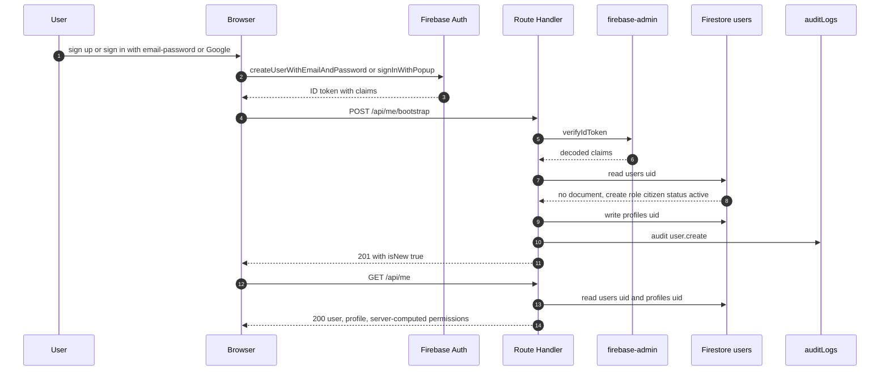

### 8.2 Per-request authorization, including the claim cross-check

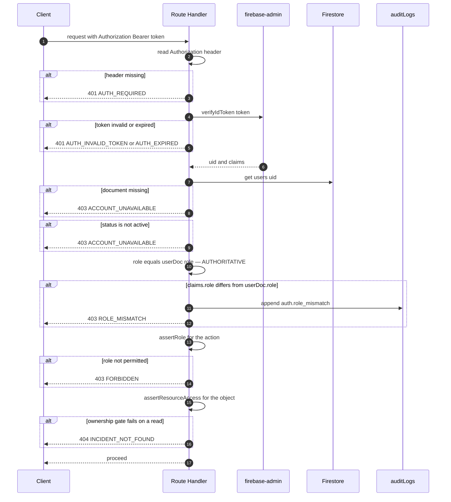

### 8.3 The role read is authoritative; the claim is a mirror

```
  users/{uid}.role   ◄── AUTHORITATIVE  (Admin SDK read, every request)
        │
        │ mirrored best-effort
        ▼
  Firebase Auth custom claim  { role }   ◄── consumed ONLY by Firestore/Storage rules
```

| Property | Behaviour |
| --- | --- |
| Read frequency | One `users/{uid}` read per protected request. Acceptable: it is one document, and it is what makes revocation and suspension immediate |
| Drift | A mismatch is `403 ROLE_MISMATCH` + an audit entry. **Fail-closed** |
| Update | `PATCH /api/admin/users/:id/role`: transaction writes `users.role` + `auditLogs.user.role_change`, then `setCustomUserClaims`. A claim failure sets `roleChangePending = true` and returns `202` |
| User-visible effect | The affected user must call `getIdToken(true)`. The UI shows "Your permissions changed — refresh to apply" |
| Guards | `SELF_ROLE_CHANGE_FORBIDDEN`, `SELF_DISABLE_FORBIDDEN`, `ALREADY_ROLE`, `REASON_REQUIRED` (≥ 10 chars), `ROLE_ESCALATION_GUARD` |
| Bootstrap | The first `admin` is created out of band by `scripts/create-admin.ts`. No endpoint can create the first admin ([22](./22_USER_ROLES_PERMISSIONS.md) §8.1) |
| Revocation | Suspension sets `users/{uid}.tokensValidAfter`; `verifyIdToken(token, true)` rejects older tokens. Documented residual risk: an un-expired token can still read its own user doc via rules, which is why all privileged reads are server-mediated |

### 8.4 The six enforcement layers

| Layer | Mechanism | A UI bug | A route-handler bug | Both |
| --- | --- | :-: | :-: | :-: |
| 1. UI affordance | `permissions[]` from `GET /api/me` and per-incident | caught | — | — |
| 2. API route | `requireUser` + `assertRole` + `assertResourceAccess` | — | caught | — |
| 3. Response shaping | Field-level redaction in `lib/api/serialize.ts` | — | caught | — |
| 4. Firestore rules | Claim + ownership + field allow-lists | — | caught | caught |
| 5. Storage rules | Path-derived ownership | — | caught | caught |
| 6. Audit log | Append-only record | — | — | caught (detected, not prevented) |

---

## 9. Realtime architecture

### 9.1 What is realtime and what is not

| Surface | Transport | Why |
| --- | --- | --- |
| Dispatcher live queue | Firestore `onSnapshot`, `limit(50)`, `status in [7]`, `orderBy updatedAt desc` | FR-090, FR-092 |
| Dispatcher KPI tiles | Derived from the same queue listener + a `responders` snapshot | Avoids a second poll (FR-078) |
| Map markers | Firestore `onSnapshot` per viewport cell query (≤ 9 cells, ≤ 150 docs) | FR-081, [07](./07_DATABASE_SCHEMA.md) §12.1 |
| Notification bell | `onSnapshot` on `where recipientUid == uid`, `orderBy createdAt desc`, `limit(50)` | FR-100 |
| Responder active assignments | `onSnapshot` on `dispatches where responderUid == self` | FR-067 |
| Analytics | **No listener. Ever.** Reads `analyticsDaily` rollups or a bounded live scan | FR-099 |
| Login, marketing, `/track` | **No listener** | FR-095 |

### 9.2 Listener lifecycle

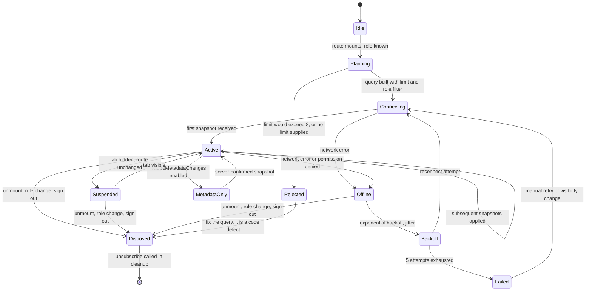

| State | What happens | Read cost |
| --- | --- | --- |
| `Connecting` | Firestore opens the stream and delivers the initial snapshot | **1 read per document in the result set** |
| `Active` | Snapshots applied; a change to a listened document costs 1 read; a document leaving the `limit()` window costs 1 read | Bounded by real change volume |
| `Offline` | Banner shown (FR-094); the snapshot is retained; no reconnect storm | 0 |
| `Backoff` | Exponential with jitter; the UI shows "Reconnecting…" | 0 |
| `Suspended` | Tab hidden: the listener stays attached (tearing down and re-attaching would re-pay the initial read) | 0 |
| `Disposed` | `unsubscribe()` in the effect cleanup. **Mandatory** | 0 |

### 9.3 Listener rules (normative)

| Rule | Requirement | Rationale |
| --- | --- | --- |
| L1 | Every listener query has a `limit()` | FR-092; also the single largest read-cost control |
| L2 | ≤ 8 concurrent listeners per client, per role | FR-091 |
| L3 | Unsubscribe on unmount **and** on role change | A citizen's tab must never remain subscribed to dispatcher data |
| L4 | The minimum role that needs the data is the minimum role that gets it | [07](./07_DATABASE_SCHEMA.md) §12.2 |
| L5 | `includeMetadataChanges: true` only where the UI distinguishes pending from server-confirmed writes | FR-093 |
| L6 | Never attach a listener to an unbounded collection | FR-092 |
| L7 | Never listen to `incidents` for analytics | FR-099 |
| L8 | No listener on login, marketing, or public tracking | FR-095 |
| L9 | All listener logic lives in `hooks/useRealtime*` so the rules are enforced in one place | ADR-009 |
| L10 | Server-mutated data is awaited (`await`) and its acknowledgement surfaces a toast with retry on failure | FR-098 |

### 9.4 Read accounting for a listener

```
attach cost  = number of documents in the first snapshot  (1 read each)
steady cost  = 1 read per changed document, per listener, per change
window cost  = 1 read per document that falls out of the limit() window
```

A `limit(50)` queue listener that sees 30 changes in an hour costs roughly 50 + 30 + (documents that aged out). This is why the dashboard does **not** re-attach the queue listener on filter change: filters are applied client-side to the already-attached 50-document window, and a filter that would need a new query is a deliberate, user-initiated `GET /api/incidents`.

**Honest note:** client-side filtering of a 50-document window means a dispatcher with more than 50 active incidents cannot see all of them in the live queue. The mitigation is the paginated `GET /api/incidents` for the full queue, plus the documented `duplicateMaxCandidates`/limit discipline. Flagged in §14.

---

## 10. Concurrency and consistency model

### 10.1 Vercel functions are stateless and concurrent

| Property | Consequence |
| --- | --- |
| No persistent process memory between invocations | An in-memory cache, queue, or rate-limit counter is **reset on every cold start** and **not shared between instances** |
| Many instances run in parallel for one user | Two clicks in 100 ms can land on two instances, both reading the same pre-state |
| Instances are recycled at any time | Anything held in a module-level variable must be treated as absent |
| No sticky sessions by default | Client SDK listeners use their own persistent channel, independent of the function instance |
| Function lifetime is bounded | Long work must be finished inside the route's timeout budget, or not done in the request at all |

**Therefore:** the only shared, durable, transactional state in this system is Firestore. Any correctness decision that matters is made there.

### 10.2 Why in-memory rate limiting fails here — concretely

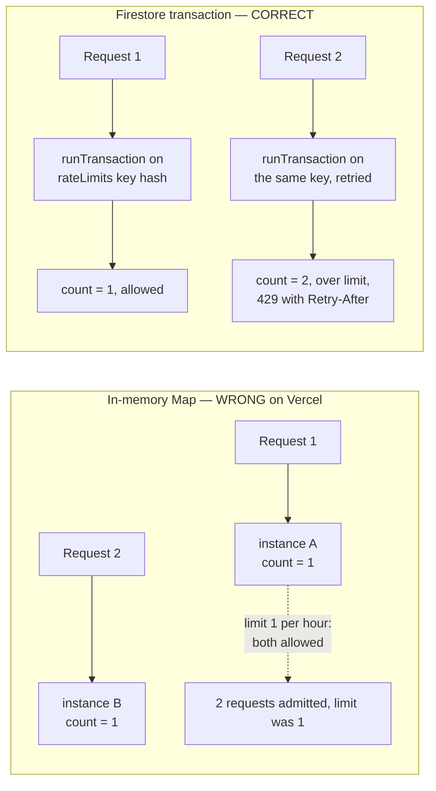

| Failure mode of `RATE_LIMIT_STORE=memory` | Consequence |
| --- | --- |
| Multiple instances | The effective limit is `limit × instanceCount`. FR-015's "5 per hour" silently becomes "5 per instance" |
| Cold start | The counter resets, so a user can burst immediately after an idle period |
| No cross-region/cross-function sharing | `/api/incidents` and `/api/incidents/:id/status` cannot share a budget even though FR-015 implies a per-user policy |
| No `Retry-After` accuracy | The server does not know when the window resets on another instance |
| Not testable | A rules/integration test cannot observe another instance's memory |

**Adopted:** the Firestore-backed token bucket in [07](./07_DATABASE_SCHEMA.md) §11.6. One document per `(uid, route, windowBucket)`, hashed doc ID so the ID does not leak a uid, `runTransaction` read-modify-write, `expiresAt` for TTL hygiene. Cost: **1 read + 1 write per limited request**, which is accepted and is in the write budget of [26](./26_PERFORMANCE_REQUIREMENTS.md) §6. `RATE_LIMIT_STORE=firestore` is set in [21](./21_ENVIRONMENT_VARIABLES.md) §2 and `memory` is documented as unsafe there.

### 10.3 Transaction inventory

| Operation | Documents read | Documents written | Notes |
| --- | --- | --- | --- |
| **Create incident** | `users/{uid}` (role/limits); ≤ 50 duplicate candidates | `incidents/{id}`; `incidents/{id}/statusHistory/created`; `incidents/{id}/reports/{reportId}` | `reference` uniqueness retried inside the loop. `aiRuns` is written **outside** |
| **Change status** | incident | incident; `statusHistory` | Transition table + role + assignment + `resolutionCode` all validated before the write |
| **Assign responder** | incident; `dispatches where incidentId && status in [active, accepted]`; `responders/{uid}` | new `dispatches/{id}`; incident `assigneeUid`; responder `status` + `activeIncidentCount`; `statusHistory` | Closes the previous active dispatch as `withdrawn` in the same transaction (FR-053) |
| **Merge duplicate** | both incidents | secondary merge fields; copied report into primary; primary counters; `statusHistory` on both; `auditLogs` | Copy-then-delete of the source report; `mergeUndoUntil` recorded in both history events' `metadata` |
| **Notification** | `notifications` by `dedupeKey` | one notification | Guarantees exactly one per key (FR-108) |
| **Rate limit** | one `rateLimits/{key}` | same document | 60 s window |
| **Role change** | `users/{uid}` | `users/{uid}.role`; `auditLogs.user.role_change` | Then `setCustomUserClaims` **outside** the transaction, with a `roleChangePending` marker |
| **Mark notifications read** | — | `writeBatch` of ≤ 200 | `BATCH_TOO_LARGE` (422) above that; the client pages |

### 10.4 Idempotency and optimistic concurrency

| Mechanism | Where | Why |
| --- | --- | --- |
| `Idempotency-Key` header | `POST /api/incidents` (required by the CSRF rule) | A replay returns the original `201` with `Idempotent-Replay: true` |
| `Idempotent` transitions | `PATCH .../status` | Repeating the same transition returns `200` with `meta.noop: true` |
| `Idempotent` dispatch | `POST .../dispatch` | Re-dispatching the same responder to the same incident returns the existing dispatch |
| `clientActionId` | `PATCH .../status` body | The responder's offline queue can safely replay |
| `dedupeKey` transaction | notifications | One notification per key regardless of retries (FR-108) |
| **Transaction bodies are idempotent** | every transaction | Firestore silently retries up to 5 times; a counter incremented twice is a data corruption bug ([07](./07_DATABASE_SCHEMA.md) §12.7) |
| Optimistic UI + visible rollback | client | FR-076; the snapshot is restored and a toast explains the rejection |
| `slaBreachedAt` set once, never cleared | status transitions | Prevents a second `sla_breached` notification for the same incident (US-025) |

### 10.5 Concurrent-conflict matrix

| Two actors do this simultaneously | Outcome | Why it is safe |
| --- | --- | --- |
| Two dispatchers assign different responders to one incident | Both may succeed; the second withdraws the first inside its own transaction; **one** active dispatch survives | FR-053's "at most one active assignment" is enforced inside the assignment transaction |
| A dispatcher verifies while a responder is assigned | The second transaction retries against the new state; the transition table decides | The table is re-evaluated on every retry, against freshly read state |
| A responder goes `en_route` while a dispatcher forces `closed` | One wins; the other gets `409 INVALID_STATUS_TRANSITION` with `details.allowed` | The loser's UI rolls back visibly (FR-076) |
| Two citizens report the same accident simultaneously | Both incidents are created; neither is auto-merged; duplicate detection is a *suggestion* | FR-041, FR-045 |
| A responder's heartbeat and a dispatch land together | Both are short transactions on different documents; no conflict | Heartbeat writes `responders.{status, lastLocationAt}`; dispatch writes `responders.{status, activeIncidentCount}` — the dispatcher transaction is authoritative and the heartbeat only sets `status` when the responder is `available`/`offline` |
| A role change lands while a claim write is in flight | Firestore role is authoritative, so the request either sees the old or new role; the claim mirror catches up, or `roleChangePending` is set | Claim is not part of the decision ([07](./07_DATABASE_SCHEMA.md) §12.7) |

---

## 11. Deployment architecture

### 11.1 Deployment diagram

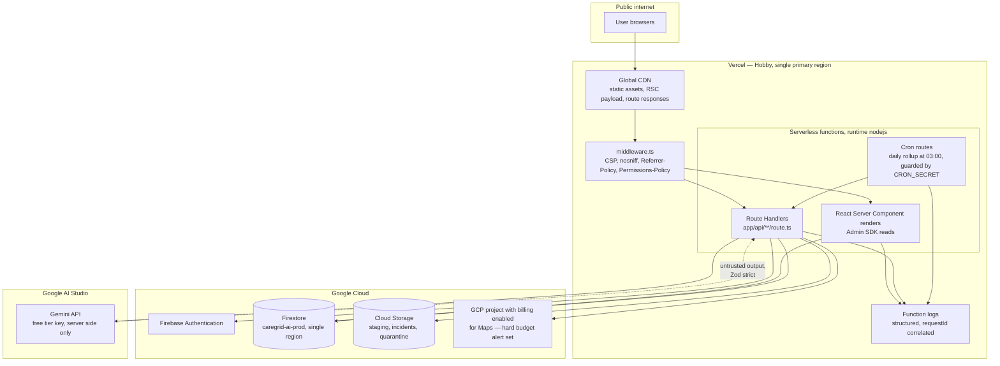

### 11.2 Topology

| Concern | Value | Note |
| --- | --- | --- |
| Hosting | Vercel Hobby | One deployable = UI + API (ADR-005, ADR-011) |
| Functions | Serverless, `runtime = 'nodejs'`, 1024 MB | Stateless; see §10.1 |
| Request body cap | 4.5 MB | Irrelevant to media (ADR-004) |
| Function max duration | Target 25 s for triage | `DECISION REQUIRED` DR-01 in [02](./02_TECHNICAL_REQUIREMENTS_DOCUMENT.md) §13.2 |
| Cron | `0 3 * * *` only (Hobby = once/day) | Daily `analyticsDaily` rollup. Risk recompute is admin-triggered; maintenance sweeps are admin-triggered |
| Firestore | Single region, matched to the Vercel region | ADR-001; verify both before the first deploy (DR-02) |
| Storage | Default bucket, `caregrid-ai-prod` | Three top-level prefixes: `staging/`, `incidents/`, `quarantine/` |
| Auth | Firebase Auth, email/password + Google | Roles as custom claims |
| Secrets | Vercel project environment per deploy target | Never in the repository; `.env.example` has placeholders only ([21](./21_ENVIRONMENT_VARIABLES.md) §1) |
| Headers | `vercel.json` + `middleware.ts` | CSP, `nosniff`, `Referrer-Policy`, `Permissions-Policy: geolocation=(self), microphone=(self), camera=(self)` |
| Logs | Vercel function logs | Structured, `requestId`-correlated (NFR-030) |
| Observability | `/api/health` (public) and `/api/admin/system/health` (admin) | Free; see [26](./26_PERFORMANCE_REQUIREMENTS.md) §10 |
| Deployment order | `firebase deploy --only firestore:indexes,firestore:rules,storage` **before** promoting the Vercel deployment | Indexes and rules are not covered by the Vercel rollback |
| Rollback | Vercel instant promote; Firestore artefacts redeployed with `firebase-tools` | Runbook item in [19](./19_DEPLOYMENT_DEVOPS.md) |

### 11.3 Network paths and egress

| From | To | Protocol | Carries | Notes |
| --- | --- | --- | --- | --- |
| Browser | Vercel | HTTPS | Pages, RSC payload, JSON API | The `GOOGLE_MAPS_SERVER_KEY`-style IP restriction depends on Vercel's documented egress ranges |
| Browser | Firebase | HTTPS (WebChannel) | Auth, listener streams | Uses the ID token, not our API |
| Browser | `firebasestorage.googleapis.com` | HTTPS `PUT` | Raw media bytes | Only ever to a `staging/{uid}/…` object via a signed URL |
| Vercel function | Firestore | gRPC/HTTPS | Every read and write | The dominant request count in the system |
| Vercel function | `aiplatform.googleapis.com` | HTTPS | Sanitised triage request | Key is server-only |
| Vercel function | `maps.googleapis.com` | HTTPS | Reverse geocode / place detail | IP-restricted key |
| Vercel → Gemini → Vercel | — | — | — | The **only** outbound path with untrusted response content, which is why it is validated twice |

---

## 12. Cost and quota interaction with architecture

### 12.1 Which architectural choices consume which quota

| Quota | Consumed by | Architectural control | Document |
| --- | --- | --- | --- |
| Firestore **reads** | RSC first paint, Route Handler queries, **listener attach and every change** | `limit()` everywhere; ≤ 8 listeners; `analyticsDaily` rollups; duplicate candidate cap of 50 | [26](./26_PERFORMANCE_REQUIREMENTS.md) §5 |
| Firestore **writes** | Every transaction; the rate-limit bucket (1 per limited request); `statusHistory`; `auditLogs` | One transaction per state change; history in a subcollection; rate-limit window of 60 s | [26](./26_PERFORMANCE_REQUIREMENTS.md) §6 |
| Firestore **stored data** | Incidents, reports, history, audit, notifications | Subcollections for unbounded data; soft delete; `expiresAt` TTL on `rateLimits` and `notifications` | [07](./07_DATABASE_SCHEMA.md) §2 |
| Storage **stored + egress** | Evidence bytes; **every signed read URL is an egress event** | 15-minute signed URLs instead of public objects; quarantine before purge | [08](./08_API_SPECIFICATION.md) §8.3 |
| Gemini **requests** | One call per accepted report, plus one repair on failure | Local `GEMINI_RPM_LIMIT`/`GEMINI_RPD_LIMIT` guard; audio off when headroom < 50%; mandatory fallback | [09](./09_AI_GEMINI_SPECIFICATION.md) §9.1 |
| Google Maps **loads** | One SDK load per map page view | Lazy chunk; the map is not on `/dashboard`; list fallback exists | [26](./26_PERFORMANCE_REQUIREMENTS.md) §7 |
| Google Maps **Geocoding/Places requests** | One reverse geocode per incident creation with a location; debounced search | 8 s timeout; `placeName` left null on failure; debounce ≥ 300 ms | [12](./12_MAP_LOCATION_SYSTEM.md) |
| Vercel **invocations** | Every Route Handler call | No polling anywhere; a Firestore listener costs zero Vercel invocations | FR-090, ADR-009 |
| Vercel **cron** | One per day | Only the daily rollup is scheduled | [21](./21_ENVIRONMENT_VARIABLES.md) §8 |
| Vercel **function duration** | The AI step is the longest | 20 s AI timeout inside a 25 s function budget | `DECISION REQUIRED` DR-01 |

### 12.2 The insight that shapes several ADRs

> **A Firestore listener costs zero Vercel invocations and 1 read per changed document. A REST poll costs 1 Vercel invocation **and** ≥ 1 read.** Polling is therefore *more* expensive on both axes, in addition to violating FR-090. This is the strongest single argument for ADR-009 and it is arithmetic, not preference.

The corollary is that **the read budget, not the compute budget, is the scarce resource.** Firestore is priced per operation; Vercel Hobby's function ceiling is orders of magnitude larger than the demo needs. Every performance decision in [26](./26_PERFORMANCE_REQUIREMENTS.md) is therefore a *read* decision.

### 12.3 Degradation ladder under quota pressure

Ordered from least to most severe. Each rung is a designed state, not an outage.

| Rung | Trigger | Response | User-visible effect | Cost effect |
| --- | --- | --- | --- | --- |
| 1 | Gemini quota > 50% consumed | `GEMINI_AUDIO_ENABLED=false`; text+image only | Slightly less rich triage on voice reports | None |
| 2 | Gemini quota exhausted | Local guard short-circuits; keyword fallback | "Needs review" badge on every new incident | None |
| 3 | Maps quota over free credit | Budget alert fires | Map degrades to the list fallback if we disable billing | **Possible charge** |
| 4 | Firestore reads approaching the daily allowance | Reduce viewport cell queries from 9 to 1; shorten the queue listener `limit()`; serve analytics from rollups | Map shows a coarser area; analytics lag | None |
| 5 | Firestore daily allowance reached | `RESOURCE_EXHAUSTED` → `DB_UNAVAILABLE` (503) | Reporting unavailable | None |
| 6 | Vercel function ceiling reached | Platform error | Whole app unavailable | Possible plan change needed |

Rungs 1, 2, 4 and the *designed part* of 3 are all reachable with a configuration change and require no code change. That is the point of putting them in the env layer ([21](./21_ENVIRONMENT_VARIABLES.md) §2) rather than in code.

---

## 13. Architectural decision records

Format: **Context → Decision → Consequences (good, bad, and what we accept)**. Status is *Accepted* for all of these; they are the locked decisions of [02](./02_TECHNICAL_REQUIREMENTS_DOCUMENT.md).

---

### ADR-001 — Single-region Firebase

**Context.** The demo is a single city. Latency to Firestore is on every request and every listener attach. Multi-region Firestore exists but costs roughly 2× per operation, which is unacceptable under the $0 constraint (C1), and buys nothing for a single-tenant product (PRD §9 excludes multi-tenant federation).

**Decision.** One Firestore region for the whole project, chosen to match the Vercel function region. No multi-region, no replicas, no regional routing.

**Consequences.**
- *Good*: half the per-operation cost, no cross-region replication latency, a single backup/restore story.
- *Bad*: a regional outage is a total outage. No failover.
- *Accepted*: NFR-011 already states 99.5% as a *design target* on free tiers, "best effort". Multi-region would not get us materially closer to a real availability SLO on a hobby budget.
- *Open*: the exact region pairing is `DECISION REQUIRED` DR-02 in [02](./02_TECHNICAL_REQUIREMENTS_DOCUMENT.md).

---

### ADR-002 — No SQL; Firestore is the only datastore

**Context.** Postgres + PostGIS is genuinely the better database for this product: real geo queries, real aggregation, real reporting. It was rejected on the $0 constraint (managed free tiers are credit-metered or time-boxed) and on maintenance cost (schema migrations, connection pooling from serverless, a second provider).

**Decision.** Cloud Firestore in Native mode as the single datastore (DEC-15). Emulate what it lacks rather than pretending it has it.

**Consequences.**
- *Good*: no migrations, no connection pool, one vendor, one set of credentials, free-tier-shaped, listeners built in.
- *Bad*: **no geospatial queries at all** — every distance filter is emulated (ADR-006). **No `GROUP BY`/aggregation** — analytics requires precomputed `analyticsDaily` rollups (FR-116). One inequality per query. Transactions retry silently, so every transaction body must be idempotent. Cost is per *operation*, so chatty reads are a real budget risk.
- *Accepted*: all four "bad" items are load-bearing in the design, not incidental. They are documented in [07](./07_DATABASE_SCHEMA.md) §9.1 and §12.7 and are the reason the read budget in [26](./26_PERFORMANCE_REQUIREMENTS.md) §5 exists.

---

### ADR-003 — No Redis; rate limits live in Firestore

**Context.** Every write endpoint must be rate limited (NFR-016). The obvious fast answer is an in-memory `Map` in the process; the obvious production answer is Redis.

**Decision.** A Firestore-backed token bucket: `rateLimits/{sha256(uid + route + windowBucket)}`, `runTransaction` read-modify-write, 60 s window, `expiresAt` for TTL hygiene. `RATE_LIMIT_STORE=firestore`. `RATE_LIMIT_STORE=memory` is documented as unsafe on Vercel.

**Consequences.**
- *Good*: no new service, no new credential, no cost; the counter is globally consistent across instances; the window is inspectable by an admin; it is testable against the emulator.
- *Bad*: **1 read + 1 write per limited request.** On the hottest route (`PATCH .../location`, 120/h per responder) that is a real cost line. Firestore transaction contention serialises per key, so a burst from one user queues.
- *Accepted*: the cost is quantified in [26](./26_PERFORMANCE_REQUIREMENTS.md) §6 and is small relative to the demo profile. The alternative — an in-process map — is **incorrect**, not merely slower: see §10.2. A managed Redis free tier would be metered and would add a network dependency to every write.

---

### ADR-004 — Direct-to-Storage signed uploads; file bytes never transit a function

**Context.** Evidence is up to 3 × 5 MB images plus 15 MB of audio (FR-005, FR-006). Vercel serverless rejects a request body over 4.5 MB. DEC-08 already recorded the constraint; this ADR records the architecture.

**Decision.** Three-step upload: (1) `POST /api/uploads/sign` returns a scoped, expiring signed write URL for `staging/{uid}/{mediaId}.{ext}`; (2) the client `PUT`s the raw bytes; (3) `POST /api/incidents` verifies by magic-byte sniffing and moves the object to `incidents/{incidentId}/{reports|supplements}/{reportId}/{mediaId}.{ext}`. The API never receives a file body.

**Consequences.**
- *Good*: the 4.5 MB limit becomes irrelevant. The function is never the bandwidth bottleneck. The service-account credential never leaves the server. Upload progress is real. Bytes do not appear in function logs or traces.
- *Bad*: three client steps instead of one. Orphan staging objects when a user abandons between steps. A "move" is copy+delete, so it is two Storage operations per file, not one. `storagePath` in the request body is a **staging** path, which is a slightly awkward contract.
- *Accepted*: `STAGING_UPLOAD_SWEEP_MIN=30` plus the `sweep-staging-uploads` maintenance job. The awkward contract is explicit in [08](./08_API_SPECIFICATION.md) §8.1. Media is **never** readable by a client SDK path; every read is a 15-minute signed URL issued after a resource-level authorization check.

---

### ADR-005 — Next.js Route Handlers, not Cloud Functions

**Context.** The API needs Node (`firebase-admin`, `@google/genai`), a per-request role read, a transaction, and consistent security headers.

**Decision.** All API routes are Next.js Route Handlers under `app/api/**/route.ts` with `export const runtime = 'nodejs'`. No Cloud Functions, no second deploy target.

**Consequences.**
- *Good*: one repo, one build, one deploy, one rollback unit, one `middleware.ts` for headers, one place where the auth pipeline lives. Zero configuration. `types: 'nodejs'` is a single line rather than per-function config.
- *Bad*: serverless function duration caps apply (the `DECISION REQUIRED` DR-01 risk). No long-running background work. Cold starts are real. The framework release train couples the API to Next.js releases.
- *Accepted*: the duration cap is managed by keeping the AI step inside a 20 s timeout and, if necessary, by making triage fire-and-forget after the incident write. Cloud Functions would solve neither the cold-start nor the two-platform problem as cheaply as it appears.

---

### ADR-006 — Geohash precision-6 `geoCells` with a single `array-contains` query, then Haversine

**Context.** FR-040 requires "compare against existing incidents within 500 m". Firestore supports no `near`, `geoWithin`, radius, or polygon query. This is a platform limitation, stated plainly in [07](./07_DATABASE_SCHEMA.md) §9.1.

**Decision.** Each incident stores `geoCells`: its geohash-6 plus its 8 neighbours — exactly 10 strings, which is the Firestore per-array-element index limit. Duplicate and viewport queries issue **one** `array-contains` query on the query point's own geohash-6 with `limit(50)`, then filter by exact Haversine distance in code.

**Consequences.**
- *Good*: one indexed query instead of nine. **Zero false negatives** for a 500 m radius, because every incident stores its neighbours' cells too. No extra infrastructure, no extra datastore, no cost beyond one array field of 10 short strings per document.
- *Bad*: a coarse candidate set — the cell is ~1.2 km × 0.6 km, so a query may return candidates up to ~1 km away that the Haversine filter then rejects. The `500 m` semantics are enforced in **our** code, not the database's, so a bug in `haversineM` is a correctness bug. `geoCells` is a stale risk: changing the location requires recomputing it (done server-side, always). The neighbour derivation relies on `ngeohash` behaviour that must be unit-tested.
- *Accepted*: the "bad" list is the cost of ADR-002. The exact neighbour derivation is `DECISION REQUIRED` DR-06 in [02](./02_TECHNICAL_REQUIREMENTS_DOCUMENT.md). The nearest-responder ranking has the same shape: fetch ≤ 60 available+verified responders, filter by Haversine + capability + load in `lib/geo/nearest.ts`.

---

### ADR-007 — Roles in Firebase Auth custom claims, mirrored from `users/{uid}.role`

**Context.** Four roles must gate both API access and Firestore Security Rules. NFR-015 requires that authorization use a server-verified token and never a client-supplied role.

**Decision.** `users/{uid}.role` is the **authoritative** source, read fresh on every protected request via `firebase-admin`. `setCustomUserClaims({ role })` mirrors it for Security Rules only. A mismatch is `403 ROLE_MISMATCH` plus an audit entry — fail-closed. The first admin is created out of band; no endpoint can create the first admin.

**Consequences.**
- *Good:* the claim is signed inside a token the client cannot forge, which is the only way a *client SDK* read can be role-gated. Security Rules stay simple and cheap. A role is one short string, far below the claim size limit.
- *Bad:* claim writes are **not transactional** with Firestore ([07](./07_DATABASE_SCHEMA.md) §12.7), so a role change can leave a pending marker. The user must call `getIdToken(true)` for the change to reach Security Rules. Claim drift causes a **403** for a legitimate user until they refresh, which is a support burden during a demo. Revocation is also imperfect: suspension rejects old tokens at the API layer, but an un-expired token can still read its own user doc via rules.
- *Accepted:* all of it, because the alternative — reading a `users` document inside a Security Rule on every access — is prohibitively expensive and impossible for a list query. The drift is surfaced in the UI ("Your permissions changed — refresh to apply") and `POST /api/admin/users/:id/reset-claims` exists for operators. Every privileged read is server-mediated, which is what makes the imperfect revocation acceptable.

---

### ADR-008 — Recharts, not D3

**Context.** FR-111 (category distribution), FR-112 (volume trends), FR-113 (a response-time histogram) are three chart forms on the analytics surface.

**Decision.** Recharts 3, imported only inside `features/analytics` and `features/dashboard` behind a dynamic import.

**Consequences.**
- *Good:* declarative SVG driven by plain arrays — the exact shape of `analyticsDaily` rollups and `GET /api/analytics`. Container-responsive. No chart state model to build. A donut and a histogram are configuration, not engineering.
- *Bad:* not the most accessible charting library out of the box — mitigated by a visually-hidden data table and an `aria-label` summary per chart, covered by axe (NFR-017). SVG performance degrades on very large series, which the 366-day API max span keeps bounded. Bundle cost, which is why it is dynamically imported.
- *Accepted:* D3 would give full control and is the correct tool for a bespoke visualisation. FR-111…FR-113 are not bespoke. Re-implementing scales, axes, tooltips, and transitions for three standard charts is exactly the kind of work a one-maintainer hackathon cannot afford.

---

### ADR-009 — React Server Components plus Firestore listeners; no client server-state library

**Context.** There are three sources of server data in this app: a Server Component read, a Route Handler response, and a Firestore listener. The instinct is to add Redux Toolkit Query, TanStack Query, SWR, or Zustand-for-server-state.

**Decision.** None of them. Server data is read once per request by a Server Component or returned by a Route Handler, and thereafter **pushed** by Firestore listeners. No second cache authority exists.

**Consequences.**
- *Good:* one source of truth — Firestore. No invalidation rules to get wrong. No cache-invalidation class of bug. Listeners cost **zero Vercel invocations** and 1 read per changed document, which is strictly cheaper than a poll on both axes (§12.2). Smaller bundle. FR-090's "without polling" is satisfied structurally.
- *Bad:* no request-level dedup or normalisation layer, so a component that re-renders may re-issue a read if it is not careful (mitigated by RSC rendering once per request and by `React cache` for intra-request dedup). Optimistic updates and offline replay must be hand-written (`useResilientAction`). Firestore listeners are a browser-only technology, so anything that needs data on the server uses an RSC read instead.
- *Accepted:* the cost of building `useResilientAction` (optimistic + rollback + offline queue + ordered replay) ourselves. It is ~200 lines and it implements FR-076, FR-094, and US-014 exactly, which a generic library would have needed configuring anyway.

---

### ADR-010 — Denormalised dispatcher queue row

**Context.** The dispatcher queue must render a row showing reference, category, urgency, verification badge, AI confidence, status, distance, reporter count, age/SLA, and assignee (FR-072) from a live listener within 3 s (FR-090).

**Decision.** Every field the queue needs lives on the `incidents` document itself: `assigneeUid`, `reportCount`, `linkedReportCount`, `aiConfidence`, `triageSource`, `slaTargetMin`, `verifiedAt`, `slaBreachedAt`, `searchTokens`. Nothing in the list row requires a join.

**Consequences.**
- *Good:* a queue row is **1 read**, so a 50-row live queue costs 50 reads on attach and 1 per change. `GET /api/incidents?limit=25` is exactly 25 reads. The listener needs no multi-collection join. Firestore document size does not grow because unbounded data (reports, history, resources) lives in subcollections.
- *Bad:* denormalised fields can drift. Mitigated by writing them **only inside the transaction that changes the source of truth** — `reportCount` in the merge transaction, `assigneeUid` in the dispatch transaction, `slaTargetMin` at creation and on urgency change. A partially-completed migration or a manual console edit could drift, which is why admin console edits are audited.
- *Accepted*: a "denormalisation contract" that every write site must respect, and a review checklist item. The alternative — a join in the client or a `collectionGroup` fan-out — would multiply the read cost of the most-used screen by 3–5× and blow the 4 000 reads/session-hour budget (NFR-007).

---

### ADR-011 — Vercel over a VPS

**Context.** A 3-container app plus a CDN. Options: Vercel Hobby, a small VPS with Docker and Caddy, Cloud Run, Firebase Hosting + Cloud Functions.

**Decision.** Vercel Hobby: one deployable, zero configuration, one rollback unit, `middleware.ts` for headers, built-in cron, $0 for non-commercial use.

**Consequences.**
- *Good:* no sysadmin work (no TLS, no patching, no backups, no log shipping). Atomic deploy and instant rollback. Preview deployments per branch. The Next.js adapter is first-class. Global CDN included.
- *Bad:* a **4.5 MB request body limit** (worked around by ADR-004); **cron limited to once per day** (worked around by making risk recompute and maintenance admin-triggered); a **function max-duration cap** that may conflict with the 20 s AI timeout (`DECISION REQUIRED` DR-01); a hard platform dependency (NFR-029 accepted); and Hobby's non-commercial terms must be read, not assumed (DR-04).
- *Accepted:* all four limitations, each with a designed workaround. A VPS would remove the platform limits and add sysadmin obligations, a security-patching treadmill, and no rollback story — for a project whose dominant scarce resource is Firestore operations, not server capacity.

---

### ADR-012 — One AI provider only

**Context.** The triage integration is a safety-critical surface with an adversarial test set ([18](./18_TESTING_QA_PLAN.md) §9). A multi-provider design with routing, per-provider schemas, and per-provider fallbacks is a common enterprise pattern.

**Decision.** Exactly one provider: `@google/genai` with `gemini-2.5-flash`. A `TriageProvider` interface exists in `services/ai/provider.ts` so a swap touches one file, but **no second provider is implemented**.

**Consequences.**
- *Good:* one schema, one prompt-versioning scheme, one adversarial test set, one set of failure modes, one `aiRuns` telemetry shape, one fallback. `gemini.ts` is the only file that constructs `GoogleGenAI`, so an SDK major bump is a one-file change. `gemini-2.5-pro` stays out on latency and quota grounds.
- *Bad:* total vendor dependence for the one feature that differentiates the product. If Google deprecates the model or changes the structured-output contract, the AI feature degrades to the keyword fallback — which works, but the product is noticeably weaker.
- *Accepted:* the dependency, because the alternative is worse. Two providers means two schema mappings, two prompt-injection surfaces, two safety-filter behaviours, two billing relationships, and roughly double the adversarial testing — for a system whose AI is explicitly *advisory* and gated by a human. The `TriageProvider` interface is the cheap part of a future migration; building the second integration before it is needed is speculative generality.

---

### ADR-013 — In-app notifications only; channels behind an interface with no provider

**Context.** FR-100 mandates in-app. FR-105/FR-106 make SMS and WhatsApp optional and default-disabled. `ENABLE_SMS_NOTIFICATIONS=false`, `ENABLE_WHATSAPP_NOTIFICATIONS=false`.

**Decision.** Ship the in-app channel. Define `NotificationChannel` as an interface with one implementation. Do not implement a provider, and do not commit credentials for one.

**Consequences.**
- *Good:* $0, no external dependency in the dispatch path, no PII leaving the platform through a third party, and a clean "if it is down" story (the bell is a Firestore listener, not an external service).
- *Bad:* an assigned responder with the app closed is not reached out-of-band. The `NotificationChannel` interface is currently a one-implementation interface, which is close to speculative.
- *Accepted:* in a real deployment this is the **first** thing that must change, and a Web Push or SMS channel plugs into an interface that already exists. The interface is retained because FR-105 explicitly requires it, not because we anticipate using it soon.

---

### ADR-014 — Mandatory deterministic fallback; no escalation to a larger model

**Context.** AI is advisory and must never be on the critical path of recording an emergency (FR-029, R1).

**Decision.** Every AI failure path terminates in `services/ai/fallback.ts`: a pure, offline, unit-tested keyword engine. Exactly one repair attempt, then fallback. **No second escalation to `gemini-2.5-pro`.**

**Consequences.**
- *Good:* an incident is always created, always triaged by *something*, always visibly marked as needing review — because fallback confidence never exceeds 0.55 and the review threshold is 0.6. The fallback costs no network, no quota, and no money. It is testable without a network.
- *Bad:* a fallback incident is materially less useful to a dispatcher: the summary says nothing about facts, `peopleAffected` is always `null`, and `requiredResources` is empty. It consumes dispatcher attention.
- *Accepted:* yes — and the honesty of the "needs review" badge is the point. During quota exhaustion we would rather show 30 honest, low-confidence incidents than 30 confident fabrications, and we would rather say so in the demo than pretend the AI is working.

---

### ADR-015 — No background job queue; idempotent jobs invoked by cron or an admin endpoint

**Context.** v1 has a handful of asynchronous needs: a daily analytics rollup, risk-zone recomputation, expired-dispatch sweep, staging-upload sweep, and location purge.

**Decision.** No BullMQ, no Inngest, no Trigger.dev. Each job is an **idempotent function** reachable from (a) a Vercel cron route guarded by `CRON_SECRET`, or (b) an explicit, individually audited `POST /api/admin/maintenance/*` endpoint gated on `config.features.maintenance === true`.

**Consequences.**
- *Good:* $0; no new service; no new credential; every job is testable by calling one function; the "Vercel Hobby cron is once/day" limit is absorbed by making the non-daily jobs admin-triggered; a job can be re-run safely because it is idempotent.
- *Bad:* no retry queue, so a job that fails at 03:00 waits for the next day or a manual trigger. No scheduling beyond daily. A long job has the same function-duration cap as any route.
- *Accepted:* the daily rollup gap is invisible because `GET /api/analytics` already switches to a live bounded scan for ranges ending less than 48 h ago (FR-116), and `POST /api/analytics/recompute` exists for an on-demand refresh. The alternative — a durable queue — is a service, a credential, and a cost for five jobs that run at most once a day.

---

### ADR-016 — Magic-byte verification without an image-processing dependency

**Context.** FR-008 requires server-side signature sniffing; the client-declared MIME type must not be trusted. Media dimensions and audio duration are useful. [02](./02_TECHNICAL_REQUIREMENTS_DOCUMENT.md) §6.2 excludes `sharp`.

**Decision.** The server reads the first 4 KiB of the staged object, matches the signature against the allow-list (`image/jpeg|png|webp`, `audio/webm|mp4|mpeg`), measures the actual object size, and computes SHA-256. Dimensions come from the client (`clientWidth`/`clientHeight`) and are recorded as reported. No transcode, no resize, no `sharp`.

**Consequences.**
- *Good:* no native dependency in the serverless bundle; no per-upload CPU cost; a tampered file is caught before it can be attached to an incident (`UPLOAD_SIGNATURE_MISMATCH`, 415).
- *Bad:* dimensions in `MediaRef` are **client-reported**, so they are not trustworthy for anything security-relevant. No server-side downscale, so the original bytes are inlined to Gemini, which costs latency and the 15 MB budget check that drops images in reverse order (logged as `mediaDropped`). A polyglot file that satisfies both a signature and a benign declared type is not detected — this is signature validation, **not** malware scanning.
- *Accepted:* `scanStatus: 'clean' | 'pending' | 'quarantined'` exists in the schema precisely so a real scanner can be added later with no migration. Signature mismatch at 4 KiB catches the realistic attack (a renamed executable); a determined attacker with a polyglot is out of scope for a hackathon and is stated as a limitation in [24](./24_THREAT_MODEL_SECURITY.md).

---

### ADR-017 — Cursor pagination, never offsets

**Context.** FR-121 requires cursor-based pagination with `startAfter`, default 25, max 100.

**Decision.** The client receives an opaque `nextCursor` (the last document ID). The server re-reads that document to build the `startAfter` snapshot, so a client cannot inject an arbitrary cursor.

**Consequences.**
- *Good:* stable pagination while documents are being inserted; no skipped or duplicated rows as the queue changes; the server controls the cursor so a client cannot craft a cross-tenant cursor.
- *Bad:* random access to page 40 is not possible; the server does one extra read per page boundary to re-resolve the cursor.
- *Accepted:* an operations console paginates forward and backward from a cursor, not by jumping to an arbitrary page. A raw `.offset(n)` would be simpler and is exactly the kind of thing that silently skips rows in a live queue.

---

### ADR-018 — Soft delete and append-only audit; no hard delete in any request path

**Context.** FR-123 requires soft-deleted incidents recoverable by an admin. FR-131 requires `auditLogs` to be append-only with no role — including admin — able to update or delete. NFR-028 requires precise location to be purged after 90 days.

**Decision.** `deletedAt`/`deletedBy`/`deleteReason` on incidents; every default query filters `deletedAt == null`. Evidence moves to `quarantine/` and is purged later. `auditLogs` has no update or delete path in the API **and** rules deny it. Location purge is a maintenance job driven by `config.retention.locationPurgeDays`.

**Consequences.**
- *Good*: incident history and audit are defensible; a mistaken merge or delete is reversible; retention is enforceable by a job rather than by good intentions.
- *Bad:* **every query must remember `deletedAt == null`** — the most common defect this design invites, which is why it is a review checklist item and a rules-test assertion. Soft delete still costs a write ([07](./07_DATABASE_SCHEMA.md) §12.7). `auditLogs` grows forever within the ≥ 365-day retention (FR-136).
- *Accepted:* the query discipline, in exchange for FR-131's guarantee being structurally true rather than a policy. Row 59 of the permission matrix — "delete an audit log" — is a hard denial for every role, with no endpoint and a rules denial, and is verified by a negative test.

---

## 14. Known architectural limitations (stated, not hidden)

| # | Limitation | Impact | Mitigation | Residual |
| --- | --- | --- | --- | --- |
| L-01 | Firestore has no geospatial queries | Duplicate detection and map viewport queries return a coarse superset | geohash cells + exact Haversine (ADR-006) | A bug in `haversineM` is a correctness bug; ≥ 20 unit tests incl. 499/500/501 m boundaries (FR-049) |
| L-02 | Firestore has no aggregation | A 30-day analytics window would be 1 read per incident | `analyticsDaily` rollups (1 read/day) | Today's rollup is one day stale; a live scan covers the last 48 h |
| L-03 | The live queue listener is capped at 50 documents | A dispatcher with more than 50 active incidents cannot see all of them live | Paginated `GET /api/incidents` for the full queue; a visible "showing 50 of N" affordance | **Accept**: realtime breadth versus read budget. Raising the cap raises the per-attach read cost linearly |
| L-04 | Client-side filtering of the live window | A filter that matches a document outside the window shows nothing | A filter change that needs a new query issues a bounded `GET /api/incidents` | Documented UX behaviour, not a bug |
| L-05 | Custom-claim writes are not transactional | A role change can leave a pending marker | `roleChangePending` + a retry job + `202` response + UI prompt | The claim can lag the Firestore role by seconds |
| L-06 | Token revocation is imperfect at the rules layer | A suspended user with an un-expired token can read its own user doc | All privileged data reads are server-mediated | Stated in [22](./22_USER_ROLES_PERMISSIONS.md) §8.3 |
| L-07 | Function duration caps may conflict with the 20 s AI timeout | In-request synchronous triage may be impossible on the chosen plan | `DECISION REQUIRED` DR-01; fallback to fire-and-forget triage | Requires an API contract amendment if it materialises |
| L-08 | Map viewport = up to 9 sequential `array-contains` reads | Cost and latency on a wide viewport | Cap the span at 25 km and the result at 150 incidents (FR-037) | A very wide zoom shows a coarser area |
| L-09 | Signature validation is not malware scanning | A polyglot file could pass | `scanStatus` allows a real scanner later; quarantine on delete | Stated as a limitation in [24](./24_THREAT_MODEL_SECURITY.md) |
| L-10 | No durable job queue | A job that fails at 03:00 waits for the next day | Idempotent jobs + admin-triggered equivalents (ADR-015) | Manual intervention |
| L-11 | Free tiers are not contractual | Any quota could change | Every rung of the §12.3 ladder is a config change | Accepted, NFR-011 "best effort" |
| L-12 | `ngeohash` neighbour derivation | An offset error means false negatives in dedup | Required unit tests against a reference table | `DECISION REQUIRED` DR-06 |
| L-13 | Single-region, single-vendor | A regional or vendor outage is total | Documented (ADR-001, ADR-012) | NFR-029 accepted trade-off |

---

## 15. `DECISION REQUIRED` items carried by this document

| ID | Question | Where it must be resolved | Impact if unresolved |
| --- | --- | --- | --- |
| **DR-01** | Vercel function max duration vs. the 20 s AI timeout | Before the first deploy | An API contract change (`POST /api/incidents` returning a `triageSource: 'pending'` incident) or a demo failure |
| **DR-02** | Exact Vercel region ↔ Firestore region pairing | Before the first deploy | An extra network hop on every request; NFR-001/NFR-003 at risk |
| **DR-04** | Vercel Hobby non-commercial terms for a hackathon submission | Before submission | A budget conversation rather than a technical one |
| **DR-05** | Google Maps budget alert amount | Before the demo | The one path to a real invoice |
| **DR-06** | `ngeohash` neighbour correctness | During implementation, before the dedupe tests are signed off | False negatives in duplicate detection |
| **DR-10** | Should the live-queue listener cap stay at 50, or should the dispatcher queue page and drop the "live" promise? | During `/dashboard` design | Either a read-budget increase or a UX compromise (L-03) |
| **DR-11** | Does the rollup collection name `analyticsDaily` risk being mistyped in hand-written queries and scripts? | Non-blocking | [07](./07_DATABASE_SCHEMA.md) is authoritative and the name is never invented in code; a lint rule forbidding a literal collection string outside `services/firestore/` would close the gap |
| **DR-12** | Is an offline **mutation** queue for citizens in scope, or only for responders? | Scope decision | US-014 covers responders only; a citizen offline queue is a new feature |

**Register locations.** `DR-01` … `DR-12` above are raised by this document. `DR-01`, `DR-02`, `DR-04`, `DR-05`, `DR-06` and `DR-12` are the **same open items** as the ones registered in [02](./02_TECHNICAL_REQUIREMENTS_DOCUMENT.md) §13.2 and are cross-listed there, so there is exactly one record of each. `DR-03`, `DR-07`, `DR-08` and `DR-09` exist **only** in [02](./02_TECHNICAL_REQUIREMENTS_DOCUMENT.md) §13.2. `DR-13` … `DR-18` are raised by [23](./23_DATA_FLOW_DIAGRAMS.md) §18, and `DR-19` … `DR-24` by [26](./26_PERFORMANCE_REQUIREMENTS.md) §15. `DR-01` also reappears in [26](./26_PERFORMANCE_REQUIREMENTS.md) §15 as the same Vercel-function-duration question, framed as a latency budget.
