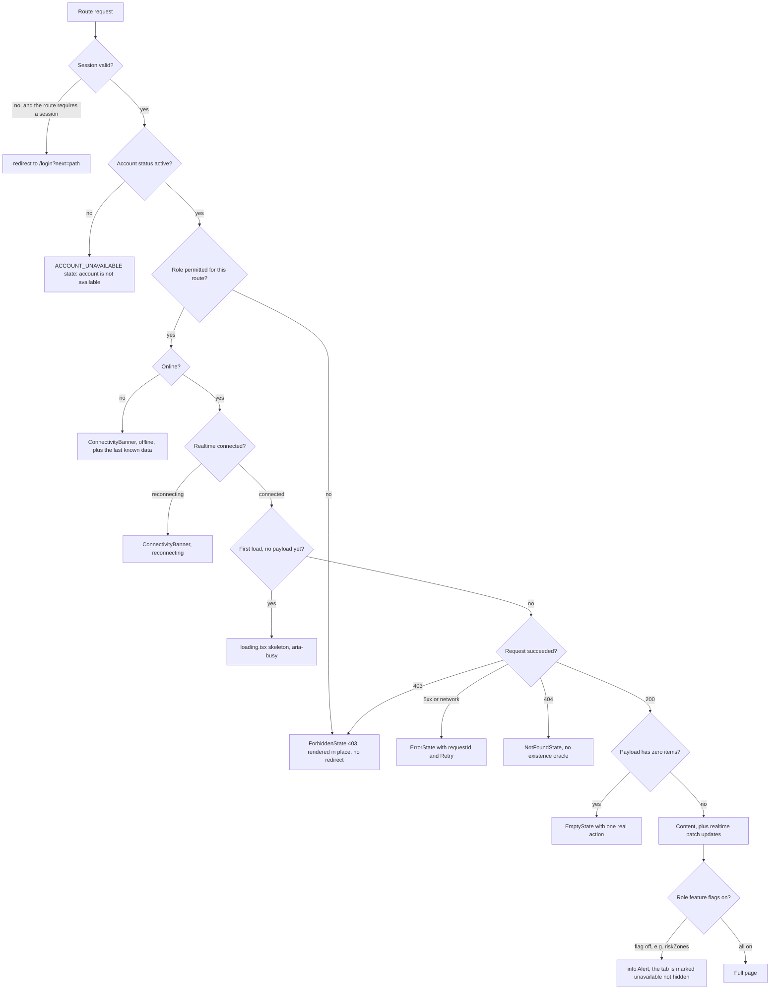

# 04 — UI / UX Design Specification

**Project:** CareGrid AI
**Document type:** Visual design system, component contracts, and screen-by-screen specification
**Status:** Baseline v1.0 — normative for every token, component state, and route described here
**Related documents:** [01 PRD](./01_PRODUCT_REQUIREMENTS_DOCUMENT.md), [05 Frontend Architecture](./05_FRONTEND_ARCHITECTURE.md), [08 API Spec](./08_API_SPECIFICATION.md), [09 AI Spec](./09_AI_GEMINI_SPECIFICATION.md), [22 Roles & Permissions](./22_USER_ROLES_PERMISSIONS.md), [25 Accessibility & Responsiveness](./25_ACCESSIBILITY_RESPONSIVENESS.md)

> **If code disagrees with this document, this document wins** until it is amended. Field names come from [07](./07_DATABASE_SCHEMA.md), endpoint paths and response shapes come from [08](./08_API_SPECIFICATION.md), and they are not restated differently here.

---

## 0. How to read this document

| Section | Contains |
| --- | --- |
| §1 | Design philosophy and the anti-pattern list (what this product must never look like) |
| §2 | Colour tokens, urgency/status/confidence tokens, light variant, measured contrast table |
| §3–§4 | Typography, spacing, radius, elevation, borders, icons, motion |
| §5 | Component contracts (anatomy, variants, states, sizes, accessibility) |
| §6–§7 | Status badge mapping (11) and urgency badge mapping (4) |
| §8 | Navigation, per-role nav tables, breadcrumbs |
| §9 | Global states with exact copy |
| §10–§11 | Form patterns and map visual language |
| §12 | Visual hierarchy per role (the five things that must be above the fold) |
| §13 | Complete page specification for every route |
| §14–§15 | Microcopy dictionary and content/tone rules |
| §16 | `DECISION REQUIRED` register for this document |

---

## 1. Design philosophy

### 1.1 The one-sentence brief

> **A calm operations console that a tired person can read at 03:00 without being panicked, misled, or slowed down.**

### 1.2 Principles

| # | Principle | What it means in practice |
| --- | --- | --- |
| P1 | **Operational, not aspirational** | Hairline borders, tight density, no hero images, no gradients, no glassmorphism. A control room has no decoration budget. |
| P2 | **Uncertainty is displayed, never hidden** | `aiNeedsReview`, `accuracyGrade`, `duplicateStatus`, `triageError`, `slaState` all have a first-class visual. Nothing is silently "best-effort". |
| P3 | **Colour is never the only channel** | Every status, urgency, confidence, and alert is colour **+ icon + text**. Enforced in code by a single `UrgencyBadge` / `StatusBadge` / `ConfidenceBadge` component, never a raw `<span style="color:…">`. |
| P4 | **One primary action per screen** | Emergency interfaces lose time to ambiguous CTAs. Each route declares exactly one primary action in §13. |
| P5 | **Honesty over reassurance** | "Needs review", "Location is approximate", "AI estimate" are first-class copy. The product never says it knows something it does not know. |
| P6 | **The human is the actor** | Copy and layout make it obvious that a person verified, assigned, or resolved. The AI is always labelled as an estimate. |
| P7 | **Restrained motion** | Motion exists to explain state change, never to entertain. Nothing loops, nothing parallaxes, everything yields to `prefers-reduced-motion`. |
| P8 | **Thumb-reachable on a phone** | A 360 px viewport is a first-class target, not a fallback. Primary actions sit in the lower third on mobile. |
| P9 | **Data minimisation is visible** | The UI must not render a field the caller's role may not see, and must not hint that a hidden field exists. |
| P10 | **The map is optional, the list is not** | No critical action requires the map. Every map view has an equivalent list (FR-085, US-040 AC4). |

### 1.3 Anti-patterns — what this product must never look like

This list is normative. A PR that introduces any of these patterns is rejected at review.

| # | Anti-pattern | Why it is banned | What we do instead |
| --- | --- | --- | --- |
| A1 | Purple/blue SaaS gradient hero, glassy cards, `bg-gradient-to-r from-violet-500 to-blue-500` | Reads as a marketing template, not an operations tool; fails the "calm console" brief | Flat `--color-surface` fills, 1 px hairline borders, no gradient anywhere in `app/` or `components/` (ESLint `no-restricted-syntax` bans `gradient-to-*`) |
| A2 | Urgency expressed as a coloured dot or a coloured row background only | Fails WCAG 1.4.1 Use of Colour and US-040 AC3 | `UrgencyBadge` = icon + label + colour, always |
| A3 | Red page background or full-bleed red alert banner for anything other than a `critical` incident | Panic-inducing; destroys the signal when a real critical arrives | Red is reserved for `urgency: critical` and for the literal word "critical" in a notification title. Nothing else is ever red. |
| A4 | Exclamation marks in UI copy ("Report submitted!") | Reads as alarm; also inconsistent with the calm voice | No `!` in any microcopy string. Ever. (Enforced by a unit test over `features/*/copy.ts` — `DECISION REQUIRED` on the exact lint rule) |
| A5 | Fake precision — a map pin on "the exact spot" when accuracy is 800 m | Dishonest and operationally harmful | Accuracy ring on the marker, `accuracyGrade` badge, "Location is approximate" copy |
| A6 | "AI decided / AI has dispatched / Emergency services notified" | Factually false; there is no such code path ([09](./09_AI_GEMINI_SPECIFICATION.md) §1.2) | "AI estimate", "Assigned to {responder}", "A dispatcher assigns responders" |
| A7 | Chat-bubble UI for the dispatcher console | The PRD explicitly rejects a conversational ops surface (principle 2) | Table/queue/panel layout |
| A8 | Skeleton everywhere with no shapes matching the real content | Causes a 300 ms layout jump on every realtime update | Skeletons mirror the real row/column geometry; realtime updates patch in place and never re-skeleton |
| A9 | Carousels, marquees, auto-rotating banners, count-up animations on KPIs | Motion noise; violates P7 and WCAG 2.2.2 | No auto-playing motion of any kind |
| A10 | Icon-only buttons with no accessible name and no tooltip | Fails WCAG 4.1.2; fatal in gloves/direct sun | `IconButton` requires an `aria-label` prop at the type level (non-optional) |
| A11 | Modals for destructive or high-stakes actions without a typed reason | Breaks FR-063/FR-133/FR-046 auditability | `ConfirmDialog` variant with a required `reason` textarea (10–280 chars) |
| A12 | Hiding low confidence, poor GPS, or AI fallback in a "details" expander | Directly violates PRD principle 3 and FR-024 | Always visible at the row level: `Needs review` badge, accuracy badge, `Fallback triage` source badge |
| A13 | Animation as feedback (toast slides in from off-screen with a bounce) | Over-styled; interferes with `aria-live` announcements | 160 ms fade/translate of 8 px max, no spring |
| A14 | Emoji as status icons | Inconsistent rendering, no accessible name, no monochrome | `lucide-react` icons only, 16/18/20 px, `strokeWidth={2}` |
| A15 | Infinite scroll in the incident history | Breaks FR-121 cursor pagination, breaks shareable URLs, breaks keyboard paging | Cursor pagination with an explicit "Load more" and a page-position readout |
| A16 | A live map with no list alternative | Fails FR-085 and the accessibility requirement that the map is not the only way to do anything | `MapPanel` requires a `MapListFallback` sibling in the same layout |

---

## 2. Colour system

### 2.1 Rules

1. Colour is declared **only** as a CSS custom property in `app/globals.css` and consumed as a Tailwind `@theme inline` token. No hex literals in any `.tsx` file. (ESLint `no-hex-color` on `components/**`, `features/**`.)
2. The palette is defined in **one place**: the `@theme` block in `app/globals.css`. shadcn/ui's `new-york` variables are re-pointed at our tokens rather than maintained in parallel.
3. Every foreground/background pair used for text appears in the §2.11 contrast table with a measured ratio.
4. No colour is introduced without a semantic name. If a colour is not in a table below, it does not exist.

### 2.2 Surface tokens (dark — the default theme)

| Token | Hex | Use |
| --- | --- | --- |
| `--color-bg-app` | `#0B0F14` | Application background: page canvas, sidebar, top bar, bottom nav |
| `--color-bg-surface` | `#121820` | Cards, panels, table body, dialog body, popovers |
| `--color-bg-elevated` | `#1B2430` | Hover fills, inputs, menus, tooltip surfaces, tab strip, nested rows |
| `--color-bg-inset` | `#080B0F` | Wells: code blocks, evidence frames, the map list fallback, disabled fills |
| `--color-bg-scrim` | `rgba(4, 7, 10, 0.72)` | Dialog/sheet backdrop |

### 2.3 Text tokens

| Token | Hex | Use | Never used for |
| --- | --- | --- | --- |
| `--color-text-primary` | `#E9EFF6` | Headings, incident `summary`, table primary cell | — |
| `--color-text-secondary` | `#A8B6C6` | Body copy, table secondary cell, helper text | The only copy a user must read to act correctly |
| `--color-text-muted` | `#82909F` | Timestamps, `requestId`, unit labels, disabled label | Anything that changes a decision |
| `--color-text-on-solid` | `#04191D` | Foreground on a solid `accent` fill | — |
| `--color-text-inverse` | `#E9EFF6` | Foreground on solid `danger` / `warning` / urgency fills | — |

### 2.4 Border tokens

| Token | Hex | Use | 1.4.11 status |
| --- | --- | --- | --- |
| `--color-border-subtle` | `#212B37` | Hairline between rows inside a card, dividers | Decorative (exempt) |
| `--color-border-default` | `#2A3745` | Card and panel outline, table header rule | Decorative (exempt) |
| `--color-border-strong` | `#3A4A5C` | Dialog/sheet outline, elevated control outline | Decorative (exempt) |
| `--color-border-control` | `#5E7085` | **Interactive control boundary**: input, select, textarea, switch, checkbox, radio | **3.08–3.78:1 — meets 1.4.11** |
| `--color-border-focus` | `#7CC4FF` | Focus ring outer band | 8.35–10.25:1 |
| `--color-border-selected` | `#2AB3C9` | Selected row left rule, selected tab underline | 6.25:1 on elevated |

### 2.5 Semantic tokens

| Token | Hex | Meaning | On `--color-bg-surface` |
| --- | --- | --- | --- |
| `--color-accent` | `#2AB3C9` | Restrained operational accent: primary buttons, active nav item, focus, links, selected state | 7.13:1 |
| `--color-accent-hover` | `#35C4DA` | Primary button hover | 7.6:1 |
| `--color-accent-active` | `#1F97AB` | Primary button pressed | — |
| `--color-accent-muted` | `#0A2126` | Accent tint background (chips, callouts) | — |
| `--color-accent-foreground-muted` | `#6BD6E6` | Text on `--color-accent-muted` | 9.84:1 |
| `--color-danger` | `#FF6B6B` | Critical-only emphasis, destructive confirm, validation error text | 6.43:1 |
| `--color-danger-muted` | `#2B1114` | Danger tint background | — |
| `--color-danger-foreground-muted` | `#FF8A8C` | Text on danger tint | 7.77:1 |
| `--color-warning` | `#F2C744` | "Needs review", at-risk SLA, degraded state | 11.07:1 |
| `--color-warning-muted` | `#2A230D` | Warning tint background | — |
| `--color-warning-foreground-muted` | `#F5D77A` | Text on warning tint | 11.07:1 |
| `--color-success` | `#35B37E` | Verified, resolved, succeeded | 6.71:1 |
| `--color-success-muted` | `#0D2119` | Success tint background | — |
| `--color-success-foreground-muted` | `#66D3A3` | Text on success tint | 9.14:1 |
| `--color-info` | `#4C9BF0` | Informational, in-progress, `low` urgency | 6.16:1 |
| `--color-info-muted` | `#0F1E30` | Info tint background | — |
| `--color-info-foreground-muted` | `#8CC0F7` | Text on info tint | 8.81:1 |
| `--color-neutral` | `#8E9BB0` | Terminal/inactive statuses, unassigned | 6.34:1 |
| `--color-neutral-muted` | `#1B2430` | Neutral tint background (same as elevated) | — |

### 2.6 Urgency tokens (4 levels — FR-026)

Shape, icon, and label are normative; colour alone is never sufficient.

| Level | Token | Hex | SLA | Icon (`lucide-react`) | Marker shape | Badge label |
| --- | --- | --- | --- | --- | --- | --- |
| `critical` | `--color-urgency-critical` | `#FF5C5C` | 5 min | `Siren` | Filled **octagon** | `Critical` |
| `high` | `--color-urgency-high` | `#FF8A3D` | 15 min | `TriangleAlert` | Filled **triangle** | `High` |
| `medium` | `--color-urgency-medium` | `#F2C744` | 60 min | `CircleAlert` | Filled **circle** | `Medium` |
| `low` | `--color-urgency-low` | `#4C9BF0` | 240 min | `Circle` (outline) | Hollow **circle** | `Low` |

Rule: if a map cannot draw shapes, the legend and the list still carry the icon + label pair.

### 2.7 Status tokens (11 statuses — FR-050)

| Token | Hex | On surface |
| --- | --- | --- |
| `--color-status-new` | `#8593A6` | 5.71:1 |
| `--color-status-triaged` | `#2AB3C9` | 7.13:1 |
| `--color-status-verified` | `#35B37E` | 6.71:1 |
| `--color-status-assigned` | `#7C8BFF` | 5.94:1 |
| `--color-status-en-route` | `#4C9BF0` | 6.16:1 |
| `--color-status-on-scene` | `#2BB3A3` | 6.86:1 |
| `--color-status-resolved` | `#5CC98B` | 8.65:1 |
| `--color-status-closed` | `#6B7A8B` | 4.06:1 |
| `--color-status-cancelled` | `#8E9BB0` | 6.34:1 |
| `--color-status-false-alarm` | `#B08CF0` | 6.67:1 |
| `--color-status-merged` | `#8AA0B8` | 6.63:1 |

> `--color-status-closed` is 4.06:1 and is therefore **badge text only** (badge text is 12 px semibold, which is below 18.66 px, so 4.5:1 applies and 4.06:1 would fail). **Correction, normative:** the `closed` badge uses `--color-text-secondary` `#A8B6C6` (8.64:1) for its label and `#6B7A8B` only for the icon. Any future status token must be ≥ 4.5:1 for its own text.

### 2.8 Confidence tokens (FR-024, [09](./09_AI_GEMINI_SPECIFICATION.md) §5.4)

| Band | Range | Token | Hex | On surface | Icon | Text shown |
| --- | --- | --- | --- | --- | --- | --- |
| High | `aiConfidence >= 0.80` | `--color-confidence-high` | `#35B37E` | 6.71:1 | `Check` | `AI estimate 0.83` |
| Medium | `0.60 <= aiConfidence < 0.80` | `--color-confidence-medium` | `#F2C744` | 11.07:1 | `CircleHelp` | `AI estimate 0.71` |
| Low | `aiConfidence < 0.60` | `--color-confidence-low` | `#FFA23A` | 8.90:1 | `Eye` | **`Needs review`** |

`aiNeedsReview` is a server-provided boolean in [08](./08_API_SPECIFICATION.md) §3.1/§3.2. The client derives the **band** from `aiConfidence`; it never recomputes `aiNeedsReview` from a different threshold.

### 2.9 Map palette

| Element | Token | Hex |
| --- | --- | --- |
| Land / base | `mapStyle.land` | `#0B0F14` |
| Blocks / buildings | `mapStyle.blocks` | `#141C25` |
| Roads (arterial) | `mapStyle.roadMajor` | `#2A3745` |
| Roads (local) | `mapStyle.roadMinor` | `#1B2430` |
| Water | `mapStyle.water` | `#0B1A26` |
| Duplicate 500 m ring | `--color-accent` | `#2AB3C9` at 1 px dash + 12 % fill |
| Accuracy radius fill | `--color-info` | `#4C9BF0` at 14 % fill, 1 px solid |

Style JSON lives at `config/maps/caregrid-dark-style.json` and is selected by `NEXT_PUBLIC_MAP_STYLE=dark` ([21](./21_ENVIRONMENT_VARIABLES.md)).

### 2.10 Light mode variant

**Decision (v1):** CareGrid AI ships **dark as the default and only enforced theme in v1**, for these reasons:

1. The primary users are night-shift dispatchers and first responders in daylight or darkness; a single tuned theme avoids a second, untested palette in an emergency UI.
2. Every token in §2.2–§2.9 already has a documented light counterpart below, and both themes are measured to AA, so light mode is a low-risk increment rather than a redesign.
3. `forced-colors` (Windows High Contrast) is supported and is the accessibility escape hatch that matters more than a light brand theme.

**But the light palette below is complete, measured, and is the contract for v1.1's theme toggle.** `DECISION REQUIRED` — confirm whether the v1.1 toggle ships as `auto / light / dark` (default `auto`, respecting `prefers-color-scheme`) or as a user setting persisted to `profiles/{uid}` via `PATCH /api/me`. The `PATCH /api/me` schema in [08](./08_API_SPECIFICATION.md) §2.3 does not currently accept a theme field, so persisting it requires a schema change.

| Token | Dark | Light |
| --- | --- | --- |
| `--color-bg-app` | `#0B0F14` | `#F6F8FA` |
| `--color-bg-surface` | `#121820` | `#FFFFFF` |
| `--color-bg-elevated` | `#1B2430` | `#FFFFFF` |
| `--color-text-primary` | `#E9EFF6` | `#0E1620` (18.19:1) |
| `--color-text-secondary` | `#A8B6C6` | `#3D4B5C` (8.90:1) |
| `--color-text-muted` | `#82909F` | `#5C6B7C` (5.46:1) |
| `--color-border-subtle` | `#212B37` | `#D8DEE5` |
| `--color-border-default` | `#2A3745` | `#D8DEE5` |
| `--color-border-control` | `#5E7085` | `#7A8898` (3.62:1) |
| `--color-border-focus` | `#7CC4FF` | `#0B5FBF` (6.17:1) |
| `--color-accent` | `#2AB3C9` | `#0B6E7A` (5.96:1) |
| `--color-danger` | `#FF6B6B` | `#B3261E` (6.54:1) |
| `--color-warning` | `#F2C744` | `#7A5A00` (6.38:1) |
| `--color-success` | `#35B37E` | `#1B6B45` (6.49:1) |
| `--color-info` | `#4C9BF0` | `#0B5FBF` (6.17:1) |
| `--color-urgency-critical` | `#FF5C5C` | `#B3261E` (6.54:1) |
| `--color-urgency-high` | `#FF8A3D` | `#A2520A` (5.60:1) |
| `--color-urgency-medium` | `#F2C744` | `#7A5A00` (6.38:1) |
| `--color-urgency-low` | `#4C9BF0` | `#0B5FBF` (6.17:1) |
| `--color-urgency-critical-muted` | `#2B1114` | `#FDE8E6` (5.56:1 with `#B3261E`) |
| `--color-urgency-high-muted` | `#2B1A0E` | `#FDEEDD` (4.92:1 with `#A2520A`) |
| `--color-urgency-medium-muted` | `#2A230D` | `#FFF3D6` (5.79:1 with `#7A5A00`) |
| `--color-urgency-low-muted` | `#0F1E30` | `#E4EFFC` (5.30:1 with `#0B5FBF`) |
| `--color-success-muted` | `#0D2119` | `#E2F3EA` (5.64:1 with `#1B6B45`) |
| `--color-neutral-muted` | `#1B2430` | `#EDF1F5` (7.84:1 with `#3D4B5C`) |

The urgency *tint* backgrounds sit at 1.0–1.14:1 against the dark surface, so a badge's boundary is carried by the border and the text — never by the fill. This is intentional and is documented in [25](./25_ACCESSIBILITY_RESPONSIVENESS.md).

### 2.11 Contrast verification table (measured, not estimated)

Ratios are computed WCAG 2.1 relative luminance contrasts. Every text pair below meets **WCAG 1.4.3 AA (≥ 4.5:1 for text < 18.66 px bold / 24 px)**. Non-text control boundaries meet **1.4.11 (≥ 3:1)**.

| # | Foreground | Background | Ratio | Requirement | Verdict |
| --- | --- | --- | --- | --- | --- |
| 1 | `text-primary` `#E9EFF6` | `bg-app` `#0B0F14` | 16.60 | 4.5 | Pass |
| 2 | `text-primary` `#E9EFF6` | `bg-surface` `#121820` | 15.41 | 4.5 | Pass |
| 3 | `text-primary` `#E9EFF6` | `bg-elevated` `#1B2430` | 13.52 | 4.5 | Pass |
| 4 | `text-secondary` `#A8B6C6` | `bg-app` | 9.31 | 4.5 | Pass |
| 5 | `text-secondary` `#A8B6C6` | `bg-surface` | 8.64 | 4.5 | Pass |
| 6 | `text-secondary` `#A8B6C6` | `bg-elevated` | 7.58 | 4.5 | Pass |
| 7 | `text-muted` `#82909F` | `bg-app` | 5.89 | 4.5 | Pass |
| 8 | `text-muted` `#82909F` | `bg-surface` | 5.47 | 4.5 | Pass |
| 9 | `text-muted` `#82909F` | `bg-elevated` | 4.80 | 4.5 | Pass |
| 10 | `accent` `#2AB3C9` | `bg-app` | 7.68 | 4.5 | Pass |
| 11 | `accent` `#2AB3C9` | `bg-surface` | 7.13 | 4.5 | Pass |
| 12 | `accent` `#2AB3C9` | `bg-elevated` | 6.25 | 4.5 | Pass |
| 13 | `accent-hover` `#35C4DA` | `bg-surface` | 7.60 | 4.5 | Pass |
| 14 | `text-on-solid` `#04191D` | `accent` `#2AB3C9` | 7.22 | 4.5 | Pass |
| 15 | `danger` `#FF6B6B` | `bg-surface` | 6.43 | 4.5 | Pass |
| 16 | `warning` `#F2C744` | `bg-surface` | 11.07 | 4.5 | Pass |
| 17 | `success` `#35B37E` | `bg-surface` | 6.71 | 4.5 | Pass |
| 18 | `info` `#4C9BF0` | `bg-surface` | 6.16 | 4.5 | Pass |
| 19 | `urgency-critical` `#FF5C5C` | `bg-surface` | 5.89 | 4.5 | Pass |
| 20 | `urgency-critical` `#FF5C5C` | `bg-elevated` | 5.17 | 4.5 | Pass |
| 21 | `urgency-high` `#FF8A3D` | `bg-surface` | 7.61 | 4.5 | Pass |
| 22 | `urgency-high` `#FF8A3D` | `bg-elevated` | 6.67 | 4.5 | Pass |
| 23 | `urgency-medium` `#F2C744` | `bg-surface` | 11.07 | 4.5 | Pass |
| 24 | `urgency-low` `#4C9BF0` | `bg-surface` | 6.16 | 4.5 | Pass |
| 25 | `status-verified` `#35B37E` | `bg-surface` | 6.71 | 4.5 | Pass |
| 26 | `status-assigned` `#7C8BFF` | `bg-surface` | 5.94 | 4.5 | Pass |
| 27 | `status-on-scene` `#2BB3A3` | `bg-surface` | 6.86 | 4.5 | Pass |
| 28 | `status-resolved` `#5CC98B` | `bg-surface` | 8.65 | 4.5 | Pass |
| 29 | `status-false-alarm` `#B08CF0` | `bg-surface` | 6.67 | 4.5 | Pass |
| 30 | `status-merged` `#8AA0B8` | `bg-surface` | 6.63 | 4.5 | Pass |
| 31 | `status-closed` — label uses `text-secondary` `#A8B6C6` | `bg-surface` | 8.64 | 4.5 | Pass |
| 32 | `confidence-low` `#FFA23A` | `bg-surface` | 8.90 | 4.5 | Pass |
| 33 | `border-control` `#5E7085` | `bg-surface` | 3.06 | 3.0 | Pass |
| 34 | `border-control` `#5E7085` | `bg-elevated` | 3.08 | 3.0 | Pass |
| 35 | `border-control` `#5E7085` | `bg-app` | 3.78 | 3.0 | Pass |
| 36 | `border-focus` `#7CC4FF` | `bg-app` | 10.25 | 3.0 | Pass |
| 37 | `border-focus` `#7CC4FF` | `bg-elevated` | 8.35 | 3.0 | Pass |
| 38 | `text-on-solid` `#04191D` | `danger` `#FF6B6B` | 6.57 | 4.5 | Pass |
| 39 | `accent-foreground-muted` `#6BD6E6` | `accent-muted` `#0A2126` | 9.84 | 4.5 | Pass |
| 40 | `danger-foreground-muted` `#FF8A8C` | `danger-muted` `#2B1114` | 7.77 | 4.5 | Pass |
| 41 | `warning-foreground-muted` `#F5D77A` | `warning-muted` `#2A230D` | 11.07 | 4.5 | Pass |
| 42 | `info-foreground-muted` `#8CC0F7` | `info-muted` `#0F1E30` | 8.81 | 4.5 | Pass |
| 43 | `success-foreground-muted` `#66D3A3` | `success-muted` `#0D2119` | 9.14 | 4.5 | Pass |
| 44 | `text-secondary` `#A8B6C6` | `neutral-muted` `#1B2430` | 7.58 | 4.5 | Pass |

**Focus ring note.** A single-colour focus ring fails on the `accent` fill (`#7CC4FF` on `#2AB3C9` = 1.33:1). The normative focus treatment is therefore a **two-band ring**: `box-shadow: 0 0 0 2px var(--color-bg-app), 0 0 0 4px var(--color-border-focus)`. The inner band guarantees ≥ 3:1 separation from any fill, and the outer band is 8.35–10.25:1 against every surface. This is specified in [25](./25_ACCESSIBILITY_RESPONSIVENESS.md) §4.

### 2.12 Non-colour encoding rules (normative)

| Information | Encoded as |
| --- | --- |
| Urgency | Colour + distinct shape + `lucide` icon + text label + `aria-label` |
| Status | Colour + distinct icon + text label |
| SLA state | Colour + text (`On track` / `At risk` / `Breached`) + a `Progress` meter |
| AI confidence band | Colour + icon + text (`Needs review`) |
| Verification source | Text badge only: `AI triaged` / `Fallback triage` / `Human verified` |
| Location accuracy | Icon + text (`Approximate ±800 m`, `Location unknown`) |
| Stale responder location | Icon + text (`Location 22 min old`) |
| Online / offline | Dot shape differs (filled vs ring) + text + `aria-live` announcement |
| Focus | Two-band ring (§2.11) |

---

## 3. Typography

### 3.1 Families

| Role | Stack | Loading |
| --- | --- | --- |
| UI / body | **Inter Variable** via `next/font/google`, `display: 'swap'`, `subsets: ['latin']`, `variable: '--font-inter'` | Self-hosted by `next/font`; `preload: true`; `adjustFontFallback: 'Arial'` to avoid CLS |
| Numeric / reference | `ui-monospace, "JetBrains Mono", "SFMono-Regular", "Cascadia Mono", Menlo, monospace` | **No web font.** The system mono stack is used deliberately: a second web font costs ~30 KB and buys nothing for `CG-7QK4M2`. |
| Map label (Google Maps) | Controlled by the Maps style; not ours | — |

```ts
// app/layout.tsx — normative
const inter = Inter({ subsets: ['latin'], display: 'swap', variable: '--font-inter' });
```

### 3.2 Scale

| Token | Size / line-height | Weight | Tracking | Use |
| --- | --- | --- | --- | --- |
| `text-2xs` | 10 / 14 | 600 | 0.06em | Badge and column-header uppercase labels |
| `text-xs` | 12 / 16 | 500 | 0.01em | `RelativeTime`, helper text, table meta, evidence captions |
| `text-sm` | 14 / 20 | 400 (500 for emphasis) | 0 | **Default body and table cell** |
| `text-sm-strong` | 14 / 20 | 600 | 0 | Table primary cell, list primary line |
| `text-base` | 16 / 24 | 400 | 0 | Form inputs, `Textarea`, long-form reading (citizen) |
| `text-lg` | 18 / 26 | 600 | −0.01em | Card title, dialog title, incident `summary` on detail |
| `text-xl` | 20 / 28 | 600 | −0.01em | Panel/section title |
| `text-2xl` | 24 / 32 | 700 | −0.02em | Page title (≥ 768 px) |
| `text-3xl` | 30 / 36 | 700 | −0.02em | `KpiTile` value |
| `text-4xl` | 36 / 40 | 700 | −0.02em | Analytics total, single-number hero |
| `text-5xl` | 48 / 52 | 700 | −0.03em | Success-screen reference `CG-XXXXXX` (mobile only) |

### 3.3 Numerals and references

| Rule | Implementation |
| --- | --- |
| Every metric, count, age, distance, percentage, and SLA timer uses tabular figures | `font-variant-numeric: tabular-nums` via the `tabular` utility applied to `KpiTile`, `RelativeTime`, `Progress`, `Timestamp`, and every numeric table cell |
| Line-height must not shift when a live value changes | Reserve min-width on numeric cells (`min-w-[4ch]` on counts, `min-w-[7ch]` on `CG-XXXXXX`) |
| `CG-XXXXXX` references | `font-mono`, 12/16 (table) or 14/20 (detail), weight 500, letter-spacing 0.02em, `text-primary`. Never a link-coloured reference — the whole cell is the link |
| `requestId` | `font-mono`, 12/16, `--color-text-muted`, copy-to-clipboard affordance |

### 3.4 Reading rules

| Rule | Value |
| --- | --- |
| Measure (max line length) | 68–76 characters. `max-width: 72ch` on all prose (`originalText`, `resolutionNote`, `summary`, help copy) |
| Paragraph spacing | 8 px (`space-y-2`) |
| Sentence case everywhere | No `text-transform: uppercase` except badge/column-header labels |
| Truncation | `summary` clamps to 2 lines with `-webkit-line-clamp: 2`; full text is in the `title`/`aria-describedby` copy. `originalText` is never truncated in the detail panel |
| Text never in images | No baked-in text; no text in SVG markers |

---

## 4. Spacing, radius, elevation, borders, icons, motion

### 4.1 Spacing — 4 px scale

`0 · 4 · 8 · 12 · 16 · 20 · 24 · 32 · 40 · 48 · 64 · 80 · 96` (`--spacing-*` in `@theme`).

| Context | Value |
| --- | --- |
| Icon ↔ label inside a control | 8 |
| Label ↔ field | 8 |
| Field ↔ helper/error text | 4 |
| Between form fields | 24 |
| Card internal padding | 16 (compact cards 12) |
| Card ↔ card in a grid | 16 |
| Table cell padding (y / x) | 12 / 16; dense row variant 8 / 12 |
| Page gutter | 16 (360–639), 24 (640–1023), 32 (≥ 1024) |
| Section gap in a page | 24 (mobile), 32 (desktop) |
| Section gap between `KpiTile`s | 12 |

### 4.2 Radius

| Token | Value | Applied to |
| --- | --- | --- |
| `--radius-sm` | 4 px | Badges, chips, table inner cells, thumbnails |
| `--radius-control` | 6 px | Button, Input, Textarea, Select, Switch, Checkbox, Radio, Tabs trigger |
| `--radius-card` | 8 px | Card, Panel, popover, menu, map popup, list fallback |
| `--radius-dialog` | 10 px | Dialog |
| `--radius-sheet` | 16 px top corners | Bottom sheet, Drawer |
| `--radius-pill` | 9999 px | StatusBadge, UrgencyBadge, avatar, toggle, `KpiTile` delta chip |

### 4.3 Elevation — border first, shadow second

No heavy drop shadows, no coloured glows. Elevation is expressed as a slightly stronger border plus a small lift.

| Level | Token pair | Border | Shadow | Used by |
| --- | --- | --- | --- | --- |
| `e0` | default | `border-subtle` | none | Cards in a list, table container |
| `e1` | raised | `border-default` | `0 1px 2px rgba(0,0,0,0.44)` | Popover, dropdown, tooltip, hovered interactive card |
| `e2` | overlay | `border-strong` | `0 8px 24px rgba(0,0,0,0.55)` | Dialog, Drawer/Sheet, CommandPalette |
| `e3` | transient | `border-strong` | `0 16px 48px rgba(0,0,0,0.62)` | Sonner toast, sticky action bar on scroll |

Interactive `e0`/`e1` cards lift on hover with `transform: translateY(-1px)` + `e1` border, `120 ms`. Under `prefers-reduced-motion: reduce` the lift is removed and only the border changes.

### 4.4 Borders

| Rule | Value |
| --- | --- |
| Hairline | `1px solid` — never `2px` except the `selected` row's 3 px left rule and the focus ring |
| Radius on border | Same as the element it wraps; never mismatched |
| Dashed border | Only the `LOCATION UNKNOWN` marker and the 500 m duplicate ring |
| Selected row | `border-left: 3px solid var(--color-border-selected)` + `--color-bg-elevated` fill, plus `aria-selected="true"` on the `<tr>` |

### 4.5 Icons (`lucide-react` only)

| Size token | px | Stroke | Use |
| --- | --- | --- | --- |
| `icon-xs` | 14 | 2 | Inside badges, table cells |
| `icon-sm` | 16 | 2 | Buttons, list rows, nav items |
| `icon-md` | 18 | 2 | Card titles, alerts |
| `icon-lg` | 20 | 2 | Section headers, empty states |
| `icon-xl` | 24 | 1.75 | Page-level empty states |
| `icon-2xl` | 32 | 1.75 | `/` landing, 403/404 hero |

Rules:

1. Icons are decorative by default: `aria-hidden="true"` + `focusable="false"`.
2. An icon that is the *only* content of a control must be inside an `IconButton`, which requires `aria-label`.
3. Urgency/status/category icons are **fixed per value** by §2.6/§6/§7.1 and may not be swapped ad hoc.
4. Category icons (from `resources.icon` and the `IncidentCategory` map) are in `lib/icons/categories.ts`: `medical`→`HeartPulse`, `fire`→`Flame`, `traffic_accident`→`CarFront`, `flood`→`Waves`, `heatwave`→`ThermometerSun`, `severe_storm`→`CloudLightning`, `missing_person`→`UserSearch`, `violence_crime`→`ShieldAlert`, `infrastructure`→`Construction`, `community_aid`→`HandHeart`, `other`→`HelpCircle`.
5. No emoji anywhere in the UI.

### 4.6 Motion

| Token | Value | Applied to |
| --- | --- | --- |
| `--motion-duration-instant` | 80 ms | Colour/background state on hover |
| `--motion-duration-fast` | 120 ms | Button press, tab underline, card lift, row highlight fade-in |
| `--motion-duration-base` | 180 ms | Tooltip, dropdown, accordion, inline validation message |
| `--motion-duration-slow` | 260 ms | Dialog, Sheet/Drawer, map side panel |
| `--motion-duration-slower` | 400 ms | Reserved; only the full-screen `MapPanel` mobile transition |
| `--motion-ease-standard` | `cubic-bezier(0.2, 0, 0, 1)` | Default for transforms and opacity |
| `--motion-ease-entrance` | `cubic-bezier(0, 0, 0.2, 1)` | Elements appearing |
| `--motion-ease-exit` | `cubic-bezier(0.4, 0, 1, 1)` | Elements leaving (exit is faster than entrance) |
| `--motion-live-flash` | 600 ms | Realtime row update highlight (US-020 AC1) |

**`prefers-reduced-motion: reduce` (mandatory, NFR-019).** A single global CSS block in `app/globals.css` sets `animation-duration: 0.01ms; animation-iteration-count: 1; transition-duration: 0.01ms;` for all utility classes, and each component additionally implements a **non-motion** equivalent:

| Animated element | Reduced-motion replacement |
| --- | --- |
| Live row flash | Static `border-left: 3px solid var(--color-accent)` for 2 s, then removed |
| Skeleton shimmer | Static `--color-bg-elevated` fill, no gradient sweep |
| Dialog / Sheet slide | Opacity only, 80 ms |
| Toast slide | Opacity only, 80 ms |
| Map marker transitions | Instant reposition; no fly-to animation (offer an explicit "Zoom to incident" button instead) |
| Count-up KPI numbers | Static final value |
| Sonner progress bar | Static spinner replaced with text "Working" |

**Never used:** parallax, auto-play, infinite loops, spring physics, confetti, or sound.

---

## 5. Component specifications

Every component below lives in `components/ui/` (shadcn primitive) or `components/` (product composite) — see [05](./05_FRONTEND_ARCHITECTURE.md) §4. shadcn primitives keep their names; the props listed here are the **project contract** layered on top.

**Universal state matrix (applies to every interactive component):**

| State | Treatment |
| --- | --- |
| `default` | `bg-elevated`, `border-control` (inputs) or solid fill (buttons) |
| `hover` | `--motion-duration-instant`, `bg-elevated` lightened one step, border to `border-strong` |
| `active` / `aria-pressed="true"` | 1 step darker / accent-tinted, `translateY(0)`, no shadow |
| `focus-visible` | Two-band focus ring (§2.11). **Never** `outline: none` without a replacement |
| `disabled` | 45 % opacity, `cursor-not-allowed`, `aria-disabled="true"`, and a visible reason (see §10.4) |
| `loading` | `aria-busy="true"`, existing label preserved in `sr-only` span, spinner `Loader2` at `icon-sm`, control not `inert` (keeps it in the tab order) |
| `invalid` | `aria-invalid="true"`, border `--color-danger`, error text with `role="alert"` on first appearance |

---

### 5.1 Button

**File:** `components/ui/button.tsx` (shadcn `new-york`)

- **Anatomy:** optional leading icon (`icon-sm`) → label (`text-sm` 500) → optional trailing icon or `kbd` hint.
- **Variants:** `primary` (accent fill, `--color-text-on-solid`), `secondary` (elevated fill + `border-default`), `outline` (transparent + `border-control`), `ghost` (transparent, hover fill), `link` (accent text, underline on hover), `danger` (`--color-danger` fill, `--color-text-inverse`), `danger-outline`.
- **Sizes:** `sm` 32 px / `px-3` / `text-xs` · `md` 40 px / `px-4` / `text-sm` · `lg` 48 px / `px-5` / `text-base` · `xl` 56 px / `px-6` / `text-base` (mobile report CTA) · `icon` 40 × 40.
- **States:** universal matrix. `loading` replaces the leading icon with `Loader2` and sets `aria-busy`.
- **Width:** `w-full` is the default on mobile for a screen's primary action. Never two `primary` buttons in the same action group.
- **Accessibility:** real `<button type="button|submit">`; `type` defaults to `"button"` to prevent accidental submits; icon-only variants are forbidden (use `IconButton`); minimum target 44 × 44 px on mobile — `md` (40 px) is desktop-only and `sm` (32 px) is table-only and must sit inside a padded row cell so the effective hit area is ≥ 44 px.

### 5.2 IconButton

**File:** `components/ui/icon-button.tsx`

- **Props:** `label: string` (**required** — no optional overload), `icon: LucideIcon`, `size?: 'sm' | 'md' | 'lg'`, `tone?: 'default' | 'accent' | 'danger' | 'ghost'`, `badge?: number` for the notification bell.
- **Anatomy:** icon centred; optional `aria-describedby` tooltip (not a tooltip substitute for the name).
- **Sizes:** `sm` 32, `md` 40, `lg` 48. On mobile, `md` is the floor and the rendered box is padded to 44 × 44 by `min-h-11 min-w-11` in the mobile variant.
- **States:** universal matrix; `active` maps to `aria-pressed` for toggles.
- **Accessibility:** `aria-label={label}` is mandatory; the badge is `aria-hidden` and the count is appended to the label (`"Notifications, 4 unread"`). Tooltip content equals `label` verbatim.

### 5.3 Input

**File:** `components/ui/input.tsx` (shadcn)

- **Anatomy:** `<label>` (always visible, never a placeholder-as-label) → control (`bg-elevated`, `border-control`, `--radius-control`, height 40 px md / 48 px mobile) → helper text (`text-xs text-secondary`) → error text (`text-xs text-danger`, `role="alert"` on first render).
- **Variants:** `default`, `search` (leading `Search` icon, right-side clear `IconButton`), `mono` (`font-mono` for a `requestId` or reference input), `otp` (6 single-char cells for nothing in v1 — reserved).
- **Sizes:** `sm` 32, `md` 40, `lg` 48.
- **States:** universal matrix, plus `aria-invalid="true"` + `border-danger` on invalid.
- **Accessibility:** `id` from `useId()`; `aria-describedby` points at helper **and** error ids; `aria-errormessage` on invalid; `autocomplete` token always set (see [25](./25_ACCESSIBILITY_RESPONSIVENESS.md) §7); `inputMode` set on numeric/phone fields; placeholder is an *example*, never the label; character counters use `aria-live="polite"` at 1-minute debounce only, not per keystroke.

### 5.4 Textarea

**File:** `components/ui/textarea.tsx`

- **Anatomy:** as Input, with a footer row: live `n / 2000` counter (tabular) and the optional AI transcript disclosure slot.
- **Sizing:** `md` min-height 96 px, `lg` 128 px, `full` for the report body. Auto-grow capped at 320 px, then internal scroll.
- **States:** universal matrix.
- **Accessibility:** character counter is `aria-hidden` and mirrored in the field's `aria-describedby`; error uses `role="alert"`. The reporter's text is never re-written or autocorrected by the app (FR-003); `spellCheck` is on, `autoCorrect="off"`, `autoCapitalize="sentences"`.

### 5.5 Select

**File:** `components/ui/select.tsx` (shadcn, Radix `Select`)

- **Anatomy:** trigger (matches `Input` metrics, `ChevronDown` trailing) → `Content` (`bg-elevated`, `border-strong`, `e1` shadow, max-height `min(360px, 60vh)`, `ContentScroll` with 8 px padding) → `Item` with `Check` on the right and `focus:bg-accent-muted`.
- **Variants:** `single`, `multi` (checkbox items, used for the queue filter bar), `grouped` (category filters grouped by similarity group).
- **Sizes:** `sm` 32, `md` 40, `lg` 48.
- **States:** universal matrix; `Item` states are `default / highlight / selected / disabled`.
- **Accessibility:** Radix supplies `role="listbox"`/`option`, `aria-selected`, `aria-activedescendant`, and Escape-to-close with focus restore. On mobile (`< 768 px`) the trigger opens a **bottom sheet** variant, not a floating list. **Never** a native `<select>` for the queue filters (option counts and icons are needed).

### 5.6 Checkbox / 5.7 Radio / 5.8 Switch

| Component | File | Use | Notes |
| --- | --- | --- | --- |
| `Checkbox` | `components/ui/checkbox.tsx` | Bulk queue selection, "add my details to this report", filter booleans | 20 × 20 box inside a 44 × 44 label hit area. Indeterminate state for "some rows selected" |
| `RadioGroup` | `components/ui/radio-group.tsx` | Reason picker (false alarm), resolution code, severity override | Group is `role="radiogroup"` with `aria-labelledby`; options stack vertically on mobile, 2-up at ≥ 640 px. Never a horizontal radio row at 360 px |
| `Switch` | `components/ui/switch.tsx` | Responder `available` ⇄ `offline` (US-010), notification channel prefs | 44 × 26 track, 20 px thumb, `role="switch"`, `aria-checked`. Disabled with reason when `verification != 'verified'` |

### 5.9 Card

**File:** `components/ui/card.tsx`

- **Anatomy:** `CardHeader` (title `text-lg`, optional `CardAction` on the right) → `CardDescription` (`text-sm text-secondary`, optional) → `CardContent` → `CardFooter` (actions, `border-subtle` top rule).
- **Variants:** `default` (`bg-surface border-subtle`, e0), `interactive` (adds hover lift, `role="link"` semantics when it navigates, `tabIndex=0`, Enter/Space handling), `inset` (`bg-inset`, used for the AI panel and the evidence well), `selected`.
- **Padding:** 16 px; `CardHeader` bottom padding 8 px.
- **Accessibility:** an interactive Card is a single tab stop, not a nest of focusable children. Headings use `CardTitle as="h2"|"h3"` to preserve document outline.

### 5.10 Badge / StatusBadge / UrgencyBadge / ConfidenceBadge

**Files:** `components/ui/badge.tsx`, `components/status-badge.tsx`, `components/urgency-badge.tsx`, `components/confidence-badge.tsx`

| Component | Content | Variants | Sizes |
| --- | --- | --- | --- |
| `Badge` | dot or icon + label | `default`, `outline`, `muted` | `sm` (h 20, `text-2xs` uppercase), `md` (h 24, `text-xs` sentence) |
| `StatusBadge` | status icon + status label (§6) | one per `IncidentStatus` | `sm`, `md` |
| `UrgencyBadge` | urgency icon + urgency label (§7) | one per `IncidentUrgency` | `sm`, `md`, `lg` (lg is the only one allowed ≥ 24 px text, for the responder primary card) |
| `ConfidenceBadge` | confidence icon + `AI estimate 0.83` or `Needs review` | `high`, `medium`, `low` | `sm` (queue row), `md` (detail panel) |

All four: colour + icon + **always-visible text**; `aria-label` is the human sentence (`"Urgency: critical, response target 5 minutes"`, `"Status: en route"`, `"AI confidence 0.71, medium. AI estimate, check the original report."`). A `title` tooltip is additive, never the only source of the name.

### 5.11 Alert / Banner

**File:** `components/ui/alert.tsx`

- **Anatomy:** leading `icon-md` → `AlertTitle` (`text-sm` 600) → `AlertDescription` (`text-sm`) → optional `AlertAction` (link/button) → optional dismiss `IconButton` (only when dismissal does not destroy information).
- **Variants / tone mapping:**

| Tone | Fill | Border | Icon | Use |
| --- | --- | --- | --- | --- |
| `info` | `--color-info-muted` | `--color-info` | `Info` | Neutral facts, "your report is linked", feature-flag notices |
| `success` | `--color-success-muted` | `--color-success` | `CircleCheck` | Verified, resolved, saved |
| `warning` | `--color-warning-muted` | `--color-warning` | `TriangleAlert` | `Needs review`, at-risk SLA, stale responder location, offline queue |
| `danger` | `--color-danger-muted` | `--color-danger` | `OctagonAlert` | SLA breached, validation failure, permission denied |
| `neutral` | `--color-neutral-muted` | `--color-border-default` | `Info` | "This is a demonstration system" |

- **Sizes:** `sm` (inline, in a card) and `banner` (full-width, sticky, `role="status"`/`"alert"`).
- **Accessibility:** the offline and reconnecting banners are the only persistent banners; both are `role="status"` with `aria-live="polite"`. Danger banners that require action use `role="alert"`. `danger` tone is **reserved for critical-urgency and error states only** (anti-pattern A3).

### 5.12 Toast (sonner)

**File:** `components/layout/toaster.tsx`

- **Anatomy:** one `<Toaster />` mounted in the root layout. Variants: `success` (accent border), `error` (danger border + inline `Retry` action), `warning`, `info` (default), `loading` (persists until `toast.dismiss`).
- **Position:** `bottom-right` at ≥ 768 px; `top-center` below 768 px (never the thumb zone, never covering the sticky primary action).
- **Limits:** max 3 stacked; queue the rest; `duration` 6000 ms for `success`/`info`, **persistent** for `error` until dismissed or resolved; `toast.promise` for mutations.
- **Copy rules:** title ≤ 60 chars, description ≤ 140 chars, both plain text, no HTML; the description carries the `requestId` in `font-mono` when the toast is an error.
- **Accessibility:** sonner renders `role="status"`/`aria-live="polite"` for info/success and `role="alert"` for error; every toast has a `CloseIconButton` labelled "Dismiss notification"; **no sound**. Critical-severity *notifications* use a persistent `Alert` in the page, not a toast, because a toast that disappears cannot be audited.
- **Reduced motion:** opacity only (§4.6).

### 5.13 Dialog

**File:** `components/ui/dialog.tsx` (shadcn, Radix `Dialog`)

- **Anatomy:** `DialogOverlay` (`--color-bg-scrim`, fades 180 ms) → `DialogContent` (max-width by size, `bg-surface`, `border-strong`, `e2`, `--radius-dialog`) → `DialogHeader` (title `h2` + optional `DialogDescription`) → body → `DialogFooter` (`Close` + primary action, right-aligned ≥ 640 px, stacked full-width below with the primary **first** in DOM order and last visually).
- **Sizes:** `sm` 400 px, `md` 560 px, `lg` 720 px, `full` (mobile sheet variant).
- **Variants:** `default`, `confirm` (destructive affordance, `danger` button, requires a `reason` textarea when `reasonRequired`), `form`.
- **States:** universal matrix for the trigger; the content traps focus, `Escape` closes, focus returns to the trigger.
- **Accessibility:** `aria-labelledby` on the title, `aria-describedby` on the description, initial focus on the first field for `form`/on the `Cancel` button for `confirm` (never on the destructive action), and the focus ring must remain visible above the `e2` overlay (see [25](./25_ACCESSIBILITY_RESPONSIVENESS.md) §4).

### 5.14 Drawer / Sheet

**File:** `components/ui/sheet.tsx` (shadcn, Radix `Dialog` under the hood)

- **Sides:** `right` (desktop map side panel, 420 px), `bottom` (mobile filters, `max-h-[85dvh]`), `left` (mobile nav).
- **Anatomy:** grab handle (bottom variant only, 40 × 4 px, `aria-hidden`), header with title + close `IconButton`, scrollable body (`overscroll-contain`), sticky footer for the primary action when the sheet is a filter panel.
- **Motion:** 260 ms `ease-standard` slide; reduced motion → opacity only.
- **Accessibility:** `role="dialog"` + `aria-modal="true"`, focus trap, `Escape` closes, focus restored. Sheet content is also reachable when closed via the trigger only — no hidden focusables.

### 5.15 Tabs

**File:** `components/ui/tabs.tsx` (shadcn, Radix `Tabs`)

- **Anatomy:** `TabsList` (`bg-elevated`, 4 px padding, `--radius-control`) → `TabsTrigger` (28/36 px, `text-sm`, active = `bg-surface` + `border-subtle` + 2 px `--color-accent` bottom rule) → `TabsContent`.
- **Variants:** `underline` (page sections), `pill` (compact segmented control for the queue density toggle), `enclosed` (admin sub-navigation).
- **State is in the URL:** any tab that changes what the user is looking at (e.g. `/analytics?tab=trend`) is a real navigation so it is shareable and back-button friendly. Non-URL tabs (e.g. a details/pinned sub-panel inside a card) may be local state.
- **Accessibility:** `aria-selected`, `role="tab"`/`tabpanel`, arrow-key roving tabindex (Radix default), and the tab list is preceded by an `h2` describing the group.

### 5.16 Table / DataGrid

**File:** `components/ui/table.tsx`, `components/queue-table.tsx`, `components/history-table.tsx`

- **Queue table columns (FR-072), in this exact order:** reference · category icon · urgency badge · verification/source badge · AI confidence · status · distance · reporter count · age / SLA meter · assignee.
- **Anatomy:** `<table>` with `<caption class="sr-only">`, `<thead>` with `<th scope="col">`, `<tbody>` with `<th scope="row">` holding the reference link, `aria-sort` on the active sortable column, `aria-selected` on the selected row. Column headers are `text-2xs` uppercase with `aria-sort="none"` when unsorted.
- **Variants:** `queue` (dense, 48 px rows, live, `includeMetadataChanges` pending styling), `history` (comfortable 56 px rows, paginated), `audit` (mono `requestId` column, 44 px rows), `responsive`.
- **Responsive behaviour:** at `< 768 px` the table becomes a **stacked card list** (`role="list"` / `role="listitem"` is *not* used — a real `<table>` is retained inside a horizontally scrollable region with a visible scroll affordance, and the five highest-priority columns are duplicated into a stacked `<article>` card *above* it for the responder and citizen roles). The dispatcher queue on a phone shows the card list only; the `<table>` is available at ≥ 768 px. Rationale and the full rule are in [25](./25_ACCESSIBILITY_RESPONSIVENESS.md) §9.
- **Row states:** `default`, `hover` (`bg-elevated`), `selected`, `pending` (optimistic, 60 % opacity + `Loader2` + `aria-busy`), `updated` (600 ms flash → static left rule under reduced motion), `sla-breached` (`border-left: 3px solid --color-danger`).
- **Virtualisation:** above 60 rendered rows the `history` table virtualises (`@tanstack/react-virtual`-style windowing implemented in `components/virtualized-table.tsx`; `DECISION REQUIRED` — confirm the dependency, or fall back to cursor pagination alone which is already sufficient for FR-121). The `queue` table is capped at 50 rows and is never virtualised.
- **Sorting:** column header is a `Button variant="ghost" size="sm"` with `aria-sort`; the active sort is additionally rendered as a visible "Sorted by" chip in the filter bar with a Clear action (US-020 AC2).

### 5.17 Pagination

**File:** `components/ui/pagination.tsx`

Cursor-based to match [08](./08_API_SPECIFICATION.md) §1.5 (`data.page.nextCursor`, `hasMore`, `limit`).

- **Anatomy:** `Previous` / `Next` `Button`s, a `text-xs` readout ("Rows 26–50 · 137 total" — total only when the server provides it, otherwise "Rows 26–50"), and a page-size `Select` (25 / 50 / 100; max 100 per FR-121).
- **No page numbers.** Offset-style numbered pages are impossible with a cursor and would be a lie.
- **Accessibility:** `nav aria-label="Pagination"`; disabled buttons carry a `title` reason; the readout is `aria-live="polite"` after a page change.

### 5.18 Breadcrumb

**File:** `components/ui/breadcrumb.tsx`

- **Anatomy:** `nav aria-label="Breadcrumb"` → `ol` → `li` with a `ChevronRight` separator `aria-hidden`; the last item gets `aria-current="page"` and is not a link.
- **Depth cap:** max 3 levels. `Dispatcher console / CG-7QK4M2`. The root label is omitted on mobile (replaced by a back `IconButton`).
- **Scope:** dispatcher/admin only. Citizens and responders use a back button, not a breadcrumb, because their hierarchies are one level deep.

### 5.19 Tooltip

**File:** `components/ui/tooltip.tsx`

- **Anatomy:** `TooltipProvider` (delay 400 ms, skip delay 100 ms) → `TooltipContent` (`bg-elevated`, `border-strong`, `e1`, `text-xs`, `max-w-64`).
- **Never the only source of information.** Every tooltip is supplementary to a visible label, an `aria-label`, or body copy. **No hover-only affordances** (see [25](./25_ACCESSIBILITY_RESPONSIVENESS.md) §8).
- **Accessibility:** opens on focus as well as hover; `role="tooltip"`, referenced by `aria-describedby`; dismissed on `Escape`; positioned with `TooltipProvider` collision detection so it never covers the trigger.
- **Disabled-control rule:** a disabled button cannot receive focus, so the tooltip trigger is wrapped in a focusable `<span tabIndex={0}>` and the reason is also rendered as visible helper text wherever the control is disabled (FR-017).

### 5.20 Progress / Meter

**File:** `components/ui/progress.tsx`, `components/sla-meter.tsx`

- **`Progress` (indeterminate/linear):** 6 px track, `--color-bg-inset`, fill `--color-accent`, radius pill. Used for upload progress and analytics rollup.
- **`SlaMeter` (determinate, SLA state):** shows time remaining against `slaTargetMin` (5/15/60/240 min).

| `slaState` | Fill | Icon | Text |
| --- | --- | --- | --- |
| `on_track` | `--color-success` | `CircleCheck` | `On track · 3 min left` |
| `at_risk` (≥ 80 % of target, from `config.realtime.slaWarnPct`) | `--color-warning` | `CircleAlert` | `At risk · 1 min left` |
| `breached` | `--color-danger` | `OctagonAlert` | `Target passed · 18 min over` |

- **Accessibility:** `role="progressbar"` with `aria-valuenow`, `aria-valuemin`, `aria-valuemax`, and `aria-valuetext` = the same string as the visible text. Time is rendered with tabular numerals and updates every 15 s (client) and immediately on any `updatedAt` change (server, FR-058). The countdown is **not** an `aria-live` region (it would flood a screen reader); only the `breached` transition announces, once, via `role="status"`.

### 5.21 Skeleton

**File:** `components/ui/skeleton.tsx`

- **Anatomy:** `--color-bg-elevated` block, 8 px radius, `animate-pulse` 1400 ms (shimmer gradient only at `prefers-reduced-motion: no-preference`).
- **Mirrors real geometry:** a queue-row skeleton is the exact 48 px height and column widths of a real row; a KPI skeleton is the tile; a detail-page skeleton mirrors each panel. Skeletons are **never** used for realtime patch updates — only for first load and route transitions.
- **Accessibility:** `aria-hidden="true"`; the container carries `aria-busy="true"` and a `sr-only` "Loading {region}" label so a screen-reader user knows what is coming.

### 5.22 EmptyState

**File:** `components/ui/empty-state.tsx`

- **Anatomy:** `icon-2xl` (muted) → title `text-lg` → description `text-sm text-secondary` (`max-w-[52ch]`) → optional single primary `Button` → optional `text-xs` footnote.
- **Rules:** the description explains *what would appear here and how to make it appear*, never "No data". The primary action is a real affordance, not a dead end.
- **Instances:** empty queue after filtering (`"No incidents match these filters"` + `Clear filters`), no notifications (`"You have no notifications"`), no dispatches, empty audit log for a date range, no analytics for a period (`"No incidents were recorded in this period"` — informational, no action).

### 5.23 ErrorState

**File:** `components/ui/error-state.tsx`

- **Anatomy:** `icon-2xl` (`OctagonAlert` for a fault, `WifiOff` for offline) → title → plain description → a mono `requestId` line ("Reference req_7Kd2mQ9xL4n") → `Retry` primary button when the error is retryable → `Go to {fallback route}` secondary when one exists.
- **Never shows** a stack trace, an internal error string, a Firestore path, or an HTTP status the user cannot act on. Only the `error.code` catalogue name is ever surfaced, in `font-mono`, for support.

### 5.24 KpiTile

**File:** `components/kpi-tile.tsx`

- **Anatomy:** label `text-2xs` uppercase (`text-secondary`) → value `text-3xl` **tabular** → delta chip (pill, icon + text, e.g. `CircleCheck "3 since last hour"`) → `as of` `RelativeTime` `text-xs text-muted` → optional `Progress` bar.
- **Variants:** `default`, `critical` (danger accent, only for a genuine `critical` count), `breached` (danger accent + `OctagonAlert`).
- **FR-078:** tiles update live without a manual refresh. **There is no count-up animation** (anti-pattern A9); the number swaps instantly and the tile border flashes with the live-update treatment. The `as of` time is mandatory (US-020 AC4).
- **Accessibility:** `<section aria-labelledby>`; the value is in text, never a canvas or an image. A tile is not a link; the whole KPI strip is not interactive.

### 5.25 Timeline

**File:** `components/timeline.tsx`

- **Anatomy:** vertical rule (`--color-border-subtle`) → per-event node (8 px dot, `--color-status-*` for status events, `--color-neutral` for comments) → `TimelineItem` (event label `text-sm` 600, actor `text-xs text-secondary` with `Avatar` for humans and a `Bot`-in-`Circle` treatment for `actorUid: "system"`, `Timestamp` with `RelativeTime` hover, `note`/`reason` in an inset `bg-inset` block).
- **Data:** `data.history[]` from `GET /api/incidents/:id` — `eventType`, `fromStatus`, `toStatus`, `actor.{uid,displayName,role}`, `reason`, `note`, `metadata`, `createdAt`.
- **Variants:** `compact` (incident detail, no avatars) and `full` (audit log, includes `requestId` and the IP-hash presence marker).
- **Accessibility:** `<ol>` with each event as an `<li>`; the event label is the accessible name and includes the from→to transition as text ("Status changed from verified to assigned"). The rule is `aria-hidden`. `metadata` (e.g. `skippedStates`) is rendered as visible text, never a tooltip.

### 5.26 Avatar

**File:** `components/ui/avatar.tsx` (shadcn)

- Sizes `xs` 20, `sm` 24, `md` 32, `lg` 40, `xl` 64. Circle. Fallback = initials on `--color-bg-elevated` with `--color-text-secondary`, or `UserRound` for a null `photoURL`/`displayName`.
- `photoURL` renders through `next/image` with `width`/`height` set (no CLS). `alt=""` when the name is adjacent text; `alt={displayName}` only when the avatar stands alone.
- For `actorUid: "system"` the fallback is `Bot` and the adjacent label reads "CareGrid AI" (never "system" as a name).

### 5.27 RoleBadge

**File:** `components/role-badge.tsx`

- **Variants (exact labels):** `citizen` → "Citizen" · `responder` → "Responder" · `dispatcher` → "Dispatcher" · `admin` → "Administrator" · `system` → "CareGrid AI".
- **Visual:** `outline` variant, `text-2xs` uppercase, `--color-neutral`; the `admin` variant uses `--color-warning` border + label. Roles are never colour-coded as a *severity*.
- **Use:** `/admin/users`, `/admin/users/:id`, the audit log, the incident timeline, the responder candidate list. It is a text badge, not a pill with a colour fill, because it is informational, not a status.

### 5.28 Timestamp / RelativeTime

**File:** `components/timestamp.tsx`, `components/relative-time.tsx`

- **Timestamp:** absolute, in `APP_TIMEZONE` (FR-146), format `26 Sep 2026, 15:04 IST`; `time` element with `dateTime={iso}`; `text-xs text-secondary`; `title` = full ISO for support.
- **RelativeTime:** `just now` · `4 min ago` · `2 h ago` · `3 d ago`; `aria-label` is the **absolute** time ("26 September 2026 at 15:04"); refreshes every 30 s; `text-xs text-muted`.
- **Counts and all numbers are tabular** so a ticking clock does not reflow the row.

### 5.29 ConfidenceBar

**File:** `components/confidence-bar.tsx`

- **Anatomy:** 4 px track (`--color-bg-inset`) → fill in the band colour → a tick at 0.60 (the `Needs review` threshold) → the numeric value in `font-mono` `text-xs` on the right.
- **Data:** `aiConfidence` (0–1) and `aiNeedsReview`. Width = `aiConfidence * 100 %`, clamped.
- **Accessibility:** the bar is `aria-hidden`; the adjacent text carries the meaning, and `ConfidenceBadge` provides the `aria-label`. A threshold tick is decorative.
- **Never** used to imply probability of truth. Copy is always "AI estimate" or "Needs review".

### 5.30 MapPanel

**File:** `components/map/map-panel.tsx` (client-only, `next/dynamic`, `ssr: false` — FR-086)

- **Anatomy:** `APIProvider` → `Map` (style from `NEXT_PUBLIC_MAP_STYLE`) → overlay layers: `MarkerLegend` (top-left), live indicator + filter summary (top-right), `MarkerDetailPanel` (right, ≥ 768 px) or bottom sheet (< 768 px), `MapListFallback` toggle (bottom-left).
- **Overlays:** 500 m duplicate ring (`FR-084`), GPS accuracy radius, `LOCATION UNKNOWN` hatched marker.
- **Controls:** `+`/`−`, "Centre on me", "Fit to results", "Layers" (`Select`), "Show list" toggle.
- **Failure:** if the Maps script fails to load or errors, `MapPanel` renders `MapListFallback` in its place with the reason and a `Retry map` `Button` (FR-085, US-024 AC4). The fallback is *not* a degraded mode — it is a first-class view.
- **Accessibility:** the map canvas is `aria-hidden="true"`; the accessible content is `MapListFallback` (always rendered, visually hidden while the map is visible, and revealed by the "Show list" toggle or when the map fails). See [25](./25_ACCESSIBILITY_RESPONSIVENESS.md) §6.5.
- **Never** auto-pans or auto-zooms on a realtime marker change. Moving a user's map without consent is disorienting during an incident.

### 5.31 MarkerLegend

**File:** `components/map/marker-legend.tsx`

- **Contents, in order:** incident markers by **shape+colour** (octagon/triangle/circle/hollow circle) with labels; responder markers (available / busy / hidden-when-offline); `LOCATION UNKNOWN`; the 500 m duplicate ring; the GPS accuracy radius; the `riskZones` circle (only when `config.features.riskZones` is true).
- Each row is a 12 px swatch (shape drawn, not just a colour chip) + `text-xs` label.
- Collapsible to a single `icon-sm` button labelled "Map legend" on mobile; expanded by default ≥ 768 px.
- `role="list"`, each row has an accessible name that repeats shape **and** colour, e.g. `"Critical incident: octagon, red"`.

### 5.32 FilterBar

**File:** `components/features/incidents/filter-bar.tsx`

- **Anatomy (desktop):** `SearchInput` (320 px) · `Select`s for `status`, `urgency`, `category` (multi) · verification `Select` (`true|false|any`) · `slaState` `Select` · `unassigned` `Switch` · `Select` for the active sort with a Clear chip · active-filter chips with individual `×`.
- **Anatomy (mobile < 768 px):** a single `Filter` `Button` showing the active count, opening a bottom-sheet `Drawer` with grouped filters, `Reset`, and an `Apply (n)` primary action. Sheet state is in the URL so a filtered view is shareable.
- **URL is the source of truth** (FR-070): `?status=…&urgency=critical&slaState=breached&unassigned=true&sort=sla&cursor=…`.
- **Accessibility:** every filter has a visible label; the active state is always shown as a chip with a text remove action, never colour alone; the "Apply (n)" button is sticky at the bottom of the sheet.

### 5.33 SearchInput

**File:** `components/ui/search-input.tsx`

- **Anatomy:** leading `Search` icon, `Input`, trailing clear `IconButton` (visible only when there is a value), optional trailing `/` key hint on desktop.
- **Debounce:** 300 ms minimum (FR-087). Requests are cancelled on keystroke via `AbortController`; the last response wins (`requestId` comparison).
- **Limits:** `maxLength={60}` to match the `q` parameter; `aria-describedby` states the limit.
- **Accessibility:** `type="search"`, `aria-label="Search incidents"`, `Enter` submits, the clear button is labelled "Clear search".

### 5.34 CommandPalette

**File:** `components/command-palette.tsx` — **`DECISION REQUIRED`**

A `⌘K` / `Ctrl+K` palette (search incidents by reference, jump to a route, run a dispatcher action on the current incident). It is attractive for a control room and it is a genuine risk: a mis-typed command that assigns a responder is a real-world harm. **Recommendation: defer to v1.1 and ship keyboard shortcuts on the dispatcher queue only, where every action opens a confirmation `Dialog`.** If it ships, the rules are: (a) never a mutating action without a confirm dialog; (b) `⌘K` is never the only route to anything; (c) it uses the same `usePermission` gating as the rest of the UI. Decision owner: product, before phase 4.

---

## 6. Status badge mapping (all 11 statuses — FR-050)

`StatusBadge` renders: **icon + label + colour**. The label is always visible text.

| `status` | Label | Icon (`lucide-react`) | Token | Tint bg | Terminal? | Dispatcher next actions (from the [07](./07_DATABASE_SCHEMA.md) §4.3 table) |
| --- | --- | --- | --- | --- | --- | --- |
| `new` | New | `Inbox` | `--color-status-new` `#8593A6` | `--color-neutral-muted` | no | Verify · False alarm · Cancel |
| `triaged` | Triaged | `ClipboardCheck` | `--color-status-triaged` `#2AB3C9` | `--color-accent-muted` | no | Verify · Assign · Resolve · Cancel · Merge |
| `verified` | Verified | `BadgeCheck` | `--color-status-verified` `#35B37E` | `--color-success-muted` | no | Assign · Resolve · Close · Cancel · Merge |
| `assigned` | Assigned | `UserPlus` | `--color-status-assigned` `#7C8BFF` | `#15182B` | no | En route · On scene · Resolve · Close · Cancel · False alarm |
| `en_route` | En route | `Navigation` | `--color-status-en-route` `#4C9BF0` | `--color-info-muted` | no | On scene · Resolve · Close · Cancel · False alarm |
| `on_scene` | On scene | `MapPin` | `--color-status-on-scene` `#2BB3A3` | `#0A2126` | no | Resolve · Close · False alarm |
| `resolved` | Resolved | `CircleCheck` | `--color-status-resolved` `#5CC98B` | `--color-success-muted` | no | Close |
| `closed` | Closed | `Lock` | `--color-status-closed` `#6B7A8B` (label uses `text-secondary`) | `--color-neutral-muted` | yes | — (restore is an admin/dispatcher action from the archive) |
| `cancelled` | Cancelled | `Ban` | `--color-status-cancelled` `#8E9BB0` | `--color-neutral-muted` | yes | Close (archives) |
| `false_alarm` | False alarm | `CircleSlash` | `--color-status-false-alarm` `#B08CF0` | `#1B1630` | yes | Close |
| `merged` | Merged | `GitMerge` | `--color-status-merged` `#8AA0B8` | `--color-neutral-muted` | yes | — (terminal; undo via the primary incident for 24 h) |

A `StatusBadge` never appears without the incident's reference nearby — the reference is the anchor, the status is the state.

---

## 7. Urgency badge mapping (4 levels — FR-026)

### 7.1 `UrgencyBadge`

| `urgency` | Label | Icon | Token / hex | Shape | Tint bg | SLA | `aria-label` |
| --- | --- | --- | --- | --- | --- | --- | --- |
| `critical` | Critical | `Siren` | `--color-urgency-critical` `#FF5C5C` | filled octagon | `--color-danger-muted` `#2B1114` | 5 min | "Urgency: critical, response target 5 minutes" |
| `high` | High | `TriangleAlert` | `--color-urgency-high` `#FF8A3D` | filled triangle | `#2B1A0E` | 15 min | "Urgency: high, response target 15 minutes" |
| `medium` | Medium | `CircleAlert` | `--color-urgency-medium` `#F2C744` | filled circle | `#2A230D` | 60 min | "Urgency: medium, response target 60 minutes" |
| `low` | Low | `Circle` (outline) | `--color-urgency-low` `#4C9BF0` | hollow circle | `#0F1E30` | 240 min | "Urgency: low, response target 240 minutes" |

### 7.2 `urgencySource` — who set it

Rendered as a separate `text-2xs` qualifier inside the badge's accessible name and as a tooltip: `ai` → "AI estimate" · `human` → "Set by a person" · `fallback` → "Automatic fallback". Never shown as colour.

### 7.3 Safety flags that force an urgency floor

`safetyFlags` containing `medical_critical`, `self_harm`, `child_at_risk`, or `violence` forces `urgency >= high` ([07](./07_DATABASE_SCHEMA.md) §4.5). Each flag has a fixed chip in the detail panel:

| `safetyFlags` value | Chip label | Icon | Token |
| --- | --- | --- | --- |
| `medical_critical` | Critical injury reported | `HeartPulse` | `--color-danger` |
| `self_harm` | Self-harm mentioned | `LifeBuoy` | `--color-danger` |
| `violence_crime` (`violence`) | Violence reported | `ShieldAlert` | `--color-danger` |
| `child_at_risk` (`child_at_risk`) | Child at risk | `Baby` | `--color-danger` |
| `injured_trapped` | Person trapped | `Lock` | `--color-danger` |
| `electrical_hazard` | Electrical hazard | `Zap` | `--color-warning` |
| `gas_leak` | Gas leak | `Wind` | `--color-warning` |
| `fire` | Fire | `Flame` | `--color-warning` |
| `flood_rising` | Rising water | `Waves` | `--color-warning` |
| `crowd_panic` | Crowd in danger | `Users` | `--color-warning` |
| `possible_duplicate` | Possible duplicate | `CopyCheck` | `--color-accent` |
| `unclear_location` | Unclear location | `MapPinOff` | `--color-warning` |
| `low_confidence` | Low AI confidence | `Eye` | `--color-warning` |

---

## 8. Navigation

### 8.1 Desktop sidebar (`lg` ≥ 1024 px) — dispatcher and admin

- Width `240px`, collapsible to `64px`; state persisted in `localStorage` key `cg.sidebar` (UI preference only, not a role).
- Contents top→bottom: wordmark (`CareGrid AI`, `text-sm` 600, `text-2xl` height, 1.5:1 against `--color-bg-app`) → primary nav group → ops group → admin group (admin only) → footer: current role `RoleBadge`, `live` indicator, and the user menu.
- Item anatomy: 20 px icon · label `text-sm` · optional count chip (unread notifications, pending verifications) · active state = 3 px `--color-border-selected` left rule + `--color-bg-elevated` fill + `aria-current="page"`.
- Nav groups are separated by a 1 px `--color-border-subtle` rule and a `text-2xs` uppercase group label.
- The sidebar is **not** rendered below 1024 px; the `TopBar` hamburger opens the mobile `Sheet` nav instead.

### 8.2 Top bar (all authenticated routes, `lg+` and above)

Height 56 px, `bg-app`, `border-subtle` bottom rule, sticky.

| Slot (left→right) | Content |
| --- | --- |
| 1 | Breadcrumb (dispatcher/admin only) |
| 2 | `SearchInput` (dispatcher/admin only, 320 px, `/` shortcut hint) |
| 3 | `LiveIndicator` — a filled dot + `text-xs` "Live" + `RelativeTime` of the last snapshot; becomes "Reconnecting" then "Offline" |
| 4 | `IconButton` — notifications, with an unread-count badge |
| 5 | `IconButton` — theme toggle — **`DECISION REQUIRED`** (light mode is specified in §2.10 but not enabled in v1; if deferred, the button does not exist in v1) |
| 6 | Avatar → user menu (`/profile`, `/settings`, Sign out) |

On `< 1024 px` the top bar reduces to: hamburger (opens nav sheet) · page title · `LiveIndicator` · notifications `IconButton` · avatar.

### 8.3 Mobile bottom nav (responder) — `< 768 px`

Fixed bottom, height 64 px + `env(safe-area-inset-bottom)`, `bg-app` with `border-subtle` top rule and a backdrop blur-free solid fill.

| Item | Route | Icon | Badge |
| --- | --- | --- | --- |
| Assignments | `/dashboard` | `ClipboardList` | count of active assignments |
| Report | `/report` | `Siren` | — |
| Map | `/map` | `Map` | — |
| Alerts | `/notifications` | `Bell` | unread count |
| Me | `/profile` | `UserRound` | — |

A responder can reach `/responders`, `/dispatches`, and `/settings` from `/profile` and the nav sheet, not from the bottom bar. The bottom bar is never shown while a Dialog or Sheet is open.

### 8.4 Mobile sheet nav (citizen) — `< 768 px`

Opens from the top-bar hamburger, `Sheet side="left"`, 300 px wide, `role="dialog"`, focus trapped, `Escape` closes. Contents: role `RoleBadge` at the top, then the citizen nav table, then a footer with `Sign out` and the "What we can see" privacy summary link.

### 8.5 Role-aware nav tables

**Citizen** (`landing: /report`)

| Group | Label | Route | Icon |
| --- | --- | --- | --- |
| Report | Report an incident | `/report` | `Siren` |
| Report | Track a report | `/track` | `Search` |
| Report | My reports | `/incidents` | `ClipboardList` |
| You | Notifications | `/notifications` | `Bell` |
| You | Profile | `/profile` | `UserRound` |
| You | Settings | `/settings` | `Settings` |

**Responder** (`landing: /dashboard`)

| Group | Label | Route | Icon |
| --- | --- | --- | --- |
| Work | Dashboard | `/dashboard` | `ClipboardList` |
| Work | My assignments | `/dispatches` | `Route` |
| Work | Map | `/map` | `Map` |
| Work | Availability | `/responders` | `Power` |
| Work | Report an incident | `/report` | `Siren` |
| You | Notifications | `/notifications` | `Bell` |
| You | Profile | `/profile` | `UserRound` |
| You | Settings | `/settings` | `Settings` |

**Dispatcher** (`landing: /dashboard`)

| Group | Label | Route | Icon |
| --- | --- | --- | --- |
| Operate | Dashboard | `/dashboard` | `Gauge` |
| Operate | Incidents | `/incidents` | `ClipboardList` |
| Operate | Map | `/map` | `Map` |
| Operate | Dispatches | `/dispatches` | `Route` |
| Operate | Responders | `/responders` | `Users` |
| Review | Analytics | `/analytics` | `BarChart3` |
| Review | Audit log (read-only) | `/admin/audit-logs` | `ScrollText` |
| You | Notifications | `/notifications` | `Bell` |
| You | Profile | `/profile` | `UserRound` |
| You | Settings | `/settings` | `Settings` |

**Administrator** (`landing: /admin`) — every dispatcher item plus:

| Group | Label | Route | Icon |
| --- | --- | --- | --- |
| Admin | Admin overview | `/admin` | `ShieldCheck` |
| Admin | Users | `/admin/users` | `Users` |
| Admin | Incidents archive | `/admin/incidents` | `Archive` |
| Admin | Responder verification | `/admin/responders` | `UserCheck` |
| Admin | Audit logs | `/admin/audit-logs` | `ScrollText` |
| Admin | Platform settings | `/admin/settings` — see §16 `DECISION REQUIRED` | `SlidersHorizontal` |
| Admin | System health | `/admin` (health tab) | `Activity` |

### 8.6 Footer

Rendered on `(public)` routes only: the demo disclaimer (see §15.4), a privacy-summary link, and the `README`/demo-script pointer. Authenticated routes have no footer — the app chrome is a tool, not a website.

---

## 9. Global states (exact copy)

Every state below is a first-class screen region, not a transient toast, except where noted.

### 9.0 State resolution (which state does a page show?)

Every route resolves its render through exactly this order. Only the first matching branch renders. This is the contract a reviewer checks a page against.




### 9.1 Loading

| Region | Treatment | Announced |
| --- | --- | --- |
| First route load | `loading.tsx` skeleton matching the page geometry | `aria-busy="true"` + `sr-only` "Loading {page}" |
| Section refresh (KPIs, table) | Inline skeleton for that section only; the rest of the page stays interactive | Region-level `aria-busy` |
| Realtime patch | **No skeleton.** In-place update + 600 ms flash (or static left rule) | No announcement for each row; the `LiveIndicator` updates |
| Mutation | Control-level spinner, `aria-busy`, label preserved | — |
| Long AI re-triage | `Progress` + "Re-running triage. This usually takes under 8 seconds." | `role="status"` |

### 9.2 Empty

See §5.22. Exact strings:

| Context | Title | Description | Action |
| --- | --- | --- | --- |
| Queue, no filters | "No active incidents" | "There are no incidents waiting for attention right now. New reports appear here as soon as triage finishes." | — |
| Queue, filtered | "No incidents match these filters" | "Try widening the urgency or status filter, or clear the search." | `Clear filters` |
| History | "No incidents in this period" | "Change the date range to look further back." | `Change dates` |
| Notifications | "You have no notifications" | "Assignment, status, and SLA updates appear here." | — |
| Dispatches | "No assignments yet" | "When a dispatcher assigns you an incident it appears here with directions." | `Set yourself available` |
| Analytics | "No incidents were recorded in this period" | "Pick a different date range to see activity." | `Last 7 days` |
| Audit log | "No audit entries match these filters" | "Widen the date range or clear the action filter." | `Clear filters` |
| Verifications | "No responders are waiting for review" | "New responder sign-ups appear here for approval." | — |
| Map list | "No incidents in this map area" | "Zoom out, or clear the filters to see the whole city." | `Clear filters` |

### 9.3 Error

| Context | Title | Description | Actions |
| --- | --- | --- | --- |
| Generic (route error boundary) | "Something went wrong" | "The page could not be loaded. Your session is still active." + `Reference req_7Kd2mQ9xL4n` | `Try again` · `Go to dashboard` |
| API read failed | "We could not load this data" | "The server did not respond as expected. Nothing has been changed." + `Reference {requestId}` | `Try again` |
| Mutation rejected (409) | "That change was not applied" | "{error.message} Someone else may have updated this incident. Reload to see the current state." | `Reload` · `Dismiss` |
| Mutation rejected (403) | "You do not have permission for that action" | "Your role is {role}. Ask an administrator if you need this." | `Dismiss` |
| Rate limited (429) | "Too many requests" | "You can try again in {Retry-After} seconds." | `Dismiss` |
| Map failed (FR-085) | "The map could not load" | "A list view with coordinates is shown instead. Every action available on the map is available in the list." | `Retry map` |
| Not found (page) | "We could not find that page" | "The link may be out of date." | `Go to home` |
| Not found (incident / reference) | "We could not find that reference" | "Check the reference and try again. If the report is yours, it will appear under My reports." — identical for a non-existent reference and one the caller may not see (US-005 AC4) | `Go to my reports` |
| Generic form failure | "We could not save that" | "Nothing was changed. Check your connection and try again." + `Reference {requestId}` | `Try again` |

### 9.4 Offline

Persistent top banner, `role="status"`, `--color-warning` tone, `WifiOff` icon, shown when `navigator.onLine === false` or the Firestore listener reports offline:

- **Title:** "You are offline"
- **Body:** "Actions you take now are kept on this device and sent when the connection returns. You can see the last data we received."

### 9.5 Reconnecting

Same slot as offline, `--color-accent` tone, `RefreshCw` (spinning, suppressed under reduced motion):

- **Title:** "Reconnecting"
- **Body:** "Live updates are paused. This is the last data we received, at {RelativeTime}."
- Transition: reconnecting → "Live" with `RelativeTime` reset. Never a `toast`.

### 9.6 Permission denied (403)

Rendered **in place** by the role-gated layout; never a redirect, never a loop.

- **Title:** "You do not have access to this page"
- **Body:** "You are signed in as {RoleBadge}. This page is for {allowed roles}. If you need access, ask an administrator."
- **Actions:** `Go to {role landing}` (primary) · `Sign out` (secondary) · `View my reports` (tertiary link)
- Reference to `error.code`: shown in mono when the server returned `FORBIDDEN` (`"Reference FORBIDDEN"`). `ROLE_MISMATCH` additionally shows: "Your permissions changed on the server. Refresh your session to continue." with a `Refresh session` action that calls `getIdToken(true)`.

### 9.7 Not found (404)

`app/not-found.tsx`, and a `NotFoundState` component reused inside routes. Title/body per §9.3. Never reveals whether a resource exists for a caller who may not see it.

### 9.8 Degraded feature states

| Feature | Degraded state |
| --- | --- |
| AI unavailable | The incident exists with `triageSource: "fallback"`. The detail panel shows a `warning` Alert: "Automated triage was unavailable, so this report is waiting for a person." with a `Re-run triage` action for dispatchers. **Reporting never fails** (FR-029) |
| Realtime unavailable | The `LiveIndicator` shows "Not live"; the queue renders from the last successful fetch with a `warning` Alert above it; polling is **not** substituted (FR-090 requires listeners) |
| Maps unavailable | §9.3 "The map could not load" + list fallback |
| Storage unavailable | The upload slot shows "Photos could not be uploaded. Your text is still safe — submit without the photo." The submit button stays enabled if text is valid |
| Push/SMS disabled | Not shown at all (FR-105/FR-106: no provider implemented) |

---

## 10. Form patterns

### 10.1 Label placement

- **Always above the field.** No floating labels: they move on focus and are a common source of mis-taps in an emergency.
- Label is `text-sm` 500 `--color-text-secondary`; the `Label`'s `htmlFor` is bound to the control's `id`; a required field is marked by the word "required" in the label or by an `aria-required` + helper, **never** by a bare red asterisk.
- Group labels (`RadioGroup`, `Checkbox` sets, `Fieldset`) use `<fieldset>` + `<legend>`.

### 10.2 Helper text

- `text-xs` `--color-text-secondary`, always under the field, referenced by `aria-describedby`.
- Helper text states the **rule**, not the hope: "20 characters minimum", "Up to 3 photos. 5 MB each", "Approximate location is fine. A pin is more accurate."

### 10.3 Inline error

- Appears on blur and on submit, never on keystroke.
- `text-xs` `--color-danger`, `OctagonAlert` `icon-xs` + message, `role="alert"`.
- Field gets `aria-invalid="true"`, `border-danger`, and `aria-errormessage`.
- On submit failure the form renders an **error summary** at the top: `role="alert"`, `Alert tone="danger"`, title "Check these before sending", listing each failed field as a link to its `id`. Focus moves to the summary (see [25](./25_ACCESSIBILITY_RESPONSIVENESS.md) §4.3).
- Server field errors are mapped by `field` name from `error.details[]`; unmapped errors become a form-level message.

### 10.4 Disabled-with-reason (FR-017)

A disabled control is never left unexplained. Pattern:

```
[ Submit report ]   (disabled)
Tell us a little more — 20 characters minimum, or add a photo or a voice note.
```

- The helper text is always rendered (not only on hover/focus) and is referenced by `aria-describedby`.
- The control gets `aria-disabled="true"` and stays in the tab order; clicking it focuses the reason text (`tabIndex={-1}` + programmatic focus). This is the WCAG-friendly alternative to a truly `disabled` attribute.
- Used for: submit until evidence is valid; responder availability while `verification !== 'verified'` ("Your account is awaiting admin verification", US-010 AC3); role-change while the reason is shorter than 10 characters; bulk actions while fewer than one row is selected.

### 10.5 Submit / pending / success / error

| Phase | Behaviour |
| --- | --- |
| Idle | Primary action enabled per §10.4. No spinner. |
| Pending | Primary shows `Loader2` + keeps its label, `aria-busy="true"`, `aria-disabled`. All other submit-path fieldsets become `inert`. A `Cancel` ghost button appears where cancellation is meaningful (uploads). **The button is not disabled-and-labelled-`Submitting`; the label never changes** |
| Success | Navigate to the success state (a distinct screen for `/report`, a `toast` + inline refetch for mutations). `role="status"` on the success heading, focus moved to it (US-001 AC3) |
| Error | Inline form-level `Alert tone="danger"` with the plain-language message and `requestId`; the user's input is **never cleared**; the focus moves to the error summary |

### 10.6 Unsaved-changes guard

- Applies to `/report` (draft), `/profile`, `/settings`, `/admin/settings`, `/incidents/[id]` edit mode, and `/admin/users` role dialogs.
- `useUnsavedChangesGuard` registers `beforeunload` and intercepts App Router navigation: a `Dialog` titled "Leave without saving?" with `Stay on this page` (primary) and `Leave` (danger-outline).
- `/report` additionally persists a draft to `localStorage` (`cg.draft.report`, 24 h TTL) and restores it on return (FR-014, P1). Restoring shows a `neutral` Alert: "We kept the report you started. Continue where you left off?" with `Continue` and `Start again`.

---

## 11. Map visual language

### 11.1 Marker shapes

| Entity | Shape | Fill | Border | Size |
| --- | --- | --- | --- | --- |
| Incident `critical` | **Filled octagon** | `#FF5C5C` | `#0B0F14` 1.5 px | 14 px |
| Incident `high` | **Filled triangle** | `#FF8A3D` | `#0B0F14` 1.5 px | 15 px |
| Incident `medium` | **Filled circle** | `#F2C744` | `#0B0F14` 1.5 px | 13 px |
| Incident `low` | **Hollow circle** | transparent | `#4C9BF0` 2 px | 13 px |
| Incident with `location == null` | **Hatched square** | `#8593A6` 12 % | dashed `#8593A6` 2 px | 14 px | Label `LOCATION UNKNOWN` |
| Responder `available` | Circle with a 4-point star glyph | `#35B37E` | `#0B0F14` 1.5 px | 16 px |
| Responder `busy` | Circle with a half-fill | `#F2C744` | `#0B0F14` 1.5 px | 16 px |
| Responder `offline` | **Not rendered** (FR-081) | — | — | — |
| Responder, stale location | Circle, desaturated | `#5E7085` | dashed | 16 px | Label "Location {n} min old" |
| `riskZones` (P1, flag-gated) | Dashed circle, `radiusM` true to scale | `--color-warning` 8 % | dashed 1 px | true to scale | Label "Risk {score}" |

### 11.2 Cluster bubbles (FR-082, P1)

- Shown when **> 20 markers are in view** and `config.features.clusters === true` (default `false` in v1 — [07](./07_DATABASE_SCHEMA.md) §11.8).
- Bubble: circle, fill `--color-accent` 14 %, 1.5 px `--color-accent` border, **tabular** count centred at `text-sm` 600 `--color-text-primary`, diameter scales `28 + 6 * log2(n)` px, capped at 72 px.
- **Urgency is preserved inside a cluster:** the bubble border takes the highest urgency present and its icon is drawn in the top-left of the bubble. A cluster never hides the fact that a critical incident is inside it.
- Toggle in `MapLayerControl`; state in the URL (`?clusters=0`).
- Implementation is a **`DECISION REQUIRED`** — see §16: the canonical dependency list does not include a clustering library.

### 11.3 Responder marker states and staleness

- `available` → solid green; `busy` → amber; `offline` → hidden.
- `responderLocations.stale === true` (or `lastLocationAt` older than `STALE_LOCATION_MIN` = 15 min) → desaturated + dashed ring + a text label with the age, and it is **sorted last** in every candidate list (US-022 AC2).
- A responder's own marker is rendered with an additional 20 px accuracy halo in `--color-info` 14 %.
- A responder never sees another responder's marker (FR-038, NFR-027).

### 11.4 The 500 m duplicate ring (FR-084, P1)

- A dashed 1 px `--color-accent` circle of **true 500 m radius** around the selected incident, with a 12 % `--color-accent` fill.
- Labelled: "500 m duplicate zone" at the north edge of the ring.
- Radius comes from `GET /api/config` → `duplicate.radiusM` so a changed admin config is reflected without a redeploy.
- Toggle default on for `dispatcher`/`admin`, off for everyone else; persisted in the URL.

### 11.5 Legend

See §5.31. The legend is collapsed to an `icon-sm` "Map legend" button below 768 px and is always rendered as a `role="list"` for screen readers.

### 11.6 List fallback (FR-085, mandatory)

- `MapListFallback` is a real, sortable, paginated table: reference · urgency badge · status badge · category · `placeName` · `accuracyGrade` · distance · age. Coordinates are shown as `lat, lng` at `text-xs font-mono` (never a map-only value).
- It is always in the DOM. When the map is visible it is collapsed behind a "Show list" toggle; when the map fails it replaces the map and is expanded by default.
- Every action available on a marker (open incident, assign responder, verify) is available on a list row.
- Cap: 150 incidents per viewport (FR-037), with a visible "Showing 150 of more — narrow your filters" note.

---

## 12. Visual hierarchy per role

### 12.1 Citizen (mobile-first, one-handed, 360 px)

| Order | What is on screen above the fold | Why |
| --- | --- | --- |
| 1 | A single full-width primary action: **"Report an incident"** | The only thing a citizen in distress needs |
| 2 | The status of the citizen's most recent report (reference + `StatusBadge` + "what happens next") | Reduces "did it go through?" anxiety (US-005) |
| 3 | "Use my current location" / location status line | Location is the spine of the product (FR-030) |
| 4 | Evidence input affordances: photo, voice, text | FR-002/FR-005/FR-006 |
| 5 | A short privacy line: "Dispatchers and the assigned responder can see this report. Responders cannot see your name." (US-042 AC1) | Trust and consent at the moment of reporting |

- **Deliberately de-emphasised:** the platform, urgency taxonomy, SLA timers, AI confidence, duplicate-engine internals, the responder directory, analytics, and any `needs review` framing. A citizen is not an operator.
- **Single primary action:** "Report an incident" — the sticky bottom bar on mobile, the page's only `primary` button.
- **Density:** low. One card per idea, 24 px gaps, max 4 cards above the fold.
- **Tone:** plain, warm, short sentences. Present tense. Never "your request has been successfully processed".

### 12.2 Responder (mobile-first, gloves, daylight, bad signal)

| Order | What is on screen above the fold | Why |
| --- | --- | --- |
| 1 | Availability toggle: `available` ⇄ `offline`, with a 56 px target and the reason when disabled | Nothing else matters if dispatchers cannot see you (US-010) |
| 2 | Active assignments, most urgent first: reference · urgency badge (lg) · distance · one primary next action ("I'm en route" / "I've arrived" / "Resolve") | US-012 AC1 — exactly one primary action per assignment |
| 3 | "New assignment" banner with reference, distance, and **Open in maps** | US-011 |
| 4 | Sync state: `Live` / `Reconnecting` / "Pending sync" | US-014, NFR-012 |
| 5 | Offline notice when actions are queued locally | Prevents the "did it send?" failure |

- **Deliberately de-emphasised:** reporter identity (never shown at all, FR-068), `locationText`, `originalText` beyond the AI `summary`, AI model metadata, the platform queue, analytics, duplicate scoring.
- **Single primary action:** the next permitted lifecycle transition for the top assignment (driven by `data.allowedNext` from `PATCH /api/incidents/:id/status`).
- **Density:** medium-low. 16 px gaps, one assignment per card, 56 px tap targets, `text-base` for all labels.
- **Tone:** terse and operational. "En route. 640 m." Not "You are now en route to the incident".

### 12.3 Dispatcher (desktop-first, control room, 3 screens, 40+ incidents)

| Order | What is on screen above the fold | Why |
| --- | --- | --- |
| 1 | The **queue table**, sorted critical-unassigned first, always visible from 0 px | FR-070/FR-071 — the job is the queue |
| 2 | KPI strip: Active · Unassigned · Critical · SLA breached · Available responders, each with an `as of` time | FR-078, US-020 AC4 |
| 3 | The `FilterBar` + `SearchInput` with the active sort shown and clearable | FR-070, US-020 AC2 |
| 4 | The selected incident's row-level action bar: Verify · Assign · False alarm · Merge | FR-073, one click to the most common actions |
| 5 | `LiveIndicator` and the active-filter count | US-041 AC1, US-020 AC1 |

- **Deliberately de-emphasised:** charts, the wordmark, onboarding copy, the notification list (bell only), and every field not in the FR-072 column set. Analytics live on a separate route for exactly this reason.
- **Single primary action:** **"Assign responder"** on the selected row/incident — the highest-leverage dispatcher action (FR-074).
- **Density:** high. 48 px queue rows, 12/16 cell padding, `text-sm` cells, 12 px gaps, 6 nav groups collapsed to icons when the sidebar is collapsed.
- **Tone:** terse, factual, no reassurance. "Response target passed · 18 min over." Never "Good job".

### 12.4 Administrator (desktop, trust and audit)

| Order | What is on screen above the fold | Why |
| --- | --- | --- |
| 1 | **Trust queue**: pending responder verifications with a count, and the last 24 h audit summary | FR-063, FR-132 — the admin's actual job |
| 2 | System health tiles: Firestore reads, listener count, AI 24 h success rate, fallback rate | [08](./08_API_SPECIFICATION.md) §10 |
| 3 | Operational volume: active incidents, unassigned, available responders (read-only, from the dispatch summary) | Context without a second console |
| 4 | Quick links: Users · Archive · Audit log · Platform settings | IA |
| 5 | The last 5 privileged actions with actor and reason | FR-130 accountability |

- **Deliberately de-emphasised:** the live queue (admin is not the primary operator), map detail, individual incident triage panels.
- **Single primary action:** **"Review pending responders"** (navigates to `/admin/responders?verification=pending`).
- **Density:** medium. 56 px table rows, 4 KPI tiles max per row, room for a reason field.
- **Tone:** procedural. Every action states what will be recorded: "This change is recorded in the audit log with your name and reason."

---

## 13. Complete page specification

Wireframes are indicative. `▓` = accent emphasis, `░` = muted/secondary fill. Widths assume 1440 px unless stated.

---

### 13.1 `/` — Landing

- **Purpose:** explain what the system is, state honestly that it is a demonstration, and route to sign-in. Anonymous reporting is **not** offered (out of scope, [01](./01_PRODUCT_REQUIREMENTS_DOCUMENT.md) §9).
- **Allowed roles:** public (unauthenticated). Signed-in users are *not* redirected away — a `Sign in` link becomes "Go to {role landing}".
- **Layout:** single centred column, `max-w-[720px]`; hero 320 px; three feature cards; disclaimer band; footer. No sidebar, no top bar.
- **Components:** `Button`, `Card`, `Alert tone="neutral"`, `RoleBadge` (in the "who uses this" strip), footer with privacy-summary link.
- **Data:** `GET /api/health` (public liveness, `status`, `version`) to show a system-status line. **No Firestore listeners** (FR-095).
- **Actions:** `Sign in` → `/login` · `Create an account` → `/signup` · "What happens to my report" (expands an inline explainer) · privacy summary link.
- **Loading:** static text + a `Skeleton` for the health line.
- **Empty:** n/a. **Error:** health line failure degrades silently (no error shown — it is decorative).
- **Mobile:** single column, 20 px gutter, hero text `text-2xl`, buttons full-width stacked, primary first.
- **Permissions:** none. Content must state the demo limitation (§15.4).
- **Copy:** headline "Community incident reporting, routed to the people who can help." Sub: "CareGrid AI turns an unstructured report into a located, deduplicated incident that a dispatcher and a verified community responder can act on."

```
┌──────────────────────────────────────────────────────┐
│  CareGrid AI                       [ Sign in ]        │
│                                                      │
│  Community incident reporting,                       │
│  routed to the people who can help.                  │
│  Assigning responders to incidents in your area.     │
│  Reporting an emergency?                    │
│                                                      │
│  [ Create an account ]   [ Sign in ]                 │
│                                                      │
│  ● System status: ok · v1.0.0 · 14:02 IST           │
├──────────────────────────────────────────────────────┤
│  [ Report ]  [ Triage ]  [ Dispatch ]  [ Analytics ] │
│  card         card         card        card           │
├──────────────────────────────────────────────────────┤
│  ⓘ This is a demonstration system. It is not a       │
│    replacement for a public emergency number.         │
│  Privacy summary · Demo script                        │
└──────────────────────────────────────────────────────┘
```

---

### 13.2 `/report` — Report an incident

- **Purpose:** the single most important citizen screen. Collect text, up to 3 images, up to 1 audio clip, and a location (FR-002…FR-009, FR-030…FR-034).
- **Allowed roles:** all four (FR-001). **No Firestore listener** is required for the form itself; the duplicate pre-check is a one-shot `POST /api/uploads/sign`-style call, not a subscription.
- **Layout:** mobile — single column, 20 px gutter, **sticky bottom action bar** (safe-area aware) with the submit button; desktop (≥ 768 px) — two columns, `lg:grid-cols-[minmax(0,1fr)_360px]`: the form left, a live "what happens next" + privacy panel right.
- **Components:** `Card` (Evidence), `Textarea`, `useUpload` image slots (`Card` with a dashed border, `Image`/`Mic` `icon-lg`, per-file `Progress`), `useMediaRecorder` record button (56 px, `Mic`), `useGeolocation` panel, `LocationFallback` (pin / address / skip), `Alert` (privacy, duplicate), `Button` (sticky submit), `Sheet` (pin picker), `sonner` toasts, draft-restore `Alert`.
- **Data:**
  - `GET /api/config` → `slaMinutes`, `features.voice`, `features.image` (to gate the evidence affordances).
  - `POST /api/uploads/sign` → `upload.{mediaId, storagePath, token, expiresAt, maxSizeBytes, requiredContentType}` per file, then a direct `PUT` to the signed URL.
  - `POST /api/uploads/finalize` → `media.{verifiedContentType, actualSizeBytes, sha256, scanStatus}` (optional fast-fail).
  - `POST /api/incidents` → `data.incident.{reference, incidentId, status, category, urgency, aiNeedsReview, slaTargetMin, slaState, duplicateStatus}` and `data.duplicate.{status, primaryReference, breakdown.{distanceM, timeDeltaMin, categoryMatch, textSimilarity}, canLink}`.
  - `GET /api/uploads/:mediaId/url` is **not** used here.
- **Actions:** type text (20–2000 chars) · add up to 3 photos (camera or gallery, ≤ 5 MB, `image/jpeg|png|webp`) · record one audio clip (≤ 120 s, ≤ 15 MB, `audio/webm|mp4|mpeg`) · `Use my current location` (explicit press only, FR-030) · `Drop a pin` · `Type an address` · `Continue without location` · `Submit report` · on `potential_duplicate`: `Add my details to it` / `This is a different incident` (reason required) · restore or discard a draft.
- **Loading:** submit shows an inline `Progress` with "Sending your report. This usually takes under 10 seconds." (FR-029/NFR-004 mean the AI step can take 8 s; the copy says "under 10 seconds" and never "instantly"). Uploads show per-file `Progress`.
- **Empty:** n/a — the form is never empty-state; the submit-disabled reason is the empty-state equivalent (§10.4).
- **Error:**
  - `EMPTY_REPORT` (422) → field-level on the evidence card: "Add a little more detail — 20 characters, a photo, or a voice note."
  - `UPLOAD_SIGNATURE_MISMATCH` (415) → per-file: "That file is not a supported photo. It was not attached."
  - `UPLOAD_TOO_LARGE` (413) → per-file: "Photos must be 5 MB or smaller."
  - `RATE_LIMIT_EXCEEDED` (429) → form-level `danger` Alert: "You have sent several reports in the last hour. You can still add information to an existing report from My reports." with a link to `/incidents`.
  - `DB_UNAVAILABLE` (503) → form-level: "We could not save your report. Nothing was lost — try again." and the draft is preserved.
- **Mobile:** 360 px target, no horizontal scroll (NFR-020); the voice option is hidden with a visible reason if `MediaRecorder` is unsupported (US-003 AC3); the sticky submit is never covered by the on-screen keyboard (`visualViewport` padding); a "one-handed" check: every interactive element is within the bottom 70 % of the viewport at the default scroll position.
- **Permissions:** `incident:create` from `GET /api/me` → `permissions`.
- **Success:** a `role="status"` success panel with the reference at `text-5xl font-mono`, `Copy reference` and `Share` actions, and `Track this report` → `/track?ref=CG-XXXXXX`. Focus moves to the heading.

```
┌───────────────────────────────┐  mobile
│  ‹ Report an incident         │
│                               │
│  What is happening?           │
│  ┌─────────────────────────┐  │
│  │ Describe it…             │  │
│  │                         │  │
│  └─────────────────────────┘  │
│  64 / 2000                    │
│                               │
│  Add a photo   Record voice   │
│  ┌────┐ ┌────┐               │
│  │ ▨  │ │ ▨  │               │
│  └────┘ └────┘               │
│                               │
│  ⌖ Location                   │
│  [ Use my current location ]  │
│  Location is approximate ±34m │
│                               │
│  ⓘ Dispatchers and the        │
│    assigned responder can see │
│    this report. Responders    │
│    cannot see your name.      │
├───────────────────────────────┤
│  [   Submit report   ]        │  sticky
└───────────────────────────────┘
```

---

### 13.3 `/track` — Track a report

- **Purpose:** a citizen-facing, read-only status view for one of their own reports, plus the "what happens next" explainer (FR-011, FR-145, US-005).
- **Allowed roles:** all four (each sees only their own reports; server-side scoping does the work). Unauthenticated → a sign-in panel that preserves `?ref=`.
- **Layout:** mobile — single column; desktop — `max-w-[760px]` centred with a right-hand "What happens next" card.
- **Components:** `Input` for the reference (if no `?ref=`), `Card` summary, `StatusBadge`, `UrgencyBadge`, `Timeline` (plain-language labels), `Alert` for location-unknown, `Button` (`Add a photo` within 2 h, FR-012/US-006), `Button` (`Cancel report` while `status ∈ {new, triaged}` and owned — FR-019).
- **Data:** `GET /api/incidents?` scoped to the owner with the reference token — **`DECISION REQUIRED`**: [08](./08_API_SPECIFICATION.md) defines no reference-lookup endpoint. Options: (a) add `GET /api/incidents/by-reference/:reference` to [08](./08_API_SPECIFICATION.md) §3 (recommended; scope = "own incidents only, otherwise 404"); (b) reuse `GET /api/incidents?q=CG-XXXXXX` (works, but consumes the search rate limit and is ambiguous). Response fields used: `items[0].{reference, status, category, urgency, slaState, updatedAt, createdAt, reportCount, evidenceCount}`; on open, `GET /api/incidents/:id` for `data.history[]` to build the plain-language timeline.
- **Actions:** look up a reference · add up to 3 additional images and one text correction within 2 h (US-006 AC1) · cancel while unverified · copy the shareable link.
- **Loading:** `Skeleton` card + `Skeleton` timeline.
- **Empty:** "No reports yet" → `Report an incident` primary. "This reference is not in your reports" → see §9.3.
- **Error:** identical response for a non-existent reference and a not-permitted one (US-005 AC4). `INCIDENT_NOT_FOUND` → "We could not find that reference".
- **Mobile:** 360 px, the reference `Input` is `font-mono` and `inputMode="text"`, `autocomplete="off"`, and paste-friendly (no `maxLength` beyond 12). Timeline labels are `text-sm`; `eventType` codes are never shown raw.
- **Permissions:** any authenticated role; the server enforces ownership. The page **never** renders `reporterUid`, `ipHash`, or any field the caller may not see.
- **Timeline copy per status** (plain language, per `data.history[].toStatus`):

| Status | "What happens next" |
| --- | --- |
| `new` | "Your report has been received and is waiting to be looked at." |
| `triaged` | "A dispatcher is reading the report now." |
| `verified` | "A dispatcher has confirmed the report. Someone is being sent." |
| `assigned` | "A responder has been assigned and is getting ready." |
| `en_route` | "A responder is on the way." |
| `on_scene` | "A responder is at the location." |
| `resolved` | "The responder has finished. A dispatcher will close the report." |
| `closed` | "This report is closed." |
| `cancelled` | "This report was cancelled." |
| `false_alarm` | "A dispatcher marked this report as a false alarm." |
| `merged` | "This report was linked to an earlier report of the same incident." |

```
┌───────────────────────────────┐
│  ‹ My reports                 │
│  Reference                    │
│  [ CG-7QK4M2            ]     │
│  [ Look up ]                  │
│                               │
│  ▣ Two-car collision         │  ← status: Assigned
│    [Critical] SLA 5 min       │
│  Last update 2 min ago       │
│                               │
│  What happens next            │
│  A responder has been         │
│  assigned and is getting      │
│  ready.                       │
│                               │
│  Timeline                     │
│  ● Received        15:04      │
│  ● Triaged (AI)    15:04      │
│  ● Verified        15:06      │
│  ● Assigned 15:07             │
│                               │
│  [ Add a photo ]  [ Cancel ]  │
└───────────────────────────────┘
```

---

### 13.4 `/login`

- **Purpose:** email/password and Google sign-in. **No listeners** (FR-095).
- **Allowed roles:** public. Signed-in users get a `neutral` panel: "You are already signed in as {role}" + `Go to {landing}` (not a silent redirect).
- **Layout:** centred card `max-w-[400px]`, `mt-[10vh]`, single column, password field above the fold.
- **Components:** `Input` (email, `autocomplete="email"`, `inputMode="email"`), `Input` (password, `type="password"`, `autocomplete="current-password"`), `Button` (primary, full width), `Button variant="outline"` (Google, `svg` logo), `Link` to `/forgot-password`, `Link` to `/signup`, `Alert` for `AUTH_REQUIRED`/`USER_DISABLED`/`NETWORK`/`INVALID_PASSWORD` (all map to the same neutral copy — the login page must not be an account-existence oracle, [08](./08_API_SPECIFICATION.md) §2.4).
- **Data:** client SDK `signInWithEmailAndPassword` / `signInWithPopup(GoogleAuthProvider)`; then `POST /api/me/bootstrap` `{displayName, timezone}` if no `users/{uid}` doc; then `GET /api/me` → `data.{user.role, permissions}` to pick the landing route; `POST /api/auth/event` `{type: 'login' | 'login_failed', provider, reason}` fire-and-forget.
- **Actions:** sign in with email · sign in with Google · forgot password.
- **Loading:** button spinner, `aria-busy`, label unchanged.
- **Empty:** n/a. **Error:** one message for every failure: "That email and password combination did not work, or the account is not available. If you have just signed up, sign in with Google." `requestId` in mono when the failure was a server error.
- **Mobile:** 20 px gutter, `text-base` inputs (16 px prevents iOS zoom), keyboard-aware submit.
- **Permissions:** none.
- **Rate limiting:** the client never shows a rate-limit message from the login page; `POST /api/auth/event` is best-effort and swallows `RATE_LIMIT_EXCEEDED` (FR-135).

```
┌───────────────────────────┐
│                           │
│   Sign in                 │
│   ┌───────────────────┐   │
│   │ you@example.com   │   │
│   └───────────────────┘   │
│   ┌───────────────────┐   │
│   │ •••••••••         │   │
│   └───────────────────┘   │
│   Forgot password?        │
│   [   Sign in   ]         │
│   ─────────────           │
│   [ G  Continue with Google│
│   New here? Create account│
│                           │
└───────────────────────────┘
```

---

### 13.5 `/signup`

- **Purpose:** create an account. `POST /api/me/bootstrap` creates the `users/{uid}` doc with `role: 'citizen'`.
- **Allowed roles:** public. Signed-in → "already signed in" panel.
- **Layout:** centred `max-w-[440px]`.
- **Components:** `Input` ×2 (password + confirm), `Checkbox` ("I understand this is a demonstration system and not an emergency service" — required, links the demo disclaimer), `Button` primary, `Alert tone="info"` explaining what happens to a report, link to `/login`.
- **Data:** `createUserWithEmailAndPassword` → `POST /api/me/bootstrap` → `GET /api/me`; on success navigate to the role landing (`/report` for a citizen).
- **Actions:** create account · read the privacy summary.
- **Loading / Empty / Mobile / Permissions:** as `/login`.
- **Error:** "That email address is already in use." (Firebase `auth/email-already-in-use` is a legitimate enumeration here because the user is signing up, not probing an incident), "Passwords must be at least 8 characters", "We could not create the account. Nothing was changed." + `requestId`.
- **Validation:** password ≥ 8 characters with at least one number — client-side hint only; the Firebase rule is authoritative. `aria-describedby` names the rule and the live state.

```
┌────────────────────────────┐
│  Create your account       │
│  ┌──────────────────────┐  │
│  │ you@example.com      │  │
│  └──────────────────────┘  │
│  ┌──────────────────────┐  │
│  │ •••••••••            │  │
│  └──────────────────────┘  │
│  ┌──────────────────────┐  │
│  │ •••••••••            │  │
│  └──────────────────────┘  │
│  ☐ I understand this is a  │
│    demonstration system,   │
│    not an emergency number.│
│  [  Create account  ]      │
│  Already registered? Sign in│
└────────────────────────────┘
```

---

### 13.6 `/forgot-password`

- **Purpose:** send a reset email.
- **Allowed roles:** public. No listeners.
- **Layout / Components / Loading / Mobile / Permissions:** as `/login`; single `Input` (`autocomplete="email"`).
- **Data:** `sendPasswordResetEmail` only. No server call, no audit log entry (the endpoint does not exist for this).
- **Actions:** `Send reset link`.
- **Empty:** after a successful send, the form is replaced by a `success` `Alert`: "If that address has an account, a reset link is on its way. The link expires in one hour." — deliberately identical whether or not the account exists.
- **Error:** "We could not send the link just now. Try again in a moment." + `requestId` when a server error occurred.

```
┌────────────────────────────┐
│  Reset your password       │
│  We will email you a link. │
│  ┌──────────────────────┐  │
│  │ you@example.com      │  │
│  └──────────────────────┘  │
│  [ Send reset link ]       │
│  Back to sign in           │
└────────────────────────────┘
```

---

### 13.7 `/dashboard` — dispatcher / responder console

- **Purpose:** the live work surface. The dispatcher variant is the triage queue (FR-070…FR-078); the responder variant is the availability toggle plus active assignments (FR-067).
- **Allowed roles:** `responder`, `dispatcher`, `admin`. A `citizen` gets the 403 state with a "Report an incident" primary action — **not** a redirect.
- **Layout:**
  - Desktop ≥ 1024 px: 240 px sidebar + a 56 px top bar + a content column. Row 1: KPI strip (5 tiles, 1fr each). Row 2: `FilterBar` (dispatcher) or availability card (responder). Row 3: `QueueTable` (dispatcher) or assignment cards (responder). At ≥ 1440 px the content is capped at 1600 px and centred.
  - Tablet 768–1023 px: sidebar collapses to 64 px; the KPI strip wraps to 3 + 2; the queue keeps all FR-072 columns but drops `distance` when `sort != distance`.
  - Mobile < 768 px (responder): bottom nav, single column, one assignment card per row, 56 px actions. Mobile (dispatcher): the queue becomes a stacked card list, KPI strip scrolls horizontally with `scroll-snap`.
- **Components:** `KpiTile`, `FilterBar`, `SearchInput`, `QueueTable`, `LiveIndicator`, `UrgencyBadge`, `StatusBadge`, `ConfidenceBadge`, `ConfidenceBar`, `SlaMeter`, `Avatar`, `Button`, `Dialog` (verify / false alarm with reason / assign / merge), `Sheet` (filters on mobile), `Alert` (offline/reconnecting/needs-review), `sonner`.
- **Data:**
  - Server Component first paint: `GET /api/incidents` with the default filter `status = new,triaged,verified,assigned,en_route,on_scene`, `sort = urgency` (FR-071: active first, urgency desc, SLA breach, newest; unassigned outranks assigned), `limit = 50` → `data.items[]` and `data.page`.
  - `GET /api/dispatches/summary` → `data.{availableCount, busyCount, offlineCount, unverifiedCount, staleLocationCount, byCapability, avgAcceptSec}` for the responder tiles.
  - Realtime: `useRealtimeIncidents` on the same role-scoped query, `limit(50)`, `includeMetadataChanges: true` (US-020 AC1 row flash, US-012 AC3) — **listener 1 of a maximum 8** (FR-091).
  - Fields consumed per row: `incidentId`, `reference`, `status`, `category`, `urgency`, `urgencySource`, `triageSource`, `aiConfidence`, `aiNeedsReview`, `summary`, `location.{accuracyGrade, accuracyM, source, placeName}`, `reporterCount`, `evidenceCount`, `assignee.{uid, displayName, status}`, `verification`, `slaTargetMin`, `slaState`, `ageMin`, `createdAt`, `updatedAt`, `distanceM`.
  - KPI counts are computed from the same listener payload client-side for the first paint, and reconciled with `GET /api/dispatches/summary` for the responder tile. **`DECISION REQUIRED`** — [08](./08_API_SPECIFICATION.md) defines no `/api/dashboard/kpis` endpoint, so "Active / Unassigned / Critical / SLA breached" are derived from the 50-row listener payload. If a row can be missed, add `GET /api/dashboard/summary` to [08](./08_API_SPECIFICATION.md) §3.
- **Actions (dispatcher):** filter · search (`/`) · sort · select a row · `Verify` · `Assign responder` (opens the candidate list) · `Mark false alarm` (reason) · `Link report` / `Dismiss duplicate` · `Unassign` · `Force status change` (reason) · `Delete` (reason) · `Export CSV` · `Open incident` · keyboard `j`/`k`/`Enter`.
- **Actions (responder):** toggle availability · `I'm en route` · `I've arrived` · `Resolve` (resolution code + note) · `Withdraw assignment` (reason) · `Open in maps` · `Accept` a pending dispatch (≤ 120 s).
- **Loading:** `loading.tsx` — KPI skeletons + 12 queue-row skeletons at real column widths. Realtime attach never shows a skeleton.
- **Empty:** per §9.2. A filtered-to-nothing queue keeps the filter bar visible with `Clear filters`.
- **Error:** per §9.3. A `409 INVALID_STATUS_TRANSITION` on a row action rolls the optimistic update back visibly (§13.7.1) and toasts "That change was not applied — the incident moved on. Reload to see the current state."
- **Mobile:** the map is **not** present on `/dashboard` (FR-086). The dispatcher's mobile view is deliberately read-mostly: it can triage and verify, but assigning requires ≥ 768 px because the candidate list needs a two-column comparison. Rationale is in [25](./25_ACCESSIBILITY_RESPONSIVENESS.md) §9.3.
- **Permissions:** `data.permissions` from `GET /api/me`; per-incident `data.permissions` from `GET /api/incidents/:id` gates row actions. Every gated action is re-checked by the API.
- **Optimistic update + rollback (FR-076):** the row renders at 60 % opacity with a `Loader2` and `aria-busy`. On `409`/`403`/`5xx` the previous value is restored, the row flashes the `--color-danger` left rule, and a persistent `error` toast with `Retry` appears. On success the row settles with the 600 ms live flash.

```
DESKTOP  1440
┌──────────┬────────────────────────────────────────────────────┐
│ CareGrid │ Dashboard                        ● Live · 2 s ago   │
│ ──────── │ ┌────┐┌────┐┌────┐┌────┐┌────┐                     │
│ ◱ Dash   │ │ 11 ││ 4  ││ 3  ││ 1  ││ 18 │  ← KPI tiles        │
│ ▤ Inci   │ │Act ││Una ││Cri ││SLA ││Avl │     each "as of"    │
│ ◉ Map    │ └────┘└────┘└────┘└────┘└────┘                     │
│ → Dispa │ [search] [status▾][urgency▾][category▾][sla▾] sort: ▾ │
│ ⚑ Respo │ Sorted by urgency ×                          Clear  │
│ ▥ Analy │ ┌────────────────────────────────────────────────┐ │
│ ⚙ Settin│ │ CG-7QK4M2 ▲Critical ✓Human [AI 0.83] Assigned  │ │
│          │ │ traffic  •  Service Road  •  4 min  ⏱ 3 min  │ │
│          │ │ 2 reports • 3 files • Yusuf Khan  [Assign]    │ │
│          │ ├────────────────────────────────────────────────┤ │
│          │ │ CG-3PL8QW ●Medium  ○AI triaged Triaged  ⚑needs│ │
│          │ └────────────────────────────────────────────────┘ │
│ you/Me   │  Rows 1–11 of 11        [ ‹ Prev ] [ Next › ]     │
└──────────┴────────────────────────────────────────────────────┘
```

---

### 13.8 `/incidents` — incident history / archive

- **Purpose:** the role-scoped, filterable, cursor-paginated archive (FR-120, FR-121, FR-124). Distinct from `/dashboard`, which is the live active queue.
- **Allowed roles:** all four, with server-forced scoping (a citizen always sees only their own; a responder sees assigned plus in-radius unassigned when `available`).
- **Layout:** desktop — the same shell as `/dashboard`; mobile — a single column of cards with a `Sheet` filter panel.
- **Components:** `FilterBar` (+ date range `Popover` with `from`/`to`), `SearchInput`, `HistoryTable`, `Pagination`, `Button` (`Export CSV`, dispatcher/admin only), `Alert` for the `includeDeleted` notice, `EmptyState`.
- **Data:** `GET /api/incidents` with `from`, `to`, `status` (including terminal statuses here, default **all**), `category`, `q`, `sort`, `limit`, `cursor`, `verified`, `unassigned`, `slaState`, and `includeDeleted=true` for dispatcher/admin (always audited, [07](./07_DATABASE_SCHEMA.md) §12.4). Response: `data.items[]`, `data.page.{nextCursor, hasMore, limit}`. CSV: `GET /api/incidents/:id/export` (`ids` ≤ 200 or the current filters).
- **Actions:** filter · search · sort · open a row · page forward/back · change page size (25/50/100) · `Export CSV` · `Show deleted` (dispatcher/admin, with a `warning` Alert explaining that the view is audited).
- **Loading:** 12 row skeletons; the page-size change keeps the scroll position and re-skeletons only the table body.
- **Empty:** "No incidents in this period".
- **Error:** "We could not load the incident history." + `Retry`.
- **Mobile:** card list; the `Export CSV` action moves into an overflow `DropdownMenu`; date range opens as a bottom sheet with `From`/`To` `Input type="date"` fields.
- **Permissions:** role-scoped by the server; `Export CSV` and `Show deleted` render only when `data.permissions` includes them.
- **Note:** a soft-deleted row is rendered with a `Cancelled`-style muted treatment, a `Deleted` text label, and the delete reason. Deleted rows are never mixed into the default view.

```
┌──────────────────────────────────────────────────────────┐
│ Incidents  (history)                                     │
│ [search] [status▾][category▾] From [date] To [date]      │
│ Active chips:  ⨯ slaState=breached   Clear all           │
│ ┌──────────────────────────────────────────────────────┐ │
│ │ CG-7QK4M2  traffic  ▲Critical  ●Assigned  5 min ago  │ │
│ │ CG-3PL8QW  fire      ●High      ●Resolved  22 min ago│ │
│ │ CG-9ZZ1QP  medical   ▲Critical  ●Closed   1 h ago    │ │
│ └──────────────────────────────────────────────────────┘ │
│ Rows 1–3 of 137          25 ▾        [ ‹ ] [ › ]         │
└──────────────────────────────────────────────────────────┘
```

---

### 13.9 `/incidents/[id]` — incident detail

- **Purpose:** the full operational record for one incident: the original report, linked reports, evidence, status history, AI triage output with confidence, duplicate state, and the live assignment (FR-075, FR-122).
- **Allowed roles:** all four, subject to resource-level visibility. A citizen requesting another citizen's incident receives `404`, rendered as the §9.3 not-found state — never a 403.
- **Layout:**
  - Desktop ≥ 1280 px: `grid-cols-[minmax(0,1fr)_400px]`. Left: header (reference, status, urgency, SLA meter), action bar, then stacked panels. Right: the action rail (AI panel, duplicate panel, assignment panel) sticky at `top-[72px]`.
  - Tablet 768–1279 px: single column; the action rail moves above the reports list.
  - Mobile < 768 px: single column, `StatusBadge` + `UrgencyBadge` in a sticky sub-header, and the **single primary action** pinned to a sticky bottom bar.
- **Components:** `Breadcrumb` (dispatcher/admin), `StatusBadge`, `UrgencyBadge`, `ConfidenceBadge` + `ConfidenceBar`, `SlaMeter`, `Button` bar, `Card` (Reports), `Card inset` (Original text — `originalText`, verbatim), `Timeline` (`data.history[]`), `Card` (AI triage, dispatcher/admin only), `Card` (Duplicates), `Card` (Assignment + candidate list), `Card` (Supplied resources), `EvidenceGrid` (images via `next/image`; audio via `<audio controls>` with the AI transcript as the accessible alternative), `Dialog` (verify / false alarm / cancel / merge / delete / force status), `Drawer` (edit `summary`/`urgency`/`category`/`location`), `Alert`, `sonner`, `Sheet` (mobile actions).
- **Data:** `GET /api/incidents/:id?expand=reports,history,resources,dispatch,ai,duplicates` →
  `data.incident` (all fields), `data.reporter` (dispatcher/admin/citizen-owner only; responders never receive it), `data.reports[]` (`reportId`, `kind`, `reporter`, `text`, `createdAt`, `similarityToPrimary`, `media[]` with `signedUrl`, `scanStatus`, `width`, `height`, `durationSec`), `data.history[]`, `data.dispatch` (`dispatchId`, `status`, `responder`, `dispatchedBy`, `distanceM`, `capabilityMatch`, `dispatchedAt`, `acceptedAt`), `data.resources[]`, `data.ai` (`runId`, `model`, `promptVersion`, `confidence`, `outcome`, `fallbackUsed`, `latencyMs`, `safetyFlags[]`, `explanation`), `data.duplicates.{potential[], mergedFrom[]}`, `data.permissions[]`.
  Mutations: `PATCH /api/incidents/:id` (`summary`/`urgency`/`category`/`location`/`resolutionNote`), `PATCH /api/incidents/:id/status` (`status`, `reason`, `note`, `resolutionCode`, `clientActionId`; response gives `data.allowedNext` and `meta.noop`), `POST /api/incidents/:id/triage`, `GET /api/incidents/:id/dispatch/candidates` + `POST /api/incidents/:id/dispatch`, `POST /api/incidents/:id/merge` (+ `/merge/undo`), `POST /api/incidents/:id/duplicates/dismiss`, `DELETE /api/incidents/:id` (+ `/restore`), `GET /api/uploads/:mediaId/url` for a media refresh.
  Realtime: `useRealtimeIncident(incidentId)` — **listener 2/8**.
- **Actions:** Verify · Assign responder (candidate dialog) · Unassign · Mark false alarm (reason) · Cancel · Close · Force status change (reason) · Link duplicate report · Dismiss duplicate (reason) · Undo merge (≤ 24 h) · Re-run triage (reason) · Edit summary/urgency/category/location · Add a supplied resource · Add a comment (`statusHistory` `comment`) · Download evidence (signed URL) · Export CSV · Delete (reason) · View the original report text.
- **Loading:** header skeleton with real badge sizes, then panel skeletons; a 48 px sticky action-bar skeleton.
- **Empty:** no `duplicates` → the duplicate panel is not rendered at all (no empty panel). No `dispatch` → the assignment panel shows the candidate-launch button. No `reports` beyond the original → nothing rendered.
- **Error:** `INCIDENT_NOT_FOUND` → §9.3 not-found. `INVALID_STATUS_TRANSITION` (409) → toast with `error.details.allowed` rendered as the list of legal next statuses. `LOCATION_REQUIRED` (422) on candidates → "This incident has no location, so responders cannot be ranked by distance. The list below is ordered by most recent location update."
- **Mobile:** evidence grid is 2 columns; the audio player is full width with the transcript in an expandable `Alert`; the candidate dialog becomes a full-screen `Sheet` with the ranked list; every `Dialog` that requires a reason shows the reason `Textarea` above the actions.
- **Permissions:** `data.permissions` drives every button. A responder sees a **redacted** view: no reporter name, no `locationText`, the original text replaced by `summary` (FR-068, [22](./22_USER_ROLES_PERMISSIONS.md) §4.1). The redaction is server-side; the client additionally never requests those fields.
- **AI panel honesty:** the panel header is literally "AI triage — advisory", it shows `promptVersion`, `model`, `confidence`, `fallbackUsed`, `latencyMs`, and the server-provided `explanation`, and it carries a `neutral` Alert: "This is an estimate produced from the report text and media. A person reviews every field before an incident is verified."

```
DESKTOP  1440
┌────────────────────────────────────────────────────────────────┐
│ Operations / CG-7QK4M2                          [ ⋯ ]        │
│ ● Assigned   ▲ Critical   SLA 5 min  ⏱ On track · 3 min left   │
│ Two-car collision blocking the right lane; one person trapped. │
│ [ Verify ] [▓ Assign responder] [ False alarm ] [ Link report ]│
├────────────────────────────────────────┬───────────────────────┤
│ Reports (2)                            │ AI triage — advisory  │
│ ┌────────────────────────────────────┐ │ [AI estimate 0.83]    │
│ │ 1 · Priya Nair · 15:04 · original  │ │ ────────────────────  │
│ │   "big accident on the service      │ │ Category  traffic_    │
│ │    road near the metro gate…"       │ │           accident    │
│ │   ▨ ▨ ▨  3 files                    │ │ Urgency   critical ↑  │
│ └────────────────────────────────────┘ │ (raised by rule       │
│ ┌────────────────────────────────────┐ │  medical_critical)    │
│ │ 2 · linked report · 15:07          │ │ Model  gemini-2.5-    │
│ │   "same accident, 2 cars"          │ │        flash · v3     │
│ └────────────────────────────────────┘ │ 3.1 s · no fallback   │
│                                        │ ────────────────────  │
│ Timeline                               │ Duplicates            │
│ ● created        15:04  Priya         │ Possible duplicate of │
│ ● ai_triaged     15:04  CareGrid AI   │ CG-3PL8QW (142 m,     │
│ ● verified       15:06  Meera         │ 3 min earlier, same   │
│ ● assigned       15:07  Meera         │ category)             │
│                                        │ [Link] [Dismiss]      │
│                                        │ ────────────────────  │
│                                        │ Assignment            │
│                                        │ Yusuf Khan · busy     │
│                                        │ 640 m · accepted      │
│                                        │ [ Unassign ]          │
└────────────────────────────────────────┴───────────────────────┘
```

---

### 13.10 `/map` — live incident and responder map

- **Purpose:** spatial view of active incidents, responder availability, the 500 m duplicate ring, and (when enabled) risk zones (FR-080…FR-085).
- **Allowed roles:** `dispatcher`, `admin` (full). `responder` sees **only** in-radius unassigned incidents plus their own assignments (FR-124, FR-088). `citizen` → 403 state ("The map is available to responders and dispatchers").
- **Layout:** desktop ≥ 1024 px — the map fills the content area; a 360 px left rail holds the legend, the filter summary, and the incident list; a 380 px right `Drawer` shows the selected marker. Tablet 768–1023 px — the map is full-bleed with a bottom sheet list (max 45 dvh). Mobile < 768 px — the map is 60 dvh at the top with a sheet list below; a "Show list" toggle swaps to a full-height list.
- **Components:** `MapPanel` (`next/dynamic`, `ssr:false`), `MarkerLegend`, `MarkerDetailPanel`, `MapListFallback`, `MapLayerControl`, `SlaMeter`, `StatusBadge`, `UrgencyBadge`, `FilterBar` (shared with `/dashboard` so the two stay in sync, US-024 AC3), `Button` (`Fit to results`, `Centre on me`, `Show list`, `Retry map`).
- **Data:** viewport query via `GET /api/incidents?center="lat,lng"&radiusM=…&status=new,triaged,verified,assigned,en_route,on_scene&sort=urgency&limit=150` (the API applies the geohash + Haversine bound, FR-037); responder markers from `useRealtimeResponderLocations` on `responderLocations` where `status != offline` — **listeners 3 and 4/8**; `GET /api/config` → `duplicate.radiusM`, `categoryGroups`, `appTimezone`; `riskZones` only when `features.riskZones` is true, from `GET /api/analytics?include=risk`.
- **Actions:** pan/zoom · filter (shared with the queue) · select a marker (opens the detail panel without leaving the page, FR-083) · toggle the 500 m ring · toggle clustering (P1) · toggle the list · centre on the user · `Open incident` · `Assign responder` from the panel (dispatcher) · `Retry map` on failure.
- **Loading:** `Skeleton` map frame with a centred `Loader2` and "Loading map"; the list loads in parallel so something useful is always present.
- **Empty:** "No incidents in this map area" + `Clear filters` / `Zoom out`.
- **Error:** FR-085 — "The map could not load" + the expanded list fallback + `Retry map`. A geolocation-denied error only affects "Centre on me", never the map itself.
- **Mobile:** the map canvas is `aria-hidden`; the list is the accessible equivalent and is expanded by default when `prefers-reduced-motion` is set or the viewport is < 768 px. Marker selection on mobile opens a bottom `Sheet`. No clustering below 768 px (it hides too much at that size).
- **Permissions:** role-scoped server-side. A citizen's report locations are never rendered for another citizen, and the citizen role has no route access at all.
- **Bounding note:** the viewport span is capped at 25 km and 150 incidents; exceeding it shows a visible note rather than silently truncating.

```
DESKTOP  1440
┌──────────┬──────────────────────────────────────────────┬───────┐
│ CareGrid │ Legend                    ● Live · 1 s ago  │ CG-7QK │
│          │ ▲ Critical  ● High                           │ 4M2   │
│ ◱ Dash   │ ● Medium  ○ Low      [Fit] [Centre] [List]  │ ▲Crit │
│ ▤ Inci   │                                              │ ●Asgn │
│ ◉ Map ▍ │            ╭── 500 m ──╮                      │ ───── │
│ → Dispa │        ◆ ◆╱   ◉         ╲◆   ⬤ available     │ 2-car │
│ ⚑ Respo │            ╰──────────╯                        │ coll… │
│          │        ▨ unknown                               │ 640 m │
│          │                                              │[Open] │
│          ├──────────────────────────────────────────────┤[Asgn] │
│          │ List · 23 in view  [Sorted by urgency]        │       │
│          │ ▸ CG-7QK4M2 ▲ Critical 142 m — Service Road   │       │
│          │ ▸ CG-3PL8QW ● High   310 m — Gate 1           │       │
└──────────┴──────────────────────────────────────────────┴───────┘
```

---

### 13.11 `/responders` — responder directory (and own profile for a responder)

- **Purpose:** the responder roster for dispatchers/admins (capability 35), and the responder's own availability/capabilities profile when the signed-in user is a `responder` (capabilities 33, 34, US-010).
- **Allowed roles:** `dispatcher`, `admin` (full directory); `responder` (own record only — the endpoint returns only their own record, [08](./08_API_SPECIFICATION.md) §4.1). `citizen` → 403.
- **Layout:** desktop — a filter bar, a 5-column table, and a right-side detail `Drawer` on row activation. Mobile — card list; for a responder, a single form card.
- **Components:** `FilterBar` (`status`, `verification`, `capability`, `center`/`radiusM`, `stale`, `q`), `HistoryTable` variant, `Pagination`, `Switch` (availability, self), `MultiSelect` (capabilities from `GET /api/resources`), `Input` (phone, `type="tel"`, `inputMode="tel"`), `Input` (`serviceRadiusM` as a `Slider` + numeric `Input` with unit "m"), `Alert` (stale location), `StatusBadge`, `RoleBadge`, `Avatar`, `Sheet` (detail).
- **Data:** `GET /api/responders?status=…&verification=…&capability=…&center=…&radiusM=…&stale=…&q=…&limit=50&cursor` → `data.items[].{uid, displayName, verification, status, capabilities, serviceRadiusM, activeIncidentCount, maxConcurrentIncidents, lastLocationAt, lastLocationAccuracyGrade, staleLocation, location, stats}` and `data.page`; `GET /api/responders/:id` for the full record (dispatcher/admin, includes `phone`, `certifications`, `verificationNote`, `homeBase`); `GET /api/resources` → `data.items[].{resourceId, name, category, icon, unit}`; `PATCH /api/responders/:id` (self: `status`, `capabilities`, `serviceRadiusM`, `phone`, `notifPrefs`; dispatcher: `status`, `capabilities`, `serviceRadiusM`, `homeBase`, `note`).
- **Actions (dispatcher/admin):** filter · search · sort by distance/freshness · open a responder · change `status` · edit `capabilities`/`serviceRadiusM`/`homeBase` · view `stats` (admin/dispatcher only, FR-069) · assign from here. **Actions (responder):** toggle availability, edit capabilities, edit `serviceRadiusM`, edit phone, edit notification preferences, go on/off duty.
- **Loading:** 10 row skeletons; the self-profile form skeleton matches field heights.
- **Empty:** directory — "No responders match these filters"; self — n/a (always at least one's own record).
- **Error:** `RESPONDER_NOT_FOUND` → not-found state. `RESPONDER_AT_CAPACITY` → info Alert: "You have {activeIncidentCount} of {maxConcurrentIncidents} active incidents. Set yourself to available and you will stay out of the candidate list until one is resolved."
- **Mobile:** the self-profile form is a single column with 48 px controls; the directory becomes a card list where each card shows name, `verification` `StatusBadge`, availability `StatusBadge`, capability chips, and a "stale location" warning.
- **Permissions:** `verification` fields are **read-only** for everyone on this route — only `POST /api/responders/:id/verify|reject` on `/admin/responders` (admin only) may change them ([22](./22_USER_ROLES_PERMISSIONS.md) §4.3). `phone` is never rendered to a citizen and never to a responder other than themselves.
- **`DECISION REQUIRED`** — there is no `/responders/[id]` route in the assigned route list. v1 uses a `Drawer` on `/responders` (no new route). Confirm, or add the route.

```
DESKTOP  1440 (dispatcher)
┌──────────────────────────────────────────────────────────────┐
│ Responders                              [ Export CSV ]       │
│ [search] [status▾][verification▾][capability▾] ☐ stale only  │
│ ┌──────────────────────────────────────────────────────────┐ │
│ │ Name        Status      Cap.      Load   Last fix   Dist │ │
│ │ Yusuf Khan  ● Available  ✚✚        1/1     22 s      640m│ │
│ │ Sara I.     ● Busy       ✚         2/2     1 m       —  │ │
│ │ Ravi M.     ● Offline    ✚✚        0/1     22 min    —  │ │
│ │ Deepa S.    ● Available  (pending) 0/1     4 m       1.2km│ │
│ └──────────────────────────────────────────────────────────┘ │
│ Rows 1–4 of 21                                  [ ‹ ] [ › ]  │
└──────────────────────────────────────────────────────────────┘

MOBILE (responder, own profile)
┌───────────────────────────┐
│ Availability              │
│ [  ON  ] Available        │
│  Dispatchers can see you  │
│  while you are available. │
│                           │
│ Capabilities              │
│ ☑ First aid              │
│ ☑ Ambulance              │
│ ☐ Fire team              │
│                           │
│ Service radius  [ 5000 ]m │
│                           │
│ Phone  [+91 98765 43210]  │
│ [ Save changes ]          │
└───────────────────────────┘
```

---

### 13.12 `/dispatches` — dispatches and assignments

- **Purpose:** the dispatcher's dispatch ledger and the responder's assignment list (FR-053, FR-065, FR-074).
- **Allowed roles:** `responder` (own only), `dispatcher`/`admin` (all, filterable).
- **Layout:** desktop — filter bar + `HistoryTable` (dispatch: reference, incident, urgency, responder, mode, status, distance, `etaSec`, capability match, dispatched/accepted times, response seconds). Mobile — cards, with the responder's active assignments first and an `Accept`/`Withdraw` action per card.
- **Components:** `FilterBar` (`responderUid`, `incidentId`, `status`, `from`, `to`), `HistoryTable`, `Pagination`, `UrgencyBadge`, `StatusBadge`, `Button` (`Withdraw`, reason), `Alert` (expiry countdown), `Sheet` (responder detail).
- **Data:** `GET /api/dispatches?responderUid=…&incidentId=…&status=active,accepted,withdrawn,completed&from=…&to=…&limit=25&cursor` → items with [07](./07_DATABASE_SCHEMA.md) §8 fields plus `responder.{uid, displayName, status}` and `incident.{incidentId, reference, status, urgency, category, summary, location}`; `GET /api/responders/:id/incidents` for the responder view; mutations `POST /api/dispatches/:id/claim` (P1, `available` responders), `POST /api/dispatches/:id/withdraw` `{reason}`, and the incident-scoped `POST /api/incidents/:id/dispatch` / `PATCH /api/incidents/:id/status`.
- **Actions:** filter · open the incident · `Accept` (within `expiresAt`, default 120 s) · `Withdraw` (reason) · `Unassign` · re-assign · view `responseSec`.
- **Loading:** 10 row skeletons; for a responder, the active-assignment cards render first and the history below is lazily loaded.
- **Empty:** responder — "No assignments yet" + `Set yourself available`; dispatcher — "No dispatches match these filters".
- **Error:** `DISPATCH_EXPIRED` (409) → "This assignment expired and was withdrawn. Nothing further is needed." (the card disappears on the next realtime update). `DISPATCH_ALREADY_ACCEPTED` (409) → "Another responder accepted this assignment."
- **Mobile:** the expiry countdown is a `Progress` bar, not text that reflows; `Accept` is a 56 px `primary`; `Withdraw` is a `danger-outline` with a reason `Sheet`.
- **Permissions:** a responder sees only their own rows (server-enforced). A citizen → 403.
- **Realtime:** `useRealtimeIncidents` is not required here; the responder's own assignments use the same role-scoped incident listener used by `/dashboard` — **listener 5/8**.

```
┌──────────────────────────────────────────────────────────────┐
│ Dispatches                        [ Active ▾] [ All dates ▾] │
│ ┌──────────────────────────────────────────────────────────┐ │
│ │ Incident    Responder    Status     Dist  ETA  Resp.  │ │
│ │ CG-7QK4M2   Yusuf Khan   ● Active   640m 180s   47 s  │ │
│ │ CG-3PL8QW   Sara I.      ●Accepted  1.2km 340s  61 s  │ │
│ │ CG-9ZZ1QP   Ravi M.      ○Withdrawn   —     —     —    │ │
│ └──────────────────────────────────────────────────────────┘ │
│ Rows 1–3 of 3                                            [ › ]│
└──────────────────────────────────────────────────────────────┘
```

---

### 13.13 `/analytics`

- **Purpose:** operational metrics, category distribution, trends, response-time distribution, and risk zones (FR-110…FR-118).
- **Allowed roles:** `dispatcher`, `admin`. `responder` and `citizen` → 403 (FR-117; a responder's read-only risk view is not implemented in v1 — see §16).
- **Layout:** desktop — a range/granularity control row, a KPI grid (3 × 4 tiles), then a two-column chart area (`grid-cols-2`): category distribution, volume trend, resolution trend, response histogram. Below: the risk-zone list. Tablet — 2-column tiles, charts stacked. Mobile — one column; charts render at `h-[220px]`; the table view of each chart is available via a `Sheet` for small screens.
- **Components:** `KpiTile`, `DateRangePopover` (`from`/`to`/`granularity`), `Select` (granularity `day|week`), `Tabs` (URL-backed: `totals|category|trend|response|risk`), Recharts 3 `BarChart`, `LineChart`, `AreaChart` (all `next/dynamic`, `ssr:false`, wrapped in a `Card` with a `heading`), `DataTable` (the accessible table alternative to every chart), `Button` (`Export CSV`, `Recompute` for admin), `Alert` (`range.advisory: "partial data"`, `source: "rollup" | "live"`, `truncated: true`), `RiskZoneList`.
- **Data:** `GET /api/analytics?from=…&to=…&granularity=day|week&include=totals,category,trend,response,risk,responders&center=…&radiusM=…` →
  `data.range.{from, to, timezone, granularity, source}`, `data.totals.{total, active, critical, high, medium, low, resolved, cancelled, falseAlarm, merged, meanTimeToVerifySec, meanTimeToDispatchSec, meanTimeToResolveSec, slaCompliancePct, duplicateRatePct, aiFallbackRatePct, meanAiConfidence, reportsPerIncident}`, `data.byCategory[].{category, count, critical}`, `data.trend[].{bucket, created, resolved, critical, meanResolveSec}`, `data.response.{buckets[].{label, count}, byUrgency.{critical|high|medium|low}.{p50Sec, p90Sec}}`, `data.risk.zones[].{zoneId, centre, radiusM, score, severity, incidentCount, criticalCount, dominantCategory, computedAt}`, `data.responders[].{uid, displayName, assignments, accepted, avgResponseSec, avgResolveSec}`. `format=csv` for the export. `POST /api/analytics/recompute` (admin) → `202 {jobId, status}`.
- **Actions:** change range · change granularity · toggle `include` sections · switch tabs · export CSV (respects the active range, FR-118) · `Recompute` (admin) · click a category bar to pre-filter `/incidents?category=…`.
- **Loading:** a `Card`-shaped skeleton per chart, plus `KpiTile` skeletons. The `range` and `as of` values are present in the skeleton so the layout does not jump.
- **Empty:** "No incidents were recorded in this period" (informational, no action beyond changing the range).
- **Error:** `RISK_DISABLED` (422) → the Risk tab renders an `info` Alert: "Risk zones are switched off in this deployment. An administrator can enable them in platform settings." and the tab is marked unavailable rather than hidden. `403 FORBIDDEN` → 403 state.
- **Mobile:** charts are horizontally scrollable at a 480 px min-width with a visible scroll hint, and each has a `Sheet` "View as table" so nothing is chart-only (see [25](./25_ACCESSIBILITY_RESPONSIVENESS.md) §6.4).
- **Permissions:** `dispatcher`/`admin` read. `Recompute` is admin only. The responder performance table (`data.responders`) renders only when the caller's `permissions` include it.
- **Honesty:** every panel shows `data.range.source` and, when `truncated`, the `range.advisory` string. A chart is never presented as complete when it was capped at 500 documents.

```
DESKTOP  1440
┌────────────────────────────────────────────────────────────────┐
│ Analytics    From [2026-09-19] To [2026-09-26] day ▾           │
│ Source: daily rollups · as of 26 Sep 03:00 IST  [Export CSV]   │
│ ┌ totals ┐┌ category ┐┌ trend ┐┌ response ┐┌ risk ┐            │
│ │  148  ││  bar    ││ line  ││ histo   ││ zone │            │
│ │  11   ││  11 cats││ creat.││ by urg. ││ list │            │
│ │  88.4%││         ││ resolv││ p50/p90 ││      │            │
│ │  SLA  ││         ││       ││         ││      │            │
│ └───────┘└─────────┘└───────┘└─────────┘└──────┘            │
│ Each chart has a "View as table" control.                      │
└────────────────────────────────────────────────────────────────┘
```

---

### 13.14 `/notifications`

- **Purpose:** the full notification list with unread state, filters, and mark-all-read (FR-100…FR-104).
- **Allowed roles:** all four. Always scoped to `recipientUid` (there is no `recipientUid` parameter, FR-103).
- **Layout:** mobile — a single column of cards, `read`/`unread` distinguished by a 3 px left rule plus a `Circle`/`CircleCheck` icon plus the text "Unread". Desktop — a two-pane list/detail at ≥ 1280 px, list only below.
- **Components:** `Tabs` (All / Unread / by `type`, URL-backed), `ListItem`-style rows, `Pagination`, `Button` (`Mark all as read`), `SeverityBadge` (info/warning/critical with icon + label), `EmptyState`, `Sheet` (detail on mobile).
- **Data:** `GET /api/notifications?unread=true|false&type=…&limit=25&cursor&since=…` → `data.items[].{notificationId, type, severity, title, body, incidentId, link, read, createdAt, actor}` and `data.unreadCount`; `PATCH /api/notifications/:id` `{read}`; `POST /api/notifications/read-all` `{types?}` → `{updated}` (chunked client-side if `BATCH_TOO_LARGE`).
- **Actions:** filter · open the target route (`data.link`, e.g. `/incidents/{id}`) · mark read · mark all read · dismiss (`DELETE /api/notifications/:id`, soft-expire).
- **Loading:** 8 row skeletons. Realtime attach adds rows without a skeleton.
- **Empty:** "You have no notifications".
- **Error:** `NOTIFICATION_NOT_FOUND` (404) → the row is removed with a `neutral` toast "That notification is no longer available." `BATCH_TOO_LARGE` (422) → the client pages the batch and shows "Marked 200 as read. 12 more remain — run again to finish."
- **Mobile:** the tab strip scrolls horizontally; each card is 72 px tall with the title `text-sm` 600, the body clamped to 2 lines, and a `RelativeTime` `text-xs`.
- **Permissions:** any authenticated role; ownership is enforced by the server and by Firestore rules. A notification whose `link` points at a route the caller may not access renders its title with a disabled "Open" action and the text "This item is not available to your role."
- **Realtime:** `useRealtimeNotifications` on `notifications` where `recipientUid == uid`, `limit(50)`, ordered `createdAt desc` — **listener 6/8**. The bell's unread count comes from the same listener, not from a second query.

```
┌───────────────────────────────┐
│ Notifications   [Mark all]    │
│ [All] [Unread 4] [Assigned]   │
├───────────────────────────────┤
│ ▍ ▲ CG-7QK4M2 assigned to    │
│   you. 640 m away.           │
│   2 min ago            [Open]│
├───────────────────────────────┤
│ ▍ ⓘ CG-7QK4M2 was verified.  │
│   6 min ago            [Open]│
├───────────────────────────────┤
│   CG-3PL8QW resolved.        │
│   11 min ago           [Open]│
└───────────────────────────────┘
```

---

### 13.15 `/profile`

- **Purpose:** the signed-in user's own record and, for responders, their responder profile summary.
- **Allowed roles:** all four.
- **Layout:** centred `max-w-[720px]`, single column; a header `Card` (avatar, display name, email, `RoleBadge`, `status`) then a preferences `Card` then a danger-zone `Card` for responders.
- **Components:** `Avatar`, `Input` (`displayName`), read-only `email` (with "managed by your sign-in provider" help text), `Select` (timezone from a curated IANA list, defaulting to `APP_TIMEZONE`), `MultiSelect` for `notifPrefs.{inApp, email}`; SMS and WhatsApp toggles render **disabled with the reason** "No notification provider is configured in this deployment" (FR-105/FR-106); `Switch` (availability, responders only, reusing the same control as `/responders`); `Button` (`Save`); `Button variant="link"` (`Sign out everywhere` is **not** offered — token revocation is out of scope).
- **Data:** `GET /api/me` → `data.{user, profile, permissions}`; `PATCH /api/me` `{displayName, timezone, locale, notifPrefs}`; `GET /api/responders/:id` (self) for the responder block; `PATCH /api/responders/:id` (self) for availability/capabilities.
- **Actions:** edit display name · change timezone · change notification preferences · set availability (responder) · sign out.
- **Loading:** field-value skeletons (not full-page spinners) so the header renders immediately from `GET /api/me` (the layout already has the session).
- **Empty:** n/a.
- **Error:** `ACCOUNT_UNAVAILABLE` (403) → a full-page state: "This account is not available. It may be suspended. Contact an administrator." + `Sign out` (no `requestId`, because the token is rejected before the handler runs).
- **Mobile:** one column, 48 px controls, the header card collapses the avatar to `md` and puts the `RoleBadge` under the name.
- **Permissions:** a user's own record only. `role`, `status`, `verification`, and `email` are not editable here and are shown read-only with an explanation (`"Only an administrator can change your role"`). `PATCH /api/me`'s schema does not accept them at all ([08](./08_API_SPECIFICATION.md) §2.3).
- **Privacy:** a link to the privacy summary, and a `neutral` Alert listing who can see the user's reports ("Dispatchers and administrators. The assigned responder sees the incident, not your identity.").

```
┌───────────────────────────────┐
│ (◉)  Priya Nair              │
│      priya@example.com        │
│      [Citizen]                │
├───────────────────────────────┤
│ Display name                  │
│ [ Priya Nair              ]  │
│ Email  priya@example.com  🔒  │
│ Timezone  [Asia/Kolkata   ▾]  │
│                               │
│ Notifications                 │
│ In app   [ ON ]               │
│ Email    [ ON ]               │
│ SMS      [ — ]  No provider   │
│           configured          │
│                               │
│ [ Save changes ]              │
├───────────────────────────────┤
│ ⓘ Dispatchers and admins can  │
│   see your reports.           │
│   Privacy summary             │
└───────────────────────────────┘
```

---

### 13.16 `/settings`

- **Purpose:** personal application settings that are not part of the profile record — notification density, timezone/locale display, reduced-motion override, draft behaviour, and the privacy/retention summary (US-042 AC2).
- **Allowed roles:** all four.
- **Layout:** centred `max-w-[720px]`; sections as `Card`s with a `heading`; a `Tabs` group at the top for `Notifications | Display | Privacy` (URL-backed).
- **Components:** `Switch` (new-incident sound-free toast preference, `mark-all-read on open`, `dense queue rows`), `Select` (timezone, locale, date format), `Switch` (`Reduce motion`, which **defaults to the OS `prefers-reduced-motion` value** and can only make motion *less*), `Button` (`Clear cached data`, `Delete draft`), `Alert`, `DataTable` (the retention table: what is stored, who can see it, how long).
- **Data:** `PATCH /api/me` for `notifPrefs`, `timezone`, `locale`. **UI-only preferences are stored in `localStorage`** under `cg.ui` and are **not** sent to the server — `DECISION REQUIRED`: the `PATCH /api/me` schema in [08](./08_API_SPECIFICATION.md) §2.3 has no field for UI preferences, so a cross-device preference is not possible in v1. Extending that schema is an [08](./08_API_SPECIFICATION.md) amendment.
- **Actions:** toggle preferences · clear the local report draft · clear locally cached incident data (required on sign-out, US-042 AC3) · read the retention summary · reset all UI preferences.
- **Loading:** n/a (no initial fetch beyond the session).
- **Empty:** n/a.
- **Error:** save failure → an inline `danger` Alert with the message and a `Retry`, and the toggle returns to its previous position (optimistic rollback).
- **Mobile:** single column; each row is a full-width `Switch` with a 44 px row height and a stacked label/help layout.
- **Permissions:** self only.
- **Retention copy** (matches [07](./07_DATABASE_SCHEMA.md) §11.8 and NFR-028): location is purged 90 days after an incident closes unless an administrator extends it; audit entries are retained 365 days; `Delete draft` and `Clear cached data` are local-only and state so.

```
┌───────────────────────────────┐
│ Settings                      │
│ [Notifications][Display][Privacy]
│                               │
│ Notifications                 │
│ New incident toast   [ ON ]   │
│ Mark all read on open [ ON ]  │
│                               │
│ Display                       │
│ Timezone  [Asia/Kolkata   ▾]  │
│ Date format [26 Sep 2026  ▾]  │
│ Reduce motion     [ auto ] ⓘ  │
│                               │
│ Local data                    │
│ [ Clear report draft ]        │
│ [ Clear cached incidents ]    │
└───────────────────────────────┘
```

---

### 13.17 `/admin` — admin overview

- **Purpose:** the administrator's landing page: trust queue first, then system health, then operational context (FR-063, FR-130, FR-132).
- **Allowed roles:** `admin` only. `dispatcher` → 403 (their audit access is read-only via `/admin/audit-logs`).
- **Layout:** desktop — a 2-column grid: left 2/3 trust queue + recent privileged actions; right 1/3 health tiles + operational tiles. Mobile — single column, trust queue first.
- **Components:** `KpiTile` (pending verifications, suspended accounts, 24 h audit entries, AI success rate, fallback rate, Firestore reads, listener count, cost status), `Card` (pending verifications list with `Approve`/`Reject`), `Card` (last 5 privileged actions from the audit feed), `Button`, `Alert`, `DataTable` (health rows).
- **Data:** `GET /api/admin/system/health` → Firestore reads/writes used, listener count by collection, AI 24 h failure rate, `aiRuns` failures in the last 24 h; `GET /api/admin/responders?verification=pending&limit=10`; `GET /api/admin/audit-logs?limit=5`; `GET /api/dispatches/summary` (operational tiles); `GET /api/incidents?limit=1` (existence ping, not a count).
- **Actions:** `Review pending responders` (primary → `/admin/responders?verification=pending`) · `Approve`/`Reject` a responder (opens the reason dialog) · open a user · open the audit log · open system maintenance.
- **Loading:** tile skeletons plus 5 row skeletons.
- **Empty:** "No responders are waiting for review" and "No privileged actions in the last 24 hours".
- **Error:** `403 FORBIDDEN` → 403 state. `MAINTENANCE_DISABLED` (422) → info Alert: "Maintenance jobs are disabled in this deployment." The button stays visible and disabled with that reason (disabled-with-reason).
- **Mobile:** tiles stack; the trust-queue card is first; `Approve`/`Reject` are 48 px buttons side by side (not icon-only).
- **Permissions:** `admin` only. Every action on this page opens a reason-required dialog and writes an audit entry.
- **Tone:** procedural. Each card states what it measures and when it was computed.

```
┌──────────────────────────────────────────────────────────────┐
│ Administration                                                │
│ ┌──────────────────────────────┐┌──────────────────────────┐ │
│ │ Responder verification (4)   ││ System health            │ │
│ │ Deepa S.  · First aid cert   ││ Firestore reads  1,284   │ │
│ │  [Approve] [Reject]          ││ Listeners         6 / 8  │ │
│ │ Ravi M.   · EMT, ID pending  ││ AI success       97.4 %   │ │
│ │  [Approve] [Reject]          ││ AI fallback      2.6 %   │ │
│ │ …                            ││ Maintenance     disabled │ │
│ │ [ Review all ]               ││                          │ │
│ ├──────────────────────────────┤│ Operational (read-only)  │ │
│ │ Last privileged actions      ││ Active 11 · Unassigned 4 │ │
│ │ user.role_change  Arun → …   ││ Responders avail. 18    │ │
│ │ responder.verify  Arun …     ││                          │ │
│ │ config.update     Arun …     ││ [ Open audit log ]       │ │
│ └──────────────────────────────┘└──────────────────────────┘ │
└──────────────────────────────────────────────────────────────┘
```

---

### 13.18 `/admin/users`

- **Purpose:** list, filter, and manage user accounts and roles (FR-132, FR-133, US-031, US-032).
- **Allowed roles:** `admin` only.
- **Layout:** desktop — `FilterBar` (role, status, `q`, date range) + `DataTable` with columns uid (mono, 8 chars), display name, email, `RoleBadge`, `status` `StatusBadge`, last login, created. Row actions open a right `Drawer`. Mobile — card list; role/status actions move into a `Sheet` action menu with a reason field.
- **Components:** `FilterBar`, `SearchInput`, `DataTable`, `Pagination` (50/page), `Dialog` (role change — **two steps**, US-031 AC1), `Dialog` (suspend/enable, reason), `Dialog` (reset claims, reason), `Drawer` (user detail: user + responder record + recent audit), `RoleBadge`, `StatusBadge`, `Alert`.
- **Data:** `GET /api/admin/users?role=…&status=…&q=…&from=…&to=…&limit=50&cursor`; `GET /api/admin/users/:id` (full user + responder record + recent audit); `PATCH /api/admin/users/:id/role` `{role, reason}` → `200 {user}` or `202 {user, claimsSynchronised: false}`; `PATCH /api/admin/users/:id/status` `{status, reason}`; `POST /api/admin/users/:id/reset-claims` `{reason}`.
- **Actions:** filter · search · open a user · `Change role` (dialog 1: role + reason; dialog 2: explicit confirmation naming the user and both roles) · `Suspend`/`Enable` (reason) · `Reset claims` (reason) · open the user's audit trail.
- **Loading:** 12 row skeletons; the detail `Drawer` skeleton mirrors the drawer content.
- **Empty:** "No users match these filters" · "No users yet" is impossible (bootstrap admin exists).
- **Error:** `SELF_ROLE_CHANGE_FORBIDDEN` (400) → the action is not rendered for the signed-in admin's own row, and if forced: "You cannot change your own role." `ROLE_ESCALATION_GUARD` (403) → "Only an administrator can grant the administrator role." `ALREADY_ROLE` (409) → "That user already has this role." `REASON_REQUIRED` (400) → field-level on the reason textarea. `202 claimsSynchronised: false` → a persistent `warning` Alert: "The role is saved, but the sign-in token has not caught up. Ask {user} to refresh their session." (US-031 AC2).
- **Mobile:** the two-step role dialog becomes a single `Sheet` with an explicit step indicator ("1 of 2 — choose the role" / "2 of 2 — confirm"), because a nested modal on a small screen is unusable. The confirm step names the user in `text-lg`.
- **Permissions:** `admin` only. The signed-in admin's own row renders role/status actions as disabled with the reason "You cannot change your own role or account status" (row 61 hard denial, [22](./22_USER_ROLES_PERMISSIONS.md) §3).
- **Tone:** every dialog states what is recorded: "This change is written to the audit log with your name, the reason, and the previous and new role."

```
┌──────────────────────────────────────────────────────────────┐
│ Users                                                        │
│ [search] [role▾][status▾] From [ ] To [ ]   Rows 1–50 of 62  │
│ ┌──────────────────────────────────────────────────────────┐ │
│ │ uid      Name         Email              Role    Status │ │
│ │ u_9fJ2k… Priya Nair   priya@example.com  Citizen  Active │ │
│ │ u_4Kd8s… Yusuf Khan   yusuf@example.com  Respond. Active │ │
│ │ u_disp01 Meera Rao    meera@example.com  Dispat. Active │ │
│ │ u_adm001 Arun Patel   arun@example.com   Admin   Active*│ │
│ │                            * you — actions disabled      │ │
│ └──────────────────────────────────────────────────────────┘ │
│ [Change role] [Suspend] [Reset claims]  (drawer)            │
└──────────────────────────────────────────────────────────────┘
```

---

### 13.19 `/admin/incidents` — incident archive and recovery

- **Purpose:** the privileged incident view: soft-deleted incidents and their restoration, plus unrestricted cross-incident search for support work (FR-123, capability 12/58).
- **Allowed roles:** `dispatcher` (read + restore), `admin` (read + restore + hard actions).
- **Layout:** desktop — `FilterBar` (adds an `includeDeleted` switch, default off) + `DataTable` with an extra `Deleted at` / `Deleted by` / `Reason` column group. Mobile — card list; a `warning` Alert explains that deleted incidents are visible only to operations roles.
- **Components:** `FilterBar`, `SearchInput`, `DataTable`, `Pagination`, `Dialog` (`Restore`, reason optional for admin, required for dispatcher), `Dialog` (`Delete`, reason 10–280), `Button` (`Export CSV`), `Alert` (audited-view notice), `Timeline` (in the row drawer).
- **Data:** `GET /api/incidents?includeDeleted=true&…&limit=50&cursor` (always audited, [07](./07_DATABASE_SCHEMA.md) §12.4); `POST /api/incidents/:id/restore`; `DELETE /api/incidents/:id` `{reason}`; `GET /api/incidents/:id?expand=history` for the row drawer; `GET /api/incidents/:id/export`.
- **Actions:** filter including deleted · search · open · `Restore` · `Delete` (reason) · `Export CSV` · read the full `Timeline`.
- **Loading:** 12 row skeletons.
- **Empty:** "No incidents match these filters" and, with `includeDeleted` on and nothing found, "No deleted incidents in this period".
- **Error:** `REASON_REQUIRED` (400) → field-level. `INCIDENT_ALREADY_DELETED` (409) → "This incident is already deleted." `INVALID_STATUS_TRANSITION` (409) on delete of a `closed` incident → "A closed incident cannot be deleted. It is retained for the audit trail."
- **Mobile:** deleted rows are visually de-emphasised with a `Cancelled`-style muted treatment, a `Deleted` text label, and the reason in an inset block.
- **Permissions:** `dispatcher`/`admin`. A responder or citizen → 403. Enabling `includeDeleted` renders a `warning` Alert: "This view includes deleted incidents and every action you take here is recorded in the audit log."
- **Note:** there is no hard delete and no audit-log deletion anywhere in the UI (rows 59 and 61 are hard denials). No destructive button may be styled `primary`.

```
┌──────────────────────────────────────────────────────────────┐
│ Incident archive                                             │
│ [search] [status▾][category▾] ☐ Include deleted              │
│ ⚠ This view includes deleted incidents. Actions are audited.│
│ ┌──────────────────────────────────────────────────────────┐ │
│ │ ref        urgency  status      deletedAt   reason      │ │
│ │ CG-1AB2CD  ●High    ○Deleted   26 Sep 11:02  Entered    │ │
│ │                       by u_disp01  in error              │ │
│ │ CG-2CD3EF  ●Medium  ●Resolved  —           —            │ │
│ └──────────────────────────────────────────────────────────┘ │
│ [ Restore ]  [ Delete ]  [ Export CSV ]                     │
└──────────────────────────────────────────────────────────────┘
```

---

### 13.20 `/admin/responders` — responder verification queue

- **Purpose:** approve or reject responder accounts, with a reason and full capabilities/certifications review (FR-063, FR-064, US-030).
- **Allowed roles:** `admin` only (capability 38).
- **Layout:** desktop — a two-pane master/detail: a 480 px queue list and a detail pane with certifications, declared capabilities, and the decision action bar. Mobile — the queue list, with a full-screen `Sheet` for the detail.
- **Components:** `FilterBar` (`verification`, `q`), `ListItem` rows with `Avatar`, name, `verification` `StatusBadge`, submitted date, `Pagination`, `Card` (certifications table), `MultiSelect` (capabilities, from `GET /api/resources`), `Input`/`Textarea` (reason, required), `Button` (`Approve responder` primary, `Reject` danger-outline), `Alert`.
- **Data:** `GET /api/admin/responders?verification=pending|unverified|rejected|verified&limit=25&cursor`; `GET /api/responders/:id` (includes `certifications`, `verificationNote`, `capabilities`, `homeBase`); `POST /api/responders/:id/verify` `{note, capabilities}`; `POST /api/responders/:id/reject` `{note}`; `GET /api/resources`.
- **Actions:** filter · open a responder · adjust the approved capability set · `Approve responder` (reason required) · `Reject` (reason required) · view the responder's history.
- **Loading:** 8 list-row skeletons; the detail pane skeleton mirrors the certification table.
- **Empty:** "No responders are waiting for review" / "No responders match these filters".
- **Error:** `ALREADY_VERIFIED` (409) → "This responder is already verified." with a `View record` action. `REASON_REQUIRED` (400) → field-level on the reason field. `INVALID_CAPABILITY` (400) → the offending capability chip is flagged inline.
- **Mobile:** the reason field is 48 px tall min, the decision bar is sticky at the bottom with `Approve` (primary) above `Reject` in DOM order, and both are full width.
- **Permissions:** `admin` only. The decision is a **separate** capability from role change ([22](./22_USER_ROLES_PERMISSIONS.md) §4.3), so this page has no role-change affordance at all.
- **Tone:** the approve dialog states the effect: "Approving makes {name} assignable to incidents. Your name and this reason are recorded in the audit log."

```
┌──────────────────────────────┬───────────────────────────────┐
│ Verification queue (4)       │ Deepa Sharma                  │
│ ▸ Deepa Sharma   ○ Pending   │ Submitted 24 Sep, 12:10       │
│ ▸ Ravi Menon    ○ Pending   │ ───────────────────────────── │
│ ▸ K. Iyer       ○ Pending   │ Declared capabilities         │
│ ▸ L. Dsouza     ○ Pending   │  ☑ First aid   ☑ Ambulance    │
│                              │  ☐ Fire team  ☐ Water rescue │
│                              │ ───────────────────────────── │
│ [Prev] [Next]   1–4 of 4     │ Certifications                │
│                              │  EMT-B  exp 2027-04  ✓        │
│                              │  BLS    exp 2026-12  ✓        │
│                              │ ───────────────────────────── │
│                              │ Reason *                      │
│                              │ [ Cert IDs verified with …]  │
│                              │ [ Approve ] [ Reject ]        │
└──────────────────────────────┴───────────────────────────────┘
```

---

### 13.21 `/admin/audit-logs`

- **Purpose:** the append-only audit trail with filters, pagination, and CSV export (FR-130…FR-134).
- **Allowed roles:** `admin` (full) and `dispatcher` (**read-only** — [08](./08_API_SPECIFICATION.md) §10). For a dispatcher the export button is present (capability 51) and the row `Drawer` hides nothing (there are no mutating actions on this page at all).
- **Layout:** desktop — `FilterBar` (actor, action, entity type, entity id, date range) + `DataTable` with columns timestamp, actor (`Avatar` + name + `RoleBadge`), action (mono), entity (`entityType`/`entityId`/`incidentRef`), reason (clamped 1 line), `requestId` (mono, copyable), IP-hash presence indicator. Mobile — a card list per entry with the same fields stacked.
- **Components:** `FilterBar`, `DateRangePopover`, `Select`s, `SearchInput`, `DataTable`, `Pagination` (50/page), `Button` (`Export CSV`, honouring active filters), `Drawer` (full `before`/`after` diff), `Timeline`-style entry, `Alert` (append-only notice), `RoleBadge`, `StatusBadge` (for the entity's current status where relevant).
- **Data:** `GET /api/admin/audit-logs?actorUid=…&action=…&entityType=…&entityId=…&from=…&to=…&limit=50&cursor&format=csv`; entity deep-links resolve through `GET /api/incidents/:id?expand=history` and `GET /api/admin/users/:id`.
- **Actions:** filter · search · open an entry (before/after diff) · export CSV · copy a `requestId` · jump to the entity.
- **Loading:** 12 row skeletons.
- **Empty:** "No audit entries match these filters".
- **Error:** `403 FORBIDDEN` (a non-ops role) → 403 state. `INVALID_CURSOR` → toast "That page position is no longer valid. Starting from the first page." and reset the cursor.
- **Mobile:** the `before`/`after` diff renders as two stacked monospace blocks with `aria-label` "Value before" / "Value after"; there is no colour-only diff (changed keys are marked with a `Text` label and a left rule).
- **Permissions:** read-only for every role that can reach the page. There is **no** edit, no delete, and no "clear" affordance anywhere (row 59 is a hard denial). The page carries a permanent `neutral` Alert: "Audit entries are append-only. No role, including administrator, can change or remove them. Entries are retained for 365 days."
- **Accessibility:** the table has a real `<caption>`, `scope` attributes, and the diff is keyboard-scrollable with a visible focus ring.

```
┌──────────────────────────────────────────────────────────────┐
│ Audit log                                     [Export CSV]  │
│ [search] [actor▾][action▾][entity▾] From [ ] To [ ]           │
│ ⓘ Append-only. Retained 365 days. No role can edit entries.  │
│ ┌──────────────────────────────────────────────────────────┐ │
│ │ when              actor        action          entity    │ │
│ │ 26 Sep 15:12:04   Arun P.    user.role_     u_4Kd8sTn  │ │
│ │                                change          CG-…     │ │
│ │                                reason: "volunteer…"    │ │
│ │                                req_7Kd2mQ9xL4n        │ │
│ ├──────────────────────────────────────────────────────────┤ │
│ │ 26 Sep 15:09:41   Meera R.   incident.merge CG-7QK4M2  │ │
│ └──────────────────────────────────────────────────────────┘ │
│ Rows 1–50 of 3,204                              [ ‹ ] [ › ] │
└──────────────────────────────────────────────────────────────┘
```

---

### 13.22 System states: `/not-found`, `/error`, and the 403 state

**`app/not-found.tsx`** (and the shared `NotFoundState` used inside routes)
- `main` landmark, `h1` "We could not find that page", body "The link may be out of date. If you were looking for a report, search for its reference instead." Actions: `Go to home` (primary) · `Look up a report` (→ `/track`).
- For incident references the copy is "We could not find that reference" and never distinguishes missing from not-permitted (US-005 AC4).
- Illustration: `icon-2xl` `FileQuestion` in `--color-text-muted`. No illustration artwork.

**`app/error.tsx`** (root) and per-route-group `error.tsx`
- `main` landmark, `h1` "Something went wrong", body "The page could not be loaded. Your session is still active." plus the `requestId` in mono. Actions: `Try again` (primary, calls `reset()`) · `Go to dashboard` · `Report this problem` (copies a pre-filled bug string containing the `requestId`, the route, and the `requestId` timestamp — **no** stack trace, **no** user data).
- `error.tsx` receives `{error, reset}`; `error.message` is **never** rendered directly (it may contain internals) — only `digest` if present, shown in mono.
- The `error.tsx` file is a Client Component and must be wrapped in its own `<html>`-less boundary; it does not re-initialise providers.

**403 state (`ForbiddenState`)**
- Rendered **in place** by a role-gated layout in place of `{children}`.
- `main` landmark, `h1` "You do not have access to this page", body "You are signed in as {RoleBadge}. This page is for {allowed roles}. If you need access, ask an administrator."
- `status` code is **not** shown as an HTTP status; the copy says "no access", not "403", because the number means nothing to a citizen. The server code (`FORBIDDEN` / `ROLE_MISMATCH` / `ACCOUNT_UNAVAILABLE`) is shown in mono beneath for support.
- Actions: `Go to {role landing}` (primary) · `Sign out` · `View my reports`.
- For `ROLE_MISMATCH` the primary action becomes `Refresh session` and the body explains that permissions changed on the server.
- There is **no redirect and no loop**: the URL stays, the address bar is truthful, and the Back button behaves.

```
┌───────────────────────────────┐
│                               │
│            ⛔                 │   icon-2xl, muted
│                               │
│  You do not have access to    │
│  this page                    │
│                               │
│  You are signed in as         │
│  [ Dispatcher ]. This page is │
│  for administrators. If you   │
│  need access, ask an          │
│  administrator.               │
│                               │
│  [ Go to dashboard ]          │
│  Sign out                     │
│                               │
│  FORBIDDEN                    │   font-mono, text-muted
└───────────────────────────────┘
```

---

## 14. Microcopy dictionary

Voice rules: **no exclamation marks**, no all-caps, no "successfully", no "AI decided", no medical certainty, no claim of a location the system does not have, and no red text for a non-critical state. Sentences are ≤ 140 characters.

### 14.1 Submission

| Key | Title | Body | Notes |
| --- | --- | --- | --- |
| `report.success` | "Report received" | "Your report is with the triage team. Keep this reference — you can check progress with it at any time." | Reference shown at `text-5xl font-mono`; `Copy` + `Share` + `Track this report` |
| `report.submitting` | — | "Sending your report. This usually takes under 10 seconds." | Never "Submitting…", never a spinner with no text |
| `report.draftRestored` | "We kept your last report" | "Continue where you left off, or start a new one." | `Continue` / `Start again` |
| `report.duplicate.potential` | "There may already be a report for this" | "We found a similar report nearby, sent around the same time. Adding your details helps responders more than creating a second report." | `Add my details to it` / `This is a different incident` (reason required) |
| `report.duplicate.confirmed` | "Your report was linked to an existing incident" | "Your details are now part of {reference}. Track that reference for progress." | FR-018, US-007 AC2 |
| `report.duplicate.separate` | "Thank you — these are separate" | "Your report was created as its own incident." | — |
| `report.rateLimited` | "You have sent several reports recently" | "You can add photos and corrections to an existing report instead." + link to `/incidents` | FR-015 |
| `report.empty` | "Add a little more detail" | "Twenty characters, a photo, or a voice note — any one of these is enough." | FR-002 |
| `report.cancelled` | "Report cancelled" | "Nothing further will happen for {reference}." | FR-019 |

### 14.2 Triage and AI

| Key | Text | Where |
| --- | --- | --- |
| `triage.complete` | "Triage complete for {reference}. AI estimate: {urgency} urgency, confidence {aiConfidence}." | Dispatcher toast, with "A dispatcher reviews every report" appended |
| `ai.needsReview` | "Needs review" | `ConfidenceBadge` label — the only wording permitted for the low band |
| `ai.needsReview.help` | "The AI was not confident about this report. Read the original text before you act." | Tooltip and the detail panel |
| `ai.needsReview.banner` | "This report has a low AI confidence score. A person needs to read it before it is verified." | `Alert tone="warning"` on the detail page and a badge in the queue |
| `ai.estimate` | "AI estimate" | Qualifier next to every AI-derived value |
| `ai.fallback` | "Automated triage was unavailable, so this report is waiting for a person." | `Alert tone="warning"`; the `triageSource` badge reads "Fallback triage" |
| `ai.fallback.badge` | "Fallback triage" | Row-level source badge (US-021 AC1) |
| `ai.source.ai` | "AI triaged" | Source badge — never shown together with another source badge |
| `ai.source.human` | "Human verified" | Source badge |
| `ai.reason.low` | "Urgency was raised to {urgency} by the safety rule for `{safetyFlag}`." | `data.ai.explanation` rendered verbatim, prefixed "Why: " |
| `ai.retry` | "Re-running triage. This usually takes under 8 seconds." | `Progress` label |
| `ai.retry.done` | "Triage re-run. {n} field(s) changed." | Toast, listing `changes[].{field, from, to}` |

### 14.3 Location

| Key | Title | Body |
| --- | --- | --- |
| `location.prompt` | "Location" | "Add your location so responders can find this. You can also drop a pin or skip this." |
| `location.denied` | "Location access is off" | "Your report is still fine. To add a location, allow location access in your browser settings, or drop a pin on the map." |
| `location.approximate` | "Location is approximate" | "Your device put you within about {accuracyM} m of this point. Drop a pin to make it more precise, or continue as it is." |
| `location.unknown` | "Location unknown" | "This report has no location. A dispatcher will contact the reporter for details." |
| `location.unknown.badge` | "LOCATION UNKNOWN" | Uppercase `text-2xs` badge; always icon + text (`MapPinOff`) |
| `location.staleGrade` | "Approximate ±{accuracyM} m" | Badge; `accuracyGrade` `low`/`unknown` |
| `location.accuracy.high` | "Location accurate to ±{accuracyM} m" | `text-xs`, success tone |

### 14.4 Duplicates

| Key | Text |
| --- | --- |
| `duplicate.panel.title` | "Possible duplicate of {reference}" |
| `duplicate.panel.detail` | "{distanceM} m away, {timeDeltaMin} min earlier, same category." (US-023 AC1) |
| `duplicate.link` | "Link report" |
| `duplicate.dismiss` | "Not the same incident" (reason required) |
| `duplicate.merge.title` | "Link these two reports?" |
| `duplicate.merge.body` | "{primary} will keep both descriptions and both reporters. {secondary} will be closed as merged. You can undo this for 24 hours." |
| `duplicate.merge.undo` | "Undo merge" (available until `data.undoAvailableUntil`) |
| `duplicate.merge.done` | "Reports linked. {primary} now has {reportCount} reports." |

### 14.5 Assignment and dispatch

| Key | Text |
| --- | --- |
| `assign.received.title` | "New assignment" |
| `assign.received.body` | "{reference} · {category} · {urgency} · {distanceM} m away. Open for directions and details." (US-011 AC2) |
| `assign.received.action` | "Open in maps" |
| `assign.withdrawn` | "This assignment was withdrawn because another responder was assigned first. Nothing further is needed." (US-011 AC4) |
| `assign.done` | "Assigned to {responder.displayName}." + `dispatch.distanceM` and `dispatch.etaSec` when present (US-022 AC4) |
| `assign.expired` | "This assignment expired and was withdrawn. Nothing further is needed." |
| `assign.candidate.stale` | "Location {n} min old" — sorted last (US-022 AC2) |
| `assign.candidate.noLocation` | "This incident has no location, so responders cannot be ranked by distance. This list is ordered by the most recent location update." (`LOCATION_REQUIRED` 422) |
| `unassign.done` | "{responder} was unassigned." |
| `accept` / `withdraw` | "Accept" / "Withdraw assignment" (reason required) |

### 14.6 Lifecycle

| Key | Text |
| --- | --- |
| `verify.done` | "{reference} verified." + a `neutral` note "A person has confirmed this report. Un-verifying is not possible." (US-021 AC3) |
| `status.enroute` | "Marked en route. Dispatch can see your position." |
| `status.onscene` | "Marked on scene." |
| `resolve.title` | "Resolve this incident" |
| `resolve.done` | "Resolved. A dispatcher will close the report." |
| `resolve.code.required` | "Choose how this ended." |
| `falseAlarm.title` | "Mark as false alarm?" |
| `falseAlarm.body` | "This records who marked it and why. It cannot be undone from this screen." |
| `falseAlarm.reason` | "Why is this a false alarm?" — placeholder "e.g. prank call, wrong street, no incident at the location" |
| `falseAlarm.done` | "Marked as a false alarm." |
| `close.done` | "Incident closed." |
| `cancel.done` | "Incident cancelled." |
| `forceStatus.reason` | "Why is this status correct?" — a forced skip requires a reason ≥ 10 chars ([22](./22_USER_ROLES_PERMISSIONS.md) §4.2) |
| `transition.illegal` | "That change was not applied. This incident is {status} and cannot move to {target} yet." + `error.details.allowed` listed as legal next steps |

### 14.7 SLA

| Key | Text |
| --- | --- |
| `sla.onTrack` | "On track · {n} min left" |
| `sla.atRisk` | "At risk · {n} min left" |
| `sla.breached` | "Target passed · {n} min over" |
| `sla.breached.banner` | "Response target passed" — "{reference} was expected to be picked up within {slaTargetMin} minutes. It has been open for {ageMin} minutes." |
| `sla.breached.toast` | "Response target passed for {reference}." — fired **exactly once** per incident (US-025 AC2), never per render |

### 14.8 Permission, auth, and connectivity

| Key | Title | Body |
| --- | --- | --- |
| `permission.denied` | "You do not have access to this page" | "You are signed in as {role}. This page is for {allowed roles}." |
| `permission.action` | "You do not have permission for that action" | "Your role is {role}. Ask an administrator if you need this." |
| `permission.roleMismatch` | "Your permissions changed" | "Refresh your session to pick up the change on the server." → `Refresh session` |
| `auth.failed` | "That email and password combination did not work, or the account is not available." | Identical for every failure mode |
| `auth.suspended` | "This account is not available" | "It may be suspended. Contact an administrator." |
| `offline` | "You are offline" | "Actions you take now are kept on this device and sent when the connection returns. You can see the last data we received." |
| `reconnecting` | "Reconnecting" | "Live updates are paused. This is the last data we received, at {RelativeTime}." |
| `pendingSync` | "Pending sync" | "This action has not reached the server yet." (US-012 AC4) |
| `sync.conflict` | "This incident was updated by someone else" | "Your change was not applied. Reload to see the current state." (US-014 AC3) |
| `notFound.reference` | "We could not find that reference" | "Check the reference and try again." (no existence oracle) |
| `error.generic` | "We could not complete that" | "Nothing was changed. Reference {requestId}." |
| `error.rateLimited` | "Too many requests" | "You can try again in {retryAfter} seconds." |

### 14.9 Administration

| Key | Text |
| --- | --- |
| `admin.roleChange.title` (step 1) | "Change role" — role `Select` + reason `Textarea` (≥ 10 chars) |
| `admin.roleChange.confirm` (step 2) | "Confirm role change" — "You are changing {name} from {currentRole} to {newRole}. This is recorded in the audit log with your name and reason." |
| `admin.roleChange.pending` | "The role is saved, but the sign-in token has not caught up. Ask {name} to refresh their session." |
| `admin.suspend.title` | "Suspend this account?" — "They will not be able to sign in or use the app. This is recorded in the audit log." |
| `admin.verify.title` | "Approve {name} as a responder?" — "Approving makes them assignable to incidents. Your name and this reason are recorded in the audit log." |
| `admin.verify.reject` | "Reject responder" — reason required |
| `admin.config.title` | "Change platform settings" — "Changes take effect for new incidents. Each change is recorded with the previous and new values." |
| `admin.delete.title` | "Delete this incident?" — "The incident is hidden everywhere and can be restored by an administrator. It is never permanently erased." |
| `admin.restore.done` | "Incident restored." |
| `admin.audit.appendOnly` | "Audit entries are append-only. No role, including administrator, can change or remove them. Entries are retained for 365 days." |

### 14.10 Shared partials

| Key | Text |
| --- | --- |
| `common.required` | "required" |
| `common.optional` | "optional" |
| `common.clear` | "Clear" |
| `common.cancel` | "Cancel" |
| `common.retry` | "Try again" |
| `common.dismiss` | "Dismiss" |
| `common.save` | "Save changes" |
| `common.saving` | *(label never changes)* |
| `common.close` | "Close" |
| `common.more` | "Show more" |
| `common.showingRows` | "Rows {from}–{to}{, of {total}}" |
| `common.referenceLabel` | "Reference" |
| `common.requestIdLabel` | "Reference {requestId}" |
| `common.asOf` | "as of {RelativeTime}" |
| `common.demoDisclaimer` | "This is a demonstration system. It is not a replacement for a public emergency number." |

---

## 15. Content and tone rules

### 15.1 Never claim a location the system does not have

| Forbidden | Required instead |
| --- | --- |
| "Located at 12 MG Road" | "Near Secunderabad Metro Gate 1 (approximate)" — from `location.placeName`, prefixed "approximate" when `location.source !== 'gps'` |
| "The accident is on the highway" | "The report mentions a service road near a metro gate" — the reporter's own words from `originalText` |
| A pin rendered at the exact coordinates with no accuracy ring | Marker + accuracy ring + `Approximate ±{accuracyM} m` |
| An AI `location_hint` shown as a location | "Approximate: {location_hint}" inside the AI panel only, never in the header |

### 15.2 Never say "AI decided"

| Forbidden | Required instead |
| --- | --- |
| "AI decided this is critical" | "AI estimate: critical. A dispatcher confirms this." |
| "The AI dispatched a responder" | "A dispatcher assigned Yusuf Khan." (There is no such code path — [09](./09_AI_GEMINI_SPECIFICATION.md) §1.2.) |
| "AI has verified the report" | "Verified by Meera Rao at 15:06." |
| "The system knows the casualty count" | "The report states 2 people affected" or "People affected: not stated" when `peopleAffected` is `null` |

`peopleAffected` rendering is normative: `null` → "People affected: not stated". A number is always prefixed "Reported: " (`[09](./09_AI_GEMINI_SPECIFICATION.md) §10).

### 15.3 Never use medical certainty

Forbidden: "the patient is in cardiac arrest", "he is not breathing", "confirmed dead", "the victim". Required: quote the reporter's words with quotation marks and attribute them ("The report says \"someone is crying inside\""), and show `summary` as an estimate. The `summary` is prefixed "AI summary: " in every surface that also shows `originalText`. No product surface renders a diagnosis, because the schema has no field for one and rule R8 filters such output ([09](./09_AI_GEMINI_SPECIFICATION.md) §5.3).

### 15.4 The word "dispatch"

"Dispatch" is used **only** for assigning **community responders**. It is never used for contacting authorities.

| Correct usage | Forbidden |
| --- | --- |
| "Assigned to Yusuf Khan" · "Dispatch board" · "Dispatch cancelled" (meaning the assignment was withdrawn) · "Dispatcher" (the role) | "Emergency services dispatched" · "Police dispatched" · "Ambulance sent" · "Authorities notified" — the system has no such integration in v1 |
| In the microcopy for escalation, use: "Export this report to share with the local authority" (US-026) | "Send to authorities" |

Where an export is available, the button label is **`Export for local authority`** with the help text "Produces a CSV. It does not contact anyone."

### 15.5 Demo honesty

The landing page, the auth pages, `/settings` → Privacy, and the report form's helper text all carry: "This is a demonstration system. It is not a replacement for a public emergency number." ([09](./09_AI_GEMINI_SPECIFICATION.md) §13). A citizen is never left to believe that a report has reached a statutory service.

### 15.6 Number and unit formatting

| Value | Format | Locale behaviour |
| --- | --- | --- |
| Reference | `CG-7QK4M2` mono, never lowercased | — |
| Distance | "640 m" under 1 km, "1.2 km" at 1 km and above | `APP_TIMEZONE` locale |
| Duration | "4 min", "1 h 12 min", "3 d" | Never "4 minutes ago" in a badge |
| Percentages | "88.4 %" (one decimal, space before `%`) | — |
| Confidence | "0.83" always two decimals | — |
| Timestamps | "26 Sep 2026, 15:04 IST" | `APP_TIMEZONE` (FR-146); storage is always UTC |
| Counts | Tabular, no thousands separator below 10,000; `Intl.NumberFormat` above | — |

### 15.7 Punctuation and casing

- No exclamation marks. No ellipsis character (`…`) in persistent copy; use a full stop. (`Reconnecting` has no trailing punctuation.)
- Sentence case for all UI labels except `LOCATION UNKNOWN` (a deliberately shouty state that must be noticed) and badge/column-header labels in `text-2xs`.
- No "OK", no "Yes"/"No" alone — "Confirm", "Cancel", "Keep", "Discard".
- No emoji.

---

## 16. `DECISION REQUIRED` register (this document)

| # | Item | Recommendation | Blocks |
| --- | --- | --- | --- |
| D1 | **Command palette** (§5.34) | Defer to v1.1. Keyboard shortcuts on the dispatcher queue only, every mutation behind a confirm `Dialog` | Phase 4 polish |
| D2 | **Reference lookup for `/track`** (§13.3) — [08](./08_API_SPECIFICATION.md) defines no by-reference endpoint | Add `GET /api/incidents/by-reference/:reference` to [08](./08_API_SPECIFICATION.md) §3, scoped to the caller's own incidents, 404 otherwise | `/track` implementation |
| D3 | **Dashboard KPI counts** (§13.7) — no `/api/dashboard/summary` endpoint exists | Add `GET /api/dashboard/summary` returning `{active, unassigned, critical, slaBreached, availableResponders}` so KPI tiles are not derived from a 50-row listener that may be incomplete | FR-078 correctness |
| D4 | **Light-mode exposure** (§2.10) | Dark-only in v1; ship `auto / light / dark` in v1.1, which requires adding a `theme` field to the `PATCH /api/me` schema | v1.1 |
| D5 | **Theme toggle button** in the top bar (§8.2) | Omit from v1 while D4 is open | v1 top bar |
| D6 | **Marker clustering** (§11.2) — FR-082 needs a clustering library that is not in the locked dependency list | Either add `@googlemaps/markerclusterer` (or implement clustering in `features/map` against `data.items[]`, which is acceptable because the viewport is capped at 150 markers), or keep `features.clusters = false` | FR-082 (P1) |
| D7 | **Route for `/admin/settings`** (platform config) | PRD US-033 names `/admin/settings`; the assigned route list does not. Make it a tab of `/admin` (`/admin?tab=settings`) and also accept `/admin/settings` as a redirect. Do **not** overload the personal `/settings` | Admin IA |
| D8 | **Responder detail route** (§13.11) | No `/responders/[id]` in the assigned route list. v1 uses a `Drawer`; add a route only if deep-linking is required | — |
| D9 | **UI preference persistence** (§13.16) | `localStorage` in v1; requires a `PATCH /api/me` schema change for cross-device | — |
| D10 | **"No `!` in microcopy" enforcement** (§15.7) | Add a unit test over `features/*/copy.ts` and the `docs/04` string table; a lint rule over `docs/` markdown is not worth the false positives | CI |
| D11 | **Responder read-only analytics / risk view** | [22](./22_USER_ROLES_PERMISSIONS.md) capability 49 allows a responder read-only risk access; v1 renders 403. Confirm that a responder-analytics stub is not required for the demo | Scope |
| D12 | **Dispatcher queue on mobile** | `/dashboard` at < 768 px is read-mostly (triage + verify only; assigning needs ≥ 768 px). Confirm this is acceptable given US-040 | Usability sign-off |
