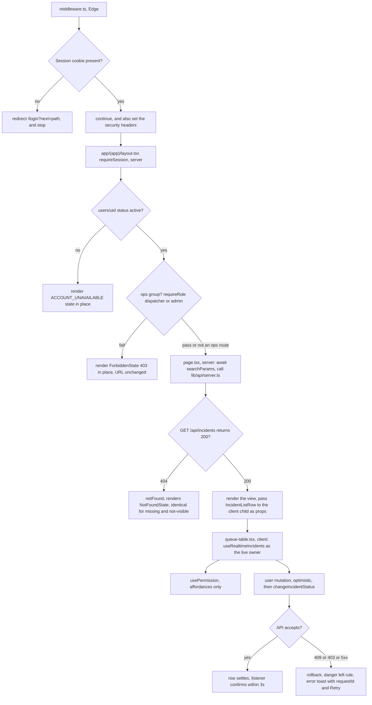

# 05 — Frontend Architecture

**Project:** CareGrid AI
**Document type:** Implementation architecture for the Next.js client
**Status:** Baseline v1.0 — normative for directory boundaries, component classification, hooks, and the API client
**Related documents:** [04 UI/UX Specification](./04_UI_UX_DESIGN_SPECIFICATION.md), [08 API Spec](./08_API_SPECIFICATION.md), [20 Folder Structure](./20_PROJECT_FOLDER_STRUCTURE.md), [22 Roles & Permissions](./22_USER_ROLES_PERMISSIONS.md), [25 Accessibility & Responsiveness](./25_ACCESSIBILITY_RESPONSIVENESS.md)

> This document describes the **client** only. Server behaviour, transactions, and the Admin SDK live in [06](./06_BACKEND_ARCHITECTURE.md) and [07](./07_DATABASE_SCHEMA.md). Nothing here may weaken a server-side check (NFR-015).

---

## 0. How to read this document

| Section | Contains |
| --- | --- |
| §1 | Pinned stack and the architectural principles |
| §2 | The App Router route tree and file conventions |
| §3 | Server vs Client component policy (normative decision table) |
| §4 | Component taxonomy and the import boundary rules |
| §5 | Complete `features/` breakdown with concrete filenames |
| §6 | Hooks catalogue (signature, return, rules) |
| §7 | The API client layer and every typed endpoint function |
| §8 | Auth handling and token lifecycle |
| §9 | `middleware.ts` design and what it may not decide |
| §10 | State management table and why there is no Redux/Zustand/React Query |
| §11 | Form handling (react-hook-form + zod) and the report form |
| §12 | Error boundaries and error reporting |
| §13 | Loading strategies, Suspense, and dynamic imports |
| §14 | Realtime integration rules (FR-090…FR-099) |
| §15 | TypeScript conventions |
| §16 | Performance patterns |
| §17 | Testability hooks |
| §18 | `DECISION REQUIRED` register |

---

## 1. Stack

### 1.1 Pinned dependencies (locked)

| Package | Version | Role |
| --- | --- | --- |
| `next` | 15.x (App Router) | Framework, routing, RSC, Route Handlers, middleware |
| `react`, `react-dom` | 19.x | Runtime |
| `typescript` | 5.7, `strict: true` | Types (NFR-022) |
| `tailwindcss` | 4.x | Styling, CSS-first `@theme` tokens |
| shadcn/ui | `new-york` style, base colour `neutral`, on Radix UI | Primitives in `components/ui` |
| `lucide-react` | latest | The only icon set ([04](./04_UI_UX_DESIGN_SPECIFICATION.md) §4.5) |
| `sonner` | latest | Toasts |
| `recharts` | 3.x | Charts |
| `react-hook-form` | 7.x | Form state |
| `zod` | 3.x (+ `@hookform/resolvers`) | Validation, both schemas and forms |
| `@vis.gl/react-google-maps` | latest | Map rendering |
| `firebase` (client SDK) | 9.x/10.x | Auth + Firestore/Storage listeners |
| `@google/genai` | pinned | **Server only** — never imported in client code ([09](./09_AI_GEMINI_SPECIFICATION.md) §2) |
| `firebase-admin` | pinned | **Server only** |

### 1.2 Architectural principles

| # | Principle | Enforcement |
| --- | --- | --- |
| A1 | **Server Components by default.** `"use client"` is opt-in and must be justified by interactivity. | Code review; §3 decision table; ESLint rule banning `"use client"` outside `features/**` client leaf files |
| A2 | **The client is never an authorization boundary.** It renders affordances from `GET /api/me` → `permissions`; the API re-checks everything (NFR-015, [22](./22_USER_ROLES_PERMISSIONS.md) §6). | No `role` is read from a request, a query string, or `localStorage` |
| A3 | **One source of truth per fact.** Server data in RSC, live data in `onSnapshot` hooks, filters in the URL, form state in RHF, everything else in `useState`. | §10 |
| A4 | **Realtime through `onSnapshot`, never polling** (FR-090, FR-099). | §14 |
| A5 | **At most 8 concurrent Firestore listeners per client** (FR-091). | A development-only listener counter that `console.warn`s past 6 and throws in tests |
| A6 | **No client-side Firestore writes except the four allowed** (own `profile`, own `responderLocations` heartbeat, notification `read` flag) — and only where Security Rules permit. | [07](./07_DATABASE_SCHEMA.md) §2, [22](./22_USER_ROLES_PERMISSIONS.md) §7 |
| A7 | **The URL is the filter state.** Every filter, sort, page size, cursor, and layer toggle is a query parameter. | `useIncidentFilters` (§6) |
| A8 | **Zero `any`** in `app/`, `features/`, `services/`, `lib/` (NFR-022). | ESLint `@typescript-eslint/no-explicit-any: error` |
| A9 | **No component over 400 lines** (NFR-024). | Custom lint check + review |
| A10 | **Typed envelopes.** Every API response is parsed by a Zod schema before it reaches a component. | §7.4 |

---

## 2. App Router structure

### 2.1 Route tree (normative)

Route groups are non-navigational; the URL is exactly what is shown in the segment path.

```
app/
├─ layout.tsx                          ← root: <html>, fonts, providers, Toaster, skip link
├─ loading.tsx                         ← root fallback only (rarely reached)
├─ error.tsx                           ← root error boundary (client)
├─ global-error.tsx                    ← last resort, replaces <html>
├─ not-found.tsx                       ← 404 for unmatched paths
├─ icon.svg  robots.ts  sitemap.ts     ← metadata routes
│
├─ (public)/                           ← no session required
│  ├─ layout.tsx                       ← centred shell, footer with demo disclaimer
│  ├─ page.tsx                         ← "/"            landing
│  ├─ error.tsx
│  ├─ not-found.tsx
│  ├─ login/page.tsx
│  ├─ signup/page.tsx
│  └─ forgot-password/page.tsx
│
├─ (auth)/                             ← requires a session; onboarding-ish surfaces
│  ├─ layout.tsx                       ← session gate (see §9.3)
│  └─ track/
│     ├─ page.tsx                      ← "/track"        searchParams: ref
│     ├─ loading.tsx
│     └─ error.tsx
│
├─ (app)/                              ← requires a session; role-aware chrome
│  ├─ layout.tsx                       ← Sidebar + TopBar + BottomNav + LiveProvider
│  ├─ loading.tsx
│  ├─ error.tsx
│  ├─ not-found.tsx
│  ├─ report/
│  │  ├─ page.tsx                      ← "/report"       all roles (FR-001)
│  │  ├─ loading.tsx
│  │  └─ error.tsx
│  ├─ dashboard/
│  │  ├─ page.tsx                      ← "/dashboard"    responder | dispatcher | admin
│  │  ├─ loading.tsx
│  │  └─ error.tsx
│  ├─ incidents/
│  │  ├─ page.tsx                      ← "/incidents"    history / archive, all roles
│  │  ├─ loading.tsx
│  │  ├─ error.tsx
│  │  └─ [id]/
│  │     ├─ page.tsx                  ← "/incidents/[id]"
│  │     ├─ loading.tsx
│  │     └─ error.tsx
│  ├─ map/
│  │  ├─ page.tsx                      ← "/map"          responder ◐ | dispatcher | admin
│  │  ├─ loading.tsx
│  │  └─ error.tsx
│  ├─ responders/
│  │  ├─ page.tsx                      ← "/responders"   responder (self) | dispatcher | admin
│  │  ├─ loading.tsx
│  │  └─ error.tsx
│  ├─ dispatches/
│  │  ├─ page.tsx                      ← "/dispatches"   responder | dispatcher | admin
│  │  ├─ loading.tsx
│  │  └─ error.tsx
│  ├─ analytics/
│  │  ├─ page.tsx                      ← "/analytics"    dispatcher | admin
│  │  ├─ loading.tsx
│  │  └─ error.tsx
│  ├─ notifications/
│  │  ├─ page.tsx                      ← "/notifications" all roles
│  │  ├─ loading.tsx
│  │  └─ error.tsx
│  ├─ profile/
│  │  ├─ page.tsx                      ← "/profile"      all roles
│  │  ├─ loading.tsx
│  │  └─ error.tsx
│  └─ settings/
│     ├─ page.tsx                      ← "/settings"     all roles (personal)
│     ├─ loading.tsx
│     └─ error.tsx
│
├─ (ops)/                              ← requires role >= dispatcher
│  ├─ layout.tsx                       ← asserts role; renders ForbiddenState (403) otherwise
│  └─ admin/
│     ├─ audit-logs/
│     │  ├─ page.tsx                   ← "/admin/audit-logs"  admin (full) | dispatcher (read-only)
│     │  ├─ loading.tsx
│     │  └─ error.tsx
│     ├─ settings/
│     │  ├─ page.tsx                   ← "/admin/settings"    admin  (DECISION REQUIRED: see [04](./04_UI_UX_DESIGN_SPECIFICATION.md) D7)
│     │  ├─ loading.tsx
│     │  └─ error.tsx
│     ├─ users/
│     │  ├─ page.tsx                   ← "/admin/users"       admin
│     │  ├─ loading.tsx
│     │  └─ error.tsx
│     ├─ incidents/
│     │  ├─ page.tsx                   ← "/admin/incidents"   dispatcher | admin
│     │  ├─ loading.tsx
│     │  └─ error.tsx
│     ├─ responders/
│     │  ├─ page.tsx                   ← "/admin/responders"  admin
│     │  ├─ loading.tsx
│     │  └─ error.tsx
│     └─ (admin-gated)/                ← admin only; the 403 is rendered by this layout
│        └─ page.tsx                   ← "/admin"             admin overview
│
├─ forbidden/
│  └─ page.tsx                         ← "/forbidden"    optional explicit destination for
│                                          role-gated "you need access" links only
│                                          (never auto-redirected to; see §9.4)
│
└─ api/                                ← Route Handlers; runtime = 'nodejs' on every file
   ├─ me/{bootstrap,route.ts}  me/route.ts            (GET/PATCH /api/me)
   ├─ auth/event/route.ts
   ├─ incidents/route.ts                              (GET/POST)
   ├─ incidents/[id]/route.ts                         (GET/PATCH/DELETE)
   ├─ incidents/[id]/{triage,merge,restore,export}/route.ts
   ├─ incidents/[id]/merge/undo/route.ts
   ├─ incidents/[id]/duplicates/dismiss/route.ts
   ├─ incidents/[id]/dispatch/route.ts
   ├─ incidents/[id]/dispatch/candidates/route.ts
   ├─ incidents/[id]/status/route.ts
   ├─ incidents/[id]/reports/route.ts
   ├─ responders/route.ts  responders/[id]/route.ts  responders/[id]/{location,incidents,verify,reject}/route.ts
   ├─ dispatches/route.ts  dispatches/summary/route.ts  dispatches/[id]/{claim,withdraw}/route.ts
   ├─ notifications/route.ts  notifications/[id]/route.ts  notifications/read-all/route.ts
   ├─ analytics/route.ts  analytics/recompute/route.ts
   ├─ uploads/{sign,finalize}/route.ts  uploads/[mediaId]/url/route.ts
   ├─ resources/route.ts  config/route.ts  health/route.ts
   ├─ admin/{users,audit-logs,config,responders,system/health,maintenance/[job]}/…
   └─ cron/[job]/route.ts                             ← guarded by CRON_SECRET
```

**Every API route file starts with `export const runtime = 'nodejs'`** ([08](./08_API_SPECIFICATION.md) §12.1).

### 2.2 File conventions

| File | Convention | Notes |
| --- | --- | --- |
| `layout.tsx` | Server by default. Fetches the session, renders shell, provides contexts. | A layout must not accept `searchParams` for authorisation decisions; it reads the session only. |
| `page.tsx` | Server Component unless it must be interactive. Reads `searchParams` / `params` (Promise in Next 15) and passes them to a client child. | `const { q, urgency } = await searchParams` — Next 15 made these async. |
| `loading.tsx` | Server Component returning the page's skeleton shell. | Wrapped in a Suspense boundary by the framework at the route segment level. |
| `error.tsx` | **Must** be a Client Component; receives `{ error, reset }`. | Never renders `error.message` (may contain internals); renders `error.digest` only. |
| `global-error.tsx` | Client; must render `<html>` and `<body>`. | Replaces the root layout when the root layout itself throws. |
| `not-found.tsx` | Server Component. | Also invoked by `notFound()` from a layout/page. |
| `route.ts` | Node runtime. | Handler contract lives in [08](./08_API_SPECIFICATION.md); Zod schema per route (NFR-025). |
| `default.ts` | Only for parallel routes. | See §2.4. |
| `template.tsx` | Only when a remount on navigation is required. | Avoid — it remounts the tree and loses state. |

### 2.3 Route groups

| Group | Purpose | Layout behaviour |
| --- | --- | --- |
| `(public)` | `/`, `/login`, `/signup`, `/forgot-password` | Centred shell, no session required, **no Firestore listeners anywhere in the subtree** (FR-095) |
| `(auth)` | `/track` | Session gate; a minimal top bar (no sidebar) |
| `(app)` | Every signed-in operational surface | Sidebar + TopBar + BottomNav; role-aware nav from [04](./04_UI_UX_DESIGN_SPECIFICATION.md) §8.5 |
| `(ops)` | `/admin/audit-logs`, `/admin/incidents`, `/admin/settings` | Same chrome; the layout asserts `role ∈ {dispatcher, admin}` and renders `ForbiddenState` (403) otherwise |
| `(ops)/admin/(admin-gated)` | `/admin` | Same chrome; asserts `role === 'admin'` |

### 2.4 Parallel and intercepting routes — and why there are almost none

| Pattern | Where it is used | Justification |
| --- | --- | --- |
| Parallel route `@modal` | **Not used** | Every confirmation in this product needs a `reason` and a title that names the entity. A route-driven `@modal` slot (with its `default.ts`) would make the reason-preserving `Dialog` state live in the URL, which is worse: role changes and deletes must not be bookmarkable. All dialogs are local component state. |
| Intercepting route `(.)photo/[id]` | **Not used** | There is no image-viewer route pattern. Evidence is opened in a `Dialog`/lightbox with a signed URL. |
| `@live` parallel slot on `/dashboard` | **Rejected** | It is tempting to render the queue (server) and the live listener (client) side by side. Rejected because it duplicates the query in two subsystems and makes the listener count unpredictable (FR-091). Instead: one `useRealtimeIncidents` hook owns the live data and the RSC payload is its SSR seed. |
| `@sidebar` on `(app)` | **Not used** | The sidebar is identical for every `(app)` route; a normal layout is correct. |
| `default.tsx` | **Not used** | No parallel routes exist. |

The single exception reserved for the future is a `/incidents/[id]/print` route for the audit export; it is not built in v1.

### 2.5 Metadata

| Route | `title` | `description` |
| --- | --- | --- |
| `/` | "CareGrid AI" | "Community incident reporting, routed to the people who can help." |
| `/report` | "Report an incident · CareGrid AI" | "Describe what is happening and where. You will get a reference you can quote." |
| `/track` | "Track a report · CareGrid AI" | "Check the status of a report you submitted." |
| `/dashboard` | "Dashboard · CareGrid AI" | "Live incident queue and assignments." |
| `/incidents` | "Incidents · CareGrid AI" | "Incident history." |
| `/incidents/[id]` | "{reference} · CareGrid AI" | dynamic |
| `/map` | "Map · CareGrid AI" | "Live incident and responder map." |
| `/admin/*` | "{Section} · Administration · CareGrid AI" | dynamic |
| `/login`, `/signup`, `/forgot-password` | "Sign in · CareGrid AI" | "Sign in to CareGrid AI." |

All authenticated pages are `robots: { index: false }`. `app/sitemap.ts` lists only `/`. A shared `generateMetadata` helper wraps each title with the `APP_NAME` from `GET /api/config`.

---

## 3. Server vs Client component policy

### 3.1 The decision table

| Directory / file | Default | `"use client"` allowed? | Reason |
| --- | --- | --- | --- |
| `app/layout.tsx` | Server | No | Session, fonts, metadata |
| `app/(public)/**` | Server | Only `auth-form.tsx` | No data; forms need interactivity |
| `app/(auth)/track/**` | Server (page) | Yes in the lookup form and the timeline body | Server fetch for the first paint |
| `app/(app)/**/page.tsx` | Server (page) | Yes, via a client child | Server fetch for the first paint, client for live updates |
| `app/(app)/**/loading.tsx` | Server | No | Static skeletons |
| `app/(app)/**/error.tsx` | **Client (required)** | Yes | Next.js requirement |
| `app/(ops)/**/layout.tsx` | Server | No | Role assertion happens on the server |
| `app/api/**/route.ts` | Server | No | Node runtime, Admin SDK |
| `components/ui/**` | Client | Yes | Radix primitives are inherently interactive |
| `components/layout/**` | Server | Yes — `top-bar.tsx` is client (bell, menus, live indicator) | Mixed; each file declares it |
| `components/map/**` | Client | Yes (required) | WebGL/DOM imperative API; loaded with `ssr:false` |
| `components/charts/**` | Client | Yes (required) | Recharts measures the DOM |
| `components/**` (product composites: `KpiTile`, `Timeline`, `UrgencyBadge`, `StatusBadge`, `DataTable`) | **Server** | Yes when they own an interaction (e.g. `QueueTable` is client) | A presentational badge must be renderable in RSC so it can appear in a server-rendered list |
| `features/*/api/**` | Server-safe | No | Pure typed wrappers over `lib/api` |
| `features/*/hooks/**` | Client | Yes | Hooks require a client module |
| `features/*/components/**` | Split: `*-view.tsx` server, `*-client.tsx` client | Yes | Convention below |
| `hooks/**` | Client | Yes | — |
| `lib/**` | Isomorphic unless `lib/server/**` | Yes, but never in a file that reads server env | [21](./21_ENVIRONMENT_VARIABLES.md) §1.3 |
| `services/**` | **Server only** | **No** | Admin SDK, Gemini, service-account credentials |
| `validators/**` | Isomorphic | Yes | Zod schemas are shared by client forms and route handlers |
| `types/**` | Isomorphic | Yes | `import type` only |

### 3.2 The `*-view.tsx` / `*-client.tsx` convention (normative inside `features/`)

```
features/incidents/
├─ components/
│  ├─ queue-table.tsx            "use client"   — owns the onSnapshot + row actions
│  ├─ queue-table-view.tsx       (server-safe)  — pure presentational row rendering
│  ├─ incident-filters.tsx       "use client"   — owns the URL filter state
│  └─ incident-summary.tsx       (server-safe)  — badges + SlaMeter, no interactivity
```

Rule: a component in `features/*/components/` is client **only** if it uses an event handler, a browser API, a React hook other than `useId`/`useSyncExternalStore`, or a context consumer that provides interactivity. Otherwise it is server-safe and is imported by client components where needed. This keeps the `"use client"` line a meaningful signal rather than a default.

### 3.3 What a Server Component may do

- Call `lib/api/server.ts` functions with the request cookie/`Authorization` forwarded from a Route Handler or read the session from a Server Component using `cookies()`.
- Render `ForbiddenState`, `EmptyState`, `ErrorState`, `Badge`, `UrgencyBadge`, `StatusBadge`, `Timeline`, `RelativeTime`, `Table` markup.
- Read `searchParams` / `params` and pass them down as props.
- **Never** import: `services/**`, `lib/server/**`, anything that reads a non-`NEXT_PUBLIC_` env var.

### 3.4 What a Client Component may do

- Call `lib/api/client.ts` functions.
- Own `onSnapshot` subscriptions, `useState`, RHF, `next/dynamic` with `ssr:false`.
- Read `NEXT_PUBLIC_*` env vars only, via `lib/env.client.ts`.
- **Never** import: `services/**`, `lib/server/**`, `lib/firebase-admin.ts`.

---

## 4. Component taxonomy

```
components/
├─ ui/                  ← shadcn/ui primitives (new-york, neutral). Owned by shadcn CLI; project props layered on.
│  ├─ button.tsx  icon-button.tsx  input.tsx  textarea.tsx  select.tsx
│  ├─ checkbox.tsx  radio-group.tsx  switch.tsx  label.tsx
│  ├─ card.tsx  badge.tsx  alert.tsx  dialog.tsx  sheet.tsx  tabs.tsx
│  ├─ table.tsx  pagination.tsx  breadcrumb.tsx  tooltip.tsx  progress.tsx
│  ├─ skeleton.tsx  avatar.tsx  separator.tsx  scroll-area.tsx
│  ├─ popover.tsx  dropdown-menu.tsx  command.tsx  slider.tsx  sonner.tsx
│  └─ index.ts                       ← the ONLY public entry point for components/ui
│
├─ layout/              ← app chrome. Owns the visual hierarchy from [04](./04_UI_UX_DESIGN_SPECIFICATION.md) §12
│  ├─ app-shell.tsx  sidebar.tsx  sidebar-nav.tsx  top-bar.tsx  bottom-nav.tsx
│  ├─ mobile-nav-sheet.tsx  page-header.tsx  breadcrumbs.tsx  toaster.tsx
│  ├─ live-indicator.tsx  connectivity-banner.tsx  skip-link.tsx
│  └─ index.ts
│
├─ feedback/            ← the state components from [04](./04_UI_UX_DESIGN_SPECIFICATION.md) §5.22–§5.23, §9
│  ├─ empty-state.tsx  error-state.tsx  forbidden-state.tsx  not-found-state.tsx
│  ├─ live-region.tsx  pending-badge.tsx  request-id.tsx
│  └─ index.ts
│
├─ map/                 ← client-only map surface (FR-080…FR-088)
│  ├─ map-panel.tsx  map-marker.tsx  map-marker-cluster.tsx  marker-legend.tsx
│  ├─ map-detail-panel.tsx  map-list-fallback.tsx  map-layer-control.tsx
│  ├─ duplicate-radius-ring.tsx  accuracy-radius.tsx  use-map-instance.ts
│  └─ index.ts
│
├─ charts/              ← Recharts 3 wrappers, all client + dynamic
│  ├─ chart-frame.tsx  bar-category-chart.tsx  line-trend-chart.tsx
│  ├─ response-histogram.tsx  sparkline.tsx  risk-zone-chart.tsx
│  └─ index.ts
│
└─ domain/              ← small presentational composites shared by ≥2 features
   ├─ urgency-badge.tsx  status-badge.tsx  confidence-badge.tsx  confidence-bar.tsx
   ├─ sla-meter.tsx  role-badge.tsx  timestamp.tsx  relative-time.tsx  avatar-name.tsx
   ├─ safety-flag-chips.tsx  kpi-tile.tsx  timeline.tsx  evidence-grid.tsx
   ├─ location-badge.tsx  filter-bar.tsx  search-input.tsx  pagination-bar.tsx
   ├─ command-palette.tsx  (DECISION REQUIRED — [04](./04_UI_UX_DESIGN_SPECIFICATION.md) D1)
   └─ index.ts
```

Import rules (enforced by ESLint `no-restricted-imports`, see [20](./20_PROJECT_FOLDER_STRUCTURE.md) §3):

| Rule | Reason |
| --- | --- |
| `components/**` MUST NOT import from `features/**` | Domain composites are lower-level than features; the reverse would create a cycle |
| `components/**` MUST NOT import from `services/**` | Client components could pull Admin SDK into the browser bundle (NFR-013) |
| `components/ui/**` MUST NOT import from any `caregrid/` directory | shadcn components stay diffable against upstream |
| `lib/**` MUST NOT import from `features/**` or `components/**` | `lib` is the lowest layer |
| `hooks/**` MUST NOT import from `features/**` | Hooks are shared; features consume them |
| `services/**` MUST NOT import from `features/**`, `components/**`, `hooks/**` | Server-only layer |
| `features/*` MAY import from `components/**`, `lib/**`, `services/**`(client-safe only), `hooks/**`, `validators/**`, `types/**` | The one legal direction |

---

## 5. `features/` breakdown

One folder per domain. Each folder follows the same internal shape:

```
features/<domain>/
├─ api/<name>.ts        ← typed wrappers around lib/api/client.ts (or server variants)
├─ hooks/use<Name>.ts   ← data + behaviour hooks
├─ components/*.tsx     ← view/client split per §3.2
├─ schemas.ts           ← zod schemas for client-side validation only
├─ copy.ts              ← every user-visible string in the feature (so §15.7 "no !" is testable)
├─ types.ts             ← feature-local types derived from zod/API schemas
└─ index.ts             ← the feature's public API (barrel)
```

### 5.1 `features/auth`

| File | Purpose |
| --- | --- |
| `api/session.ts` | `meGet`, `meBootstrap`, `mePatch`, `authEvent` wrappers |
| `hooks/useAuth.ts` | Firebase Auth lifecycle → session shape |
| `hooks/useCurrentUser.ts` | `GET /api/me` → `{ user, profile, permissions }` |
| `hooks/usePermission.ts` | `can(permission, resource?)` |
| `components/auth-form.tsx` | `/login` form (client) |
| `components/signup-form.tsx` | `/signup` form (client) |
| `components/forgot-password-form.tsx` | `/forgot-password` form (client) |
| `components/google-sign-in-button.tsx` | `signInWithPopup` |
| `components/signed-in-notice.tsx` | "You are already signed in as X" panel for `(public)` routes |
| `copy.ts`, `schemas.ts`, `types.ts`, `index.ts` | — |

### 5.2 `features/reporting`

| File | Purpose |
| --- | --- |
| `api/uploads.ts` | `signUpload`, `finalizeUpload`, `getMediaUrl` |
| `api/incidents.ts` | `createIncident`, `patchIncident` (location/summary) |
| `hooks/useUpload.ts` | Per-file validation, sign → PUT → finalize, progress, retry, cancel |
| `hooks/useMediaRecorder.ts` | `MediaRecorder` lifecycle, 120 s cap, `MediaRecorder` support detection |
| `hooks/useGeolocation.ts` | Explicit-permission-only acquisition, accuracy grading, `HEARTBEAT`-free one-shot |
| `hooks/useReportDraft.ts` | `localStorage` draft persistence and restore (FR-014, P1) |
| `hooks/useDuplicatePreflight.ts` | Optional pre-submit check (only if the API is amended — see [04](./04_UI_UX_DESIGN_SPECIFICATION.md) D2) |
| `components/report-form.tsx` | The orchestrator (client) |
| `components/evidence-picker.tsx` | Photo slots + camera/gallery |
| `components/audio-recorder.tsx` | 56 px record button, elapsed time, auto-stop at 120 s |
| `components/location-picker.tsx` | GPS / pin / address / skip (FR-033) |
| `components/duplicate-notice.tsx` | `potential_duplicate` decision UI (US-007) |
| `components/report-success.tsx` | `role="status"` success with the reference, copy, share |
| `components/privacy-note.tsx` | The one-line who-can-see statement (US-042 AC1) |
| `copy.ts`, `schemas.ts`, `types.ts`, `index.ts` | — |

### 5.3 `features/incidents`

| File | Purpose |
| --- | --- |
| `api/incidents.ts` | `listIncidents`, `getIncident`, `patchIncident`, `retriageIncident`, `deleteIncident`, `restoreIncident` |
| `api/duplicates.ts` | `mergeIncident`, `undoMerge`, `dismissDuplicate` |
| `api/export.ts` | `exportIncidentsCsv` (returns a blob + filename) |
| `hooks/useIncidentFilters.ts` | URL-backed filter/sort/pagination state |
| `hooks/useRealtimeIncidents.ts` | The live queue listener (§14) |
| `hooks/useRealtimeIncident.ts` | Single-incident listener |
| `hooks/useIncidentMutations.ts` | verify / false alarm / cancel / close / force status, with optimistic writes + rollback (FR-076) |
| `hooks/useSlaCountdown.ts` | 15 s tick + server `slaState` reconciliation |
| `hooks/usePagination.ts` | Cursor pagination over `{ items, page }` |
| `components/queue-table.tsx` / `queue-table-view.tsx` | The live dispatcher queue (FR-072 columns) |
| `components/queue-card-list.tsx` | The < 768 px card rendering of the same data |
| `components/history-table.tsx` | The paginated archive table |
| `components/incident-header.tsx` | Reference, badges, SLA meter, action bar |
| `components/original-report.tsx` | `originalText` verbatim + evidence |
| `components/linked-reports.tsx` | `data.reports[]` with `kind` |
| `components/evidence-grid.tsx` | Images + audio + the AI transcript alternative |
| `components/incident-timeline.tsx` | `data.history[]` (FR-122) |
| `components/ai-triage-panel.tsx` | `data.ai` + `ConfidenceBar` + the "advisory" framing |
| `components/duplicate-panel.tsx` | Possible duplicate + link / dismiss / undo |
| `components/assign-panel.tsx` | `GET …/dispatch/candidates` ranked list + `POST …/dispatch` |
| `components/verify-dialog.tsx` / `false-alarm-dialog.tsx` / `status-change-dialog.tsx` | Reason-required mutations |
| `components/merge-dialog.tsx` | The 24 h undoable merge |
| `components/edit-fields-drawer.tsx` | `summary` / `urgency` / `category` / `location` (dispatcher/admin) |
| `components/export-button.tsx` | "Export for local authority" (never "send to authorities") |
| `copy.ts`, `schemas.ts`, `types.ts`, `index.ts` | — |

### 5.4 `features/dispatch`

| File | Purpose |
| --- | --- |
| `api/dispatches.ts` | `listDispatches`, `claimDispatch`, `withdrawDispatch`, `dispatchSummary` |
| `hooks/useRealtimeDispatches.ts` | Listener for the dispatcher's ledger and the responder's own dispatches |
| `hooks/useDispatchExpiry.ts` | Countdown to `expiresAt` (default 120 s) |
| `components/dispatch-table.tsx` | The ledger |
| `components/dispatch-card.tsx` | Mobile card with Accept / Withdraw |
| `components/candidate-list.tsx` | Ranked responders, `staleLocation` last, `capabilityMatch`, `etaSec` |
| `components/assign-dialog.tsx` | The one-click assignment flow (FR-074) + "Verify and assign" combined action |
| `components/withdraw-dialog.tsx` | Reason-required withdrawal |
| `copy.ts`, `schemas.ts`, `types.ts`, `index.ts` | — |

### 5.5 `features/responders`

| File | Purpose |
| --- | --- |
| `api/responders.ts` | `listResponders`, `getResponder`, `patchResponder`, `patchResponderLocation`, `verifyResponder`, `rejectResponder`, `listResponderIncidents` |
| `hooks/useAvailability.ts` | `available ⇄ offline` toggle with the `verification` gate (US-010) |
| `hooks/useLocationHeartbeat.ts` | 60 s heartbeat, only when `status !== 'offline'` (FR-066), back-off on `HEARTBEAT_TOO_FREQUENT` |
| `hooks/useRealtimeResponderLocations.ts` | Dispatcher/admin map listener |
| `components/responder-table.tsx` | The directory |
| `components/responder-card.tsx` | Mobile card |
| `components/responder-detail-drawer.tsx` | Full record for dispatcher/admin |
| `components/availability-card.tsx` | The responder's own on-duty control |
| `components/capabilities-multi-select.tsx` | Capability declaration from `GET /api/resources` |
| `components/service-radius-field.tsx` | `Slider` + numeric `Input` with an "m" suffix |
| `components/verification-queue.tsx` | Admin approve/reject with a reason (FR-063) |
| `copy.ts`, `schemas.ts`, `types.ts`, `index.ts` | — |

### 5.6 `features/map`

| File | Purpose |
| --- | --- |
| `api/map-queries.ts` | `listIncidents({ center, radiusM, status, limit })` and the `config` subset |
| `hooks/useMapInstance.ts` | Map refs, `fitBounds`, `panTo`, "recentre" intent, teardown |
| `hooks/useViewportIncidents.ts` | Bounded viewport query (≤ 150, ≤ 9 cells server-side) |
| `components/live-map.tsx` | The client wrapper (dynamic-imported by `components/map/map-panel.tsx`) |
| `components/marker-legend.tsx` | Re-export/wrapper of `components/map/marker-legend.tsx` with feature data |
| `components/map-controls.tsx` | Zoom, fit, centre-on-me, layers, show-list |
| `components/risk-zone-layer.tsx` | Only when `features.riskZones` is true |
| `copy.ts`, `schemas.ts`, `types.ts`, `index.ts` | — |

### 5.7 `features/notifications`

| File | Purpose |
| --- | --- |
| `api/notifications.ts` | `listNotifications`, `markNotificationRead`, `markAllNotificationsRead`, `expireNotification` |
| `hooks/useRealtimeNotifications.ts` | The single listener behind the bell **and** the page (listener 6/8) |
| `hooks/useUnreadCount.ts` | Derived selector over the same listener (no second query) |
| `components/notification-bell.tsx` | `IconButton` with an unread badge |
| `components/notification-list.tsx` | The `/notifications` list + filters |
| `components/notification-item.tsx` | Severity badge, title, body, `RelativeTime`, open action |
| `components/mark-all-read-button.tsx` | Chunked batch (≤ 200 per call) |
| `copy.ts`, `schemas.ts`, `types.ts`, `index.ts` | — |

### 5.8 `features/analytics`

| File | Purpose |
| --- | --- |
| `api/analytics.ts` | `getAnalytics`, `recomputeAnalytics` |
| `hooks/useAnalyticsRange.ts` | `from`/`to`/`granularity`/`include` in the URL |
| `components/analytics-range-control.tsx` | Date range + granularity + source banner |
| `components/totals-grid.tsx` | The 18 `data.totals` fields as `KpiTile`s |
| `components/category-chart.tsx` / `trend-chart.tsx` / `response-chart.tsx` / `risk-zone-table.tsx` | Thin's the `components/charts/*` primitives |
| `components/chart-data-table.tsx` | The accessible table alternative for every chart |
| `components/export-csv-button.tsx` | `format=csv` |
| `copy.ts`, `schemas.ts`, `types.ts`, `index.ts` | — |

### 5.9 `features/admin`

| File | Purpose |
| --- | --- |
| `api/admin.ts` | `adminListUsers`, `adminGetUser`, `adminChangeRole`, `adminSetUserStatus`, `adminResetClaims`, `adminAuditLogs`, `adminGetConfig`, `adminPatchConfig`, `adminListResponders`, `adminSystemHealth`, `adminMaintenance` |
| `components/admin-overview.tsx` | Trust queue + health tiles + last privileged actions |
| `components/user-table.tsx` | `/admin/users` |
| `components/role-change-dialog.tsx` | Two-step (US-031 AC1) |
| `components/suspend-dialog.tsx` / `reset-claims-dialog.tsx` | Reason-required |
| `components/user-detail-drawer.tsx` | User + responder record + recent audit |
| `components/audit-log-table.tsx` / `audit-entry-drawer.tsx` | Before/after diff |
| `components/config-form.tsx` | Duplicate radius 100–2000 m, window 1–72 h, similarity 0.2–0.9, SLA per urgency, risk params, retention |
| `components/system-health-table.tsx` | Reads, listeners, AI success/fallback |
| `components/maintenance-buttons.tsx` | Disabled-with-reason unless `features.maintenance` is true |
| `copy.ts`, `schemas.ts`, `types.ts`, `index.ts` | — |

### 5.10 `features/incident-archive`

Serves `/incidents` and `/admin/incidents`; kept separate so the privileged `includeDeleted` path is auditable in one place.

| File | Purpose |
| --- | --- |
| `api/archive.ts` | `listIncidents({ includeDeleted })`, `restoreIncident` |
| `hooks/useDeletedIncidents.ts` | Enables `includeDeleted` only for dispatcher/admin, always logging that the view is audited |
| `components/archive-table.tsx` | Rows with `deletedAt` / `deletedBy` / `deleteReason` |
| `components/restore-dialog.tsx` | Reason required for dispatcher, optional for admin |
| `copy.ts`, `schemas.ts`, `types.ts`, `index.ts` | — |

### 5.11 `features/location` (shared primitives)

| File | Purpose |
| --- | --- |
| `api/geocode.ts` | Client-side Places search with the 300 ms debounce (FR-087) |
| `hooks/useDebounce.ts` | Shared debouncer (re-exported from `hooks/`) |
| `components/accuracy-badge.tsx` | `high` / `medium` / `low` / `unknown` with metres |
| `components/pin-drop-sheet.tsx` | Manual pin (`source: 'manual_pin'`, `placeId`) |
| `components/address-input.tsx` | `source: 'address_text'` (3–200 chars) |
| `copy.ts`, `types.ts`, `index.ts` | — |

### 5.12 `features/track`

| File | Purpose |
| --- | --- |
| `api/track.ts` | Reference lookup — **pending the API decision [04](./04_UI_UX_DESIGN_SPECIFICATION.md) D2** |
| `components/reference-lookup.tsx` | The `font-mono` reference `Input` |
| `components/track-summary.tsx` | Status, urgency, "what happens next" |
| `components/track-timeline.tsx` | Plain-language timeline (the `eventType` codes are never shown raw) |
| `components/what-happens-next.tsx` | The per-status sentence table |
| `components/add-information.tsx` | US-006 supplements within 2 h |
| `copy.ts`, `types.ts`, `index.ts` | — |

---

## 6. Hooks catalogue

Every hook is listed with its signature, its return shape, and the rules it must obey. "Rules" are testable.

### 6.1 `useAuth`

```ts
// hooks/useAuth.ts
type AuthStatus = 'initialising' | 'signed-out' | 'signed-in';
type AuthState = {
  status: AuthStatus;
  user: AuthUser | null;         // { uid, email, displayName, emailVerified, photoURL }
  idToken: string | null;        // cached for API calls; refreshed on demand
  getFreshToken: (force?: boolean) => Promise<string>;  // force ⇒ getIdToken(true)
  signIn: (email: string, password: string) => Promise<void>;
  signInWithGoogle: () => Promise<void>;
  signUp: (email: string, password: string, displayName: string) => Promise<void>;
  sendPasswordReset: (email: string) => Promise<void>;
  signOut: () => Promise<void>;
  error: AuthError | null;       // { code, message } — catalogue codes only
};
export function useAuth(): AuthState;
```

**Rules**

1. `status === 'initialising'` until `onAuthStateChanged` fires once. Any protected render path must handle it.
2. `getFreshToken(force = false)` calls `getIdToken()`; `force` calls `getIdToken(true)`. `getFreshToken(true)` is called **after** a role change is observed ([08](./08_API_SPECIFICATION.md) §10).
3. `signOut()` must, in this order: `signOut()` → `dispatchEvent(new Event('cg:cache-clear'))` → clear `localStorage` keys prefixed `cg.` except `cg.ui` → clear the in-memory listener registry (§14.5). Sign-out clears locally cached incident data (US-042 AC3).
4. No `role` is exposed by this hook. Roles come from `useCurrentUser`.
5. Errors are mapped to `AuthError` catalogue codes: `INVALID_PASSWORD`, `USER_NOT_FOUND`, `USER_DISABLED`, `NETWORK`, `TOO_MANY_ATTEMPTS`. The UI shows one neutral message for all of them.

### 6.2 `useCurrentUser`

```ts
type CurrentUser = {
  user: UserPublic | null;       // from GET /api/me → data.user
  profile: Profile | null;       // data.profile
  permissions: Permission[];     // data.permissions — server-computed affordance list
  role: Role | null;             // data.user.role
  isLoading: boolean;
  error: ApiError | null;
  refresh: () => Promise<void>;
};
export function useCurrentUser(): CurrentUser;
```

**Rules**

1. Fetches `GET /api/me` once per session; cached in a React context provider mounted in `(app)/layout.tsx`.
2. `permissions` is used for **affordances only**. It is never sent to the API as an authorization input ([22](./22_USER_ROLES_PERMISSIONS.md) §2).
3. When `data.permissions` is empty the UI renders nothing privileged — it does not fall back to showing disabled buttons with no reason.

### 6.3 `usePermission`

```ts
type PermissionScope = { incidentId?: string; incidentPermissions?: string[] };
type PermissionApi = {
  can: (permission: Permission, scope?: PermissionScope) => boolean;
  canAny: (permissions: Permission[], scope?: PermissionScope) => boolean;
  isOps: boolean;                // role === 'dispatcher' || role === 'admin'
  isAdmin: boolean;
  isResponder: boolean;
  isCitizen: boolean;
};
export function usePermission(scope?: PermissionScope): PermissionApi;
```

**Rules**

1. `can(p)` returns `permissions.includes(p)`.
2. `can(p, { incidentPermissions })` prefers the **per-resource** list from `GET /api/incidents/:id` → `data.permissions` when present; the global list is only the fallback.
3. `can()` returning `true` does not skip the server's re-check, and the UI must still show the pending/rollback treatment (FR-076).

### 6.4 `useRealtimeIncidents`

```ts
type QueueFilters = {
  status?: IncidentStatus[]; urgency?: Urgency[]; category?: IncidentCategory[];
  verified?: 'true' | 'false' | 'any'; slaState?: 'on_track' | 'at_risk' | 'breached';
  unassigned?: boolean; q?: string; sort?: 'newest' | 'oldest' | 'urgency' | 'sla' | 'distance';
  center?: string; radiusM?: number; limit?: number;      // limit default 50, max 200
};
type RealtimeQueue = {
  items: IncidentListRow[];        // same shape as GET /api/incidents → data.items
  isLoading: boolean;
  isReconnecting: boolean;
  error: ApiError | null;
  lastUpdatedAt: number | null;
  changedIds: Set<string>;         // ids updated in the last 600 ms, for the row flash
  pendingIds: Set<string>;         // optimistic writes awaiting server confirmation
  seed: IncidentListRow[] | null;  // the RSC payload used to avoid a flash of emptiness
};
export function useRealtimeIncidents(filters: QueueFilters, options?: {
  seed?: IncidentListRow[]; includeMetadataChanges?: boolean; enabled?: boolean;
}): RealtimeQueue;
```

**Rules**

1. **Always `limit()`.** Default 50, absolute max 200 ([07](./07_DATABASE_SCHEMA.md) §12.5). No unbounded listener ever.
2. The query is **role-scoped**: `citizen` forces `where('reporterUid','==',uid)`; `responder` uses the API-backed view (see below); `dispatcher`/`admin` use the operational view.
3. **Responder visibility is not a client query.** Firestore rules cannot evaluate distance ([22](./22_USER_ROLES_PERMISSIONS.md) §7), so a responder's queue is delivered by a server-backed realtime feed: the client subscribes to a **single** `onSnapshot` on `dispatches` where `responderUid == uid` plus the assigned incident documents, and in-radius unassigned incidents arrive via the API's `GET /api/incidents` on reconnect/refresh. This keeps listeners at ≤ 2 and the rules correct.
4. `includeMetadataChanges: true` only when the consumer renders a pending state (`queue` variant, FR-093).
5. Teardown on unmount, on filter change, and on role change.
6. `changedIds` drives the 600 ms live flash; under `prefers-reduced-motion` the consumer renders a static left rule instead ([04](./04_UI_UX_DESIGN_SPECIFICATION.md) §4.6).
7. `seed` is used for the very first render so there is no empty flash between the RSC payload and the first snapshot.

### 6.5 `useRealtimeIncident`

```ts
type RealtimeIncident = {
  incident: IncidentDetail | null;
  history: StatusHistoryEvent[];
  dispatch: DispatchSummary | null;
  isLoading: boolean; isReconnecting: boolean; error: ApiError | null;
};
export function useRealtimeIncident(incidentId: string, expand?: ExpandList): RealtimeIncident;
```

**Rules:** one listener on `incidents/{id}` plus (optionally) `incidents/{id}/statusHistory` `limit(200) orderBy createdAt desc`. Never more than 2 listeners for this page. If `expand` does not include `history`, the history subcollection listener is not created.

### 6.6 `useRealtimeResponderLocations`

```ts
type ResponderLocations = {
  locations: ResponderLocationDoc[];   // responderLocations/{uid} where status != 'offline'
  isLoading: boolean; isReconnecting: boolean;
  lastUpdatedAt: number | null;
};
export function useRealtimeResponderLocations(options?: { enabled?: boolean }): ResponderLocations;
```

**Rules:** dispatcher/admin only; a citizen or responder calling this hook gets an immediate `error` of `FORBIDDEN` and no subscription. `limit(150)`. Never established on a mobile responder build (the responder's own position is written, not read).

### 6.7 `useRealtimeNotifications`

```ts
type RealtimeNotifications = {
  items: NotificationItem[];      // limit 50, orderBy createdAt desc
  unreadCount: number;
  isLoading: boolean; isReconnecting: boolean;
  markRead: (id: string) => Promise<void>;
  markAllRead: (types?: NotificationType[]) => Promise<{ updated: number }>;
  dismiss: (id: string) => Promise<void>;
};
export function useRealtimeNotifications(): RealtimeNotifications;
```

**Rules**

1. The query is always `where('recipientUid','==',uid)`. The hook exposes **no** parameter to widen it (FR-103).
2. `unreadCount` is computed from the same snapshot — there is no second query and no separate counter read.
3. `markRead` is a **client SDK write** permitted by the rules (`read`, `readAt` only) — the cheapest correct path. Everything else goes through the API.
4. `markAllRead` batches through `POST /api/notifications/read-all` in pages of ≤ 200 and handles `BATCH_TOO_LARGE` by continuing.
5. `aria-live` announcements are emitted only for `severity: 'critical'` and `'warning'` items, and at most once per item id (dedupe in a `Set`).

### 6.8 `useIncidentFilters`

```ts
type IncidentFilterState = {
  filters: QueueFilters;
  page: { limit: number; cursor: string | null };
  setFilter: <K extends keyof QueueFilters>(key: K, value: QueueFilters[K]) => void;
  toggleArrayFilter: (key: 'status' | 'urgency' | 'category', value: string) => void;
  setSort: (sort: NonNullable<QueueFilters['sort']>) => void;
  setLimit: (limit: number) => void;
  clearAll: () => void;
  activeChips: FilterChip[];      // [{ key, label, onRemove }]
  queryString: string;
  isDirty: boolean;               // differs from the initial (SSR) state
};
export function useIncidentFilters(initial: QueueFilters): IncidentFilterState;
```

**Rules**

1. The URL is the single source of truth; `useSearchParams` + `router.replace(..., { scroll: false })`.
2. Any filter change resets `cursor` to `null` (a cursor is only valid for its exact query).
3. Values are parsed through a Zod schema and **dropped** (not passed through) when invalid, so a hand-edited URL cannot inject a `reporterUid` or `includeDeleted` the role is not allowed.
4. `useDebounce(300)` is applied to `q` only, and each keystroke aborts the previous request.
5. The same hook instance is used by `/dashboard`, `/incidents`, and `/map` so the queue and the map stay in sync (US-024 AC3).

### 6.9 `usePagination`

```ts
type CursorPage<T> = {
  items: T[];
  nextCursor: string | null;
  hasMore: boolean;
  limit: number;
};
type Pagination = {
  page: CursorPage<unknown> | null;
  isLoading: boolean; error: ApiError | null;
  next: () => Promise<void>;      // replaces the list
  prev: () => void;               // pops the cursor stack
  setLimit: (n: 25 | 50 | 100) => void;
  range: { from: number; to: number };   // for "Rows 26–50"
};
export function usePagination<T>(
  fetchPage: (cursor: string | null, limit: number) => Promise<CursorPage<T>>,
  options?: { initialLimit?: number },
): Pagination;
```

**Rules:** cursor stack only (no offsets, FR-121). `prev` is client-side stack popping; no refetch. `limit` is clamped to `{25, 50, 100}`; 100 is the FR-121 maximum. `INVALID_CURSOR` resets the stack and toasts once.

### 6.10 `useGeolocation`

```ts
type GeoFix = {
  lat: number; lng: number; accuracyM: number;
  accuracyGrade: 'high' | 'medium' | 'low' | 'unknown';   // FR-032 thresholds
  capturedAt: number;
};
type Geolocation = {
  fix: GeoFix | null;
  error: 'denied' | 'unavailable' | 'timeout' | 'insecure-context' | null;
  isLocating: boolean;
  request: () => Promise<GeoFix | null>;    // MUST be called from a user gesture (FR-030)
  clear: () => void;
  supported: boolean;                        // window.isSecureContext && 'geolocation' in navigator
};
export function useGeolocation(options?: { timeoutMs?: number; maxAgeMs?: number }): Geolocation;
```

**Rules**

1. `request()` is only ever called from a click handler. **No automatic prompt on mount or on page load** (FR-030).
2. `accuracyGrade` is computed exactly per FR-032: `high ≤ 50 m`, `medium ≤ 200 m`, `low ≤ 1000 m`, else `unknown`.
3. `accuracyM > 1000` is still returned but the UI must show "Location is approximate" and offer a pin (FR-033).
4. `error: 'insecure-context'` (non-HTTPS) is distinguished from `'denied'` so the copy can be different.
5. Coordinates are never written to `localStorage`; the fix is held in component state and submitted once.

### 6.11 `useMapInstance`

```ts
type MapInstance = {
  map: google.maps.Map | null;
  mapRef: RefObject<HTMLDivElement | null>;
  fitBounds: (bounds: LatLngBoundsLike, padding?: number) => void;
  panTo: (lat: number, lng: number) => void;
  zoomTo: (zoom: number) => void;
  recenterIntent: 'none' | 'user' | 'results' | 'incident';
  requestRecenter: (intent: Exclude<RecenterIntent, 'none'>) => void;
  isReady: boolean;
  loadError: string | null;     // non-null ⇒ render the list fallback (FR-085)
};
export function useMapInstance(options?: { initialCenter?: LatLng; zoom?: number }): MapInstance;
```

**Rules**

1. **Never auto-pan or auto-fly on a realtime marker change.** `recenterIntent` is only set by an explicit user action ([04](./04_UI_UX_DESIGN_SPECIFICATION.md) §5.30).
2. `loadError` is set when the Maps script fails or `gmp/auth` fails; the consumer switches to `MapListFallback` and offers `Retry map`.
3. All map motion is disabled under `prefers-reduced-motion`.
4. The map API key comes from `NEXT_PUBLIC_GOOGLE_MAPS_API_KEY` via `lib/env.client.ts`; the script is loaded once per session by `components/map/map-panel.tsx` and cached in a module-level promise.

### 6.12 `useMediaRecorder`

```ts
type RecorderState = {
  isSupported: boolean;         // 'MediaRecorder' in window && isSecureContext
  status: 'idle' | 'recording' | 'processing' | 'error';
  elapsedSec: number;
  clip: { blob: Blob; mimeType: string; durationSec: number; sizeBytes: number } | null;
  error: 'unsupported' | 'permission-denied' | 'too-long' | 'unknown' | null;
  start: () => Promise<void>;
  stop: () => void;
  reset: () => void;
};
export function useMediaRecorder(options?: { maxDurationSec?: number }): RecorderState;
```

**Rules**

1. `maxDurationSec` defaults to **120** (FR-006); the clip auto-stops with a visible message (US-003 AC2).
2. Accepted MIME types are exactly `audio/webm`, `audio/mp4`, `audio/mpeg`; the first supported one is chosen.
3. When unsupported the hook reports `isSupported: false` and the UI **hides** the voice option and shows a text alternative (US-003 AC3) — the control is not rendered disabled.
4. The clip is never uploaded automatically; it becomes part of the report form's `media` array after `useUpload` runs.
5. `elapsedSec` ticks every 500 ms with tabular numerals and is not an `aria-live` region.

### 6.13 `useUpload`

```ts
type UploadItem = {
  mediaId: string; kind: 'image' | 'audio'; file: File;
  status: 'queued' | 'signing' | 'uploading' | 'finalizing' | 'done' | 'error' | 'cancelled';
  progress: number;              // 0..1
  error: { code: string; message: string } | null;
  signedPath: string | null;     // staging path for POST /api/incidents
  verifiedContentType: string | null;
};
type UploadApi = {
  items: UploadItem[];
  add: (files: FileList | File[]) => void;
  retry: (mediaId: string) => void;
  remove: (mediaId: string) => void;
  retryAll: () => void;
  isBusy: boolean;               // any item not 'done' ⇒ submit disabled
  allDone: boolean;
  buildMediaPayload: () => MediaRefInput[];   // for POST /api/incidents
};
export function useUpload(options: { kind: 'image' | 'audio'; max: 1 | 3 }): UploadApi;
```

**Rules**

1. Client-side pre-validation for fast feedback only; the server re-validates by sniffing magic bytes (FR-008). Copy must say so.
2. Limits: images ≤ 3 × 5 MB and `image/jpeg|png|webp`; audio ≤ 1 × 15 MB and ≤ 120 s (FR-005, FR-006).
3. Flow per file: `POST /api/uploads/sign` → `PUT` the raw bytes to the signed URL with `Content-Type: requiredContentType` → `POST /api/uploads/finalize` (optional fast-fail). The file bytes **never transit a Vercel function** (FR-007).
4. One file failing does not affect the others; `retry(mediaId)` re-runs just that file (US-002 AC4).
5. A staging file not claimed within 30 minutes is swept server-side; the client has a `setTimeout` warning at 25 minutes on long-lived drafts.
6. `isBusy` disables the submit button and the reason is shown as helper text ([04](./04_UI_UX_DESIGN_SPECIFICATION.md) §10.4).

### 6.14 `useSlaCountdown`

```ts
type SlaCountdown = {
  slaState: 'on_track' | 'at_risk' | 'breached';
  remainingSec: number;          // negative when breached
  overSec: number;
  label: string;                 // "On track · 3 min left" / "Target passed · 18 min over"
  percentUsed: number;           // 0..1+ against slaTargetMin
  startedFrom: number;           // verifiedAt ?? createdAt (FR-057)
};
export function useSlaCountdown(input: {
  slaTargetMin: number; slaState: SlaCountdown['slaState'];
  verifiedAt: string | null; createdAt: string; updatedAt: string;
}, options?: { tickMs?: number }): SlaCountdown;
```

**Rules**

1. `tickMs` defaults to **15,000** — a per-second countdown in a 50-row table is a rendering cost and a screen-reader hazard.
2. The clock start is `verifiedAt ?? createdAt`; the server's `slaState` is authoritative and re-syncs the client on every `updatedAt` change (US-025 AC3).
3. Crossing `breached` fires a `breachedAnnounced` callback **exactly once per incident id** (US-025 AC2) — the component keeps a `Set<string>` of announced ids.
4. The countdown is **not** an `aria-live` region. Only the `breached` transition announces, once, via `role="status"`.
5. Times are displayed in `APP_TIMEZONE` (FR-146); all arithmetic is on UTC ISO strings.

### 6.15 `useToast`

```ts
type ToastApi = {
  success: (title: string, opts?: { description?: string; action?: ToastAction }) => string;
  error:   (title: string, opts?: { description?: string; requestId?: string; retry?: () => void }) => string;
  warning: (title: string, opts?: { description?: string }) => string;
  info:    (title: string, opts?: { description?: string }) => string;
  promise: <T>(p: Promise<T>, msgs: { loading: string; success: string | ((v: T) => string); error: string }) => Promise<T>;
  dismiss: (id?: string) => void;
};
export function useToast(): ToastApi;
```

**Rules**

1. Wraps `sonner`; nothing else in the app imports `sonner` directly.
2. **All strings come from a `copy.ts` in the owning feature.** `useToast` takes text, never JSX (and the strings contain no `!` — [04](./04_UI_UX_DESIGN_SPECIFICATION.md) §15.7).
3. `error` toasts are persistent, carry a `Retry` action when the call is idempotent, and include `requestId` in mono.
4. `promise` is the default for mutations so a pending state exists for every user-initiated write (FR-098).
5. Critical-severity **notifications** are rendered as a persistent `Alert`, never a toast — a toast that disappears cannot be audited.

### 6.16 `useOnlineStatus`

```ts
type OnlineStatus = {
  isOnline: boolean;             // navigator.onLine + Firestore connectivity
  isReconnecting: boolean;
  lastUpdateAt: number | null;
  wentOfflineAt: number | null;
};
export function useOnlineStatus(): OnlineStatus;
```

**Rules**

1. Combines the `online`/`offline` window events with the Firestore client's connection state; `isOnline` is `false` if either says so.
2. `isReconnecting` is `true` when the browser is online but Firestore has not re-established listeners.
3. Drives the persistent `ConnectivityBanner`; it is **never** a toast (US-041 AC2).
4. While offline, mutating hooks queue to `features/responders/useOfflineQueue` and show the `Pending sync` badge (US-014).

### 6.17 `useDebounce`

```ts
export function useDebounce<T>(value: T, delayMs?: number): T;
```

`delayMs` default **300**. Used by `SearchInput` (FR-087), the map geocode search, and the `q` filter. Cancels on unmount. A `useDebouncedCallback(fn, delayMs)` variant is also provided for imperative call sites.

### 6.18 Full signature list

| Hook | Export from | Signature |
| --- | --- | --- |
| `useAuth` | `hooks/useAuth.ts` | `() => AuthState` |
| `useCurrentUser` | `features/auth/hooks/useCurrentUser.ts` | `() => CurrentUser` |
| `usePermission` | `features/auth/hooks/usePermission.ts` | `(scope?: PermissionScope) => PermissionApi` |
| `useRealtimeIncidents` | `features/incidents/hooks/useRealtimeIncidents.ts` | `(filters: QueueFilters, options?) => RealtimeQueue` |
| `useRealtimeIncident` | `features/incidents/hooks/useRealtimeIncident.ts` | `(id: string, expand?: ExpandList) => RealtimeIncident` |
| `useRealtimeResponderLocations` | `features/responders/hooks/useRealtimeResponderLocations.ts` | `(options?) => ResponderLocations` |
| `useRealtimeNotifications` | `features/notifications/hooks/useRealtimeNotifications.ts` | `() => RealtimeNotifications` |
| `useIncidentFilters` | `features/incidents/hooks/useIncidentFilters.ts` | `(initial: QueueFilters) => IncidentFilterState` |
| `usePagination` | `hooks/usePagination.ts` | `<T>(fetchPage, options?) => Pagination` |
| `useGeolocation` | `hooks/useGeolocation.ts` | `(options?) => Geolocation` |
| `useMapInstance` | `features/map/hooks/useMapInstance.ts` | `(options?) => MapInstance` |
| `useMediaRecorder` | `features/reporting/hooks/useMediaRecorder.ts` | `(options?) => RecorderState` |
| `useUpload` | `features/reporting/hooks/useUpload.ts` | `({ kind, max }) => UploadApi` |
| `useSlaCountdown` | `features/incidents/hooks/useSlaCountdown.ts` | `(input, options?) => SlaCountdown` |
| `useToast` | `hooks/useToast.ts` | `() => ToastApi` |
| `useOnlineStatus` | `hooks/useOnlineStatus.ts` | `() => OnlineStatus` |
| `useDebounce` | `hooks/useDebounce.ts` | `<T>(value: T, delayMs?: number) => T` |

Additional shared hooks (not in the required list, listed for completeness): `useUnsavedChangesGuard` (`hooks/useUnsavedChangesGuard.ts`), `useCopyToClipboard` (`hooks/useCopyToClipboard.ts`), `useMediaQuery` (`hooks/useMediaQuery.ts`), `usePrefersReducedMotion` (`hooks/usePrefersReducedMotion.ts`), `useErrorBoundary` (§12.3), `useReportError` (§12.4).

---

## 7. API client layer

### 7.1 Files

| File | Role |
| --- | --- |
| `lib/api/client.ts` | The `apiFetch` wrapper + all typed endpoint functions |
| `lib/api/envelope.ts` | `ApiEnvelope<T>`, `ApiErrorBody`, `parseSuccess`, `parseError` |
| `lib/api/errors.ts` | `ApiError` class + `normaliseError` → the [08](./08_API_SPECIFICATION.md) catalogue |
| `lib/api/schemas.ts` | Zod schemas for every response the client reads |
| `lib/api/types.ts` | `type X = z.infer<typeof xSchema>` for every DTO |
| `lib/api/server.ts` | Server-only variant used by RSC (reads the session from cookies/headers) |
| `lib/api/query.ts` | `buildQuery(params)` — array params repeat, `undefined` is dropped, booleans serialise as `true/false` |

### 7.2 `apiFetch` requirements

```ts
type ApiFetchOptions<TBody = unknown> = {
  method?: 'GET' | 'POST' | 'PATCH' | 'PUT' | 'DELETE';
  body?: TBody;
  query?: Record<string, string | number | boolean | string[] | undefined | null>;
  signal?: AbortSignal;
  idempotencyKey?: string;         // POST /api/incidents (required), recommended elsewhere
  retries?: 0 | 1;                // default 0; only ever 1, and only for idempotent verbs
  parse: (data: unknown) => TBody extends never ? never : unknown;   // zod parse
};
```

1. **Auth header.** `Authorization: Bearer <await getIdToken()>`. The token is obtained from a registered token provider (installed once by `useAuth`'s provider) — `lib/api/client.ts` never imports Firebase directly. This keeps the client testable by injecting a token provider.
2. **401 refresh.** On `401 AUTH_EXPIRED` (or any 401 when `retries === 1` and the request is not `GET /api/auth/*`), call `getIdToken(true)`, then retry **once**. A second 401 throws a normalised `ApiError` and dispatches `cg:session-expired`, which the `(auth)` gate handles by signing out and showing a neutral message.
3. **Envelope parsing.** `res.json()` → `envelopeSchema.safeParse()`. `success: true` → `parse(data)` (a Zod schema per endpoint). `success: false` → `normaliseError(body.error)`. A body that matches neither shape is a `MALFORMED_RESPONSE` `ApiError` and is reported to the error reporter (§12.4) with the `requestId` if present.
4. **Error normalisation** produces:
   ```ts
   class ApiError extends Error {
     readonly code: string;          // stable catalogue code, e.g. 'INCIDENT_NOT_FOUND'
     readonly status: number;
     readonly details: { field: string; issue: string }[];
     readonly requestId: string;
     readonly retryAfterSec: number | null;
     readonly allowed: string[] | null;   // INVALID_STATUS_TRANSITION → details.allowed
   }
   ```
   `message` is the server's human-readable English string ([08](./08_API_SPECIFICATION.md) §1.3) and is safe to render. Stack traces and internal IDs are never present in a server body, so the client never has to strip them — and it must not invent them either.
5. **`requestId` propagation.** The `requestId` from the response `meta` (or `error.requestId`) is stored on the `ApiError` and surfaced in every error surface. It is also attached to `sonner` error toasts and the "Report this problem" clipboard payload.
6. **`Idempotency-Key`.** `createIncident` generates one per form session (a `crypto.randomUUID()` created when the form mounts) so a double-tap or a network retry cannot create two incidents. The server replays the original `201` and sets `Idempotent-Replay: true`, which the UI treats as success.
7. **Abort.** Every search/filter request passes an `AbortSignal`; the last response wins, compared by `requestId` (an older response that arrives late is discarded).
8. **No caching.** Client requests are never cached by a data library; `GET /api/resources` may be memoised in a module-level promise for 1 h per [08](./08_API_SPECIFICATION.md) §9.1, and `GET /api/config` for the session.

### 7.3 Typed endpoint functions (matching [08](./08_API_SPECIFICATION.md))

Signatures use the DTO types derived from `lib/api/schemas.ts`.

```ts
// ---- me / auth ----------------------------------------------------------------
export function meBootstrap(input: { displayName: string; timezone: string }): Promise<{ user: UserPublic; isNew: boolean }>;
export function meGet(): Promise<{ user: UserPublic; profile: Profile; permissions: Permission[] }>;
export function mePatch(input: { displayName?: string; timezone?: string; locale?: string;
                                notifPrefs?: { inApp?: boolean; email?: boolean; sms?: boolean; whatsapp?: boolean } }): Promise<{ user: UserPublic }>;
export function authEvent(input: { type: 'login' | 'logout' | 'login_failed';
                                  provider: 'password' | 'google';
                                  reason: 'INVALID_PASSWORD' | 'USER_NOT_FOUND' | 'USER_DISABLED' | 'NETWORK' }): Promise<{ ok: true }>;

// ---- incidents ----------------------------------------------------------------
export function createIncident(input: CreateIncidentBody, opts?: { idempotencyKey?: string; signal?: AbortSignal }):
  Promise<{ incident: IncidentCreateView; duplicate: DuplicateSuggestion | null }>;
export function listIncidents(params?: ListIncidentsQuery): Promise<{ items: IncidentListRow[]; page: CursorPage }>;
export function getIncident(id: string, params?: { expand?: string }): Promise<IncidentDetailResponse>;
export function patchIncident(id: string, input: PatchIncidentBody): Promise<{ incident: Incident; duplicate?: DuplicateSuggestion | null }>;
export function retriageIncident(id: string, input: { reason: string; includeNewEvidence?: boolean }):
  Promise<{ ai: AiRunSummary; incident: AiIncidentView; changes: { field: string; from: string | null; to: string | null }[] }>;
export function deleteIncident(id: string, input: { reason: string }): Promise<{ incidentId: string; deletedAt: string }>;
export function restoreIncident(id: string, input: { reason?: string }): Promise<{ incidentId: string; deletedAt: null }>;
export function changeIncidentStatus(id: string, input: {
  status: IncidentStatus; reason?: string | null; note?: string | null;
  resolutionCode?: ResolutionCode | null; clientActionId?: string;
}): Promise<{ incident: IncidentStatusView; allowedNext: IncidentStatus[] } & { noop: boolean }>;
export function getDispatchCandidates(id: string, params?: {
  requiredResourceId?: string[]; radiusM?: number; capabilityRequired?: boolean;
}): Promise<{ candidates: DispatchCandidate[]; consideredCount: number; truncated: boolean }>;
export function dispatchIncident(id: string, input: {
  responderUid: string; mode: 'auto_suggest' | 'manual' | 'self_claimed'; note?: string; replaceExisting?: boolean;
}): Promise<{ dispatch: Dispatch; incident: { incidentId: string; status: IncidentStatus; assigneeUid: string | null }; withdrawn: Dispatch | null }>;
export function mergeIncident(id: string, input: { primaryIncidentId: string; reason: string }):
  Promise<{ primary: { incidentId: string; reference: string; reportCount: number; linkedReportCount: number; urgency: Urgency };
             secondary: { incidentId: string; reference: string; status: 'merged'; mergedIntoId: string };
             undoAvailableUntil: string }>;
export function undoMerge(id: string, input: { reason: string }): Promise<{ incidentId: string; restored: true }>;
export function dismissDuplicate(id: string, input: { reason: string }): Promise<{ incidentId: string; duplicateStatus: 'separate_incident' }>;
export function exportIncidentsCsv(params?: { ids?: string[] } & ListIncidentsQuery): Promise<{ blob: Blob; filename: string }>;

// ---- responders ---------------------------------------------------------------
export function listResponders(params?: ListRespondersQuery): Promise<{ items: ResponderListItem[]; page: CursorPage }>;
export function getResponder(id: string): Promise<{ responder: ResponderDetail }>;
export function patchResponder(id: string, input: { status?: 'available' | 'busy' | 'offline'; capabilities?: string[];
                                                serviceRadiusM?: number; phone?: string;
                                                homeBase?: { lat: number; lng: number } | null; note?: string }):
  Promise<{ responder: ResponderDetail }>;
export function patchResponderLocation(id: string, input: { lat: number; lng: number; accuracyM: number;
                                                           headingDeg?: number | null; speedMps?: number | null;
                                                           source: 'gps' | 'manual'; status: 'available' | 'busy' | 'offline';
                                                           capturedAt: string }):
  Promise<{ location: { receivedAt: string; accuracyGrade: AccuracyGrade; stale: boolean }; nextHeartbeatSec: number }>;
export function verifyResponder(id: string, input: { note: string; capabilities: string[] }): Promise<{ responder: ResponderDetail }>;
export function rejectResponder(id: string, input: { note: string }): Promise<{ responder: ResponderDetail }>;
export function listResponderIncidents(id: string, params?: ListIncidentsQuery): Promise<{ items: IncidentListRow[]; page: CursorPage }>;

// ---- dispatches ---------------------------------------------------------------
export function listDispatches(params?: ListDispatchesQuery): Promise<{ items: DispatchListItem[]; page: CursorPage }>;
export function claimDispatch(id: string, input: { note?: string }): Promise<{ dispatch: Dispatch }>;
export function withdrawDispatch(id: string, input: { reason: string }): Promise<{ dispatch: Dispatch; incidentStatus: IncidentStatus }>;
export function dispatchSummary(): Promise<{ availableCount: number; busyCount: number; offlineCount: number;
                                             unverifiedCount: number; staleLocationCount: number;
                                             byCapability: Record<string, number>; avgAcceptSec: number | null }>;

// ---- notifications ------------------------------------------------------------
export function listNotifications(params?: { unread?: boolean; type?: NotificationType[]; limit?: number; cursor?: string; since?: string }):
  Promise<{ items: NotificationItem[]; unreadCount: number; page: CursorPage }>;
export function markNotificationRead(id: string, input: { read: boolean }): Promise<{ notification: { notificationId: string; read: boolean; readAt: string | null } }>;
export function markAllNotificationsRead(input?: { types?: NotificationType[] }): Promise<{ updated: number }>;
export function expireNotification(id: string): Promise<{ notificationId: string; expiresAt: string }>;

// ---- analytics ----------------------------------------------------------------
export function getAnalytics(params?: AnalyticsQuery): Promise<AnalyticsResponse>;   // data.{range,totals,byCategory,trend,response,risk,responders}
export function recomputeAnalytics(input: { target: 'daily' | 'risk'; from: string; to: string }): Promise<{ jobId: string; status: 'queued' }>;

// ---- uploads ------------------------------------------------------------------
export function signUpload(input: { kind: 'image' | 'audio'; contentType: string; sizeBytes: number;
                                    sha256?: string; clientWidth?: number; clientHeight?: number;
                                    durationSec?: number | null; intent: 'report' }):
  Promise<{ upload: { mediaId: string; storagePath: string; token: string; expiresAt: string; maxSizeBytes: number; requiredContentType: string };
             nextStep: string }>;
export function finalizeUpload(input: { mediaId: string }): Promise<{ media: VerifiedMedia }>;
export function getMediaUrl(mediaId: string): Promise<{ url: string; expiresAt: string }>;

// ---- reference ----------------------------------------------------------------
export function getResources(): Promise<{ items: ResourceCatalogueItem[] }>;
export function getConfig(): Promise<ClientConfig>;      // appName, appTimezone, slaMinutes, features, realtime, notifications.channels, duplicate.radiusM, categoryGroups
export function getHealth(): Promise<{ status: 'ok' | 'degraded'; uptimeSec: number; version: string; checks: Record<string, 'ok' | 'error'> }>;

// ---- admin --------------------------------------------------------------------
export function adminListUsers(params?: { role?: Role; status?: UserStatus; q?: string; from?: string; to?: string; limit?: number; cursor?: string }):
  Promise<{ items: AdminUserRow[]; page: CursorPage }>;
export function adminGetUser(id: string): Promise<{ user: AdminUser; responder: ResponderDetail | null; recentAudit: AuditLogEntry[] }>;
export function adminChangeRole(id: string, input: { role: Role; reason: string }):
  Promise<{ user: AdminUser; claimsSynchronised: boolean }>;      // 200 or 202
export function adminSetUserStatus(id: string, input: { status: UserStatus; reason: string }): Promise<{ user: AdminUser }>;
export function adminResetClaims(id: string, input: { reason: string }): Promise<{ user: AdminUser; claimsSynchronised: boolean }>;
export function adminAuditLogs(params?: { actorUid?: string; action?: AuditAction; entityType?: string; entityId?: string;
                                          from?: string; to?: string; limit?: number; cursor?: string }):
  Promise<{ items: AuditLogEntry[]; page: CursorPage }>;
export function adminAuditLogsCsv(params?: SameFilters): Promise<{ blob: Blob; filename: string }>;
export function adminGetConfig(): Promise<FullConfig>;
export function adminPatchConfig(input: Record<string, unknown> & { reason: string }): Promise<{ config: FullConfig }>;
export function adminListResponders(params?: { verification?: 'unverified' | 'pending' | 'verified' | 'rejected'; limit?: number; cursor?: string }):
  Promise<{ items: AdminResponderRow[]; page: CursorPage }>;
export function adminSystemHealth(): Promise<SystemHealth>;
export function adminMaintenance(job: 'sweep-expired-dispatches' | 'sweep-staging-uploads' | 'purge-closed-locations' | 'recompute-analytics',
                                 input: { reason: string }): Promise<{ jobId: string; status: 'queued' }>;
```

**No function exists for an endpoint that is not in [08](./08_API_SPECIFICATION.md).** Adding a function requires adding the endpoint there first. The one known gap is the `/track` reference lookup ([04](./04_UI_UX_DESIGN_SPECIFICATION.md) D2) and the dashboard KPI summary (D3); both are marked `DECISION REQUIRED` and must not be invented in the client.

### 7.4 Response schemas (excerpt, normative shape)

```ts
// lib/api/schemas.ts (excerpt)
export const incidentListRowSchema = z.object({
  incidentId: z.string(),
  reference: z.string().regex(/^CG-[0-9A-Z]{6}$/),
  status: z.enum(incidentStatusValues),
  category: z.enum(incidentCategoryValues),
  urgency: z.enum(['critical', 'high', 'medium', 'low']),
  urgencySource: z.enum(['ai', 'human', 'fallback']),
  triageSource: z.enum(['ai', 'fallback', 'manual']),
  aiConfidence: z.number().min(0).max(1),
  aiNeedsReview: z.boolean(),
  summary: z.string().max(240),
  location: z.object({
    lat: z.number(), lng: z.number(), accuracyM: z.number(),
    accuracyGrade: z.enum(['high', 'medium', 'low', 'unknown']),
    source: z.enum(['gps', 'manual_pin', 'address_text', 'none']),
    placeName: z.string().nullable(),
  }).nullable(),
  reporterCount: z.number().int().min(0),
  evidenceCount: z.number().int().min(0),
  assignee: z.object({ uid: z.string(), displayName: z.string(), status: z.enum(['available','busy','offline']) }).nullable(),
  verification: z.enum(['ai_triaged', 'fallback_triage', 'human_verified']),
  slaTargetMin: z.number().int(),
  slaState: z.enum(['on_track', 'at_risk', 'breached']),
  ageMin: z.number().int(),
  createdAt: z.string().datetime(),
  updatedAt: z.string().datetime(),
  distanceM: z.number().nullable(),
});
```

Every schema uses the enum tuples exported from `validators/enums.ts` (the single source for the 11 statuses, 4 urgencies, 11 categories, 13 safety flags, 6 resolution codes, 12 notification types, 4 roles, 4 slaStates) so that a schema drift between client and server fails the build rather than a demo. Schemas are `.strict()`-ish: unknown keys are **stripped**, and a required key that is missing is a hard `MALFORMED_RESPONSE`.

---

## 8. Auth handling

### 8.1 Firebase client bootstrap

`components/providers/app-providers.tsx` (`"use client"`, mounted once in the root layout) does, in order:

1. `initializeApp` from `lib/firebase/client.ts` using the public config from `lib/env.client.ts` (`NEXT_PUBLIC_FIREBASE_*`).
2. `getAuth()`, `getFirestore()` with `initializeFirestore(app, { ignoreUndefinedProperties: true })`, `getStorage()`.
3. `serverTimestamp` sentinel constant and `settings({ persistence: multipleTabHashes })` — Firestore's default indexedDB persistence is the desired behaviour for a control room with several tabs.
4. `setPersistence(auth, browserLocalPersistence)`.
5. Register the token provider with `lib/api/client.ts` (§7.2).
6. Render `<SessionProvider>` (client) → `<Toaster />` (sonner) → `<TooltipProvider>` → `{children}`.

`lib/firebase/client.ts` is initialised **once** at module scope (a `getApps().length ? getApp() : initializeApp(...)` guard) so a fast refresh does not create a second app.

### 8.2 Session context

`SessionProvider` holds one state object:

```ts
type SessionContextValue = {
  authStatus: 'initialising' | 'signed-out' | 'signed-in';
  uid: string | null;
  user: AuthUser | null;
  me: { user: UserPublic | null; profile: Profile | null; permissions: Permission[] } | null;
  role: Role | null;
  isRefreshing: boolean;
  refreshMe: () => Promise<void>;
  refreshToken: () => Promise<string>;   // getIdToken(true)
  signOut: () => Promise<void>;
};
```

Provided by `app/(app)/layout.tsx` **and** `app/(auth)/layout.tsx`? No — a single provider at the root, and both group layouts read it. `(public)` routes render inside the same provider but ignore it except to show the "already signed in" notice.

### 8.3 Token lifecycle

| Event | Action |
| --- | --- |
| App load | `getIdToken()` (memory) — no persistence of tokens in `localStorage` |
| 401 `AUTH_EXPIRED` | `getIdToken(true)` → retry once (§7.2) |
| A `ROLE_MISMATCH` is observed | Show the §9.5 `ForbiddenState` variant with a `Refresh session` action that calls `getIdToken(true)` and refetches `GET /api/me` |
| A role change lands (admin changed someone else's role) | That user sees the same prompt; the token refresh is explicit and user-triggered because silently refreshing could change the UI under them |
| `signOut` | `signOut()` → `cg:cache-clear` → clear `cg.*` keys except `cg.ui` → unsubscribe every listener (§14.5) |
| Tab becomes visible after > 5 min | `getIdToken()` (cheap) and refetch `GET /api/me` so a suspension is noticed |

`getIdToken(true)` is **never** called in a loop and never on a timer.

### 8.4 Sign-out cache clearing

```
localStorage keys removed on sign-out:   cg.draft.*, cg.filters.*, cg.queue.*, cg.lastIncidentId
localStorage keys retained:              cg.ui (theme/density — a device preference, not data)
in-memory cleared:                        listener registry, queued offline mutations?, notif announce set, map instance cache
```

Queued offline mutations are **kept** for a responder (they belong to the responder's work, not the session) but are labelled with the offline owner; see `DECISION REQUIRED` §18/2.

### 8.5 Middleware role gating and redirect rules

See §9 for the full rules. In summary:

| From | To | Rule |
| --- | --- | --- |
| Any unauthenticated route | — | Render normally |
| Any authenticated route, signed out | `/login?next=<path>` | Redirect, preserving `next` |
| `/login`, `/signup`, `/forgot-password`, signed in | — | **No redirect**; render the "already signed in" notice with a link to the role landing |
| Signed in, wrong role, direct URL | — | Render **403** in place. Never redirect. Never loop. |
| `next` present and allowed for the role | `next` | Redirect after sign-in |
| `next` present and not allowed for the role | role landing | Redirect, and show an `info` Alert explaining the mismatch |

---

## 9. Route protection

### 9.1 What `middleware.ts` may do

The middleware runs on the Edge runtime before any Server Component. It **may**:

1. Match protected prefixes: `/(dashboard|report|track|incidents|map|responders|dispatches|analytics|notifications|profile|settings|admin|forbidden)`.
2. Read the **presence** of a session: the `__session` cookie's existence, or a Firebase session cookie verified via `getSession()` from `firebase/auth` (works at the Edge). Its expiry is a usable signal.
3. Redirect a signed-out visitor to `/login?next=…` (preserving the query string).
4. Attach a request header `x-caregrid-path` used by logging; set security headers ([08](./08_API_SPECIFICATION.md) §12.14).
5. Serve `/_next/static` passthrough and skip all `api/*`, `_next/*`, and static assets via the `config.matcher`.

### 9.2 What `middleware.ts` may **not** do — and why

| Cannot | Reason |
| --- | --- |
| Read `users/{uid}.role` (the authoritative role) | The Firestore **Admin SDK does not work at the Edge** and the server SDK is not bundled to middleware. Reading role from a client-side token claim would make a claim the authority, which [22](./22_USER_ROLES_PERMISSIONS.md) §2 forbids. |
| Decide a resource-level permission | Object-level authorization (Gate 2) needs a Firestore read ([22](./22_USER_ROLES_PERMISSIONS.md) §5). |
| Rate limit | The token bucket lives in Firestore ([07](./07_DATABASE_SCHEMA.md) §11.6). |
| Trust a role header/query/cookie supplied by the client | NFR-015. Any such value is ignored. |

**Therefore:** middleware is a *redirect convenience only*. It is never a security control. The authoritative checks are:

1. **Route-group layout assertion (authoritative, server).** `app/(app)/layout.tsx` calls `requireSession()` (throws `redirect('/login?next=…')`), then `app/(ops)/layout.tsx` calls `requireRole(['dispatcher','admin'])` and `app/(ops)/admin/(admin-gated)/layout.tsx` calls `requireRole(['admin'])`. On failure it **renders `<ForbiddenState />` in place of `{children}`** and returns normally. The URL is preserved, the address bar stays truthful, and there is no redirect loop ([22](./22_USER_ROLES_PERMISSIONS.md) §9).
2. **Per-resource assertion.** `app/(app)/incidents/[id]/page.tsx` calls `getIncident(id)`; the server's visibility rule decides 200 or 404. A citizen requesting someone else's incident gets the §9.6 not-found state.
3. **Per-affordance assertion.** `usePermission` hides or disables actions; the API re-checks each one.

`requireSession` / `requireRole` live in `lib/server/require-session.ts` and `lib/server/require-role.ts` and are the **only** place that turns an auth failure into UI.

### 9.3 Session requirement per group

| Group | Session | Role assertion | On failure |
| --- | --- | --- | --- |
| `(public)` | none | none | render |
| `(auth)` `/track` | required | none (any of the 4 roles) | redirect to `/login?next=/track?ref=…` |
| `(app)` | required | none (any of the 4 roles) | redirect to `/login?next=…` |
| `(ops)` `/admin/audit-logs`, `/admin/incidents`, `/admin/settings` | required | `dispatcher` \| `admin` | `ForbiddenState` (403) |
| `(ops)/admin/(admin-gated)` `/admin` | required | `admin` | `ForbiddenState` (403) |
| Route-level overrides | — | `/analytics` → `dispatcher` \| `admin`; `/map` → `responder` \| `dispatcher` \| `admin`; `/responders` → `responder` \| `dispatcher` \| `admin` | `ForbiddenState` (403) |

Route-level role assertions live in the page's `layout.tsx` where one exists, otherwise in a `RoleGate` Server Component wrapper at the top of the page:

```tsx
// app/(app)/analytics/page.tsx (server)
export default async function AnalyticsPage() {
  await requireRole(['dispatcher', 'admin']);   // renders ForbiddenState on failure
  const data = await getAnalytics({ from, to, granularity, include });
  return <AnalyticsView data={data} />;
}
```

### 9.4 `/forbidden` exists but is never automatic

`app/forbidden/page.tsx` renders the same `ForbiddenState` with a `next` query param. It is linked from explicit "you need access" affordances (e.g. a nav item rendered because `roleChangePending` is true). Layouts **never** `redirect()` to it, because a redirect from a forbidden URL to a forbidden URL is exactly the loop the PRD forbids.

### 9.5 Forbidden state variants

| Server condition | Copy | Primary action |
| --- | --- | --- |
| Role gate failed | "You do not have access to this page. You are signed in as {role}. This page is for {allowed}." | `Go to {role landing}` |
| `403 ROLE_MISMATCH` | "Your permissions changed on the server." | `Refresh session` (`getIdToken(true)`) |
| `403 ACCOUNT_UNAVAILABLE` | "This account is not available. It may be suspended." | `Sign out` |
| `403 FORBIDDEN` on a sub-resource (e.g. a responder opening an incident outside their scope) | Rendered as **404**, not 403 — no existence oracle (US-005) | `Go to my reports` |

### 9.5.1 The request path, end to end



The diagram is the whole point of §9.1 and §9.2 in one picture: **middleware decides redirects, a Server Component decides access, a hook decides liveness, and the API decides truth.** Only the last of those is a security control.

### 9.6 404 and `notFound()`

- `app/(app)/incidents/[id]/page.tsx` calls `notFound()` on `INCIDENT_NOT_FOUND`; `app/(app)/not-found.tsx` renders `NotFoundState` with the incident-specific copy and a `Go to my reports` action.
- `app/not-found.tsx` (root) handles unmatched paths with the generic copy and a `Look up a report` link to `/track`.

### 9.7 `config.matcher`

```ts
export const config = {
  matcher: [
    // everything except API routes, Next internals, static files, and the favicon
    '/((?!api|_next/static|_next/image|favicon.ico|robots.txt|sitemap.xml|.*\\.(?:svg|png|jpg|jpeg|gif|webp|ico|woff2?)$).*)',
  ],
};
```

`app/api/**` is excluded because the API does its own `requireUser()` on every route ([08](./08_API_SPECIFICATION.md) §1.6) and must never be affected by a redirect.

---

## 10. State management

| Kind of state | Tool | Where it lives | Example |
| --- | --- | --- | --- |
| Server data for the first paint | **RSC** — `async` Server Component calling `lib/api/server.ts` | props of a client child | `/dashboard` queue rows, `/incidents/[id]` detail, `/analytics` totals |
| Live data (push updates) | **Firestore `onSnapshot` inside a hook** | module-scope listener registry; React state inside the hook | queue, notifications bell, responder locations, single incident |
| Mutations | `useMutation`-shaped function inside the owning feature hook, plus the API client | React state (`isPending`, `error`) | verify, assign, status change, merge |
| Form state | **react-hook-form** | inside the form component | `/report`, `/profile`, `/settings`, admin dialogs |
| Validation | **zod** (via `@hookform/resolvers`) | `validators/*` | every form |
| URL state | `useSearchParams` + `router.replace` | the URL | filters, sort, cursor, limit, tab, map layers, analytics range |
| Ephemeral UI state | `useState` | the component | dialog open, selected row, expanded panel, tooltip |
| Cross-component UI state in one subtree | a **small** React context | `components/layout/*-context.tsx` | sidebar collapsed, active incident id, list/map split mode |
| Global cross-page UI state | **no store** — server + URL + context only | — | — |
| Device preferences | `localStorage` under `cg.ui` | read through `useUiPreference` | density, reduced-motion override, sidebar state |
| Offline mutation queue | `localStorage` `cg.outbox` + an in-memory replay queue | `features/responders/useOfflineQueue` | responder status transitions while offline (US-014) |
| Draft | `localStorage` `cg.draft.report` | `useReportDraft` | FR-014 |

### 10.1 Why there is no Redux, Zustand, Recoil, Jotai, or React Query

| Candidate | Verdict | Reason |
| --- | --- | --- |
| **Redux / Redux Toolkit** | Rejected | Requires the majority of state to be global, which is exactly the design error this app must avoid. A queue row's `urgency` has one source (the server), so a normalised client store would be a second, drift-prone copy. It also adds ~40 KB and a Provider boundary around the whole tree. |
| **Zustand** | Rejected | The two things it would hold — the live queue and the current filters — are already owned by `onSnapshot` and the URL respectively. A third owner for ephemeral state is a real cost: the dispatcher opens 3 tabs and would get 3 divergent stores for the same incident. |
| **Recoil / Jotai** | Rejected | Atom-graph debugging cost with no gain; the only genuinely cross-cutting UI state is "which incident is selected", which is a context with one value. |
| **React Query / TanStack Query** | Rejected | It is an excellent server-state library, and it is still wrong here for three concrete reasons: (1) **FR-090 requires Firestore listeners, not polling** — React Query's cache would become a second source of truth that polls to stay fresh, doubling reads against the ≤ 4 000 reads/session-hour budget (NFR-007); (2) it duplicates the `onSnapshot` subscription model we already need for ≤ 8 listeners with teardown semantics ([07](./07_DATABASE_SCHEMA.md) §12.2); (3) it adds a large dependency and a hydration boundary to every RSC page for no functional gain, because RSC already gives us the server data for free. |
| **`swr`** | Rejected for the same reasons as React Query, smaller footprint but the same polling model. |
| **`use-context`** for state that is only used in one page | Rejected | Prop drilling for 2–3 levels is cheaper than a context. |

What replaces them: RSC (server), `onSnapshot` (live), the URL (filters), RHF (forms), `useState` (ephemeral), one small context per shell (`LayoutStateContext`). Each fact has exactly one owner. That is the property that keeps FR-090, FR-091, and NFR-007 achievable at a hackathon scale with 4 people.

---

## 11. Form handling

### 11.1 Standard pattern

```tsx
'use client';
import { useForm } from 'react-hook-form';
import { zodResolver } from '@hookform/resolvers/zod';

const form = useForm<ReportFormValues>({
  resolver: zodResolver(reportFormSchema),   // validators/report.ts
  mode: 'onBlur',                             // never onChange for a distressed reporter
  defaultValues: { text: '', images: [], audio: null, location: null, locationMode: 'none' },
});
```

Rules:

| Rule | Detail |
| --- | --- |
| Schema ownership | Client-side schemas live in `validators/` and are **shared** with the API where the shape is identical. The API's own schemas are the authority; a client that is more permissive simply gets a `400 VALIDATION_FAILED` |
| `mode` | `onBlur` for text fields; immediate for toggles and selects |
| Errors on submit | `handleSubmit(onValid, onInvalid)`; `onInvalid` scrolls to and focuses the error summary |
| Server errors | Mapped by `error.details[].field` into `setError(field, { message })`; unmapped codes become a form-level `setError('root.server', …)` |
| Disabled submit | `aria-disabled` + a visible reason ([04](./04_UI_UX_DESIGN_SPECIFICATION.md) §10.4) |
| Pending | The label never changes; `isSubmitting` drives a spinner and `inert` on sibling fieldsets |
| Reset | `reset(values)` after a successful mutation, not `reset()` |

### 11.2 The report form (the important one)

| Field | Client validation | Notes |
| --- | --- | --- |
| `text` | `string().trim().min(20).max(2000)` or `null` | Required when there is no media (FR-002/FR-003). Stored verbatim — the client never rewrites it |
| `images` | `File[]`, max 3, `type ∈ {image/jpeg,image/png,image/webp}`, `size ≤ 5 242 880` | Client check is for feedback only; the server sniffs magic bytes (FR-008) |
| `audio` | `File \| null`, max 1, `type ∈ {audio/webm,audio/mp4,audio/mpeg}`, `size ≤ 15 728 640`, `durationSec ≤ 120` | Hidden entirely when `MediaRecorder` is unsupported (US-003 AC3) |
| `location` | discriminated union on `source` | `{ source:'gps', lat, lng, accuracyM }` \| `{ source:'manual_pin', lat, lng, placeId }` \| `{ source:'address_text', text: 3..200 }` \| `{ source:'none' }` |
| `reportedAt` | ISO-8601, ≤ 24 h past, ≤ 5 min future | Defaults to now; exposed as an optional "when did this happen?" advanced field |
| `language` | ISO-639-1, default `en` | A hint only; the AI records the detected language (FR-004) |
| `skipTriage` | only rendered for `dispatcher`/`admin` | `PATCH`/`POST` accepts it; a citizen's payload can never contain it (the API rejects unknown keys) |

**Submit sequence**

```
1. isSubmitting = true;  button shows Loader2, label unchanged
2. if any upload is not 'done' → await uploads; abort with a reason if any item errored
3. buildMediaPayload() → MediaRefInput[] using the STAGING storagePath returned by sign
4. apiFetch POST /api/incidents with an Idempotency-Key minted when the form mounted
5. success → render report-success.tsx (role="status"), focus the heading, offer copy/share/track
6. duplicate present → render duplicate-notice.tsx (still a 201; the incident exists)
7. 422 EMPTY_REPORT → map to the evidence field
8. 429 RATE_LIMIT_EXCEEDED → form-level Alert + link to /incidents
9. 503 DB_UNAVAILABLE → form-level Alert; the draft is preserved and the user is told nothing was lost
10. finally → isSubmitting = false
```

**Draft restore (FR-014, P1).** `useReportDraft` writes `{ text, imageNames, locationMode, savedAt }` to `cg.draft.report` (never the file bytes, which are large and privacy-sensitive) at most every 2 s, and offers to restore on mount. The restore notice is a `neutral` Alert with `Continue` / `Start again`.

**Unsubmitted media.** Image previews use `URL.createObjectURL` and must call `URL.revokeObjectURL` on removal/unmount, or the blob is leaked for the tab's lifetime.

### 11.3 Other forms

| Form | Schema | Special rule |
| --- | --- | --- |
| Reason dialogs (`false_alarm`, `cancel`, `delete`, `unassign`, `dismiss duplicate`, `role change`, `verify`, `reject`, `config change`, maintenance) | `reason: string().min(10).max(280)` | One shared `ReasonDialog` component. The reason is sent in the **request body** (never a query string) and is always audited server-side |
| `/profile` | `displayName 2..60`, `timezone` (IANA), `notifPrefs` | `role`/`status`/`verification`/`email` are **not** in the schema, so they cannot be set even by a crafted request (and the API would reject them too) |
| `/settings` | UI preferences only | Stored in `localStorage`; not sent to the API ([04](./04_UI_UX_DESIGN_SPECIFICATION.md) D9) |
| `config-form` (`/admin/settings`) | `duplicateRadiusM 100..2000`, `duplicateTimeWindowMin 60..4320`, `textSimilarityConfirm 0.2..0.9`, `slaMinutes.{critical,high,medium,low}` | Field-level range errors from the Zod schema; every save requires a reason |
| `role-change-dialog` | two steps, both requiring a reason | Step 2 must name the user and both roles (US-031 AC1) |

---

## 12. Error boundaries

### 12.1 The boundary stack

```
app/global-error.tsx           ← replaces <html>; only for a root-layout failure
  └─ app/error.tsx             ← root route-group boundary
       ├─ app/(public)/error.tsx
       ├─ app/(auth)/error.tsx
       ├─ app/(app)/error.tsx
       └─ app/(ops)/error.tsx
            └─ per-section <ErrorBoundary> (client component) around Suspense islands
```

| Boundary | Catches | Renders |
| --- | --- | --- |
| `global-error.tsx` | A failure in the root layout itself | Minimal standalone document: "Something went wrong" + `Try again` + `error.digest` in mono |
| `app/error.tsx` | Anything below the root layout | [04](./04_UI_UX_DESIGN_SPECIFICATION.md) §13.22 content |
| Group `error.tsx` | A failure inside one group | Same content, plus a `Go to home` action |
| `<ErrorBoundary>` | A failure in one Suspense island (e.g. the map, a chart) | An inline `ErrorState` in place of that island, so the rest of the page survives |
| Per-field `setError` | A form submission failure | Field-level message + form error summary |

### 12.2 Rules for every boundary

1. **`error.message` is never rendered.** It may contain internals. Only `error.digest` (Next.js-provided) is shown, in mono, as "Reference".
2. `reset()` is the primary action; it re-renders the segment (the framework re-fetches).
3. A boundary renders inside the existing `html`/`body`; only `global-error.tsx` supplies its own.
4. A boundary must not itself throw. It has no data dependencies — everything it shows is static copy plus `error.digest`.
5. A boundary is a `"use client"` file, and it does **not** re-initialise providers (the `AppProviders` live in the root layout, above every boundary).

### 12.3 `useErrorBoundary`

Provided by the client `<ErrorBoundary>` island wrapper so a client-only failure (a chart throwing on a malformed payload) can be contained without unmounting the page:

```ts
type ErrorBoundaryApi = {
  show: (error: unknown) => void;
  reset: () => void;
  isError: boolean;
  error: unknown;
};
export function useErrorBoundary<T = unknown>(): ErrorBoundaryApi & {
  bind: <P>(render: (props: P) => ReactNode) => (props: P) => ReactNode;
};
```

Usage: a chart island calls `const eb = useErrorBoundary(); try { … } catch (e) { eb.show(e) }` around a data-shape assertion, and the island renders the `ErrorState` with a `Retry` that calls `eb.reset()` and refetches.

### 12.4 Error reporting — pluggable, **default disabled**

NFR-030 and [21](./21_ENVIRONMENT_VARIABLES.md) (`SENTRY_DSN` optional).

```ts
// lib/observability/report-error.ts
export type ErrorReporter = {
  init: (config: { dsn?: string; environment: string }) => void;
  captureException: (error: unknown, context?: { requestId?: string; route?: string; component?: string }) => void;
  captureMessage: (message: string, level?: 'info' | 'warn' | 'error') => void;
  enabled: () => boolean;
};
```

Rules:

1. `enabled()` is `Boolean(SENTRY_DSN)` and, in development, additionally requires an explicit opt-in. **When disabled, `captureException` is a no-op that only increments a debug counter.**
2. Client error boundaries call `reportError.captureException(error, { requestId, route })`. Nothing else in the app calls it directly.
3. **Never send user content.** The reporter receives the error, the `requestId`, and the route. It must not receive `originalText`, `summary`, an email, a phone number, a location, or a signed media URL. This is enforced by the argument type: `captureException(error, context)` where `context` has no field capable of holding incident data.
4. The reporter is initialised once in `AppProviders`. It is never initialised in a Route Handler (server logs already carry `requestId`, [16](./16_ERROR_HANDLING.md)).
5. An audit of what was sent is printed in development when the reporter is disabled, so a tester can see the payload that *would* have left the browser.

---

## 13. Loading strategies

### 13.1 `loading.tsx`

| Route | Skeleton composition |
| --- | --- |
| `/report` | Form skeleton: label + `Textarea` at the real height, two evidence slots, the location panel, a 48 px sticky bar |
| `/dashboard` | 5 `KpiTile` skeletons + a `FilterBar` skeleton + 12 queue rows at the real 48 px and the real column widths |
| `/incidents` | `FilterBar` skeleton + 12 history rows at 56 px |
| `/incidents/[id]` | Header skeleton with real badge sizes + a sticky action-bar skeleton + 3 panel skeletons |
| `/map` | A 100 %-height map frame skeleton with a centred `Loader2` and the text "Loading map", plus a list skeleton (the list loads in parallel so something useful is present) |
| `/responders`, `/dispatches`, `/admin/*`, `/notifications` | Row/field skeletons matching the real geometry |
| `/analytics` | 1 `KpiTile` row + one `Card` skeleton per chart at the real chart height |
| `/track`, `/profile`, `/settings` | Compact card skeletons (these pages are fast) |

Rules: skeletons are `aria-hidden` with a container `aria-busy="true"` and an `sr-only` "Loading {region}" label. They are never shown for a realtime patch. They never animate under `prefers-reduced-motion` ([04](./04_UI_UX_DESIGN_SPECIFICATION.md) §4.6).

### 13.2 Suspense boundaries per section

Each expensive section is its own Suspense island so one slow section does not block the page:

| Page | Islands |
| --- | --- |
| `/dashboard` | `<Suspense>` KPI strip · `<Suspense>` FilterBar (fast, no suspense) · `<Suspense>` QueueTable (seeded by the RSC payload so it resolves immediately) |
| `/incidents/[id]` | `<Suspense>` header · `<Suspense>` AI panel · `<Suspense>` Duplicates · `<Suspense>` Reports + evidence · `<Suspense>` Timeline |
| `/map` | `<Suspense>` map · `<Suspense>` list |
| `/analytics` | one `<Suspense>` per chart card, each with its own skeleton |
| `/admin/users`, `/admin/audit-logs` | `<Suspense>` toolbar · `<Suspense>` table |

Suspense boundaries that wrap a **`useRealtime*` hook** must be paired with a client-side `<ErrorBoundary>`, because a hook that throws during render is not caught by `error.tsx` (which only catches Server Component and route errors).

### 13.3 `next/dynamic` with `ssr: false`

```tsx
// components/map/map-panel.tsx (client)
const MapPanel = dynamic(() => import('./live-map'), {
  ssr: false,
  loading: () => <MapSkeleton />,
});
```

| Dynamic import | `ssr:false` | Why |
| --- | --- | --- |
| `components/map/live-map.tsx` | **Yes — mandatory** | FR-086: the map MUST NOT be in the initial bundle of `/dashboard`. The Maps JS API is ~200 KB and is loaded on demand |
| `components/charts/*.tsx` | Yes | Recharts needs the DOM; SSR produces an empty box anyway |
| `features/analytics/risk-zone-chart.tsx` | Yes | Heaviest chart |
| `sonner` (the `Toaster`) | No | It must be present for SSR-independent toasts; it is tiny and provider-free |
| `components/command-palette.tsx` | Yes | DECISION REQUIRED — only if it ships ([04](./04_UI_UX_DESIGN_SPECIFICATION.md) D1) |
| `firebase/storage` | Yes | The Storage SDK is not needed on pages without uploads |

The `/dashboard` route must therefore **not** import `components/map/**` at all — the map lives on `/map` only. A CI bundle check (`ANALYZE` step) fails if the Maps key appears in the `/dashboard` chunk list.

### 13.4 Route-level performance budgets

| Budget | Value | Enforced by |
| --- | --- | --- |
| `/dashboard` LCP (desktop, 4G) | ≤ 2.5 s | NFR-001, Lighthouse CI |
| `/report` interactive (mid-range Android) | ≤ 3.0 s | NFR-002 |
| `/dashboard` first JS (gzip, excluding the map) | ≤ 220 KB | bundle-size script in CI |
| Map chunk (lazy) | ≤ 260 KB gzip | bundle analyzer |
| Firestore reads per dispatcher session-hour | ≤ 4 000 | NFR-007, measured in the demo |

---

## 14. Realtime integration rules

### 14.1 The 8-listener budget (FR-091)

A per-client registry (`lib/firebase/listener-registry.ts`) tracks every subscription and exposes `count`. It `console.warn`s at 6 and throws at 9 (test-only) so the budget is enforced, not hoped for.

| # | Listener | Route | Role | Query |
| --- | --- | --- | --- | --- |
| 1 | `incidents` queue | `/dashboard`, `/incidents`, `/map` | dispatcher, admin | role-scoped `where` + `limit(50)` + `orderBy updatedAt desc` |
| 2 | `incidents/{id}` (+ `statusHistory` when expanded) | `/incidents/[id]` | all (visibility-checked on the server first) | `limit(1)`, `limit(200)` |
| 3 | `responderLocations` | `/map` | dispatcher, admin | `where status != offline` + `limit(150)` |
| 4 | `dispatches` | `/map`, `/dispatches` | dispatcher, admin | `limit(100)`, role-scoped |
| 5 | `dispatches` (own) | `/dashboard` (responder) | responder | `where responderUid == uid`, `limit(20)` |
| 6 | `notifications` | any `(app)` route (the bell is global) | all | `where recipientUid == uid` + `limit(50)` + `orderBy createdAt desc` |
| 7 | `users/{uid}` (own) | `(app)/layout.tsx` | all | `limit(1)` — mirrors role/status for the shell |
| 8 | `responderLocations/{uid}` (own) | responder while on duty | responder | `limit(1)` — confirms the heartbeat landed |

**Never listened to:** analytics, `auditLogs`, `aiRuns` (historical — FR-099 forbids listeners for archived/history queries), the login/marketing/public-tracking pages (FR-095), or any unbounded collection.

**Reserved headroom:** 2 slots. If a page needs a 9th listener, the fix is a narrower query or a smaller page, not a budget increase.

### 14.2 `limit()` is mandatory

Every listener query has a `limit()` ([07](./07_DATABASE_SCHEMA.md) §12.2/§12.5): max 200 on any client listener, 150 for map viewports, 60 for responder candidates, 50 for the queue and notifications, 20 for a responder's dispatches. A query without `limit()` is a lint error (`firestore/listener-requires-limit`).

### 14.3 Teardown

- `useEffect` cleanup unsubscribes on unmount.
- The dependency array includes every filter value, so a filter change tears down and re-subscribes.
- **Role change tears down everything** and re-establishes only the new role's listeners — a citizen's client is never left subscribed to dispatcher data ([07](./07_DATABASE_SCHEMA.md) §12.2).
- Sign-out unsubscribes all listeners via the registry.
- A "You have been signed in as someone else" event (`auth` `authStateChanged` to a different uid) unsubscribes everything before subscribing for the new uid.
- Listeners are **not** re-created on a React re-render; the query is memoised by a stable key so a re-render never churns a subscription.

### 14.4 Role-scoped queries

| Role | Queue query |
| --- | --- |
| `citizen` | `where('deletedAt','==',null)` + `where('reporterUid','==',uid)` — enforced **twice**: once here and once server-side (the API ignores any other filter for a citizen) |
| `responder` | Not a Firestore query. In-radius visibility cannot be expressed in rules or in a client query ([22](./22_USER_ROLES_PERMISSIONS.md) §7), so the responder's list is delivered by the API and refreshed on reconnect; the only client listeners are their own `dispatches` and their own location. This costs a few seconds of staleness on a narrow in-radius list and is a deliberate correctness trade |
| `dispatcher`, `admin` | The operational query, `where('deletedAt','==',null)` + `status in [7 active]` + filters |

`where('deletedAt','==',null)` is present on **every** incident query. It is the single most commonly forgotten rule in [07](./07_DATABASE_SCHEMA.md) §12.4 and is enforced by a custom lint rule.

### 14.5 Optimistic writes with rollback (FR-076)

Pattern for every dispatcher mutation:

```ts
const { mutate } = useIncidentMutations();

verify(incidentId);
// 1. capture the previous row from the listener payload
// 2. apply the local patch: status = 'verified'; add to pendingIds; toast.promise in flight
// 3. await changeIncidentStatus(id, { status: 'verified', clientActionId })
// 4. success → remove from pendingIds; row settles; the listener confirms within 3 s (FR-090)
// 5. failure → restore the previous row, flash the danger left rule,
//    error toast with Retry, and surface error.details.allowed for 409s
```

| Status | Response | UI |
| --- | --- | --- |
| Pending | — | Row at 60 % opacity, `Loader2`, `aria-busy="true"` |
| `200` with `meta.noop === true` | Idempotent no-op | Success toast "No change needed." |
| `409 INVALID_STATUS_TRANSITION` | `error.details.allowed` | Rollback + toast listing the legal next statuses |
| `403 FORBIDDEN` | — | Rollback + the §9.5 permission copy |
| `429` | `Retry-After` | Rollback + "Too many requests. You can try again in {n} seconds." |
| `5xx` / network | — | Rollback + `Retry` action on a persistent toast; the `requestId` is shown |

Optimism is applied to **idempotent, easily-replayed** actions only (status changes, mark-read, acknowledge). It is **not** applied to merges or deletes, where a double-fire has consequences — those wait for the server response.

### 14.6 Offline behaviour (NFR-012)

| Action | Offline behaviour |
| --- | --- |
| Responder status transition | Queued to `cg.outbox`, card shows `Pending sync`, replayed in order on reconnect (US-014 AC2) |
| Conflict on replay | `409` → "This incident was updated by someone else"; the queued item is **not** retried and is not silently dropped — it is shown in a `Sheet` with a `Discard` or `Reload` action (US-014 AC3) |
| Dispatcher mutations | Not queued. The button is disabled with the reason "You are offline. Dispatcher changes are not sent from an unsaved state." |
| Reads | The last successful payload is shown with a `warning` Alert and the `ConnectivityBanner` |
| Location heartbeat | Suspended while offline; on reconnect, one immediate heartbeat then the 60 s cadence resumes. **No backlog is written** ([07](./07_DATABASE_SCHEMA.md) §7.2: `offline` ⇒ the client stops writing) |

**`DECISION REQUIRED`:** whether queued responder actions survive a sign-out. Current decision: they do (they are the responder's work), and the outbox stores the `uid` so a different signed-in user can never replay them. Confirm.

---

## 15. TypeScript conventions

```ts
// tsconfig.json highlights
{
  "strict": true,
  "noUncheckedIndexedAccess": true,
  "noImplicitOverride": true,
  "noFallthroughCasesInSwitch": true,
  "exactOptionalPropertyTypes": true,
  "verbatimModuleSyntax": true,          // forces `import type` for type-only imports
  "noUnusedLocals": true,
  "noUnusedParameters": true,
  "moduleResolution": "bundler"
}
```

| Rule | Detail |
| --- | --- |
| No `any` | `@typescript-eslint/no-explicit-any: 'error'` in `app/`, `features/`, `services/`, `lib/`, `hooks/`, `types/`, `validators/` (NFR-022). `unknown` + narrowing is the fallback |
| `import type` | `verbatimModuleSyntax` makes it mandatory for type-only imports. Enforced by `@typescript-eslint/consistent-type-imports` |
| Discriminated unions for API DTOs | The pattern is mandatory, e.g.: `type IncidentAction = { kind: 'verify' } \| { kind: 'false_alarm'; reason: string } \| { kind: 'assign'; responderUid: string; mode: DispatchMode } \| { kind: 'status'; status: IncidentStatus; reason?: string; resolutionCode?: ResolutionCode }`. Every action is one of these; `switch (action.kind)` is exhaustive-checked with a `never` guard |
| Enum tuples, not TS enums | `export const incidentStatusValues = ['new','triaged',…] as const;` then `z.enum(incidentStatusValues)` and `type IncidentStatus = (typeof incidentStatusValues)[number]`. One source of truth shared by Zod, the UI maps, and the API contract |
| Zod-derived types | `type X = z.infer<typeof xSchema>`. Hand-written DTO types are a lint error (`no-dto-without-schema`) |
| `ApiError` narrowing | `if (isApiError(e)) { … }` via a `Symbol`-branded discriminant; never `e as ApiError` |
| Timestamps | `string` (ISO-8601) at the client boundary, never `Date` in props, never a number epoch (FR-143) |
| Geo | `{ lat: number; lng: number }` in a named `GeoPointJson` type; nullable for "unknown location" (FR-034) |
| Money | Not applicable; not modelled |
| Firestore types | `Timestamp`/`GeoPoint` **never** cross the client boundary. `lib/api/serialize.ts` converts on the server |
| Component props | `interface` for extendable shapes, `type` for unions. Props are `readonly`; callbacks are `(…) => void`, never `React.FC` |
| `satisfies` | Used for token maps and config objects so literal types are inferred without widening: `const map = { … } satisfies Record<Urgency, BadgeSpec>` |
| Path aliases | `@/*` → the project root, configured in `tsconfig.json` `paths` and in `jsconfig` for the editor |
| Client env | Only `lib/env.client.ts` reads `process.env` on the client, and only `NEXT_PUBLIC_*`. A `process.env.` access in a `"use client"` file is a lint error ([21](./21_ENVIRONMENT_VARIABLES.md) §1.3) |

---

## 16. Performance patterns

| Pattern | Where | Detail |
| --- | --- | --- |
| **Dynamic import** | Map, charts, command palette, `firebase/storage` | §13.3; the Maps script is loaded once per session by a module-level promise, not per component |
| **`next/image`** | Evidence thumbnails, avatars, the landing page | Explicit `width`/`height` (no CLS), `sizes` set per layout, `unoptimized` for signed Storage URLs **only** because they are already optimised and remote patterns would need a `remotePatterns` entry for a signed URL — `DECISION REQUIRED`: confirm whether to add `remotePatterns` for `firebasestorage.googleapis.com` or keep `unoptimized` for evidence |
| **Font loading** | `next/font/google` Inter, `display: 'swap'`, `preload: true`, `adjustFontFallback: 'Arial'` | One font file; no mono webfont (§3.1) |
| **Memoisation boundaries** | `React.memo` on `QueueTableRow`, `KpiTile`, `Badge*`, `Timeline`, `MarkerLegend`, `VirtualizedRow` | Memoised on primitive props only; never on an inline object/array, or the memo is useless. Realtime updates pass `changedIds` to a single row so 49 rows do not re-render (FR-090 perceived latency) |
| **Stable callbacks** | `useCallback` for handlers passed to memoised children; handlers live in a `handlers` object memoised once | — |
| **Row rendering cap** | The queue listener is capped at 50 rows; a queue with more than 200 matching incidents shows "Showing the 50 most urgent. Narrow the filters for the rest." rather than rendering more | FR-091, NFR-007 |
| **Virtualisation** | `components/virtualized-table.tsx` for tables above 60 rendered rows (the admin users and audit tables) | `DECISION REQUIRED` — dependency choice ([04](./04_UI_UX_DESIGN_SPECIFICATION.md) §5.16). Cursor pagination already bounds the audit table to 50/page, so virtualisation is optional |
| **Stable sort/keys** | Rows keyed by `incidentId`; lists never re-sorted in place — the sort runs on the snapshot | Prevents DOM thrash on every 3 s update |
| **Snapshot diffing** | `useRealtime*` hooks diff the incoming snapshot against the previous one by `updatedAt` + a field hash and only re-render when something actually changed | A no-op snapshot does not re-render 50 rows |
| **Debounce** | 300 ms on `q` and on map geocoding (FR-087) | Plus `AbortController` cancellation and `requestId` ordering so a late response cannot overwrite a newer one |
| **Counting cache** | `GET /api/resources` memoised for 1 h; `GET /api/config` for the session | Both documented as cacheable in [08](./08_API_SPECIFICATION.md) §9 |
| **No polling** | Nowhere in the client | FR-090; `setInterval` exists only for `useSlaCountdown` (15 s) and `RelativeTime` (30 s), which are UI clocks, not data fetching |
| **Off-main-thread sort/filter** | Client-side sorting of ≤ 50 rows is trivial; the server does the filtering (`GET /api/incidents` query params) | Keeps the client dumb and the read budget honest |
| **Reduced work on mobile** | No clustering below 768 px; no map on `/dashboard`; no chart rendering until the section is in the viewport (`IntersectionObserver` in `components/charts/chart-frame.tsx`) | Mobile battery and data |

---

## 17. Testability hooks

### 17.1 `data-testid` policy

| Rule | Detail |
| --- | --- |
| Naming | `data-testid="<element>-<role-or-state>"` in kebab-case, e.g. `submit-report`, `urgency-badge-critical`, `queue-row-CG-7QK4M2`, `realtime-banner`, `candidate-row-u_4Kd8sTn` |
| Only on things a test must find | Interactive elements, status regions, and stable content anchors. **Never** on a purely visual wrapper |
| Never for styling | Tests must use role/label queries first (`getByRole('button', { name: 'Submit report' })`). `testId` is the fallback for things with no accessible handle (a live-row flash, a `SlaMeter` fill) |
| Dynamic ids are allowed and encouraged | `data-testid={\`queue-row-${incident.reference}\`}` makes a test independent of Firestore IDs |
| No testid in production copy | A `data-testid` must never be the only place a string appears |

### 17.2 Dependency injection

| Dependency | Injection point | Test double |
| --- | --- | --- |
| API client | `lib/api/client.ts` exports `configureApiClient({ tokenProvider, fetchImpl, baseUrl })` | `createMockApiClient()` from `tests/helpers/mock-api.ts`, returning typed `ApiEnvelope` fixtures parsed by the **real** Zod schemas so a fixture cannot drift from the contract |
| Firebase Firestore | `lib/firebase/client.ts` reads an injectable factory; the Firebase emulator is used for integration tests | `tests/helpers/mock-firestore.ts` (an in-memory `onSnapshot` emitter) |
| `MediaRecorder` / `getUserMedia` | Wrapped in `features/reporting/hooks/useMediaRecorder.ts` and `useGeolocation.ts`; both read from a `lib/browser/media.ts` facade | `tests/helpers/mock-media.ts` |
| Google Maps | `components/map/use-map-instance.ts` reads the map from a `useMapsLibrary` adapter behind an interface `MapAdapter` | `tests/helpers/mock-maps.ts` implementing `MapAdapter` (markers, bounds, no WebGL) |
| Geolocation accuracy | `useGeolocation` takes `options.geolocationProvider` | Fixed fixes at 34 m, 800 m, and 5000 m to exercise the three `accuracyGrade` branches (FR-032) |
| Clock | `useSlaCountdown` and `RelativeTime` take an injectable `now()` | `vi.setSystemTime` or an injected clock |
| Toast | `useToast` wraps `sonner` behind the `ToastApi` interface | `tests/helpers/mock-toast.ts` recording calls, so toast copy is asserted from `copy.ts` |

### 17.3 Pure-function testability

Anything with logic is a pure function in `lib/` with no Firebase import, so it is unit-testable without mocks:

`lib/duplicates/score.ts`, `lib/geo/haversine.ts`, `lib/geo/geohash.ts`, `lib/incidents/lifecycle.ts` (transition table from [07](./07_DATABASE_SCHEMA.md) §4.3), `lib/incidents/sla.ts` (`slaState` from `slaTargetMin` + `verifiedAt ?? createdAt`), `lib/analytics/riskScore.ts`, `lib/validation/enums.ts`, `lib/validation/ai.ts`, `lib/format/{relative-time,bytes,distance,duration}.ts`, `lib/icons/categories.ts`.

### 17.4 What each layer must prove

| Layer | Test type | Must assert |
| --- | --- | --- |
| Pure logic | Vitest unit | Boundary values: 499/500/501 m, 359/360/361 min, confidence 0.59/0.60/0.79/0.80, SLA 5/15/60/240 |
| Hooks | Vitest + `@testing-library/react` | Listener count never exceeds 8; teardown on unmount and on role change; rollback on a 409 |
| Components | Vitest + Testing Library | Roles/accessible names; the no-`!` copy rule; disabled-with-reason |
| API routes | Vitest with a mocked Admin SDK | Zod rejection before any DB/AI call (FR-142); envelope shape; `requestId` present |
| Rules | Firebase Emulator suite | Every row of [22](./22_USER_ROLES_PERMISSIONS.md) §3, plus the negative tests for rows 59 and 61 (NFR-014) |
| E2E | Playwright | The four role journeys (report, respond, triage+assign, verify+audit); the 403 render for a forbidden direct URL; keyboard-only report submission; the map list fallback |
| Accessibility | `@axe-core/playwright` + manual | 0 serious/critical violations on citizen and responder flows (NFR-017) |
| Visual | Playwright screenshots at 360/768/1024/1440 | [04](./04_UI_UX_DESIGN_SPECIFICATION.md) token fidelity; no horizontal scroll at 360 (NFR-020) |

---

## 18. `DECISION REQUIRED` register (this document)

| # | Item | Recommendation | Blocks |
| --- | --- | --- | --- |
| F1 | `GET /api/incidents/by-reference/:reference` does not exist, and `/track` needs it | Add it to [08](./08_API_SPECIFICATION.md) §3 (owner-scoped, 404 otherwise) — identical to [04](./04_UI_UX_DESIGN_SPECIFICATION.md) D2 | `/track` |
| F2 | `GET /api/dashboard/summary` does not exist, so FR-078 KPI tiles are derived from a 50-row listener that may be incomplete | Add the endpoint; do not present a derived count as a platform count | FR-078 |
| F3 | Responder in-radius live view: a Firestore listener cannot express distance, so the responder's queue is API-delivered and only refreshes on reconnect/refresh | Accept for v1 and show the `LiveIndicator` honestly; if sub-3-second in-radius updates are required, a server-side fan-out doc per `geoCells` cell is needed | FR-090 for responders |
| F4 | Virtualisation dependency for tables above 60 rows | Prefer **cursor pagination only** and skip virtualisation entirely (the audit table is 50/page by spec). If a 500-row admin view is needed, add `@tanstack/react-virtual` | — |
| F5 | `next/image` for signed Storage URLs | Add `remotePatterns` for `firebasestorage.googleapis.com` so evidence images go through the image optimiser, or keep `unoptimized` (evidence is already optimised and the signed URL expires in 15 min) | `/incidents/[id]` evidence grid |
| F6 | Offline outbox survival across sign-out | Keep the outbox, tag each entry with its `uid`, and never let another account replay it | US-014 |
| F7 | Command palette | Deferred — see [04](./04_UI_UX_DESIGN_SPECIFICATION.md) D1 | Phase 4 |
| F8 | Marker clustering | Deferred; keep `features.clusters = false` — see [04](./04_UI_UX_DESIGN_SPECIFICATION.md) D6 | FR-082 (P1) |
| F9 | Firebase Auth package major version (9 vs 10) and whether `verifyIdToken(checkRevoked)` in middleware is used | Pin one major; if the Edge session-cookie check is used in middleware, document that it is a hint only and the server remains authoritative | Build |
| F10 | Whether `middleware.ts` is used at all given §9.2 | Use it for the signed-out redirect and the security headers only. If a reviewer prefers no middleware, the same redirect can live in `(app)/layout.tsx` at the cost of one extra RSC render for signed-out visitors | §9.1 |
