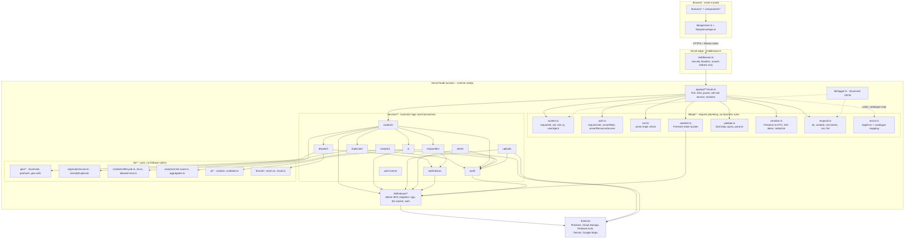

# 06 — Backend Architecture

**Project:** CareGrid AI
**Document type:** Server-side implementation specification
**Status:** Baseline v1.0 — normative for file layout, layering, and request handling
**Related:** [08 API Specification](./08_API_SPECIFICATION.md), [07 Database Schema](./07_DATABASE_SCHEMA.md), [09 AI / Gemini Specification](./09_AI_GEMINI_SPECIFICATION.md), [16 Error Handling](./16_ERROR_HANDLING.md), [17 Validation Rules](./17_VALIDATION_RULES.md), [20 Project Folder Structure](./20_PROJECT_FOLDER_STRUCTURE.md), [21 Environment Variables](./21_ENVIRONMENT_VARIABLES.md), [22 User Roles & Permissions](./22_USER_ROLES_PERMISSIONS.md)

---

## 0. Scope and authority

| Concern | Authoritative document |
| --- | --- |
| Endpoint paths, methods, envelopes, status codes, rate limits | [08](./08_API_SPECIFICATION.md) |
| Field names, types, indexes, transactions, geohash, state machine | [07](./07_DATABASE_SCHEMA.md) |
| AI behaviour, fallback, sanitisation | [09](./09_AI_GEMINI_SPECIFICATION.md) |
| Role/permission enforcement and `assertResourceAccess` | [22](./22_USER_ROLES_PERMISSIONS.md) |
| Environment variable names | [21](./21_ENVIRONMENT_VARIABLES.md) |
| **This document** | How the server code is arranged, what each file owns, in what order it is written, and why |

If this document and [08](./08_API_SPECIFICATION.md) disagree on a path, a method, or a code, **[08](./08_API_SPECIFICATION.md) wins**.

### 0.1 Locked decisions (not open for re-litigation)

| # | Decision |
| --- | --- |
| L1 | Next.js 15 App Router; Route Handlers at `app/api/**/route.ts`; every route declares `export const runtime = 'nodejs'` |
| L2 | `firebase-admin` v13 is the only server-side Firebase SDK. The **client** Firebase SDK is never imported in server code |
| L3 | Zod 4 for all validation; schemas live in `validators/` and are shared by client and server |
| L4 | Strict layering: `app/api` → `services/*` → `lib/*` → external SDKs. No upward imports |
| L5 | No tRPC, no GraphQL, no ORM, no DI container, no class-based services. Modules export plain `async` functions |
| L6 | Every multi-document write uses a transaction. Notification and rate-limit writes are idempotent |
| L7 | Every route executes: `requireUser` → `assertRole` → `assertResourceAccess` → CSRF (non-GET) → rate limit → Zod validate → execute → audit |

---

## 1. Runtime model

### 1.1 What actually runs

| Property | Value | Consequence for our code |
| --- | --- | --- |
| Platform | Vercel (Hobby), single deploy unit from `next build` | No containers to configure; no long-lived server process |
| Function type | Vercel Serverless Function per `app/api/**/route.ts` (and a merged bundle where Next groups them) | A function is invoked, runs, returns, and may be frozen or destroyed |
| Node runtime | Node `>= 22.11.0` (`engines.node` **and** the Vercel project setting must match) | Stable `require(esm)`; required by `firebase-admin` v13 |
| Memory | 1024 MB default; the triage route may need 1024 MB with 3 images inlined | No in-process image processing (no `sharp` — see [02](./02_TECHNICAL_REQUIREMENTS_DOCUMENT.md) §4) |
| Max duration | 30 s target; the triage route uses 25 s. Vercel Hobby may cap this lower | `DECISION REQUIRED` — see §1.5 |
| Region | Default region; `preferredRegion: 'bom1'` (Mumbai) is the candidate for Firestore latency | `DECISION REQUIRED` — the Firestore region must be verified before setting it; a mismatch adds a round trip to every request |
| Cron | `crons` in `vercel.json`; **Hobby allows cron only once per day** | Daily analytics at `0 3 * * *`; everything else is manual/admin-triggered |
| Body limit | 4.5 MB per request | Irrelevant for evidence bytes: uploads go direct to Storage (DEC-08) |
| Concurrency | Many instances of the same function may run simultaneously | No shared in-process state may be authoritative |

### 1.2 Statelessness — the one rule that shapes the design

> **A Vercel function is a single-use process. Any state that lives in a module-level variable is per-instance, per-region, and is lost on freeze. Module-level state may be used only for (a) immutable configuration, and (b) short-TTL caches whose absence is always safe.**

| State | Where it may live | Enforcement |
| --- | --- | --- |
| Immutable config parsed from env | `lib/env.ts` module scope (frozen) | Allowed |
| Config/catalogue cache | Module scope with a hard TTL, refreshed by a `onSnapshot` listener | Allowed, see §10 |
| Gemini client instance | `services/ai/gemini.ts` module scope, lazily constructed | Allowed (stateless SDK object) |
| Firebase Admin app / `getFirestore()` | `lib/firebase/*` module scope, lazily constructed, idempotent | Allowed |
| Request count, rate-limit counters, "have I notified this" flags, in-flight locks, "current assignment" | **Nowhere in memory** | Firestore (`rateLimits`, `dedupeKey`), or a transaction |
| Session | Nowhere | Firebase ID tokens are stateless; there is no server session |
| Idempotency records | Firestore `rateLimits` collection (per [08](./08_API_SPECIFICATION.md) §3.1) | Required |

**Consequences to design around:**

1. **Rate limiting cannot use an in-memory map.** `RATE_LIMIT_STORE=memory` is documented as unsafe ([21](./21_ENVIRONMENT_VARIABLES.md) §2). We use a Firestore transaction read-modify-write ([07](./07_DATABASE_SCHEMA.md) §11.6).
2. **"Did we already send this notification?" cannot be a `Set` in memory.** It is a `dedupeKey` field guarded by a transaction (FR-108).
3. **"Is a dispatch already in flight?" cannot be a lock flag.** It is a conditional read inside the assignment transaction.
4. **Cold starts are real.** A warm instance is reused for a while and then evicted; the first request after eviction pays module init plus TLS. We keep init lazy and cheap: nothing at module scope touches the network. The Admin app, Firestore handle, Storage bucket, and Gemini client are all created on first use, inside functions.
5. **A function that is mid-write can be frozen for minutes.** Anything not inside a Firestore transaction can be lost. This is why the audit entry, the `statusHistory` event, and the incident mutation share one transaction, and why the notification write (outside the transaction) is a separate, idempotent, `dedupeKey`-guarded step that may be re-driven.

### 1.3 Cold-start budget

| Step | Approx. cost | Mitigation |
| --- | --- | --- |
| Node runtime boot + bundle load | dominant | Keep `services/` free of top-level heavy imports; only the route's own import graph is loaded |
| `firebase-admin` initialisation | one-time per instance | Lazy singleton, `cert()` from env, `getApps()` guard |
| TLS handshake to Firestore | one-time per instance | Unavoidable |
| Gemini client construction | negligible | Lazy, memoised |

`GET /api/health` reports `uptimeSec` so a warm/cold ratio is visible in the demo.

### 1.4 Timeouts

| Operation | Timeout | Source |
| --- | --- | --- |
| AI call | `AbortSignal.timeout(20_000)` (NFR-004, FR-029) | [08](./08_API_SPECIFICATION.md) §1.1 |
| Maps call | `8_000` | [08](./08_API_SPECIFICATION.md) §1.1 |
| Firestore write | `5_000` | [08](./08_API_SPECIFICATION.md) §1.1 |
| Global handler | `REQUEST_TIMEOUT_MS` (default `15000`) | [21](./21_ENVIRONMENT_VARIABLES.md) §2 |
| Health sub-checks | `1.5` each, cached 30 s | [08](./08_API_SPECIFICATION.md) §9.3 |

`lib/api/respond.ts` converts a timeout breach into `TIMEOUT` (504) and logs it; it never propagates a raw `AbortError`.

### 1.5 Known platform risk (carried, not resolved)

> `DECISION REQUIRED` — **Vercel Hobby maximum function duration vs the 20 s AI timeout.** Recorded in [21](./21_ENVIRONMENT_VARIABLES.md) §8 and [02](./02_TECHNICAL_REQUIREMENTS_DOCUMENT.md) §13. Verify the plan's cap before the demo. If the cap is below ~22 s, triage must be **fire-and-forget after incident creation**: `POST /api/incidents` writes with `triageSource: 'fallback'` immediately and enqueues a re-triage attempt that the dispatcher can also trigger manually via `POST /api/incidents/:id/triage`. The fallback path ([09](./09_AI_GEMINI_SPECIFICATION.md) §7) already produces a valid, visibly-needs-review incident, so this degradation is survivable.

---

## 2. Layer model

### 2.1 Diagram



### 2.2 Strict dependency direction

| Layer | May import | May **not** import | Why |
| --- | --- | --- | --- |
| `app/api/**/route.ts` | `services/*` (one domain), `lib/api/*`, `validators/*`, `types/*` | `firebase-admin`, `@google/genai`, `lib/geo/*`, `lib/duplicates/*`, another `services/<domain>`'s internals | A route handler that talks to Firestore directly is business logic in the wrong place; it is untestable without an HTTP harness |
| `lib/api/*` | `lib/firebase/*`, `lib/env.ts`, `validators/*`, `types/*`, `lib/logger.ts` | `services/*`, `@google/genai` | `lib/api` is transport plumbing; it must not know what an incident is |
| `services/*` | `lib/firebase/*`, other `services/*` (explicitly, by domain dependency), `lib/geo/*`, `lib/duplicates/*`, `lib/incidents/*`, `lib/analytics/*`, `validators/*`, `config/*` | `app/**`, `features/**`, `components/**`, `hooks/**`, React, `next/*` | `services/` is server-only business logic (P4 in [20](./20_PROJECT_FOLDER_STRUCTURE.md)) |
| `lib/*` (pure) | nothing but other `lib/*` | **`firebase-admin`**, `@google/genai`, `process.env` (except `lib/env.ts`), React, `next/*` | This is what makes `haversineM`, `jaccard`, `classifyDuplicate`, `riskScore`, and `sanitize` unit-testable with zero mocks (FR-049) |
| `lib/firebase/*` | `firebase-admin`, `lib/env.ts` | anything else in `lib/` that is not a handle | It is the trust boundary to the datastore |
| `validators/*` | `zod`, `config/*`, `types/*` | Firestore, `process.env`, React, runtime data | Schemas must be importable from a client form |

**Three upward-import rules are enforced mechanically** (ESLint `no-restricted-imports`, [20](./20_PROJECT_FOLDER_STRUCTURE.md) §4.1):

1. No file under `components/`, `features/`, or `hooks/` may import `services/**` or `lib/firebase/**` (NFR-013).
2. No file under `lib/**` (outside `lib/firebase/**` and `lib/env.ts`) may import `firebase-admin`.
3. No file under `lib/**` or `validators/**` may import `app/**`.

### 2.3 Why there is no ORM, no tRPC, and no DI container

| Rejected | Reason specific to this project |
| --- | --- |
| ORM | Firestore has no query builder worth wrapping, the schema is document-shaped with embedded arrays and subcollections, and index definitions are hand-written in `firestore.indexes.json` ([07](./07_DATABASE_SCHEMA.md) §4). An ORM would hide exactly the index and `array-contains` behaviour the duplicate engine depends on. |
| tRPC / GraphQL | The API surface is a small, well-specified REST set ([08](./08_API_SPECIFICATION.md)) consumed by a React app we also own. A schema layer would add a second contract to keep in sync with [08](./08_API_SPECIFICATION.md) and a second place for an authorization bug to hide. |
| DI container | Services are plain functions. The only seam that needs substituting is Firestore/Storage/Gemini, and that is handled by module-level handles in `lib/firebase/*` plus function parameters typed as interfaces (`TriageProvider`, `NotificationChannel`). A container would add ceremony, hide the import graph, and make the transaction boundaries harder to see. |

---

## 3. The request pipeline

Every route handler is the same shape. The steps below are ordered; the order is the specification.

### 3.1 Ordered steps

| # | Step | File | Export | Failure |
| --- | --- | --- | --- | --- |
| 0 | Edge pass: security headers, unauthenticated page redirect | `middleware.ts` | default export | never fails an API call |
| 1 | Generate `requestId`, read method/path/ip/user-agent, extract bearer token, verify it, load `users/{uid}`, resolve role, detect claim drift | `lib/api/context.ts` | `buildRequestContext` | `AUTH_REQUIRED` 401, `AUTH_INVALID_TOKEN` 401, `AUTH_EXPIRED` 401, `ACCOUNT_UNAVAILABLE` 403, `ROLE_MISMATCH` 403 (+ audit) |
| 2 | Require an authenticated user | `lib/api/auth.ts` | `requireUser` | `AUTH_REQUIRED` 401 |
| 3 | Require a role | `lib/api/auth.ts` | `assertRole` / `requireRole` | `FORBIDDEN` 403 |
| 4 | Resource-level gate | `lib/api/auth.ts` | `assertResourceAccess` | 404 on read (non-existence opacity), `FORBIDDEN` 403 on write/action |
| 5 | Same-origin check (non-GET only) | `lib/api/csrf.ts` | `assertSameOrigin` | `CSRF_FAILED` 403 |
| 6 | Rate limit | `lib/api/ratelimit.ts` | `enforceRateLimit` | `RATE_LIMIT_EXCEEDED` 429 + `Retry-After`; `HEARTBEAT_TOO_FREQUENT` 429 on the heartbeat route |
| 7 | Validate body, query, and params | `lib/api/validate.ts` | `parseJsonBody`, `parseSearchParams`, `parseParams` | `VALIDATION_FAILED` 400 with `details[].field` dotted paths |
| 8 | Idempotency lookup (write routes that declare it) | `services/*` via `rateLimits/{key}` | `checkIdempotency` / `recordIdempotency` | replays return the original body with `Idempotent-Replay: true` |
| 9 | Execute the business operation | `services/<domain>/<verb>.ts` | one exported `async` function | domain `AppError`s |
| 10 | Serialise to DTO, apply field-level redaction | `lib/api/serialize.ts` | `serializeIncident`, `serializeIncidentListRow`, … | never throws; a missing optional field is omitted |
| 11 | Write the envelope | `lib/api/respond.ts` | `ok`, `created`, `noContent`, `csv`, `fail` | — |
| 12 | Audit (inside the service's transaction where the write is transactional) | `services/audit` | `appendAuditLog` | audit failure fails the mutation for privileged actions |
| 13 | Log the completed request | `lib/logger.ts` | `logger.info` | never fails the response |

The order is not negotiable. In particular:

- **Role and resource checks run before rate limiting** so a caller without permission cannot burn another subject's quota.
- **Zod validation runs before any Firestore, AI, or Maps call** (FR-142). A malformed body must cost one CPU pass, not a database round trip.
- **Serialisation runs after the service returns**, so a service never shapes a response body and never has to know the caller's role for redaction — the serialiser does, from the `RequestContext`.

### 3.2 `lib/api/context.ts`

```ts
// lib/api/context.ts
import type { Role, UserStatus } from '@/validators/enums';

export type RequestUser = {
  readonly uid: string;
  readonly role: Role;
  readonly status: UserStatus;
  readonly displayName: string;
  readonly email: string;
  readonly claimRole: Role | null;   // from the ID token, for drift detection only
};

export type RequestContext = {
  readonly requestId: string;        // "req_" + 12 chars, also returned to the client
  readonly startedAt: number;        // performance.now() at entry
  readonly method: string;           // GET, POST, PATCH, DELETE
  readonly path: string;             // "/api/incidents/abc/dispatch"
  readonly routeKey: string;         // stable key for rate limiting, e.g. "incidents.create"
  readonly ip: string | null;        // x-forwarded-for first hop when RATE_LIMIT_TRUST_PROXY
  readonly ipHash: string;           // sha256(ip + IP_HASH_SALT); the only form that is ever persisted
  readonly userAgent: string;        // truncated to 200 chars
  readonly auth: 'required' | 'optional' | 'none';
  readonly user: RequestUser | null; // null only for 'optional' with no token and for 'none'
};

export async function buildRequestContext(
  req: Request,
  opts: { auth?: 'required' | 'optional' | 'none'; routeKey: string },
): Promise<RequestContext>;
```

Rules:

- `requestId` is generated once per invocation and is the value echoed in `meta.requestId`, in `error.requestId`, in every log line for this request, in `statusHistory.requestId` ([07](./07_DATABASE_SCHEMA.md) §6) and in `auditLogs.requestId` (FR-141).
- A client-supplied `x-request-id` is **accepted only if** it matches `/^[A-Za-z0-9_-]{8,64}$/`, and is then prefixed `req_`; otherwise the server generates one. This lets a bug report quote the client id while keeping the server in control.
- The raw IP is never persisted. `ipHash` is `sha256(ip + IP_HASH_SALT)`, with `IP_HASH_SALT` rotating daily ([21](./21_ENVIRONMENT_VARIABLES.md) §6).
- Role resolution is `users/{uid}.role` from the Admin SDK — **never** the token claim (NFR-015). A claim that disagrees produces `403 ROLE_MISMATCH` and an audit entry ([22](./22_USER_ROLES_PERMISSIONS.md) §2).
- `verifyIdToken(token, true)` (check-revoked) is used so `users.tokensValidAfter` on suspension takes effect immediately ([22](./22_USER_ROLES_PERMISSIONS.md) §8.3).

### 3.3 `lib/api/auth.ts`

```ts
// lib/api/auth.ts
export async function requireUser(ctx: RequestContext): Promise<RequestUser>;
export function assertRole(ctx: RequestContext, ...allowed: Role[]): void;
export function requireRole(ctx: RequestContext, ...allowed: Role[]): RequestUser;
export function isOps(ctx: RequestContext): boolean;                 // dispatcher or admin
export function isPrivileged(ctx: RequestContext): boolean;          // dispatcher or admin

export type ResourceKind =
  | 'incident' | 'dispatch' | 'responder' | 'notification'
  | 'user' | 'config' | 'auditLog' | 'analytics' | 'media' | 'aiRun' | 'riskZone';

export async function assertResourceAccess(
  ctx: RequestContext,
  kind: ResourceKind,
  id: string,
  mode: 'read' | 'write' | 'action',
): Promise<void>;
```

`assertResourceAccess` is asynchronous because the in-radius responder rule ([22](./22_USER_ROLES_PERMISSIONS.md) §4.1) needs the responder's last location. It **loads the resource document** and returns either a redaction profile or throws. It never returns a boolean — call sites cannot forget to check.

```ts
export type AccessProfile = {
  readonly allowed: true;
  readonly redaction: RedactionProfile;   // 'full' | 'privileged' | 'responder' | 'owner'
  readonly reason: 'role' | 'ownership' | 'assignment' | 'in_radius' | 'public';
};
```

### 3.4 `lib/api/csrf.ts`

```ts
// lib/api/csrf.ts
export function isSameOrigin(req: Request): boolean;
export function assertSameOrigin(req: Request): void;   // throws AppError CSRF_FAILED 403
```

Compares `Origin` (falling back to `Referer`'s origin) against `NEXT_PUBLIC_APP_URL`'s origin ([08](./08_API_SPECIFICATION.md) §1.8). A request with neither header and no `Origin` is allowed only when `NODE_ENV !== 'production'` (curl, the emulator suite, server-to-server cron with `CRON_SECRET`); in production it is rejected. This is defence in depth: bearer-token APIs are not classically CSRF-vulnerable, but a token captured in a malicious page's request is.

### 3.5 `lib/api/ratelimit.ts` — Firestore token bucket

```ts
// lib/api/ratelimit.ts
export type RateLimitRule = {
  readonly routeKey: string;   // e.g. "incidents.status"
  readonly limit: number;      // requests per window
  readonly windowSec: number;  // 3600, 60, 86400 …
  readonly subject?: 'uid' | 'ip';
};

export async function enforceRateLimit(
  ctx: RequestContext,
  rule: RateLimitRule,
): Promise<{ remaining: number; resetAt: number }>;
export function rateLimitFor(routeKey: string): RateLimitRule;   // the single table from [08] §1.9
```

Implementation shape (per [07](./07_DATABASE_SCHEMA.md) §11.6):

```
key  = sha256(subject + '|' + routeKey + '|' + windowBucket)   // doc ID; hashed so the UID never leaks
doc  = rateLimits/{key}   { count, windowStart, expiresAt, subjectUid, route, updatedAt }

db.runTransaction(async (tx) => {
  const snap = await tx.get(docRef);
  const now  = Timestamp.now();
  if (!snap.exists) { tx.set(docRef, { count: 1, windowStart: now, expiresAt: ts(now + windowSec), ... }); return ok; }
  const d = snap.data();
  const windowAgeMs = now.toMillis() - d.windowStart.toMillis();
  if (windowAgeMs >= rule.windowSec * 1000) {
    tx.update(docRef, { count: 1, windowStart: now, expiresAt: ts(now + rule.windowSec), updatedAt: now });
    return ok;
  }
  if (d.count + 1 > rule.limit) {
    const resetAt = d.windowStart.toMillis() + rule.windowSec * 1000;
    tx.update(docRef, { updatedAt: now });                    // no increment past the limit
    return { limited: true, resetAt };
  }
  tx.update(docRef, { count: d.count + 1, updatedAt: now });
  return ok;
});
```

Properties that matter:

- **Cost:** 1 read + 1 write per limited request. Accepted ([07](./07_DATABASE_SCHEMA.md) §11.6, [02](./02_TECHNICAL_REQUIREMENTS_DOCUMENT.md) §4).
- **Safety under concurrency:** the read-modify-write is a transaction, so two parallel requests cannot both read `count = 4` and both write `5`. See §8.5.
- **Window rollover** is by `windowStart` age, not by a cron. Firestore TTL on `expiresAt` is hygiene only, never correctness ([07](./07_DATABASE_SCHEMA.md) §12.7).
- **Multi-window rules.** `POST /api/incidents` has two rules (5/hour and 20/day, FR-015). Both are evaluated; the failing one produces the 429 and its own `Retry-After`.
- **The key is hashed.** The document ID must not contain a UID.
- **Idempotent keys share the same collection** with a distinguishable `route` value, per [08](./08_API_SPECIFICATION.md) §3.1.

The single source of the numbers is [08](./08_API_SPECIFICATION.md) §1.9. `rateLimitFor()` is a lookup table, not per-call literals, so a limit is changed in exactly one place.

### 3.6 `lib/api/respond.ts` — envelope writers

```ts
// lib/api/respond.ts
export type RespondInit = {
  ctx: RequestContext;
  status?: number;
  headers?: Record<string, string>;
  noStore?: boolean;   // default true for any user-specific payload ([08] §12)
};

export function ok<T>(data: T, init: RespondInit): Response;      // 200
export function created<T>(data: T, init: RespondInit): Response; // 201
export function accepted<T>(data: T, init: RespondInit): Response; // 202 (role change with pending claim)
export function noContent(init: RespondInit): Response;           // 204
export function csv(body: string, filename: string, init: RespondInit): Response;
export function fail(err: unknown, init: RespondInit): Response;  // never throws
```

Every writer:

1. Emits the [08](./08_API_SPECIFICATION.md) §1.2 / §1.3 envelope exactly.
2. Sets `Content-Type: application/json; charset=utf-8` (or `text/csv; charset=utf-8` for `csv`, plus `Content-Disposition: attachment; filename="…"`).
3. Sets `Cache-Control: no-store` whenever the payload is user-specific (which is almost always).
4. Adds `X-Request-Id: <requestId>` so a browser devtools screenshot is enough for support.
5. Logs one line via `lib/logger.ts`.

`fail()` is the **only** place an unknown value becomes an HTTP response. A route handler never inspects an error to build a body.

### 3.7 `lib/api/serialize.ts` — Firestore → DTO, with redaction

```ts
// lib/api/serialize.ts
export function toIso(v: Timestamp | null | undefined): string | null;
export function toGeoPoint(v: GeoPoint | null | undefined): { lat: number; lng: number } | null;
export function toRefPath(v: DocumentReference | null | undefined): string | null;

export type SerializeOpts = {
  viewer: RequestUser;
  access: AccessProfile;
  include?: Array<'reports' | 'history' | 'resources' | 'dispatch' | 'ai' | 'duplicates'>;
};

export function serializeIncident(doc: IncidentDoc, opts: SerializeOpts): IncidentDto;
export function serializeIncidentListRow(doc: IncidentDoc, opts: SerializeOpts): IncidentListRowDto;
export function serializeDispatch(doc: DispatchDoc, opts: SerializeOpts): DispatchDto;
export function serializeResponder(doc: ResponderDoc, opts: SerializeOpts): ResponderDto;
export function serializeNotification(doc: NotificationDoc, opts: SerializeOpts): NotificationDto;
export function serializeAuditLog(doc: AuditLogDoc, opts: SerializeOpts): AuditLogDto;
```

Responsibilities, in order:

1. `Timestamp` → ISO-8601 UTC with milliseconds (`2026-09-26T10:05:31.000Z`). `GeoPoint` → `{ lat, lng }`. `DocumentReference` → path string. A field that is `null` stays `null` **only** where the contract says `null`; an absent field is omitted, never `undefined` ([08](./08_API_SPECIFICATION.md) §1.4).
2. Derived, never-stored values are computed here or in `lib/`: `accuracyGrade` ([07](./07_DATABASE_SCHEMA.md) §4.1), `slaState` from `verifiedAt ?? createdAt` + `slaTargetMin`, `ageMin`, `aiNeedsReview = aiConfidence < AI_CONFIDENCE_REVIEW_THRESHOLD` (FR-024), `staleLocation` from `lastLocationAt` vs `STALE_LOCATION_MIN`.
3. **Field-level redaction is applied last**, driven by `access.redaction`:
   - `full` (owner, dispatcher, admin): everything the contract lists.
   - `responder`: `reporterUid`, `reporter.*`, `locationText`, `ipHash`, `reports[].text` for non-original reports, `ai.rawOutputHash`, `ai.model`, `ai.promptVersion` are omitted; the original text is replaced by `summary` (FR-068, [22](./22_USER_ROLES_PERMISSIONS.md) §4.1).
   - `privileged`: list rows additionally omit `originalText`, `requiredResources` detail, and `searchTokens`.
   - List rows for a citizen never include `reporterUid` for other authors, and `phone` is never serialised by `GET /api/responders` at all ([08](./08_API_SPECIFICATION.md) §4.1).
4. **Media**: `signedUrl` is generated only for `scanStatus === 'clean'` media the caller may see, with a 15-minute expiry, and never together with `locationText` for a responder ([08](./08_API_SPECIFICATION.md) §3.3).

Redaction lives in the serialiser, not in each service, so a new endpoint cannot forget it. This is enforcement layer 3 of 6 in [22](./22_USER_ROLES_PERMISSIONS.md) §6.

### 3.8 `lib/api/errors.ts` — `AppError` and the catalogue

```ts
// lib/api/errors.ts
export class AppError extends Error {
  readonly code: ErrorCode;             // stable machine string, e.g. "INVALID_STATUS_TRANSITION"
  readonly httpStatus: number;          // 400 | 401 | 403 | 404 | 409 | 413 | 415 | 422 | 429 | 500 | 502 | 503 | 504
  readonly details?: ApiErrorDetail[];  // field-level only; never a stack trace
  readonly isOperational: boolean;      // true for catalogue codes, false for bugs
  readonly expose: boolean;             // false for anything derived from an unknown throw
  readonly cause?: unknown;             // the original error, for logs only
  readonly retryable: boolean;          // drives client retry policy
  readonly audit: boolean;              // whether a failed attempt must be recorded
}

export function toAppError(err: unknown, ctx: RequestContext): AppError;
export function errorResponse(err: AppError, ctx: RequestContext): Response;
```

`toAppError` is the single funnel. It maps:

| Input | Becomes |
| --- | --- |
| an `AppError` | itself, unchanged |
| a `ZodError` | `VALIDATION_FAILED` 400 with `details` from `lib/api/validate.ts` |
| `FirebaseError` with `code === 'permission-denied'` | `FORBIDDEN` 403 — **the rules text is never returned** |
| `FirebaseError` with `code === 'unavailable'` or `'deadline-exceeded'` | `DB_UNAVAILABLE` 503 (or `TIMEOUT` 504 for a deadline) |
| `FirebaseError` with `code === 'aborted'` / `10 ABORTED` | `DB_TRANSACTION_FAILED` 503 |
| `FirebaseError` `already-exists` on `reference` | retry inside the create transaction, up to 3 times, then `DUPLICATE_REFERENCE` 409 |
| `AbortError` | `TIMEOUT` 504 |
| `TypeError: Failed to fetch` | never reaches the server; handled client-side ([16](./16_ERROR_HANDLING.md)) |
| anything else | `INTERNAL_ERROR` 500, `expose: false`, details suppressed, full cause logged |

Full catalogue and the user-facing copy: [16](./16_ERROR_HANDLING.md).

### 3.9 `lib/api/validate.ts` — Zod parsing with field-path detail

```ts
// lib/api/validate.ts
export type ApiErrorDetail = { field: string; issue: string };

export async function parseJsonBody<S extends z.ZodTypeAny>(
  req: Request, schema: S, opts?: { maxBytes?: number },
): Promise<z.output<S>>;

export function parseSearchParams<S extends z.ZodTypeAny>(
  url: URL, schema: S,
): Promise<z.output<S>>;

export function parseParams<S extends z.ZodTypeAny>(
  raw: Record<string, string | string[] | undefined>, schema: S,
): z.output<S>>;

export function formatZodIssues(err: z.ZodError): ApiErrorDetail[];
```

Behaviour:

- **Body size first.** `maxBytes` defaults to 1 MB for JSON routes (the 4.5 MB Vercel cap is never the limit we want to hit). A larger body is `VALIDATION_FAILED` with `field: "body"`, not a platform 413.
- **Invalid JSON is a validation error, not a 500.** `JSON.parse` is wrapped; a parse failure yields `VALIDATION_FAILED` with `details: [{ field: 'body', issue: 'invalid_json' }]`.
- **`Content-Type` is not trusted for behaviour**, only checked: a body arriving as `application/json` is parsed; a `text/plain` body with a JSON payload is still parsed (the field schema is the real contract), and a multipart body on a JSON route is rejected with `UNSUPPORTED_MEDIA_TYPE`.
- **Field paths are dotted and index-aware.** `location.lat` → `{ field: "location.lat", issue: "too_small" }`; `media.1.sizeBytes` → `{ field: "media[1].sizeBytes", … }`; a cross-field rule reports the *offending* field, not the object.
- **Issue codes are Zod's**, lowercase snake (`too_small`, `invalid_enum_value`, `too_big`, `invalid_format`, `unrecognized_keys`, `custom`), so the client can map to inline field errors without string matching. A `superRefine` failure uses the machine code `invalid_combination`.
- **Params are validated too** ([08](./08_API_SPECIFICATION.md) §12.7): `:id` must match `/^[A-Za-z0-9]{20}$/` (Firestore auto-ID) and `:mediaId` must match `/^med_[A-Za-z0-9]{2,}$/`.
- **Unknown query params and unknown body keys are rejected** (`.strict()`); the policy and its justification are in [17](./17_VALIDATION_RULES.md) §9.
- **Parsing happens once.** The parsed output is the only value passed to the service; the raw body is never re-read.

Field-by-field rules for every endpoint: [17](./17_VALIDATION_RULES.md) §6.

---

## 4. Route inventory

### 4.1 Guard legend

| Symbol | Meaning |
| --- | --- |
| `P` | public route, no `Authorization` required (documented exception) |
| `O` | optional auth (a token is verified when present; absence is allowed) |
| `U` | `requireUser` |
| `A` | `assertRole` / `requireRole` |
| `X` | `assertResourceAccess` |
| `C` | CSRF same-origin check (all non-GET) |
| `L` | `enforceRateLimit` |
| `V` | Zod validation of body + query + params |
| `S` | writes an `auditLogs` entry |
| `I` | `Idempotency-Key` honoured |
| `N` | `Cache-Control: no-store` |
| `—` | not applicable |

### 4.2 Complete inventory

Read/write counts are the estimates from [07](./07_DATABASE_SCHEMA.md) §15, adjusted where a transaction adds reads.

| # | Method | Path | Service function | Collections touched | R / W est. | Rate limit | Guards |
| ---: | --- | --- | --- | --- | --- | --- | --- |
| 1 | POST | `/api/me/bootstrap` | `services/auth/bootstrapUser` | `users`, `profiles`, `rateLimits`, `auditLogs` | 2 / 4 | 10 / h per uid | U C L V S N |
| 2 | GET | `/api/me` | `services/auth/getMe` | `users`, `profiles`, `responders` | 1–3 / 0 | none | U A X N |
| 3 | PATCH | `/api/me` | `services/auth/updateMe` | `users`, `profiles`, `auditLogs` | 2 / 3 | 30 / h | U C L V S N |
| 4 | POST | `/api/auth/event` | `services/auth/recordAuthEvent` | `auditLogs`, `rateLimits` | 0 / 2 | 30 / h per uid-or-IP | O C L V N |
| 5 | POST | `/api/incidents` | `services/incidents/createIncident` | `rateLimits`, `incidents`, `incidents/*/reports`, `incidents/*/statusHistory`, `aiRuns`, `notifications`, `auditLogs` | 2–52 / 5–6 | 5 / h **and** 20 / 24 h | U C L V S I N |
| 6 | GET | `/api/incidents` | `services/incidents/listIncidents` | `incidents`, `responderLocations` (responder radius) | ≤ 101 / 0 | 120 / min | U A V N |
| 7 | GET | `/api/incidents/:id` | `services/incidents/getIncident` | `incidents`, `reports`, `statusHistory`, `resources`, `dispatches`, `aiRuns`, `users` | 3–8 / 0 | 120 / min | U A X V N |
| 8 | PATCH | `/api/incidents/:id` | `services/incidents/updateIncident` | `incidents`, `incidents` (duplicate re-check), `auditLogs` | 2–52 / 2 | 60 / h | U A X C L V S N |
| 9 | POST | `/api/incidents/:id/triage` | `services/incidents/retriageIncident` | `incidents`, `reports`, `aiRuns`, `statusHistory`, `auditLogs` | 4–10 / 3 | 20 / h | U A X C L V S N |
| 10 | POST | `/api/incidents/:id/dispatch` | `services/dispatch/assignResponder` | `incidents`, `dispatches`, `responders`, `statusHistory`, `notifications`, `auditLogs` | 3 / 3 + notif | 30 / h | U A X C L V S I N |
| 11 | GET | `/api/incidents/:id/dispatch/candidates` | `services/dispatch/listCandidates` | `incidents`, `responders`, `responderLocations`, `resources` | 2–61 / 0 | 60 / min | U A X V N |
| 12 | PATCH | `/api/incidents/:id/status` | `services/incidents/changeStatus` | `incidents`, `dispatches`, `statusHistory`, `notifications`, `auditLogs` | 2–3 / 2 + notif | 60 / h | U A X C L V S N |
| 13 | POST | `/api/incidents/:id/merge` | `services/duplicates/mergeIncident` | `incidents` ×2, `reports`, `statusHistory` ×2, `auditLogs` | 4 / 7 | 20 / h | U A X C L V S N |
| 14 | POST | `/api/incidents/:id/merge/undo` | `services/duplicates/undoMerge` | `incidents` ×2, `reports`, `statusHistory` ×2, `auditLogs` | 4 / 6 | 20 / h | U A X C L V S N |
| 15 | POST | `/api/incidents/:id/duplicates/dismiss` | `services/duplicates/dismissDuplicate` | `incidents`, `auditLogs` | 2 / 2 | 30 / h | U A X C L V S N |
| 16 | DELETE | `/api/incidents/:id` | `services/incidents/deleteIncident` | `incidents`, `statusHistory`, `Storage` (quarantine), `auditLogs` | 2 / 2 + moves | 30 / h | U A X C L V S N |
| 17 | POST | `/api/incidents/:id/restore` | `services/incidents/restoreIncident` | `incidents`, `statusHistory`, `auditLogs` | 2 / 2 | 30 / h | U A X C L V S N |
| 18 | GET | `/api/incidents/:id/export` | `services/incidents/exportIncidentsCsv` | `incidents`, `users`, `responders` | ≤ 200 / 0 | 30 / min | U A X V N |
| 19 | GET | `/api/responders` | `services/responders/listResponders` | `responders`, `responderLocations`, `resources` | ≤ 101 / 0 | 60 / min | U A V N |
| 20 | GET | `/api/responders/:id` | `services/responders/getResponder` | `responders`, `users`, `responderLocations` | 2–3 / 0 | 120 / min | U A X N |
| 21 | PATCH | `/api/responders/:id` | `services/responders/updateResponder` | `responders`, `responderLocations`, `auditLogs` | 2 / 2 | 60 / h | U A X C L V S N |
| 22 | PATCH | `/api/responders/:id/location` | `services/responders/recordHeartbeat` | `responderLocations`, `responders`, `dispatches` | 2–3 / 2 | 120 / h + `HEARTBEAT_TOO_FREQUENT` | U A X C L V N |
| 23 | POST | `/api/responders/:id/verify` | `services/responders/verifyResponder` | `responders`, `users`, `auditLogs`, `notifications` | 3 / 4 | 30 / h | U A X C L V S N |
| 24 | POST | `/api/responders/:id/reject` | `services/responders/rejectResponder` | `responders`, `users`, `auditLogs`, `notifications` | 3 / 4 | 30 / h | U A X C L V S N |
| 25 | GET | `/api/responders/:id/incidents` | `services/dispatch/listResponderDispatches` | `dispatches`, `incidents` | ≤ 101 / 0 | 60 / min | U A X V N |
| 26 | GET | `/api/dispatches` | `services/dispatch/listDispatches` | `dispatches`, `responders`, `incidents` | ≤ 101 / 0 | 60 / min | U A X V N |
| 27 | POST | `/api/dispatches/:id/claim` | `services/dispatch/claimDispatch` | `dispatches`, `responders`, `incidents`, `statusHistory`, `notifications`, `auditLogs` | 3 / 4 | 20 / h | U A X C L V S N |
| 28 | POST | `/api/dispatches/:id/withdraw` | `services/dispatch/withdrawDispatch` | `dispatches`, `responders`, `incidents`, `statusHistory`, `notifications`, `auditLogs` | 3 / 4 | 30 / h | U A X C L V S N |
| 29 | GET | `/api/dispatches/summary` | `services/dispatch/dispatchSummary` | `responders` | ≤ 100 / 0 | 60 / min | U A N |
| 30 | GET | `/api/notifications` | `services/notifications/listNotifications` | `notifications` | ≤ 101 / 0 | 120 / min | U A V N |
| 31 | PATCH | `/api/notifications/:id` | `services/notifications/markNotificationRead` | `notifications` | 1 / 1 | 120 / min | U A X C L V N |
| 32 | POST | `/api/notifications/read-all` | `services/notifications/markAllRead` | `notifications` | ≤ 201 / ≤ 200 | 30 / min | U A C L V N |
| 33 | POST | `/api/notifications` | `services/notifications/sendNotification` | `users`, `notifications`, `channels` | 2 / 1 | 10 / min | U A C L V S N |
| 34 | DELETE | `/api/notifications/:id` | `services/notifications/expireNotification` | `notifications` | 1 / 1 | 30 / min | U A X C L V N |
| 35 | GET | `/api/analytics` | `services/analytics/queryAnalytics` | `analyticsDaily`, `incidents` (live path), `riskZones`, `responders` | 30–500 / 0 | 30 / min | U A V N |
| 36 | POST | `/api/analytics/recompute` | `services/analytics/recomputeAnalytics` | `analyticsDaily`, `incidents`, `riskZones`, `auditLogs` | ≤ 500 / 1–366 | 5 / h | U A C L V S N |
| 37 | POST | `/api/uploads/sign` | `services/uploads/signUpload` | `Storage`, `rateLimits` | 0 / 1 | 30 / h | U C L V N |
| 38 | POST | `/api/uploads/finalize` | `services/uploads/finalizeUpload` | `Storage` (read 4 KiB), `rateLimits` | 0–1 / 0 | 30 / h | U C L V N |
| 39 | GET | `/api/uploads/:mediaId/url` | `services/uploads/getSignedReadUrl` | `incidents` (visibility), `Storage` | 1–2 / 0 | 120 / min | U A X V N |
| 40 | GET | `/api/resources` | `services/responders/getResourceCatalogue` | `resources` (cached) | 0–1 / 0 | 60 / min | U N |
| 41 | GET | `/api/config` | `services/admin/getClientConfig` | `config/app` (cached) | 0–1 / 0 | 60 / min | U N |
| 42 | GET | `/api/health` | `services/admin/systemHealth` | `config/app` only | 0 / 0 | none | P |
| 43 | GET | `/api/admin/users` | `services/admin/listUsers` | `users` | ≤ 101 / 0 | 60 / min | U A V N |
| 44 | GET | `/api/admin/users/:id` | `services/admin/getAdminUser` | `users`, `responders`, `auditLogs` | 3–6 / 0 | 60 / min | U A X V N |
| 45 | PATCH | `/api/admin/users/:id/role` | `services/admin/changeRole` | `users`, `auditLogs`, Firebase Auth claims | 2 / 2 (+3 retries) | 30 / h | U A X C L V S N |
| 46 | PATCH | `/api/admin/users/:id/status` | `services/admin/setUserStatus` | `users`, `auditLogs`, `notifications` | 2 / 3 | 30 / h | U A X C L V S N |
| 47 | POST | `/api/admin/users/:id/reset-claims` | `services/admin/resetClaims` | `users`, Firebase Auth claims, `auditLogs` | 2 / 2 | 20 / h | U A X C L V S N |
| 48 | GET | `/api/admin/audit-logs` | `services/admin/listAuditLogs` | `auditLogs` | ≤ 101 / 0 | 60 / min | U A V N |
| 49 | GET | `/api/admin/config` | `services/admin/getAdminConfig` | `config/app` (cached) | 0–1 / 0 | 60 / min | U A N |
| 50 | PATCH | `/api/admin/config` | `services/admin/updateConfig` | `config/app`, `auditLogs` | 2 / 2 | 30 / h | U A C L V S N |
| 51 | GET | `/api/admin/responders` | `services/admin/listResponderQueue` | `responders`, `users` | ≤ 101 / 0 | 60 / min | U A V N |
| 52 | GET | `/api/admin/system/health` | `services/admin/systemHealth` | `aiRuns`, `rateLimits`, `config/app` | ≤ 101 / 0 | 30 / min | U A N |
| 53 | POST | `/api/admin/maintenance/[job]` | `services/admin/runMaintenanceJob` | job-specific, `auditLogs` | 1–500 / 1+ | 10 / h | U A C L V S N |
| 54 | GET | `/api/cron/[job]` | `services/analytics/runAnalyticsDaily` · `services/dispatch/sweepExpiredDispatches` · `services/uploads/sweepStagingUploads` · `services/incidents/purgeClosedLocations` | job-specific | 1–500 / 1+ | none (`CRON_SECRET`) | P (bearer `CRON_SECRET`) C |

### 4.3 Route inventory notes

- **`/api/health` is the only unauthenticated GET that touches a datastore**, and it only reads `config/app` plus three 1.5 s pings, cached 30 s. It never reveals credentials, bucket names, project IDs, or stack traces ([08](./08_API_SPECIFICATION.md) §9.3).
- **`/api/cron/[job]` is authenticated by `CRON_SECRET`**, not by a user token: `Authorization: Bearer ${CRON_SECRET}` compared in constant time. It is exempt from `requireUser` by documented exception.
- **Read/write estimates for `POST /api/incidents`** are dominated by the duplicate search (1 read + up to 50 candidates, [07](./07_DATABASE_SCHEMA.md) §15). When a dispatcher listener is active the candidate cap drops to 25.
- **`GET /api/incidents` for a responder** adds one `responderLocations` read to compute the in-radius set ([22](./22_USER_ROLES_PERMISSIONS.md) §4.1).
- **Every list route echoes `page.limit`** so the client can see the effective limit after the single documented clamp ([17](./17_VALIDATION_RULES.md) §10).

### 4.4 Routes referenced but not specified in [08](./08_API_SPECIFICATION.md) — `DECISION REQUIRED`

| Path | Referenced by | Needed for | Status |
| --- | --- | --- | --- |
| `POST /api/incidents/:id/reports` | [07](./07_DATABASE_SCHEMA.md) §16 ("`/api/incidents/:id/reports`"), FR-012, US-006 | adding a supplement or a correction to an existing incident | **Not in [08](./08_API_SPECIFICATION.md) §3.** `DECISION REQUIRED` — the create pipeline of [08](./08_API_SPECIFICATION.md) §3.1 writes the `original` report; the `supplement` and `correction` kinds exist in the schema ([07](./07_DATABASE_SCHEMA.md) §5) but no endpoint creates them. Until specified, the **recommended** shape is `POST /api/incidents/:id/reports` with body `{ kind: 'supplement' \| 'correction', text?, media?[] }`, owner-only, pre-verification, ≤ 2 h window (US-006), 10 / h, reusing the same media and empty-report rules as create. This must be added to [08](./08_API_SPECIFICATION.md) §3 and §11 before it is built. |
| `GET /api/incidents/:id/duplicates/candidates` | implied by US-023 AC1, [07](./07_DATABASE_SCHEMA.md) §9 | live "possible duplicates" panel beyond the one candidate returned at create time | **Not specified.** `DECISION REQUIRED` — `GET /api/incidents/:id?expand=duplicates` already returns `duplicates.potential`, so a separate route is likely unnecessary. Confirm and do not build. |
| `PATCH /api/incidents/:id/reports/:reportId` | US-006 ("corrections … never overwrite the original text") | nothing; corrections are new documents | **Not specified and probably not needed.** Do not build. |

---

## 5. Service layer design

### 5.1 Rules

| Rule | Detail |
| --- | --- |
| One directory per domain | `services/<domain>/` |
| One file per operation | `services/<domain>/<verb>.ts` — `create-incident.ts`, `change-status.ts`, `assign.ts` |
| Plain functions | `export async function name(input: Input, ctx: RequestContext): Promise<Output>` — no classes, no `this`, no decorators |
| The context is always the second argument | It carries `requestId`, the authoritative `role`, and the redaction profile. A service therefore cannot accidentally authorise against a client-supplied role |
| Services validate nothing about HTTP | They receive already-typed input. Domain invariants that are not expressible in a schema (transition legality, capacity) are checked here and raise `AppError` |
| Services do not shape responses | They return domain objects; `lib/api/serialize.ts` shapes the DTO |
| Services own transactions | `runTransaction` / `writeBatch` appear only in `services/*` and `lib/api/ratelimit.ts` |
| Services never import `services/admin` for role checks | Authorisation lives in `lib/api/auth.ts`; a service trusts its `ctx` |
| Barrel | `services/index.ts` re-exports the public function of each domain and is imported **only** by `app/api/**` ([20](./20_PROJECT_FOLDER_STRUCTURE.md) §2) |

### 5.2 Domain map

| Domain | Directory | Owns |
| --- | --- | --- |
| Incidents | `services/incidents/` | create pipeline, read, update, lifecycle transitions, soft delete, restore, CSV export |
| Dispatch | `services/dispatch/` | assign, unassign, candidates, claim, withdraw, expiry sweep, summary |
| Responders | `services/responders/` | profile read/list/update, heartbeat, verify, reject, resource catalogue |
| Notifications | `services/notifications/` | emit, dedupe, list, mark read, mark all read, expire, channels |
| Analytics | `services/analytics/` | query (rollup vs live), rollup computation, risk zones, recompute, CSV |
| AI | `services/ai/` | Gemini call, prompt build, schema, sanitise, rules, fallback, explanation |
| Duplicates | `services/duplicates/` | candidate search, classify, merge, undo merge, dismiss |
| Audit | `services/audit/` | audit entry construction and the in-transaction append |
| Uploads | `services/uploads/` | signed URL issue, magic-byte finalise, signed read URL, staging sweep |
| Admin | `services/admin/` | users, role/status, claims, audit log query, config, system health, maintenance |
| Auth events | `services/auth/` | bootstrap, get me, update me, login/logout/failure recording |

> `DECISION REQUIRED` — [20](./20_PROJECT_FOLDER_STRUCTURE.md) §2 lists `services/auth/`. The task-level decision names this domain **`auth-events`**. This document uses `services/auth/` (matching [20](./20_PROJECT_FOLDER_STRUCTURE.md), which is the existing document) and refers to the function as `recordAuthEvent` (an auth *event* recorder), so both names describe the same directory. Reconcile the directory name before the first commit.

### 5.3 Function signatures

#### `services/incidents`

```ts
// services/incidents/create-incident.ts  — [08] §3.1 pipeline, in this exact order
export type CreateIncidentInput = {
  readonly text: string | null;
  readonly media: readonly MediaInput[];
  readonly location: LocationInput | null;
  readonly reportedAt: Date | null;
  readonly language: string;
  readonly skipTriage: boolean;
  readonly idempotencyKey: string | null;
};
export type CreateIncidentResult = {
  readonly incident: IncidentDoc;
  readonly duplicate: DuplicateCandidate | null;
  readonly replayed: boolean;             // true when the Idempotency-Key replayed the original body
};
export async function createIncident(
  input: CreateIncidentInput, ctx: RequestContext,
): Promise<CreateIncidentResult>;

// services/incidents/get-incident.ts
export type GetIncidentInput = { readonly incidentId: string; readonly expand: readonly ExpandKey[] };
export type GetIncidentResult = {
  readonly incident: IncidentDoc;
  readonly reporter: PublicUserRef | null;
  readonly reports: readonly IncidentReportDoc[];
  readonly history: readonly StatusHistoryDoc[];
  readonly dispatch: DispatchDoc | null;
  readonly resources: readonly IncidentResourceLinkDoc[];
  readonly ai: AiRunDoc | null;
  readonly duplicates: { potential: readonly DuplicateCandidate[]; mergedFrom: readonly string[] };
  readonly permissions: readonly Permission[];
};
export async function getIncident(
  input: GetIncidentInput, ctx: RequestContext,
): Promise<GetIncidentResult>;

// services/incidents/list-incidents.ts
export type ListIncidentsInput = {
  readonly status?: readonly IncidentStatus[]; readonly urgency?: readonly Urgency[];
  readonly category?: readonly IncidentCategory[]; readonly verified?: 'true' | 'false' | 'any';
  readonly slaState?: readonly SlaState[]; readonly unassigned?: boolean;
  readonly from?: Date; readonly to?: Date; readonly q?: string;
  readonly center?: { lat: number; lng: number }; readonly radiusM?: number;
  readonly sort: 'newest' | 'oldest' | 'urgency' | 'sla' | 'distance';
  readonly limit: number; readonly cursor: string | null; readonly includeDeleted: boolean;
};
export type ListIncidentsResult = {
  readonly items: readonly IncidentDoc[];
  readonly nextCursor: string | null; readonly hasMore: boolean; readonly limit: number;
  readonly forcedFilters: readonly string[];   // e.g. ["reporterUid"] for a citizen (never applied silently)
};
export async function listIncidents(
  input: ListIncidentsInput, ctx: RequestContext,
): Promise<ListIncidentsResult>;

// services/incidents/update-incident.ts
export type UpdateIncidentInput = {
  readonly incidentId: string;
  readonly summary?: string; readonly urgency?: Urgency; readonly category?: IncidentCategory;
  readonly location?: LocationInput; readonly resolutionNote?: string;
};
export type UpdateIncidentResult = {
  readonly incident: IncidentDoc;
  readonly duplicate: DuplicateCandidate | null;   // recomputed only when location changed
  readonly changedFields: readonly string[];
};
export async function updateIncident(
  input: UpdateIncidentInput, ctx: RequestContext,
): Promise<UpdateIncidentResult>;

// services/incidents/change-status.ts
export type ChangeStatusInput = {
  readonly incidentId: string;
  readonly status: IncidentStatus;
  readonly reason: string | null;
  readonly note: string | null;
  readonly resolutionCode: ResolutionCode | null;
  readonly clientActionId: string | null;   // offline-queue replay id; dedupe key for the transition
};
export type ChangeStatusResult = {
  readonly incident: IncidentDoc;
  readonly allowedNext: readonly IncidentStatus[];
  readonly noop: boolean;                    // repeating the same transition => 200 + meta.noop true
};
export async function changeStatus(
  input: ChangeStatusInput, ctx: RequestContext,
): Promise<ChangeStatusResult>;

// services/incidents/retriage-incident.ts
export type RetriageInput = {
  readonly incidentId: string; readonly reason: string; readonly includeNewEvidence: boolean;
};
export type RetriageResult = {
  readonly ai: AiRunSummary;
  readonly incident: Pick<IncidentDoc, 'category' | 'urgency' | 'summary' | 'safetyFlags' | 'aiConfidence' | 'status'>;
  readonly changes: readonly { field: string; from: unknown; to: unknown }[];
};
export async function retriageIncident(
  input: RetriageInput, ctx: RequestContext,
): Promise<RetriageResult>;

// services/incidents/delete-incident.ts  /  restore-incident.ts
export type DeleteIncidentInput = { readonly incidentId: string; readonly reason: string };
export type DeleteIncidentResult = { readonly incidentId: string; readonly deletedAt: Date };
export async function deleteIncident(i: DeleteIncidentInput, c: RequestContext): Promise<DeleteIncidentResult>;
export async function restoreIncident(i: DeleteIncidentInput, c: RequestContext): Promise<DeleteIncidentResult>;

// services/incidents/export-incidents.ts
export type ExportIncidentsInput = {
  readonly incidentIds?: readonly string[]; readonly filters?: ListIncidentsInput;
  readonly format: 'csv';
};
export async function exportIncidentsCsv(
  input: ExportIncidentsInput, ctx: RequestContext,
): Promise<{ readonly body: string; readonly filename: string; readonly rowCount: number }>;

// services/incidents/purge-closed-locations.ts  (maintenance / cron)
export async function purgeClosedLocations(
  input: { readonly olderThanDays?: number }, ctx: RequestContext,
): Promise<{ readonly scanned: number; readonly purged: number }>;
```

#### `services/dispatch`

```ts
// services/dispatch/assign.ts  — [08] §3.6, [07] §12.6
export type AssignInput = {
  readonly incidentId: string;
  readonly responderUid: string;
  readonly mode: 'auto_suggest' | 'manual' | 'self_claimed';
  readonly note: string | null;
  readonly replaceExisting: boolean;
  readonly idempotencyKey: string | null;
};
export type AssignResult = {
  readonly dispatch: DispatchDoc;
  readonly incident: Pick<IncidentDoc, 'incidentId' | 'status' | 'assigneeUid'>;
  readonly withdrawn: DispatchDoc | null;
  readonly notified: boolean;         // false when the dedupeKey already existed (FR-108)
  readonly outsideServiceRadius: boolean;   // a warning, not a rejection ([08] §3.6)
};
export async function assignResponder(i: AssignInput, c: RequestContext): Promise<AssignResult>;

// services/dispatch/candidates.ts  — [08] §3.7
export type CandidateQuery = {
  readonly incidentId: string;
  readonly requiredResourceIds?: readonly string[];
  readonly radiusM?: number;                       // default from config, max 20000
  readonly capabilityRequired: boolean;
};
export type Candidate = {
  readonly responder: ResponderSummary;
  readonly location: { lat: number; lng: number; accuracyGrade: AccuracyGrade } | null;
  readonly distanceM: number | null;
  readonly etaSec: number | null;
  readonly capabilityMatch: boolean;
  readonly missingResources: readonly string[];
  readonly staleLocation: boolean;
  readonly rank: number;
};
export async function listCandidates(
  q: CandidateQuery, c: RequestContext,
): Promise<{ readonly candidates: readonly Candidate[]; readonly consideredCount: number; readonly truncated: boolean; readonly unranked: boolean }>;

// services/dispatch/withdraw.ts
export type WithdrawInput = {
  readonly dispatchId: string; readonly reason: string;
  readonly byDispatcher: boolean;
};
export async function withdrawDispatch(i: WithdrawInput, c: RequestContext): Promise<DispatchDoc>;

// services/dispatch/claim.ts  — [08] §5.2
export type ClaimInput = { readonly dispatchId: string; readonly note: string | null };
export async function claimDispatch(i: ClaimInput, c: RequestContext): Promise<DispatchDoc>;

// services/dispatch/list-dispatches.ts
export type ListDispatchesInput = {
  readonly responderUid?: string; readonly incidentId?: string;
  readonly status?: readonly DispatchStatus[]; readonly from?: Date; readonly to?: Date;
  readonly limit: number; readonly cursor: string | null;
};
export async function listDispatches(
  i: ListDispatchesInput, c: RequestContext,
): Promise<{ items: readonly DispatchDoc[]; nextCursor: string | null; hasMore: boolean; limit: number }>;

// services/dispatch/list-responder-incidents.ts
export async function listResponderDispatches(
  i: { responderId: string; status?: readonly DispatchStatus[]; limit: number; cursor: string | null },
  c: RequestContext,
): Promise<{ items: readonly DispatchDoc[]; nextCursor: string | null; hasMore: boolean; limit: number }>;

// services/dispatch/summary.ts
export async function dispatchSummary(
  c: RequestContext,
): Promise<{
  availableCount: number; busyCount: number; offlineCount: number; unverifiedCount: number;
  staleLocationCount: number; byCapability: Record<string, number>; avgAcceptSec: number | null;
}>;

// services/dispatch/expire-sweeper.ts
export async function sweepExpiredDispatches(
  i: { readonly now?: Date; readonly limit?: number }, c: RequestContext,
): Promise<{ readonly expired: number; readonly notifiedDispatchers: number }>;
```

#### `services/responders`

```ts
// services/responders/get.ts / list.ts
export type ListRespondersInput = {
  readonly status?: readonly ResponderStatus[]; readonly verification?: readonly VerificationStatus[];
  readonly capability?: string; readonly center?: { lat: number; lng: number };
  readonly radiusM?: number; readonly stale?: boolean; readonly q?: string;
  readonly limit: number; readonly cursor: string | null;
};
export async function listResponders(
  i: ListRespondersInput, c: RequestContext,
): Promise<{ items: readonly ResponderDoc[]; nextCursor: string | null; hasMore: boolean; limit: number }>;

export async function getResponder(
  i: { readonly responderId: string }, c: RequestContext,
): Promise<{ responder: ResponderDoc; location: ResponderLocationDoc | null; user: PublicUserRef }>;

// services/responders/update.ts
export type UpdateResponderInput = {
  readonly responderId: string;
  readonly status?: 'available' | 'busy' | 'offline';
  readonly capabilities?: readonly string[];
  readonly serviceRadiusM?: number;
  readonly phone?: string | null;
  readonly notifPrefs?: NotificationPrefs;
  readonly homeBase?: { lat: number; lng: number } | null;
  readonly note?: string | null;
};
export async function updateResponder(
  i: UpdateResponderInput, c: RequestContext,
): Promise<{ responder: ResponderDoc; changedFields: readonly string[]; atCapacity: boolean }>;

// services/responders/location-heartbeat.ts  — [08] §4.4
export type HeartbeatInput = {
  readonly lat: number; readonly lng: number; readonly accuracyM: number;
  readonly headingDeg: number | null; readonly speedMps: number | null;
  readonly source: 'gps' | 'manual'; readonly status: ResponderStatus;
  readonly capturedAt: Date;
};
export type HeartbeatResult = {
  readonly location: { readonly receivedAt: Date; readonly accuracyGrade: AccuracyGrade; readonly stale: boolean };
  readonly nextHeartbeatSec: number;
};
export async function recordHeartbeat(
  i: HeartbeatInput, c: RequestContext,
): Promise<HeartbeatResult>;

// services/responders/verify.ts / reject.ts
export type VerifyResponderInput = { readonly responderId: string; readonly note: string; readonly capabilities?: readonly string[] };
export type RejectResponderInput = { readonly responderId: string; readonly note: string };
export async function verifyResponder(i: VerifyResponderInput, c: RequestContext): Promise<ResponderDoc>;
export async function rejectResponder(i: RejectResponderInput, c: RequestContext): Promise<ResponderDoc>;

// services/responders/catalogue.ts
export async function getResourceCatalogue(
  c: RequestContext,
): Promise<readonly ResourceCatalogueItem[]>;
```

#### `services/notifications`

```ts
// services/notifications/dispatch-notification.ts
export type EmitNotificationInput = {
  readonly type: NotificationType;
  readonly recipientUid: string;
  readonly severity: 'info' | 'warning' | 'critical';
  readonly title: string;                 // <= 90 chars, plain text, no HTML
  readonly body: string;                  // <= 240 chars, plain text, no HTML
  readonly incidentId?: string | null;
  readonly dispatchId?: string | null;
  readonly actorUid?: string | null;
  readonly link?: string | null;
  readonly dedupeKey: string;             // e.g. "assign:{dispatchId}", "sla:{incidentId}"
};
export type EmitResult = {
  readonly notificationId: string | null;
  readonly deduped: boolean;
  readonly channels: Record<string, 'sent' | 'skipped' | 'failed'>;
};
export async function emitNotification(
  i: EmitNotificationInput, ctx: RequestContext,
): Promise<EmitResult>;

// services/notifications/list.ts / mark-read.ts / mark-all-read.ts / expire.ts
export async function listNotifications(
  i: { unread?: boolean; type?: readonly NotificationType[]; limit: number; cursor: string | null; since?: Date },
  c: RequestContext,
): Promise<{ items: readonly NotificationDoc[]; unreadCount: number; nextCursor: string | null; hasMore: boolean; limit: number }>;

export async function markNotificationRead(
  i: { readonly notificationId: string; readonly read: boolean }, c: RequestContext,
): Promise<Pick<NotificationDoc, 'notificationId' | 'read' | 'readAt'>>;

export async function markAllRead(
  i: { readonly types?: readonly NotificationType[] }, c: RequestContext,
): Promise<{ readonly updated: number }>;      // throws BATCH_TOO_LARGE above 200

export async function expireNotification(
  i: { readonly notificationId: string }, c: RequestContext,
): Promise<{ readonly notificationId: string; readonly expiresAt: Date }>;

// services/notifications/send.ts  — [08] §6.4, admin-only
export type SendNotificationInput = {
  readonly recipientUid: string; readonly type: NotificationType;
  readonly severity: 'info' | 'warning' | 'critical';
  readonly title: string; readonly body: string;
  readonly incidentId: string | null; readonly link: string | null;
};
export async function sendNotification(i: SendNotificationInput, c: RequestContext): Promise<EmitResult>;
```

#### `services/analytics`

```ts
// services/analytics/query.ts
export type AnalyticsQuery = {
  readonly from: string; readonly to: string;             // YYYY-MM-DD in APP_TIMEZONE
  readonly granularity: 'day' | 'week';
  readonly include: readonly AnalyticsSection[];
  readonly center?: { lat: number; lng: number };
  readonly radiusM?: number;
  readonly format: 'json' | 'csv';
};
export type AnalyticsResult = {
  readonly range: { from: string; to: string; timezone: string; granularity: 'day' | 'week'; source: 'rollup' | 'live'; advisory?: string };
  readonly totals: AnalyticsTotals;
  readonly byCategory: readonly { category: string; count: number; critical: number }[];
  readonly trend: readonly TrendBucket[];
  readonly response?: ResponseDistribution;
  readonly risk?: { zones: readonly RiskZoneDoc[]; computedAt: Date };
  readonly responders?: readonly ResponderPerformance[];
  readonly truncated: boolean;
};
export async function queryAnalytics(q: AnalyticsQuery, c: RequestContext): Promise<AnalyticsResult>;

// services/analytics/rollup.ts  — the cron body
export async function runAnalyticsDaily(
  i: { readonly date?: string }, c: RequestContext,
): Promise<{ readonly date: string; readonly source: 'cron' | 'manual' | 'admin'; readonly incidentsScanned: number; readonly rollupsWritten: number }>;

// services/analytics/risk-zones.ts
export async function recomputeRiskZones(
  i: { readonly from?: string; readonly to?: string }, c: RequestContext,
): Promise<{ readonly zonesWritten: number; readonly windowDays: number; readonly params: Record<string, number | boolean> }>;

// services/analytics/recompute.ts  — [08] §7.2
export async function recomputeAnalytics(
  i: { readonly target: 'daily' | 'risk'; readonly from: string; readonly to: string },
  c: RequestContext,
): Promise<{ readonly jobId: string; readonly status: 'queued' | 'completed'; readonly job: string }>;

// services/analytics/export-csv.ts
export async function exportAnalyticsCsv(q: AnalyticsQuery, c: RequestContext): Promise<{ body: string; filename: string }>;
```

#### `services/ai`

```ts
// services/ai/triage.ts
export type TriageInput = {
  readonly text: string | null; readonly language: string | null;
  readonly images: readonly { mimeType: string; base64: string; sha256: string }[];
  readonly audio: { mimeType: string; base64: string; sha256: string; durationSec: number } | null;
  readonly reportedAtIso: string; readonly coarseArea: string | null; readonly hasLocation: boolean;
};
export type TriageResult = {
  readonly output: AiTriageOutput;         // validated + normalised + safety rules applied
  readonly run: AiRunDoc;
  readonly fallbackUsed: boolean;
  readonly explanation: string;
};
export async function triageReport(
  i: TriageInput, c: RequestContext, opts?: { incidentId?: string; reportId?: string },
): Promise<TriageResult>;

// services/ai/rules.ts / fallback.ts / sanitize.ts / normalize.ts
export function normalizeTriageOutput(raw: AiTriageOutput, ctx: { hasLocation: boolean; suspicionScore: number }): NormalizedTriage;
export function applySafetyRules(n: NormalizedTriage): NormalizedTriage;     // R1..R10
export function fallbackTriage(i: TriageInput): NormalizedTriage;           // pure, offline
export function sanitizeForModel(text: string): { text: string; suspicionScore: number; floodGuardApplied: boolean };
```

#### `services/duplicates`

```ts
// services/duplicates/find-candidates.ts
export async function findDuplicateCandidates(
  i: {
    readonly point: { lat: number; lng: number };
    readonly category: IncidentCategory;
    readonly text: string | null;
    readonly reportedAt: Date;
    readonly excludeIncidentId: string | null;
  }, c: RequestContext,
): Promise<{ readonly decision: DuplicateDecision; readonly breakdown: DuplicateBreakdown; readonly primary: IncidentDoc | null; readonly candidateCount: number }>;

// services/duplicates/merge.ts / undo-merge.ts / dismiss.ts
export type MergeInput = { readonly incidentId: string; readonly primaryIncidentId: string; readonly reason: string };
export type MergeResult = {
  readonly primary: { incidentId: string; reference: string; reportCount: number; linkedReportCount: number; urgency: Urgency };
  readonly secondary: { incidentId: string; reference: string; status: IncidentStatus; mergedIntoId: string };
  readonly undoAvailableUntil: Date;
};
export async function mergeIncident(i: MergeInput, c: RequestContext): Promise<MergeResult>;
export async function undoMerge(i: { readonly incidentId: string; readonly reason: string }, c: RequestContext): Promise<MergeResult>;
export async function dismissDuplicate(
  i: { readonly incidentId: string; readonly otherIncidentId: string; readonly reason: string },
  c: RequestContext,
): Promise<{ readonly incidentId: string; readonly duplicateStatus: 'separate_incident'; readonly dismissedBy: string }>;
```

#### `services/audit`

```ts
// services/audit/append.ts
export type AuditInput = {
  readonly action: AuditAction;
  readonly entityType: 'incident' | 'user' | 'responder' | 'dispatch' | 'config' | 'auth' | 'notification';
  readonly entityId: string;
  readonly incidentRef?: string | null;
  readonly summary: string;                       // <= 200 chars
  readonly before?: Record<string, unknown> | null;   // whitelisted fields only
  readonly after?: Record<string, unknown> | null;
  readonly reason?: string | null;
};
export function buildAuditEntry(
  i: AuditInput, ctx: RequestContext,
): Omit<AuditLogDoc, 'logId' | 'createdAt'>;
export function appendAuditLog(
  tx: FirestoreTransaction, entry: ReturnType<typeof buildAuditEntry>,
): void;                                        // used INSIDE the mutation's transaction
export async function writeAuditLog(
  entry: ReturnType<typeof buildAuditEntry>, ctx: RequestContext,
): Promise<string>;                            // only for non-transactional actions
```

#### `services/uploads`

```ts
// services/uploads/sign-upload.ts
export type SignUploadInput = {
  readonly kind: 'image' | 'audio'; readonly contentType: string; readonly sizeBytes: number;
  readonly sha256?: string | null; readonly clientWidth?: number | null; readonly clientHeight?: number | null;
  readonly durationSec?: number | null; readonly intent: 'report';
};
export type SignUploadResult = {
  readonly upload: {
    readonly mediaId: string; readonly storagePath: string; readonly token: string;
    readonly expiresAt: Date; readonly maxSizeBytes: number; readonly requiredContentType: string;
  };
  readonly nextStep: string;
};
export async function signUpload(i: SignUploadInput, c: RequestContext): Promise<SignUploadResult>;

// services/uploads/finalize-upload.ts
export type FinalizeUploadResult = {
  readonly media: {
    readonly mediaId: string; readonly kind: 'image' | 'audio';
    readonly verifiedContentType: string; readonly actualSizeBytes: number; readonly sha256: string;
    readonly scanStatus: 'clean' | 'pending' | 'quarantined';
    readonly width: number | null; readonly height: number | null; readonly durationSec: number | null;
  };
};
export async function finalizeUpload(i: { readonly mediaId: string }, c: RequestContext): Promise<FinalizeUploadResult>;

// services/uploads/signed-url.ts
export async function getSignedReadUrl(
  i: { readonly mediaId: string }, c: RequestContext,
): Promise<{ readonly url: string; readonly expiresAt: Date }>;

// services/uploads/staging-sweeper.ts
export async function sweepStagingUploads(
  i: { readonly olderThanMin?: number; readonly limit?: number }, c: RequestContext,
): Promise<{ readonly scanned: number; readonly deleted: number; readonly reclaimedBytes: number }>;

// services/uploads/move-to-final.ts  (used by createIncident)
export async function promoteStagingMedia(
  i: {
    readonly stagingPath: string; readonly incidentId: string; readonly reportId: string; readonly mediaId: string;
    readonly ext: string; readonly verifiedContentType: string; readonly scanStatus: 'clean' | 'quarantined';
  }, c: RequestContext,
): Promise<{ readonly storagePath: string; readonly moved: boolean }>;
```

#### `services/admin`

```ts
// services/admin/users.ts
export async function listUsers(
  i: { role?: Role; status?: UserStatus; q?: string; from?: Date; to?: Date; limit: number; cursor: string | null },
  c: RequestContext,
): Promise<{ items: readonly UserDoc[]; nextCursor: string | null; hasMore: boolean; limit: number }>;
export async function getAdminUser(
  i: { readonly userId: string }, c: RequestContext,
): Promise<{ user: UserDoc; responder: ResponderDoc | null; recentAudit: readonly AuditLogDoc[] }>;
export async function changeRole(
  i: { readonly userId: string; readonly role: Role; readonly reason: string },
  c: RequestContext,
): Promise<{ user: UserDoc; claimsSynchronised: boolean; pendingUntil: Date | null; affectedDispatches: readonly string[] }>;  // 200 or 202
export async function setUserStatus(
  i: { readonly userId: string; readonly status: 'active' | 'suspended' | 'disabled'; readonly reason: string },
  c: RequestContext,
): Promise<{ user: UserDoc; notified: boolean }>;
export async function resetClaims(
  i: { readonly userId: string; readonly reason: string }, c: RequestContext,
): Promise<{ user: UserDoc; claimsSynchronised: boolean }>;

// services/admin/config.ts
export async function getAdminConfig(c: RequestContext): Promise<FullConfigDoc>;
export async function getClientConfig(c: RequestContext): Promise<ClientSafeConfig>;  // the [08] §9.2 allow-list
export async function updateConfig(
  i: { readonly patch: Record<string, unknown>; readonly reason: string }, c: RequestContext,
): Promise<{ config: FullConfigDoc; changedKeys: readonly string[] }>;

// services/admin/audit-logs.ts
export async function listAuditLogs(
  i: {
    actorUid?: string; action?: AuditAction; entityType?: string; entityId?: string;
    from?: Date; to?: Date; limit: number; cursor: string | null; format: 'json' | 'csv';
  }, c: RequestContext,
): Promise<{ items: readonly AuditLogDoc[]; nextCursor: string | null; hasMore: boolean; limit: number }>;

// services/admin/system-health.ts  — shared by /api/health (public projection) and /api/admin/system/health
export async function systemHealth(
  c: RequestContext, opts: { readonly full: boolean },
): Promise<{
  status: 'ok' | 'degraded'; uptimeSec: number; version: string;
  checks: { firestore: 'ok' | 'fail'; gemini: 'ok' | 'fail'; storage: 'ok' | 'fail' };
  ai?: { successRate24h: number | null; fallbackRate24h: number | null; p50Ms: number | null; p95Ms: number | null; promptTokens24h: number; responseTokens24h: number };
  usage?: { firestoreReadsEstimate: number; firestoreWritesEstimate: number; listenersByCollection: Record<string, number> };
}>;

// services/admin/maintenance.ts
export type MaintenanceJob = 'sweep-expired-dispatches' | 'sweep-staging-uploads' | 'purge-closed-locations' | 'recompute-analytics';
export async function runMaintenanceJob(
  i: { readonly job: MaintenanceJob; readonly reason: string }, c: RequestContext,
): Promise<{ readonly job: MaintenanceJob; readonly result: Record<string, number>; readonly startedAt: Date; readonly durationMs: number }>;

// services/admin/responder-queue.ts
export async function listResponderQueue(
  i: { verification?: VerificationStatus; limit: number; cursor: string | null }, c: RequestContext,
): Promise<{ items: readonly ResponderDoc[]; nextCursor: string | null; hasMore: boolean; limit: number }>;
```

#### `services/auth`

```ts
// services/auth/bootstrap-user.ts
export async function bootstrapUser(
  i: { readonly displayName: string; readonly timezone: string }, c: RequestContext,
): Promise<{ readonly user: UserDoc; readonly isNew: boolean }>;   // 200 existing, 201 new

// services/auth/get-me.ts
export async function getMe(c: RequestContext): Promise<{
  readonly user: UserPublic; readonly profile: ProfileDoc; readonly permissions: readonly Permission[];
}>;

// services/auth/update-me.ts
export async function updateMe(
  i: {
    displayName?: string; timezone?: string; locale?: string;
    notifPrefs?: { inApp?: boolean; email?: boolean; sms?: boolean; whatsapp?: boolean };
  }, c: RequestContext,
): Promise<{ readonly user: UserPublic }>;

// services/auth/auth-event.ts
export async function recordAuthEvent(
  i: { readonly type: 'login' | 'logout' | 'login_failed'; readonly provider: 'password' | 'google'; readonly reason: 'INVALID_PASSWORD' | 'USER_NOT_FOUND' | 'USER_DISABLED' | 'NETWORK' },
  c: RequestContext,
): Promise<{ readonly ok: true }>;
```

### 5.4 Why functions, not classes

| Concern | Function approach | Class approach |
| --- | --- | --- |
| Transaction scope | The transaction is a local `runTransaction` inside the function — the boundary is visible | Would need a class field or an injected unit-of-work, hiding the boundary |
| Testability | `createIncident(input, ctx)` is callable with fakes for the pieces that do I/O | Requires constructing and injecting a class graph |
| Request identity | `ctx` is an explicit parameter, so no ambient/global state | Would be a field set by a constructor — mutable, order-dependent |
| Tree-shaking / bundle | A route imports one function; the rest of the domain is not pulled in | A class pulls its whole module graph |
| Reads like the spec | `services/incidents/create-incident.ts` reads like §3.1 of [08](./08_API_SPECIFICATION.md) | Adds a translation layer |

---

## 6. `lib/firebase/*` — the Admin SDK boundary

### 6.1 Files

| File | Owns | Exports |
| --- | --- | --- |
| `lib/firebase/admin.ts` | The single Admin app. Lazy, idempotent, `cert()` from env | `getAdminApp(): App` |
| `lib/firebase/db.ts` | Firestore handle + settings | `getDb(): Firestore`, `serverTimestamp()`, `FieldValue` re-exports |
| `lib/firebase/bucket.ts` | Storage bucket handle | `getBucket(): Storage`, `getStorage(): admin.storage.Storage` |
| `lib/firebase/auth.ts` | Auth handle | `getAuth(): admin.auth.Auth`, `verifyIdToken(token)` |
| `lib/firebase/collections.ts` | Collection and subcollection path builders — the only place a collection name is written | `col.incidents()`, `col.incidentReports(id)`, `col.statusHistory(id)`, … |
| `lib/firebase/refs.ts` | `DocumentReference` builders | `ref.incident(id)`, `ref.user(uid)`, … |
| `lib/firebase/tx.ts` | Transaction helpers and the retry policy | `runTransactionSafe(fn)`, `commitBatch(chunks)` |
| `lib/firebase/geo.ts` | Server-only `FieldPath.documentId` / `GeoPoint` constructors | `geoPoint(lat, lng)`, `docIdFieldPath()` |
| `lib/firebase/read-budget.ts` | Every `limit()` in one audited place | `LIMITS` constant map |

### 6.2 Initialisation (normative shape)

```ts
// lib/firebase/admin.ts
import { cert, getApps, initializeApp, type App } from 'firebase-admin/app';
import { env } from '@/lib/env';

let cached: App | null = null;

export function getAdminApp(): App {
  if (cached) return cached;                       // module scope is per-instance; safe because it is immutable
  const existing = getApps();
  if (existing.length > 0) { cached = existing[0]!; return cached; }
  cached = initializeApp({
    credential: cert({
      projectId:    env.FIREBASE_PROJECT_ID,
      clientEmail:  env.FIREBASE_CLIENT_EMAIL,
      // FIREBASE_PRIVATE_KEY arrives with escaped newlines and is normalised by lib/env.ts
      privateKey:   env.FIREBASE_PRIVATE_KEY,
    }),
    storageBucket: env.NEXT_PUBLIC_FIREBASE_STORAGE_BUCKET,
  });
  return cached;
}
```

Rules:

1. **Lazy.** Nothing is constructed at import time. The `lib/env.ts` import validates variable *presence* and shape only; it makes no network call, so a cold start pays nothing extra.
2. **Idempotent.** `getApps()` guards against a double `initializeApp` when several modules call `getAdminApp()` in the same instance.
3. **Server-only, no exceptions.** This file (and everything in `lib/firebase/*`) is a server module. Three guards: (a) an ESLint `no-restricted-imports` rule on `**/lib/firebase/**` from `components/**`, `features/**`, `hooks/**`, `app/**` (page/layout files), `lib/**` (except `lib/firebase/**` itself); (b) `import 'server-only'` at the top of each file; (c) a CI check that greps the built client chunks for `FIREBASE_PRIVATE_KEY` and `firebase-admin` (NFR-013).
4. **The client Firebase SDK lives in `lib/firebase/client.ts`** and is the *only* file allowed to import the `firebase` package for the browser. Route handlers and services never import it.
5. **Every collection name and field path is written in `lib/firebase/collections.ts` or `lib/firebase/refs.ts` only.** No user input is ever interpolated into a field path or document path ([08](./08_API_SPECIFICATION.md) §12.8). `:id` is a 20-char Firestore auto-ID that has already passed Zod.
6. **Every `limit()` is written in `lib/firebase/read-budget.ts`.** The read budget ([07](./07_DATABASE_SCHEMA.md) §12.5) is a policy, and a policy that is scattered is a policy that is bypassed.

### 6.3 Firestore settings

```ts
// lib/firebase/db.ts
initializeFirestore(getAdminApp(), {
  ignoreUndefinedProperties: true,       // an absent field must never be written as undefined
  // experimentalForceLongPaths / timestampsInSnapshots are v13 defaults and are not set
});
```

Timestamps are always server-generated with `FieldValue.serverTimestamp()` for `createdAt`/`updatedAt`; client-supplied times (`reportedAt`, `capturedAt`) are validated and written as explicit `Timestamp.fromDate(...)` with the *documented* skew rule (`reportedAt` ≤ now + 5 min, `capturedAt` ≤ now + 60 s, [17](./17_VALIDATION_RULES.md) §7).

### 6.4 Read budget constants ([07](./07_DATABASE_SCHEMA.md) §12.5)

| Constant | Value | Used by |
| --- | --- | --- |
| `SERVER_QUERY_MAX` | 500 | every server query ceiling |
| `DUPLICATE_CANDIDATE_MAX` | 50 | `services/duplicates/find-candidates.ts` |
| `DUPLICATE_CANDIDATE_MAX_ACTIVE_LISTENER` | 25 | same, when a dispatcher listener is open |
| `MAP_VIEWPORT_MAX` | 150 | map viewport service path |
| `MAP_CELL_QUERY_MAX` | 9 | viewport cells |
| `CANDIDATE_RESPONDER_MAX` | 60 | `services/dispatch/candidates.ts` |
| `READ_ALL_BATCH_MAX` | 200 | `writeBatch` document ceiling |
| `EXPORT_MAX` | 200 | CSV export ids |
| `PAGE_DEFAULT` / `PAGE_MAX` | 25 / 100 | list pagination |
| `AUDIT_PAGE_DEFAULT` / `AUDIT_PAGE_MAX` | 50 / 100 | `/api/admin/audit-logs` |

---

## 7. Transaction discipline

### 7.1 Which primitive, when

| Primitive | Use it for | Never use it for |
| --- | --- | --- |
| `runTransaction` | Any write whose correctness depends on a value just read: create incident, change status, assign, merge, notification dedupe, rate-limit counter, role change | A write that reads nothing |
| `writeBatch` | Independent writes with **no** read dependency, ≤ 500 docs: mark-notifications-read-all, moving media metadata, chunked bulk maintenance | Anything that must not half-apply on contention |
| Single write | A write whose precondition was already established in the same request and cannot change: `responderLocations/{uid}` upsert, `statusHistory` append for a pure append, a single notification `update` for mark-read | Anything counted or conditional |

### 7.2 The normative table ([07](./07_DATABASE_SCHEMA.md) §12.6)

| Operation | Primitive | Reads in the transaction | Writes in the transaction |
| --- | --- | --- | --- |
| Create incident | `runTransaction` | `users/{uid}` (role/status for the daily-limit check), `incidents` by `reference` (uniqueness) | `incidents/{id}`, `incidents/{id}/statusHistory/{eventId}`, `incidents/{id}/reports/{reportId}` |
| Assign responder | `runTransaction` | `incidents/{id}` (status, `assigneeUid`, `deletedAt`), `dispatches` where `incidentId == id && status in [active, accepted]`, `responders/{uid}` | new `dispatches/{id}`, or `withdrawn` update to the previous one; `incidents.assigneeUid`, `assignmentMode`, `status`; `responders.status = 'busy'`, `activeIncidentCount += 1`; `incidents/{id}/statusHistory/{eventId}` |
| Change status | `runTransaction` | `incidents/{id}` (+ `dispatches` for the active-assignment check) | `incidents/{id}` fields, `incidents/{id}/statusHistory/{eventId}` |
| Merge duplicate | `runTransaction` | both incidents, all `reports` of the secondary, `dispatches` of the secondary | `mergedIntoId/mergedBy/mergedAt/status` on the secondary, counters and union on the primary, copies of the reports into the primary, `statusHistory` on both, `auditLogs` |
| Notification | `runTransaction` on `dedupeKey` | `notifications` query for an existing `dedupeKey` | one `notifications/{id}` |
| Rate limit / idempotency key | `runTransaction` | `rateLimits/{key}` | `rateLimits/{key}` |
| Mark notifications read | `writeBatch` (≤ 200) | none | up to 200 `notifications` updates |
| Role change | `runTransaction` for Firestore | `users/{uid}` | `users/{uid}.role` + `auditLogs`; `setCustomUserClaims` is **outside** the transaction and idempotent-with-retry |
| Heartbeat | `writeBatch` | none (preconditions checked by read) | `responderLocations/{uid}`, `responders/{uid}` |
| Soft delete / restore | `runTransaction` | `incidents/{id}` | `deletedAt/deletedBy/deleteReason`, `statusHistory` `deleted`, `auditLogs` |
| Media promote | Admin `copy` + `delete` (2 operations) | none | storage objects |
| Analytics rollup | `writeBatch` per 30-day chunk | none | `analyticsDaily/{date}` docs |

### 7.3 Retry safety — the non-negotiable rule

> **Firestore silently retries a transaction body up to 5 times on contention. Every transaction body must therefore be idempotent: no side effect outside Firestore, and no value that increments by a delta computed *outside* the read.**

| Idiom | Correct | Incorrect |
| --- | --- | --- |
| Counter | read inside the tx, then `count = d.count + 1` | `increment(delta)` computed from a value read before the transaction |
| Reference uniqueness | read `incidents` by `reference` inside the tx; retry the whole body with a new reference up to 3 times | generate 3 references up front and try each blindly |
| Timestamp | `FieldValue.serverTimestamp()` inside the write | capturing `Date.now()` outside and reusing it across retries |
| Notification | `dedupeKey` checked **inside** the transaction | `if (!alreadySent) send()` outside the transaction |
| `clientActionId` | written as a field and compared inside the tx | an in-memory `Set` of seen action ids |
| Audit entry | built from the values read inside the transaction, written with the mutation | built before the transaction from a pre-read snapshot |

**Forbidden inside a transaction body:** `await fetch(...)`, `await sendMail(...)`, `gemini.generateContent(...)`, writing to an array in module scope, `Math.random()` for a value that must be stable across retries (auto-IDs for sub-collection documents are fine because they are generated **inside** the body, or pre-generated and discarded on retry), and any `logger` call that claims success.

### 7.4 Contention behaviour

| Situation | What the user sees |
| --- | --- |
| Two dispatchers assign different responders within ~200 ms | One wins. The loser gets `409 ALREADY_ASSIGNED` with the current assignee in `details.responder`. The UI rolls back the optimistic row and shows "Yusuf Khan was assigned first". |
| Two status transitions on the same incident | One wins; the loser re-reads and gets `409 INVALID_STATUS_TRANSITION` with `details.allowed` for the *new* current state, or `200` with `meta.noop: true` if it is the same transition. |
| Same transition twice (offline replay) | `200` + `meta.noop: true`. `respondedAt`/`arrivedAt` are written only on first transition, so a replay never moves them. |
| Two merges of the same pair | The loser sees `merged` on the secondary and gets `409 MERGE_BLOCKED_ACTIVE_ASSIGNMENT` or a "already merged" state; the UI links to the primary. |
| Transaction exceeds 5 retries (hot document) | `DB_TRANSACTION_FAILED` 503, logged with `requestId`; the client surfaces a retry action. Hot-document risk is highest on `config/app` and `rateLimits` keys; `rateLimits` is sharded by `routeKey` + window bucket precisely to avoid a single hot key. |
| A write outside a transaction is lost to a freeze | Detected by a later read (e.g. a notification that never arrived). Mitigated by the `dedupeKey` design: the emit is re-drivable and never duplicated. |

---

## 8. Concurrency and race conditions

| # | Race | Window | Mechanism that prevents it | Failure mode if the mechanism were removed |
| ---: | --- | --- | --- | --- |
| 1 | **Double assign** — two dispatchers assign the same incident, or the same responder to two incidents | concurrent `POST /dispatch` | `runTransaction` reads `incidents/{id}` and `dispatches where incidentId==id && status in [active,accepted]` before writing. Firestore serialises on the `incidents/{id}` document, so the second transaction re-reads the first's `assigneeUid` and aborts. The loser is told `ALREADY_ASSIGNED`. | Two `active` dispatch documents for one incident — a direct violation of FR-053, and two responders driving to the same accident. |
| 2 | **Responder over capacity** — the same responder assigned to incident B while being assigned to incident A | concurrent `POST /dispatch` | Same transaction reads `responders/{uid}` and checks `activeIncidentCount < maxConcurrentIncidents`; the increment is `d.count + 1` computed from the in-transaction read. The `responders/{uid}` document is the contention point. | `activeIncidentCount` drifts from reality, the responder disappears from the candidate list while already committed to two incidents, and analytics (FR-069) becomes wrong. |
| 3 | **Duplicate merge (same pair, two dispatchers)** | concurrent `POST /merge` | The transaction reads both incidents. The secondary's `mergedIntoId != null` or `status == 'merged'` check aborts the second merge. Both incidents are read, so contention on either serialises the pair. | A second merge would double-append the reports, double-increment `reportCount`, and write a `merged` event twice — a corrupt audit trail. |
| 4 | **Simultaneous status change** | concurrent `PATCH /status` | Transaction reads the incident, validates the transition against the **read** current status, then writes. A losing transaction re-reads and re-validates, so the response is about the state the caller actually produced. `clientActionId` makes an exact replay a no-op. | A responder's `on_scene` and a dispatcher's `cancelled` both succeeding leaves the incident terminal with a responder still driving. `FR-052` history would show an impossible sequence. |
| 5 | **Notification duplicate** — assignment retried, or a webhook-style re-drive, or a frozen-then-replayed function | repeated `emitNotification` | `dedupeKey` (e.g. `assign:{dispatchId}`, `sla:{incidentId}`, `critical:{incidentId}`) is queried and written inside a `runTransaction`. FR-108: at most one notification per key per recipient. The response reports `deduped: true` and the second write is skipped. | A responder receives three identical assignment alerts for one incident — precisely the notification fatigue that makes people stop reading. |
| 6 | **Notification read-all vs a new notification** | `POST /read-all` concurrent with an emit | `writeBatch` is a blind write of a known set of document IDs, so it cannot affect a document that did not exist when the set was read. A notification created after the read stays unread — correct behaviour, not a bug. | None; this is a property we rely on. |
| 7 | **Rate limit under parallel requests** — a citizen double-taps Submit, or a script fires 20 parallel creates | concurrent `POST /api/incidents` | The counter is a transactional read-modify-write on the document `rateLimits/{sha256(subject, route, window)}`. Firestore serialises on that one document, so counts are exact: the 6th of 6 parallel requests increments from 5 to 6 and is rejected. | An in-memory map (the naive implementation) would let 6 requests through against a limit of 5, and would reset on every cold start. |
| 8 | **Reference collision** — two creates generate the same `CG-XXXXXX` | create transaction | `reference` is generated **inside** the transaction body from a 6-char base32 alphabet (32^6 ≈ 1.07e9) and checked with a read of `incidents where reference == r` in the same transaction; on collision the body re-runs with a new candidate, up to 3 times, then `DUPLICATE_REFERENCE` 409. | Two incidents sharing a citizen-facing reference. A citizen quoting `CG-7QK4M2` in a phone call would point at the wrong accident. |
| 9 | **Config change vs a create in flight** | `PATCH /api/admin/config` concurrent with `POST /api/incidents` | The create reads `config/app` once at the start and uses that snapshot for the whole request. A config change lands on the *next* request. No lock, no version check — last-writer-wins on `config/app` and an audit row per change. | A half-applied config. Config is not a correctness-critical resource: every key has a range-validated default ([07](./07_DATABASE_SCHEMA.md) §9.5) and a new value only affects new incidents (US-033 AC4). |
| 10 | **Offline replay of responder actions** — the client queue flushes 3 actions after reconnecting | `PATCH /status` × 3 in order | Each queued item carries a `clientActionId`. The transition is applied in order; an item whose transition is no longer legal fails with `TRANSITION_NOT_ALLOWED_YET` and is reported, never dropped and never allowed to overwrite (US-014 AC3). | The queue would clobber newer state with older intent. |
| 11 | **Staging sweep vs an in-flight upload** | `sweep-staging-uploads` concurrent with a create that is promoting media | The sweeper only deletes objects whose `receivedAt` is older than `STAGING_UPLOAD_SWEEP_MIN` (30 min default) and that are **not referenced** by an open `MediaRef`. Promotion `copy`s to the final path first, then deletes the staging object, so a copy that races a delete simply re-uploads nothing — the create fails with `UPLOAD_NOT_FOUND` and the citizen retries the single file (US-002 AC4). | A citizen loses an uploaded photo because a sweep ran mid-submit. |
| 12 | **Role change vs an in-flight privileged request** | `PATCH /api/admin/users/:id/role` concurrent with a dispatcher request | Each request reads `users/{uid}.role` fresh, so the in-flight request completes under the role it started with. The next request sees the new role. Documented, not "fixed". | Nothing. A role change is not retroactive; the audit log records exactly when it took effect. |

---

## 9. Idempotency

### 9.1 The four routes

| Route | Header | Storage | Retention | Replay behaviour |
| --- | --- | --- | --- | --- |
| `POST /api/incidents` | `Idempotency-Key`, ≤ 64 chars, `[A-Za-z0-9_-]` | `rateLimits/{sha256(uid, "idem", key)}` with `route: 'idem:incidents.create'`, holding the serialised `201` body | 24 h | Returns the original body, `200`, header `Idempotent-Replay: true` |
| `POST /api/incidents/:id/dispatch` | `Idempotency-Key` **recommended** | `rateLimits/{sha256(uid, "idem", key, incidentId)}` | 24 h | Returns the existing dispatch with `200`; independently, re-dispatching the **same responder to the same incident** returns `200` with the existing dispatch even without a key ([08](./08_API_SPECIFICATION.md) §3.6) |
| `PATCH /api/incidents/:id/status` | `clientActionId` in the body (not a header) | On the incident: `statusHistory` event carries the `clientActionId` | Lifetime of the incident | Same transition again ⇒ `200`, `meta.noop: true`, no second `statusHistory` event, no timestamp movement |
| `PATCH /api/notifications/:id` | none needed | The write is a set-value on `read`/`readAt` | — | Marking read twice is naturally idempotent; the second call updates `readAt` only if `read` was false |

### 9.2 Implementation

```ts
// services/idempotency.ts  (used by createIncident and assignResponder)
export async function withIdempotency<T>(
  c: RequestContext,
  key: string | null,
  fn: () => Promise<T>,
  opts: { readonly route: string; readonly ttlHours: number },
): Promise<{ readonly value: T; readonly replayed: boolean }> {
  if (!key) return { value: await fn(), replayed: false };
  const ref = idempotencyRef(c.user!.uid, opts.route, key);   // hashed doc id; the UID never appears
  const prior = await getDb().collection('rateLimits').doc(ref).get();
  if (prior.exists) {
    return { value: JSON.parse(prior.get('response') as string) as T, replayed: true };
  }
  const value = await fn();
  // Best-effort completion marker, written after the real work so a lost marker
  // costs a duplicate-free outcome rather than a lost response.
  await getDb().collection('rateLimits').doc(ref).set({
    key: ref, route: opts.route, subjectUid: c.user!.uid, count: 1,
    response: JSON.stringify(value), createdAt: FieldValue.serverTimestamp(),
    expiresAt: Timestamp.fromMillis(Date.now() + opts.ttlHours * 3_600_000),
    updatedAt: FieldValue.serverTimestamp(),
  });
  return { value, replayed: false };
}
```

Notes:

- The marker is written **after** the primary work, so a frozen function cannot leave a "success" marker for work that never happened. The cost of that choice is that a crash between the two writes allows one duplicate create — which the duplicate engine will classify as a duplicate of itself and the dispatcher can dismiss, and which the 5/hour limit bounds.
- The stored value is the **already-serialised response body**, not the domain object, so a replay cannot pick up a shape change.
- The key is scoped per uid *and* per route, so two different routes may use the same key string without colliding.
- `Idempotency-Key` is not required on `POST /api/incidents` (it is optional per [08](./08_API_SPECIFICATION.md) §3.1) but the client always sends one, because a citizen on a flaky connection will otherwise create two incidents.

### 9.3 What is deliberately not idempotent

`POST /api/incidents/:id/merge` and `.../merge/undo` are **not** idempotent-keyed. Merging twice is blocked by state, not by a key: the second call finds `mergedIntoId != null` and fails as a state conflict, which is a better error than a silent replay. The same argument applies to `POST /api/responders/:id/verify` (`ALREADY_VERIFIED` 409) and `PATCH /api/admin/users/:id/role` (`ALREADY_ROLE` 409).

---

## 10. Background work

### 10.1 What exists

| Job | Trigger | Route | Service | Guard |
| --- | --- | --- | --- | --- |
| `analyticsDaily` | Vercel Cron, `0 3 * * *` (Hobby: once per day) | `GET /api/cron/analytics-daily` | `services/analytics/runAnalyticsDaily` | `CRON_SECRET` bearer |
| `recompute-analytics` | Admin manual | `POST /api/analytics/recompute` · `POST /api/admin/maintenance/recompute-analytics` | `services/analytics/recomputeAnalytics` | `admin` + audit |
| `sweep-expired-dispatches` | Admin manual (v1); cron when a daily slot is spare | `POST /api/admin/maintenance/sweep-expired-dispatches` | `services/dispatch/sweepExpiredDispatches` | `admin` + `ENABLE_MAINTENANCE_JOBS` + audit |
| `sweep-staging-uploads` | Admin manual (v1) | `POST /api/admin/maintenance/sweep-staging-uploads` | `services/uploads/sweepStagingUploads` | same |
| `purge-closed-locations` | Admin manual (v1) | `POST /api/admin/maintenance/purge-closed-locations` | `services/incidents/purgeClosedLocations` | same |
| `sla-breach` | **No job.** Evaluated on read and on write. | — | `lib/incidents/sla.ts` | `SLA_BREACH_SWEEP=on_write` ([21](./21_ENVIRONMENT_VARIABLES.md) §2) |

`POST /api/admin/maintenance/[job]` returns `422 MAINTENANCE_DISABLED` unless `ENABLE_MAINTENANCE_JOBS === 'true'` **and** `config.features.maintenance === true` ([08](./08_API_SPECIFICATION.md) §10). Every job writes an `auditLogs` entry with a `reason`.

### 10.2 Why Cloud Functions are **not** used

This is a decision, and it deserves an honest justification rather than a shrug.

| Reason | Detail |
| --- | --- |
| **Blaze plan requirement** | Firebase Cloud Functions require the project to be on the Blaze (pay-as-you-go) billing plan. The project has a hard `$0` constraint (NFR-026, [02](./02_TECHNICAL_REQUIREMENTS_DOCUMENT.md) §7). Moving to Blaze to trigger a daily rollup would spend money on a workload that runs 24 times a year. |
| **A second deploy unit** | Firestore/Auth/Storage live in Firebase; the app lives on Vercel. Adding Functions means a second build pipeline, a second set of environment variables, a second secrets surface, and a third thing that can be a different version at 3 a.m. |
| **Latency, not just cold start** | A Firestore `onDocumentWritten` trigger adds a round trip: write → trigger → function cold start → write back. FR-090 requires propagation to connected clients within 3 s p95, and the realtime path is a **client-side `onSnapshot` listener**, not the function. A trigger cannot make the client see the incident faster; it can only react afterwards. |
| **Firestore already notifies the client** | The user-visible outcome of every event is a listener. A server trigger that fans out to SMS/email would be needed — and those channels are disabled by default (DEC-14). |
| **The work is periodic, not event-driven** | Analytics is a rollup. Sweeps are garbage collection. Neither needs millisecond reaction. |

### 10.3 What the trade-off costs us — stated plainly

| Consequence | How it is mitigated | What we would need to fix it properly |
| --- | --- | --- |
| **No trigger-based fan-out.** If a real SMS/WhatsApp channel is enabled, an in-app write cannot be relied on to reach an off-app recipient within seconds | In-app notifications are the MVP channel (DEC-14) and are read by the same session that made the change. Out-of-band channels are attempted inline after the response-critical write, with at most `NOTIFICATION_RETRY_LIMIT` (2) retries, and never fail the request (FR-107) | A queue (Firestore-triggered Function, or a hosted provider). Documented as a future item, not silently assumed. |
| **SLA breach is evaluated on read/write, not by a timer.** An incident can be `breached` in reality while `slaBreachedAt` is still `null` until someone touches it | `lib/incidents/sla.ts` is a pure function called by the queue list, the incident detail, the status write, and the dashboard KPI tiles, so every user-visible surface computes the same `slaState` server-side (US-025 AC3). `sla_breached` is emitted on the transition to breached, which a dispatcher action triggers. The dispatcher queue shows `breached` immediately because the *computation* is on read. The single gap is the **notification**: if nobody touches the incident, no notification fires. Accepted: the dispatcher queue banner (FR-058) still escalates it visually, without a refresh | A scheduled sweep. With Hobby cron at once/day, a 1-minute SLA sweep is impossible; a Pro plan (still $0 for this workload? — `DECISION REQUIRED`, verify Vercel pricing) or a Blaze Function would enable it |
| **Maintenance jobs are manual** | `/admin/settings` has one-click, audited, reason-carrying buttons; `POST /api/analytics/recompute` exists specifically because the daily cron may not have fired ([08](./08_API_SPECIFICATION.md) §7.2) | A paid cron plan or a Function trigger per collection write |
| **A frozen function can abandon a post-transaction step** (the notification) | Every notification write is `dedupeKey`-guarded and re-drivable; the UI reflects reality because it reads Firestore, not a queue | An outbox pattern (a `pendingNotifications` collection drained by a job). Not in v1; the failure mode is a missing notification, not a corrupt one |
| **Analytics for "today" is partial** | `analyticsDaily.completeness = 'partial'` for the current day, and `range.source = 'live'` for any range ending within 48 h (FR-116) | Nothing — this is correct by design |

`DECISION REQUIRED` — whether to accept the manual-maintenance posture for the demo or pay for Vercel Pro cron. Recommendation: accept it. The demo script runs `POST /api/analytics/recompute` explicitly and the UI shows a "last computed" timestamp, which is more honest than a silent cron that may not have run.

---

## 11. Logging

### 11.1 The logger

`lib/logger.ts` — a structured JSON logger, no dependency, `console` only as the sink. Levels from `LOG_LEVEL` (`debug|info|warn|error`, default `info`; `warn` in production per [21](./21_ENVIRONMENT_VARIABLES.md) §4).

```ts
export type LogLevel = 'debug' | 'info' | 'warn' | 'error';
export type LogFields = Record<string, unknown>;

export const logger: {
  debug(msg: string, fields?: LogFields): void;
  info(msg: string, fields?: LogFields): void;
  warn(msg: string, fields?: LogFields): void;
  error(msg: string, fields?: LogFields): void;
  child(bindings: LogFields): typeof logger;
};
```

Every line is one JSON object on one line:

```json
{"ts":"2026-09-26T10:05:31.412Z","level":"info","msg":"request.completed","requestId":"req_7Kd2mQ9xL4n","routeKey":"incidents.create","method":"POST","path":"/api/incidents","status":201,"durationMs":712,"uid":"u_9fJ2kLmQ","role":"citizen","errorCode":null}
```

### 11.2 Field catalogue

| Field | Always | Source | Notes |
| --- | --- | --- | --- |
| `ts` | ✔ | `new Date().toISOString()` | UTC, ms precision |
| `level` | ✔ | `LOG_LEVEL` | |
| `msg` | ✔ | stable event name, `domain.verb` | Never a sentence with interpolated data |
| `requestId` | ✔ on anything request-scoped | `lib/api/context.ts` | The correlation key across server logs, `auditLogs.requestId`, `statusHistory.requestId`, and the client error surface (US-041 AC3) |
| `routeKey`, `method`, `path` | ✔ on request logs | | |
| `status`, `durationMs` | ✔ on request logs | | |
| `uid`, `role` | when authenticated | | UID is pseudonymous enough to be useful; it is not a PII disclosure in the platform's own logs, but it is still access-controlled log data |
| `errorCode` | on errors | `AppError.code` | The catalogue string, never the raw exception message |
| `entityType`, `entityId`, `incidentRef` | on domain events | | |
| `windowKey` (hashed), `limit`, `remaining` | on rate-limit events | | Never the UID in clear |
| `routeKey` (AI), `attempt`, `outcome`, `latencyMs`, `fallbackUsed`, `model`, `promptVersion` | on AI events | | From `aiRuns` |
| `job`, `scanned`, `changed` | on sweep/cron events | | |

### 11.3 PII redaction in logs

| Never logged | Instead |
| --- | --- |
| Raw IP | `ipHash` (sha256 + daily salt) |
| `originalText`, `resolutionNote`, `summary`, `locationText`, `phone`, `email` | field *names* only, e.g. `{ updatedFields: ['summary','urgency'] }` |
| Media bytes, signed URLs, Storage tokens | `mediaCount`, `bytesTotal`, `sha256Prefix` (first 8 hex) |
| Raw Gemini output | `rawOutputHash` ([09](./09_AI_GEMINI_SPECIFICATION.md) §9) |
| Prompt text | `promptVersion` |
| Firebase ID tokens, `GEMINI_API_KEY`, `GOOGLE_MAPS_SERVER_KEY`, `FIREBASE_PRIVATE_KEY` | never; `lib/logger.ts` additionally drops any field whose name matches its secret-name guard (token, secret, password, authorization, apiKey, privateKey) |
| `before`/`after` maps from audit | only from the whitelist in `services/audit/append.ts` |

Enforcement: `lib/logger.ts` refuses to serialise a key whose name matches the sensitive pattern, and `scripts/check-*` plus the ESLint rule banning `console.log` outside `lib/observability` keep ad-hoc logging out ([20](./20_PROJECT_FOLDER_STRUCTURE.md) §5.1.18).

### 11.4 What is never logged

1. Any field of an incident or report document verbatim.
2. Any request body or query string value.
3. Any exception `message` from Firebase, Storage, Gemini, or Maps. Only the classified `errorCode` and the SDK `code`/`name` — `cause` is logged as `{ causeName, causeCode }`, never `cause.message`, because those strings routinely contain document paths, bucket names, and project IDs.
4. Any stack trace at `info`/`warn`. `error` logs carry `causeName` plus the stack **only** for `isOperational === false` (a bug), and the stack is never returned to the client.
5. Any identifier that would let an unauthenticated reader act: signed URLs, upload tokens, claims.

### 11.5 Event names (the stable list)

`request.started`, `request.completed`, `request.rejected` (a 4xx before execution), `auth.rejected`, `csrf.rejected`, `ratelimit.exceeded`, `ratelimit.blocked_heartbeat`, `validation.failed`, `idempotency.replay`, `incident.created`, `incident.updated`, `incident.status_changed`, `incident.deleted`, `incident.restored`, `incident.merged`, `incident.merge_reverted`, `dispatch.assigned`, `dispatch.withdrawn`, `dispatch.claimed`, `dispatch.expired`, `responder.verified`, `responder.rejected`, `responder.heartbeat`, `notification.emitted`, `notification.deduped`, `notification.channel_failed`, `ai.run`, `ai.fallback`, `upload.signed`, `upload.finalized`, `upload.rejected`, `config.updated`, `claims.sync_failed`, `cron.job`, `maintenance.job`, `db.transaction_failed`, `upstream.timeout`.

---

## 12. Caching

### 12.1 What is cached

| What | Where | TTL | Invalidation |
| --- | --- | --- | --- |
| `config/app` (full) | module scope in `lib/cache/config-cache.ts` | 60 s hard ceiling | `onSnapshot` on `config/app` sets the cache and bumps a version |
| `resources` catalogue (active) | module scope, same file | 300 s | `onSnapshot` on `resources` |
| `FIREBASE_*` parsed env | `lib/env.ts` module scope, frozen | process lifetime | never (env is immutable) |
| Health sub-check results | module scope | 30 s ([08](./08_API_SPECIFICATION.md) §9.3) | TTL |
| `GEMINI_MODEL` / resolved model id | module scope | process lifetime | never |
| Geohash of the last query point (memoised, max 8 entries) | module scope | request-local, LRU | n/a |

### 12.2 The honest limit of a listener in serverless

A `onSnapshot` listener lives inside one function instance. If that instance is evicted, the listener is gone and the cache goes with it. So:

- The **TTL is the correctness guarantee**; the listener is a latency optimisation that also keeps a warm instance current.
- Every cache read is wrapped in a try/catch that falls back to a direct read; a cache failure is never a request failure.
- `config/app` is the one document whose staleness is user-visible (`GET /api/config` feeds SLA targets and feature flags). 60 s is chosen because US-033 AC4 only requires "takes effect for new incidents without a redeploy", and a dispatcher changing the duplicate radius should see it apply within a minute.

### 12.3 What is never cached

| Data | Why |
| --- | --- |
| Any incident, responder, dispatch, notification, or audit document | It is user-specific; `Cache-Control: no-store` on every such response ([08](./08_API_SPECIFICATION.md) §12.12) |
| `users/{uid}.role` | NFR-015. The authoritative role is read on **every** request. A cached role is a privilege-escalation bug waiting to happen |
| The `RequestContext` | Per request, by definition |
| Any signed URL | 15-minute lifetime, issued per request, never stored |
| Any rate-limit decision | Transactional read-modify-write, every time |
| Any AI result | Caching triage output would let a stale classification be presented as current. The audit trail (`aiRuns`) is the record, not a cache |

There is no HTTP-level cache (no CDN cache header beyond `no-store`) and no service-worker cache of API responses. Realtime views use `onSnapshot` ([11](./11_REALTIME_SYSTEM.md)), which is the Firestore client's own cache, scoped to the active user and cleared on sign-out (US-042 AC3).

---

## 13. Server-side authorisation

### 13.1 The two gates

```
Gate 1 — role      (lib/api/auth.ts: assertRole)         "may this ROLE do this ACTION?"
Gate 2 — ownership (lib/api/auth.ts: assertResourceAccess) "may this USER do it on THIS resource?"
```

Both are in `lib/api/auth.ts`; neither is optional; neither lives in `middleware.ts`; neither trusts a client-supplied role (NFR-015).

### 13.2 `assertResourceAccess` matrix (reproduced from [22](./22_USER_ROLES_PERMISSIONS.md) §5)

| Resource | Gate 2 rule | Read failure | Write failure |
| --- | --- | --- | --- |
| `incidents/{id}` read | Own (`reporterUid == uid`) · assigned (`assigneeUid == uid`) · in-radius unassigned (responder + `available`, per §4.1) · any (dispatcher/admin) | `404 INCIDENT_NOT_FOUND` | — |
| `incidents/{id}` write | Own + pre-verification + limited fields (citizen) · assigned + specific transitions (responder) · any (dispatcher/admin) | — | `403 FORBIDDEN` (or `404` if the resource must stay opaque) |
| `incidents/{id}/reports` | Inherits the parent's read gate; create requires parent own + pre-verification | `404` | `403` |
| `incidents/{id}/statusHistory` | Inherits the parent's read gate; **no** write access from any client (server-only) | `404` | `403` always |
| `dispatches/{id}` | `responderUid == uid` · dispatcher/admin | `404 DISPATCH_NOT_FOUND` | `403` |
| `responders/{uid}` | Self · dispatcher/admin (field-level redaction for `phone`, `verificationNote`) | `404 RESPONDER_NOT_FOUND` | `403` |
| `responderLocations/{uid}` | Self writes · dispatcher/admin reads · **no other role reads** | `404` | `403` |
| `notifications/{id}` | `recipientUid == uid` only. There is no `?recipientUid=` parameter | `404 NOTIFICATION_NOT_FOUND` | `403` |
| `users/{uid}` | Self (redacted) · admin | `404 USER_NOT_FOUND` | `403` |
| `auditLogs/{id}` | `admin` read; `dispatcher` read; **no writes at all** | `404` | `403` always |
| `aiRuns/{id}` | dispatcher/admin read; no writes | `404` | `403` always |
| `config/app` | All authenticated read the client-safe subset; admin reads and writes the full document | n/a | `403` |
| `rateLimits/{key}` | No client access (server-mediated) | `404` | `403` always |
| `analyticsDaily/{date}` | dispatcher/admin read | `403 FORBIDDEN` (resource-independent) | `403` |
| `riskZones/{id}` | dispatcher read; admin read/write | `403` | `403` |

### 13.3 Non-existence opacity

> When Gate 2 fails on a **read**, the response is `404 <NOT_FOUND_CODE>` — byte-identical to a genuinely missing document. `403` is returned only when **Gate 1** fails, i.e. when the caller's role can never perform the action regardless of whether the resource exists ([22](./22_USER_ROLES_PERMISSIONS.md) §5, US-005 AC4).

Implementation: `assertResourceAccess` throws `new AppError('INCIDENT_NOT_FOUND', 404, …)` for both cases and never branches on "exists but not yours". The test suite asserts the two response bodies are identical (US-005 / §10 "Non-existence opacity" tests).

### 13.4 The in-radius responder rule (rules cannot express it)

```
A responder may access incident I if
  I.assigneeUid == self
  OR ( self.status == 'available'
       AND I.status IN {new, triaged, verified}
       AND distance(self.location, I.geo) <= self.serviceRadiusM
       AND I.evidenceCount > 0 )
```

Firestore Security Rules cannot evaluate distance, so this is a **server** read ([22](./22_USER_ROLES_PERMISSIONS.md) §7 comment). The consequence for the client is real and documented: in-radius incidents are delivered by the API, not by a direct client listener. `lib/firebase/listener-registry.ts` therefore tracks which incidents arrived via the API so the UI does not try to attach a listener to a document the client cannot read.

### 13.5 Defence in depth

| Layer | Mechanism | Enforced in code by |
| --- | --- | --- |
| 1. UI affordance | Buttons from `GET /api/me` `permissions[]` and per-incident `permissions[]` | `features/*` |
| 2. API route | `requireUser` + `assertRole` + `assertResourceAccess` | `lib/api/auth.ts` |
| 3. Server-side data shaping | Field-level redaction in the serialiser | `lib/api/serialize.ts` |
| 4. Firestore Security Rules | Role claim + ownership + field allow-list | `firestore.rules` |
| 5. Storage Security Rules | Path-derived ownership | `storage.rules` |
| 6. Audit log | Every privileged mutation, append-only | `services/audit` |

A bug in layer 1 is caught by 2–5. A bug in layer 2 is caught by 4–5. A bug in both 2 and 4 is caught by 6.

---

## 14. `middleware.ts`

### 14.1 What it may do

| Responsibility | Detail |
| --- | --- |
| Set security response headers | `Content-Security-Policy`, `X-Content-Type-Options: nosniff`, `Referrer-Policy: strict-origin-when-cross-origin`, `Permissions-Policy: geolocation=(self), microphone=(self), camera=(self)`, `X-Frame-Options: DENY` ([08](./08_API_SPECIFICATION.md) §12.13–14) |
| Redirect unauthenticated **page** requests | A `NextResponse.redirect` to `/login?next=<path>` for non-`/api` paths when the session cookie/header is absent. `/api/**` is never redirected — it must return a JSON envelope |
| Add a `x-middleware-cache: MISS` marker | purely diagnostic |
| Set `requestId` propagation headers | forwarded to the route so the route and the edge agree |

### 14.2 What it must not do

| Forbidden | Why |
| --- | --- |
| Any Firestore read | Middleware runs on the Edge runtime; `firebase-admin` needs Node and a service account. Attempting it either fails the build or leaks credentials to an edge function. |
| Any authorization decision | Middleware cannot know the caller's role without reading Firestore. A "role check" here would be based on a token claim or a cookie the client controls — exactly the class of bug NFR-015 forbids. |
| Any response body construction | It must not turn an API error into HTML. Route handlers own the envelope. |
| Redirect loops for `/api/**` | A 401 JSON envelope is the correct answer, not a redirect to `/login`. |
| `GET /api/health`, `/api/cron/*` | Never touched by middleware logic |
| Anything that is not idempotent | Middleware may run more than once per request on some plan features |

Matcher: `export const config = { matcher: ['/((?!_next/static|_next/image|favicon.ico|.*\\.svg$).*)'] }` — one middleware file, at the repository root ([20](./20_PROJECT_FOLDER_STRUCTURE.md) §5.1.12).

---

## 15. Testing seams

### 15.1 The seams

| Seam | Mechanism | Example |
| --- | --- | --- |
| Firestore | `lib/firebase/db.ts` is the only import of `getFirestore()`. Tests point it at the Emulator Suite (`FIRESTORE_EMULATOR_HOST`) or inject a fake via `vi.mock('@/lib/firebase/db')` | `tests/helpers/mock-firestore.ts` |
| Storage | `lib/firebase/bucket.ts` | `mock-storage.ts` |
| Firebase Auth | `lib/firebase/auth.ts` → `verifyIdToken` | sign in a seeded emulator user and pass a real token; this is better than a mock because it exercises the real verification path |
| Gemini | `services/ai/provider.ts` defines `TriageProvider`; `services/ai/gemini.ts` is the only implementation | a `FixtureTriageProvider` replays `tests/fixtures/ai/*.json`. Exactly one production provider exists ([09](./09_AI_GEMINI_SPECIFICATION.md) §11) |
| Notification channels | `services/notifications/channels.ts` exposes a `NotificationChannel` interface | a recording channel that asserts "no provider hard-coded into business logic" (FR-105) |
| Maps | `lib/maps/*` behind a `MapsGeocoder` interface | `mock-maps.ts`; fixed `placeId`/`placeName` |
| Time | `lib/clock.ts` → `now()`; never `Date.now()` directly | freeze the clock to test `expiresAt`, SLA breach, `stale`, heartbeat windows |
| Randomness | `lib/ids.ts` → `newReference()`, `autoId()` | seedable generator so a `CG-XXXXXX` is deterministic in a test |
| Env | `lib/env.ts` reads `process.env` once; `tests/setup.ts` seeds dummies | no network at import |
| Request context | `ctx` is a parameter, not ambient | `tests/helpers/fake-context.ts` builds a `RequestContext` for a role/uid in one line |

### 15.2 A representative unit test

```ts
// tests/unit/services/dispatch/assign.test.ts
import { assignResponder } from '@/services/dispatch/assign';
import { fakeContext } from '../../helpers/fake-context';

vi.mock('@/lib/firebase/db', () => fakeDbWith({
  'incidents/inc1': { status: 'verified', assigneeUid: null, deletedAt: null },
  'responders/uid_r1': { status: 'available', verification: 'verified', activeIncidentCount: 0, maxConcurrentIncidents: 1 },
  'dispatches': [],
}));

it('rejects a busy responder at capacity with RESPONDER_AT_CAPACITY', async () => {
  await expect(
    assignResponder({ incidentId: 'inc1', responderUid: 'uid_r1', mode: 'manual', note: null,
                      replaceExisting: false, idempotencyKey: null },
                   fakeContext({ uid: 'uid_d1', role: 'dispatcher' })),
  ).rejects.toMatchObject({ code: 'RESPONDER_AT_CAPACITY', httpStatus: 409 });
});
```

No HTTP harness, no Express, no container, no class instantiation. The seam is the second parameter and the module mock.

### 15.3 What is tested where

| Level | Runner | Covers |
| --- | --- | --- |
| Unit | Vitest, zero mocks | `lib/geo`, `lib/duplicates`, `lib/incidents/lifecycle`, `lib/analytics/risk-score`, `lib/ai/sanitize`, `lib/ai/fallback`, `validators/*` (every field bound), `lib/incidents/sla`, `lib/incidents/reference`, `lib/format/*` |
| Integration | Vitest + Firebase Emulator Suite | every route handler: envelope shape, status code, Zod-before-DB assertion, transaction behaviour, race/attempted-double-write, rate-limit accounting, CSRF, role denials for every row of the [22](./22_USER_ROLES_PERMISSIONS.md) §3 matrix, non-existence opacity, redaction profiles |
| Rules | Emulator | ≥ 60 assertions, including negatives for matrix rows 59 and 61 |
| E2E | Playwright | the four role journeys, offline queue replay, a11y, responsive |
| Static | scripts | `check-listeners` (every `onSnapshot` has a `limit()`), `check-bundle` (no Maps key in the `/dashboard` chunk), `check-copy` (no exclamation marks in user copy) |

### 15.4 Why there is no global DI container — restated with evidence

The test above needs exactly two things: a module mock for the Firestore accessor and a value for `ctx`. A container would replace the module mock with a container reconfiguration, and `ctx` with a container lookup. That is *more* machinery, not less, and it would hide the transaction boundary that the race tests rely on. The 15.1 table is the complete list of seams; if a future need appears that cannot be expressed as a parameter or an interface, the answer is a new parameter or a new interface, not a container.

---

## 16. Implementation order

Deterministic sequence. Each step is compilable and testable before the next begins; files **within** a step are created left to right. A coding agent follows it top to bottom. The phase column is a reading aid, not a barrier.

| # | Phase | Files, in order | Depends on |
| ---: | --- | --- | --- |
| 1 | A | `lib/env.ts` → `lib/env.client.ts` → `lib/logger.ts` → `lib/clock.ts` → `lib/ids.ts` | — |
| 2 | A | `config/*.ts` (categories, statuses, urgencies, resources, safety-flags, roles, limits, timeouts) | — |
| 3 | A | `validators/enums.ts` → `messages.ts` → `common.ts` → `geo.ts` → `query.ts` | 2 |
| 4 | A | `validators/{me,auth,incident,report,dispatch,responder}.ts` | 3 |
| 5 | A | `validators/{notification,analytics,upload,config,admin,ai}.ts` → `index.ts` | 3, 4 |
| 6 | A | `lib/api/errors.ts` → `validate.ts` → `respond.ts` (draft) | 3, 5 |
| 7 | A | `types/{api,domain,permissions}.ts` | 5 |
| 8 | B | `lib/geo/haversine.ts` → `geohash.ts` (`buildGeoCells`, 10 cells) → `accuracy-grade.ts` → `geo-cells.ts` → `nearest.ts` | 1 |
| 9 | B | `lib/incidents/lifecycle.ts` (the transition table, [07](./07_DATABASE_SCHEMA.md) §4.3) → `sla.ts` → `reference.ts` → `allowed-next.ts` | 3, 1 |
| 10 | B | `lib/duplicates/score.ts` (`haversineM`, `jaccard`, `classifyDuplicate`) | 8, 3 |
| 11 | B | `lib/analytics/risk-score.ts` → `aggregates.ts` → `rollup-window.ts` | 8, 9 |
| 12 | B | `lib/ai/sanitize.ts` → `confidence.ts` → `lib/format/*.ts` | 5, 1 |
| 13 | C | `lib/firebase/admin.ts` → `db.ts` → `bucket.ts` → `auth.ts` | 1 |
| 14 | C | `lib/firebase/collections.ts` → `refs.ts` → `geo.ts` → `tx.ts` → `read-budget.ts` | 13 |
| 15 | C | `lib/cache/config-cache.ts` → `lib/api/serialize.ts` | 14, 7 |
| 16 | D | `lib/api/context.ts` → `auth.ts` (`requireUser`, `assertRole`, `assertResourceAccess`) → `csrf.ts` → `ratelimit.ts` | 13, 14, 15 |
| 17 | D | `lib/api/respond.ts` (final form) | 6, 15 |
| 18 | D | `services/audit/append.ts` → `services/idempotency.ts` | 14, 16 |
| 19 | E | `services/auth/{bootstrap-user,get-me,update-me,auth-event}.ts` | 16, 17, 18 |
| 20 | E | `services/ai/sanitize.ts` → `schema.ts` → `prompts.ts` → `fallback.ts` → `rules.ts` → `explain.ts` → `gemini.ts` → `triage.ts` | 12, 5, 14 |
| 21 | E | `services/duplicates/find-candidates.ts` | 10, 14 |
| 22 | E | `services/uploads/sign-upload.ts` → `finalize-upload.ts` → `signed-url.ts` → `staging-sweeper.ts` → `move-to-final.ts` | 13, 14 |
| 23 | E | `services/incidents/create-incident.ts` | 20, 21, 22, 9, 18 |
| 24 | E | `services/incidents/{get-incident,list-incidents}.ts` | 14, 16 |
| 25 | E | `services/incidents/change-status.ts` | 9, 14 |
| 26 | E | `services/responders/*` (`get`, `list`, `update`, `location-heartbeat`, `verify`, `reject`, `catalogue`) | 14, 16 |
| 27 | E | `services/dispatch/assign.ts` → `candidates.ts` | 14, 26, 8, 9 |
| 28 | E | `services/dispatch/{claim,withdraw,expire-sweeper,list-dispatches,summary}.ts` | 27, 25 |
| 29 | E | `services/duplicates/{merge,undo-merge,dismiss}.ts` | 21, 14 |
| 30 | E | `services/incidents/{update-incident,delete-incident,restore-incident,export-incidents,purge-closed-locations}.ts` → `retriage-incident.ts` | 23, 21, 20, 25 |
| 31 | E | `services/notifications/*` (dispatch, channels, template, dedupe, list, mark-read, mark-all-read, expire, send) | 14, 18 |
| 32 | E | `services/analytics/*` (query, rollup, risk-zones, recompute, export-csv) | 11, 14 |
| 33 | E | `services/admin/*` (users, role, status, claims, audit-logs, config, system-health, responder-queue, maintenance) | 14, 18, 15, 20 |
| 34 | E | `services/index.ts` (barrel) | 19–33 |
| 35 | F | `app/api/health/route.ts` → `config/route.ts` → `resources/route.ts` | 33, 17 |
| 36 | F | `app/api/me/{route.ts,bootstrap/route.ts}` → `app/api/auth/event/route.ts` | 19, 16, 17 |
| 37 | F | `app/api/uploads/{sign,finalize}/route.ts` → `[mediaId]/url/route.ts` | 22 |
| 38 | F | `app/api/incidents/route.ts` (POST, GET) | 23, 24, 18 |
| 39 | F | `app/api/incidents/[id]/route.ts` (GET, PATCH) → `[id]/status/route.ts` → `[id]/triage/route.ts` | 24, 30, 25 |
| 40 | F | `app/api/responders/*` (7 routes, including `[id]/location`, `[id]/verify`, `[id]/reject`, `[id]/incidents`) | 26, 28 |
| 41 | F | `app/api/incidents/[id]/dispatch/candidates/route.ts` → `.../dispatch/route.ts` → `/api/dispatches/*` (4) | 27, 28 |
| 42 | F | `app/api/incidents/[id]/merge/route.ts` → `merge/undo/route.ts` → `duplicates/dismiss/route.ts` | 29 |
| 43 | F | `app/api/notifications/*` (5 routes) | 31 |
| 44 | F | `app/api/incidents/[id]/route.ts` (DELETE) → `restore/route.ts` → `export/route.ts` | 30 |
| 45 | F | `app/api/analytics/route.ts` → `recompute/route.ts` | 32 |
| 46 | F | `app/api/admin/*` (11 routes) | 33, 16, 17 |
| 47 | F | `app/api/cron/[job]/route.ts` | 32, 28, 22, 30 |
| 48 | F | `middleware.ts` → `vercel.json` (crons, headers) | 1 |
| 49 | F | `firestore.indexes.json` → `firestore.rules` → `storage.rules` | 14 |
| 50 | F | `tests/unit/**` (written alongside steps 3–33) and `tests/integration/api/**` (one per route, steps 35–47) | all |

### 16.1 Rules for the implementer

1. **One file at a time, green before the next.** A route is not "done" until its integration test passes against the emulator.
2. **Do not create a route before its service, or its service before its `lib/`.** Steps 67–83 are the last thing built, not the first.
3. **Every route file starts with** `export const runtime = 'nodejs';`.
4. **Every route file has the same 12-line skeleton** (shown in §16.2). If a route handler is longer than ~40 lines, the logic belongs in a service.
5. **The pipeline order in §3.1 is not a suggestion.** A reviewer rejecting a pull request for a missing `assertResourceAccess` is correct behaviour.
6. **When a needed field, code, or endpoint is not in [07](./07_DATABASE_SCHEMA.md) / [08](./08_API_SPECIFICATION.md), stop and add it to the decision register** — do not invent it in code.

### 16.2 The route skeleton

```ts
// app/api/incidents/[id]/status/route.ts
import type { NextRequest } from 'next/server';
import { buildRequestContext } from '@/lib/api/context';
import { requireUser, assertRole, assertResourceAccess } from '@/lib/api/auth';
import { assertSameOrigin } from '@/lib/api/csrf';
import { enforceRateLimit, rateLimitFor } from '@/lib/api/ratelimit';
import { parseParams, parseJsonBody } from '@/lib/api/validate';
import { changeStatus } from '@/services/incidents/change-status';
import { serializeIncident } from '@/lib/api/serialize';
import { ok } from '@/lib/api/respond';
import { changeStatusParamsSchema, changeStatusBodySchema } from '@/validators/incident';

export const runtime = 'nodejs';

export async function PATCH(req: NextRequest, { params }: { params: Promise<{ id: string }> }) {
  const ctx = await buildRequestContext(req, { auth: 'required', routeKey: 'incidents.status' });
  const actor = await requireUser(ctx);
  assertRole(ctx, 'responder', 'dispatcher', 'admin');
  const { id } = parseParams(await params, changeStatusParamsSchema);
  await assertResourceAccess(ctx, 'incident', id, 'action');
  assertSameOrigin(req);
  await enforceRateLimit(ctx, rateLimitFor('incidents.status'));
  const body = await parseJsonBody(req, changeStatusBodySchema);

  const result = await changeStatus({ incidentId: id, ...body }, ctx);

  return ok(
    { incident: serializeIncident(result.incident, { viewer: actor, access: { allowed: true, redaction: 'full', reason: 'ownership' } }), allowedNext: result.allowedNext },
    { ctx, headers: result.noop ? { 'X-Noop': 'true' } : undefined },
  );
}
```

`fail()` is applied by a thin wrapper so the handler above contains no `try/catch`: `app/api/_handler.ts` wraps the exported function and converts any throw into `errorResponse(toAppError(err, ctx), ctx)` ([16](./16_ERROR_HANDLING.md) §4).

---

## 17. Open decisions carried by this document

| ID | Decision needed | Why it is open | Recommendation |
| --- | --- | --- | --- |
| D-06-1 | Vercel Hobby max function duration vs the 20 s AI timeout | Carried from [21](./21_ENVIRONMENT_VARIABLES.md) §8 and [02](./02_TECHNICAL_REQUIREMENTS_DOCUMENT.md) §13 | Verify before the demo; if under ~22 s, make triage fire-and-forget after create |
| D-06-2 | Vercel region vs Firestore region | Neither is recorded as verified | Verify both; a mismatch adds a round trip to every request and directly threatens NFR-003 |
| D-06-3 | Vercel Pro cron (paid) vs manual maintenance | Affects SLA-breach notification latency and sweep automation | Accept manual maintenance; the UI shows "last computed" so the posture is visible rather than hidden |
| D-06-4 | `services/auth` vs `services/auth-events` directory name | [20](./20_PROJECT_FOLDER_STRUCTURE.md) says `services/auth`; the task-level decision says `auth-events` | Use `services/auth`; the function is `recordAuthEvent` |
| D-06-5 | `lib/api/*` vs `lib/server/*` placement of the guards, and `lib/firebase/*` vs `lib/server/firebase-admin.ts` | [20](./20_PROJECT_FOLDER_STRUCTURE.md) §2 places `auth-guard.ts`, `rate-limit.ts`, `serialize.ts`, `csrf.ts`, `errors.ts`, `logging.ts` under `lib/server/`, and the Admin bootstrap at `lib/server/firebase-admin.ts`, while the client SDK is at `lib/firebase/client.ts`. This document uses `lib/api/*` and `lib/firebase/*` | Pick one layout and amend [20](./20_PROJECT_FOLDER_STRUCTURE.md). The `lib/api/*` layout is preferable because it groups the client counterpart (`lib/api/client.ts`) with the server guards, and because `lib/firebase/{client,admin,db,bucket,auth}` makes the "never import admin from the client" rule one directory-level check instead of two paths. Whichever is chosen, the ESLint boundary rules and `import 'server-only'` markers must be updated in the same commit. |
| D-06-6 | `POST /api/incidents/:id/reports` (supplement/correction) is referenced by [07](./07_DATABASE_SCHEMA.md) §16 and FR-012 but is absent from [08](./08_API_SPECIFICATION.md) | The `supplement` and `correction` report kinds have no creator | Add the endpoint to [08](./08_API_SPECIFICATION.md) §3 before building it; do not let the UI invent it |
| D-06-7 | Audit action names `auth.role_mismatch`, `user.create`, `user.update` | Used in [08](./08_API_SPECIFICATION.md) §2.1/§2.3 and [22](./22_USER_ROLES_PERMISSIONS.md) §2, but the `AuditAction` list in [07](./07_DATABASE_SCHEMA.md) §11.5 contains only `auth.login`, `auth.login_failed`, `auth.logout` and `user.role_change`, `user.disable`, `user.enable` | Amend the `AuditAction` list in [07](./07_DATABASE_SCHEMA.md) §11.5; until then use the existing `auth.login_failed` for drift and add `user.update` |
| D-06-8 | `UPLOAD_INVALID_SIGNATURE` (PRD US-002 AC5) vs `UPLOAD_SIGNATURE_MISMATCH` ([08](./08_API_SPECIFICATION.md) §3.1, §8.2) | Two names for one condition | Standardise on `UPLOAD_SIGNATURE_MISMATCH`; amend US-002 AC5 in [01](./01_PRODUCT_REQUIREMENTS_DOCUMENT.md) |
| D-06-9 | `ngeohash` has no neighbour helper in the targeted version, so the 8-neighbour fan-out uses degree offsets | [02](./02_TECHNICAL_REQUIREMENTS_DOCUMENT.md) §4 and [07](./07_DATABASE_SCHEMA.md) §9.2 | Unit-test `buildGeoCells` against a reference coordinate table before trusting it; a wrong neighbour set silently loses duplicate candidates |
