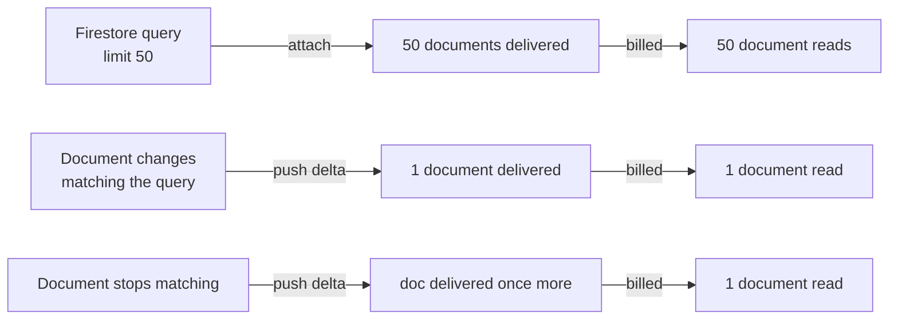

# 11 — Realtime System

**Project:** CareGrid AI
**Document type:** Implementation specification for live data delivery
**Status:** Baseline v1.0 — normative for every Firestore listener, its query, and its teardown
**Related:** [01 PRD §6.9](./01_PRODUCT_REQUIREMENTS_DOCUMENT.md), [05 Frontend Architecture §14](./05_FRONTEND_ARCHITECTURE.md), [07 Database Schema §12.2 / §12.5](./07_DATABASE_SCHEMA.md), [22 Roles & Permissions §7](./22_USER_ROLES_PERMISSIONS.md), [26 Performance §5](./26_PERFORMANCE_REQUIREMENTS.md)

---

## 0. How to read this document

This document answers one question: **how does a dispatcher see a new critical incident within three seconds without us polling anything?** Everything here is a consequence of that answer.

Conventions used throughout:

| Convention | Meaning |
| --- | --- |
| `L1`…`L10` | Stable listener IDs. They are referenced by tests, by the registry, and by the budget arithmetic |
| `incidents`, `dispatches`, `notifications`, `responderLocations` | Firestore collection names exactly as in [07](./07_DATABASE_SCHEMA.md) |
| "listener" | One `onSnapshot` subscription, i.e. one server-side watch registered with Firestore |
| "read" | One Firestore **document** read. A listener that delivers 50 documents bills 50 reads |
| **MUST / MUST NOT** | Normative, test-enforced |
| **SHOULD** | Strong default; deviation requires a review note |
| `DECISION REQUIRED` | An open question that must be answered before the feature ships |

---

## 1. Scope and the one decision

### 1.1 The locked decision

> **Firestore `onSnapshot` listeners are the only live mechanism in CareGrid AI. There is no polling anywhere in the product.**

This is not a stylistic preference. It follows from three product constraints:

1. **FR-090** requires new incidents, status changes, assignment changes, responder availability, and notifications to propagate to connected clients within **3 s p95**.
2. **NFR-026** requires the total infrastructure cost of the demo to be **$0**. A transport that has to be run, scaled, and paid for is a transport we cannot have.
3. **NFR-006** sets the same 3 s p95 propagation target, and Firestore's offline-tolerant listen channel is the only transport we already pay for, already have rules for, and already have a free tier for.

### 1.2 Why not polling

| Mechanism | Why it is rejected |
| --- | --- |
| `setInterval` + `GET /api/incidents` every N s | Fails FR-090 for any N that is cheap. A 2 s poll of a 50-row queue is 30 requests/minute = **90 000 reads per dispatcher-hour**, 22× the entire NFR-007 budget of 4 000, for data that has not changed. A 30 s poll is 120 requests = 3 000 reads/hour and still misses the 3 s p95 target. Polling is arithmetically disqualified, not merely inelegant |
| `setInterval` re-read of a listener | A listener already re-reads changed documents. Re-reading on a timer is the same cost with worse freshness |
| SWR / React Query `refetchInterval` | Explicitly rejected as ADR-009 in [02](./02_TECHNICAL_REQUIREMENTS_DOCUMENT.md) §3.13 and [05](./05_FRONTEND_ARCHITECTURE.md) §14: it creates a second source of truth with its own invalidation rules, and its default behaviour is polling. The same document is explicit that we do **not** add a server-state cache library |
| `setInterval` for the two UI clocks only | Permitted and limited to: the relative-time ticker (30 s) and the SLA countdown (1 s). These are **client-side derivations of data already in memory** and issue **zero** Firestore reads. The lint rule `no-polling` permits exactly these two call sites |

### 1.3 Why not SSE or WebSockets

| Mechanism | Verdict | Reason |
| --- | --- | --- |
| Server-Sent Events from a Vercel Route Handler | Rejected | Vercel functions are stateless and request-scoped. There is no long-lived process to hold an SSE stream open; the Hobby plan additionally caps function duration. We would need a separate always-on server, which is a cost and an availability surface. A `ReadableStream` on a route handler survives at most as long as the function invocation |
| WebSockets | Rejected | Same reason, plus a broker. There is no free, always-on WebSocket tier we can rely on for a $0 demo |
| Firebase Realtime Database | Rejected | DEC-15 in [01](./01_PRODUCT_REQUIREMENTS_DOCUMENT.md) fixes Firestore as the single datastore. It is also the weaker product: no transactions across documents, worse query ergonomics, worse free tier for this shape |
| Firestore `onSnapshot` | **Adopted** | Push delivery, offline tolerance built in, reconnection built in, transactional consistency with the same data, one security model, one SDK, $0 at our scale |

**The honest cost of the choice:** Firestore listeners bill **one read per document delivered**, not one read per query. A listener with `limit(50)` costs 50 reads the moment it attaches, and one more read for every document that subsequently changes and matches. This document does not hide that; §7 is entirely about paying for it.

### 1.4 The cost model, stated plainly



Three consequences the UI must be designed around:

| Fact | Consequence in the product |
| --- | --- |
| Attach cost is `limit()`, not "a few documents" | A 200-limit listener costs 200 reads the moment a dispatcher opens the page. Limits are small and the numbers are in §2.2 |
| A change costs 1 read **per matching listener per client** | Three incident listeners on one dashboard means a single status change can cost a dispatcher 3 reads. §7.2 accounts for it and §7.3 has a ladder to reduce it |
| Deleting a document from the result set still delivers it once | A soft delete (`deletedAt` set) still pushes one final read. This is why FR-123 is a soft delete and why the churn is bounded |

---

## 2. Listener inventory

### 2.1 The registry

All subscriptions are created through one module so the budget is enforced rather than hoped for.

```ts
// lib/firebase/listener-registry.ts
export type ListenerHandle = { id: ListenerId; unsubscribe: () => void };

export type ListenerId =
  | 'queue'            // L1
  | 'incidentDetail'   // L2a
  | 'incidentHistory'  // L2b
  | 'mapIncidents'     // L3
  | 'mapLocations'     // L4
  | 'notifications'    // L5
  | 'responderAssignments' // L6
  | 'sessionUser'      // L7
  | 'kpiTiles'         // L8
  | 'slaSweep'         // L9
  | 'ownLocation';     // L10

export const MAX_CONCURRENT_LISTENERS = 8;   // FR-091, [07](./07_DATABASE_SCHEMA.md) §12.5

// count() must never exceed 8. The registry:
//   console.warn('realtime: 6 of 8 listener slots in use', ids)  at 6
//   throws in NODE_ENV === 'test'  at 9
//   unsubscribes all on sign-out and on uid change
```

**Rule R-1.** Listeners are created only by `useRealtime*` hooks (`hooks/` or `features/*/hooks/`). A raw chained `.where()` inside an `onSnapshot` call in a component file is a lint error (`firestore/listener-outside-hook`).

**Rule R-2.** Listener queries are built by the scoped query helpers in `lib/firestore/queries.ts` (`queueQuery`, `incidentQuery`, `mapViewportQuery`, `notificationsQuery`, `slaSweepQuery`, …). Hand-writing a listener query is how an unindexed composite gets into production.

### 2.2 Inventory

Active-status set used below: `ACTIVE_STATUSES = ['new','triaged','verified','assigned','en_route','on_scene']` (6 values). `OPEN_STATUSES` (7 values, adds `resolved`) is the set used by the duplicate search and the map viewport. Both are ≤ 30, satisfying the Firestore `in` limit ([07](./07_DATABASE_SCHEMA.md) §12.7).

| # | Listener | Collection / query | `where` clauses | `orderBy` | `limit` | Role | Page | Attach reads | Teardown trigger |
| --- | --- | --- | --- | --- | ---: | --- | --- | ---: | --- |
| **L1** | `queue` — live incident queue | `incidents` | `deletedAt == null`, `status in ACTIVE_STATUSES`, plus the URL filter set (`urgency in`, `category in`, `assigneeUid ==`, `unassigned` via `assigneeUid == null`, `q` via `searchTokens array-contains-any`) | `updatedAt DESC` | **50** | dispatcher, admin | `/dashboard`, `/incidents`, `/map` | 50 | unmount · any filter value changes · role change · sign-out |
| **L2a** | `incidentDetail` — single incident | `incidents/{id}` | none needed (rules gate it) | none | **1** | all (server pre-checks visibility) | `/incidents/[id]` | 1 | unmount · id change · role change |
| **L2b** | `incidentHistory` — timeline (subcollection) | `incidents/{id}/statusHistory` | none | `createdAt DESC` | **50** | all (inherits L2a visibility) | `/incidents/[id]` | ≤ 50 | unmount · only created when `expand` includes `history` |
| **L3** | `mapIncidents` — viewport incidents | `incidents` | `geoCells array-contains <viewportCell>`, `deletedAt == null`, `status in OPEN_STATUSES` | `updatedAt DESC` | **150 total across all cells** | dispatcher, admin | `/map` | ≤ 150 | unmount · viewport cells change (debounced) |
| **L4** | `mapLocations` — responder markers | `responderLocations` | `status != offline` | `capturedAt DESC` | **150** | dispatcher, admin | `/map` | ≤ 150 | unmount · role change |
| **L5** | `notifications` — the bell **and** `/notifications` | `notifications` | `recipientUid == uid` (only, never widened) | `createdAt DESC` | **50** | all | every `(app)` route | 50 | unmount · uid change · sign-out |
| **L6** | `responderAssignments` — active assignments | `dispatches` | `responderUid == uid`, `status in ['active','accepted']` | `dispatchedAt DESC` | **20** | responder | `/dashboard`, `/responders` | ≤ 20 | unmount · responder goes `offline` · role change |
| **L7** | `sessionUser` — role/status mirror for the shell | `users/{uid}` | none | none | **1** | all | `(app)/layout.tsx` | 1 | unmount (layout) · uid change · sign-out |
| **L8** | `kpiTiles` — live KPI source | `incidents` | `deletedAt == null`, `status in ACTIVE_STATUSES` | `updatedAt DESC` | **20** | dispatcher, admin | `/dashboard` | 20 | unmount · role change |
| **L9** | `slaSweep` — at-risk / newly breached | `incidents` | `deletedAt == null`, `slaBreachedAt == null`, `status in ['verified','assigned','en_route','on_scene']` | `verifiedAt ASC` | **50** | dispatcher, admin | `/dashboard` | ≤ 50 | unmount · role change |
| **L10** | `ownLocation` — heartbeat confirmation | `responderLocations/{uid}` | none | none | **1** | responder, on duty | `/dashboard` | 1 | unmount · status `offline` |

**Composite indexes these listeners require** (all exist in [07](./07_DATABASE_SCHEMA.md) §4):

| Listener | Index # in [07](./07_DATABASE_SCHEMA.md) §4 | Field order |
| --- | ---: | --- |
| L1 default | 1 | `deletedAt ASC, status ASC, createdAt DESC` |
| L1 `orderBy updatedAt` | new | `deletedAt ASC, status IN, updatedAt DESC` — **must be added to `firestore.indexes.json`**; the shipped index #1 orders by `createdAt` |
| L1 assignee filter | 5 | `deletedAt ASC, assigneeUid ASC, status ASC, updatedAt DESC` |
| L3 | 6 | `geoCells (array-contains) → status (in) → updatedAt (desc)` |
| L9 | 8 / 9 | `deletedAt ASC, verifiedAt ASC, status IN [5], urgency ASC` and `deletedAt ASC, slaBreachedAt ASC, status IN [6]` |
| L5 | §7 `notifications` | `recipientUid ASC, createdAt DESC` |
| L6 | §8 `dispatches` | `responderUid ASC, status ASC, dispatchedAt DESC` |

> **Required change to `firestore.indexes.json`:** L1 orders by `updatedAt DESC` because the queue is ordered by *last change* (a verified incident must float to the top of an unassigned queue, FR-071). Index #1 in [07](./07_DATABASE_SCHEMA.md) orders by `createdAt DESC`. Add the `updatedAt` variant; do not silently change index #1, because the history cursor pagination in [07](./07_DATABASE_SCHEMA.md) §12.3 depends on `createdAt`.

### 2.3 Per-page arithmetic (FR-091)

| Route | Role | Listeners | Count | Against 8 |
| --- | --- | --- | ---: | :-: |
| `/`, `/login`, `/signup`, `/forgot-password` | any | — (FR-095) | **0** | ✔ |
| `/track?ref=CG-XXXXXX` | any | — (FR-095) | **0** | ✔ |
| `/report` | any | — (FR-095) | **0** | ✔ |
| `/analytics` | dispatcher, admin | — (FR-099 forbids listeners for historical data) | **0** | ✔ |
| `/admin/audit-logs` | admin | — | **0** | ✔ |
| `/settings`, `/profile` | any | L5 + L7 | **2** | ✔ |
| `/notifications` | any | L5 + L7 | **2** | ✔ |
| `/incidents/[id]` | dispatcher, admin | L7 + L5 + L2a + L2b | **4** | ✔ |
| `/incidents` (history list) | dispatcher, admin | L7 + L5 + L1 | **3** | ✔ |
| `/dashboard` | **citizen** | L7 + L5 | **2** | ✔ |
| `/dashboard` | **responder** | L7 + L5 + L6 + L10 | **4** | ✔ |
| `/dashboard` | **dispatcher / admin** | L7 + L5 + **L1** + **L8** + **L9** | **5** | ✔ |
| `/map` | dispatcher, admin | L7 + L5 + L3 + L4 | **4** | ✔ |
| `/map` | responder | L7 + L5 + L6 | **3** | ✔ |

**Worst case: 5 concurrent listeners on `/dashboard` for a dispatcher.** Headroom = 3 slots.

> **Accounting note.** [31 Coding Standards](./31_CODING_STANDARDS.md) §9.1 states "dispatcher dashboard 4". That count is page-level only and excludes the `(app)/layout` session listener L7, which [05](./05_FRONTEND_ARCHITECTURE.md) §14.1 counts as a slot. Both numbers are within FR-091; **this document's number (5, including L7) is the one the registry enforces**, because the registry cannot tell which layout a listener was created from.
>
> [05](./05_FRONTEND_ARCHITECTURE.md) §14.1 also reserves 2 slots as headroom. We observe 3. The difference is that L8 (`kpiTiles`) is the first item on the degradation ladder in §7.3; treating it as "reserved" rather than "spent" is why the ladder is safe.

### 2.4 What is never listened to

| Collection / surface | Why not |
| --- | --- |
| `analyticsDaily`, `riskZones` | Historical / precomputed. FR-099 forbids listeners for historical or archived analytics queries |
| `auditLogs` | Append-only history, read through `GET /api/admin/audit-logs` with pagination |
| `aiRuns` | Telemetry, read on the incident detail page |
| `incidents` for the analytics or history tab | FR-099. History is a cursor-paginated `GET`, not a watch |
| `users` (other than own doc) | Only the server resolves roles ([22](./22_USER_ROLES_PERMISSIONS.md) §2) |
| `rateLimits`, `config/app` (writes) | Server-mediated |
| Any collection on a route in §2.3 with count 0 | FR-095 |

---

## 3. Listener lifecycle

### 3.1 Attach

```ts
useEffect(() => {
  if (!uid || !enabled) return;
  const query = queueQuery({ filters, role, uid, limit: 50 });  // lib/firestore/queries.ts
  const unsubscribe = onSnapshot(
    query,
    { includeMetadataChanges: true },   // only where §3.3 says so
    (snap) => { ... },
    (err) => { setError(mapListenerError(err)); },
  );
  return register(unsubscribe, 'queue');   // registry owns teardown as well as counting
}, [uid, enabled, queryKey]);               // queryKey is the memoised query (§3.6)
```

| Rule | Detail |
| --- | --- |
| A-1 | Never call `onSnapshot` in a render body, an event handler, or a `useMemo`. Only inside an effect |
| A-2 | Always pass an `error` callback. An unhandled listener error surfaces as an unhandled rejection and the UI shows an empty queue with no explanation |
| A-3 | The registry's `register` runs inside the same effect, immediately after `onSnapshot`, so the count is never transiently wrong |
| A-4 | Auth must be resolved first. `authStateChanged` → `uid` → then attach. Attaching before `uid` is known produces a `permission-denied` first snapshot on some paths |

### 3.2 The initial snapshot, and the seed

Firestore delivers the current matching set as the first `onSnapshot` callback. For a page whose data also came from a Server Component, that produces a flash of emptiness. Every hook therefore accepts a `seed`:

```ts
export function useRealtimeIncidents(
  filters: QueueFilters,
  options?: { seed?: IncidentListRow[]; includeMetadataChanges?: boolean; enabled?: boolean },
): RealtimeQueue;
```

| State | Source | Rendered as |
| --- | --- | --- |
| `isLoading === true` and `seed` is present | RSC payload | The seed, with a "Live" indicator in `pending` state |
| First `onSnapshot` callback | Firestore | Replaces the seed. Same `IncidentListRow` shape, so React keys are stable and no row flashes |
| First callback errors | Firestore | Seed stays visible with a `warning` Alert and the `ConnectivityBanner` (NFR-012) |

**Never** render an empty state between the seed and the first snapshot. An empty queue is a claim about reality; during that window we do not know it.

### 3.3 `includeMetadataChanges` — exactly where it is on, and why

FR-093 permits it only where the UI distinguishes pending writes from server-confirmed writes. Cost: enabling it makes Firestore send a snapshot for *every* local write in the window, so it is never a free flag.

| Listener | `includeMetadataChanges` | Why |
| --- | --- | --- |
| **L1** `queue` | **ON** | The row shows a pending state: 60 % opacity + `Loader2` + `aria-busy="true"` (FR-076). The metadata `hasPendingWrites` flag is the only way to know the row the user just clicked is the *local* value rather than the server value |
| **L2a** `incidentDetail` | **ON** | The detail page shows the same pending state on the action bar, and the citizen's "what happens next" panel must not advance on an unconfirmed local write |
| **L8** `kpiTiles` | **OFF** | Tiles are aggregates. A pending tile is meaningless and would double-count a change already visible in L1 |
| **L9** `slaSweep` | **OFF** | `slaBreachedAt` is written server-side. A pending breach must never appear — the SLA clock is authoritative on the server (US-025 AC3) |
| **L2b** `incidentHistory` | **OFF** | History is server-written and append-only. There is never a local pending write |
| **L3** `mapIncidents` | **OFF** | Markers show server state. A marker that moves before the server agrees is a lie about location |
| **L4** `mapLocations` | **OFF** | Same, and this is safety-relevant: a responder marker must not jump to a position the server has not accepted |
| **L5** `notifications` | **ON** | Only for the one client-side write we allow: `markRead` writes `read`/`readAt` directly. Without metadata, the row would visually "un-read" itself for up to a snapshot interval |
| **L6** `responderAssignments` | **OFF** | Assignment state is transactional and server-owned. The responder's own accept action shows a button-level pending state, not a row state |
| **L7** `sessionUser` | **OFF** | Read-only mirror |
| **L10** `ownLocation` | **ON** | The heartbeat confirmation indicator must distinguish "written, not yet received" from "received" |

**Summary: 4 of 11 listeners have it on.** A review checklist item and TC-RT-004 enforce this.

### 3.4 `hasPendingWrites` handling

`DocumentChange.doc.metadata.hasPendingWrites` is `true` while the local write is optimistically applied and not yet acknowledged by the server.

```ts
// features/incidents/lib/applySnapshot.ts
export function mergeSnapshot(
  prev: readonly IncidentListRow[],
  snap: QuerySnapshot<IncidentListRow>,
  opts: { pendingIds: ReadonlySet<string> },
): { items: IncidentListRow[]; pendingIds: Set<string>; changedIds: Set<string> } {
  const nextPending = new Set<string>();
  const changed = new Set<string>();
  const now = Date.now();

  for (const change of snap.docChanges()) {
    const id = change.doc.id;
    if (change.type === 'removed') continue;            // handled by the `in`-window rule below
    const local = change.doc.metadata.hasPendingWrites; // server has NOT confirmed
    if (local) { nextPending.add(id); continue; }       // keep the optimistic row; skip the diff
    if (opts.pendingIds.has(id)) changed.add(id);       // server confirmed an optimistic write
    ...
  }
  return { items, pendingIds: nextPending, changedIds: changed };
}
```

Rules:

| # | Rule |
| --- | --- |
| M-1 | A pending document **replaces** the server value in the list; it is never merged field-by-field. Partial merges are how "the badge says verified but the status says triaged" bugs happen |
| M-2 | A document that leaves the result set (filter no longer matches, or soft-deleted) is removed from `items` even if the corresponding mutation is still pending, and the pending flag for that id is dropped. A row that no longer matches the queue must not linger |
| M-3 | `changedIds` drives the 600 ms live flash and is **discarded** under `prefers-reduced-motion`; the consumer renders a static left rule instead ([04](./04_UI_UX_DESIGN_SPECIFICATION.md) §4.6) |
| M-4 | `changedIds` never contains an id that is in `pendingIds` at the same time. A pending row is not "changed" — it is "being changed" |

### 3.5 Detach

| Trigger | Mechanism | Order matters? |
| --- | --- | --- |
| **Unmount** | `useEffect` cleanup calls the handle's `unsubscribe` | — |
| **Filter change** | The memoised `queryKey` changes, the effect re-runs, cleanup fires first | Yes. The old listener must be gone before the new one attaches, or a rapid filter toggle briefly holds 2 listeners for the same page. The registry warns at 6; the double-attach is what makes that warning meaningful |
| **Role change** | `uid`-keyed remount of the `(app)` shell + an explicit `registry.unsubscribeAll()` in the `authStateChanged` handler before the new subscriptions are created | Yes. A citizen's client must **never** remain subscribed to dispatcher data ([07](./07_DATABASE_SCHEMA.md) §12.2) |
| **Sign-out** | `signOut()` → `dispatchEvent(new Event('cg:cache-clear'))` → clear `cg.*` localStorage keys except `cg.ui` → `registry.unsubscribeAll()` → `registry.clear()` | Yes, in that order |
| **Different user signs in on the same tab** | `authStateChanged` to a different `uid` ⇒ `unsubscribeAll()` before any new subscription | Yes |
| **Tab backgrounded** | **No teardown.** Firestore keeps the listen channel. See §13 |
| **Network loss** | **No teardown.** Firestore buffers and replays |

```ts
// hooks/useAuth.ts — the one place teardown-on-identity-change is enforced
onAuthStateChanged(auth, (user) => {
  const nextUid = user?.uid ?? null;
  if (nextUid !== currentUid) {
    registry.unsubscribeAll();          // identity changed: drop everything first
    currentUid = nextUid;
    clearLocalIncidentCache();          // US-042 AC3
  }
});
```

### 3.6 Query memoisation

A listener must not be re-created by a React re-render. Every hook builds a **string key** from the query parameters and only rebuilds the `Query` object when the key changes:

```ts
const queryKey = useMemo(
  () => JSON.stringify([role, uid, filters, limit]),
  [role, uid, filters, limit],          // `filters` is itself memoised by useIncidentFilters
);

useEffect(() => { /* … */ }, [uid, enabled, queryKey]);
```

`useIncidentFilters` guarantees `filters` is a stable object identity when the parsed query string is unchanged, so `queryKey` is stable across renders and the effect does not re-run. **Rule:** never put a freshly-built array or object in the dependency array of a listener effect.

---

## 4. Reconnect and offline

### 4.1 Firestore's own behaviour

The Firestore Web SDK maintains a long-lived listen channel and **automatically re-subscribes** after a network interruption. We do not re-implement reconnection, and we do not add a reconnect timer. What the SDK does:

| Situation | SDK behaviour | What we must do |
| --- | --- | --- |
| Network drops | Buffers local writes; the listen channel is marked offline; no `onSnapshot` callbacks fire | Show the reconnecting state (§4.2); allow the UI to say the data is stale |
| Network returns | Re-opens the channel, re-sends the query, delivers a fresh full snapshot, then replays the buffered delta | Reset `wentOfflineAt`; drain the offline outbox (§4.3) **after** the first fresh snapshot, not before |
| Long offline (minutes) | The listen channel times out server-side; the SDK re-issues the query | Nothing extra; the fresh snapshot is authoritative |
| Auth token expired | The SDK refreshes it via the Auth SDK and retries | Nothing; `ROLE_MISMATCH` handling lives in the API layer ([22](./22_USER_ROLES_PERMISSIONS.md) §2) |

### 4.2 The "Reconnecting…" state

> `ConnectivityBanner` is a **persistent** in-page banner. It is never a toast. A toast storm during an outage is a defect ([16](./16_ERROR_HANDLING.md) §6.3), and a connectivity problem is exactly the moment the user must be able to read the screen.

```ts
// hooks/useOnlineStatus.ts
type OnlineStatus = {
  isOnline: boolean;        // navigator.onLine AND Firestore connectivity
  isReconnecting: boolean;  // online, but Firestore has not re-established listeners
  lastUpdateAt: number | null;
  wentOfflineAt: number | null;
};
```

`isReconnecting` is derived, not guessed:

```ts
const [firestoreOffline, setFirestoreOffline] = useState(false);
useEffect(() => {
  const unsub = onSnapshotsInSync(() => { setFirestoreOffline(false); setLastSyncedAt(Date.now()); });
  return unsub;
}, []);
useEffect(() => {
  const unsub = onNetworkStatusChange(client, (status) => {
    setFirestoreOffline(status === 'unavailable');   // 'unavailable' ⇒ still probing
  });
  return unsub;
}, []);

const isOnline       = navigatorOnLine && !offlineFromWindowEvent;
const isReconnecting = isOnline && firestoreOffline;
```

| State | Banner | Data |
| --- | --- | --- |
| `isOnline && !isReconnecting` | hidden; `LiveIndicator` shows "Live · updated {n}s ago" | Fresh |
| `isReconnecting` | `Reconnecting…` (info tone, spinner suppressed under reduced motion) | Last known payload, marked stale |
| `!isOnline` | `You are offline. Actions you take now will be sent when you reconnect.` | Last known payload, marked stale |
| offline > 30 s | same banner + `Pending sync` count on any queued mutations | — |

`isStale` is a field on every realtime hook's return shape so the consumer can say so without inspecting timestamps. Requirement: US-041 AC1 and AC2, NFR-012.

### 4.3 Offline mutation queue — responder status actions only

**Scope is deliberately tiny.** Only the responder's own lifecycle transitions are queued. Dispatcher mutations are not queued ([05](./05_FRONTEND_ARCHITECTURE.md) §14.6): a dispatcher acting on a stale queue during a control-room outage is a worse outcome than a disabled button.

```ts
// features/responders/lib/outbox.ts
export type OutboxItem = {
  clientActionId: string;            // stable uuid, sent as clientActionId (idempotency)
  uid: string;                      // owner — a different signed-in user can never replay these
  incidentId: string;
  kind: 'status';
  to: 'en_route' | 'on_scene' | 'resolved';
  note: string | null;
  resolutionCode: ResolutionCode | null;
  capturedAt: string;               // ISO-8601, when the responder pressed the button
  attempts: number;
  state: 'queued' | 'sending' | 'failed' | 'conflict';
  lastErrorCode: string | null;
};

export const OUTBOX_MAX_ITEMS = 25;  // bounded — see below
```

| Rule | Detail |
| --- | --- |
| Q-1 | **Bounded.** At most `OUTBOX_MAX_ITEMS` (25) queued actions. A 26th action is refused with "You have 25 actions waiting to send. Reconnect before adding more." A responder realistically has ≤ 3 active incidents; 25 is generous. An unbounded queue is a memory leak and a surprise |
| Q-2 | **Ordered replay.** Items replay in `capturedAt` order, strictly one at a time. Two concurrent transitions on the same incident would race the transition table and one would be rejected for no good reason |
| Q-3 | **Bounded attempts.** 3 attempts per item, exponential backoff 2 s / 8 s / 30 s. After that `state = 'failed'` and the item is surfaced in a `Sheet` with `Retry` and `Discard` (US-014 AC2) |
| Q-4 | **Never silently dropped.** A failed item is visible until a human resolves it. This is an explicit acceptance criterion |
| Q-5 | **Stale-expiry.** An item older than 24 h is moved to `state: 'expired'` and shown as "This action was taken more than a day ago and was not sent. The incident may have moved on." Replaying a 24-hour-old `en_route` is worse than not sending it |
| Q-6 | **Uid-scoped.** The outbox record stores `uid`; a sign-in as a different user never replays it |
| Q-7 | **Storage.** `localStorage` key `cg.outbox`, capped, written synchronously on every state change so a tab crash cannot lose an action |
| Q-8 | **No offline heartbeat.** While offline the responder location heartbeat is suspended. On reconnect exactly **one** heartbeat is sent immediately and the 60 s `RESPONDER_HEARTBEAT_SEC` cadence resumes. **No backlog is written** — writing a location trail for a period the responder did not report one would be fabricating data ([07](./07_DATABASE_SCHEMA.md) §7.2) |

```ts
// features/responders/lib/outbox.replay.ts
export async function replayOutbox(uid: string, api: IncidentApi): Promise<ReplayReport> {
  const items = readOutbox(uid).filter(i => i.state === 'queued' || i.state === 'sending');
  const report: ReplayReport = { sent: 0, conflicts: 0, failed: 0 };

  for (const item of sortBy(items, i => i.capturedAt)) {      // Q-2
    if (item.capturedAt < hoursAgoIso(24)) { markExpired(item); continue; }   // Q-5
    markSending(item);
    try {
      await sleep(backoffMs(item.attempts));                  // Q-3
      const res = await api.changeIncidentStatus(item.incidentId, {
        status: item.to, note: item.note,
        resolutionCode: item.resolutionCode, clientActionId: item.clientActionId,
      });
      remove(item);
      report.sent += 1;
      if (res.meta.noop) log.info('outbox.noop', { clientActionId: item.clientActionId });
    } catch (e) {
      if (isApiError(e) && e.code === 'INVALID_STATUS_TRANSITION') {
        markConflict(item, e); report.conflicts += 1;           // §4.4
      } else if (isApiError(e) && (e.status === 409 || e.status === 403)) {
        markFailed(item, e.code); report.failed += 1;           // Q-4
      } else {
        markQueued(item, e.code); break;                       // network still down: stop, keep order
      }
    }
  }
  return report;
}
```

### 4.4 Conflict detection on replay

> "On reconnect, queued actions replay in order; a rejected action surfaces an explanatory error and is not silently dropped. A conflict (someone else changed the incident) is reported as 'This incident was updated by someone else' and does not overwrite." — US-014 AC2, AC3

Three distinct failure shapes, and they must not be conflated:

| Shape | How we detect it | Copy | Action offered |
| --- | --- | --- | --- |
| **Transition no longer legal** | `409 INVALID_STATUS_TRANSITION` with `details.allowed: [...]` | "This incident was updated by someone else. It is now {toStatus}." | `Reload` (refetch and drop the queued action) · `Discard` |
| **Same target, already there** | `200` with `meta.noop: true` | "Already recorded." | none — the item is removed |
| **Permission changed** | `403 FORBIDDEN` or `403 ROLE_MISMATCH` | "Your permissions changed on the server. Refresh your session to continue." | `Refresh session` (`getIdToken(true)`) |
| **Target gone** | `404 INCIDENT_NOT_FOUND` | "This incident is no longer available to you." | `Discard` |

**Implementation note.** Conflict detection is *server-side* — we never diff client state to decide whether a conflict occurred. The client re-reads the incident through the normal `GET /api/incidents/:id` after a failed write (the L2a listener does this for free once the write fails, because the listener's snapshot reflects the server's truth). §10.2 spells out the ordering.

### 4.5 Backoff

| Situation | Backoff |
| --- | --- |
| Offline queue replay attempt 1 / 2 / 3 | 2 s → 8 s → 30 s |
| Listener error that is *not* a network error (e.g. `permission-denied`) | **No retry.** The query is wrong or the rules are wrong. Retrying a denied query is a hot loop |
| `onSnapshot` error `unavailable` | The SDK handles reconnection. We only reflect it in the banner |
| `onSnapshot` error `failed-precondition` (missing composite index) | No retry; surface `MISSING_INDEX` in the client error reporter. This is a deploy-time defect — NFR-014 requires rules and indexes to be *deployed and tested*, not merely written ([18](./18_TESTING_QA_PLAN.md) §7) |
| `onSnapshot` error `resource-exhausted` | No automatic retry. §13 |

---

## 5. Optimistic updates and rollback

### 5.1 The five steps (FR-076, FR-098)

1. Capture the previous row from the **listener payload**, not from a component-local copy.
2. Apply the local patch; add the id to `pendingIds`; start a `toast.promise`.
3. **Await** the write acknowledgement (FR-098). The button is not optimistic-by-assumption; the *rendering* is optimistic, the *success* is never assumed.
4. Success → remove from `pendingIds`; the listener confirms within 3 s and the row settles.
5. Failure → restore the captured previous row, flash the danger left rule, show an error toast with `Retry` and the server `code`, and surface `error.details.allowed` for a `409`.

### 5.2 Implementation sketch

```ts
// features/incidents/lib/useIncidentMutations.ts
import type { ApiError } from '@/lib/api/types';
import { isApiError } from '@/lib/api/error';

export type MutationResult =
  | { kind: 'confirmed'; noop: boolean; allowedNext: IncidentStatus[] }
  | { kind: 'rejected'; code: string; message: string; allowedNext: IncidentStatus[] }
  | { kind: 'conflict'; message: string };

export function useIncidentMutations(deps: {
  queue: RealtimeQueue;                       // for the authoritative previous row
  applyLocalPatch: (id: string, patch: Partial<IncidentListRow>) => void;
  restoreRow: (id: string, previous: IncidentListRow) => void;
  announce: (m: string) => void;             // sonner
}) {
  const { queue, applyLocalPatch, restoreRow, announce } = deps;

  return useCallback(async function mutate(action: IncidentAction): Promise<MutationResult> {
    if (typeof navigator !== 'undefined' && !navigator.onLine) {
      announce('You are offline. Dispatcher changes are not sent from an unsaved state.');
      return { kind: 'rejected', code: 'OFFLINE', message: 'Offline', allowedNext: [] };
    }

    const id = action.incidentId;
    // STEP 1 — capture from the LISTENER payload, not from component state
    const previous = queue.items.find(i => i.incidentId === id);
    if (!previous) return { kind: 'rejected', code: 'NOT_IN_VIEW', message: '', allowedNext: [] };

    // STEP 2 — apply locally and mark pending
    applyLocalPatch(id, patchFor(action));
    const toastId = announce.loading(pendingLabel(action));

    try {
      // STEP 3 — await the server
      const res = await callApi(action);

      if (res.meta.noop) { announce.success('No change needed.', { id: toastId }); }
      // STEP 4 — the listener confirms within 3 s (FR-090). We do not set state here:
      // writing the server value locally too would create a second source of truth
      // and would fight the snapshot that arrives 200 ms later.
      return { kind: 'confirmed', noop: res.meta.noop, allowedNext: res.data.allowedNext };
    } catch (e) {
      if (!isApiError(e)) throw e;

      // STEP 5 — visible rollback
      restoreRow(id, previous);
      const allowed = isApiError(e) && e.details?.allowed as IncidentStatus[] | undefined;

      if (e.code === 'INVALID_STATUS_TRANSITION' && allowed?.length) {
        announce.error(`Not allowed. You can move this incident to: ${allowed.join(', ')}.`, { id: toastId });
        return { kind: 'rejected', code: e.code, message: e.message, allowedNext: allowed };
      }
      if (e.code === 'ROLE_MISMATCH') {
        announce.error('Your permissions changed on the server. Refresh your session to continue.', { id: toastId });
        return { kind: 'conflict', message: e.message };
      }
      if (e.status === 429) {
        announce.error(`Too many requests. You can try again in ${e.retryAfterSec ?? 5} seconds.`, { id: toastId });
        return { kind: 'rejected', code: e.code, message: e.message, allowedNext: allowed ?? [] };
      }
      announce.error(`${e.message} Reference ${e.requestId}`, {
        id: toastId, action: { label: 'Retry', onClick: () => void mutate(action) },   // FR-098
      });
      return { kind: 'rejected', code: e.code, message: e.message, allowedNext: allowed ?? [] };
    }
  }, [queue.items, applyLocalPatch, restoreRow, announce]);
}
```

Three details that are easy to get wrong and are therefore normative:

| # | Rule | Why |
| --- | --- | --- |
| O-1 | On success, **do not** write the server response into the list. Remove the id from `pendingIds` and let the snapshot arrive | Writing the response creates a second source of truth. The snapshot is authoritative and is already in flight |
| O-2 | The `previous` row is captured **before** the patch, from `queue.items`, which is derived from the last snapshot | Capturing from component state can capture an already-rolled-back value |
| O-3 | Rollback is a **restore of the captured row**, not a recomputation | Recomputing derived fields (`verification`, `slaState`) from a restored partial row is how a row ends up claiming "human verified" after a failed `PATCH` |

### 5.3 When NOT to use optimism

| Action | Optimistic? | Reason |
| --- | --- | --- |
| `PATCH /status` (`en_route`, `on_scene`, `resolved`, `verified`, `false_alarm`, `cancelled`, `closed`) | **Yes** | Idempotent with `clientActionId`, easily replayed, high click frequency, and the allowedNext set is server-returned anyway |
| `PATCH /notifications/:id` (mark read) | **Yes** | The only client-SDK write we allow; the local flip is what the user asked for |
| `PATCH /incidents/:id` (`summary`, `urgency`, `category`, `location`) | **Yes**, for `urgency`/`category`/`summary`; **no** for `location` | Changing location re-runs duplicate detection and can flip `duplicateStatus` to `confirmed_duplicate`. A map pin that jumps before the server agrees is a location lie |
| `POST /incidents/:id/dispatch` | **No** | A double-fire creates two dispatches; the "at most one active" invariant is FR-053 and the transaction is the guard. Show a button-level pending state and wait |
| `POST /incidents/:id/merge` | **No** | Destructive and reversible only for 24 h. Wait for the server |
| `DELETE /incidents/:id` | **No** | Destructive, soft-delete semantics, audit |
| `POST /incidents/:id/merge/undo` | **No** | Same as merge |
| `POST /api/admin/users/:id/role` | **No** | Two-step confirm then wait; the claim sync is not atomic with Firestore ([07](./07_DATABASE_SCHEMA.md) §12.7) |
| `POST /api/uploads/sign` + `PUT` | **Yes** for the progress UI only | The upload progress is optimistic by definition; the *incident* is not created optimistically |

---

## 6. Query design rules

These are the rules a listener query must satisfy. The first four are lint-enforced.

| # | Rule | Enforcement | Example |
| --- | --- | --- | --- |
| QD-1 | **Always a `limit()`.** No exception, no "we'll add one later" | Lint `firestore/listener-requires-limit`; the registry asserts at attach | `.limit(50)` |
| QD-2 | **Always `where('deletedAt','==',null)` on `incidents`** | Lint `firestore/incident-query-requires-soft-delete-filter` | This is the single most commonly forgotten rule in [07](./07_DATABASE_SCHEMA.md) §12.4 |
| QD-3 | **Never an unbounded listener.** No `onSnapshot` without `limit`, no `onSnapshot` on a collection with no `where` | Lint + registry | — |
| QD-4 | **Role-scoped.** A citizen's client must never be capable of forming a dispatcher query | TC-RT-003 asserts the registry drops all listeners on a role change; a `citizen` role has no code path that builds L1/L3/L4/L8/L9 | `citizen` → `where('reporterUid','==',uid)` |
| QD-5 | **`orderBy` must match a composite index exactly**, in the Firestore field order: array-membership (`array-contains`, `in`) first, then equality, then range, then the sort | Review; verified in CI by running every listener query against the emulator with indexes loaded | L3: `geoCells` → `status` → `updatedAt` |
| QD-6 | **`in` sets stay ≤ 30 values**, `or` sets ≤ 10, `not-in` ≤ 10 | `lib/collections/enums.ts` exports the sets; a unit test asserts every set's size | `ACTIVE_STATUSES` = 6, `OPEN_STATUSES` = 7 |
| QD-7 | **One range/order field per query.** Firestore allows one inequality | Review | Never `where('createdAt','>=',x).where('updatedAt','<=',y)` |
| QD-8 | **The `where` set must be a prefix of the index.** Adding a filter that is not in the index requires adding the index, not removing the filter | Emulator CI run | `q` search adds `searchTokens array-contains-any` — needs its own index entry |
| QD-9 | **Never listen to a subcollection whose parent listener is already attached**, except `statusHistory` on the detail page | Review | The queue is 1 read per change, not 1 per history row (L-B in [26](./26_PERFORMANCE_REQUIREMENTS.md) §5.4) |
| QD-10 | **Free-text search uses `searchTokens`, never `array-contains` on `originalText`.** `searchTokens` is ≤ 30 tokens, each ≤ 24 chars, and an `in` on it is capped at **3 tokens** client-side | `GET /api/incidents` §3.2 caps at 3; the same cap applies to L1 | `where('searchTokens','array-contains-any', tokens.slice(0,3))` |
| QD-11 | **A listener query is built by a helper, never inline** | Lint `firestore/listener-outside-hook` + `firestore/raw-listener-query` | `queueQuery({...})` |

> **On QD-10:** Firestore's `in` limit is 30 values, and `searchTokens` is 30 elements, so `array-contains-any` on the full array is technically within the platform limit — but a 3-token intersection is what actually matches the token model in [07](./07_DATABASE_SCHEMA.md) §4.1, and matching on 30 tokens would return the whole collection. The cap is 3 and it is deliberate.

---

## 7. Listener cost control

### 7.1 The cost of each listener, on attach

| Listener | Attach reads | Re-attach frequency |
| --- | ---: | --- |
| L1 `queue` | 50 | Every filter change. A dispatcher who filters 10 times in a session pays 500 reads on re-attach |
| L2a `incidentDetail` | 1 | Every incident opened |
| L2b `incidentHistory` | ≤ 50 | Every incident opened, when `expand` includes `history` |
| L3 `mapIncidents` | ≤ 150 total across all cells | Every **settled** viewport change (debounced, §7.4 of [12](./12_MAP_LOCATION_SYSTEM.md)) |
| L4 `mapLocations` | ≤ 150 | Once per `/map` visit |
| L5 `notifications` | 50 | Once per session (it is layout-level) |
| L6 `responderAssignments` | ≤ 20 | Once per session, and on `available` ⇄ `offline` |
| L7 `sessionUser` | 1 | Once per session |
| L8 `kpiTiles` | 20 | Once per `/dashboard` visit |
| L9 `slaSweep` | ≤ 50 | Once per `/dashboard` visit |
| L10 `ownLocation` | 1 | Once per on-duty session |

**Total attach cost of the heaviest page** (`/dashboard`, dispatcher): 50 + 20 + 50 + 50 + 1 = **171 reads**.

### 7.2 The worked NFR-007 budget

Target: **≤ 4 000 document reads per dispatcher session-hour** (NFR-007, [26](./26_PERFORMANCE_REQUIREMENTS.md) §5.4). Two columns are given because the difference matters: the **modelled** column uses the arithmetic; the **conservative envelope** is the number the rehearsal is measured against.

| # | Component | Modelled | Envelope | Basis |
| ---: | --- | ---: | ---: | --- |
| 1 | `/dashboard` RSC first paint | 120 | 120 | queue 50 + KPI 20 + responder snapshot 50 ([07](./07_DATABASE_SCHEMA.md) §15) |
| 2 | L1 attach | 50 | 50 | `limit(50)` |
| 3 | L8 attach | 20 | 20 | `limit(20)` |
| 4 | L9 attach | 50 | 50 | `limit(50)` |
| 5 | L5 attach | 50 | 50 | `limit(50)` |
| 6 | L1 + L8 + L9 steady state | 99 | 2 000 | 1 read per changed doc **per matching listener**. Modelled: 33 visible mutations/h × 3 windows = 99. Envelope: 33 × 3 = 99, padded to 2 000 |
| 7 | L5 steady state | 40 | 800 | 1 read per new notification. Modelled 40/h; envelope padded |
| 8 | Manual `GET /api/incidents?limit=25` — 12 paginations | 300 | 300 | 25 reads each |
| 9 | Candidate ranking — 6 opens of the assign panel | 360 | 360 | ≤ 60 reads each ([08](./08_API_SPECIFICATION.md) §3.7) |
| 10 | Incident detail opens — 8 opens | 320 | 320 | ≤ 40 reads each with M-5 applied |
| 11 | Map viewport attaches — 2 settles | 300 | 300 | ≤ 150 total across all cells |
| 12 | Misc: `/api/me`, `/api/config`, `/api/resources`, `/api/health` | 130 | 130 | — |
| | **Total** | **1 839** | **4 500** | |

The envelope is **over budget by 500 reads**. That is the honest starting position, and it is the same finding [26](./26_PERFORMANCE_REQUIREMENTS.md) §5.4 reached by a different route. The mitigations, in the order they should be applied:

| # | Mitigation | Envelope effect | Requirement |
| --- | --- | ---: | --- |
| M-1 | Debounce map viewport queries to ≥ 400 ms after `onIdle`, and do not re-attach while the cell set is unchanged | 300 → 150 | [12](./12_MAP_LOCATION_SYSTEM.md) §10 |
| M-2 | **Drop L8.** KPI tiles are derived from the L1 window and labelled "derived from the 50 most recent active incidents". Steady state falls from 3 incident windows to 2 | −20 attach, 2 000 → 1 333 | §7.3 tier 1 |
| M-3 | `GET /api/incidents` default `limit` stays 25; pagination is user-initiated only | 300 → 150 | FR-121 |
| M-4′ | The candidate panel opens **at most once per incident per interaction**. It is not polled and not re-fetched on filter changes. *There is no valid cross-request cache on Vercel, so a "cache" is not available and is not claimed* | 360 → 180 | [26](./26_PERFORMANCE_REQUIREMENTS.md) §5.4 |
| M-5 | Incident detail subcollection ranges bounded to 25 `reports`, 50 `statusHistory`, 10 `resources` | 320 → 160 | [26](./26_PERFORMANCE_REQUIREMENTS.md) §5.4 |
| | **Total reduction** | **−1 307** | |
| | **After mitigations** | **3 193** | **20 % under the 4 000 ceiling** |

**The load-bearing honest statement:** rows 6 and 7 are the sensitive ones. A single incident mutation visible in three `incidents` listeners on one dashboard costs that client **3 reads**, not 1. If the observed mutation rate during the demo is higher than ~33/hour, the envelope rows 6 and 7 dominate everything else and the only honest fix is to reduce the number of `incidents` listeners (M-2), not to change any number in this table.

**Measured, not estimated, before the demo** — the rehearsal load script reports the actual per-session-hour figure, and `GET /api/admin/system/health` reports listener count by collection. The 3 193 figure is an arithmetic result under the stated assumptions; the rehearsal number is the one that gets quoted.

### 7.3 Degradation ladder when the budget is exceeded

Tiers are applied in order. Each tier is a real, shipped code path, not a hypothetical.

| Tier | Trigger | Action | User-visible effect | Reversible |
| ---: | --- | --- | --- | --- |
| **0** | default | All 5 dashboard listeners active | Full live surface | — |
| **1** | estimated session reads > 3 200 | Detach **L8**; KPI tiles derive from the L1 window | Tiles read "derived from the 50 most recent active incidents" | ✔ re-attach on next page load |
| **2** | > 3 600 | Detach **L9** as well; breach state comes from L1's window plus the server's `slaBreachedAt` when it lands in L1 | The **Breached** filter is limited to the L1 window; a `warning` note says "Breach detection in this session covers the 50 most recently updated active incidents" | ✔ |
| **3** | > 3 900 | Reduce L1 `limit` 50 → 25, then 25 → 15 | Queue header: "Showing the 25 most urgent. Narrow the filters for the rest." | ✔ |
| **4** | > 4 000 | Reduce L3 map viewport 150 → 75, then 75 → 40 | Map: "Showing 75 of more — narrow your filters" | ✔ |
| **5** | > 4 500 (over ceiling) | Reduce L5 50 → 25 | Bell shows the 25 most recent; the count still comes from those 25 and is labelled "25 most recent" | ✔ |

**What actually triggers the ladder — an honest problem.** A browser client cannot see its own Firestore bill. There are exactly three real triggers, and we do not pretend otherwise:

| Trigger | Mechanism | When used |
| --- | --- | --- |
| `config.realtime.budgetTier` pinned by an admin | `config/app` → `realtime.budgetTier: 0..5`, read from `GET /api/config` at shell mount | **Production.** A control-room operator can drop to tier 2 before a heatwave evening |
| Local estimator | `lib/realtime/estimator.ts` counts documents delivered per listener since page load and exposes the total on `window.__cgRealtime` | Rehearsal only. It is a proxy, not a measurement |
| Rehearsal measurement | The load script in [26](./26_PERFORMANCE_REQUIREMENTS.md) §11, cross-checked against **Firebase console → Usage & billing → Document reads** | Once, before the demo. This is the only authoritative number |

> **`DECISION REQUIRED` (RT-DR-1).** Should the budget tier be env-driven (`NEXT_PUBLIC_REALTIME_BUDGET_TIER`) instead of a `config/app` key? `config/app` is editable by an admin with an audit trail ([10](./10_AUTHORIZATION_SECURITY.md) `config.update`), which is the better story for a control room; the env var is a deploy-time value that needs no rules change. **Recommendation: `config/app`, because an admin lowering the realtime budget during a surge is a real operational action and it must be audited.** Decision owner: backend + product, before phase 4.

---

## 8. What updates live, and through which listener

This is the authoritative mapping required by FR-090. If a data change is not in this table, it is not live.

| # | Data that changes | Field(s) | Listener that delivers it | Latency expectation | Notes |
| ---: | --- | --- | --- | --- | --- |
| 1 | **A new incident appears** | whole `incidents` doc | L1 (dashboard/queue), L3 (if in viewport), and L2a if the user is already on the detail page of a linked incident | ≤ 3 s p95 | Not visible to the dispatcher queue until triage completes (FR-020). The document is written with `status: 'new'` and updated to `triaged`; the queue shows it from the first write |
| 2 | **Status change** | `status`, `verifiedAt`, `respondedAt`, `arrivedAt`, `resolvedAt`, `closedAt`, `resolutionCode` | L1, L3, L2a | ≤ 3 s | `statusHistory` is a subcollection and is **not** fanned out to the queue (QD-9). The detail page picks it up via L2b |
| 3 | **Assignee change** | `assigneeUid`, `assignmentMode` | L1, L3, L2a, and L5 (`incident_assigned` to the responder) | ≤ 3 s | The incident change and the notification are two separate pushes; the UI tolerates either arriving first (§10.1) |
| 4 | **SLA state change** | `slaBreachedAt` | L9 (detects the transition to breached in the un-breached active set), L1 (row moves into the Breached filter) | ≤ 3 s | The **clock is server-side** (`SLA_BREACH_SWEEP=on_write`, [21](./21_ENVIRONMENT_VARIABLES.md)). The client listener is a presentation mechanism, never an authority (US-025 AC3) |
| 5 | **Responder availability** | `responders/{uid}.status` | L4 (`responderLocations.status` mirrors it — [07](./07_DATABASE_SCHEMA.md) §7.2 says this mirror exists specifically for one-listener rendering) | ≤ 3 s | L4 is scoped `status != offline`, so going offline **removes** the marker from the map automatically |
| 6 | **Responder location** | `responderLocations/{uid}.{geo,accuracyM,accuracyGrade,headingDeg,speedMps,capturedAt,receivedAt,stale}` | L4 (dispatcher map); L10 (the responder's own confirmation) | ≤ 3 s after the heartbeat lands | Cadence is `RESPONDER_HEARTBEAT_SEC` = 60 s. The map updates when the heartbeat arrives, not continuously — deliberately, for battery (FR-066) |
| 7 | **Dispatch assignment / acceptance / withdrawal** | `dispatches/{id}.{status,acceptedAt,withdrawnAt}`, `responders.activeIncidentCount` | L6 (the responder's own view), L1 (the incident's `status`/`assigneeUid`), L5 (`incident_assigned`, `responder_unavailable`) | ≤ 3 s | `dispatches` is server-written; there is no client write path |
| 8 | **Notification created** | whole `notifications` doc | L5 | ≤ 3 s | FR-100. `critical`/`warning` also get an `aria-live` announcement (§13 of [13_NOTIFICATION_SYSTEM.md](./13_NOTIFICATION_SYSTEM.md)) |
| 9 | **Notification read state** | `read`, `readAt` | L5 (client SDK write, metadata on) | immediate locally | The only client write to this collection |
| 10 | **Dashboard statistics** | KPI tiles (active, unassigned, critical, SLA breached, available responders) | L8, with tier-1 fallback to L1 | ≤ 3 s | FR-078. **Honesty requirement:** these are counts **within the listened window**, not platform-wide counts. [05](./05_FRONTEND_ARCHITECTURE.md) finding F2 records that `GET /api/dashboard/summary` does not exist. The tile label must say which it is |
| 11 | **User's own role/status change** | `users/{uid}.{role,status}` | L7 | ≤ 3 s | On a role change, L7's snapshot triggers the full teardown + re-attach (§3.5), so the role change **also** re-establishes the right listeners |
| 12 | **Map viewport data** | incidents inside the visible cells | L3 | on `onIdle`, debounced ≥ 400 ms | [12](./12_MAP_LOCATION_SYSTEM.md) §10 |
| 13 | **Risk zones** | `riskZones` | **no listener** | — | P1, flag-gated (`ENABLE_RISK_ZONES`, default `false`). Read through `GET /api/analytics?include=risk`. FR-099 |

**Not live, by design:**

| Data | How it arrives | Why |
| --- | --- | --- |
| Analytics, risk zones, any historical aggregate | `GET /api/analytics` | FR-099 |
| The audit log | `GET /api/admin/audit-logs`, cursor-paginated | Append-only, unbounded growth |
| `aiRuns` | `GET /api/incidents/:id?expand=…` | Telemetry |
| The incident history archive | `GET /api/incidents?cursor=…` | Cursor pagination; a live watch over a 50 000-document collection is not a design, it is a bill |
| The reporter's identity and free text | Never live for a responder | FR-068; the responder's incident view is API-delivered and redacted ([22](./22_USER_ROLES_PERMISSIONS.md) §4.1) |

---

## 9. Realtime and pagination

### 9.1 The two mechanisms coexist by design

| Surface | Mechanism | Why |
| --- | --- | --- |
| `/dashboard` queue | **Listener** (L1) | The working set is ≤ 50 rows; the dispatcher must not page |
| `/incidents` history | **Cursor pagination** (`GET /api/incidents?cursor=…`, limit 25/50/100) | FR-121; the archive is unbounded |
| `/notifications` | **Listener** (L5) for the 50 newest + cursor pagination in the API for "load more" | The bell and the page share one listener ([04](./04_UI_UX_DESIGN_SPECIFICATION.md) §13.14) |

**The rule that makes coexistence safe:** the two never share state. A paginated result is a `CursorPage<T>` held in `usePagination`; a live result is `RealtimeQueue`. There is no code path that merges a snapshot into a cursor page, because a cursor page has a start position and a snapshot does not.

### 9.2 A new incident appearing at the top of a cursor-paginated list

**The problem.** `GET /api/incidents` is ordered by `createdAt DESC` with `startAfter(lastDoc)`. If a new incident is created after page 1 was fetched, it does not belong to page 1 (its `createdAt` is newer than the page-1 boundary). The cursor is still correct — nothing about it depends on the collection being static. The failure mode is **user expectation**, not correctness: a dispatcher on `/incidents` will not see the new incident until they reset to page 1, and might conclude the system is not receiving reports.

**The solution, without touching the cursor:**

| Step | Mechanism |
| --- | --- |
| 1 | A **single, bounded "live head" probe** is attached to `/incidents` and `/dashboard`-style surfaces: `incidents` where `deletedAt == null`, `status in ACTIVE_STATUSES`, `orderBy('createdAt','desc')`, `limit(5)`. This is the *newest* slice only. Cost: 5 reads on attach. It is the only listener on a paginated surface |
| 2 | On a new document in that probe whose `createdAt` is **after** the page-1 anchor timestamp, render a non-intrusive inline strip above the list: `1 new incident since you opened this list` with a `Show` action |
| 3 | `Show` performs a normal navigation: reset the cursor stack and re-fetch page 1 (`usePagination.reset()`). The cursor is discarded, not adjusted. **There is no attempt to splice a document into a cursor page** — the cursor's meaning would be silently corrupted |
| 4 | The strip is dismissed when the user acts on it, navigates, or after 60 s of no interaction. It is `role="status"`, not `role="alert"` — it is an opportunity, not an emergency |
| 5 | If the live head shows an incident **newer than the probe's own 5 documents** (a 6th arrive while the strip is open), the strip count increments; it never triggers a re-query by itself |

```ts
// features/incidents/hooks/useNewIncidentProbe.ts  — 5 reads, /incidents only
export function useNewIncidentProbe(anchorCreatedAt: string | null): {
  pending: IncidentListRow[]; dismiss: () => void;
} {
  // anchorCreatedAt = createdAt of the newest document in the current page 1,
  // captured when page 1 was fetched.
  // The probe's query is ORDERED BY createdAt DESC so "new" is unambiguous.
  // It is deliberately NOT ordered by updatedAt: an edit to an old incident is
  // not a new incident and must not raise this strip.
}
```

**Why the probe is a listener and not a 30-second poll:** a 30 s poll of a 5-row probe is 10 reads per 5 minutes = 120 reads/hour, and it still violates FR-090. A 5-document listener costs 5 reads and pushes within 3 s.

**Consistency requirement:** the probe's rows and page 1's rows are the same `IncidentListRow` shape and the same query helper, so `Show` produces a list that looks identical to the one the dispatcher was reading.

### 9.3 What must never happen

| Anti-pattern | Why it is banned |
| --- | --- |
| Splicing a new document into the head of a cursor page and keeping the cursor | The cursor's boundary becomes meaningless; page 2 will either repeat or skip a row. Silent data loss in a list an operator uses to decide who gets help |
| Advancing a cursor to skip the new incident | Same corruption, in the other direction |
| Re-fetching page 1 silently every time the probe fires | Turns a live list into a polling loop; every re-fetch is 25 reads and resets the dispatcher's scroll position |
| Ordering a paginated list by `updatedAt` | `updatedAt` is not unique and not monotonic w.r.t. the cursor; this is why [07](./07_DATABASE_SCHEMA.md) §12.3 paginates on `createdAt` |

---

## 10. Race conditions and reconciliation

These are the real races. Each has a defined resolution, and each has a test.

### 10.1 R-1 — A listener event arrives before the mutation's HTTP response

**Scenario.** A dispatcher clicks **Assign responder**. The server transaction commits at T. Firestore pushes the new `incidents` document to L1 at T+180 ms. The browser receives the HTTP `201` at T+320 ms.

**Why it matters.** If step 4 of the optimistic pattern wrote the server response into the list, the row would be re-written after the snapshot — two writes of the same value, harmless here, but with a `dispatch` response containing `data.incident` that the queue row shape does not fully contain, it would silently drop fields.

**Resolution.** Rule O-1: on success, the mutation writes **nothing** to the list. It removes the id from `pendingIds` and returns. The snapshot is the only writer of row state.

**Test.** TC-RT-020: attach L1 in the emulator, mutate an incident, and assert the row's `updatedAt` equals the snapshot's, not the response's.

### 10.2 R-2 — A `409` rollback races a real server state

**Scenario.** Two dispatchers both click **Verify** on the same incident. Dispatcher A's transaction commits. Dispatcher B's request returns `409 INVALID_STATUS_TRANSITION`? No — B's request is legal (`triaged → verified`) and arrives after A's write, so it returns `200` with `meta.noop: true` (the status is already `verified`). But if B's request arrives *before* A commits, B's write also succeeds and both rows show `verified`. Two audit entries, one real change. Acceptable, and `statusHistory` records both actors.

**The genuine conflict case:** B clicks **Cancel** on an incident A has just **verified**. B's write is rejected (`FR-019`: the reporter may not cancel once `verifiedAt` is set; a dispatcher may, so a dispatcher conflict is `INVALID_STATUS_TRANSITION` because `verified → cancelled` *is* allowed for a dispatcher). B's rollback restores the captured row (`triaged`), and the snapshot arrives showing `verified`.

**Resolution order, and it is fixed:**

1. The `409` is caught; `restoreRow(id, previous)` runs.
2. The rollback is marked `optimistic: true` for 1 200 ms on that row.
3. When the next snapshot arrives, the row is replaced by server truth. If the server truth differs from `previous`, the row shows a `ConflictBanner`: "A dispatcher updated this incident while you were working on it." and the row flashes once.
4. The rollback never persists. There is no code path that re-applies `previous` after a snapshot.

**The `pendingWrites` revert case.** Firestore can deliver a snapshot where a document that had `hasPendingWrites: true` now shows the server value, in the *same* callback that also carries a newer server value for a different field. The hook must therefore compare `updatedAt` when deciding whether a document is "newer than what I have":

```ts
function isNewer(incoming: IncidentListRow, current: IncidentListRow | undefined): boolean {
  if (!current) return true;
  if (incoming.updatedAt !== current.updatedAt) return incoming.updatedAt > current.updatedAt;
  return hashRow(incoming) !== hashRow(current);   // same updatedAt, different content = a real change
}
```

`updatedAt` is bumped inside the same transaction as the field change ([07](./07_DATABASE_SCHEMA.md) §12.6), so an equal `updatedAt` with different content means either a client-side optimistic write or a bug — both are handled by the hash comparison, and neither is silently dropped.

**Test.** TC-RT-021: in the emulator, apply a client write, force a `409` from a stubbed route, and assert (a) the row is restored, (b) the next snapshot wins, (c) no re-application of the stale value.

### 10.3 R-3 — Out-of-order `onSnapshot` callbacks

Firestore guarantees per-query ordering of delivered snapshots, but **our own React state updates** can be reordered by React 19's concurrent scheduling, and an `await` inside a callback handler can interleave two snapshot applications.

**Resolution — a monotonically increasing sequence guard:**

```ts
let seq = 0;
const unsubscribe = onSnapshot(query, { includeMetadataChanges }, (snap) => {
  const my = ++seq;
  queueMicrotask(() => {
    if (my !== seq) return;                  // a newer snapshot already applied
    setState(prev => applySnapshot(prev, snap));
  });
});
```

| Rule | Detail |
| --- | --- |
| O-5 | Snapshots are applied through a single reducer-like function, never through scattered `setState` calls |
| O-6 | Snapshots are applied in **document order** as Firestore delivered them; we never re-sort inside the callback. Sorting happens in the selector, once, for rendering |
| O-7 | `changedIds` is recomputed from the diff, never accumulated across snapshots. A flash that survives a newer snapshot is a bug |
| O-8 | The sequence guard is per-listener, not global: two listeners applying concurrently must not cancel each other |

### 10.4 R-4 — Two listeners deliver the same incident

On `/dashboard` a dispatcher has L1, L8, and L9, all over `incidents`. L1 and L8 can deliver the same document in the same second.

**Resolution.** Each listener owns its own state slice and its own rendering surface. The KPI tiles compute from L8's (or, at tier 1, L1's) slice; the queue renders L1's. **No listener writes into another's slice.** The only place they meet is the `pendingIds` set, which is owned by `useIncidentMutations` and is a union, not a merge of documents.

**Consequence, stated honestly:** L1 and L8 can transiently disagree (L1 has a change L8's window has not delivered yet). The KPI tile is therefore allowed to be up to one snapshot behind the queue row. This is a real, accepted consequence of having two windows, and it is another argument for tier 1 (one window).

### 10.5 R-5 — Reconnect replay vs. an in-flight mutation

**Scenario.** A responder is offline, presses **I've arrived**. The action queues (Q-2). The network returns. The listener's first fresh snapshot arrives, then `replayOutbox` runs.

**Wrong order:** replay first, then the snapshot. The write would be applied, then the pre-write snapshot would land and make the card show the old status for a moment.

**Mandated order:**

1. `onSnapshotsInSync` fires and the first fresh snapshot is applied.
2. **Then** `replayOutbox` starts, with its first backoff delay covering the 2 s it takes a snapshot to be considered in sync.
3. Each replayed success is confirmed by the listener within 3 s; the card shows `Pending sync` until the id leaves `pendingIds`.

**Test.** TC-RT-022: emulator, go offline (`client.disableNetwork()`), queue an action, `client.enableNetwork()`, assert the card never shows the pre-action status after replay begins.

---

## 11. Security rules interaction

### 11.1 Which collections a client may listen to directly at all

The rules in [22](./22_USER_ROLES_PERMISSIONS.md) §7 are the gate. This is the summary, from the listener's point of view.

| Collection | `citizen` | `responder` | `dispatcher` | `admin` | Listener(s) |
| --- | :-: | :-: | :-: | :-: | --- |
| `users/{uid}` | own | own | all | all | L7 (`get`, own only) |
| `incidents` | own (`reporterUid == uid`) | assigned (`assigneeUid == uid`) | all | all | L1, L3, L8, L9 (ops roles only); L2a (any) |
| `incidents/*/statusHistory` | if incident visible | if incident visible | read | read | L2b |
| `incidents/*/reports` | if incident visible | if incident visible, redacted server-side | read | read | **no listener** |
| `responders` | ✖ | own doc | list (ops only) | all | **no listener** |
| `responderLocations` | ✖ | own doc | read all | read all | L4 (ops), L10 (own) |
| `dispatches` | own incident's | own | read | read | L6 (responder) |
| `notifications` | own | own | own | own | L5 (all, own only) |
| `analyticsDaily`, `riskZones` | ✖ | ✖ (`riskZones` read) | read | read | **no listener** |
| `auditLogs`, `aiRuns` | ✖ | ✖ | read | read | **no listener** |
| `rateLimits` | ✖ | ✖ | ✖ | ✖ | no client access at all |

### 11.2 What MUST be delivered through the API instead, and why

> **This is the single most important security statement in the realtime design.**

| Data | Why it cannot be a direct client listener | How it is delivered |
| --- | --- | --- |
| **In-radius unassigned incidents for a `responder`** | Firestore Security Rules **cannot evaluate distance**. The rule for `incidents` is `isDispatch() || reporter == uid || assignee == uid` ([22](./22_USER_ROLES_PERMISSIONS.md) §7). There is no `geo` primitive, no `distance()` function, and no custom function that can read a `GeoPoint` and compare it to the caller's position | **API-delivered.** `GET /api/incidents` applies the [22](./22_USER_ROLES_PERMISSIONS.md) §4.1 rule server-side: `status ∈ {new,triaged,verified}` ∧ `distance(self.location, I.geo) <= self.serviceRadiusM` ∧ `I.evidenceCount > 0`, plus the full field redaction. The client refreshes it on reconnect, on filter change, and on a manual refresh. It is **not** live, and the UI says so |
| **A responder's view of an unassigned incident's redacted fields** | The redaction in [22](./22_USER_ROLES_PERMISSIONS.md) §4.1 (`reporterUid` omitted, `locationText` omitted, `originalText` replaced by `summary`, `ipHash` omitted, `ai.*` omitted) is a *server-side field-level transform*. A listener delivers whole documents; rules cannot remove a field from a `read` | **API-delivered** via `GET /api/incidents/:id`. The responder's *assigned* incidents may be listened to (L6 on `dispatches` reveals only the dispatch), but the incident document itself is fetched through the API for a non-assigned incident |
| **A dispatcher's candidate ranking (`distanceM`, `etaSec`, `capabilityMatch`, `missingResources`, `staleLocation`, `rank`)** | These are **computed** values: ≤ 60 `responders` read, then Haversine + capability + radius filtering + ranking in code ([08](./08_API_SPECIFICATION.md) §3.7). Rules cannot compute, and a listener cannot either | **API-delivered.** A ranked list is a one-shot query, not a subscription — a responder's rank changes as other incidents are assigned, and re-ranking 10 candidates on every change would be a listener storm |
| **`slaState`, `ageMin`, `distanceM` in list rows** | Server-derived ([08](./08_API_SPECIFICATION.md) §3.2). A listener would have to reimplement the SLA arithmetic on the client and the clients would disagree (US-025 AC3) | Server-written fields are listened to; **derived** fields are not stored and therefore cannot be listened to. The API computes them |
| **Any aggregate count** (`unreadCount` is the exception — it is derived from the same 50-document snapshot) | Firestore has no `COUNT` | API, or derived in the client from a snapshot that is already paid for |
| **Anything on a role the client does not hold** | A client cannot *ask* for data it lacks rules permission for; it would simply get a permission error | API, where `requireUser()` returns `403` with a catalogue code |

**The consequence, stated plainly:** the responder's in-radius queue is **seconds stale** and cannot be made live with Firestore alone. [05](./05_FRONTEND_ARCHITECTURE.md) finding F3 records this and names the only real fix: a server-side fan-out document per `geoCells` cell, written by the server when an incident enters an open status, which a client listener could then subscribe to by cell. **That is `DECISION REQUIRED` (RT-DR-2)** — it roughly doubles the write cost of incident creation, needs its own collection and rules, and is not built in v1. The honest v1 position: the responder's list is API-delivered, refreshed on reconnect and on filter change, and the `LiveIndicator` says so.

### 11.3 Rules interaction rules for the implementation

| # | Rule |
| --- | --- |
| SEC-1 | A listener error of `permission-denied` is a **defect**, not a condition. It means the query and the role disagree. Log it, surface `FORBIDDEN`, and (in tests) fail. Never swallow it into an empty list |
| SEC-2 | The rules' `canRead()` for `incidents` is `isDispatch() \|\| reporter == uid \|\| assignee == uid`. L1/L3/L8/L9 are only ever built for `dispatcher`/`admin`; the hook **returns an immediate `FORBIDDEN` error and subscribes to nothing** for any other role ([05](./05_FRONTEND_ARCHITECTURE.md) §6.6 states this for L4 and it applies to every ops listener) |
| SEC-3 | The `role` custom claim is a **mirror**. A stale claim after a role change produces a `permission-denied` on a listener, which is exactly why the role change path forces a token refresh and why L7's `users/{uid}` doc is watched: the doc is the truth, the claim is the rules' input |
| SEC-4 | L5's query is `where('recipientUid','==',uid)` and the hook exposes **no parameter** to widen it. There is no `?recipientUid=` in the client path, because there is no `?recipientUid=` anywhere (FR-103) |
| SEC-5 | `notifications` allows `update` only on `read` and `readAt`. The client write for mark-read is the only client write to any operational collection besides `responderLocations/{own}` |
| SEC-6 | A citizen client has **no** code path that constructs L1, L3, L4, L8, or L9. TC-RT-003 asserts this by mounting every route as a citizen and asserting `registry.count() === 2` (L5 + L7) |
| SEC-7 | Storage rules are irrelevant to listeners. A listener never downloads media; signed URLs are an API concern ([15](./15_FILE_STORAGE_SPECIFICATION.md)) |

---

## 12. Testing realtime

### 12.1 The Firestore Emulator Suite

Realtime behaviour is not unit-testable against a mock. The test suite uses the **Firestore emulator** (plus Auth) with `NEXT_PUBLIC_FIREBASE_USE_EMULATORS=true`.

```ts
// tests/setup/firestore.ts
import { initializeTestEnvironment, type RulesTestEnvironment } from '@firebase/rules-unit-testing';
import { readFileSync } from 'node:fs';

let env: RulesTestEnvironment;

export async function startEmulator(): Promise<RulesTestEnvironment> {
  env = await initializeTestEnvironment({
    projectId: 'caregrid-ai-test',
    firestore: {
      rules: readFileSync('firestore.rules', 'utf8'),
      host: '127.0.0.1', port: 8080,
    },
    auth: { host: '127.0.0.1', port: 9099 },
  });
  return env;
}

export async function assertNoListenerErrors(spy: (c: unknown) => void) {
  // any error callback invocation with a non-null error is a test failure
}
```

**The preflight check.** A developer who forgets to start the emulator gets a confusing `UNAVAILABLE` storm. `tests/setup.ts` performs a single `GET http://127.0.0.1:8080` and fails with "Start the emulator: `npm run emulators`" if it is not listening.

**What the emulator is good for:** rules evaluation on `onSnapshot`, query/index correctness with indexes loaded, `metadata.hasPendingWrites` behaviour, offline behaviour via `client.disableNetwork()` / `enableNetwork()`, multi-client fan-out (two clients on the same query both receive a write), and the outbox replay path.

**What the emulator is NOT good for, stated honestly:** real propagation latency, real network failure, real tab backgrounding, real reconnect-after-network-change, and anything about billing. Those are rehearsal-time manual checks (§12.3), and the p95 propagation figure (NFR-006) is **measured in the rehearsal, not in a test**.

### 12.2 `rules-unit-testing` listener assertions

`@firebase/rules-unit-testing` exposes `assertFirestore` / `assertSucceeds` / `assertFails` for **reads and writes**. For a listener, "read" means the initial snapshot, so the same primitives apply. What must additionally be asserted is the *error callback* and the *row count*.

| Test ID | Assertion |
| --- | --- |
| TC-RT-001 | A `dispatcher` client may subscribe to L1 and receives ≤ 50 documents |
| TC-RT-002 | The registry throws on the 9th registration (`NODE_ENV=test`) — FR-091 |
| TC-RT-003 | As a `citizen`, every route mounts with `registry.count() === 2` and no ops listener query was ever constructed |
| TC-RT-004 | `includeMetadataChanges` is `true` for L1/L2a/L5/L10 and `false` for the other seven; asserted by wrapping `onSnapshot` and inspecting the options argument |
| TC-RT-005 | A `citizen` **fails** to subscribe to L1 (`assertFails`) — a rules-level proof that the citizen's query is not merely unused but forbidden |
| TC-RT-006 | A `responder` **fails** to read another responder's `responderLocations/{uid}` (`assertFails`) |
| TC-RT-007 | A `responder` **fails** to read an unassigned incident outside their radius — proven by asserting the rules deny it and that the *API* is the only path that can grant it. **The test asserts the rules behaviour and the API behaviour separately; it does not pretend the rules implement distance** |
| TC-RT-008 | L5 as user A **fails** to read user B's notification; A **fails** to `update` B's notification; A **succeeds** at `update` on `read`/`readAt` for their own |
| TC-RT-009 | A `citizen` **fails** to read `auditLogs`, `analyticsDaily`, `rateLimits` |
| TC-RT-010 | No listener is created on `/analytics`, `/admin/audit-logs`, `/track`, `/login`, `/` (FR-095, FR-099) |
| TC-RT-011 | A client write of `incidents/{id}` with `status: 'verified'` **fails** |
| TC-RT-012 | A client write to `incidents/{id}` changing a field outside `mutableFields()` **fails** |
| TC-RT-020 | Listener-before-response ordering (R-1) |
| TC-RT-021 | Rollback-then-snapshot-wins (R-2), including the equal-`updatedAt` hash path |
| TC-RT-022 | Outbox replay ordering (R-5) |
| TC-RT-023 | Two concurrent listeners over `incidents` (L1 + L8) both receive a write; neither overwrites the other |
| TC-RT-024 | A listener query missing `where('deletedAt','==',null)` is a lint failure (script test over `features/**`) |
| TC-RT-025 | A soft-deleted incident is removed from L1's snapshot and the removal costs exactly 1 further read |
| TC-RT-026 | `limit()` is present on every registered listener query (assert against the `Query` object's internal `_queryOptions.limit`) |

**Multi-client fan-out test** (the core NFR-006 test at the functional level):

```ts
it('delivers a status change to two dispatcher clients', async () => {
  const d1 = authenticatedContext('dispatcher-1').firestore();
  const d2 = authenticatedContext('dispatcher-2').firestore();
  const seen1: string[] = [], seen2: string[] = [];
  const u1 = onSnapshot(queueQuery({ role: 'dispatcher', uid: 'dispatcher-1', limit: 50 }),
    s => seen1.push(...s.docs.map(d => `${d.id}:${d.get('status')}`)));
  const u2 = onSnapshot(queueQuery({ role: 'dispatcher', uid: 'dispatcher-2', limit: 50 }),
    s => seen2.push(...s.docs.map(d => `${d.id}:${d.get('status')}`)));

  await waitFor(() => seen1.length > 0 && seen2.length > 0);
  await seededApi(statusPatch('inc-1', { status: 'verified' }));   // via the emulator route, not the client SDK

  await waitFor(() => seen1.includes('inc-1:verified'));
  await waitFor(() => seen2.includes('inc-1:verified'));
  u1(); u2();
});
```

### 12.3 Manual multi-browser checklist

Run before the demo, on a real network, with two real browsers. Timings are wall-clock, measured from the HTTP request leaving the client.

| # | Step | Expected |
| ---: | --- | --- |
| 1 | Chrome (dispatcher) + Chrome (second dispatcher) + Firefox (responder) + a private window (citizen), all signed in to the same emulator-backed dev project | 4 sessions |
| 2 | Open `/dashboard` in both dispatchers | Queue attaches, `LiveIndicator` shows "Live" |
| 3 | In the citizen window, submit a report | Appears in both dispatchers within 3 s; `changedIds` flash fires; "1 new incident" appears if `/incidents` was open |
| 4 | Verify it in dispatcher 1 | Dispatcher 2's row updates to **Verified** within 3 s; dispatcher 1 shows a pending state for < 1 s |
| 5 | Assign a responder | Responder window shows the banner + bell badge within 3 s; the responder's `available` marker turns amber on both dispatcher maps |
| 6 | Responder presses **I'm en route** | Both dispatchers show `En route` within 3 s |
| 7 | Open `/map` in dispatcher 1, zoom out until a marker is near the cap | A "Showing 150 of more" note appears (FR-085 list note) |
| 8 | Move the responder's device (or use DevTools → Sensors → custom location) | The marker moves within one heartbeat (≤ 60 s + 3 s), **not** continuously |
| 9 | DevTools → Network → **Offline** in the responder window | `ConnectivityBanner` appears within 2 s; the button is still enabled |
| 10 | Press **I've arrived** while offline | Card shows `Pending sync`; the outbox has 1 item |
| 11 | Back online | The action sends; the card settles; the dispatchers see `On scene` within 3 s of the write |
| 12 | Kill the network, then have the **other** dispatcher resolve the incident, then come back online | The responder's queued action is rejected with a conflict, shows "This incident was updated by someone else", and does **not** overwrite |
| 13 | Sign out in the dispatcher window | All listeners tear down (registry count 0); `localStorage` `cg.*` keys except `cg.ui` are cleared |
| 14 | Sign in as a citizen in the same tab | `registry.count() === 2`; a network-tab check shows **no** query against `responderLocations` |
| 15 | Background the dispatcher tab for 5 minutes | No listener churn visible in the network log on return beyond one re-attach; the banner is not shown spuriously |
| 16 | With 3 dispatchers open, one performs a status change | All 3 update within 3 s; the console shows 3 document reads for that document (1 per client) |
| 17 | Firebase console → Usage | Read count for the session matches the rehearsal figure within the envelope |

---

## 13. Failure modes

| # | Failure | Detection | Behaviour | Data integrity | User-visible |
| --- | --- | --- | --- | --- | --- |
| F-1 | **Firestore unavailable** (outage) | `onNetworkStatusChange` → `unavailable`; listener `error` callback with `unavailable` | `ConnectivityBanner` "Reconnecting…"; `isReconnecting: true`; last payload shown with `isStale`; **all listeners keep trying** — the SDK owns reconnection | Untouched. No listener ever writes | Banner + "data may be out of date" |
| F-2 | **Listener auth failure** (`permission-denied`) | `error` callback, `code === 'permission-denied'` | No retry (QD: a denied query is a defect). Report to the client error reporter with the query shape and the role. The hook sets `error = FORBIDDEN` | Untouched | A `danger` Alert: "You do not have access to this list. Your permissions may have changed." + `Refresh session` for `ROLE_MISMATCH` |
| F-3 | **Listener silently returns nothing** | The hook compares `snap.size` to the previous size; `isLoading` stays `true` for > 8 s with 0 documents and no error | Show the empty state **with** the last-known "as of" time and the banner, rather than "No incidents match these filters" | Untouched | Distinguish "genuinely empty" from "cannot see them". The empty state copy must not assert a fact the client cannot verify |
| F-4 | **Quota exhausted** (`resource-exhausted`) | `error` callback | No automatic retry. Set `budgetTier` to 5 for this client (the most conservative ladder rung), show a `warning` Alert "Some live updates are paused", and report it | Untouched | Partial live data, honestly labelled |
| F-5 | **Tab backgrounded** | `visibilitychange` | Firestore keeps the listen channel open. There is **no** teardown on `visibilitychange` — a tab that closes its listener on background and re-opens on focus pays an attach cost per focus event, which is a real budget item for a dispatcher who alt-tabs 50 times an hour. On `visible` again, the client fires **one** `onSnapshotsInSync` check and shows "Live · updated {n}s ago" | Untouched | Nothing; possibly a slightly stale "updated" timestamp |
| F-6 | **A snapshot delivers > 200 documents** | Should be impossible: every listener has `limit()` ≤ 200 and the registry asserts it (TC-RT-026). If it happens anyway | Log with the query descriptor; **do not** render 200 rows. Render the first 50 and show "Showing 50 of more — narrow your filters" (the L3/FR-085 pattern) | Untouched | Capped list, honest label |
| F-7 | **`missing-index` / `failed-precondition`** | `error` callback | No retry. This is a deploy-time defect. Surface `MISSING_INDEX` with the query descriptor in the error reporter so `firestore.indexes.json` can be fixed | Untouched | "This list is temporarily unavailable." + `requestId` |
| F-8 | **Auth token revoked / account suspended** | Next listener `error` is `permission-denied`, or a `403 ACCOUNT_UNAVAILABLE` from any API call | Tear down **all** listeners, clear caches, sign out, route to `/login?reason=account_unavailable` | Untouched | "This account is not available. Contact an administrator." |
| F-9 | **Role changed while the tab was closed** | L7's snapshot carries the new `role`; `authStateChanged`/claims refresh | Full teardown + re-attach for the new role (§3.5). The shell shows "Your permissions changed — refresh to apply" if the token claim is still stale | Untouched | Banner + `Refresh session` |
| F-10 | **Two tabs of the same user** | Independent listener sets | Correct by construction: each tab has its own registry. This is a real cost multiplier (2 tabs = 2 × attach cost) and a real UX win (a dispatcher keeps the map open on a second screen) | Untouched | — |
| F-11 | **Offline outbox overflow (> 25)** | `OUTBOX_MAX_ITEMS` check | Refuse the 26th action with a plain message | Untouched | "You have 25 actions waiting to send. Reconnect before adding more." |
| F-12 | **Outbox item rejected permanently** | `409`/`403`/`404` after 3 attempts | `state: 'failed'`, surfaced in a `Sheet` with `Retry` and `Discard` | Never overwritten | "This incident was updated by someone else." |
| F-13 | **Snapshot listener error storm** (many errors in 10 s) | Error counter in `estimator.ts` | After 10 errors in 10 s, unsubscribe the offending listener, show a `warning` Alert, and report. A listener in a hot error loop is worse than no listener | Untouched | "Live updates for this list have been paused." |
| F-14 | **Client SDK cache eviction / `Persistence` disabled** | No error | The SDK's in-memory cache repopulates from the next snapshot. Nothing to do; the cost is one re-attach | Untouched | Brief "updating" state |

**Explicitly not a failure mode:** "the data is 4 seconds old instead of 2". Firestore propagation is typically 100–500 ms; the 3 s p95 target has enormous headroom. A slow first snapshot is a symptom, not a state to design for.

---

## 14. Open decisions

| ID | Question | Position | Owner | Decide by |
| --- | --- | --- | --- | --- |
| **RT-DR-1** | Is the realtime budget tier set by `config/app` (admin-editable, audited) or by `NEXT_PUBLIC_REALTIME_BUDGET_TIER` (deploy-time)? | **Recommend `config/app`**: a control-room operator lowering the live budget during a surge is a real operational action and must be audited. `config/app` also needs no rules change and no redeploy | Backend + product | Phase 4 |
| **RT-DR-2** | Should in-radius responder visibility become live via a server-side fan-out document per `geoCells` cell? | **Defer.** It roughly doubles incident-creation writes, needs a new collection + rules + a sweep, and the v1 cost is a few seconds of staleness on a narrow list. Named as finding F3 in [05](./05_FRONTEND_ARCHITECTURE.md) | Backend | Post-hackathon ([28](./28_FUTURE_ROADMAP.md)) |
| **RT-DR-3** | Should L8 (`kpiTiles`) ship at all, given the risk of presenting a window-derived count as a platform count (finding F2)? | **Recommend shipping it at tier 0 with the honest label** "derived from the 50 most recent active incidents", and a standing note that a true `GET /api/dashboard/summary` endpoint is the correct fix. Building the endpoint means building the aggregation the analytics path already has ([14](./14_ANALYTICS_SPECIFICATION.md)) | Product + backend | Phase 4 |
| **RT-DR-4** | Should L9 (`slaSweep`) ship, or should breach detection be purely `L1` + the server's `slaBreachedAt`? | **Recommend shipping L9**, because FR-058 requires a breach to be visually escalated "without requiring a page refresh", and the L1 window (`orderBy updatedAt DESC, limit 50`) can easily not contain the incident that just breached | Backend | Phase 4 |
| **RT-DR-5** | Should the live-head probe on `/incidents` (5 reads) be shipped, or is the strip unnecessary? | **Recommend shipping.** Without it a dispatcher browsing history cannot tell whether reports are still arriving, which is the single most alarming possible ambiguity in this product. 5 reads is 0.13 % of NFR-007 | Product | Phase 4 |

---

## 15. Traceability

| Requirement | Where implemented here |
| --- | --- |
| FR-090 (3 s p95, no polling) | §1.1, §8, §12.3 |
| FR-091 (≤ 8 listeners) | §2.1, §2.3 |
| FR-092 (`limit()`, role-scoped, unsubscribe on unmount) | §2.2, §3.5, §6 |
| FR-093 (`includeMetadataChanges` only where a pending state exists) | §3.3 |
| FR-094 ("reconnecting" indicator, auto re-subscribe) | §4.1, §4.2 |
| FR-095 (no listeners on login/marketing/tracking) | §2.3, §2.4 |
| FR-096 (reads per session-hour documented and within budget) | §7.2 |
| FR-097 (presence is optional, P2) | **Not built.** No presence heartbeat doc, no `onDisconnect` presence. Not required for any core function |
| FR-098 (await write acknowledgement, failure toast with retry) | §5.1, §5.2 |
| FR-099 (no listeners for historical/analytics) | §2.4, §8 |
| FR-076 (optimistic + visible rollback) | §5 |
| FR-057, FR-058 (SLA state, breach escalation without refresh) | §2.2 L9, §8 row 4 |
| FR-100, FR-103, FR-104 (notifications collection, own-only, unread) | §2.2 L5, §11.1, §13 of [13](./13_NOTIFICATION_SYSTEM.md) |
| FR-066 (heartbeat, no tracking when offline) | §4.3 Q-8 |
| NFR-006 (≤ 3 s p95) | §12.3 steps 3–6, 16 |
| NFR-007 (≤ 4 000 reads/session-hour) | §7.2 |
| NFR-012 (graceful degradation) | §13 |
| [07](./07_DATABASE_SCHEMA.md) §12.2, §12.5 | §2, §6, §7 |
| [07](./07_DATABASE_SCHEMA.md) §12.6 (transaction patterns) | §10 (the client observes transactions; it never participates) |
| [22](./22_USER_ROLES_PERMISSIONS.md) §4.1, §7 | §11 |
| [26](./26_PERFORMANCE_REQUIREMENTS.md) §5 | §7 |
| [31](./31_CODING_STANDARDS.md) §9 | §2.1, §3, §5, §6 |
