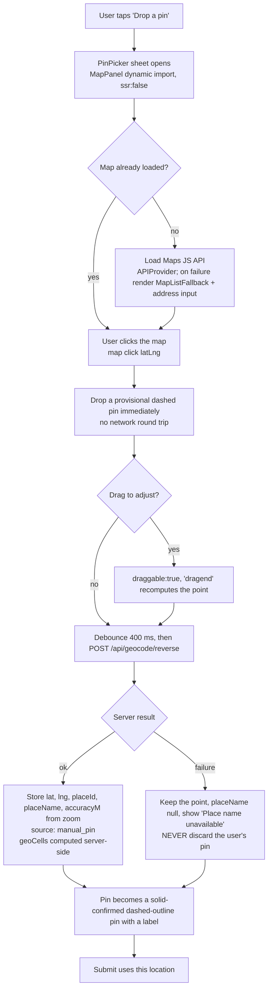
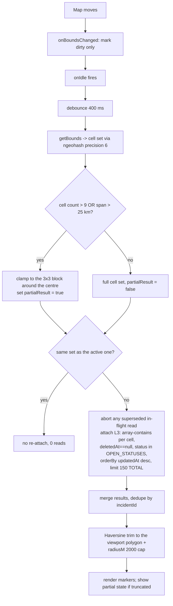
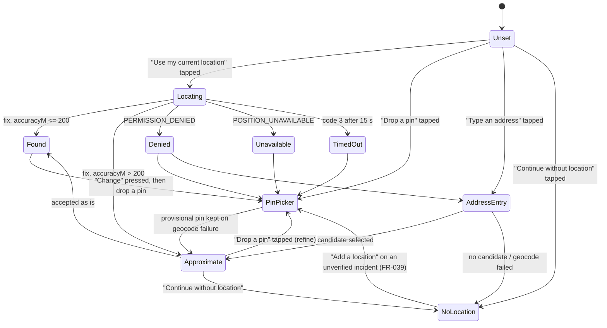

# 12 — Map & Location System

**Project:** CareGrid AI
**Document type:** Implementation specification for geolocation, geocoding, and map rendering
**Status:** Baseline v1.0 — normative for every location field, threshold, key, and fallback
**Related:** [01 PRD §6.3 / §6.8](./01_PRODUCT_REQUIREMENTS_DOCUMENT.md), [02 Technical Requirements §3.10](./02_TECHNICAL_REQUIREMENTS_DOCUMENT.md), [04 UI/UX §5.30 / §11](./04_UI_UX_DESIGN_SPECIFICATION.md), [07 Database Schema §4.1 / §9.2 / §12.1](./07_DATABASE_SCHEMA.md), [08 API §3.1 / §8](./08_API_SPECIFICATION.md), [21 Environment Variables §2 / §5](./21_ENVIRONMENT_VARIABLES.md)

---

## 0. How to read this document

**Location is the spine of CareGrid AI** (PRD §1.1 principle 4). Duplicate detection, responder matching, dispatch, and risk analytics are all downstream of a trustworthy point. This document therefore spends more words on *not knowing where something is* than on drawing a pin.

Three platform facts govern everything below and are restated wherever they bite:

| Fact | Consequence |
| --- | --- |
| **Firestore has no geospatial queries.** No `near`, no `geoWithin`, no radius, no polygon containment | Every "incidents near X" is emulated: geohash-6 `array-contains` on `incidents.geoCells`, then an exact Haversine filter in code. The 500 m semantics are enforced by *our* function, not by the database ([07](./07_DATABASE_SCHEMA.md) §9.1) |
| **Browser geolocation requires a secure context** | HTTPS everywhere except `localhost`. On plain HTTP `navigator.geolocation` is simply absent, which is a **different** error from permission denial and needs different copy |
| **Google Maps JavaScript API bills per map load** and requires an enabled billing account | This is the single largest cost risk in the project ([21](./21_ENVIRONMENT_VARIABLES.md) §5). Both keys are restricted, a budget alert is mandatory, and a list fallback is mandatory (FR-085) |

Conventions: `gps | manual_pin | address_text | none` are the only `geo.source` values ([07](./07_DATABASE_SCHEMA.md) §4.1). `geoCells` is always **exactly 10** geohash-6 strings. All coordinates are `{ lat, lng }` numbers; `GeoPoint` never crosses the client boundary.

---

## 1. Scope

| In scope | Out of scope (v1) |
| --- | --- |
| Device GPS acquisition via the browser `Geolocation` API, on explicit user action only | Continuous background geolocation (no web background geolocation in v1) |
| Manual pin drop and drag-to-adjust on a map | Drawing custom polygons, geofences, or "safe corridor" overlays |
| Server-side reverse geocoding to a coarse `placeName` | Storing the reporter's street address without them typing it (FR-035) |
| Forward geocoding / place search for dispatchers and for a citizen's fallback path | Address autocomplete databases, address validation/verification badges |
| Live incident + responder markers, viewport queries, the 500 m duplicate ring | Turn-by-turn navigation (responders get an **Open in maps** deep link) |
| Map failure → list fallback (FR-085) | Offline vector tiles |
| Accuracy grading, anti-spoofing heuristics, retention (NFR-028) | Device fingerprinting, carrier geolocation, Wi-Fi positioning |

---

## 2. The four location sources and accuracy grading

### 2.1 The sources

| `geo.source` | How it is obtained | `accuracyM` | `geo` present? | Trust on arrival | What a dispatcher is told |
| --- | --- | ---: | :-: | --- | --- |
| `gps` | `navigator.geolocation.getCurrentPosition` (or `watchPosition`, §3.6) | from the browser fix | yes | Graded by accuracy | Accuracy ring + `accuracyGrade` badge |
| `manual_pin` | Map click, optionally dragged, then server-side reverse geocode (§4) | the operator's declaration, stored as `accuracyM` = the map zoom-derived radius, min 30 m | yes | **A human decision, therefore better than a bad fix** — but still a human decision | **Dashed** pin + `Approximate ±{accuracyM} m`. A dashed pin is a promise the dispatcher is looking at an approximation |
| `address_text` | The reporter typed an address (3–200 chars) → server-side geocode to a point | the geocoder's granularity, min 200 m (typically `locality`-level) | yes, when geocoding succeeds | Lowest of the three. The coordinates are a *geocoder's opinion* about a string | "Located near {placeName}" + accuracy ring. The typed text is in `locationText` |
| `none` | The user chose **Continue without location**, or geocoding of a typed address failed | — | **`geo == null`**, `geoCells` **absent** | None | `LOCATION UNKNOWN` flag in every dispatcher view, and it **sorts above** `low`-accuracy incidents (FR-034) |

### 2.2 `accuracyGrade` — the exact thresholds (FR-032)

```ts
// lib/geo/accuracy.ts — pure, unit-tested, no Firestore import
export type AccuracyGrade = 'high' | 'medium' | 'low' | 'unknown';

export function gradeAccuracy(accuracyM: number | null | undefined): AccuracyGrade {
  if (accuracyM == null || !Number.isFinite(accuracyM)) return 'unknown';
  if (accuracyM <= 50)   return 'high';      // FR-032: high ≤ 50 m
  if (accuracyM <= 200)  return 'medium';    // FR-032: medium ≤ 200 m
  if (accuracyM <= 1000) return 'low';       // FR-032: low ≤ 1000 m
  return 'unknown';                          // > 1000 m ⇒ unknown
}
```

| Grade | `accuracyM` | Marker treatment | Required copy | Where it is surfaced |
| --- | --- | --- | --- | --- |
| `high` | ≤ 50 m | Solid shape, thin accuracy ring (the ring is barely visible — correct) | — | Queue `accuracyGrade` column, incident detail, map detail panel |
| `medium` | ≤ 200 m | Solid shape, visible accuracy ring | — | As above |
| `low` | ≤ 1000 m | Solid shape, accuracy ring drawn at true scale, dashed halo | **"Location is approximate"** + "Your device put you within about {accuracyM} m of this point. Drop a pin to make it more precise, or continue as it is." ([04](./04_UI_UX_DESIGN_SPECIFICATION.md) §14) | Report form, queue row, map panel |
| `unknown` | > 1000 m, or `geo == null` | `geo == null` → **hatched square**, `LOCATION UNKNOWN` ([04](./04_UI_UX_DESIGN_SPECIFICATION.md) §11.1) | "Location is approximate" for a large `accuracyM`; `LOCATION UNKNOWN` for a null `geo` | Every dispatcher view, and it sorts above `low` (FR-034) |

**Three honest notes on grading:**

1. `accuracyM` from the browser is a **68 % confidence radius**, not an error bound. On a device in a street canyon it can be 30 m and the true error can be 200 m. Grading is a communication device, not a measurement claim. The UI copy says "within about N m", never "accurate to N m".
2. `accuracyM` is **client-declared** for `gps` and is therefore attacker-controlled. §13 handles this honestly: we grade it, we flag anomalies, and we do not reject the fix.
3. `manual_pin` sets `accuracyM` to the *map-declared* radius. A dispatcher dropping a pin at zoom 15 has asserted ±30 m; a citizen dropping one at zoom 3 has asserted something much weaker, and the ring says so.

### 2.3 The stored shape

```ts
type GeoJson = {
  lat: number | null;
  lng: number | null;
  accuracyM: number | null;
  accuracyGrade: AccuracyGrade;      // always present, even when geo is null
  source: 'gps' | 'manual_pin' | 'address_text' | 'none';
  placeName: string | null;          // coarse, reverse-geocoded or geocoded
};
// incidents.geoCells: string[] | absent   — exactly 10 geohash-6, server-computed only (FR-036)
```

| Rule | Detail |
| --- | --- |
| GEO-1 | `geo.accuracyGrade` and `geo.source` are **required** on every incident, including when `geo` is null ([07](./07_DATABASE_SCHEMA.md) §4.1 marks them ✔) |
| GEO-2 | `geoCells` is **absent** (not `[]`, not `[null]`) when `geo` is null. An empty array is a lie that a query can match |
| GEO-3 | `geoCells` is computed **server-side only** (FR-036). A client-supplied `geoCells` is rejected by the Zod schema (`.strict()`, `keys().hasOnly([...])`) |
| GEO-4 | Changing `location` via `PATCH /api/incidents/:id` **recomputes `geoCells`, `accuracyGrade`, and re-runs duplicate detection** server-side ([08](./08_API_SPECIFICATION.md) §3.4). A stale `geoCells` is a silent duplicate-detection failure |
| GEO-5 | Coordinates are held in component state and submitted once. They are **never** written to `localStorage` ([05](./05_FRONTEND_ARCHITECTURE.md) §6.10 rule 5) |

---

## 3. Browser geolocation

### 3.1 The exact API contract

```ts
// hooks/useGeolocation.ts — signature fixed by [05](./05_FRONTEND_ARCHITECTURE.md) §6.10
export function useGeolocation(options?: { timeoutMs?: number; maxAgeMs?: number }): Geolocation;

const GET_CURRENT_POSITION_OPTIONS: PositionOptions = {
  enableHighAccuracy: true,
  timeout: 15_000,       // 15 s. Beyond this the user has already decided they are not going to answer the prompt
  maximumAge: 30_000,    // 30 s. A fix from the last 30 s is good enough and avoids waking the GPS chip
};
```

| Option | Value | Why exactly this value |
| --- | --- | --- |
| `enableHighAccuracy` | `true` | For an emergency we want the best fix the device can give. The cost is a slower fix and more battery. For a **one-shot citizen fix** that is acceptable; for a **responder heartbeat** the value is reused unchanged (the heartbeat is once per 60 s, §3.6) |
| `timeout` | `15_000` ms | The browser prompt itself blocks user interaction for as long as the user takes. 15 s is the longest we are willing to show a spinner on a phone in an emergency. Past that the user has almost certainly dismissed it |
| `maximumAge` | `30_000` ms | Accepts a fix up to 30 s old. This is a **deliberate** battery/accuracy trade: a fix is not perishable over 30 s in a way that matters for finding a car crash |

**`GeolocationCoordinates` handling:**

```ts
function toGeoFix(pos: GeolocationPosition): GeoFix {
  const accuracyM = Math.max(0, Math.round(pos.coords.accuracy));
  return {
    lat: clamp(pos.coords.latitude,  -90, 90),
    lng: clamp(pos.coords.longitude, -180, 180),
    accuracyM,
    accuracyGrade: gradeAccuracy(accuracyM),   // §2.2
    capturedAt: pos.timestamp,
  };
}
```

| Field | Used | Deliberately dropped |
| --- | --- | --- |
| `coords.latitude` / `coords.longitude` | ✔ rounded to 6 dp (≈ 11 cm, far below any accuracy claim) | — |
| `coords.accuracy` | ✔ | — |
| `coords.altitude` | — | The product is 2D. Altitude is not rendered, stored, or sent |
| `coords.altitudeAccuracy` | — | — |
| `coords.heading` | — for citizens. **Used for responders** → `responderLocations.headingDeg` | — |
| `coords.speed` | — for citizens. **Used for responders** → `responderLocations.speedMps` | — |
| `timestamp` | ✔ `capturedAt` | — |

`responderLocations.headingDeg`/`speedMps` are `number | null` in [07](./07_DATABASE_SCHEMA.md) §7.2 — a browser that does not provide them stores `null`, not `0`.

### 3.2 Permission states

`navigator.permissions.query({ name: 'geolocation' })` is used **only to render the button in the right state before the user presses it.** It never triggers a prompt.

| `PermissionState` | What the user sees on the "Use my current location" button | What pressing it does |
| --- | --- | --- |
| `prompt` (also the state when the API is unavailable or the query fails) | Normal `secondary` button, label **"Use my current location"**, with the pre-permission explainer directly above it | The browser prompt appears. Success → fix; `denied` result → §12 |
| `granted` | Same button, plus a small `Check` and the line "Location access is on" | The prompt is **not** shown by the browser; the fix resolves immediately |
| `denied` | Button becomes `secondary` with a `Ban` icon, label **"Location access is off"**, and it is **still clickable** — it opens the fallback panel (§12) rather than doing nothing | Never calls `getCurrentPosition` again, because a denied permission re-prompt is suppressed by the browser and the call would just return `PERMISSION_DENIED` |
| `unavailable` / `unsupported` | Button replaced by the text "This browser cannot share your location." plus **Drop a pin** / **Type an address** / **Continue without location** | Nothing to press |

| Code | Detail |
| --- | --- |
| GEO-6 | The `Permissions API` query for geolocation is **best effort**. It is not available in Safari < 15.4 and returns `undefined` in some embedded webviews. `undefined` is treated as `prompt` |
| GEO-7 | A `denied` state is **per-origin, permanent-ish** in Chrome until the user re-enables it in site settings. The copy must therefore offer a route forward that does not depend on the browser prompt (the pin) |

### 3.3 Explicit activation (FR-030)

> **The client MUST request geolocation only after an explicit user action or a clear pre-permission explainer; it MUST NOT auto-prompt on page load.**

```tsx
// features/reporting/components/location-panel.tsx  — the only place getCurrentPosition is reachable
<Button onClick={() => void request()}>            {/* ← the ONLY call site of request() */}
  <LocateFixed aria-hidden /> Use my current location
</Button>
```

| # | Rule |
| --- | --- |
| GEO-8 | `request()` is called **only** from a `click` / `pointerup` handler. Never from `useEffect`, never from a layout effect, never on mount, never on route change, never from a "resume where you left off" draft restore |
| GEO-9 | There is **no** code path in the codebase that calls `getCurrentPosition` outside `useGeolocation.request`. A lint rule (`geolocation/requires-user-gesture`) rejects any `getCurrentPosition` / `watchPosition` call whose receiver is not `useGeolocation` |
| GEO-10 | Draft restore (`cg.draft.report`, FR-014) **never** restores a location and never re-requests one. A restored draft shows "Location not set" |
| GEO-11 | "Centre on me" on `/map` is an explicit button press and uses the same `request()`. It is the only geolocation call outside `/report` and `/responders` |
| GEO-12 | A responder's `watchPosition` (§3.6) starts **only** when the responder's status is set to `available` **by that responder's own tap** — i.e. inside the same user gesture chain as the status toggle |

### 3.4 The pre-permission explainer copy

Rendered immediately above the button, always visible the first time the location panel appears on a page, on every role:

| Key | Title | Body | Primary action |
| --- | --- | --- | --- |
| `location.prompt` | **Location** | "Add your location so responders can find this. You can also drop a pin or skip this." | `Use my current location` |
| `location.denied` | **Location access is off** | "Your report is still fine. To add a location, allow location access in your browser settings, or drop a pin on the map." | `Drop a pin` |
| `location.approximate` | **Location is approximate** | "Your device put you within about {accuracyM} m of this point. Drop a pin to make it more precise, or continue as it is." | `Drop a pin` |
| `location.insecure` | **Location needs a secure connection** | "This page is not on HTTPS, so your browser will not share a location. You can drop a pin instead." | `Drop a pin` |
| `location.unsupported` | **This browser cannot share your location** | "Drop a pin on the map, type an address, or continue without a location." | `Drop a pin` |
| `location.locating` | — | "Finding your location…" with `aria-busy="true"` and `aria-live="polite"` | button disabled, **label unchanged** |
| `location.found` | — | "Location found · accurate to about {accuracyM} m" when `high`/`medium`; the `approximate` copy when `low`/`unknown` | `Change` · `Remove` |

**Privacy line, on the report form, below the location panel, always visible** (US-042 AC1):

> "Dispatchers and the assigned responder can see this report. Responders cannot see your name."

### 3.5 Why an auto-prompt on load is forbidden

| Reason | Detail |
| --- | --- |
| **It is a requirement, not a preference** | FR-030, verified by TC-FR-030 |
| **It is a hostile pattern** | A permission prompt on page load is a request the user cannot contextualise. A person landing on `/report` during an emergency does not know what CareGrid is yet, and a browser dialog asking for their position is the fastest way to lose them |
| **It poisons the permission decision** | Chrome shows "blocked" as a decision the user may have made by accident. Once blocked, the fix for the rest of the origin's life is a settings page. We would be spending a permanent capability on a 2-second page load |
| **It hurts the metric that matters** | NFR-002 requires `/report` to be interactive in ≤ 3.0 s on a mid-range Android. A blocking geolocation prompt is a modal interaction before the user has read the form |
| **It is a trust violation of our own copy** | We tell a citizen "Responders cannot see your name" and then immediately ask for their location before they have read that line |

### 3.6 One-shot vs `watchPosition`

| Caller | Mechanism | Cadence | Rationale |
| --- | --- | --- | --- |
| Citizen on `/report` | `getCurrentPosition` | once, on button press | A single fix is all the report needs. Continuous tracking of a member of the public in distress is not a product requirement and would be indefensible privacy-wise |
| Citizen on `/track` | **none** | — | Never asked for |
| Dispatcher/admin "Centre on me" | `getCurrentPosition` | once, on button press | Centring is a convenience, not a feature |
| Responder on duty (`status == 'available'` or `'busy'`) | `watchPosition` with the same `PositionOptions`, stopped when the status leaves those values | the browser decides; the app **persists** on the `RESPONDER_HEARTBEAT_SEC` = 60 s cadence | FR-066 |
| Responder `offline` | **stopped** | — | FR-066: "MUST NOT be tracked when the responder is `offline`" |

```ts
// features/responders/hooks/useLocationHeartbeat.ts
export function useLocationHeartbeat(opts: { status: 'available' | 'busy' | 'offline' }) {
  const watchId = useRef<number | null>(null);
  const lastSentAt = useRef(0);

  useEffect(() => {
    if (opts.status === 'offline') { stopWatch(); return; }   // FR-066
    startWatch();                                                 // inside the gesture chain (GEO-12)
    return stopWatch;
  }, [opts.status]);

  function onFix(pos: GeolocationPosition) {
    const now = Date.now();
    if (now - lastSentAt.current < RESPONDER_HEARTBEAT_SEC * 1000) return;  // 60 s
    lastSentAt.current = now;
    void api.updateResponderLocation({ ...toGeoFix(pos), status: opts.status, capturedAt: new Date(now).toISOString() });
  }
}
```

| Rule | Detail |
| --- | --- |
| GEO-13 | The heartbeat is a **cadence filter on top of `watchPosition`**, not a `setInterval` position request. `watchPosition` streams; we persist at most once per `RESPONDER_HEARTBEAT_SEC`. This is what makes FR-066 "battery-friendly" real |
| GEO-14 | On reconnect, **one** immediate heartbeat is sent and the cadence resumes. **No backlog** is written — a trail of positions the responder never actually reported would be fabricated data |
| GEO-15 | The server rejects a heartbeat whose `capturedAt` is less than 20 s after the stored one with `429 HEARTBEAT_TOO_FREQUENT` ([08](./08_API_SPECIFICATION.md) §4.4). The client backs off to 60 s on that response |
| GEO-16 | The heartbeat is a **client write to the responder's own `responderLocations/{uid}`** or an authenticated `PATCH /api/responders/:id/location`. Only the fields in the rules' allow-list may change, and only for self ([22](./22_USER_ROLES_PERMISSIONS.md) §7) |

---

## 4. Manual pin drop

The pin is the most important location control in the product: it is the only one that works with permission denied, with no GPS, and on a desktop.

### 4.1 The flow



### 4.2 Step by step

| Step | Behaviour | Field effect |
| --- | --- | --- |
| 1. **Open** | A `Sheet` containing the map, centred on `navigator`-provided centre or `GOOGLE_MAPS_DEFAULT_CENTER` (`17.4478,78.4874`) when unknown, zoom 15 | — |
| 2. **Click** | A **provisional dashed pin** is dropped instantly. No network call, no spinner, no disabled state. Dragging is enabled immediately | Client state only |
| 3. **Drag** | `draggable: true`. On `dragend` the provisional pin is re-placed and step 4 re-runs. The pin is *always* draggable until the sheet closes — a citizen must be able to fix an imprecise tap | — |
| 4. **Reverse geocode** | Debounced 400 ms after the last interaction, `POST /api/geocode/reverse` (see §5) with `{ lat, lng }` | Server returns `{ placeId, placeName, locality, sublocality, granularity }` |
| 5. **Store** | On success: `placeId` → `incidents.placeId`, `placeName` → `incidents.placeName`, `accuracyM` derived from the current zoom (below), `source: 'manual_pin'` | `geoCells` computed server-side in the create/update transaction (FR-036) |
| 6. **Failure** | The point is **kept**. `placeName` stays `null`, the UI shows a `neutral` note "Place name unavailable — the pin position is still exact", and the flow continues. A geocoder outage must never cost a citizen their pin | `placeId`, `placeName` null |
| 7. **Confirm** | The sheet shows the pin, `placeName` (or "Pinned location"), an accuracy estimate, and a `Use this location` primary. `Remove` returns to the form with no location | — |

`accuracyM` from a manual pin, derived from the Maps zoom level at the moment of the click:

| Zoom | Declared `accuracyM` | Rationale |
| ---: | ---: | --- |
| ≥ 17 | 30 | ~1.5 m/px at the equator — a person can identify a doorway |
| 15–16 | 75 | ~6 m/px — a building |
| 13–14 | 200 | ~24 m/px — a street segment |
| ≤ 12 | 500 | ~100 m/px — a block; the user is pointing at a neighbourhood |

Clamped to `[30, 500]`. The value is a **declaration**, and the UI says "Approximate ±{accuracyM} m" regardless of the value.

### 4.3 Dashed vs solid: the honesty rule

> **A dispatcher must never be misled about how precise a location is.** Anti-pattern A5 in [04](./04_UI_UX_DESIGN_SPECIFICATION.md) §1: "A map pin on 'the exact spot' when accuracy is 800 m".

| Location kind | Pin outline | Accuracy ring | Label |
| --- | --- | --- | --- |
| `gps`, `high` (≤ 50 m) | **Solid** 1.5 px | Thin ring at true `accuracyM` (usually invisible) | — |
| `gps`, `medium` (≤ 200 m) | **Solid** 1.5 px | Ring at true `accuracyM` | — |
| `gps`, `low` (≤ 1000 m) | **Solid** 1.5 px + **dashed halo** at 1 px | Ring at true `accuracyM` | "Location is approximate" |
| `manual_pin` (any grade) | **Dashed** 2 px, always | Ring at the declared `accuracyM` | "Approximate ±{accuracyM} m · dropped by {actorRole}" |
| `address_text` | **Dashed** 2 px, always | Ring at ≥ 200 m | "Located near {placeName} (approximate)" |
| `geo == null` | **Hatched square**, no pin at all | — | `LOCATION UNKNOWN` |

A `manual_pin` is **always dashed** even when the operator was precise. The dash encodes "a human asserted this", not "this is imprecise" — the ring carries the precision. A dispatcher must be able to tell at a glance which incidents have a device fix behind them and which have a human assertion, because the two have different failure modes (a drifting GPS device versus a citizen who cannot find the right doorway).

This is also why dashed borders are reserved for exactly three things in the design system: the `LOCATION UNKNOWN` marker, the 500 m duplicate ring, and imprecise/dropped locations ([04](./04_UI_UX_DESIGN_SPECIFICATION.md) §2.5).

---

## 5. Reverse geocoding (server-side only — FR-035)

### 5.1 The call

```ts
// services/maps/reverseGeocode.ts — server only. Uses GOOGLE_MAPS_SERVER_KEY (IP-restricted).
const url = new URL('https://maps.googleapis.com/maps/api/geocode/json');
url.searchParams.set('latlng', `${lat},${lng}`);
url.searchParams.set('key', env.GOOGLE_MAPS_SERVER_KEY);
url.searchParams.set('components', `country:${GOOGLE_MAPS_REGION}`);   // 'IN' — biases away from same-named places in the neighbouring country
const res = await fetch(url, { signal: AbortSignal.timeout(8_000) });  // 8 s, per [08](./08_API_SPECIFICATION.md) §1.1
```

| Aspect | Value | Why |
| --- | --- | --- |
| Endpoint | Geocoding API `geocode/json` with `latlng` | It is the only Google endpoint that takes coordinates and returns address components. Places API Details is for a `place_id`; Places Nearby Search has a 1 000 m `radius` maximum with degraded accuracy at the edge, which is exactly the "fake precision" we are avoiding |
| Key | `GOOGLE_MAPS_SERVER_KEY` (IP-restricted to Vercel egress + the dev machine) | A browser key is referrer-restricted and would be refused server-side; using the server key from the browser would defeat its IP restriction |
| Timeout | 8 000 ms | [08](./08_API_SPECIFICATION.md) §1.1 |
| `components` | `country:<GOOGLE_MAPS_REGION>` | A pin near a border in a country with duplicate place names otherwise returns a plausible-looking address in the wrong country |
| `language` | Not sent for reverse geocoding | `placeName` is stored in the local language; the UI shows it as-is. Forward geocoding sends `language=en` so the dispatcher's search box matches typed input |
| Retries | 0 | A reverse geocode failure is a degraded `placeName`, never a failed report (§4.2 step 6). Retrying adds latency to the report path for a cosmetic field |

### 5.2 What is extracted, and what is discarded

```ts
type ReverseGeocodeResult = {
  placeId: string | null;      // → incidents.placeId
  placeName: string | null;    // → incidents.placeName   (coarse, ≤ 90 chars)
  locality: string | null;     // → NOT stored; folded into placeName
  sublocality: string | null;  // → NOT stored; folded into placeName
  formattedAddress: string | null;  // ⚠ COMPUTED AND DISCARDED — see below
  streetNumber: string | null;      // ⚠ COMPUTED AND DISCARDED
  route: string | null;             // ⚠ COMPUTED AND DISCARDED
  granularity: 'street' | 'route' | 'locality' | 'sublocality' | 'area' | 'unknown';
};
```

| Component | Stored? | Why |
| --- | :-: | --- |
| `sublocality` → `placeName` prefix | ✔ | "Koramangala 5th Block" is the right granularity for a dispatcher |
| `locality` / `postal_town` | ✔ (folded into `placeName`) | "Service Road, near Secunderabad Metro Gate 1" is the shape in [07](./07_DATABASE_SCHEMA.md) §4.6 |
| `area` / `administrative_area_level_1` | ✔ (fallback when nothing better) | A city name is far better than nothing |
| `route` (street name) | ✖ **discarded** | FR-035: we MUST NOT persist the reporter's street-level address unless the reporter supplied it as text |
| `street_number` | ✖ **discarded** | Same |
| `formatted_address` | ✖ **discarded** | Same — it is the concatenation of the two above |
| `postal_code` | ✖ **discarded** | Postal codes are strong quasi-identifiers in a dense city |
| `geometry.bounds` | ✖ discarded | The query point is authoritative |
| `place_id` | ✔ | Used for the "Open in maps" deep link and for re-geocoding a `placeName` the operator typed later |

**Where `locationText` comes from.** `incidents.locationText` is set **only** when the reporter typed the address themselves (FR-035, [07](./07_DATABASE_SCHEMA.md) §4.1) or when a dispatcher typed one deliberately. A reverse-geocoded `placeName` is a *map label*, not a person-supplied address, and it lives in a different field with a different visibility rule (`locationText` is never shown to responders — [22](./22_USER_ROLES_PERMISSIONS.md) §4.1).

**What goes to Gemini.** The AI receives `location_hint`: free text, ≤ 120 chars, always prefixed "approximate" in the UI ([09](./09_AI_GEMINI_SPECIFICATION.md) §1.2). It is derived from `placeName`, **never** from `formatted_address`, `route`, or `locationText`. The AI has no coordinates output field at all.

### 5.3 Rate limits and the local guard

| Constraint | Value | Source |
| --- | --- | --- |
| Google's documented Geocoding throughput | 50 requests/second per project (per-minute quotas also apply) | Google Cloud documentation. **Quotas change** — verify in the console before the demo; a wrong number here is worse than checking |
| Our local guard | **30 requests/minute per function instance** | Chosen well below the platform limit to preserve headroom, mirroring the pattern of `GEMINI_RPM_LIMIT` ([21](./21_ENVIRONMENT_VARIABLES.md) §2) |
| Timeout | 8 s | — |
| Client-side throttle | One reverse geocode per pin interaction, debounced 400 ms, and one per report submission at most | §4.2 |
| Caching | §5.4 | — |

> **`DECISION REQUIRED` (MAP-DR-1).** The local guard needs a named variable so it can be tuned without a code change: `GEOCODING_RPM_LOCAL` (default `30`). It does not exist in [21](./21_ENVIRONMENT_VARIABLES.md) today, and this document does not invent environment variables. **Recommendation: add it.** Decision owner: backend, before phase 3.

### 5.4 Caching by a hashed coordinate grid

Reverse geocoding the same intersection 200 times in a demo day is waste, and it is the fastest way to burn a Google quota.

```ts
// lib/geo/cacheKey.ts — pure
/** 4 decimal places ≈ 11 m at the equator. Coarser than any accuracy we grade,
 *  fine enough that two people on the same pavement share a cache entry. */
export function geocodeCacheKey(lat: number, lng: number): string {
  return `g:${roundTo(lat, 4)}:${roundTo(lng, 4)}`;   // e.g. "g:17.4478:78.4874"
}

/** For Firestore-backed caching the key must not be a coordinate string. */
export function geocodeCacheDocId(lat: number, lng: number): string {
  return sha256(`cg:geo:v1:${geocodeCacheKey(lat, lng)}`);   // 64 hex chars, opaque
}
```

| Layer | Scope | Size | Honest note |
| --- | --- | ---: | --- |
| **Per-request memo** | One serverless invocation | ≤ 32 entries | Always safe. Two `POST /api/incidents` in the same invocation are impossible (one request = one invocation), so in practice this catches *within-request* repeats such as create + a duplicate-candidate re-check |
| **In-process LRU** | One warm function instance | 64 entries, 10 min TTL | Genuinely useful on Vercel only while an instance is warm. It is **not** a guarantee and is not relied upon for correctness or quota |
| **Firestore-backed cache** | Cross-instance, durable | `geocodeCache/{sha256}` | **`DECISION REQUIRED` (MAP-DR-2).** This collection does **not** exist in [07](./07_DATABASE_SCHEMA.md) §1. Adding it means amending the schema document (fields, retention, rules, TTL) before implementing. **Recommendation: do not add it in v1.** A reverse geocode costs one Google request and one cached client read; the win is small and the schema churn is not free |

**The one thing that is not negotiable:** a cache hit must return the **same** `placeName` as the original call, including `null` results, and negative results must be cached for a **shorter** TTL (60 s) so a transient Google outage does not poison a coordinate for hours.

### 5.5 Google Geocoding is not always right — the honest note

| Failure mode | What it looks like | What we do about it |
| --- | --- | --- |
| **Informal settlements and unnamed lanes** | In a dense low-income area with no official street names, Google returns the nearest *named* entity, which may be 400 m away on a different road | The pin the user dropped is **authoritative**; `placeName` is a label. The UI shows the label as "Near {placeName}", never "At {placeName}". The `accuracyM` ring is drawn at the declared radius regardless of the geocoder's confidence |
| **Numbered / lettered addressing** | "Plot 42, Block C" may geocode to the middle of the block | The user can drag the pin; the address text they type (if any) is stored verbatim in `locationText` and shown to dispatchers alongside the pin |
| **Duplicate place names across the city** | "Secunderabad" exists in more than one district | `components=country:IN` plus the local guard; the `placeName` shown always includes the `sublocality` when Google returns one |
| **Newly built areas** | Google has no record; returns the centroid of a large locality | Grade is forced to at most `medium`; the report still creates; the dispatcher sees a wide accuracy ring |
| **Language / transliteration** | The same place has several names | `placeName` is stored in the language Google returns. The dispatcher's search box sends `language=en` so typed input matches. Mismatch is a known, accepted limitation |
| **Deliberate misrepresentation** | A report pinned on the metro gate rather than the incident | Anti-spoofing heuristics (§13) flag *device* anomalies. A human deliberately mis-pinning is not detectable and is handled by the **verification step**: a dispatcher sees the pin, the reporter's text, and any `placeName` mismatch, and asks. This is a human process, not a technical control |

> The general principle: **we never treat a geocoder's answer as a fact about the world.** We treat it as a label attached to a coordinate the human chose.

---

## 6. Forward geocoding and place search

Used by: the dispatcher's `/map` search box, the citizen's "Type an address" fallback (which needs **geocoding**, not autocomplete, because the citizen is typing an address to submit, not choosing a suggestion).

### 6.1 Places Autocomplete (dispatcher search)

```ts
// components/map/place-search.tsx  (inside APIProvider's libraries)
<Autocomplete
  inputValue={q}
  onInputChanged={(v) => setQ(v)}                       // debounced 300 ms (FR-087)
  onPlaceChanged={(p) => panTo(p.geometry.location)}
  libraries={['places']}
  fields={['places.id','places.name','places.formatted_address','places.geometry.location']}
  minLength={3}
/>
```

| Rule | Detail |
| --- | --- |
| GEO-17 | `onInputChanged` fires on every keystroke. The debounce is applied in **our** `useDebounce(q, 300)` before the value is used, and the Autocomplete widget is only re-keyed after the debounce, so no request is made per keystroke. This is the FR-087 requirement ([08](./08_API_SPECIFICATION.md) has no geocode endpoint on the client; the widget calls Google directly under the browser key) |
| GEO-18 | `minLength={3}`. Below 3 characters the prediction quality is poor and the cost is real |
| GEO-19 | `sessionToken` — one token per Autocomplete session, generated on open, passed to `getPlaceDetails` on selection, then **discarded**. A new session on the next open. Without this, a selection is billed as an unpriced call; with it, the pair is billed once ([21](./21_ENVIRONMENT_VARIABLES.md) §5 lists Places on both keys) |
| GEO-20 | `componentRestrictions={{ country: GOOGLE_MAPS_REGION }}` where a public value exists, so a dispatcher typing "Main Street" gets local results. `GOOGLE_MAPS_REGION` is a **server** variable, so the public equivalent is read from `GET /api/config`'s client-safe subset, or the map defaults to the viewport |
| GEO-21 | `locationBias` from the device location **only if the user has already granted it**. The bias is `circle: { center: userFix, radius: 50_000 }`. Never a `locationBias` derived from a location we have not been given |
| GEO-22 | `fields` is an explicit allow-list. `Autocomplete` returns `id`, `name`, `formatted_address`, `geometry.location`, `types`. We do not log or store `formatted_address` from a search |
| GEO-23 | **Keyboard-only operation is a first-class requirement.** The Autocomplete widget is a combobox: `↓`/`↑` move the active option, `Enter` selects, `Esc` closes the list and returns focus to the input, `Tab` moves out. The listbox is `role="listbox"` with `aria-activedescendant`. The widget's own DOM is **not** our DOM, so the accessible name is set by an associated `<label>` "Search for a place" and the whole control is wrapped in a `<SearchInput>`-styled container that we do control |
| GEO-24 | Selecting a place **centres the map**; it does not add a marker and does not write anything. Place search is a navigation aid on `/map` |
| GEO-25 | If the browser key is unavailable (quota, referrer failure), the search box falls back to **server-side geocoding** through `POST /api/geocode/forward` (server key), debounced 300 ms, `limit ≤ 5`, results in the same combobox. Same UI, different payer |

### 6.2 Citizen "Type an address"

A different interaction, not a combobox:

| Step | Behaviour |
| --- | --- |
| 1 | A labelled `Input` "Describe where this is" with `maxLength={200}`, 3-character minimum validation, and helper text "A street, a landmark, or a bus stop is enough." |
| 2 | On submit: `POST /api/geocode/forward` `{ text }` with the server key. Returns up to 5 candidates with `placeId`, `label`, `lat`, `lng`, `granularity` |
| 3 | The citizen picks one, or types more. **No map is required** — a candidate list is sufficient and is the accessible path |
| 4 | On selection: `source = 'address_text'`, `locationText = the text they typed` (verbatim, **this is the only way `locationText` is ever set by a citizen**), `geo` = the chosen point, `accuracyM` = 200 (min) or 500 when `granularity` is `locality`/`area` |
| 5 | If geocoding fails or returns nothing: `geo = null`, `source = 'none'`, and the incident still creates. The copy is "We could not place that address, so your report has no map pin. A dispatcher will contact you for details." (US-004 AC4) |

**Why the typed text is stored verbatim and is not treated as an address database entry:** it is the reporter's own words, it is the only street-level location we ever persist (FR-035), and it is **never shown to a responder** ([22](./22_USER_ROLES_PERMISSIONS.md) §4.1).

---

## 7. Map implementation

### 7.1 `APIProvider` configuration

```tsx
// components/map/map-panel.tsx — "use client", imported via next/dynamic ssr:false (FR-086)
import { APIProvider, Map, AdvancedMarker, useMapsLibrary } from '@vis.gl/react-google-maps';

<APIProvider
  apiKey={process.env.NEXT_PUBLIC_GOOGLE_MAPS_API_KEY!}
  language="en"
  region={process.env.NEXT_PUBLIC_MAP_STYLE === 'satellite' ? 'IN' : 'IN'}   // see note
  libraries={['places', 'marker']}
  mapId={process.env.NEXT_PUBLIC_GOOGLE_MAP_ID}          // optional — see §7.2
  gestureHandling="greedy"
  onLoad={() => setMapState('ready')}
  onError={(e) => setMapError(e)}                        // triggers the FR-085 fallback
>
  <Map
    defaultCenter={initialCenter}
    defaultZoom={Number(process.env.NEXT_PUBLIC_MAP_ZOOM_DEFAULT ?? 13)}
    mapId={process.env.NEXT_PUBLIC_GOOGLE_MAP_ID ?? undefined}
    gestureHandling="cooperative"
    disableDefaultUI
    zoomControl={false}
    fullscreenControl={false}
    mapTypeControl={false}
    streetViewControl={false}
    rotateControl={false}
    clickableIcons={false}
    minZoom={3}
    maxZoom={Number(process.env.NEXT_PUBLIC_MAP_ZOOM_MAX ?? 18)}
    reuseMaps
    onIdle={handleIdle}
    onBoundsChanged={handleBoundsChanged}
    onClick={handleMapClick}
    onDblclick={handleMapClick}
    style={{ width: '100%', height: '100%' }}
  />
</APIProvider>
```

| Option | Value | Reason |
| --- | --- | --- |
| `apiKey` | `NEXT_PUBLIC_GOOGLE_MAPS_API_KEY` | The browser key, **referrer-restricted** to `localhost:3000/*` and the deployed domains ([21](./21_ENVIRONMENT_VARIABLES.md) §5). It is public by design and must still be restricted |
| `language` | `"en"` | The UI is English only (FR-004 records the *reporter's* detected language in `incidents.language`; the map labels stay English so the dispatcher's mental model is consistent) |
| `region` | `GOOGLE_MAPS_REGION` value (`IN`) | Biases place search. It is a **server** var, so the map reads the region from `GET /api/config`'s client-safe subset or a `NEXT_PUBLIC_` mirror. **Honest note:** the region only affects *search* bias, never the map tiles |
| `libraries` | `['places', 'marker']` | `places` for Autocomplete (§6.1); `marker` for `AdvancedMarkerElement` (§7.3). The set is exactly these two — each extra library is a larger script |
| `mapId` | `NEXT_PUBLIC_GOOGLE_MAP_ID`, optional | Required for `AdvancedMarkerElement` and for cloud-based styling. The `dark` style from `NEXT_PUBLIC_MAP_STYLE=dark` is a **cloud** style, which also needs a `mapId`. **If `mapId` is absent the map still loads, at the cost of the dark styling and the advanced markers falling back (§7.3).** This is the single most common local setup failure |
| `gestureHandling` | `"cooperative"` on the `Map` | Shows the "Use two fingers to move the map" hint on mobile. This is a **product decision**: a dispatcher panning accidentally on a touchscreen must not lose the viewport |
| `disableDefaultUI` + explicit `zoomControl={false}` etc. | — | We render our own controls (`+`/`−`, Centre on me, Fit to results, Layers, Show list) so they are keyboard-reachable and themable. The default UI is not |
| `maxZoom` | `NEXT_PUBLIC_MAP_ZOOM_MAX` = 18 | Beyond 18 street-level detail stops being useful for this product and the imagery is not better. Street View is a separate, explicit user action |
| `clickableIcons` | `false` | POI icons on the base map are not actionable here and are a click-stealing hazard next to our markers |
| `reuseMaps` | `true` | The SDK reuses the map instance across route changes within `/map` (list ⇄ map toggle), which avoids a re-initialisation cost |
| `minZoom` | 3 | Below that the 9-cell viewport cap (§10) makes no sense |

### 7.2 `mapId`, `NEXT_PUBLIC_MAP_STYLE`, and the dark default

| Item | Value | Note |
| --- | --- | --- |
| `NEXT_PUBLIC_MAP_STYLE` | default **`dark`** ([21](./21_ENVIRONMENT_VARIABLES.md) §2) | The operational default. Dispatchers work in dim rooms and a white map at 3 a.m. is a hazard. `roadmap`, `satellite`, `hybrid` are the alternatives |
| How the style is applied | A **cloud-based map style** referenced by `mapId` | A cloud style requires a Map ID. If no Map ID is configured, `NEXT_PUBLIC_MAP_STYLE` cannot be honoured and the map renders in the default light style |
| Without a Map ID | The map still loads and **still works**. Markers fall back to legacy `Marker` (§7.3), and the 500 m ring and accuracy rings still render as overlays | This is the documented, acceptable degraded state, and it is why the map is not allowed to be load-bearing |

> **`DECISION REQUIRED` (MAP-DR-3).** Is a cloud Map ID created for the demo (`NEXT_PUBLIC_GOOGLE_MAP_ID`), or do we ship without one and accept the light default style? **Recommendation: create one.** The dark style is a named product decision in the design system, `AdvancedMarkerElement` needs it anyway, and it takes five minutes in the console. Decision owner: frontend + whoever owns the Google Cloud project.

### 7.3 Markers: `AdvancedMarkerElement` vs legacy `Marker`

| Aspect | `AdvancedMarkerElement` | Legacy `Marker` (deprecated) |
| --- | --- | --- |
| Requires a `mapId` | **Yes** | No |
| Content | Arbitrary HTML/React content — which is how we draw the octagon/triangle/circle shapes from [04](./04_UI_UX_DESIGN_SPECIFICATION.md) §11.1 | An image or SVG URL |
| Z-order | Automatic collision behaviour and depth ordering | Manual `zIndex` only |
| Accessibility | `gmp-advanced-marker` has ARIA plumbing; the *name* still has to be set by us | Basic |
| Status | Current API | Deprecated; will be removed |
| Library | `libraries={['marker']}` | included in the main script |
| Data binding | `title`/`label` render natively | — |

**Decision: `AdvancedMarkerElement`, with an automatic fallback to legacy `Marker` when no `mapId` is configured.** The fallback is not a second implementation of the visual language; it renders the *same* shapes as data-URI SVGs so the map looks identical without a Map ID. Both paths render from one `MarkerSpec` object:

```ts
type MarkerSpec = {
  id: string;
  kind: 'incident' | 'responder' | 'unknownLocation' | 'riskZone' | 'selectionHalo';
  urgency: Urgency | null;          // → colour + shape
  status: IncidentStatus | null;   // → status ring/icon treatment
  accuracyGrade: AccuracyGrade | null;
  source: GeoSource | null;         // → solid vs dashed (GEO-4 §4.3)
  accuracyM: number | null;
  selected: boolean;
  zIndex: number;                   // computed by zOrder() below
  label?: string;                   // never rendered inside the marker (04: no text in SVG markers)
};
```

### 7.4 Viewport detection: `onIdle` and `onBoundsChanged`

| Event | Fires | What we do |
| --- | --- | --- |
| `onBoundsChanged` | On every pan/zoom frame, many times per second | **Never query here.** Used only to set a `viewportDirty` ref so `onIdle` knows there is work to do |
| `onIdle` | When the map stops moving, the tiles settle, and no gesture is in progress | The **only** place a viewport query is triggered: debounce 400 ms, compute cells, compare to the active cell set, and re-attach L3 only if the set changed |
| `onLoad` | Once | Set `isReady`, enable the controls, run the first viewport query |
| `onZoomChanged` | On zoom | Mark dirty only |

```ts
const handleBoundsChanged = useCallback(() => { viewportDirty.current = true; }, []);
const handleIdle = useDebouncedCallback(() => {
  if (!viewportDirty.current || !map) return;
  viewportDirty.current = false;
  const cells = viewportCells(map, { maxCells: 9, maxSpanKm: 25 });   // §10
  if (sameSet(cells, activeCells.current)) return;                    // no re-attach, no reads
  setActiveCells(cells);                                              // L3 re-subscribes
}, 400);
```

| Rule | Detail |
| --- | --- |
| GEO-26 | `onIdle` is debounced ≥ 400 ms ([26](./26_PERFORMANCE_REQUIREMENTS.md) §5.4 M-1). A 150 ms debounce on a trackpad pan would fire a 150-read attach per gesture |
| GEO-27 | If the cell set is unchanged, **nothing is re-attached and no read is spent**. Re-attaching an identical query is pure waste |
| GEO-28 | The map is **never** auto-panned or auto-zoomed on a realtime marker change ([04](./04_UI_UX_DESIGN_SPECIFICATION.md) §5.30). "Zoom to incident" is an explicit button |
| GEO-29 | `onClick` on the map is the pin-drop affordance **only in pin mode**. Outside pin mode, a map click that is not on a marker is a no-op, so a dispatcher can click the map without accidentally starting a pin |

### 7.5 `mapRef` and imperative control

```ts
// features/map/hooks/useMapInstance.ts — signature fixed by [05](./05_FRONTEND_ARCHITECTURE.md) §6.11
export function useMapInstance(options?: { initialCenter?: LatLng; zoom?: number }): MapInstance;
```

| Member | Purpose | Trigger |
| --- | --- | --- |
| `mapRef` | The `RefObject<HTMLDivElement>` handed to `Map` | Always |
| `map` | The `google.maps.Map` instance | After `onLoad` |
| `isReady` | Gate for controls | After `onLoad` |
| `loadError` | Non-null ⇒ render `MapListFallback` (FR-085) | `onError`, or a `gmp/auth` failure |
| `fitResults(bounds)` | Fit the viewport to the current result set | Button "Fit to results" |
| `panTo(lat, lng)` | Centre | "Centre on incident", "Open in maps" |
| `zoomTo(z)` | Zoom | `+` / `−` |
| `requestRecenter(intent)` | `'user' \| 'results' \| 'incident'` | Explicit user action only |
| `recenterIntent` | `'none'` unless a recenter was requested | — |

**`mapRef` is the only sanctioned way to reach the map from outside the `MapPanel` subtree.** A `context` or a ref-callback registered in a provider — never a module-level singleton, because a module-level map instance breaks the second-tab case ([31](./31_CODING_STANDARDS.md) §7.3 forbids module-level mutable state).

---

## 8. Marker visual language

Normative, and matching [04](./04_UI_UX_DESIGN_SPECIFICATION.md) §11.1 exactly. **Colour is never the only channel** (NFR-017): every marker carries a distinct shape, and the legend repeats shape *and* colour in its accessible names.

| Entity | Shape | Fill | Border | Size |
| --- | --- | --- | --- | --- |
| Incident `critical` | Filled **octagon** | `#FF5C5C` (`--color-urgency-critical`) | `#0B0F14` 1.5 px | 14 px |
| Incident `high` | Filled **triangle** | `#FF8A3D` | `#0B0F14` 1.5 px | 15 px |
| Incident `medium` | Filled **circle** | `#F2C744` | `#0B0F14` 1.5 px | 13 px |
| Incident `low` | **Hollow circle** | transparent | `#4C9BF0` 2 px | 13 px |
| Incident with `geo == null` | **Hatched square** | `#8593A6` 12 % | dashed `#8593A6` 2 px | 14 px · label `LOCATION UNKNOWN` |
| Responder `available` | Circle with a 4-point star glyph | `#35B37E` | `#0B0F14` 1.5 px | 16 px |
| Responder `busy` | Circle with a half-fill | `#F2C744` | `#0B0F14` 1.5 px | 16 px |
| Responder `offline` | **Not rendered** (FR-081) | — | — | — |
| Responder, `stale === true` | Circle, desaturated | `#5E7085` | dashed | 16 px · label "Location {n} min old" |
| `riskZones` (P1, flag-gated) | Dashed circle, `radiusM` to scale | `--color-warning` 8 % | dashed 1 px | to scale · label "Risk {score}" |

### 8.1 Size scale and z-order

```ts
// lib/map/markerSpec.ts — pure, unit-tested
const SIZE: Record<Urgency, number> = { critical: 14, high: 15, medium: 13, low: 13 };

/** Lower draws first (further back). Highest-urgency and selected draw last so they
 *  are never occluded by a wall of low-urgency incidents. */
export function zIndex(spec: MarkerSpec): number {
  if (spec.selected) return 1000;
  const urgencyRank = { critical: 40, high: 30, medium: 20, low: 10 }[spec.urgency ?? 'low'];
  const kindRank = spec.kind === 'responder' ? 5 : spec.kind === 'unknownLocation' ? 50 : 0;
  return kindRank + urgencyRank;
}
```

| Layer (back → front) | z | Rationale |
| --- | ---: | --- |
| `riskZones` circles | 0 | Context, never interactive |
| `unknownLocation` markers | 50 | FR-034: a location-unknown incident must be findable on the map, so it draws above located ones |
| Low → critical incident markers | 10 / 20 / 30 / 40 | Urgency is visible by occlusion as well as by shape |
| The 500 m duplicate ring (a `Circle` FBO) | 5 | Behind the incidents it is measuring |
| Accuracy rings (FBO `Circle`s) | 6 | Behind their own marker, above others |
| Responder markers | 45 | Above incidents: a responder is a person, an incident is a place |
| Selection halo | 1000 | Always on top |

| Rule | Detail |
| --- | --- |
| GEO-30 | Marker size does **not** scale with zoom. A 13 px marker at zoom 10 and a 13 px marker at zoom 17 are both legible; a scaling marker becomes a blob at one end and a dot at the other |
| GEO-31 | `Circle` overlays use `google.maps.Circle` (a **FixedBufferObject**, not a `Polygon`), because a 500 m radius in metres is only representable as an FBO at a fixed ground resolution. A `Polygon` in lat/lng would be geometrically wrong at this scale |
| GEO-32 | The 500 m ring's radius comes from `GET /api/config` → `duplicate.radiusM` so an admin change is reflected without a redeploy ([04](./04_UI_UX_DESIGN_SPECIFICATION.md) §11.4). It is labelled "500 m duplicate zone" at the north edge, default on for `dispatcher`/`admin`, off for others, persisted in the URL |

### 8.3 The "duplicate zone" illustration (FR-084)

This is the map's pedagogical job: **showing a dispatcher that one report is one of several, not the only one.**

| Element | Spec |
| --- | --- |
| Shape | `google.maps.Circle`, `center = incident.geo`, `radius = config.duplicate.radiusM` (500) |
| Stroke | dashed, 1 px, `--color-accent` |
| Fill | `--color-accent` at 12 % |
| Label | "500 m duplicate zone" at the north edge, `text-xs`, `--color-text-secondary` |
| Interaction | Clicking the ring sets the queue's `center`/`radiusM` filter, so the list below shows exactly what the ring contains. This is the ring's real purpose |
| Related | When an incident has `duplicateStatus: 'potential_duplicate'` or `confirmed_duplicate`, the **other** incident is drawn as a hollow marker with a connecting `Polyline` to the primary, and the incident detail shows the FR-044 breakdown ("Possible duplicate of CG-XXXXXX (142 m, 3 min earlier, same category)", US-023 AC1) |

---

## 9. Marker clustering

### 9.1 Status: P1, flag-gated, and honestly blocked

FR-082 requires clustering above 20 markers in view and a toggle. It is **P1**, and `config/features.clusters` defaults to `false` ([07](./07_DATABASE_SCHEMA.md) §11.8). Two independent reasons:

1. **No clustering library is in the locked dependency list** ([02](./02_TECHNICAL_REQUIREMENTS_DOCUMENT.md) §3, [05](./05_FRONTEND_ARCHITECTURE.md) §3).
2. **The viewport is capped at 150 markers** ([07](./07_DATABASE_SCHEMA.md) §12.1, FR-037). At 150 markers, a cluster layer is a nice-to-have; below 40 it is actively harmful because it hides the individual emergencies a dispatcher is looking for.

### 9.2 Options, stated honestly

| Option | What it needs | Verdict |
| --- | --- | --- |
| **`@googlemaps/markerclusterer`** | One new dependency, ~20 KB gzip, works with `AdvancedMarkerElement`, has a `MarkerClusterer` with a `SuperClusterAlgorithm` | **The natural choice.** It is Google's own library, it is not deprecated, and it implements FR-082 correctly including the "highest urgency wins the bubble border" requirement we would otherwise hand-roll |
| Hand-rolled grid clustering in `features/map` | No new dependency. Bucket markers into a screen-space grid, emit a bubble per cell, recompute on `onIdle` and on every snapshot | **Acceptable** because the input is a bounded `items[]` of ≤ 150 ([04](./04_UI_UX_DESIGN_SPECIFICATION.md) §16 D6 says exactly this). Costs us a grid algorithm, a bubble component, and its own tests |
| Nothing; render ≤ 150 markers | Zero work | The **v1 default** |

> **`DECISION REQUIRED` (MAP-DR-4).** Which path ships for FR-082?
> **Recommendation: `@googlemaps/markerclusterer`**, added as the single dependency added to the locked list, because it is small, official, and it lets us spend the time on the bubble's urgency-preservation rule (which is the actual product requirement) instead of on a grid algorithm. If the locked list is treated as immutable, ship the hand-rolled grid version against the ≤ 150-item array. **Either way, `config.features.clusters` stays `false` in v1** and the flag gates the UI. Decision owner: frontend lead, before phase 4.

### 9.3 The un-clustered fallback behaviour (what actually ships in v1)

| Aspect | Behaviour |
| --- | --- |
| Hard cap | **150 markers total across all cells.** Not 150 per cell — 150 in total, so a wide viewport costs one 150-read attach, not nine ([26](./26_PERFORMANCE_REQUIREMENTS.md) §5.4 M-2) |
| What happens at 150 | The most urgent 150 by (urgency desc, `updatedAt` desc) are drawn. An inline `Alert` states: **"Showing 150 of more — narrow your filters"** with a `Zoom to fit` action ([04](./04_UI_UX_DESIGN_SPECIFICATION.md) §11.6) |
| Below 768 px | **No clustering even if enabled** — it hides too much at that size ([04](./04_UI_UX_DESIGN_SPECIFICATION.md) §13.13) |
| Viewport-based loading | L3 already queries **only the visible cells** (§10), so "loading" is intrinsic: panning loads the new cells, leaving them drops them. There is no separate "load more" |
| Toggle | `MapLayerControl` → clusters on/off; state in the URL as `?clusters=0` |
| Accessibility | The `MapListFallback` table is always rendered and always lists **every** incident in the result set with the same data, so a user who cannot use clusters loses nothing |

---

## 10. Viewport query strategy

### 10.1 The pipeline



### 10.2 The arithmetic that matters

Geohash-6 cells are approximately **1.2 km (longitude) × 0.6 km (latitude)** at the equator, narrower in longitude at higher latitude. At the demo latitude (17.44° N) a cell is ≈ **1.14 km × 0.60 km**.

| Quantity | Value | Source |
| --- | --- | --- |
| Cells per listener query | **≤ 9** | FR-037, [07](./07_DATABASE_SCHEMA.md) §12.1 |
| Block shape | 3 × 3 cells | — |
| Block coverage at 17.44° N | ≈ **3.4 km (lon) × 1.8 km (lat)** | 3 × 1.14, 3 × 0.60 |
| Absolute span cap | **25 km** | FR-037, [07](./07_DATABASE_SCHEMA.md) §12.5 |
| Total documents across all cells | **≤ 150** | FR-037, M-2 |
| Per-cell `limit()` | `ceil(150 / cellCount)` with a floor of 25 and a ceiling of 150 | Our rule; keeps the total at 150 without starving a small block |
| `status` set | `OPEN_STATUSES` = 7 values | `new, triaged, verified, assigned, en_route, on_scene, resolved` — resolved incidents stay visible on the map because a dispatcher still needs to see what just finished |
| Composite index | #6: `geoCells (array-contains) → status (in) → updatedAt (desc)` | [07](./07_DATABASE_SCHEMA.md) §4 |

**`in` cannot be combined with `array-contains`.** Firestore does not allow a single query to say "matches any of these cells". Therefore a viewport spanning N cells is **N sequential reads**, capped at 9. This is a genuine cost of combining Firestore with a map ([02](./02_TECHNICAL_REQUIREMENTS_DOCUMENT.md) §3.10) and it is why the 9-cell cap exists.

### 10.3 Cell computation and the clamp

```ts
// lib/geo/viewportCells.ts — pure, unit-tested, no Firestore import
export type ViewportCells = { cells: string[]; truncated: boolean; spanKm: number };

export function viewportCells(
  bounds: { north: number; south: number; east: number; west: number },
  opts: { maxCells: 9; maxSpanKm: 25 },
): ViewportCells {
  const spanKm = haversineKm({ lat: bounds.south, lng: bounds.west }, { lat: bounds.north, lng: bounds.east });
  if (spanKm > opts.maxSpanKm) {
    // A viewport wider than 25 km is a dashboard-scale view, not an incident view.
    return { ...clampTo3x3(bounds, opts), truncated: true, spanKm };
  }
  const all = cellsForBounds(bounds, 6);           // ngeohash.encode per cell centre
  return all.length > opts.maxCells
    ? { ...clampTo3x3(bounds, opts), truncated: true, spanKm }
    : { cells: all, truncated: false, spanKm };
}
```

| Rule | Detail |
| --- | --- |
| VP-1 | The clamp is **the 3 × 3 block centred on the viewport centre**, not the first 9 cells in scan order. A user who has panned to the east of a dense area must see the east |
| VP-2 | `truncated: true` renders an `info` Alert: **"Zoom in to see every incident in this area. Showing the central 3.4 × 1.8 km."** Honesty over silence — a partially-loaded map that says nothing is a map that lies |
| VP-3 | `cells` is deduped and sorted, so the comparison in §7.4 is order-independent |
| VP-4 | A cell set with 1 cell produces a single read and a single `array-contains` query — the common case at zoom 15+ |
### 10.4 Cancelling superseded reads

Two viewport queries can be in flight at once (a fast pan). Firestore's `onSnapshot` has no abort, so the mechanism is **subscription ordering**, not cancellation:

| Step | Behaviour |
| --- | --- |
| 1 | Each cell set generation gets a monotonically increasing `generation` number |
| 2 | On a new cell set, the previous `onSnapshot` unsubscribes are called **before** the new ones are created |
| 3 | Every snapshot callback captures its generation and returns immediately if `generation !== currentGeneration` — a late delivery from a torn-down listener is discarded, not rendered |
| 4 | Unsubscribe **is** the cancel: a query unsubscribed before its first snapshot delivers bills **no document reads**. The `limit()` documents are only billed on delivery |
| 5 | The HTTP-side cancellation matters for the server path only: `GET /api/incidents?center=…` is a fetch, and it uses `AbortController` so a superseded request is aborted client-side |

> **Firestore's billing caveat, stated honestly:** a listener that attaches and is then unsubscribed before its first snapshot delivers does not bill the documents, but it does consume a listen slot and a query round trip. A pan storm is mitigated by the 400 ms `onIdle` debounce, not by cancellation alone.

### 10.5 The partial result state

| Situation | What the UI shows |
| --- | --- |
| `truncated: true` (cell clamp) | `info` Alert "Zoom in to see every incident in this area" |
| Document cap hit (150 of more) | `warning` Alert "Showing 150 of more — narrow your filters" + `Zoom to fit` |
| Haversine trim removed ≥ 1 candidate | Nothing. The trim is the correct behaviour, not a truncation, because a cell is a bounding box and not every point in it is in the viewport |
| A cell query errored | That cell's markers are omitted and a single `warning` line lists how many areas are missing. One failed cell must not blank the map |
| All cells failed | The full list fallback (FR-085) |

---

## 11. Privacy

### 11.1 The visibility matrix

Derived from [22](./22_USER_ROLES_PERMISSIONS.md) §3 rows 38–44, §4.1, and §5, and from [07](./07_DATABASE_SCHEMA.md) §7.2.

| Who | Sees incident `geo` | Sees incident `locationText` | Sees responder live location | Sees the reporter's identity |
| --- | --- | --- | --- | --- |
| **Citizen** (own incident) | ✔ own only | ✔ own only | ✖ | ✔ own only |
| **Citizen** (anyone else's) | ✖ | ✖ | ✖ | ✖ |
| **Responder** (assigned) | ✔ | ✖ **never** (FR-068) | ✔ **own only** | ✖ **never** |
| **Responder** (in-radius, unassigned) | ✔ | ✖ | ✔ own only | ✖ |
| **Dispatcher** | ✔ all | ✔ all | ✔ all non-`offline` | ✔ |
| **Admin** | ✔ all | ✔ all | ✔ all | ✔ |

| Rule | Detail |
| --- | --- |
| GEO-35 | `responderLocations` is readable by `dispatcher`/`admin` only. A citizen **cannot** read the collection at all, and a responder can read only their own document ([22](./22_USER_ROLES_PERMISSIONS.md) §7). FR-038, NFR-027 |
| GEO-36 | When a responder's `status == 'offline'`, the client **stops writing** and the server forces `stale: true`. Their last position is retained with a stale badge and sorted last in every candidate list (US-022 AC2). It is not deleted — that would be a data-loss decision made for a UI reason |
| GEO-37 | A responder **never** sees another responder's marker ([04](./04_UI_UX_DESIGN_SPECIFICATION.md) §11.3) |

### 11.2 What a citizen is never shown

| Never | Why |
| --- | --- |
| Any other citizen's report location | FR-088, TC-SEC-013. A citizen's map surface is not the map; `/map` is not in the citizen's navigation ([22](./22_USER_ROLES_PERMISSIONS.md) §9) |
| The platform incident map | FR-088. Showing a citizen a live map of other people's emergencies is both a privacy harm and a false claim ("we have responders near you") |
| `responderLocations` | Not readable by the role, full stop |
| A responder's `phone` | Dispatcher/admin only ([08](./08_API_SPECIFICATION.md) §4.1) |
| `peopleAffected` of another citizen's report | Not a citizen field in any list response |

**A citizen's own location is never rendered on a platform-wide map**, because there is no platform-wide citizen map. The citizen's map surface is a **single-point** view: the location they set, with its accuracy ring, and a pin they can move.

### 11.3 Coarse vs precise display for responders

| Field shown to a responder | Granularity |
| --- | --- |
| `placeName` (coarse, e.g. "Service Road, near Secunderabad Metro Gate 1") | ✔ shown |
| `geo` (the point) + accuracy ring | ✔ shown — a responder must physically go there |
| `locationText` (the reporter's typed street address) | ✖ **never** ([22](./22_USER_ROLES_PERMISSIONS.md) §4.1). Rationale: a typed address is a private detail of the reporter's situation. The map point is sufficient to navigate |
| `reporterUid`, `reporter.displayName`, `reporter.email` | ✖ **never** (FR-068, NFR-027) |
| `reports[].text` for non-original reports | ✖ omitted; the original is replaced by `summary` |
| `ipHash` | ✖ omitted |
| `ai.model`, `ai.promptVersion`, `ai.rawOutputHash` | ✖ omitted (no operational value for a responder) |

This redaction is a **server-side field-level transform** in `lib/api/serialize.ts`. A listener cannot perform it, which is another reason (§11 of [11](./11_REALTIME_SYSTEM.md)) the responder's view of a non-assigned incident is API-delivered.

### 11.4 Why we do not store the reporter's street address unless they typed it

| Rule | Detail |
| --- | --- |
| GEO-38 | **FR-035.** Reverse geocoding is server-side and MUST NOT persist the reporter's street-level address unless the reporter supplied it as text. `route`, `street_number`, `formatted_address`, and `postal_code` are computed by Google and then **discarded** (§5.2) |
| GEO-39 | What we keep is a **coordinate** (which the reporter's device chose) plus a **coarse label** (which is a map feature, not a person). A coordinate is a location; a street address is an *address* — it identifies a household, a shop, a person |
| GEO-40 | `locationText` exists for two legitimate reasons: the reporter typed it (so we can act on their words and show them to dispatchers), or a dispatcher typed it deliberately. Both are audited, deliberate acts |
| GEO-41 | Consequence for the AI: the prompt receives `location_hint` derived from `placeName`, **never** `locationText`, and never a street address ([09](./09_AI_GEMINI_SPECIFICATION.md) §1.2, §13). The AI has no coordinates output field at all |

### 11.5 Retention (NFR-028)

> **Precise citizen location MUST NOT be retained after incident closure for more than 90 days unless an admin extends retention.**

| Rule | Detail |
| --- | --- |
| GEO-42 | The 90 days is `config/app` → `retention.locationPurgeDays` = 90, and the job is `POST /api/admin/maintenance/purge-closed-locations` (admin only, requires `reason`, requires `ENABLE_MAINTENANCE_JOBS=true`) |
| GEO-43 | The purge **nulls `geo.accuracyM` and `geo.accuracyGrade` and coarsens `geo` to a 6-decimal geohash cell centre**, or nulls `geo` entirely. **It never hard-deletes the incident** (DEC-11, FR-123) and never touches `statusHistory` |
| GEO-44 | The purge **preserves** `placeName` and `locationText`. A coarse label is not a precise location; the *precise* thing is the point. The privacy notice states this distinction explicitly |
| GEO-45 | An admin extension is `config.app.retention.locationPurgeDays` increased with a reason, and it is audited as `config.update`. It is a deliberate, visible, reversible decision |
| GEO-46 | The purge is a **manual admin action in v1**, not a cron. Vercel Hobby allows one cron per day ([21](./21_ENVIRONMENT_VARIABLES.md) §8) and the daily analytics rollup already owns that slot. The honest statement: **on a long-running deployment, precise locations would persist past 90 days until an admin runs the job.** That is a documented gap, not a hidden one, and the privacy notice must say "an administrator purges precise locations every 30 days" only once it is actually true |
| GEO-47 | The responder location trail has no separate retention: `responderLocations/{uid}` is a **single upserted document**, not an append-only log. There is no trail to grow. That is a design decision, not an oversight |

### 11.6 HTTPS

| Rule | Detail |
| --- | --- |
| GEO-48 | The Geolocation API is available only in a **secure context**: HTTPS, or `http://localhost` and `http://127.0.0.1`. On any other origin `navigator.geolocation` is `undefined` |
| GEO-49 | `supported` in the hook is `window.isSecureContext && 'geolocation' in navigator`. When it is `false`, the copy is the `location.insecure` / `location.unsupported` variant, **not** the "permission denied" variant — the user cannot fix it in site settings |
| GEO-50 | `NEXT_PUBLIC_APP_URL` is `http://localhost:3000` in development and `https://<domain>` in staging and production ([21](./21_ENVIRONMENT_VARIABLES.md) §4). A Vercel **preview** deployment is HTTPS by default, so a preview URL is a valid geolocation origin |
| GEO-51 | `Permissions-Policy: geolocation=(self)` is set in `middleware.ts` ([08](./08_API_SPECIFICATION.md) §12.14). It restricts geolocation to our own origin and blocks any iframe from asking |

---

## 12. Denial, low accuracy, no GPS — the fallback workflow (FR-033)

> "When accuracy is `low`/`unknown` or permission is denied, the system MUST offer: (a) drop a pin on the map, (b) enter a free-text address, (c) submit without location." — FR-033

### 12.1 The three options, exactly

| Option | Label | Leads to | `source` | `accuracyM` | Sets `geo`? |
| --- | --- | --- | --- | --- | :-: |
| **(a)** | **Drop a pin** | The `PinPicker` sheet (§4) | `manual_pin` | 30–500 from zoom | yes |
| **(b)** | **Type an address** | The forward-geocode input (§6.2) | `address_text` | ≥ 200 | yes, if geocoding succeeds |
| **(c)** | **Continue without location** | Nothing; the report submits as-is | `none` | — | **no** |

| Property | Value |
| --- | --- |
| Presentation | An inline `LocationFallback` panel, `tone="info"`, directly under the location status line. **Not** a modal. A person in distress must never be blocked by a dialog about location |
| Third option always present | All three are always visible together. A user who does not want to share a location is never pushed into a flow that requires it |
| Order | (a) → (b) → (c), left to right / top to bottom. (c) is the least visually prominent and its label starts with "Continue", so it reads as the path of least resistance for a user who has decided |
| Changing the choice | Selecting (a) or (b) collapses (c) behind a `Change` link. `Continue without location` never deletes a location the user already set — it is only offered when `geo == null` |
| Reporting without a location is fully supported | The report is created, `status = new`, `geo = null`, `source = none`, `duplicateStatus = 'none'` with the reason recorded. FR-034 makes it sort above `low`-accuracy incidents in the dispatcher queue. The citizen is told: "Your report has no map pin. A dispatcher will contact you for details." (US-004 AC4) |
| Dispatcher affordance for a null location | The queue row shows `LOCATION UNKNOWN`; the map draws a **hatched square** in a fixed, meaningful position (the viewport centre when there is no other signal, clearly labelled); the detail page's top card is the "Find the location" prompt with a dispatcher-only `Set location` action ([08](./08_API_SPECIFICATION.md) §3.4) |

### 12.2 The state machine



**Every state has an exit that is not "retry the GPS button".** That is the design requirement: a user whose device cannot produce a fix must never be trapped.

| Browser error | `error` value | Copy |
| --- | --- | --- |
| `PERMISSION_DENIED` | `denied` | `location.denied` |
| `POSITION_UNAVAILABLE` | `unavailable` | "We could not get a location from your device right now. Drop a pin, type an address, or continue without one." |
| `TIMEOUT` (code 3) | `timeout` | "Finding your location took too long. Drop a pin, or try again." |
| API absent | `unsupported` | `location.unsupported` |
| Not a secure context | `insecure-context` | `location.insecure` |

---

## 13. Anti-spoofing and integrity

### 13.1 The honest position

> **We do not reject a location fix.** A report with a strange location is still a report. A rejected report is a person with no help.

| Why we do not reject | Detail |
| --- | --- |
| **GPS is genuinely bad in the places this product matters** | A narrow street between tall buildings, an underpass, a dense informal settlement — these produce 500 m–2 km errors routinely. A "far-jump" detector that rejected those fixes would reject the users with the least access to infrastructure |
| **The consequence asymmetry is brutal** | A false positive costs a dispatcher 5 seconds of "ignore this marker". A false negative costs a cardiac arrest a responder. We optimise for the second |
| **Almost all spoofing requires deliberate effort and a rooted/modified device** | The realistic threat is a bored teenager, not an adversary with a budget |
| **A determined adversary defeats every client-side check anyway** | Anything enforced in the browser is advisory. `capturedAt` and `receivedAt` are server-assigned; the server can detect but not prevent a spoofed position |

### 13.2 What we detect, and what we do about it

All detection is **server-side**, in `PATCH /api/responders/:id/location` and the incident create path, and all of it produces a **flag**, never a rejection.

| Detector | Rule | What it sets | What the UI does |
| --- | --- | --- | --- |
| **Accuracy tampering** | `accuracyM` below a physically plausible floor. A 1 m accuracy on a cold start is not a 1 m fix | `accuracyGrade` forced to at most `medium`; a note on the incident | "Device-reported accuracy looks unusually precise; treated as approximate" |
| **Accuracy/position disagreement** | A fix claiming 5 m accuracy whose position moved 300 m since the previous fix from the same device | Grade forced to `low`; `statusHistory` note | "Location is approximate" |
| **Far jump** | `haversineM(prev, next) > max(2 000, 0.5 × elapsedMinutes × 900)` — i.e. faster than 900 m/min, or further than 2 km in one step | `stale` unaffected, but `accuracyGrade` forced to at most `low` and a `location_jump` marker in the incident's `statusHistory.metadata` | Dispatcher sees the flag and the **time gap**: "Position jumped 4.2 km in 40 s" |
| **Impossible speed** | Sustained speed > 60 m/s (216 km/h) across three consecutive fixes | Grade forced to `low`, `location_jump` flag | As above |
| **Impossible coordinates** | `lat` outside [-90, 90] or `lng` outside [-180, 180] | Rejected at the Zod layer: `LOCATION_OUT_OF_RANGE` (400). This is a *validation* rejection, not a policy one | "That location is not valid." |
| **Stale** | `receivedAt` older than `STALE_LOCATION_MIN` = 15 min | `stale: true` | Desaturated marker, dashed ring, "Location {n} min old", **sorted last** in candidate lists (US-022 AC2) |
| **Stale clock** | `capturedAt` more than 60 s in the future, or before the previously stored `capturedAt` | `429 HEARTBEAT_TOO_FREQUENT` or `VALIDATION_FAILED` — this is a monotonicity rule, not a policy one | "The device clock looks wrong." |
| **Reporting `offline` while sending** | `status: 'offline'` with a fresh `capturedAt` | Stored, `stale` forced `true` (FR-066) | Marker hidden |

### 13.3 What is logged

| Field | Where | Why |
| --- | --- | --- |
| `accuracyGrade` (post-adjustment) | `incidents.geo.accuracyGrade`, `responderLocations.accuracyGrade` | The consumer of the flag needs to know it happened |
| `location_jump` in `statusHistory.metadata` | `incidents/{id}/statusHistory/{eventId}.metadata.locationJump = { fromM, toM, elapsedSec }` | Visible in the incident timeline. Not a separate collection — a metadata key is enough and costs no extra write |
| `responders.lastLocationAccuracyGrade` | [07](./07_DATABASE_SCHEMA.md) §7.1 | Drives the "stale/approximate" badge in the candidate list |
| The raw `accuracyM` and `capturedAt` the client sent | **Not** stored when the grade was adjusted; the adjusted grade is the truth | Storing a value we have declared implausible invites someone to trust it later |
| `responder.location_opt_out` audit action | `auditLogs` | A responder turning off location sharing is an auditable privacy act ([07](./07_DATABASE_SCHEMA.md) §11.5) |

**What is explicitly not built:** no device-fingerprinting, no IP-derived location, no Wi-Fi/cell triangulation, no ML anomaly detection on position streams. Each is a privacy cost with a speculative benefit, and this product does not have the data volume to train on ([01](./01_PRODUCT_REQUIREMENTS_DOCUMENT.md) §9).

---

## 14. Map failure handling

### 14.1 The mandatory fallback (FR-085)

> "The map MUST degrade gracefully when the Maps JavaScript API fails to load: show a static list fallback with coordinates." — FR-085

`MapListFallback` is **not a degraded mode. It is a first-class view** ([04](./04_UI_UX_DESIGN_SPECIFICATION.md) §5.30).

| Property | Behaviour |
| --- | --- |
| In the DOM | **Always.** Collapsed behind a "Show list" toggle when the map is visible; expanded and in place of the map when the map fails |
| Content | A sortable, paginated table: reference · urgency badge · status badge · category · `placeName` · `accuracyGrade` · distance · age. Coordinates are shown as `lat, lng` in `text-xs font-mono` — **never a map-only value** |
| Actions | Every action available on a marker is available on a row: open incident, assign responder, verify, merge. The map is never required for any operation (US-040 AC4) |
| Cap | 150 incidents per viewport, with a visible "Showing 150 of more — narrow your filters" note |
| Retry | A `Retry map` `Button` that re-creates the `APIProvider` (a fresh `key` on the wrapper forces a new loader attempt) |
| Reason | The failure reason is shown as a human sentence, plus the `requestId`-free error code, e.g. "The map could not load because the Maps key is not allowed for this site." |

### 14.2 Failure modes and diagnosis

| # | Symptom | Cause | What the user sees | Action |
| ---: | --- | --- | --- | --- |
| MAP-1 | `APIProvider` `onError` fires, or `useMapsLibrary('maps')` never resolves | The script failed to load: blocked by the network, an ad blocker, a CSP violation, or offline | `MapListFallback` + "The map could not load." + `Retry map` | Check the browser console and the CSP `script-src` for `maps.googleapis.com` ([10](./10_AUTHORIZATION_SECURITY.md) rule 14) |
| MAP-2 | `gmp/auth` error, map renders grey, console shows `Google Maps JavaScript API error: RefererNotAllowedMapError` | The **browser** key's referrer restriction does not include this origin | `MapListFallback` + "This site is not allowed to use the map. Ask an administrator to check the map key." | §14.3 |
| MAP-3 | `Google Maps JavaScript API error: ApiNotActivatedMapError` | Billing not enabled, or the Maps JavaScript API not enabled on the project | `MapListFallback` + "The map service is not enabled for this deployment." | Enable billing + the Maps JavaScript API on the Google Cloud project ([21](./21_ENVIRONMENT_VARIABLES.md) §5) |
| MAP-4 | `Google Maps JavaScript API error: InvalidKeyMapError` / `AuthenticationFailure` | `NEXT_PUBLIC_GOOGLE_MAPS_API_KEY` missing, empty, or wrong | `MapListFallback` | `lib/env.client.ts` validates presence at boot with a named error |
| MAP-5 | `Google Maps JavaScript API error: BillingNotEnabledMapError` | As MAP-3 | `MapListFallback` + the admin-facing "ask an administrator" copy | — |
| MAP-6 | `OVER_QUERY_LIMIT` in the console from the Geocoding/Places calls | The **server** key's per-minute quota is exhausted | The map is fine; the **search box** and the **pin's place name** degrade | Local guard raises (§5.3); a burst of reverse geocodes is a `burstQuotaExceeded` signal |
| MAP-7 | Console: `Quota exceeded` / `RESOURCE_EXHAUSTED` on the client script | The project's daily map-load quota | `MapListFallback` | Google Maps has a per-project daily load cap once billing is on. Check the console's quota page |
| MAP-8 | The map loads but tiles are blank/grey | Network, or a style `mapId` that no longer exists | "The map loaded but the map images did not." + `Retry map` + the list | Verify `NEXT_PUBLIC_GOOGLE_MAP_ID` and the `NEXT_PUBLIC_MAP_STYLE` style id |
| MAP-9 | A geolocation error while the map is fine | Permission or insecure context | **The map is unaffected.** Only "Centre on me" is disabled with a reason | A geolocation failure must never take the map down ([04](./04_UI_UX_DESIGN_SPECIFICATION.md) §13.13) |
| MAP-10 | Reverse geocode failure during pin drop | Google outage or quota | The **pin is kept**; `placeName` is null; "Place name unavailable — the pin position is still exact" | §4.2 step 6 |

### 14.3 `RefererNotAllowedMapError` — troubleshooting table

The single most common local failure, because the restriction is configured in a different console from the code.

| Check | Where | Expected | Fix |
| --- | --- | --- | --- |
| 1. The error is really about referrers | Browser console | `RefererNotAllowedMapError` | — |
| 2. The key being used is the **browser** key | `NEXT_PUBLIC_GOOGLE_MAPS_API_KEY` in the shell that served the page | Not `GOOGLE_MAPS_SERVER_KEY` | The server key is IP-restricted and will never work in a browser |
| 3. The request's `Referer` header | DevTools → Network → `maps.googleapis.com` request → Request Headers | `http://localhost:3000/…` | If the header is absent (e.g. `file://`), the restriction cannot match |
| 4. Application restrictions on the key | Google Cloud → Credentials → the key → **Application restrictions** | **HTTP referrers (web sites)** | Change *Website restrictions* → *HTTP referrers* |
| 5. The exact referrer pattern | Same | `http://localhost:3000/*` for dev; `https://<domain>/*` for prod | **The scheme is part of the pattern.** `localhost:3000/*` without a scheme does not match. Ports are part of the pattern |
| 6. API restrictions | Same | **Maps JavaScript API** (and **Places API** for Autocomplete) | Adding the Geocoding API here is harmless but unnecessary; the *server* key is what uses Geocoding |
| 7. The key is not deleted/expired | Same | active | — |
| 8. The value in `.env.local` matches the console | `.env.local` | identical, no quotes, no trailing space | Next.js inlines `NEXT_PUBLIC_*` at build time — **a change requires a rebuild, not a reload** |
| 9. Quota is not exhausted | Google Cloud → APIs & Services → Quotas | Maps JavaScript API loads today is below the cap | MAP-7 |
| 10. Billing | Google Cloud → Billing | **Enabled**, with a budget alert set | MAP-3 |

> **The rebuild trap is the number one time sink.** `NEXT_PUBLIC_*` variables are inlined into the client bundle at build time. Fixing a key in the console and refreshing the page changes nothing. Restart the dev server or redeploy.

### 14.4 What "degrades without breaking the report flow" means (NFR-012)

| Failure | Effect on reporting |
| --- | --- |
| Map script fails | The report form still works. The pin picker becomes the address input + candidate list. Nothing is lost |
| Geolocation denied | The report form still works, with `source: 'none'` |
| Reverse geocode fails | The report is created; `placeName` is null |
| Forward geocode fails | The report is created; `geo` is null; the source is `none` |
| Firestore geohash index unavailable | The incident is created with `geoCells` absent, and the server logs `GEO_CELLS_UNAVAILABLE`; duplicate detection is skipped for that incident with the reason recorded. **The report is never rejected for a geospatial problem** |

---

## 15. Key restriction and cost control

### 15.1 The two keys

| Key | Visibility | Restriction | APIs | Used by |
| --- | --- | --- | --- | --- |
| `NEXT_PUBLIC_GOOGLE_MAPS_API_KEY` | public (in the bundle by design) | **HTTP referrers**: `http://localhost:3000/*`, `https://<staging-domain>/*`, `https://<prod-domain>/*` | Maps JavaScript API, Places API (Autocomplete/Geometry) | The browser: `APIProvider`, Autocomplete |
| `GOOGLE_MAPS_SERVER_KEY` | **server secret** | **IP addresses**: Vercel egress ranges + the local machine | Geocoding API, Places API | Server-side reverse/forward geocoding |

| Rule | Detail |
| --- | --- |
| MAPK-1 | **A key with no application restriction is a finding in the threat model** (T-14 in [24](./24_THREAT_MODEL_SECURITY.md)). Both keys must be restricted before the demo. This is a release blocker, not a nice-to-have |
| MAPK-2 | They are **different keys for a reason**. Using the server key in the browser defeats its IP restriction; using the browser key server-side is refused by Google |
| MAPK-3 | The browser key is **not a secret** and must never be treated as one. It must still be restricted, because an unrestricted public key is a billing liability, not a confidentiality one |
| MAPK-4 | No other Google key exists. There is no Maps Premium plan client ID, no Static Maps key, no Street View key |

### 15.2 Cost control

| Control | Value | Where |
| --- | --- | --- |
| Budget alert | **Mandatory**, set on the Google Cloud project before the demo | [21](./21_ENVIRONMENT_VARIABLES.md) §5. "The Maps JavaScript API free monthly credit is consumed by loads, and an unauthenticated billing account can run up a bill" |
| Alert threshold | 50 % and 90 % of the chosen monthly budget, email to the team | Our setting |
| Hard stop | Not available in Google Cloud. The **practical** hard stop is the key restriction: an unreferrered load from an unknown origin fails and bills nothing meaningful | — |
| `NEXT_PUBLIC_MAP_STYLE` | default **`dark`** | [21](./21_ENVIRONMENT_VARIABLES.md) §2. A dark style is also the operational choice (§7.2) |
| Load minimisation | The map is a **lazy chunk on `/map` only** (FR-086). A dispatcher who works in the queue all day never loads the Maps SDK at all | §16 |
| Session tokens | Autocomplete sessions are billed as a pair, not twice | §6.1 GEO-19 |
| Reverse geocode guard | 30 req/min local, cached by coordinate grid | §5.3, §5.4 |
| Reference implementation | `/map` is one route, loaded on demand, at most a few map instances per session | — |

> **The honest risk statement, repeated because it is the real one:** Maps JavaScript API billing requires an **enabled Google Cloud billing account**. Without a budget alert, an unrestricted key plus a public referrer list can generate a real invoice ([02](./02_TECHNICAL_REQUIREMENTS_DOCUMENT.md) §3.10). The mitigations are architecture — two restricted keys, a budget alert, a lazy chunk, and a list fallback — not tuning. If billing cannot be enabled in the demo environment, the correct decision is `NEXT_PUBLIC_MAP_STYLE` unused and the **list fallback as the primary map surface**, not a workaround.

---

## 16. Performance

| # | Rule | Detail |
| ---: | --- | --- |
| P-1 | **The map is not in the `/dashboard` bundle** (FR-086) | `MapPanel` is imported only through `next/dynamic(() => import('@/components/map/map-panel'), { ssr: false, loading: () => <MapSkeleton /> })`. Verified by `scripts/check-bundle.ts` asserting no `@vis.gl` or `maps.googleapis.com` reference in the `/dashboard` chunk (TC-UI-026) |
| P-2 | **Budgets** | `/map` lazy chunk ≤ 180 KB gzip (B-3 in [26](./26_PERFORMANCE_REQUIREMENTS.md) §2.2); `/map` route total ≤ 120 KB + the lazy chunk; LCP p75 ≤ 3.5 s; INP p75 ≤ 250 ms (NFR-005) |
| P-3 | **The map loads after first paint** | The `/map` shell (filters, legend, list) paints first; the map island resolves second. NFR-005 allows 3 s *after* script load |
| P-4 | **Marker recycling** | Markers are keyed by `incidentId` in a `Map<id, MarkerSpec>`; the React tree renders one `<AdvancedMarker>` per entry. Re-render churn is avoided by `React.memo` on `IncidentMarker` with a comparator that compares the 9 fields that affect the glyph, not the whole object |
| P-5 | **No re-render storm** | A snapshot delivery calls `mergeSnapshot`, which returns a **new array only if something actually changed** ([05](./05_FRONTEND_ARCHITECTURE.md) §16.2: diff by `updatedAt` + field hash). An unchanged snapshot is a referentially identical `items` array and React re-renders nothing |
| P-6 | **Hard marker cap** | 150 markers total ([26](./26_PERFORMANCE_REQUIREMENTS.md) §2.3: "Marker cluster DOM nodes ≤ 150"). The cap is enforced **before** rendering, not by the browser |
| P-7 | **Overlays are not React state** | Accuracy rings and the 500 m duplicate ring are `Circle` FBO objects kept in a `useRef` map and mutated with `setOptions`, not re-rendered. 50 accuracy rings re-rendering on every pan is a jank source |
| P-8 | **Debounced everything** | `onIdle` 400 ms; reverse geocode 400 ms; search 300 ms (FR-087); the `onClick` pin handler has a 250 ms guard against a double-tap producing two pins |
| P-9 | **`reuseMaps`** | The SDK reuses the instance between the map and list views on `/map` |
| P-10 | **No auto-pan** | Realtime marker updates never move the viewport. Zero layout thrash, and it respects the dispatcher ([04](./04_UI_UX_DESIGN_SPECIFICATION.md) §5.30) |
| P-11 | **The map is destroyed on unmount** | `google.maps.event.clearInstanceListeners` on the map and every overlay, so a route change does not leak a Map instance and its listeners |
| P-12 | **`maxZoom` 18, `minZoom` 3** | Bounds the tile pyramid and keeps the 9-cell viewport cap meaningful |

---

## 17. Accessibility (NFR-017, NFR-018)

> **The map is never the only way to do anything.** US-040 AC4, FR-085, and the WCAG 2.1 AA target.

| # | Requirement | Implementation |
| ---: | --- | --- |
| A-1 | The map canvas is hidden from assistive technology | The map container is `aria-hidden="true"`. A canvas of triangles conveys nothing to a screen reader, and pretending otherwise adds noise |
| A-2 | The accessible equivalent always exists | `MapListFallback` is always in the DOM, visually hidden while the map is visible, and revealed by the "Show list" toggle, by `prefers-reduced-motion`, or when the map fails |
| A-3 | The map container is labelled | A `<section aria-labelledby="map-heading">` with a visually-hidden `MapPanelHeading` reading "Incident map, {n} incidents and {m} responders in view". The `section` is the labelled region; the inner canvas is `aria-hidden` |
| A-4 | Every marker action is available on a row | Open incident, assign responder, verify, merge, centre, zoom-to |
| A-5 | **Keyboard panning** | When the map container has focus, `+`/`=` zooms in, `-`/`_` zooms out, `ArrowUp/Down/Left/Right` pan by 80 px, `Home` centres on the current results, `0` resets to `NEXT_PUBLIC_GOOGLE_MAPS_API_KEY`-configured default centre. The Maps JS API implements **none** of this, so `useMapKeyboardNav` calls `map.panBy` / `map.setZoom`. The container is `tabIndex={0}` with `role="region"` and `aria-keyshortcuts="+ - ArrowUp ArrowDown ArrowLeft ArrowRight Home 0"` |
| A-6 | Focus is visible on the map container | The design system's focus ring renders above the map's own UI (`z-index` and `outline-offset` are explicit) |
| A-7 | Live changes are announced politely | A visually-hidden `aria-live="polite"` region announces count changes only: "3 new incidents in view", "1 responder went offline". **Never** `aria-live="assertive"` for a marker moving — a marker moving is not an emergency, the notification system is |
| A-8 | Shape and colour are redundant | Every urgency has a distinct shape (§8). The legend is a `role="list"` whose rows' accessible names repeat shape **and** colour: "Critical incident: octagon, red" ([04](./04_UI_UX_DESIGN_SPECIFICATION.md) §5.31) |
| A-9 | `prefers-reduced-motion` | No fly-to, no animated pin drop, no pulsing ring. The accuracy ring is static. The list is expanded by default below 768 px |
| A-10 | Touch targets | `+`/`−`, "Centre on me", "Fit to results", "Show list" are all ≥ 44 × 44 px (NFR-021) |
| A-11 | The search combobox is labelled and operable by keyboard | §6.1 GEO-23 |
| A-12 | No map-only data | Coordinates are printed as text in the list. `placeName` is text, never rendered only inside a marker (04: no text in SVG markers) |
| A-13 | Zoom is announced | After a keyboard zoom, the `aria-live` region says "Zoom {n}" |

---

## 18. Testing

### 18.1 Unit tests — the pure functions

`lib/geo/*` contains no Firestore import (FR-049 requires this), so these are fast, deterministic, and required before anything else is signed off.

| Test ID | Subject | Assertions |
| --- | --- | --- |
| TC-GEO-001 | `buildGeoCells` | exactly 10 unique strings, each length 6, `cells[0]` is the point's own geohash-6 |
| TC-GEO-002 | `buildGeoCells` | the same 10 strings for two points 20 m apart (they share a cell) |
| TC-GEO-003 | `buildGeoCells` | two points 3 cells apart produce **different** arrays |
| TC-GEO-004 | `buildGeoCells` | **the neighbour reference table.** `ngeohash` 0.6.x has no neighbour helper, so the 8-neighbour fan-out uses documented degree offsets ([07](./07_DATABASE_SCHEMA.md) §9.2). A fixture of ≥ 12 known coordinates with their expected 10-cell sets must pass. **This is the single most important test in the location system**: a wrong neighbour set silently loses duplicate candidates (risk DR-06 in [03](./03_SYSTEM_ARCHITECTURE.md) §14) |
| TC-GEO-005 | `buildGeoCells` | works at latitude 0, at ±89.9°, across the antimeridian (179.99 / -179.99), and in both hemispheres |
| TC-GEO-006 | `haversineM` | 0 m for identical points; 111 195 m for 1° of latitude; 499 / 500 / 501 m boundary cases; symmetric in argument order |
| TC-GEO-007 | `haversineM` | known city pairs (e.g. Secunderabad → Hyderabad) within 0.5 % |
| TC-GEO-008 | `gradeAccuracy` | 0 → high, 50 → high, 50.1 → medium, 200 → medium, 200.1 → low, 1000 → low, 1000.1 → unknown, `null` → unknown, `NaN` → unknown |
| TC-GEO-009 | `geocodeCacheKey` | stable for two points 8 m apart, different for two points 30 m apart |
| TC-GEO-010 | `viewportCells` | a viewport inside one cell → 1 cell, `truncated: false` |
| TC-GEO-011 | `viewportCells` | a 3 × 3 cell viewport → exactly 9, `truncated: false` |
| TC-GEO-012 | `viewportCells` | a 10-cell viewport → 9 cells, `truncated: **true**`, and the returned cells are the **centred** 3 × 3 block, not the first 9 in scan order |
| TC-GEO-013 | `viewportCells` | a 40 km-wide viewport → 9 cells, `truncated: true` (the 25 km span cap) |
| TC-GEO-014 | `viewportCells` | crossing the antimeridian does not produce a wrapped, invalid cell |
| TC-GEO-015 | `markerSpec` → `zIndex` | selection 1000 > critical 40 > low 10; responder 45 < unknownLocation 50; offline responders produce no spec at all |
| TC-GEO-016 | `accuracyM` from zoom | zoom 18 → 30, 16 → 75, 14 → 200, 10 → 500, clamped |
| TC-GEO-017 | `isPlausibleFix` | accuracy 1 m on a cold start → implausible; 2 km jump in 40 s → flagged; 900 m in 60 s → not flagged |

### 18.2 Emulator and integration checks

| Check | Method | Assertion |
| --- | --- | --- |
| `geoCells` server-side only | POST `/api/incidents` with a body containing `geoCells` | `400 VALIDATION_FAILED` (`.strict()` rejects the unknown key) |
| Location change recomputes `geoCells` | `PATCH /api/incidents/:id` with a new location | `geoCells` changes; `meta.duplicate` is present; `accuracyGrade` recomputed |
| `source: 'none'` shape | POST with `location.source: 'none'` and null coords | incident created with `geo: null`, `geoCells` **absent**, `duplicateStatus: 'none'` + reason |
| Manual pin persists `placeId`/`placeName` | POST with `source: 'manual_pin'` and a `placeId` | both stored; `placeName` displayed with the "Near …" prefix in the UI |
| Reverse geocode response shape | `POST /api/geocode/reverse` fixture | `placeName` present, `formattedAddress`/`route`/`streetNumber` **absent from the response body** |
| Reverse geocode failure | stub the Google call to 500 | the point is kept, `placeName: null`, no throw, report still creates |
| Viewport query cost | emulator, run a 9-cell viewport query | 9 reads, ≤ 150 documents total, ≤ 25 per cell when the block is even |
| Map viewport respects filters | run with the queue's urgency filter active | only matching incidents are returned; the map and the list are the same set (US-024 AC3) |
| No listener on `/report` | mount `/report` and assert `registry.count()` | 0 |
| 150-cap | seed 200 incidents in one cell | exactly 150 returned, the "Showing 150 of more" note renders |

### 18.3 Manual geolocation matrix — Chrome DevTools device mode

Chrome DevTools → *Sensors* → **Geolocation** lets us set both coordinates and an accuracy value, which is the only practical way to exercise the `accuracyGrade` branches on a desktop.

| # | DevTools state | Expected UI | `geo` stored |
| ---: | --- | --- | --- |
| 1 | *Custom location* `17.4478, 78.4874`, accuracy **34 m** | "Location found · accurate to about 34 m" | `source: gps`, `accuracyGrade: high`, solid pin, thin ring |
| 2 | accuracy **120 m** | same wording, `medium` | `accuracyGrade: medium`, visible ring |
| 3 | accuracy **800 m** | **`location.approximate`**: "Your device put you within about 800 m of this point. Drop a pin to make it more precise, or continue as it is." | `accuracyGrade: low`, dashed halo |
| 4 | accuracy **5000 m** | `location.approximate`, and the draft is refused: `accuracyM ∈ [0, 1000]` on incident create ([08](./08_API_SPECIFICATION.md) §3.1). The UI says "This location is too imprecise to send. Drop a pin, or continue without a location." | the report is not created with a 5 km fix; the user must pin or skip |
| 5 | *Location unavailable* | `POSITION_UNAVAILABLE` copy; the three fallback options are visible | `none` unless the user pins |
| 6 | Permission denied via the site-settings panel | `location.denied` copy; "Use my current location" no longer prompts | `none` unless pinned |
| 7 | No DevTools override (real device position) | Whatever the device reports, graded honestly | — |
| 8 | Emulate an offline network while the pin picker is open | The **provisional pin still drops**; the place name shows "Place name unavailable"; the location is still submittable | `manual_pin`, `placeName: null` |

### 18.4 Multi-browser permission matrix

| Browser | `prompt` state | `denied` behaviour | `insecure-context` | Known differences |
| --- | --- | --- | --- | --- |
| Chrome (desktop, Android, iOS) | `prompt` | Suppressed until the user re-enables it in site settings; `geolocation` is absent from the query result | Correctly absent over plain HTTP on a non-localhost origin | The most reliable Permissions API |
| Firefox | `prompt` | Suppressed; the "Blocked" state persists per origin | Correct | `permissions.query` for geolocation landed in FF 119 |
| Safari (macOS, iOS) | `prompt` | Suppressed; the prompt is per-website under `Settings → Safari → Websites → Location` | Correct | **`permissions.query` is unavailable in older Safari.** Treated as `prompt`. Location may be disabled at the OS level, in which case the call returns `PERMISSION_DENIED` with a different meaning to the user — copy must not assume a browser setting they can find |
| Edge | Chromium behaviour | Chromium behaviour | Chromium behaviour | — |
| iOS in-app browsers (if any) | Varies | Varies | Correct | Out of the support matrix ([02](./02_TECHNICAL_REQUIREMENTS_DOCUMENT.md) §9) |
| Firefox private window | `prompt` | Suppressed for the private session | Correct | — |

**Assertions per browser:** (a) no prompt on page load, ever; (b) pressing the button prompts; (c) `denied` shows `location.denied` and the pin path still works; (d) `low` accuracy shows the approximate copy; (e) `Continue without location` creates a valid incident with `geo: null`.

### 18.5 The "kill the map script" test

Run once per release, on the real production build.

| Step | Method | Expected |
| ---: | --- | --- |
| 1 | Load `/map` normally | Map renders, `LiveIndicator` shows "Live" |
| 2 | DevTools → Network → **Block request URL** `*maps.googleapis.com*` | Reload. The script 404s/blocks |
| 3 | — | `MapListFallback` renders **expanded**, with the reason "The map could not load." and a `Retry map` button |
| 4 | — | The queue filters, the sort, and every row action still work. Nothing in the product requires the map |
| 5 | Unblock, click `Retry map` | The map loads and markers appear |
| 6 | Repeat on `/report` → **Drop a pin** with the script blocked | The pin picker becomes the address input + candidate list. A report can still be submitted with a location, and without one |
| 7 | Repeat with a **bad referrer** (set a fake `NEXT_PUBLIC_GOOGLE_MAPS_API_KEY`, rebuild) | `RefererNotAllowedMapError` → the same fallback with the specific message |
| 8 | Repeat with billing/API disabled on the project | `ApiNotActivatedMapError` → the same fallback |
| 9 | Run the `/report` flow with the map dead, end to end, on a 360 px viewport | The report submits in ≤ 30 s one-handed. **NFR-012 satisfied** |

---

## 19. Open decisions

| ID | Question | Position | Owner | Decide by |
| --- | --- | --- | --- | --- |
| **MAP-DR-1** | Add `GEOCODING_RPM_LOCAL` (default 30) to [21](./21_ENVIRONMENT_VARIABLES.md) | **Recommend yes.** The local guard exists in this design but has no variable. A guard that cannot be tuned without a deploy is a guard that will be bypassed by editing a constant | Backend | Phase 3 |
| **MAP-DR-2** | Add a Firestore-backed `geocodeCache` collection? | **Recommend no in v1.** It needs a schema amendment to [07](./07_DATABASE_SCHEMA.md) §1, its own rules, and a TTL policy, for a small saving. The per-request memo and the in-process LRU cover the realistic repeat cases | Backend | Post-hackathon |
| **MAP-DR-3** | Create a cloud Map ID so `NEXT_PUBLIC_MAP_STYLE=dark` and `AdvancedMarkerElement` work? | **Recommend yes.** Five minutes in the console, and it makes a named design decision real. Without it the map still works, in light, with legacy markers | Frontend + Cloud project owner | Phase 3 |
| **MAP-DR-4** | How is FR-082 clustering delivered? | **Recommend `@googlemaps/markerclusterer`** as the one added dependency. `config.features.clusters` stays `false` in v1 either way | Frontend lead | Phase 4 |
| **MAP-DR-5** | Is `POST /api/geocode/reverse` and `POST /api/geocode/forward` in the API specification? | **They are not.** [08](./08_API_SPECIFICATION.md) defines no geocoding route, but server-side geocoding is mandated by FR-035 and manual pin drop is mandated by FR-033. **Recommendation: add both routes to [08](./08_API_SPECIFICATION.md) with their Zod schemas**, authenticated, rate-limited (30/min/uid), and returning only the coarse fields listed in §5.2. Until then this document's signatures are proposals | Backend | Phase 2 — **this is a documentation gap that must be closed before implementation** |
| **MAP-DR-6** | Should `accuracyM` for a `manual_pin` be a zoom-derived value or a fixed 50 m? | **Recommend zoom-derived** (§4.2), clamped to [30, 500]. A fixed value would either over-claim for a citizen who dropped a pin at city scale or under-claim for a dispatcher who dropped one at building scale | Product + frontend | Phase 3 |

---

## 20. Traceability

| Requirement / decision | Where implemented here |
| --- | --- |
| FR-030 (no auto-prompt) | §3.3, §3.5, GEO-8…GEO-12 |
| FR-031 (`source`, accuracy radius) | §2.1, §2.3 |
| FR-032 (`accuracyGrade` thresholds) | §2.2 |
| FR-033 (three fallback options) | §12.1, §12.2 |
| FR-034 (`LOCATION UNKNOWN`, sorts high) | §2.1, §8, §12.1 |
| FR-035 (server-side reverse geocode; no street address persisted) | §5.2, §11.4 |
| FR-036 (`geoCells` precision 6, 10 entries, server-side) | §2.3, §10, §18.1 |
| FR-037 (bounded viewport: ≤ 500 m or ≤ 25 docs) | §10.1, §10.2 |
| FR-038 (location is personal data) | §11.1 |
| FR-039 (citizen may correct/clear location pre-verification) | §12.2 |
| FR-066 (heartbeat, no tracking when offline) | §3.6, §13.2 |
| FR-080 (markers by urgency colour, status shape) | §8, §7.3 |
| FR-081 (responder markers; offline hidden) | §8 |
| FR-082 (clustering, P1) | §9 |
| FR-083 (marker selection side panel) | §17 A-4 |
| FR-084 (500 m ring) | §8.3, §8.1 |
| FR-085 (list fallback) | §14.1 |
| FR-086 (lazy map, not in `/dashboard`) | §16 P-1, P-2 |
| FR-087 (geocoding debounced ≥ 300 ms) | §6.1 GEO-17, §16 P-8 |
| FR-088 (no citizen report locations to citizens) | §11.2 |
| FR-036/040/041 (geohash emulation, honest about it) | §0, §10.1 |
| NFR-005 (map interactive ≤ 3 s after load) | §16 P-2, P-3 |
| NFR-012 (graceful degradation) | §14.4 |
| NFR-017, NFR-018 (WCAG AA, keyboard) | §17 |
| NFR-020, NFR-021 (360 px, 44 px targets) | §17 A-10 |
| NFR-026 ($0) | §15.2 |
| NFR-027, NFR-028 (reporter identity; 90-day purge) | §11.3, §11.5 |
| [02](./02_TECHNICAL_REQUIREMENTS_DOCUMENT.md) §3.10 (`@vis.gl/react-google-maps`) | §7 |
| [04](./04_UI_UX_DESIGN_SPECIFICATION.md) §5.30, §11 (map, markers) | §7, §8 |
| [07](./07_DATABASE_SCHEMA.md) §4.1, §7.2, §9.2, §11.8, §12.1, §12.5 | throughout |
| [08](./08_API_SPECIFICATION.md) §3.1, §3.4, §4.4 | §5, §12, §18.2 |
| [11](./11_REALTIME_SYSTEM.md) §11.2 (API-delivered in-radius data) | §11.3 |
| [21](./21_ENVIRONMENT_VARIABLES.md) §2, §5 | §7, §15 |
| [22](./22_USER_ROLES_PERMISSIONS.md) §4.1, §7 | §11 |
