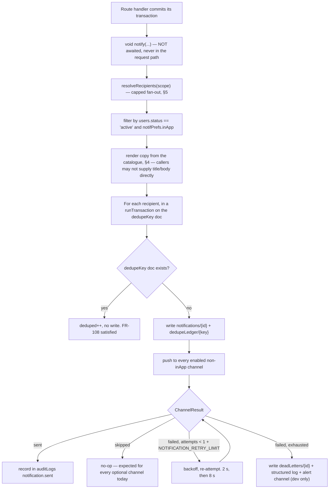

# 13 — Notification System

**Project:** CareGrid AI
**Document type:** Implementation specification for notification generation, delivery, and presentation
**Status:** Baseline v1.0 — normative for every notification type, copy string, dedupe rule, and retention window
**Related:** [01 PRD §6.10](./01_PRODUCT_REQUIREMENTS_DOCUMENT.md), [07 Database Schema §10](./07_DATABASE_SCHEMA.md), [08 API §6](./08_API_SPECIFICATION.md), [10 Authorization & Security](./10_AUTHORIZATION_SECURITY.md), [11 Realtime System §2](./11_REALTIME_SYSTEM.md), [22 Roles & Permissions §3 rows 45–47](./22_USER_ROLES_PERMISSIONS.md)

---

## 0. How to read this document

**A notification in CareGrid AI is a row in a Firestore collection that a client already has a listener on.** That is the whole MVP channel. Everything else in this document is either an analysis of why it is not built, or the interface that would carry it if it were.

Two rules govern every design decision below:

| Rule | Source |
| --- | --- |
| **In-app is mandatory and is the only channel in v1.** SMS, WhatsApp, email, and Web Push are optional, disabled by default, and must not be built speculatively | FR-100, FR-105, FR-106, DEC-14, `ENABLE_SMS_NOTIFICATIONS=false`, `ENABLE_WHATSAPP_NOTIFICATIONS=false` |
| **A notification failure must never fail the request that caused it** | FR-107 |

Conventions: `NotificationType` is the 12-value enum in [07](./07_DATABASE_SCHEMA.md) §10.2. `severity` is `info | warning | critical`. **No `NotificationType` value is invented in this document, and `FR-109` is reserved** ([07](./07_DATABASE_SCHEMA.md) §10.2). Copy conventions: **plain text only, no HTML** (XSS defence, T-09 in [24](./24_THREAT_MODEL_SECURITY.md)); **no exclamation marks anywhere**; **no sentence that implies urgency the severity does not warrant** ([04](./04_UI_UX_DESIGN_SPECIFICATION.md) §1 A3 — red is reserved for `urgency: critical`).

---

## 1. Scope

| In scope (v1, P0) | Out of scope (v1) |
| --- | --- |
| `notifications` collection + the `useRealtimeNotifications` listener | Any outbound network call to an external provider |
| The full 12-type event catalogue with copy | SMS, WhatsApp, email, Web Push — **no provider is implemented** |
| Recipient resolution with a documented fan-out cap | Push to a device with the app closed |
| `dedupeKey`-based idempotency (FR-108) | Per-user notification routing rules beyond `users.notifPrefs` |
| Retry ≤ `NOTIFICATION_RETRY_LIMIT` (2) + a dead-letter record | Guaranteed delivery; the in-app channel has no delivery guarantee when a client is offline — it is a **stored** notification, not a **pushed** one |
| Bell, badge, dropdown, `/notifications` | Notification preferences UI for channels that do not exist (rendered disabled with a reason) |
| `expiresAt` + a sweep job | Hard delete in the request path |
| DND / quiet hours design (P1, `DECISION REQUIRED`) | Multi-channel escalation in v1 (design documented, not built) |

---

## 2. The `NotificationChannel` interface

FR-105 requires SMS delivery to go "through a generic `NotificationChannel` interface so no provider is hard-coded into business logic". The interface exists in v1; **the implementation does not.**

```ts
// services/notifications/channel.ts — types only, no provider
import type { NotificationType, NotificationSeverity } from '@/lib/validation/enums';

export type NotificationRecipient = {
  uid: string;
  role: 'citizen' | 'responder' | 'dispatcher' | 'admin';
  status: 'active' | 'pending_verification' | 'suspended' | 'disabled';
  notifPrefs: { inApp: boolean; sms: boolean; whatsapp: boolean; email: boolean };
  /** Server-side only. NEVER sent to a channel, never serialised into a notification body. */
  phone: string | null;
  email: string;
  displayName: string;
};

export type Notification = {
  notificationId: string;
  recipientUid: string;
  type: NotificationType;
  severity: NotificationSeverity;
  title: string;            // ≤ 90 chars
  body: string;             // ≤ 240 chars, plain text
  incidentId: string | null;
  dispatchId: string | null;
  actorUid: string | null;
  link: string | null;      // internal route, e.g. '/incidents/r7Kp…'
  dedupeKey: string;
  read: false;
  readAt: null;
  expiresAt: Timestamp | null;
  createdAt: Timestamp;
};

export type ChannelResult =
  | { status: 'sent'; providerMessageId: string | null; cost: Money | null }
  | { status: 'skipped'; reason: 'disabled' | 'preference' | 'no_address' | 'not_verified' | 'expired' }
  | { status: 'failed'; code: ChannelErrorCode; retryable: boolean; message: string };

export type ChannelErrorCode =
  | 'RATE_LIMITED'      // provider 429 → retryable with backoff
  | 'QUOTA_EXHAUSTED'   // account out of credit → NOT retryable, page a human
  | 'INVALID_ADDRESS'   // bad phone/E.164 → NOT retryable
  | 'TEMPLATE_REJECTED' // WhatsApp template not approved → NOT retryable
  | 'AUTH_REVOKED'      // provider credentials rejected → NOT retryable
  | 'PROVIDER_DOWN'     // 5xx / network → retryable
  | 'TIMEOUT'           // → retryable
  | 'UNSUPPORTED';      // channel not implemented → skipped, not failed

export interface NotificationChannel {
  readonly id: 'inApp' | 'sms' | 'whatsapp' | 'email' | 'webPush';
  readonly enabledByDefault: boolean;
  /** Which env var gates this channel. Null for inApp, which is always on. */
  readonly gatedBy: string | null;
  send(notification: Notification, recipient: NotificationRecipient): Promise<ChannelResult>;
}
```

### 2.1 The registered channels in v1

| Channel | `enabledByDefault` | `gatedBy` | `send()` implementation |
| --- | --- | --- | --- |
| `inApp` | `true` | `null` (and `config.notifications.channels.inApp`) | **The only implemented one.** It is a single Firestore transaction writing the `notifications` document; it cannot fail for an external reason. See §3.3 |
| `sms` | `false` | `ENABLE_SMS_NOTIFICATIONS` + `users.notifPrefs.sms` | **Not implemented.** `send()` returns `{ status: 'skipped', reason: 'disabled' }` |
| `whatsapp` | `false` | `ENABLE_WHATSAPP_NOTIFICATIONS` + `users.notifPrefs.whatsapp` | **Not implemented.** Returns `skipped: 'disabled'` |
| `email` | `false` | `config.notifications.channels.email` (default `false`) + `users.notifPrefs.email` | **Not implemented.** Returns `skipped: 'disabled'` |
| `webPush` | `false` | `config.notifications.channels.webPush` | **Not implemented.** Returns `skipped: 'unsupported'` |

`users.notifPrefs` defaults to `{ inApp: true, sms: false, whatsapp: false, email: true }` ([07](./07_DATABASE_SCHEMA.md) §3). Note the `email: true` default is a **preference default**, not an enablement: no email channel exists, so the preference is inert. The `/settings` UI renders the SMS and WhatsApp toggles **disabled with the reason** "No notification provider is configured in this deployment" ([04](./04_UI_UX_DESIGN_SPECIFICATION.md) §13.15) so a user is not offered a switch that does nothing.

### 2.2 Why no provider is implemented

| Reason | Detail |
| --- | --- |
| **FR-106 itself says so** | "WhatsApp delivery MUST be optional, disabled by default, and MUST document that the WhatsApp Business Cloud API requires a registered business account and a Meta app review" |
| **Every optional channel has a hard external dependency** | A provider account, an API key, a verified sender, a phone number, a VAPID keypair, or a service worker. All of them are unavailable in a 48-hour hackathon environment with no organisational entity behind it |
| **An untested provider is worse than no provider** | A notification path that can fail in production is an operational liability. A stub that returns `skipped` is honest, testable, and free |
| **Speculative generality is a cost** | Each unused interface, mock, and configuration switch is code to read, test, and keep. [02](./02_TECHNICAL_REQUIREMENTS_DOCUMENT.md) §3.1 makes this an explicit project principle |
| **The product still works** | A responder with the tab open sees an assignment within 3 s (FR-090). The failure mode of in-app-only is "the responder had the app closed", which is a real limitation and is stated in the demo, not hidden |
| **It is the `$0` constraint (NFR-026)** | SMS is per-message, WhatsApp is per-conversation, email is per-provider-free-tier-with-signup. In-app is free |

**What "not implemented" means concretely:** there is no `providers/` directory, no `sms.ts`, no `twilio.ts`, no `whatsapp.ts`, no `smtp` configuration, no `WHATSAPP_TOKEN`, no `SMS_API_KEY`. [21](./21_ENVIRONMENT_VARIABLES.md) §9 states this explicitly: "Optional channels behind a `NotificationChannel` interface with no provider implemented."

---

## 3. `NotificationService`

### 3.1 The public entry point

```ts
// services/notifications/service.ts
export type NotifyInput = {
  type: NotificationType;
  severity: NotificationSeverity;
  /** Either an explicit uid list, or a broadcast that the resolver expands. */
  recipients: { kind: 'uids'; uids: string[] } | { kind: 'broadcast'; scope: BroadcastScope };
  incidentId?: string | null;
  dispatchId?: string | null;
  actorUid?: string | null;
  link?: string | null;
  /** Type-specific idempotency scope. See §10. */
  scope: string;
  /** Rendered copy. Produced by the catalogue in §4 — never built by a caller. */
  title: string;
  body: string;
  /** Per-type retention; defaults to the catalogue value. */
  expiresInHours?: number;
};

export type BroadcastScope = 'dispatchers' | 'dispatchers_and_admins' | 'admins';

export type NotifyOutcome = {
  written: number;         // notifications created
  deduped: number;         // suppressed by the dedupeKey transaction
  skipped: number;         // recipient unavailable or opted out
  failed: number;          // channel failure after retries → dead-lettered
  fanoutTruncated: boolean;
  deadLetterIds: string[];
  requestId: string;
};

class NotificationService {
  async notify(input: NotifyInput): Promise<NotifyOutcome> { /* §3.2 */ }
}
```

**Call-site rule.** No route handler ever calls `notify()` synchronously in a way that can reject. The call is `void notificationService.notify({...}).catch(logNotificationFailure)` after the transaction commits. There is exactly one call site per event, listed in §4.

### 3.2 The pipeline



| Step | Detail | Failure behaviour |
| ---: | --- | --- |
| 1 | The originating transaction has **already committed**. `notify()` is called after it, un-awaited | — |
| 2 | **Recipient resolution** (§5) | Resolution failure ⇒ log and return `written: 0`. The originating request is unaffected |
| 3 | **Filtering** on `users.status == 'active'` and `notifPrefs.inApp` | A suspended user gets no notification. Their account is unavailable anyway ([22](./22_USER_ROLES_PERMISSIONS.md) §1) |
| 4 | **Copy rendering** from the §4 catalogue, so copy is reviewed in one place and cannot drift per call site | A copy validation failure (title > 90, body > 240) throws **inside the notification path** and is logged; it never reaches the client |
| 5 | **Dedupe** (§10) in a `runTransaction` on `dedupeLedger/{sha256(dedupeKey)}` | Contention: Firestore retries a transaction up to 5 times. A retry is safe because the transaction body is idempotent — it checks for the doc and writes only if absent ([07](./07_DATABASE_SCHEMA.md) §12.7) |
| 6 | **In-app write** (§3.3) | A Firestore failure here is retried (step 7) and then dead-lettered |
| 7 | **Channel dispatch**, non-blocking | Provider failures never propagate to the caller |
| 8 | **Audit** `notification.sent` per delivered notification | Not in the FR-132 mandatory list, but it exists in `AuditAction` ([07](./07_DATABASE_SCHEMA.md) §11.5) and is valuable for the escalation audit in §9 |

### 3.3 The in-app channel, which is the real implementation

```ts
// services/notifications/channels/in-app.ts
const inAppChannel: NotificationChannel = {
  id: 'inApp',
  enabledByDefault: true,
  gatedBy: null,
  async send(notification, recipient) {
    // The document is already written by the dedupe transaction. This channel's
    // "delivery" IS the Firestore document; the client's listener is the transport.
    return { status: 'sent', providerMessageId: notification.notificationId, cost: null };
  },
};
```

**Why this is honest rather than a cop-out.** An in-app notification is *stored*, not *pushed*. The distinction matters and is stated in the demo:

| Property | In-app | A real push channel |
| --- | --- | --- |
| Delivered while the client is online | ~1–3 s (FR-090) | ~1–3 s |
| Delivered while the client is offline | **On next open**, as an unread row | Yes, that is the point |
| Requires the provider to be reachable | No | Yes |
| Costs money | No | Yes |
| Can be lost | Only if the notification write failed (rare, retried, dead-lettered) | Yes — provider queues expire, tokens are stale |
| Leaves an audit trail | Yes, a document in `notifications` | Only what we write ourselves |

### 3.4 Retry and the dead-letter record

| Rule | Detail |
| --- | --- |
| R-1 | `NOTIFICATION_RETRY_LIMIT` = 2 ([21](./21_ENVIRONMENT_VARIABLES.md) §2). Total attempts = **1 initial + 2 retries = 3** |
| R-2 | Retry only when `ChannelResult.retryable === true`. `RATE_LIMITED`, `PROVIDER_DOWN`, and `TIMEOUT` are retryable. `QUOTA_EXHAUSTED`, `INVALID_ADDRESS`, `TEMPLATE_REJECTED`, `AUTH_REVOKED` are **not** — retrying an out-of-credit account 3 times accomplishes nothing |
| R-3 | Backoff: **2 s, then 8 s.** The in-app channel uses the same ladder so a Firestore blip is retried. Jitter of ± 20 % is added so a fan-out of 10 does not retry in lockstep |
| R-4 | Because Vercel functions are request-scoped, a 2 s/8 s retry **must fit inside the function's lifetime** (25 s target for the triage route, [26](./26_PERFORMANCE_REQUIREMENTS.md) §4.4). A retry ladder that outlives the function does not happen. For retries that must outlive a function, the dead-letter record plus a manual replay job is the mechanism — and in v1 there is nothing to replay, because in-app cannot fail externally |
| R-5 | **Dead-letter record.** `deadLetters/{notificationId}`: `{ notificationId, type, recipientUid, channel, code, retryable, attempts, firstFailedAt, lastFailedAt, requestId, relatedIncidentId, notificationSnapshot }`. It is a top-level collection and **is not in [07](./07_DATABASE_SCHEMA.md) §1**, so it requires a schema amendment — see `DECISION REQUIRED` (NOTIF-DR-2) |
| R-6 | The dead-letter write is **best effort**. If it also fails, the structured log line is the record. `LOG_LEVEL=error` plus `requestId` is enough to reconstruct it |
| R-7 | A dead letter is **never** retried automatically. A human decides. There is no in-app channel to a human in v1, so it surfaces via `LOG_LEVEL=error` and, in development, the pluggable error reporter ([21](./21_ENVIRONMENT_VARIABLES.md) `SENTRY_DSN`, default disabled) |
| R-8 | **The originating request is never affected.** There is no code path from a `notify()` rejection to a route handler's response. This is FR-107 and it is verified by a test that makes `notify()` throw and asserts the route still returns 201 |

### 3.5 Instrumentation and monitoring

`notify()` runs outside the request, so its failures are invisible unless they are logged with enough structure to be found. Every invocation emits exactly one structured line through `lib/server/logging.ts` (JSON, so a newline cannot forge a record — T-38 in [24](./24_THREAT_MODEL_SECURITY.md)).

| Log line | `level` | Fields | Read by |
| --- | --- | --- | --- |
| `notification.dispatched` | `info` | `requestId`, `type`, `recipientsRequested`, `recipientsResolved`, `written`, `deduped`, `skipped`, `failed`, `fanoutTruncated`, `durationMs` | The demo health tile; volume sanity |
| `notification.deduped` | `debug` | `requestId`, `type`, `dedupeKey`, `recipientUid` | A duplicate rate that is not ~0 % for a retryable event is a dedupe bug |
| `notification.skipped` | `debug` | `type`, `recipientUid`, `reason` | `reason: 'preference'` spiking means users are turning in-app off — a product signal |
| `notification.channel_failed` | `warn` | `type`, `channel`, `code`, `retryable`, `attempt` | Only reachable once a channel exists; today it is unreachable, which is the point |
| `notification.dead_lettered` | `error` | `notificationId`, `channel`, `code`, `attempts`, `requestId` | A human, from the log |
| `notification.copy_invalid` | `error` | `type`, `field`, `length` | A copy regression in the catalogue — a code bug, and the log makes it findable |
| `notification.fanout_truncated` | `warn` | `type`, `resolved`, `cap` | Approaching 10 active dispatchers means the cap is the wrong number |

| Rule | Detail |
| --- | --- |
| LOG-1 | **No PII in the log line.** `recipientUid` is fine (a pseudonymous id). `phone`, `email`, `displayName`, `body`, and `note` are **never** logged |
| LOG-2 | `dedupeKey` is logged, not the notification body. A `dedupeKey` is reconstructable from ids and contains no free text |
| LOG-3 | `notification.sent` in `auditLogs` records `{ type, recipientUid, channel, code }` — a delivery record, not a content record. A notification's content is already in the `notifications` document |
| LOG-4 | `LOG_LEVEL=info` is the production default ([21](./21_ENVIRONMENT_VARIABLES.md) §4). The `deduped` line is therefore invisible in production, which is intentional: a 1:1 dedupe ratio is normal and should not be a `warn` |
| LOG-5 | No metrics backend is wired. The demo reads the log; `GET /api/admin/system/health` exposes a `notifications` block with 24 h counts of `written` / `deduped` / `deadLettered` computed from those lines' persisted counterparts (`notifications` and `deadLetters` collections), **not** from log scraping |

---

## 4. Event catalogue

All 12 `NotificationType` values from [07](./07_DATABASE_SCHEMA.md) §10.2. `title` ≤ 90 chars, `body` ≤ 240 chars, **plain text, no HTML, no exclamation marks**. `dedupeKey` form: `{type}:{recipientUid}:{scope}`.

| Type | Trigger | Recipients | Severity | `scope` | `expiresAt` | Title | Body | `link` |
| --- | --- | --- | --- | --- | --- | --- | --- | --- |
| **`incident_created`** | `POST /api/incidents` commits, for an incident that is not `urgency: critical` | `dispatchers` | `info` | `{incidentId}` | 7 d | `New {urgency} report · {reference}` | `{categoryLabel} reported {relativeTime}. {reporterCountLabel}` | `/incidents/{incidentId}` |
| **`critical_incident_alert`** | `POST /api/incidents` commits with `urgency: critical` | `dispatchers_and_admins` | `critical` | `{incidentId}` | 24 h | `Critical · {reference} · {categoryLabel}` | `{summary}. {locationLabel}.` | `/incidents/{incidentId}` |
| **`incident_verified`** | `PATCH /api/incidents/:id/status` → `verified` | the **reporter** | `info` | `{incidentId}` | 7 d | `{reference} confirmed` | `A dispatcher confirmed your report. Someone is being sent.` | `/track?ref={reference}` |
| **`incident_assigned`** | `POST /api/incidents/:id/dispatch` commits, or `POST /api/dispatches/:id/claim` succeeds | the **assigned responder** | `critical` | `{dispatchId}` | 2 d | `Assigned · {reference} · {urgency}` | `{categoryLabel}, {distanceLabel} away. {noteLabel}` | `/incidents/{incidentId}` |
| **`status_changed`** | Any accepted lifecycle transition except `verified` and `resolved` | `dispatchers` | `info` | `{incidentId}:{toStatus}` | 3 d | `{reference} · {toStatusLabel}` | `{fromStatusLabel} → {toStatusLabel} · {actorLabel}` | `/incidents/{incidentId}` |
| **`incident_resolved`** | Transition to `resolved` | the **reporter**, the **assignee**, `dispatchers` | `info` | `{incidentId}` | 14 d | `{reference} resolved` | `The responder has finished. A dispatcher will close the report.` | `/incidents/{incidentId}` (reporter: `/track?ref={reference}`) |
| **`duplicate_suggested`** | `POST /api/incidents` completes with `duplicateStatus: 'potential_duplicate'` | `dispatchers` | `warning` | `{incidentId}` | 7 d | `Possible duplicate · {reference}` | `Matches {primaryReference} · {distanceLabel} · {timeDeltaLabel} · {categoryLabel}` | `/incidents/{incidentId}` |
| **`responder_unavailable`** | An active dispatch is withdrawn: expiry, explicit withdraw, reassignment, or the responder goes `offline` | the **dispatchers who had that responder assigned** | `warning` | `{dispatchId}:{reason}` | 2 d | `{reference} · {responderName} withdrawn` | `The assignment was withdrawn ({reasonLabel}). Another responder is needed.` | `/incidents/{incidentId}` |
| **`sla_breached`** | `slaBreachedAt` is set for the first time (server-side, `SLA_BREACH_SWEEP=on_write`) | `dispatchers` | `critical` | `{incidentId}` | 3 d | `SLA passed · {reference}` | `{urgency} target was {slaTargetMin} min. Now {overByLabel} over.` | `/incidents/{incidentId}` |
| **`responder_verified`** | `POST /api/responders/:id/verify` succeeds | the **responder** | `warning` | `{uid}:{verifiedAt}` | 30 d | `Your responder account is verified` | `You can now be assigned to incidents. Set yourself available when you are on duty.` | `/responders` |
| **`role_changed`** | `PATCH /api/admin/users/:id/role` succeeds, and `claimsSynchronised === true` | the **affected user** | `warning` | `{uid}:{role}:{changedAt}` | 30 d | `Your role is now {role}` | `An administrator changed your access. Sign out and back in to apply it everywhere.` | `/settings` |
| **`account_suspended`** | `PATCH /api/admin/users/:id/status` → `suspended`, or `POST /api/responders/:id/reject` | the **affected user** | `warning` | `{uid}:{suspendedAt}` | 30 d | `Your account is not available` | `An administrator suspended this account. Contact them for details.` | `/settings` |

### 4.1 Copy rules

| Rule | Detail |
| --- | --- |
| C-1 | **No exclamation marks.** A notification is a factual record, not an appeal. `Send help fast` in the reporter's own text is theirs, not ours |
| C-2 | **No blame.** `responder_unavailable` says "the assignment was withdrawn", not "Yusuf did not respond". The audit log and the admin's responder-performance view (FR-069) are where performance questions are answered |
| C-3 | **The human is the actor.** "A dispatcher confirmed your report", not "your report has been processed" |
| C-4 | **`{urgency}` in a title is the incident's urgency**, and only `critical` may be red ([04](./04_UI_UX_DESIGN_SPECIFICATION.md) §1 A3). The literal word "critical" appears in a title **only** for `critical_incident_alert` and `sla_breached` |
| C-5 | **Interpolation is from a closed vocabulary, never from free text.** `{categoryLabel}` comes from the 11-value taxonomy, `{toStatusLabel}` from the 11-value status set, `{reasonLabel}` from a closed enum. The **only** free-text interpolation permitted in a body is `note` on `incident_assigned` (a dispatcher instruction, ≤ 280 chars, already validated) and `summary` on `critical_incident_alert` (AI-generated, ≤ 240 chars, already HTML-stripped by the sanitiser). Both are rendered as **plain text** with no markup interpretation |
| C-6 | `{reporterCountLabel}` is `1 report` or `N reports` — a count, never a name |
| C-7 | `{locationLabel}` on a critical alert is `placeName` prefixed "Near ", or `Location unknown`. It is **never** `locationText` (FR-068) and **never** a reporter name |
| C-8 | A notification for a responder **never** contains `reporterUid`, `reporter.displayName`, `reporter.email`, or `locationText` — enforced in the serialiser, not in the copy template |
| C-9 | `title` ≤ 90 and `body` ≤ 240 are validated at write time by `notificationWriteSchema` (`.strict()`); a violation throws inside the notification path and dead-letters |
| C-10 | `title` and `body` are stored **verbatim as written by the catalogue**. They are not re-rendered at read time, so a later copy change cannot alter the historical record |

### 4.2 Worked example — three critical alerts for one incident

A citizen submits a `medical` report with `medical_critical` in `safetyFlags`. Per R1 of [09](./09_AI_GEMINI_SPECIFICATION.md) §5.3, urgency is raised to at least `high`; the model returned `critical`.

```
urgency: critical, category: medical, reference: CG-7QK4M2, incidentId: r7Kp2mQ9xL4nT8vB3cD6
placeName: "Koramangala 5th Block", reporterCount: 1
```

**One** notification is written per recipient, not two:

| Candidate event | Emitted? | Why |
| --- | :-: | --- |
| `incident_created` | ✖ | The catalogue emits `incident_created` for non-critical incidents and `critical_incident_alert` for critical ones. A critical incident produces **only** the alert |
| `critical_incident_alert` | ✔ | `urgency == critical` |
| `duplicate_suggested` | ✔ if a candidate scored ≥ 0.55 | A separate event, separate dedupe scope, separate recipients (all dispatchers vs. dispatchers and admins) |
| `sla_breached` | later | Fires when `slaBreachedAt` is first set, which is a separate transaction on a separate day |
| `status_changed` | later, per transition | A different event with a different scope |

The **critical** rule is a single line in the catalogue's `emits` predicate, and it is the difference between a dispatcher receiving one red banner and receiving two.

### 4.3 Copy review checklist

Every entry in §4 is reviewed against this checklist before it ships. A new notification type is a **product** change, not a code change, and this list is why.

| # | Check | Why it exists |
| ---: | --- | --- |
| 1 | Would a person in distress understand this in one reading? | The reader may be panicked, on a phone, in poor light |
| 2 | Is the **actor** named as a human where one is named? ("A dispatcher confirmed your report") | P6 in the design system: the human is the actor |
| 3 | Is there **no** exclamation mark, **no** emoji, **no** all-caps, **no** second-person pressure? | P5/P6 tone rules. A notification is a record, not an appeal |
| 4 | Is `severity` justified by the **event**, not by the writer's excitement? | `critical` is reserved for `critical_incident_alert` and `sla_breached`. A `critical` badge that fires often trains people to ignore it |
| 5 | Does the **body** carry the one fact the reader needs to act, and nothing else? | The row is 2 lines on mobile. A 240-character body is 3 lines of noise in a dropdown |
| 6 | Does the copy leak anything a responder must not see? | FR-068, NFR-027, and the `responder_unavailable` case, where naming a responder in a body that goes to *other* dispatchers is fine but the same template must never reach a citizen |
| 7 | Is every `{placeholder}` from a **closed vocabulary**, or an already-validated short field? | C-5. Free text in a template is an injection and a PII vector |
| 8 | Does the copy survive a **negative** case? ("No responder is available" for a `responder_unavailable` with no `responderName`; a withdrawn `dispatchId`) | Missing placeholders render as empty strings and produce sentences like "The assignment was withdrawn ()." The render function returns `null` and the event is dropped rather than emitted broken |
| 9 | Is `expiresAt` proportionate to the reader's decision window? | A 2-day assignment alert outlives a 120-second dispatch expiry, which is correct: the responder may open the app 20 minutes later |
| 10 | Would this notification be **actionable** by the recipient? | If the recipient cannot do anything with it, it is dashboard content, not a notification |
| 11 | Does a **retry** of the triggering action produce an identical notification? | Yes, by construction: the copy is rendered from the catalogue, not from the caller's local state |
| 12 | Is it covered by an integration test in §14.2? | A new type without a test is an untested new user-visible string |

**The review owner is product, not engineering.** Engineering owns the length validation and the placeholder safety; product owns whether the sentence is true, kind, and worth interrupting someone for. `DECISION REQUIRED` is not needed here — this is settled by the existing P5/P6 principles in [04](./04_UI_UX_DESIGN_SPECIFICATION.md) §1.

---

## 5. Recipient resolution

### 5.1 Broadcast rules

| Scope | Resolves to | Query | Cap |
| --- | --- | --- | --- |
| `dispatchers` | users with `role ∈ {dispatcher}` and `status == 'active'` | `users` where `status == 'active'`, then filter on the `role` field in code | **10** |
| `dispatchers_and_admins` | `role ∈ {dispatcher, admin}`, `status == 'active'` | as above | **10** |
| `admins` | `role == 'admin'`, `status == 'active'` | as above | **10** |
| `uids` | the given uids, filtered to `status == 'active'` | `users` `where('uid','in', uids)` — capped at **30** before chunking (Firestore `in` limit) | **10** after the filter |

Ordering is **deterministic**: `uid ASC`. Two servers that resolve the same broadcast produce the same recipient list, so the dedupe ledger is shared rather than forked. Ordering by "most recently active" would be friendlier and would break that property; a tie-break on a mutable field in a dedupe path is a bug waiting to happen.

### 5.2 The fan-out cap and its cost

| Property | Value |
| --- | --- |
| `FANOUT_MAX_RECIPIENTS` | **10** |
| Why 10 | The demo deployment has 2 dispatchers and 1 admin ([07](./07_DATABASE_SCHEMA.md) §14). NFR-008 targets 10 concurrent dispatchers. A cap of 10 is therefore exactly the design point, and it bounds the worst case |
| Reads to resolve | 1 (`users` where `status == 'active'`, `limit(50)`) — **not** 1 per recipient |
| Writes | ≤ 10 notifications + ≤ 10 `notifications.sent` audit rows |
| When truncated | `fanoutTruncated: true` in the outcome, `severity` bumped one level (`info → warning`, `warning → critical`, `critical` stays `critical`), and the truncation is recorded in the structured log with the `requestId`. **The truncation is never silent** |
| Why not higher | Each additional recipient is 1 write + 1 audit write + 1 more client's bell badge. A platform with 300 dispatchers would need a topic/queue design, not a fan-out, and that is post-hackathon work ([28](./28_FUTURE_ROADMAP.md)) |
| Why not lower | Capping at 2 would mean the third dispatcher on a shift never hears about a critical incident, which defeats the purpose of a dispatch alert |
| The alternative design, documented | A per-`geoCells`-cell notification topic document written server-side, which clients subscribe to by cell. This is the same fan-out problem as the responder in-radius feed ([11](./11_REALTIME_SYSTEM.md) §11.2, finding F3) and is deferred for the same reason |

### 5.3 Per-event recipient rules

| Event | Resolution |
| --- | --- |
| `incident_created`, `critical_incident_alert`, `status_changed`, `duplicate_suggested`, `sla_breached` | Broadcast to the scope in the §4 table |
| `incident_verified` | `{ kind: 'uids', uids: [incident.reporterUid] }` |
| `incident_assigned` | `{ kind: 'uids', uids: [dispatch.responderUid] }` — exactly one recipient |
| `incident_resolved` | `{ kind: 'uids', uids: [reporterUid, assigneeUid].filter(Boolean) }` **plus** a broadcast to `dispatchers` |
| `responder_unavailable` | `{ kind: 'uids', uids: [dispatch.dispatchedBy, ...recentAssignersWhoSawIt] }`, filtered to `role ∈ {dispatcher, admin}` and de-duplicated. "Dispatchers who had that responder assigned" is resolved from the last 24 h of `dispatches` for that responder, `limit(20)`, filtered to dispatchers — it is **not** "everyone", because paging six people about a withdrawal is worse than paging the one who made it |
| `responder_verified`, `role_changed`, `account_suspended` | `{ kind: 'uids', uids: [targetUid] }` — exactly one recipient |

| Rule | Detail |
| --- | --- |
| RES-1 | A recipient is dropped if `users.status != 'active'`, if `notifPrefs.inApp === false`, or if the uid does not exist. Each drop increments `skipped` |
| RES-2 | A **responder** is never in a `dispatchers` broadcast. A citizen never is. The role filter is applied in the resolver, not in the call site |
| RES-3 | The actor is included unless they are the only possible recipient and the event is about their own action. `role_changed` is **not** sent to the admin who made the change — only to the affected user, who is never the actor (FR-133 forbids self-role-change) |
| RES-4 | `notifPrefs.inApp === false` is honoured. There is no "critical override" for an in-app preference: the preference is a user control, and honouring it is the difference between a setting and a decoration |
| RES-5 | Resolution runs **after** the originating transaction commits, so a broadcast never sees a partially-written incident |

---

## 6. Channel-by-channel feasibility

Every claim here is checkable. Where a number is given it is indicative and must be verified before it is quoted externally; quotas and prices change.

### 6.1 In-app — **the MVP channel**

| Aspect | Reality |
| --- | --- |
| What it is | A Firestore document in `notifications` + the `useRealtimeNotifications` listener (L5 in [11](./11_REALTIME_SYSTEM.md) §2.2) |
| Setup cost | Zero. It is the datastore we already have |
| Money | **$0.** 1 write per notification; 50 reads per recipient session-hour from the listener |
| Latency | 1–3 s to a connected client (FR-090, NFR-006) |
| Offline behaviour | Stored, not pushed. Delivered on next open |
| Provider dependency | None |
| Reliability | The listener reconnect machinery is the same machinery the whole product depends on |
| Verdict | **Ship it. It is the whole MVP** |

### 6.2 Email

| Aspect | Reality |
| --- | --- |
| Does the product already have email? | Yes, as an **auth** credential: `users.email`, and Firebase Auth sends its own verification and password-reset emails. **That is not a notification channel.** Firebase provides no general-purpose transactional email API; its SMTP relay is undocumented and unsupported |
| Option A — Firebase Auth's own email | Only usable for auth flows. Cannot carry a notification body or a link to an incident. **Rejected** |
| Option B — a free transactional provider | Providers such as Resend, Brevo (Sendinblue), Postmark, or Mailjet offer free tiers in the low-thousands per month, and several are free with no card. Cost: a signup, an API key, a verified sending domain (or at least a verified single sender), and DNS records (SPF, DKIM). Realistically **1–3 hours of setup** plus deliverability tuning |
| Option C — Gmail API via OAuth | Each user must grant OAuth access to a verified Google Cloud app, and Google imposes a **500 messages/day/user** cap. For a platform-wide `critical_incident_alert` to "all dispatchers", every dispatcher would have to have connected a mailbox first. **Rejected for broadcast use**; conceivable for a personal digest |
| Money | $0 on a free tier at demo volume. Non-zero beyond it |
| Deliverability risk | An unconfigured domain lands in spam. For an *emergency* product, a message in spam is worse than no message, because it teaches users to distrust the channel |
| Verdict | **`DECISION REQUIRED` (NOTIF-DR-1). Recommendation: defer.** Not because it is impossible, but because a half-configured email channel is a worse user experience than a clearly-absent one, and the demo value over in-app is marginal |

### 6.3 SMS

| Aspect | Reality |
| --- | --- |
| Provider account | Required. Twilio, MessageBird, MSG91, Textlocal, or a regional provider |
| Per-message cost | Roughly **$0.005–$0.03 per SMS** depending on provider and destination country. An SMS is segmented at 160 characters, so a 240-character body costs **2 segments** — our longest bodies fit in 2 |
| Free tier reality | Twilio's free trial is **credits, not a permanent tier**, and expires. Some regional providers offer small monthly free quotas. **There is no dependable permanent free SMS tier**, so this is the first channel that genuinely costs money, contradicting NFR-026 |
| **Sender registration** | This is the real blocker, and it is country-specific. In **India** (our `APP_TIMEZONE` is `Asia/Kolkata`), business SMS requires **TRAI DLT registration**: a registered entity, a registered content template, a registered sender ID (header), and a monthly compliance filing. The process is measured in **weeks**, not hours. In the US, an A2P 10DLC campaign registration is required for business messaging, with brand and campaign review |
| Number | A dedicated long code or an alphanumeric sender ID. Both are subject to carrier and regulator rules |
| Length discipline | A `critical_incident_alert` body would be: `"Critical. Medical. Near Koramangala 5th Block. CG-7QK4M2. Open the app."` — under 160 characters, deliberately. Short copy is a **design constraint of SMS**, not a style preference |
| Verdict | **`DECISION REQUIRED` (NOTIF-DR-1). Recommendation: defer, and document the DLT/A2P requirement as the reason.** SMS is the one channel where a responder genuinely needs an out-of-band alert, so it is the most valuable future addition — and the one most blocked by regulation |

### 6.4 WhatsApp

| Aspect | Reality |
| --- | --- |
| Platform | **WhatsApp Business Cloud API**, via the Cloud API or a BSP (Twilio, 360dialog, Gupshup, Wati) |
| Prerequisites | A **Meta Business Account**; a **registered business phone number** not currently active on WhatsApp; business verification (documents, and for some regions a video or in-person verification); a **Meta app** with the WhatsApp product enabled; a webhook endpoint; a **display name** approved by Meta |
| Business-initiated messages | Anything not in response to a user message within a 24-hour customer-service window is a **business-initiated message**, and it **must use a pre-approved message template**. A template is submitted for approval, and approval is not instant |
| Pricing | Per **conversation**, not per message. Utility and marketing categories are billed differently; a critical alert is a *utility* template. Prices vary by country and change |
| App review | For production, Meta requires app review before the number can message real users outside your own test numbers |
| Time to first message, honestly | Meta Business verification plus template approval plus app review is **days to weeks**, and it depends on a legal entity existing. In a 48-hour hackathon with no company, it is **not possible**. This is precisely what FR-106 asks us to document |
| Verdict | **P2, explicitly out of v1** (FR-106). Documented here to satisfy the FR-106 obligation, not as a plan. **Even the template draft is not written**, because a template nobody has approved is documentation debt |

### 6.5 Web Push

| Aspect | Reality |
| --- | --- |
| What it needs | A **service worker** (already implied by the PWA posture), a **VAPID keypair** (generated once, public key in the client, private key server-only), a `pushManager.subscribe()` call, and a browser permission prompt |
| Cost | $0. The push services (FCM, Mozilla, Web Push) are free. Storage for the subscription set is in `users` or a `pushSubscriptions` collection |
| The hard part | The permission prompt is the **second** prompt on the same screen, after the geolocation prompt. Asking for two permissions in one flow is the pattern users reflexively dismiss. And a notification permission granted on `localhost` does not transfer to a deployed origin |
| Reliability | Push is a **push**, unlike in-app: it reaches a closed tab. That is a genuine operational advantage for `critical_incident_alert` and `incident_assigned` |
| Effort | A service worker, a subscription lifecycle (create, refresh, delete, 410 handling), VAPID key management, and a payload-size discipline (a push payload is capped at ~4 KB) |
| Verdict | **Possible, and the most valuable of the optional channels, and out of scope for v1.** It needs no external account, which is why it is the most likely v1.1 addition |

### 6.6 Summary

| Channel | v1 | External account needed | Money at demo volume | Days to set up (honest) | Blocks on a third party? |
| --- | :-: | :-: | --- | --- | :-: |
| In-app | **Yes** | No | $0 | 0 | No |
| Web Push | No | No | $0 | 2–4 | No |
| Email | No | Yes (provider + domain) | $0 on a free tier | 1–3 hours | **Yes** (deliverability) |
| SMS | No | Yes (provider + sender registration) | **Non-zero** | **Weeks** (India DLT) | **Yes** (regulator) |
| WhatsApp | No | Yes (Meta Business + number + app) | Non-zero per conversation | **Weeks** | **Yes** (Meta review) |

---

## 7. Notification UI

### 7.1 The bell

| Property | Behaviour |
| --- | --- |
| Component | `IconButton` with a `Bell` icon, `aria-label` **mandatory** ([04](./04_UI_UX_DESIGN_SPECIFICATION.md) §5.12) |
| Label | `"Notifications, {n} unread"` or `"Notifications"` when the count is 0. The count is in the **accessible name**, never only in the badge |
| Badge | The unread count, `aria-hidden="true"`. Capped visually at `99+`; the accessible name carries the real number |
| Placement | In the top bar on every `(app)` route, at every role ([04](./04_UI_UX_DESIGN_SPECIFICATION.md) §5) |
| Data source | **The same listener** as `/notifications` (L5, `limit(50)`, `orderBy createdAt desc`). `unreadCount` is computed from the same snapshot — there is **no second query and no counter read** ([05](./05_FRONTEND_ARCHITECTURE.md) §6.7) |
| Honesty | If the count is computed from a 50-row window, the tooltip says "in the 50 most recent". The listener is `limit(50)`; a user with 400 unread has 400 unread and the bell shows `99+` |
| **No sound** | A notification sound is a surprise, is a WCAG concern, and cannot be audited. Deliberately absent |

### 7.2 Dropdown preview

| Property | Behaviour |
| --- | --- |
| Contents | The **5** most recent notifications: `SeverityBadge` + title + relative time. `body` is clamped to 1 line |
| Opens on | Click. Closes on `Escape`, on outside click, and on route change |
| Focus | **Never steals focus.** Opening the dropdown does not move focus. `Escape` returns focus to the bell button. Tab order continues into the dropdown, and out of it back to the page |
| Footer | `Mark all as read` and a `View all` link to `/notifications` |
| Read state | Clicking a row marks it read **optimistically** and navigates to `data.link` |
| Permission on a link | A notification whose `link` points at a route the caller may not access renders its title with a **disabled** `Open` action and the text "This item is not available to your role." ([04](./04_UI_UX_DESIGN_SPECIFICATION.md) §13.14) |
| Missing row | `NOTIFICATION_NOT_FOUND` (404) removes the row with a `neutral` toast "That notification is no longer available." |

### 7.3 `/notifications`

| Property | Behaviour |
| --- | --- |
| Route | `/notifications`, all four roles, `reporterUid` scoping enforced server-side with **no** `recipientUid` parameter (FR-103) |
| Filters | `Tabs`, URL-backed: **All** · **Unread {n}** · by `type`. The tab strip scrolls horizontally on mobile |
| Grouping | **By day**, with an `<h3>` per group carrying the date in `APP_TIMEZONE` (FR-146): `Today` · `Yesterday` · `Saturday, 20 September` · `20 September 2026` |
| Row | 3 px left rule + `Circle`/`CircleCheck` icon + the literal text "Unread" — **never colour alone** (NFR-017) · `SeverityBadge` (icon + label) · title · body clamped to 2 lines · `RelativeTime` |
| Desktop ≥ 1280 px | Two-pane list/detail. Below that, list only, with a `Sheet` for detail on mobile |
| Actions | Open the target route · mark read · `Mark all as read` · dismiss (`DELETE`, soft-expire) |
| Empty | **"You have no notifications"** with the helper "Assignment, status, and SLA updates appear here." |
| Pagination | `limit(25)` default, cursor. "Load more" is user-initiated — never automatic (FR-121, M-3 in [26](./26_PERFORMANCE_REQUIREMENTS.md) §5.4) |
| Realtime | New rows appear without a skeleton ([04](./04_UI_UX_DESIGN_SPECIFICATION.md) §13.14) |
| `BATCH_TOO_LARGE` | "Marked 200 as read. 12 more remain — run again to finish." The client pages the batch |

### 7.4 The `aria-live` announcement

| Severity | Live region role | Announced? | Text |
| --- | --- | :-: | --- |
| `critical` | **`role="alert"`** (`aria-live="assertive"`) | ✔ | The full title, once |
| `warning` | **`role="status"`** (`aria-live="polite"`) | ✔ | The full title, once |
| `info` | `role="status"` (`aria-live="polite"`) | **No** | — |

| Rule | Detail |
| --- | --- |
| UI-1 | Announcements are emitted **only** for `critical` and `warning` ([05](./05_FRONTEND_ARCHITECTURE.md) §6.7 rule 5). An `info` notification is not worth interrupting anyone for |
| UI-2 | Each notification `id` is announced **at most once**, deduped in a `Set` that is cleared on sign-out ([05](./05_FRONTEND_ARCHITECTURE.md) §6.3) |
| UI-3 | `critical` uses `role="alert"`. In practice this means the announcement is queued behind whatever the screen reader is currently reading, because `assertive` cannot interrupt. That is the correct trade: it never cuts off a user mid-sentence |
| UI-4 | **Focus is never moved.** An announcement is a screen-reader announcement, not a focus change. A user reading an incident must not be teleported to a notification |
| UI-5 | The visible rendering of a `critical` notification is a **persistent `Alert` in the page, not a toast** ([04](./04_UI_UX_DESIGN_SPECIFICATION.md) §5.22): "a toast that disappears cannot be audited" |
| UI-6 | Under `prefers-reduced-motion` the `Alert` slides in with no transform. No pulsing, no attention animation on the bell badge |
| UI-7 | The live region is rendered as a visually-hidden `div` **present in the DOM from first paint**. A live region added at the same moment as its content is frequently missed by screen readers |

---

## 8. Do-not-disturb and quiet hours

**Status: P1, design documented, not built. `DECISION REQUIRED` (NOTIF-DR-3).**

| Aspect | Position |
| --- | --- |
| What DND would be | A per-user time window during which `info` and `warning` notifications are **stored** but do not **announce** (no `aria-live`, no bell-badge pulse, no `Alert`). `critical` always announces |
| Why the `critical` carve-out is non-negotiable | The product exists to route a cardiac arrest. A user who has silenced a 3 a.m. heatwave advisory must still hear a `critical_incident_alert` |
| Why DND is P1 not P0 | There is **one** channel in v1, and it is a stored list the user opens when they look. A stored notification is inherently non-intrusive. DND solves a problem created by channels we do not have |
| Where the preference would live | `users.notifPrefs.quietHours: { start: 'HH:mm', end: 'HH:mm', timezone: 'APP_TIMEZONE' } \| null` on `/settings` → Notifications. `null` = off. An empty window (`start === end`) = off |
| Where it is enforced | **Server-side**, in `NotificationService.notify()`, because the announcement decision is made at write time via a `suppressAnnouncement` flag on the stored document. Client-side enforcement would be bypassed by a second device |
| What it would suppress | `aria-live` announcement, the `Alert` auto-render, and the badge pulse. It would **not** suppress: the unread count, the row on `/notifications`, or the badge number itself |
| Interaction with `notifPrefs.inApp === false` | Independent. `inApp: false` means "do not create the document at all"; quiet hours mean "create it, do not interrupt" |
| The failure mode we accept | A user in quiet hours sees a 4-hour-old critical alert as a badge number. That is the correct behaviour, and it is the reason `critical` announces regardless |

> **`DECISION REQUIRED` (NOTIF-DR-3).** Build quiet hours in v1, or defer? **Recommendation: defer.** It adds a field to `users`, a Zod schema, a settings control, a server-side time-window evaluator with timezone edge cases (DST transitions, a window that crosses midnight), and a `suppressAnnouncement` flag — for a product with one non-intrusive channel. Revisit when a real push channel exists, at which point quiet hours become load-bearing. Decision owner: product, before phase 5.

---

## 9. Escalation policy

### 9.1 The problem, stated honestly

> A critical incident alert to a dispatcher is **not merely a notification**. It is an SLA.

An in-app notification has no delivery guarantee. If the dispatcher's tab is closed, the notification is stored and unseen. A product that routes cardiac arrests cannot pretend otherwise, and pretending otherwise would be the single most dishonest thing this project could do.

### 9.2 The policy

| Tier | Trigger | Expectation | Mechanism | Enforcement |
| --- | --- | --- | --- | --- |
| **T0 — alert** | `critical_incident_alert` or `sla_breached` written | **Acknowledge within 2 minutes** | `critical_incident_alert` in-app; a persistent `danger` `Alert` on `/dashboard`; the bell badge | The 2-minute clock is displayed on the `Alert` ("Unacknowledged for 1:12") |
| **T1 — escalate (P1, not built)** | No acknowledgement within **5 minutes** | A **second channel** is used | With no second channel existing, the defined fallback is: (a) a **persistent dashboard banner** across every dispatcher route stating "Critical incident {reference} unacknowledged for 5 minutes", and (b) an **`auditLogs` entry** `notification.escalated` recording that no one acknowledged within the window | Both parts **are built**, because both are free. The *second channel* part is `DECISION REQUIRED` (NOTIF-DR-4) |
| **T2 — page the admin** | No acknowledgement within 10 minutes | An admin is engaged | An `admin_suspended`-style in-app notification to all admins plus the same banner. **Also not built** — same reason |

### 9.3 "Acknowledged"

There is no acknowledgement button in v1, so **acknowledgement is inferred**: the first of

| Signal | Meaning | Caveat |
| --- | --- | --- |
| The incident's `status` changes from `new`/`triaged` (i.e. it is `verified`) | A dispatcher looked at it and acted | A dispatcher may verify without reading the alert. This is a **proxy**, and the banner must say so |
| A dispatcher opens `/incidents/{id}` | Engagement | A read is not an acknowledgement |
| `incidents.assigneeUid` is set | Ownership transferred | — |

**Honest statement, to be made in the demo:** v1 has **no acknowledgement primitive**. The 2-minute expectation is displayed, the 5-minute escalation produces a banner and an audit entry, and the *absence* of a real second channel is a documented gap. Inventing an `acknowledgedAt` field on `incidents` would be a schema change to [07](./07_DATABASE_SCHEMA.md) §4.1 for a field with no consumer in v1 — so it is `DECISION REQUIRED`, not a change made unilaterally.

> **`DECISION REQUIRED` (NOTIF-DR-4).** How is a critical alert escalated out of the app in v1? Options: (a) **banner + audit entry only** (recommended, free, honest, and what this document specifies as the v1 behaviour); (b) add `incidents.acknowledgedBy`/`acknowledgedAt` and a dispatcher `Acknowledge` button, which makes the SLA real but is a schema change and a new action; (c) build Web Push, which is the only free out-of-app channel (§6.5). **Recommendation: (a) for v1, and (b) as a small well-scoped v1.1** — the 2-minute SLA cannot be measured without it. Decision owner: product + backend.

### 9.4 Why we do not auto-dispatch on an unacknowledged critical

DEC-05 in [01](./01_PRODUCT_REQUIREMENTS_DOCUMENT.md) is mandatory: **AI never auto-dispatches**. The escalation ladder escalates *attention*, never *action*. There is no code path from "unacknowledged for 5 minutes" to "assign a responder automatically". An `auto_suggest` dispatch mode exists in the schema ([07](./07_DATABASE_SCHEMA.md) §8) for a **ranked suggestion**, and clicking it is still a human action.

---

## 10. Deduplication and idempotency (FR-108)

> "Dispatcher assignment notifications MUST be de-duplicated so a single assignment produces at most one notification per recipient." — FR-108

### 10.1 The mechanism

```ts
// services/notifications/dedupe.ts
/**
 * dedupeKey form: `{type}:{recipientUid}:{scope}`  — e.g.
 *   incident_assigned:u_4Kd8sTn:dsp_2Qm8Kx
 *   sla_breached:u_disp01:r7Kp2mQ9xL4nT8vB3cD6
 *   incident_created:u_disp01:r7Kp2mQ9xL4nT8vB3cD6
 * For time-bucketed events the scope carries the bucket, e.g.
 *   responder_unavailable:u_disp01:dsp_2Qm8Kx:expiry
 */
export function dedupeLedgerDocId(dedupeKey: string): string {
  return sha256(`cg:notif:v1:${dedupeKey}`);   // 64 hex chars — the key itself is not a doc id
}
```

```
runTransaction(db, async (tx) => {
  const ledgerRef = db.doc(`notifications_dedupe/${dedupeLedgerDocId(key)}`);
  const existing = await tx.get(ledgerRef);
  if (existing.exists) return { deduped: true };            // ← the guard
  tx.set(notificationRef, notification);                    // notifications/{autoId}
  tx.set(ledgerRef, { dedupeKey, notificationId, createdAt, type, recipientUid });
});
```

| Property | Detail |
| --- | --- |
| The guard is a **transaction**, not a `get`-then-`set` | A `get`-then-`set` outside a transaction races: two concurrent dispatches both see "not present" and both write. The transaction serialises them on the ledger document ([07](./07_DATABASE_SCHEMA.md) §12.6) |
| The transaction body is **idempotent** | Firestore retries a transaction up to 5 times silently. A retry re-reads the ledger, sees it, and returns `deduped: true` — the correct answer both times ([07](./07_DATABASE_SCHEMA.md) §12.7) |
| One ledger doc per `(type, recipient, scope)` | Not per notification. The ledger **is** the notification's identity for idempotency purposes |
| Storage cost | 1 extra document per notification. Both are small. This is a correctness cost we pay deliberately |

> **The `notifications_dedupe` collection is a schema gap.** [07](./07_DATABASE_SCHEMA.md) §1 lists `notifications/{notificationId}` and does not list a ledger collection. `DECISION REQUIRED` (NOTIF-DR-2).

### 10.2 The worked example — a retried dispatch produces exactly one notification

`POST /api/incidents/r7Kp2mQ9xL4nT8vB3cD6/dispatch` with `Idempotency-Key: idem_91f2` and `Idempotency-Key` **omitted** on the second attempt (a user double-click, or a client that retried without the header).

```
t=0     Client A: POST /dispatch { responderUid: 'u_4Kd8sTn', mode: 'manual' }
t=140   Server: runTransaction → dispatches/dsp_2Qm8Kx created, status 'active',
                  expiresAt = now + 120 s; incidents.assigneeUid = 'u_4Kd8sTn';
                  responders.status = 'busy'; statusHistory 'assigned' appended
t=141   Server: void notify({ type:'incident_assigned', scope:'dsp_2Qm8Kx',
                              recipients: { kind:'uids', uids:['u_4Kd8sTn'] } })
t=145   Server A: runTransaction(dedupeKey = 'incident_assigned:u_4Kd8sTn:dsp_2Qm8Kx')
          → ledger absent → writes notifications/N_A and notifications_dedupe/L
        Server A: responds 201

t=900   Client A did not receive the response (network). Client A retries, NO Idempotency-Key.
t=1040  Server B: runTransaction → the incident already has an ACTIVE dispatch and
                  replaceExisting is false ⇒ 409 ALREADY_ASSIGNED
        Server B: does NOT call notify()  ← the guard is upstream of the dedupe

t=120   (in parallel) The dispatch-expiry sweeper runs. expiresAt is in the future ⇒ no-op.

t=121   Server A pushes the notification. The responder's L5 listener receives it.
        unreadCount 0 → 1. Bell badge shows 1. aria-live announces once.
```

**Result: exactly one notification.** Two independent guards produced it, and this is the point:

| Guard | Protects against |
| --- | --- |
| `409 ALREADY_ASSIGNED` from the `dispatches` transaction (FR-053) | A second dispatch record, hence a second notification. The **primary** guard |
| The `dedupeKey` transaction | A second notification for the *same* dispatch under any other path — a retried notification call, a duplicated job, a replayed webhook, a second `notify()` from a different branch of the code |
| `dispatches.notified` / `dispatches.notifiedAt` ([07](./07_DATABASE_SCHEMA.md) §8) | A **third** layer: a boolean on the dispatch itself that the notification path sets. If it is already `true`, `notify()` is not called at all |

**FR-108 is therefore satisfied three times over**, which is deliberate: idempotency is a property of the *system*, not of one call site.

### 10.3 Idempotency across the API surface

| Mechanism | Where | Guarantees |
| --- | --- | --- |
| `Idempotency-Key` header on `POST /api/incidents` | [08](./08_API_SPECIFICATION.md) §3.1 | A replayed create returns the original `201` body with `Idempotent-Replay: true`. No second incident, hence no second `incident_created` |
| `clientActionId` on `PATCH /status` | [08](./08_API_SPECIFICATION.md) §3.8 | A replayed transition returns `200` with `meta.noop: true`. No second `status_changed` |
| `replaceExisting` on `POST /dispatch` | [08](./08_API_SPECIFICATION.md) §3.6 | A second assignment for the same incident is a `409` |
| `dedupeKey` transaction | §10.1 | The notification layer's own guarantee, covering every path above |
| `dispatches.notified` | [07](./07_DATABASE_SCHEMA.md) §8 | An additional per-record guard |
| `incidents.slaBreachedAt` | [07](./07_DATABASE_SCHEMA.md) §4.3 | "set once, never cleared" — `sla_breached` can only be emitted on the transition to breached, so exactly one per incident, ever (US-025 AC2) |

---

## 11. Ordering and grouping guarantees

| Guarantee | Status | Detail |
| --- | --- | --- |
| **Newest first** | **Guaranteed** | L5 is `orderBy('createdAt', 'desc')`, backed by the index `recipientUid ASC, createdAt DESC` ([07](./07_DATABASE_SCHEMA.md) §10). Two notifications written in the same millisecond are ordered by document ID, which is time-sortable, so the order is stable |
| **Total order across all notifications for a recipient** | **Guaranteed** | `createdAt DESC, __name__ DESC`. The composite index in [07](./07_DATABASE_SCHEMA.md) §10 covers the first key; the implicit `__name__` tiebreak makes the order deterministic |
| **Grouping by day** | **Presentation only** | The `/notifications` page groups consecutive rows by `APP_TIMEZONE` day (FR-146). The grouping is computed **client-side** from `createdAt`; it is not a stored field, and a row that moves into a different day as the timezone changes is correct, not a bug |
| **Chronological within a group** | **Guaranteed** | Newest first, by the ordering above |
| **Relative ordering of notifications from one event** | **Guaranteed** | A fan-out writes recipients in `uid ASC` order within one transaction loop, so `createdAt` ordering matches the resolution order. Nothing depends on this, and nothing should |
| **Causal ordering of *events*** | **Not guaranteed, and not required** | `incident_assigned` and `status_changed → assigned` are two separate notifications with two separate transactions. A client may receive them in either order. The UI is order-insensitive: both link to the same incident, and `/incidents/{id}` is the source of truth |
| **Exactly-once delivery** | **Not claimed** | Firestore listeners are at-least-once by design. A reconnect can re-deliver the last snapshot. The UI dedupes by `notificationId` and the `aria-live` Set dedupes announcements by id. We claim **at-least-once with client-side dedupe**, which is the honest description |

---

## 12. Retention

| Rule | Detail |
| --- | --- |
| RET-1 | `expiresAt` is set at write time from the §4 catalogue. An expired notification is **hidden**, not deleted |
| RET-2 | **No hard delete in the request path.** A delete is 1 write and an audit event; doing it inline on a read path is a hidden cost and a hidden latency |
| RET-3 | `DELETE /api/notifications/:id` is a **soft-expire**: it sets `expiresAt = now`. Admin or the recipient ([08](./08_API_SPECIFICATION.md) §6.5) |
| RET-4 | Firestore **TTL** deletes a document within 24 h of `expiresAt` ([07](./07_DATABASE_SCHEMA.md) §12.7). TTL is a **hygiene tool, never a correctness mechanism** — the read query filters `expiresAt == null || expiresAt > now`, so a document that survives past its TTL is still hidden by the query |
| RET-5 | The **sweep job** is `POST /api/admin/maintenance/sweep-expired-notifications` (admin only, `reason` required, `ENABLE_MAINTENANCE_JOBS=true`). It hard-deletes documents whose `expiresAt` is older than 48 h, in `writeBatch` chunks of 200 ([31](./31_CODING_STANDARDS.md) §8.2). Vercel Hobby allows one cron per day and the daily analytics rollup owns that slot ([21](./21_ENVIRONMENT_VARIABLES.md) §8), so in v1 this is **manual**. The same honest gap as the location purge ([12](./12_MAP_LOCATION_SYSTEM.md) §11.5) |
| RET-6 | The `notifications_dedupe` ledger is retained for the same window as the notification. A ledger row that outlives its notification is harmless (a duplicate would be suppressed, which is the safe direction) but it is swept too |
| RET-7 | **An expired notification is still shown on its incident's timeline if the user navigates there** — no, it is not. The timeline is built from `statusHistory`, not from `notifications`. Notifications are transient by design |
| RET-8 | Audit rows (`notification.sent`) are retained ≥ 365 days, per FR-136 and `config.app.retention.auditDays` |

---

## 13. Accessibility

| # | Requirement | Implementation |
| ---: | --- | --- |
| 1 | **Never colour alone** | `SeverityBadge` renders icon **+** label **+** colour. Unread state is a left rule **+** a `Circle`/`CircleCheck` icon **+** the literal text "Unread" |
| 2 | **`role="status"` vs `role="alert"`** | `critical` → `role="alert"` (`assertive`). `warning` and `info` → `role="status"` (`polite`). §7.4 |
| 3 | **`info` is not announced** | Only `critical` and `warning` announce. An announcement for every `status_changed` would make the live region useless |
| 4 | **Focus is never stolen** | Neither the bell nor the dropdown nor an incoming notification moves focus. `Escape` from the dropdown returns focus to the bell. §7.2 |
| 5 | **The live region is present from first paint** | Visually hidden, rendered in the `(app)` layout |
| 6 | **Each id announces at most once** | A `Set` dedupe, cleared on sign-out |
| 7 | **A `critical` notification is a persistent `Alert`, not a toast** | "a toast that disappears cannot be audited" ([04](./04_UI_UX_DESIGN_SPECIFICATION.md) §5.22) |
| 8 | **Reduced motion** | No badge pulse, no slide-in, no attention animation. `prefers-reduced-motion` is honoured for the `Alert` and the dropdown |
| 9 | **Bell label always carries the count** | `"Notifications, 4 unread"`. The badge is `aria-hidden` |
| 10 | **Group headings are real headings** | `<h3>` per day group, so a screen reader can navigate by heading |
| 11 | **Body text is not truncated for screen readers** | The 2-line visual clamp is `line-clamp-2`; the full 240-character body is in the accessible name of the row's detail `Sheet` |
| 12 | **No HTML in `title` or `body`** | Validated at write time; rendered as text nodes. No `dangerouslySetInnerHTML` anywhere in the notification tree (T-09) |
| 13 | **Disabled actions are explained** | "This item is not available to your role." — never a silently dead button |
| 14 | **Keyboard** | The bell is a button; the dropdown is `Escape`-dismissible with a visible focus order; the tabs are a proper `role="tablist"` |

---

## 14. Testing

### 14.1 Unit tests — dedupe and the copy catalogue

| Test ID | Subject | Assertion |
| --- | --- | --- |
| TC-NTF-001 | `dedupeLedgerDocId` | deterministic, 64 hex chars, different for different `dedupeKey`s, and the same for the same key |
| TC-NTF-002 | The dedupe transaction | First call writes 1 notification + 1 ledger row. Second call with the same key writes 0 |
| TC-NTF-003 | Concurrency | **20 parallel** `notify()` calls with the same `dedupeKey` produce exactly **1** notification. This is the test that proves the transaction, not a `get`-then-`set` |
| TC-NTF-004 | Scope isolation | The same `incidentId` with two different `dispatchId` scopes produces **2** notifications (two genuinely different assignments) |
| TC-NTF-005 | Recipient isolation | The same scope to two different recipients produces 2 notifications |
| TC-NTF-006 | Type isolation | `incident_created` and `critical_incident_alert` with the same incident produce 2 notifications — they are different events |
| TC-NTF-007 | §4.2 | A `urgency: critical` incident emits **exactly one** alert and **no** `incident_created` |
| TC-NTF-008 | Every catalogue entry | `title.length <= 90`, `body.length <= 240`, no `!`, no `<`/`>`/`&` in the interpolated fields, and every `{placeholder}` resolves to a non-empty string |
| TC-NTF-009 | Every catalogue entry | The `link` matches a real route pattern: `/incidents/{id}`, `/track?ref={CG-XXXXXX}`, `/responders`, `/settings` |
| TC-NTF-010 | Every catalogue entry | The `type` is one of the 12 values in [07](./07_DATABASE_SCHEMA.md) §10.2 |
| TC-NTF-011 | `sla_breached` | A second evaluation of the same incident emits nothing (`slaBreachedAt` is set once) |
| TC-NTF-012 | Recipient filter | A `responder` in a `dispatchers` broadcast is never a recipient |
| TC-NTF-013 | Fan-out cap | A broadcast resolving to 40 users produces 10 notifications and `fanoutTruncated: true` |
| TC-NTF-014 | `notifPrefs.inApp === false` | 0 notifications, `skipped: 1` |
| TC-NTF-015 | `users.status === 'suspended'` | 0 notifications |
| TC-NTF-016 | Determinism | Resolving `dispatchers` twice returns the same uids in the same order |
| TC-NTF-017 | Retry ladder | A channel failing `retryable` is attempted 3 times (1 + `NOTIFICATION_RETRY_LIMIT`) with the delays stubbed; a non-retryable failure is attempted **once** |
| TC-NTF-018 | Dead letter | After 3 failures, one `deadLetters/{id}` exists with the right `code` and `attempts: 3` |
| TC-NTF-019 | **FR-107** | `notify()` throwing does **not** affect the route's response. `POST /api/incidents` with a deliberately broken notifier still returns `201` |

### 14.2 Integration tests — one per event trigger

Each row asserts: the endpoint succeeds, exactly the expected notifications exist, the copy matches the catalogue, the dedupe ledger has the expected keys, and the audit row is present.

| Test ID | Trigger | Expected notifications |
| --- | --- | --- |
| TC-NTF-020 | `POST /api/incidents`, `urgency: medium` | 1 `incident_created` per active dispatcher |
| TC-NTF-021 | `POST /api/incidents`, `urgency: critical` | 1 `critical_incident_alert` per dispatcher + admin; 0 `incident_created` |
| TC-NTF-022 | `PATCH /status` → `verified` | 1 `incident_verified` to the reporter |
| TC-NTF-023 | `POST /dispatch` | 1 `incident_assigned` to the responder, with `distanceM` and `note` in the body |
| TC-NTF-024 | `PATCH /status` → `en_route` | 1 `status_changed` to dispatchers with `scope = {incidentId}:en_route` |
| TC-NTF-025 | `PATCH /status` → `en_route` **twice** | 1 notification (idempotent no-op) |
| TC-NTF-026 | `PATCH /status` → `resolved` | 1 `incident_resolved` to the reporter, 1 to the assignee, 1 per dispatcher |
| TC-NTF-027 | A duplicate candidate scores 0.78 | 1 `duplicate_suggested` with the breakdown in the body |
| TC-NTF-028 | A dispatch expires via the sweeper | 1 `responder_unavailable` to `dispatchedBy` |
| TC-NTF-029 | An incident crosses its SLA target | exactly 1 `sla_breached`; a second status write produces 0 more |
| TC-NTF-030 | `POST /api/responders/:id/verify` | 1 `responder_verified` to the responder |
| TC-NTF-031 | `PATCH /api/admin/users/:id/role` | 1 `role_changed` to the target; **0** to the acting admin |
| TC-NTF-032 | `PATCH /api/admin/users/:id/status` → suspended | 1 `account_suspended` to the target |
| TC-NTF-033 | Rate limit on `POST /api/notifications` | `429` after 10/min; the limit does not affect internal calls |

### 14.3 Rules tests — a user cannot read or mutate another user's notification

These run against the **Firestore emulator** with `firestore.rules` loaded ([22](./22_USER_ROLES_PERMISSIONS.md) §7).

| Test ID | Assertion |
| --- | --- |
| TC-NTF-040 | User A **fails** to `get` user B's notification (`assertFails`) |
| TC-NTF-041 | User A **fails** to `list` the `notifications` collection without a `recipientUid == self` filter |
| TC-NTF-042 | User A **succeeds** at `list` with `where('recipientUid','==', A)` and receives only their own |
| TC-NTF-043 | User A **fails** to `update` B's notification to `read: true` |
| TC-NTF-044 | User A **fails** to `update` their own notification on a field outside `['read','readAt']` — specifically `title`, `body`, `recipientUid`, `expiresAt` |
| TC-NTF-045 | User A **succeeds** at `update` of their own `read` and `readAt` |
| TC-NTF-046 | A `citizen` **fails** to `create` a notification (server-mediated only) |
| TC-NTF-047 | A `dispatcher` **fails** to `create` a notification for a responder — "A normal user cannot call this to spam others" ([08](./08_API_SPECIFICATION.md) §6.4) |
| TC-NTF-048 | **No role, including `admin`, can `delete` a notification.** Deletion is a server soft-expire |
| TC-NTF-049 | A `responder` **fails** to read any notification addressed to another responder |
| TC-NTF-050 | A user **fails** to read the `notifications_dedupe` collection at all (it is server-only) |

### 14.4 Manual checks

| # | Check | Expected |
| ---: | --- | --- |
| 1 | Two browsers, dispatcher + responder, one `POST /api/incidents` | The alert appears in both within 3 s; the responder's bell is unchanged |
| 2 | Assign a responder from the dispatcher's queue | The responder's bell increments by 1 **and** the dashboard banner appears, within 3 s |
| 3 | Read the notification in the bell | `unreadCount` decrements, the row's left rule clears, and the announcement does **not** repeat |
| 4 | `Mark all as read` with 60 unread | One batch; the badge goes to 0; `BATCH_TOO_LARGE` never appears below 200 |
| 5 | Screen reader (NVDA / VoiceOver) with a `critical` notification | One `role="alert"` announcement; **focus does not move**; the next Tab is still where it was |
| 6 | Screen reader with an `info` notification | **No announcement.** The row is discoverable on `/notifications` |
| 7 | `prefers-reduced-motion: reduce` | No badge pulse, no slide-in |
| 8 | Inspect the `notifications` document for a report containing `<script>alert(1)</script>` in the text | The stored `title`/`body` contain **no** HTML and render as literal text |
| 9 | Assign, then withdraw, then re-assign to the **same** responder | 2 `incident_assigned` (different `dispatchId` scopes) and 1 `responder_unavailable`. Not 3 `incident_assigned` |
| 10 | Make `notify()` throw (a test flag) and create an incident | The incident is created; `201`; a `notification` error appears in the structured log with the `requestId` |
| 11 | Sign out and back in | The `aria-live` dedupe `Set` is cleared, so a still-unread critical notification announces once again — once, not a loop |
| 12 | A citizen opens `/notifications` | Only their own rows: `incident_verified`, `incident_resolved`. Never a dispatcher's `incident_created` |

### 14.5 End-to-end coverage

The notification system is the one place where three subsystems meet — a server transaction, a Firestore listener, and a client UI — so a Playwright scenario per event class is worth more than any single unit test.

| Scenario | Steps | Assertions |
| --- | --- | --- |
| E2E-NTF-1 — the critical path | Citizen submits a `medical_critical` report in browser A; dispatcher in browser B; responder in browser C | B's bell badge increments and a `critical` `Alert` appears within 3 s; C's badge does **not** change; B's `LiveIndicator` reads "Live" |
| E2E-NTF-2 — the assignment path | B assigns C | C's bell increments by 1 **and** the assignment banner shows the reference, distance, and **Open in maps**; B's queue row shows `Assigned` |
| E2E-NTF-3 — dedupe under a double click | B clicks **Assign** twice within 300 ms | Exactly one `incident_assigned` document exists; the second call returns `409 ALREADY_ASSIGNED`; the UI shows a `neutral` toast "This incident was already assigned" and does **not** duplicate the row |
| E2E-NTF-4 — retry after a network drop | C goes offline, then back online, while B re-sends the same assignment | 0 additional notifications; `deduped` in the log |
| E2E-NTF-5 — the escalation banner | A `critical` alert is created and nothing is acknowledged for 5 minutes (a test clock) | The persistent banner appears across every dispatcher route; an `auditLogs` entry records the escalation |
| E2E-NTF-6 — read state | B opens the bell, reads one row, reloads | `read` persists; `unreadCount` decrements; no re-announcement on reload |
| E2E-NTF-7 — mark all read with pagination | Seed 240 notifications, press **Mark all as read** | Two batches; `BATCH_TOO_LARGE` handled; badge reaches 0; the "12 more remain" copy appears if the client stops short |
| E2E-NTF-8 — cross-user isolation | As user A, assert the DOM contains no notification id belonging to user B; attempt `PATCH /api/notifications/{B}` with A's token | `404 NOTIFICATION_NOT_FOUND` / `403 FORBIDDEN`; no B content anywhere in A's response |
| E2E-NTF-9 — expired notification | Seed a notification with `expiresAt` in the past | Absent from the bell and the list; the row is not counted in `unreadCount` |
| E2E-NTF-10 — sign-out | Sign out | The `aria-live` dedupe `Set` is cleared; `cg.*` local keys except `cg.ui` are cleared; every listener unsubscribes |
| E2E-NTF-11 — accessibility | Run `@axe-core/playwright` on `/notifications` and on the open dropdown | 0 serious violations; the live region is present; `role="alert"` only on a `critical` |
| E2E-NTF-12 — reduced motion | Emulate `prefers-reduced-motion: reduce` | No animation on the bell badge, the dropdown, or the `Alert` |

---

## 15. Cost analysis

### 15.1 In-app — the number we are claiming

| Item | Count at 100 notifications/month | At 1 000/month |
| --- | ---: | ---: |
| Firestore writes | 100 | 1 000 |
| Firestore document size | ≤ 0.5 KB each | ≤ 0.5 KB each |
| Firestore reads (each recipient's L5 listener) | ~50 per recipient session-hour | ~50 per recipient session-hour |
| **External spend** | **$0** | **$0** |
| Engineering/maintenance | one listener we already have | — |

**This is the only line in the table that is not an estimate**, and it is the line that keeps the `$0` claim honest ([02](./02_TECHNICAL_REQUIREMENTS_DOCUMENT.md) §7).

### 15.2 The optional channels, projected

All figures are **indicative and must be verified** before being quoted. Prices, free tiers, and currency conversion change. The purpose of this table is not precision; it is to show that "we could add SMS" is a budget conversation, not a one-line change.

| Channel | 100 notifications/month | 1 000 notifications/month | Free tier reality | Non-financial cost |
| --- | --- | --- | --- | --- |
| **In-app** | **$0** | **$0** | n/a | Already built |
| **Web Push** | ~$0 | ~$0 | FCM and the Web Push service are free | Service worker, VAPID keys, subscription lifecycle, 4 KB payload discipline |
| **Email** | $0 on a free tier | $0 – ~$1/mo | Resend / Brevo / Postmark free tiers in the thousands per month; a domain-verified sender is required for deliverability | Signup, domain verification (DNS), SPF/DKIM, bounce handling, and an unsubscribe mechanism (which is a legal requirement for commercial email) |
| **SMS** | **~$1 – $3** | **~$10 – $30** | Twilio's free tier is trial credits, not permanent. Regional providers offer small monthly quotas | Sender registration (**weeks** in India: TRAI DLT, template registration, sender ID), a compliance filing, a registered number, and short-copy redesign |
| **WhatsApp** | **~$0.05 – $0.50** (utility templates, conversation-based) | **~$0.50 – $5** | No meaningful free tier for production sending | Meta Business Account, business verification, a registered number, template authoring **and approval**, app review, webhook endpoint, and per-conversation billing |

**The honest total-cost statement:** with in-app only, CareGrid AI's notification cost is **$0 at any volume**. The moment SMS is added, the demo has a variable cost per message *and* a multi-week regulatory lead time. That is why FR-105/FR-106 make both optional and disabled by default, and why the product is designed to be complete without either.

### 15.3 What we would have to build, honestly

| Channel | Files | Tests | The part everyone forgets |
| --- | --- | --- | --- |
| SMS | 1 provider (~120 lines) + a `NotificationChannel` impl | unit, integration, a `429`/backoff test, an invalid-number test | Sender registration, and copy rewritten to fit 2 segments |
| WhatsApp | 1 provider (~150 lines) + a template registry with per-locale templates | unit, integration, a `TEMPLATE_REJECTED` test | **Template approval is a human process with a queue at Meta.** Code cannot shorten it |
| Email | 1 provider (~100 lines) | unit, integration, a bounce test | Deliverability. A domain that lands in spam is worse than nothing |
| Web Push | 1 provider (~130 lines) + a service worker + a subscription collection | unit, integration, a 410-cleanup test | The permission prompt is the *second* prompt on the report screen |

---

## 16. Open decisions

| ID | Question | Position | Owner | Decide by |
| --- | --- | --- | --- | --- |
| **NOTIF-DR-1** | Which optional channel, if any, is added after the MVP? | **Web Push is first** (no external account, free, and the only channel that reaches a closed tab), **email second** (cheap, but deliverability is the work), **SMS third** (the most operationally valuable and the most blocked by TRAI DLT in India), **WhatsApp last** (P2, FR-106) | Product | Post-hackathon ([28](./28_FUTURE_ROADMAP.md)) |
| **NOTIF-DR-2** | Schema additions required by this design: a `notifications_dedupe` collection ([07](./07_DATABASE_SCHEMA.md) §1) and a `deadLetters` collection (§3.4) | Both are **required for correctness as specified**. The dedupe ledger cannot be a `notifications` document (a notification is per-recipient; the dedupe scope is not), and the dead letter is a different lifecycle. **Recommendation: amend [07](./07_DATABASE_SCHEMA.md) §1 and §10 to add both, with fields, rules, and TTL, before implementation** | Backend | **Phase 2 — this is a documentation gap, like MAP-DR-5** |
| **NOTIF-DR-3** | Do-not-disturb / quiet hours | **Recommend defer** (§8). One stored channel is inherently non-intrusive. Revisit with a real push channel | Product | Phase 5 |
| **NOTIF-DR-4** | How is a critical alert escalated out of the app? | **Recommend (a) banner + audit entry for v1**, and **(b) add `incidents.acknowledgedBy` / `acknowledgedAt` plus an `Acknowledge` action** as a small, well-scoped v1.1, because the 2-minute SLA cannot be measured without it. Web Push (c) is the only free out-of-app channel | Product + backend | Phase 4 |
| **NOTIF-DR-5** | Does `POST /api/notifications` remain `admin`-only? | **Yes.** [08](./08_API_SPECIFICATION.md) §6.4 restricts it to `admin` and calls it "internal / test". A normal user must not be able to spam a responder. Keep it | Backend | — (settled) |
| **NOTIF-DR-6** | `notifications_dedupe` retention | Same as the notification's `expiresAt`. A ledger row that outlives its notification is harmless — it suppresses a duplicate, which is the safe direction | Backend | Phase 2 |

---

## 17. Traceability

| Requirement | Where implemented here |
| --- | --- |
| FR-100 (in-app via `notifications` + a listener) | §1, §3.3, §7 |
| FR-101 (the 9+ event types) | §4 — all 12 types from [07](./07_DATABASE_SCHEMA.md) §10.2 |
| FR-102 (type, title, body, route, severity, read, timestamp) | §2 `Notification`, §3.2 step 4, §4 |
| FR-103 (readable only by `recipientId`) | §5, §14.3, §7.3 |
| FR-104 (bell, unread count, mark read, mark all read) | §7.1, §7.3 |
| FR-105 (SMS optional, disabled, `NotificationChannel` interface) | §2, §2.1, §6.3 |
| FR-106 (WhatsApp optional, disabled, Meta requirements documented) | §2.1, §6.4 |
| FR-107 (never blocks or fails the originating call; retried at most twice) | §3.2, §3.4 R-1, R-8, TC-NTF-019 |
| FR-108 (assignment notifications deduplicated) | §10, §10.2, TC-NTF-002, TC-NTF-003 |
| FR-090 / NFR-006 (≤ 3 s propagation) | §3.3, §14.4 step 2 |
| FR-097 (presence — not built) | Not built; not required for any notification function |
| FR-132, FR-136 (audit `notification.sent`, 365-day retention) | §3.2 step 8, RET-8 |
| FR-024 / [09](./09_AI_GEMINI_SPECIFICATION.md) §5.4 (confidence) | `critical_incident_alert` body carries `summary`, not a confidence claim. Confidence is an incident-detail concern, not a notification one |
| NFR-017, NFR-019 (WCAG AA, reduced motion) | §13 |
| NFR-026 ($0) | §15.1, §15.2 |
| T-09 (no HTML in notification content) | §2 `Notification`, C-5, C-9, UI-12 |
| [07](./07_DATABASE_SCHEMA.md) §10, §10.2, §12.6 | §2, §4, §10.1 |
| [07](./07_DATABASE_SCHEMA.md) §11.5 (`notification.sent` audit action) | §3.2 step 8 |
| [08](./08_API_SPECIFICATION.md) §6 | §7, §10.3, §12 |
| [11](./11_REALTIME_SYSTEM.md) §2.2 (L5), §8 | §7.1, §11 |
| [22](./22_USER_ROLES_PERMISSIONS.md) §3 rows 45–47, §5, §7 | §5, §14.3 |
| [24](./24_THREAT_MODEL_SECURITY.md) T-09 | §13 item 12 |
| [26](./26_PERFORMANCE_REQUIREMENTS.md) §5.4 M-3 | §7.3 (pagination is user-initiated) |
