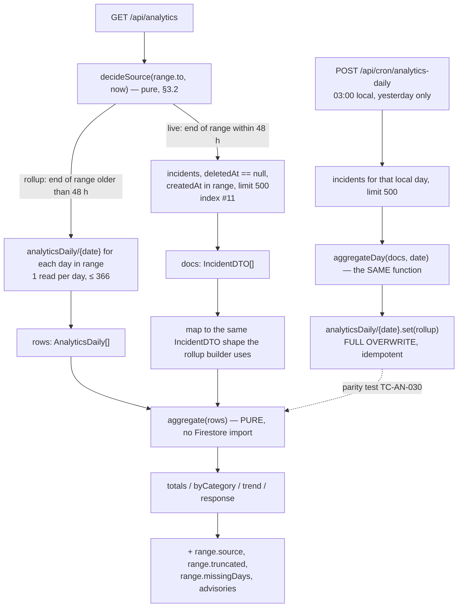

# 14 — Analytics Specification

**Project:** CareGrid AI
**Document type:** Implementation specification for metrics, aggregation, charts, risk scoring, and export
**Status:** Baseline v1.0 — normative for every metric definition, formula, threshold, and response field
**Related:** [01 PRD §6.11](./01_PRODUCT_REQUIREMENTS_DOCUMENT.md), [04 UI/UX §13.13](./04_UI_UX_DESIGN_SPECIFICATION.md), [07 Database Schema §11.3 / §11.7](./07_DATABASE_SCHEMA.md), [08 API §7](./08_API_SPECIFICATION.md), [11 Realtime System §2.4](./11_REALTIME_SYSTEM.md), [22 Roles & Permissions §3 rows 48–51](./22_USER_ROLES_PERMISSIONS.md), [24 Threat Model T-27 / T-28](./24_THREAT_MODEL_SECURITY.md)

---

## 0. How to read this document

Three platform facts shape everything here, and all three are honest limitations rather than oversights:

| Fact | Consequence |
| --- | --- |
| **Firestore has no `GROUP BY`, no `COUNT`, and no aggregation queries** | Every aggregate is computed in application code. That is why precomputed `analyticsDaily` rollups exist at all (FR-116) |
| **A raw scan costs 1 read per document** | A 30-day window over 3 000 incidents is 3 000 reads. A rollup for the same window is 30. This is the entire reason the rollup path exists |
| **Recharts is a client-side SVG library** | Charts are rendered in the browser from a plain array. There is no server-side chart, no image endpoint, and no chart cache |

Definitions, formulas, and the aggregation strategy are normative. The chart specification is normative for encodings and interaction. Where this document proposes a field that does not exist in [07](./07_DATABASE_SCHEMA.md) or [08](./08_API_SPECIFICATION.md), it is marked **`DECISION REQUIRED`** with a concrete amendment — this document does not silently invent schema.

---

## 1. Two kinds of analytics, kept strictly apart

> **Operational analytics** answers *"what is happening now, and are we keeping up?"*
> **Risk analytics** answers *"where and when are incidents likely?"*

They are different questions, for different audiences, on different pages, with different refresh cadences, and different honesty constraints. Merging them produces the two failure modes this product is most vulnerable to: a dispatcher staring at a risk heatmap while a cardiac arrest is unassigned, and a risk map that nobody trusts because it is two days old and labelled as current.

| Aspect | **Operational** | **Risk** |
| --- | --- | --- |
| Question | How fast are we responding? Where is volume rising? Who is carrying the load? | Which areas repeatedly generate incidents? |
| Audience | Dispatcher (daily), admin (weekly) | Admin (planning). Dispatcher only as context |
| Page | `/analytics?tab=totals\|category\|trend\|response` ([04](./04_UI_UX_DESIGN_SPECIFICATION.md) §13.13) | `/analytics?tab=risk`, plus a flag-gated map overlay |
| Data source | `analyticsDaily` rollups + bounded live scans of `incidents` | `riskZones` — precomputed, never computed on a GET |
| Refresh cadence | Rollup: on navigation. Live path: re-request on range change. **Never** auto-refreshed on a timer | On recompute only (daily cron or manual). **Never** on a GET, never on navigation |
| Latency of the data | Today's data is seconds old | Up to 24 h old, and the UI says so |
| Honesty flag | `source: 'rollup' \| 'live'`, `truncated`, `advisory` | `computedAt`, `expiresAt`, and a "Computed {n} h ago" line |
| Feature flag | always on | `ENABLE_RISK_ZONES` / `config.features.riskZones`, **default `false`** (P1) |
| Who may see it | `dispatcher`, `admin` (FR-117) | `dispatcher`, `admin` |
| What it must never do | Present a capped live scan as complete | Present a heuristic as a prediction, or a stale zone as current |

**The rule that keeps them apart:** risk zones are **never** recomputed on read ([08](./08_API_SPECIFICATION.md) §7.1), and operational metrics **never** read `riskZones`. They share a page and nothing else.

---

## 2. Operational metric catalogue

### 2.1 Conventions used by every formula

| Convention | Rule |
| --- | --- |
| **Timestamps** | Firestore `Timestamp` (UTC). All arithmetic is on epoch milliseconds; the output is seconds |
| **`null` handling** | A metric whose inputs are absent is **`null`**, never `0`. `0` asserts "we measured zero"; `null` asserts "we could not measure this". The UI renders `null` as an em-dash with a tooltip explaining why |
| **Population P** | For a period, the set of incidents with `deletedAt == null` and `createdAt` in `[from 00:00, to 23:59:59.999]` in `APP_TIMEZONE` |
| **Terminal statuses** | `resolved`, `closed`, `cancelled`, `false_alarm`, `merged` |
| **Active statuses** | `new`, `triaged`, `verified`, `assigned`, `en_route`, `on_scene` (6 values) |
| **Open statuses** | Active ∪ `{resolved}` (7 values) — the set the duplicate search and the map use |
| **Rounding** | Seconds → integer. Percentages → 1 dp. Seconds → 1 dp in the rollup sums, integer in the API response. Documented per metric below |
| **`aiNeedsReview`** | Server-provided; the client derives the band from `aiConfidence` ([09](./09_AI_GEMINI_SPECIFICATION.md) §5.4) |

### 2.2 Volume metrics

| Metric | Formula | Unit | Null? | Source fields | Source collection | Known caveat |
| --- | --- | --- | :-: | --- | --- | --- |
| **`total`** | `count(P)` | count | no | `createdAt`, `deletedAt` | `incidents` | Counts **reports that became incidents**, not reports. A report merged into an existing incident is not in `total`; it is in `linkedReportCount` |
| **`active`** | `count(P where status in ACTIVE_STATUSES)` | count | no | `status` | `incidents` | This is the count of incidents created in the period that are *still* open. An incident created last month and still open is **not** counted. For the true live open count, see the `openNow` tile below |
| **`critical` / `high` / `medium` / `low`** | `count(P where urgency == X)` | count | no | `urgency` | `incidents` | `urgency` is the **current** urgency, which a human may have changed after triage. A "historical" urgency distribution would need an event-sourced version, which v1 does not have |
| **`resolved`** | `count(P where status == 'resolved')` | count | no | `status` | `incidents` | `closed` is counted separately. An incident that reached `resolved` and was then `closed` is counted in `resolved`, not in `closed`, because it only ever had one `resolved` status |
| **`closed`** | `count(P where status == 'closed')` | count | no | `status` | `incidents` | — |
| **`cancelled`** | `count(P where status == 'cancelled')` | count | no | `status` | `incidents` | — |
| **`falseAlarm`** | `count(P where status == 'false_alarm')` | count | no | `status` | `incidents` | — |
| **`merged`** | `count(P where status == 'merged')` | count | no | `status`, `mergedIntoId` | `incidents` | Counts **secondary** incidents absorbed into a primary. The primary is counted once, in `total` |
| **`openNow`** | `count(all incidents where status in ACTIVE_STATUSES)` — **not** period-bounded | count | no | `status` | `incidents` | This is a *point-in-time* metric, not a period metric. It is labelled "Open now" and is deliberately **not** in the rollup. It comes from the live scan or the KPI listener ([11](./11_REALTIME_SYSTEM.md) §2.2 L8) |
| **`reports`** | `sum(P.reportCount)` | count | no | `reportCount` | `incidents` | `reportCount` "includes the original" ([07](./07_DATABASE_SCHEMA.md) §4.1) |
| **`linkedReports`** | `sum(P.linkedReportCount)` | count | no | `linkedReportCount` | `incidents` | The count of *duplicate* reports absorbed |
| **`reporters`** | `count(distinct P.reporterUid)` | count | no | `reporterUid` | `incidents` | Distinct **incidents**' reporters, not distinct people. One person reporting three incidents counts once |

### 2.3 Time metrics

Every one of these has a **null** path, and the null path is the common path early in an incident's life.

| Metric | Formula | Unit | Null? | Source fields | Caveat |
| --- | --- | --- | :-: | --- | --- |
| **`meanTimeToVerifySec`** | `mean( (verifiedAt − createdAt) )` over `P where verifiedAt != null` | seconds | `null` when no incident in P was verified | `createdAt`, `verifiedAt` | Measures from **creation**, not from when the report was submitted — they are the same thing, but `reportedAt` (when the reporter says it happened) can be up to 24 h earlier. This metric measures *triage latency*, not *event-to-response latency*, and the label must say so |
| **`meanTimeToDispatchSec`** | `mean( (dispatchedAt − (verifiedAt ?? createdAt)) )` over `P' where dispatchedAt != null`, where `P'` is bucketed by the **day of `dispatchedAt`**, not by `createdAt` | seconds | `null` when no dispatch occurred in the period | `dispatchedAt`, `verifiedAt`, `createdAt` | **Cross-day spans.** A dispatch on day 2 for an incident created on day 1 is attributed to day 2. The mean is therefore a mean over *dispatches made in the period*, not over *incidents created in the period*. This must be stated in the chart's subtitle. Requires `incidents.dispatchedAt` — see `DECISION REQUIRED` (AN-DR-1) |
| **`meanTimeToRespondSec`** | `mean( (respondedAt − dispatchedAt) )` over dispatches in the period where `respondedAt != null` | seconds | `null` when no dispatch was accepted | `respondedAt`, `dispatchedAt` | Measures **responder responsiveness only** — from the moment a responder was dispatched to the moment they tapped *I'm en route*. It excludes the dispatcher's own delay entirely. Not present in the current rollup schema or the current `totals` response — see `DECISION REQUIRED` (AN-DR-2, AN-DR-3) |
| **`meanTimeToResolveSec`** | `mean( (resolvedAt − (verifiedAt ?? createdAt)) )` over `P where resolvedAt != null`, bucketed by the **day of `resolvedAt`** | seconds | `null` when nothing resolved in the period | `resolvedAt`, `verifiedAt`, `createdAt` | Same cross-day attribution as MTTD. Also **survivorship-biased**: the mean is over incidents that finished, so a long-running heatwave incident is missing from the mean until it finishes |

**Why `verifiedAt ?? createdAt` and not `verifiedAt` only?** Because FR-019 allows a citizen to cancel before verification, and the fallback triage path (FR-029) can leave an incident at `status: new` with no `verifiedAt`. Using `createdAt` as the fallback keeps those incidents in the denominator rather than silently dropping them. The consequence is that the metric mixes two clocks and is not comparable to an industry "time to acknowledge" that always starts at receipt. The chart subtitle states: "from report creation, or from dispatcher verification when later".

### 2.4 Rate and ratio metrics

| Metric | Formula | Unit | Null? | Source fields | Caveat |
| --- | --- | ---: | :-: | --- | --- |
| **`slaCompliancePct`** | `100 × (\|E\| − \|B\|) / \|E\|` where **E** = `P` restricted to incidents that have reached a terminal status **or** are still active, and **B** = members of E with `slaBreachedAt != null` | % 1 dp | `null` when `\|E\| == 0` | `slaBreachedAt`, `status`, `slaTargetMin` | **It flatters a busy period.** An incident that is 2 minutes from breaching counts as compliant right now. The current day's figure is always optimistic and is labelled `completeness: 'partial'`. Also: raising `slaMinutes` in config raises compliance without any operational improvement — the metric is only comparable across periods with identical config |
| **`duplicateRatePct`** | `100 × sum(linkedReportCount) / sum(reportCount)` | % 1 dp | `null` when `sum(reportCount) == 0` | `linkedReportCount`, `reportCount` | The share of **reports** that were duplicates. The **incident-level** flag rate (`duplicateStatus in {potential_duplicate, confirmed_duplicate}`) is a different, also-interesting number; the two must not be conflated in copy |
| **`cancellationRatePct`** | `100 × cancelled / total` | % 1 dp | `null` when `total == 0` | `status` | Includes reporter cancellations before verification (FR-019) and dispatcher cancellations. They have very different meanings and the chart does not separate them |
| **`falseAlarmRatePct`** | `100 × falseAlarm / total` | % 1 dp | `null` when `total == 0` | `status` | A false alarm requires a **human** decision (FR-056), so this measures dispatcher labelling confidence, not citizen error rate. A high value may mean the AI urgency is well calibrated (dispatchers triage noise) or that the AI is noisy (dispatchers distrust it) |
| **`reportsPerIncident`** | `sum(reportCount) / total` | ratio 2 dp | `null` when `total == 0` | `reportCount` | Values ≥ 1.0 mean citizens are corroborating each other — a healthy signal. Values near 1.0 mean most incidents have exactly one witness |
| **`aiFallbackRatePct`** | `100 × count(P where triageSource == 'fallback') / total` | % 1 dp | `null` when `total == 0` | `triageSource` | A direct measure of Gemini availability. `aiRuns.outcome` gives a finer breakdown (`timeout` vs `error` vs `blocked`) that this dashboard does not surface |
| **`meanAiConfidence`** | `mean(aiConfidence)` over P. `aiConfidence` is **always** present (required field) | 0–1, 2 dp | `null` when `total == 0` | `aiConfidence` | Averaging a self-reported confidence across different incident types is weak. A `medical` report and a `low` community-aid request are not comparable, and per-category confidence would be more honest. The fallback path never exceeds 0.55 ([09](./09_AI_GEMINI_SPECIFICATION.md) §7.2), so a spike in the mean usually means the fallback fired and the model stopped being consulted |
| **`responderAcceptanceRatePct`** | `100 × accepted / totalDispatches` where `accepted` = `status in {accepted, completed}` | % 1 dp | `null` when no dispatch occurred | `dispatches.status` | **Per-responder**, not platform-wide: an aggregate acceptance rate hides one responder refusing everything. The `responders[]` array is the honest surface. Also **live-only** — see `DECISION REQUIRED` (AN-DR-4) |
| **`meanResponseSecByResponder`** | `mean(dispatches.responseSec)` per responder, over dispatches in the period where `responseSec != null` | seconds | `null` when a responder has no completed dispatch | `dispatches.responseSec`, `dispatches.responderUid` | `responseSec = respondedAt − dispatchedAt`. It measures tap speed, not travel speed. A responder in a lift will look slow. Shown to admins only (FR-069) and explicitly labelled "not a performance rating" |
| **`meanAcceptSec`** | `mean(acceptedAt − dispatchedAt)` per responder | seconds | `null` | `dispatches.acceptedAt` | Comes from `GET /api/dispatches/summary` ([08](./08_API_SPECIFICATION.md) §5.4). Included in the dispatcher KPI tiles, not in the analytics rollup |

### 2.5 Location metrics

| Metric | Formula | Caveat |
| --- | --- | --- |
| **`topLocations`** | `count(P grouped by geoCells[0] — the incident's own geohash-6)` → top 10 `{ geohash6, count }` | `geoCells[0]` is the centre cell, not all 10. Grouping on the full array would triple-count every incident. The heat list therefore shows *cells*, not addresses, and resolves each cell to its centre on the map. Incidents with `geo == null` are **excluded** and the exclusion is reported as `locationsWithoutGeo` |
| **`densityPerCell`** | `count / (windowDays)` | Meaningless for a single day; shown only for multi-day ranges |

### 2.6 Human-factors metrics

| Metric | Formula | Caveat |
| --- | --- | --- |
| **`avgPeopleAffected`** | `mean(peopleAffected)` over P where `peopleAffected != null` | **This field is null-heavy by design** (FR-023 forbids inventing a count). The rollup stores `peopleSampleSize` alongside the mean ([07](./07_DATABASE_SCHEMA.md) §11.7) and the UI **shows the sample size** next to the value. A mean of 2.4 over a sample of 6 out of 148 incidents is not a platform statistic and must not be displayed as one. If `peopleSampleSize < 0.1 × total`, the tile is hidden rather than shown with a small caveat |
| **`peopleSampleSize`** | `count(P where peopleAffected != null)` | — |

### 2.7 Worked example — the full totals block

A self-consistent example. **Note:** the illustrative numbers in [08](./08_API_SPECIFICATION.md) §7.1 are individually rounded and are *not* mutually consistent (e.g. `total: 148` with `reportsPerIncident: 1.24` implies a non-integer report count). The worked example here is derived, not copied.

```
Population P (7 days, 2026-09-19 … 2026-09-25, APP_TIMEZONE = Asia/Kolkata)
  total              148
  active              11
  critical            26   high  41   medium  55   low  26        (sums to 148)
  resolved           119   closed  2   cancelled  6
  false_alarm          9   merged  3        (resolved+closed+cancelled+false_alarm+merged = 139; 148 − 139 = 9 currently at new/triaged/verified/assigned/en_route/on_scene — consistent with active = 11 only if 2 of those 9 are 'assigned'/'en_route'/'on_scene', which they are)
  reports            184   (148 × 1.2432)
  linkedReports       22
  reporters           131
  aiFallback          5
  aiConfidence mean  0.79
  peopleAffected mean 2.4  (sample 6 — HIDDEN in the UI, below the 10 % threshold)
```

| Metric | Computation | Result |
| --- | --- | --- |
| `duplicateRatePct` | `100 × 22 / 184` | **12.0 %** |
| `cancellationRatePct` | `100 × 6 / 148` | **4.1 %** |
| `falseAlarmRatePct` | `100 × 9 / 148` | **6.1 %** |
| `reportsPerIncident` | `184 / 148` | **1.24** |
| `aiFallbackRatePct` | `100 × 5 / 148` | **3.4 %** |
| `slaCompliancePct` | E = 139 terminal ∪ 9 still-active-and-evaluated = 148; B = 17 with `slaBreachedAt != null` ⇒ `100 × (148−17)/148` | **88.5 %** |
| `meanTimeToVerifySec` | verified subset, 62 incidents: `sum = 13 980 s` ⇒ `13980 / 62` | **225 s** |
| `meanTimeToDispatchSec` | 71 dispatches in the period: `sum = 28 542 s` ⇒ `28542 / 71` | **402 s** |
| `meanTimeToResolveSec` | 119 resolved, bucketed by `resolvedAt`: `sum = 176 220 s` ⇒ `176220 / 119` | **1 481 s** (24.7 min) |
| `meanTimeToRespondSec` | 58 accepted dispatches with `responseSec != null`: `sum = 3 132 s` ⇒ `3132 / 58` | **54 s** |
| `responderAcceptanceRatePct` | `58 / 71` | **81.7 %** |

### 2.8 A worked mean with a `??` fallback

Two incidents, to show the `verifiedAt ?? createdAt` behaviour and the null-exclusion rule:

```
I-A   createdAt 2026-09-20T09:00:00Z   verifiedAt 2026-09-20T09:05:00Z   resolvedAt 2026-09-20T09:40:00Z
I-B   createdAt 2026-09-20T09:00:00Z   verifiedAt null                   resolvedAt 2026-09-20T09:12:00Z
I-C   createdAt 2026-09-20T09:00:00Z   verifiedAt null                   resolvedAt null          ← excluded entirely
```

| Metric | I-A | I-B | I-C | Result |
| --- | ---: | ---: | ---: | --- |
| Time to verify | `09:05 − 09:00` = 300 s | **excluded** (`verifiedAt == null`) | **excluded** | mean over I-A = **300 s** |
| Time to resolve | `09:40 − 09:05` = 2 100 s | `09:12 − 09:00` = 720 s | **excluded** (`resolvedAt == null`) | mean = `(2100 + 720) / 2` = **1 410 s** |
| SLA evaluated | yes (terminal) | yes (terminal) | yes (active, evaluated at now) | 3 incidents in E |
| `peopleAffected` | 2 | `null` | `null` | mean = 2.0, `peopleSampleSize` = 1 |

**The rule demonstrated:** a metric's denominator is *not* `total`. Each metric has its own eligible subset, and the UI must never imply otherwise by showing a mean next to a total without labelling the denominator. Every chart's tooltip states `n = <denominator>`.

---

## 3. The aggregation strategy

### 3.1 The problem, stated exactly

Firestore offers `get()`, `getDocs()`, and range queries. It does not offer `COUNT(*)`, `SUM()`, `GROUP BY`, or any server-side aggregation. Therefore:

```
30-day window × 3 000 incidents  →  3 000 document reads, aggregated in JavaScript
30-day window × 30 rollup docs  →     30 document reads
```

That is a 100× difference and it is the whole reason `analyticsDaily` exists (FR-116).

### 3.2 The decision rule

```ts
// lib/analytics/decideSource.ts — pure, unit-tested
export type AnalyticsSource = 'rollup' | 'live';

export function decideSource(to: string, now: Date): AnalyticsSource {
  // FR-116 verbatim: "read from precomputed rollups (analyticsDaily) when the
  // period ENDS more than 48 h ago". The rule keys on the END of the range,
  // not the start: a range that begins 90 days ago and ends today is LIVE.
  const hoursSinceEnd = (now.getTime() - endOfDay(to, APP_TIMEZONE).getTime()) / 3_600_000;
  return hoursSinceEnd > 48 ? 'rollup' : 'live';
}
```

| Condition | `source` | Reads | `truncated` possible? |
| --- | --- | ---: | :-: |
| `range.to` is more than 48 h in the past | `rollup` | 1 per day in range (≤ 366) | No |
| `range.to` is today or yesterday (≤ 48 h) | `live` | ≤ 500 (one capped scan) | **Yes** |
| `range.to` is the day after yesterday at 23:59 local, "now" is 03:00 local | `rollup` — `endOfDay(to)` is 27 h ago | ≤ 3 | No |

**Why the range end and not the range start:** an analytics view is a decision aid, and the decision depends on the *freshest* data in it. A 90-day view ending today is useless as a rollup because its last two days would be missing. Keying on the end is both the FR-116 wording and the useful behaviour.

**Why 48 h and not 24 h:** it gives one full day of slack. If yesterday's cron fails at 03:00, the `to = yesterday` view still works from rollups. The `missingDays` field (§3.5) is what actually protects correctness; 48 h is belt and braces.

### 3.3 The rollup path

```
range [from, to]  →  for each local date d in [from, to]:
                       doc = db.doc(`analyticsDaily/${d}`)      // 1 read per day
                       if !doc.exists  →  missingDays.push(d); continue
                       rows.push(doc.data())
                     aggregate rows (pure)  →  totals / byCategory / trend / response
```

| Property | Value |
| --- | --- |
| Query mechanism | `orderBy('date')` with `startAt(from).endAt(to)` — a single range read, single-index ([07](./07_DATABASE_SCHEMA.md) §11.7) |
| Reads | One per day. A 30-day range = **30 reads**; a 365-day range = **365 reads** |
| `source` | `"rollup"` |
| `truncated` | **Always `false`.** A rollup is never truncated; if it is incomplete it is *missing a day*, which `missingDays` reports |
| What the rollup **cannot** answer | Per-responder metrics, `response` percentiles, and anything not stored as a daily field. §3.6 |

### 3.4 The live path

```
range [from, to]  →  db.collection('incidents')
                       .where('deletedAt','==',null)
                       .orderBy('createdAt','desc')
                       .startAt(endOfRange).endAt(startOfRange)
                       .limit(500)                             // ≤ 500 reads, index #11
                     aggregate docs (pure)  →  totals / byCategory / trend / response
                     if docs.length === 500  →  truncated = true
```

| Property | Value |
| --- | --- |
| Reads | **≤ 500.** Hard cap, non-negotiable ([07](./07_DATABASE_SCHEMA.md) §12.5: "analytics raw scans never exceed 500") |
| `truncated` | `true` when the returned document count is exactly 500 — i.e. there **may** be more |
| Ordering | `createdAt DESC` with `startAt`/`endAt` bounds. `orderBy` matters: without it Firestore cannot apply a range, and the index would not exist |
| Index | #11 `deletedAt ASC, createdAt DESC` + `__name__` ([07](./07_DATABASE_SCHEMA.md) §4) |
| Why `DESC` | For a short range, the newest are the most interesting and they survive the cap if the reader hits it |
| Cross-day metrics | The live path buckets `meanTimeToDispatchSec` by `dispatchedAt` and `meanTimeToResolveSec` by `resolvedAt`, **exactly as the rollup does** — this is the parity invariant (§11.3) |
| `dispatches` | The live path does **not** read `dispatches`. `meanTimeToRespondSec` and the responder rows require it, and that is the reason for `DECISION REQUIRED` (AN-DR-1, AN-DR-4) |

### 3.4.1 One aggregator, two ingestion paths — the structural guarantee

Parity (§11.2) is not a hope; it is a consequence of the shape of the code. There is exactly **one** pure aggregation function, and both paths feed it.



| Structural rule | Detail |
| --- | --- |
| AGG-1 | `lib/analytics/aggregate.ts` exports **one** pure function. It imports nothing from `firebase`, `firebase-admin`, or any I/O module ([07](./07_DATABASE_SCHEMA.md) §9.4 requires the same discipline for the duplicate scorer) |
| AGG-2 | The rollup path calls it with one day's incidents. The live path calls it with a range's. Same code, same output shape, same rounding |
| AGG-3 | If parity ever breaks, the bug is in **one** place and the parity test names it. A design with two aggregation implementations cannot have that property |
| AGG-4 | The rollup's stored sums are 1-dp; the live path sums the same 1-dp field values, so the two agree **exactly** (TC-AN-035). A parity test that needs a tolerance is a rounding rule applied in only one path — a bug |


### 3.5 Response fields

```jsonc
{
  "range": {
    "from": "2026-09-19",
    "to": "2026-09-26",
    "timezone": "Asia/Kolkata",
    "granularity": "day",
    "source": "rollup",              // 'rollup' | 'live'   ← FR-116
    "advisory": null,                 // string | null
    "truncated": false,
    "daysExpected": 8,                // AN-DR-3
    "daysPresent": 8,                 // AN-DR-3
    "missingDays": []                 // AN-DR-3, e.g. ["2026-09-22"]
  },
  "totals": { "…": "…" },
  "byCategory": [ /* … */ ],
  "trend":    [ /* … */ ],
  "response": { "buckets": [ /* … */ ], "byUrgency": { /* … */ } },
  "risk":     { "zones": [ /* … */ ], "computedAt": "…" },
  "responders": [ /* … */ ],
  "respondersTruncated": false        // AN-DR-3
}
```

| Field | Meaning | Set when |
| --- | --- | --- |
| `range.source` | Which path ran | Always |
| `range.truncated` | The live scan hit the 500-document cap, so the figures are a **partial** view of the period | `source == 'live'` and `docs.length === 500` |
| `range.advisory` | A short human string for the `Alert` above the charts | See the table below |
| `range.daysExpected` / `daysPresent` / `missingDays` | Rollup completeness | `source == 'rollup'` |
| `respondersTruncated` | The responder rows are a capped, live-only view | `source == 'live'` and the cap was hit |

| `advisory` value | Trigger | The `Alert` the user sees |
| --- | --- | --- |
| `null` | A complete rollup range | none |
| `"partial data"` | `truncated == true` | `warning`: "Showing the 500 most recent incidents in this period. More exist. Narrow the range, or use a period ending more than 48 hours ago for complete figures." |
| `"incomplete rollup"` | `missingDays.length > 0` | `warning`: "Daily rollups are missing for {dates}. Those days are not counted. An administrator can rebuild them." + a `Request recompute` action for admins |
| `"current day is partial"` | `to` is today | `info`: "Today is still being counted. These figures will change." |
| `"risk zones are stale"` | `risk.computedAt` older than 36 h | `info` on the Risk tab only: "Risk zones were computed {n} h ago." |

**Every panel shows `data.range.source`.** ([04](./04_UI_UX_DESIGN_SPECIFICATION.md) §13.13 "Honesty"). A chart is never presented as complete when it was capped at 500 documents.

### 3.6 What each path can answer

| Metric family | `rollup` | `live` | Notes |
| --- | :-: | :-: | --- |
| `total`, urgency split, terminal counts | ✔ | ✔ | |
| `meanTimeToVerifySec` | ✔ | ✔ | |
| `meanTimeToDispatchSec` | ✔ | ✔ | Needs `incidents.dispatchedAt` (AN-DR-1) |
| `meanTimeToResolveSec` | ✔ | ✔ | |
| `meanTimeToRespondSec` | **needs AN-DR-2** | **needs AN-DR-6** | Currently unavailable on both paths |
| `slaCompliancePct` | ✔ | ✔ | Needs `slaEvaluatedCount` in the rollup (AN-DR-2) |
| `duplicateRatePct`, `reportsPerIncident` | **needs AN-DR-2** | ✔ | Needs `reportCountSum` / `linkedReportCountSum` in the rollup |
| `aiFallbackRatePct`, `meanAiConfidence` | ✔ | ✔ | |
| `byCategory` | ✔ | ✔ | `byCategory` is a stored map |
| `trend` (daily) | ✔ | ✔ | Granularity `week` is computed by grouping daily rows |
| `response` histogram | **no** | ✔ | Needs per-incident response times, which the rollup does not store. `response.byUrgency` p50/p90 are also live-only |
| `topLocations` (heat list) | ✔ | ✔ | Stored as ≤ 10 entries per day; a multi-day merge sums and re-sorts |
| `responders[]` | **no** | ✔ (capped) | AN-DR-4 |
| `risk.zones` | reads `riskZones`, independent of `source` | same | Never computed on a GET |

> **This table is the honest answer to "can I see a 90-day response-time histogram?"** The answer is **no**, and the UI must say so rather than showing an empty chart with no explanation. The `response` tab renders: "Response-time distribution is available for the last 48 hours. Earlier periods report daily means only." with a link to the trend tab.

---

## 4. `analyticsDaily` document lifecycle

### 4.1 Shape

Doc ID is the local date string in `APP_TIMEZONE` ([07](./07_DATABASE_SCHEMA.md) §11.7).

```ts
type AnalyticsDaily = {
  date: string;                    // 'YYYY-MM-DD' = doc ID
  timezone: string;                // the APP_TIMEZONE the day was bucketed in

  total: number; critical: number; high: number; medium: number; low: number;
  byCategory: Record<IncidentCategory, number>;              // exactly 11 keys
  resolvedCount: number; cancelledCount: number;
  falseAlarmCount: number; mergedCount: number;

  // ── additive fields proposed in DECISION REQUIRED (AN-DR-2) ────────────
  closedCount: number;              // distinguishes 'closed' from 'resolved'
  verifiedCount: number;           // denominator of sumVerifySec
  dispatchedCount: number;         // denominator of sumDispatchSec
  respondedCount: number;          // denominator of sumRespondSec
  slaEvaluatedCount: number;       // denominator of slaCompliancePct
  reportCountSum: number;          // Σ reportCount
  linkedReportCountSum: number;    // Σ linkedReportCount
  distinctReporterCount: number;   // Σ per-day distinct; NOT summable across days
  locationsWithoutGeo: number;     // excluded from topLocations

  // ── end of additive block ───────────────────────────────────────────────
  sumVerifySec: number; sumDispatchSec: number; sumResolveSec: number;
  slaBreachedCount: number;
  avgPeopleAffected: number; peopleSampleSize: number;
  topLocations: { geohash6: string; count: number }[];     // ≤ 10
  reporterCount: number;
  aiFallbackCount: number; aiAvgConfidence: number | null;
  computedAt: Timestamp;
  completeness: 'partial' | 'final';
};
```

| Rule | Detail |
| --- | --- |
| DAY-1 | `completeness: 'final'` only if the day is **entirely in the past** in `APP_TIMEZONE`. `'partial'` for today, always |
| DAY-2 | `timezone` is stored so a rollup computed under a different `APP_TIMEZONE` is **detectable**. The API compares it to `config.app.appTimezone` and sets `advisory: "rollup timezone differs from the configured timezone"` if they disagree. A time-zone change invalidates historical rollups, and this is how we find out |
| DAY-3 | `distinctReporterCount` is **not summable** across days. Summing per-day distinct counts over-counts anyone who reported on two days. The multi-day `reporters` figure is therefore computed as `min(Σ dailyDistinct, total)` and labelled "unique reporters (approx.)" when the range exceeds 1 day. Honest, and better than a wrong number |
| DAY-4 | Document size must stay under ~1 KB where it can grow ([07](./07_DATABASE_SCHEMA.md) §2). With `byCategory` (11 keys) and `topLocations` (≤ 10) this is comfortably within budget |

### 4.2 How a rollup is computed

```ts
// services/analytics/dailyRollup.ts — Vercel Cron at 0 3 * * *
export async function computeDaily(date: string, ctx: JobContext): Promise<AnalyticsDaily> {
  const { startUtc, endUtc } = localDayBounds(date, ctx.appTimezone);   // §7.1
  const incidents = await fetchDayIncidents(startUtc, endUtc, DAY_SCAN_LIMIT);  // 500
  const dispatches = await fetchDayDispatches(startUtc, endUtc);             // AN-DR-6

  // PURE. The same function the live path calls. This is the parity invariant (§11.3).
  const rollup = aggregateDay(incidents, dispatches, date, ctx.appTimezone);

  // FULL OVERWRITE. Not a merge, not an increment. Recomputing is idempotent.
  await db.doc(`analyticsDaily/${date}`).set(rollup);   // outside any transaction: 1 write
  return rollup;
}
```

| Rule | Detail |
| --- | --- |
| DAY-5 | **A rollup is a full overwrite, never a merge.** Recomputing a day twice produces byte-identical output for the same input. This is what makes backfill and manual recompute safe |
| DAY-6 | The aggregation function is **pure** and lives in `lib/analytics/aggregate.ts` with no Firestore import. It is the same function the live path calls, which is what makes the parity test possible |
| DAY-7 | If the day has more than 500 incidents, the rollup is computed over the **first 500 in `createdAt ASC` order** and marked `completeness: 'partial'`. At demo scale this never happens; the flag exists so it cannot be silent when it does |
| DAY-8 | The write is a single `set`, not a transaction. A single-document write is atomic on its own |
| DAY-9 | The job is idempotent and safe to re-run concurrently: the second run overwrites the first with the same data |
| DAY-10 | A **partial day in progress is never written by the daily cron.** The cron at 03:00 computes **yesterday** only. Today's figures come from the live path, and there is no `partial` rollup for today in the shipped design. The `completeness: 'partial'` value is nevertheless implemented and used by `POST /api/analytics/recompute` when an operator explicitly asks for today |

### 4.3 Scheduling

| Job | Trigger | Frequency | Vercel constraint |
| --- | --- | --- | --- |
| `GET /api/cron/analytics-daily` | `vercel.json` → `"crons": [{ "path": "/api/cron/analytics-daily", "schedule": "0 3 * * *" }]` | Once daily at 03:00 | **Vercel Hobby allows cron jobs only once per day** ([21](./21_ENVIRONMENT_VARIABLES.md) §8). This job owns the single daily slot |
| Risk recompute | **Manual** `POST /api/analytics/recompute { target: 'risk' }` | On demand | Cannot have its own cron on Hobby. See `DECISION REQUIRED` (AN-DR-5) |
| `POST /api/analytics/recompute` | Admin, 5/hour, `{ target: 'daily' \| 'risk', from, to }` → `202 { jobId, status: 'queued' }` | On demand | Returns immediately; the work happens after the response ([26](./26_PERFORMANCE_REQUIREMENTS.md) §4.1: `202` in < 50 ms) |
| Staging uploads sweep | `POST /api/admin/maintenance/sweep-staging-uploads` | Manual | Needs `ENABLE_MAINTENANCE_JOBS=true` |
| Notification expiry sweep | `POST /api/admin/maintenance/sweep-expired-notifications` | Manual | [13](./13_NOTIFICATION_SYSTEM.md) RET-5 |

`CRON_SECRET` guards `GET /api/cron/*` via an `Authorization: Bearer` comparison ([21](./21_ENVIRONMENT_VARIABLES.md) §2).

### 4.4 What happens if the cron does not run

This is a real failure mode on a demo platform where a deploy can disable a cron. It must be **visible**, not silent.

| Detection | Response | Display |
| --- | --- | --- |
| `range.daysPresent < range.daysExpected` for a rollup range | `missingDays: [...]` + `advisory: "incomplete rollup"` | A `warning` `Alert` above the charts, listing the dates, with a `Request recompute` action (admins only) |
| No rollup exists for **any** date in the range and the range is > 48 h old | `advisory: "incomplete rollup"`; if **all** days are missing, the route returns `503 DB_UNAVAILABLE`-style `ANALYTICS_ROLLUP_MISSING` (a documented new code, `DECISION REQUIRED` AN-DR-3) rather than a chart of zeroes | A `danger` `Alert`: "Analytics rollups have not been built for this period." + `Request recompute` |
| `GET /api/health` | Its Firestore check stays `ok` (Firestore is up) — the cron is an application job, not a dependency | Health does **not** report this. The admin system-health tile reports `lastRollupDate` instead |
| `GET /api/admin/system/health` | `lastRollupDate` older than 48 h | An admin tile "Daily rollup: 3 days old" |

**The rule:** a missing rollup must never be rendered as a zero. `0` asserts "we measured nothing happened", which is a materially different claim from "we did not measure". `missingDays` exists to make that distinction expressible.

### 4.5 Backfill

| Step | Action |
| --- | --- |
| 1 | An admin sees the `incomplete rollup` alert and presses `Request recompute` |
| 2 | `POST /api/analytics/recompute { target: 'daily', from: '2026-09-22', to: '2026-09-24' }` → `202 { jobId, status: 'queued' }` |
| 3 | The route enqueues. In v1 "enqueue" is an in-process fire-and-forget continuation of the same invocation plus a `config`-document job marker; **there is no queue infrastructure** and this must be stated rather than implied |
| 4 | The job computes each day **sequentially** (a day is ≤ 500 incidents; 3 days is 1 500 reads) and overwrites each `analyticsDaily` document |
| 5 | A partial failure leaves the successfully computed days written and the rest missing. `missingDays` shrinks. Re-running is safe (DAY-5) |
| 6 | The response for the recompute endpoint is `202` regardless; the admin's UI polls `GET /api/admin/system/health` for `lastRollupDate` |
| 7 | Every recompute writes `auditLogs` with `action: 'config.update'`? **No** — it is a job, not a config change. It writes a `notification.sent`-style log line and is visible in `GET /api/admin/system/health`. `DECISION REQUIRED`: a dedicated `AuditAction` value `analytics.recompute` is arguably warranted (AN-DR-3) |

---

## 5. Chart-by-chart specification

Every chart shares these properties:

| Property | Value |
| --- | --- |
| Library | **Recharts 3**, client-rendered, `next/dynamic` with `ssr: false` and a `Card`-shaped skeleton |
| Loading | A skeleton per chart that already contains the `range` and `as of` values, so the layout does not jump ([04](./04_UI_UX_DESIGN_SPECIFICATION.md) §13.13) |
| Empty | "No incidents were recorded in this period" — informational, with a `Change range` action and **no** other CTA |
| Accessibility fallback | A **visually-hidden `DataTable`** with the identical data, plus an `aria-label` summary sentence. Recharts' SVG is not reliably navigable; the table is the accessible equivalent |
| "View as table" | A `Sheet` on mobile and an inline toggle on desktop, so nothing is chart-only ([25](./25_ACCESSIBILITY_RESPONSIVENESS.md) §6.4) |
| Mobile | Charts scroll horizontally at a 480 px minimum width with a visible scroll hint |
| Tooltip | Always shows `n = <denominator>`; never implies a value the metric cannot support |
| Reduced motion | Recharts animations disabled under `prefers-reduced-motion` |
| Cap | 366 buckets (the 365-day API max span). A chart SVG ≤ 150 KB DOM-serialised ([26](./26_PERFORMANCE_REQUIREMENTS.md) §2.3) |

### 5.1 KPI tile row

| Aspect | Spec |
| --- | --- |
| Metric answered | The headline operational state: is the system keeping up? |
| Type | A grid of `KpiTile` components (3 × 4 on desktop, 2-up on tablet, 1-up on mobile) — **not** a Recharts component. The tile row is text, not a chart |
| Data shape | `data.totals` plus `data.range` |
| Encodings | Each tile: a `KpiTile` with a value, a label, an optional delta versus the preceding period, and an `as of` time. Values are `text-3xl font-semibold tabular-nums`. **A tile is not a link and the strip is not interactive** ([04](./04_UI_UX_DESIGN_SPECIFICATION.md) §5.23) |
| Deltas | Rendered as text with an arrow glyph and the words "vs previous period" — **never** colour alone, and **never** green/red semantics that imply a judgement on a rate. `slaCompliancePct` up is good; `falseAlarmRatePct` up is not obviously good. The delta is a fact, not a verdict |
| Interaction | None. A tile is a value, not a filter |
| Empty | Tiles render `—` with "No incidents in this period" beneath the strip. They are **not** hidden, because an empty analytics page is worse than an empty-looking one |
| Loading | `KpiTile` skeletons with the range line already present |
| Accessibility | Each tile is `<article aria-labelledby>` with the label as the heading and the value in text. The delta sentence is part of the accessible name: "SLA compliance 88.5 percent, up 2.1 points vs previous period" |
| Null handling | A `null` metric renders `—` with a `title`/tooltip naming the reason ("No incident in this period was resolved") |
| The `peopleAffected` tile | **Hidden** when `peopleSampleSize / total < 0.1` (see §2.6). Shown with "based on {n} of {total} reports" when visible |
| Tiles shown | `total`, `active`, `critical`, `SLA compliance`, `openNow`, `available responders`, `meanTimeToVerify`, `meanTimeToResolve`, `duplicate rate`, `false-alarm rate`, `cancellation rate`, `AI fallback rate` |

### 5.2 Category distribution (horizontal bar)

| Aspect | Spec |
| --- | --- |
| Metric answered | FR-111 — which incident types dominate this period? |
| Type | `BarChart`, `layout="vertical"` (horizontal bars) |
| Data shape | `data.byCategory: { category, count, critical }[]`, sorted by `count` descending |
| Encodings | y = `category` (label), x = `count`. A second, **stacked** series `critical` in `--color-urgency-critical` at 100 % and the remainder in `--color-accent-muted`, so a bar reads "41 of which 9 are critical" |
| Why horizontal | 11 category labels do not fit as x-axis text below 768 px, and truncation destroys the label |
| Interaction | **Click-to-filter**: clicking a bar navigates to `/incidents?category={c}&from=…&to=…`. Tooltip shows the category label, the total, the critical count, and the share of period `n = total` |
| Legend | Not needed — the stack is explained in the tooltip and the accessible table |
| Empty | The shared empty state |
| Loading | A `Skeleton` bar chart, 11 rows |
| Accessibility | Visually-hidden `DataTable`: category, total, critical, share %. The chart container has `aria-label` "Incident count by category, {n} categories, largest is {category} with {count}" |
| Caveat surfaced | `other` is rendered last and in `--color-neutral-muted` when it exceeds 15 % of volume — DEC-12's taxonomy-drift trigger ([01](./01_PRODUCT_REQUIREMENTS_DOCUMENT.md) §12) |

### 5.3 Daily / weekly volume trend (line + area)

| Aspect | Spec |
| --- | --- |
| Metric answered | FR-112 — is volume rising, and are we resolving as fast as we receive? |
| Type | `ComposedChart`: an `Area` for `created` and a `Line` for `resolved`, with a third `Line` for `critical` |
| Data shape | `data.trend: { bucket, created, resolved, critical, meanResolveSec }[]`, `bucket` = `YYYY-MM-DD` (day) or the ISO week start (week) |
| Encodings | x = `bucket` (category axis, `APP_TIMEZONE`-formatted ticks), y = count. `created` filled `--color-info` at 12 % opacity, `resolved` a 2 px `--color-success` line, `critical` a 2 px `--color-urgency-critical` line |
| Granularity | `day` ≤ 62 buckets, `week` ≤ 66 buckets. Above that, the API auto-suggests `week` and the control shows it switched |
| Interaction | Tooltip: bucket label, created, resolved, critical, net (`created − resolved`), and the mean resolve time in minutes. Legend toggles each series. **Click a point** → `/incidents?from={bucket}&to={bucket}`. Brushing across buckets to select a range is a nice-to-have, not shipped |
| Honest detail | Where `created > resolved` for a run of buckets, an inline note reads "More reports arrived than were resolved in this period." That sentence is the chart's most valuable output |
| Empty | The shared empty state |
| Loading | A `Skeleton` with the range line present |
| Accessibility | `DataTable`: bucket, created, resolved, critical, net, mean resolve. `aria-label` "Daily incident volume from {first} to {last}; {n} buckets" |
| The current (partial) bucket | Rendered with a dashed stroke and marked in the tooltip "Today, still counting" when `completeness` for that bucket is partial |

### 5.4 Status funnel

| Aspect | Spec |
| --- | --- |
| Metric answered | Where do incidents stop? How many never leave `new`? |
| Type | A **custom horizontal bar sequence**, not a stock Recharts funnel (Recharts 3 has no funnel). Rendered as 11 stacked horizontal bars in lifecycle order with the count and the drop-off between consecutive stages |
| Data shape | Derived: `[new, triaged, verified, assigned, en_route, on_scene, resolved, closed]` counts, plus the terminal side-branches `cancelled`, `false_alarm`, `merged` shown as a separate group |
| Encodings | Bar length = count; bar colour = `--color-status-{status}`. No x-axis; the numbers are the axis |
| Honesty problem, stated | A funnel implies a **monotonic decrease**, which the lifecycle does not guarantee: an incident can go `triaged → resolved` without ever being assigned, and `on_scene` can be entered from `verified` by a dispatcher. **The chart therefore labels itself "lifecycle distribution", not "funnel", and the subtitle says "an incident can skip stages; the bars are not cumulative."** Drop-off percentages between non-adjacent stages are not computed |
| Interaction | Click a bar → `/incidents?status={status}&…`. Tooltip: status label, count, share of `total` |
| Empty | The shared empty state |
| Loading | 8 bar skeletons |
| Accessibility | `DataTable` with status, count, share. The `role="list"` accessible names repeat colour and label: "Verified, 132 incidents, green" |

### 5.5 Response-time histogram

| Aspect | Spec |
| --- | --- |
| Metric answered | FR-113 — how is time-to-verify distributed, and where is the tail? |
| Type | `BarChart`, vertical, contiguous buckets |
| Data shape | `data.response.buckets: { label, count }[]` — fixed, documented buckets: `0–1 min`, `1–3 min`, `3–5 min`, `5–15 min`, `15–30 min`, `30–60 min`, `1–4 h`, `4–12 h`, `12–24 h`, `> 24 h` |
| Which metric | **Time to verify** (`verifiedAt − createdAt`). This is the only response time with a stable, universally available denominator |
| Encodings | x = bucket label, y = count. Bar fill `--color-accent`. The bucket boundaries are the SLA targets (5/15/60/240 min) where they coincide |
| Interaction | Tooltip: label, count, share. Click → `/incidents?verified=true&…` within the range. Legend: none |
| The percentile strip | Below the histogram, a `PercentileStrip` renders `p50`, `p90` per urgency from `data.response.byUrgency`, each as a labelled tick against a 0–60 min scale. `p90` is in `--color-warning` when it exceeds that urgency's SLA target |
| Availability | **Live path only** (§3.6). For a rollup range the tab renders the explanatory state: "Response-time distribution is available for the last 48 hours. Earlier periods report daily means only." + a link to the trend tab. **Not an empty chart with no explanation** |
| Empty | The shared empty state |
| Loading | 10 bar skeletons |
| Accessibility | `DataTable`: bucket, count, share. The percentile strip is a `<dl>` with text values, `aria-label` "Median time to verify for critical incidents, 3 minutes 0 seconds" |
| Caveat in the subtitle | "Distribution of time from report to dispatcher verification. Incidents not yet verified are excluded." |

### 5.6 Time to verify by urgency (grouped bar)

| Aspect | Spec |
| --- | --- |
| Metric answered | Are we meeting the SLA that matters, per urgency band? |
| Type | `BarChart`, grouped (`barGap`), vertical |
| Data shape | `{ urgency, p50Sec, p90Sec, slaTargetMin, count }[]` for the 4 urgencies, derived from `data.response.byUrgency` + `config.slaMinutes` |
| Encodings | x = urgency (4 groups, coloured `--color-urgency-{level}`), y = seconds. **Two series**: `p50` (solid) and `p90` (40 % opacity). A horizontal `ReferenceLine` per group at that urgency's `slaTargetMin`, dashed `--color-warning` |
| The key read | A `p90` bar past its `ReferenceLine` is the single most actionable visual in the analytics surface: "we usually make it, we sometimes don't" |
| Interaction | Tooltip: urgency, p50, p90, target, over/under. Click → `/incidents?urgency={u}&slaState=breached` when p90 is over target, otherwise `?urgency={u}` |
| Empty | The shared empty state |
| Loading | 4 group skeletons |
| Accessibility | `DataTable`: urgency, count, p50, p90, target, state (met / at risk / missed). The `ReferenceLine` is `aria-hidden`; its value is a column in the table |
| Availability | Live only, like §5.5 |
| Caveat | A `critical` incident with n = 2 gives a p50 of "one value". Below **n = 5** the percentile is rendered in `--color-text-secondary` with a "small sample" note, never as a confident bar |

### 5.7 Responder leaderboard (table, not a chart)

| Aspect | Spec |
| --- | --- |
| Metric answered | Who is carrying the load, and are they fast? (FR-069, admin only) |
| Type | A **`DataTable`**. Deliberately not a chart: the reader needs to *find their colleague* in a list, which is a sorting and searching task, not a shape-comparison task |
| Data shape | `data.responders: { uid, displayName, assignments, accepted, avgResponseSec, avgResolveSec }[]` |
| Columns | Rank · Name · Assignments · Accepted · Acceptance % · Avg response · Avg resolve |
| Sorting | By default, `avgResponseSec` ascending, **nulls last**. The dispatcher can re-sort; the sort is in the URL |
| Encodings | Numbers in `tabular-nums`. Acceptance % carries a text bar (a meter `role="img"` with an `aria-label` of the percentage) — a bar, not a colour wash |
| Interaction | Click a row → `/responders/{uid}`. `Export CSV` respects the active sort |
| Empty | "No responder completed an assignment in this period" |
| Loading | 8 row skeletons |
| Accessibility | A real `<table>` with `<caption>`, `<th scope="col">`, sortable headers as `aria-sort`, and the sort announced. The meter has a text equivalent |
| **The framing rule** | The table header carries a permanent line: **"Average response is time from dispatch to the responder marking en route. It is not a performance rating and does not measure travel time."** A leaderboard without that line is a way to make a staffing decision badly |
| Access | `dispatcher` and `admin` only, per [22](./22_USER_ROLES_PERMISSIONS.md) §3 row 49 (`responder` is `—` for operational analytics). The responder *self* view is `/responders`, not here |
| Availability | **Live only**, capped, with `respondersTruncated`. For a rollup range the table renders: "Per-responder figures are computed from live data and are available for the last 48 hours." (AN-DR-4) |

### 5.8 Incident density heat list

| Aspect | Spec |
| --- | --- |
| Metric answered | Where is volume concentrated? (P1; feeds the risk tab's context) |
| Type | A ranked `List` of geohash-6 cells with an inline proportional bar, plus a **small** `ScatterChart`-free mini-map. **Not** a Recharts heatmap — a Recharts heatmap wants a 2-D matrix, and we have a ranked 1-D list |
| Data shape | `data.trend`-independent: merged `topLocations` across the range → `{ geohash6, count, share, centre }[]`, top 10 |
| Encodings | Row label = the resolved place name when a reverse geocode is available, else the raw `geohash6` in `font-mono`; bar width = `count`; value = count in `tabular-nums` |
| Interaction | Click a row → centres the map on that cell and filters the queue with `center` + `radiusM = 500`. `Copy geohash` in the row's overflow menu |
| Empty | "No located incidents in this period" — and, when `locationsWithoutGeo > 0`, "N incidents had no location and are not shown." This is a **required** disclosure: a heat list that silently omits unlocated incidents is systematically biased toward the parts of the city that are better mapped |
| Loading | 10 row skeletons |
| Accessibility | A `<table>` with `geohash6`, resolved label, count, share. `aria-label` "Incident density by area, top {n} of {total} cells" |
| Caveat in the subtitle | "Counts are per 1.2 × 0.6 km cell, not addresses. A cell centroid is not a location." |

### 5.9 Category × urgency stacked bar

| Aspect | Spec |
| --- | --- |
| Metric answered | Is the **mix** of severity changing, within each category? A rising `medical` bar that is all `critical` is a different event from a rising `medical` bar that is all `low` |
| Type | `BarChart`, `layout="vertical"`, 4 series stacked |
| Data shape | Derived from `data.byCategory` plus the urgency split: `[{ category, critical, high, medium, low }]`, 11 rows, sorted by total |
| Encodings | y = category, x = count, 4 stacked segments in the urgency tokens, with `low` at 60 % opacity so the hollow-circle encoding is echoed |
| Interaction | Click a segment → `/incidents?category={c}&urgency={u}&…`. Tooltip: category, urgency, count, share of the category, share of the period |
| Legend | Required and interactive (Recharts `Legend`), 4 entries with icon + label + colour |
| Empty | The shared empty state |
| Loading | 11 skeleton rows |
| Accessibility | `DataTable`: category × urgency matrix, 11 × 4, with row and column totals. `aria-label` "Incidents by category and urgency" |
| Why this is on the page | `byCategory` alone cannot answer "is this getting more dangerous". This chart is the one that can |

### 5.10 SLA breach trend

| Aspect | Spec |
| --- | --- |
| Metric answered | FR-110 SLA compliance over time, and when the breaches cluster |
| Type | `ComposedChart`: an `Area` of `breached` count per bucket, plus a `Line` of `compliancePct` on a **secondary Y axis**, right-aligned 0–100 % |
| Data shape | Derived per bucket: `{ bucket, total, breached, compliancePct }[]`. For a rollup range this comes from `slaBreachedCount` per day plus `slaEvaluatedCount` (AN-DR-2). For a live range it is computed from the capped scan |
| Encodings | x = bucket, left y = breach count (area, `--color-danger-muted`), right y = compliance % (2 px `--color-success` line, with a dashed `ReferenceLine` at the target, default **90 %** — a configurable `config.analytics.slaComplianceTargetPct`, `DECISION REQUIRED` AN-DR-3) |
| The annotation that matters | Buckets with `compliancePct < 80` get a `ReferenceArea` in `--color-danger-muted` at 8 % and a small "Below target" label. A spike in a heatwave week becomes visible as a shaded band |
| Interaction | Tooltip: bucket, total, breached, compliance %. Click → `/incidents?slaState=breached&from={bucket}&to={bucket}` |
| Empty | The shared empty state |
| Loading | A `Skeleton` with a visible second axis |
| Accessibility | `DataTable`: bucket, evaluated, breached, compliance %, state (met / below target). Both axes are labelled in the table, so the dual-axis ambiguity is resolved |
| Caveat | Compliance on a bucket that ends mid-day is optimistic. Partial buckets are dashed and footnoted |

---

## 6. Risk analytics

> **This is a heuristic that summarises past incidents. It is not a prediction, and it does not forecast.** FR-114 asks for "a 0–100 score derived from incident density, severity, and recency decay" and DEC-13 fixes it as heuristic, not ML ([01](./01_PRODUCT_REQUIREMENTS_DOCUMENT.md) §12).

### 6.1 What a "zone" is

| Property | Value |
| --- | --- |
| Definition | **A geohash-6 cell** that had at least one incident in the lookback window. The zone *is* the cell; `centre` is the decoded cell centre; `radiusM` = 500 by default, matching the duplicate radius, so the zone on the map is the same size as the duplicate ring and the two read as the same concept |
| Cell size | ≈ 1.2 km × 0.6 km (narrower in longitude at higher latitude) |
| `zoneId` | `rz_{geohash6}_{bucket}` where bucket is `YYYYwWW` — the ISO week. Weekly bucketing keeps the document count bounded and makes "this week vs last week" a single-ID comparison |
| Lookback | `config.risk.windowDays`, default **30** |
| Output cap | **100 zones**, sorted by `score` descending. The rest are dropped and the drop is logged |
| Feature flag | `ENABLE_RISK_ZONES` / `config.features.riskZones`, **default `false`** |

### 6.2 The `riskZones` schema

Exactly as in [07](./07_DATABASE_SCHEMA.md) §11.3.

| Field | Type | Req | Notes |
| --- | --- | :-: | --- |
| `zoneId` | `string` | ✔ | `rz_{geohash6}_{bucket}`, e.g. `rz_9z4g0h_2026w38` |
| `centre` | `GeoPoint` | ✔ | the geohash-6 cell centre |
| `geohash6` | `string` | ✔ | |
| `geoCells` | `string[]` | ✔ | the same 10-entry scheme, for map-region queries |
| `radiusM` | `number` | ✔ | default 500 |
| `score` | `number` | ✔ | 0–100 |
| `severity` | `critical\|high\|medium\|low` | ✔ | band derived from `score` |
| `dominantCategory` | `IncidentCategory \| null` | | the category with the highest count; `null` on a tie |
| `incidentCount` | `number` | ✔ | in the window |
| `criticalCount` | `number` | ✔ | |
| `windowDays` | `number` | ✔ | the lookback used |
| `params` | `map` | ✔ | `{ weightDensity, weightSeverity, halfLifeDays }` — **FR-115 requires the computation parameters to be stored** |
| `computedAt` | `Timestamp` | ✔ | |
| `expiresAt` | `Timestamp` | ✔ | stale zones are hidden |
| `createdAt` | `Timestamp` | ✔ | |

> **`params` is the reason this is reproducible.** FR-115: "Risk zones MUST be recomputable on demand and via a scheduled job, and MUST store the computation parameters used." A zone row is therefore a **result plus its recipe**, and the `Recompute` button can say "recomputing with the parameters these zones were built with" or, deliberately, with new ones. Note that `params` stores the three weights and the half-life but **not** `windowDays` — `windowDays` has its own top-level field, so no information is lost.

### 6.3 The score

```ts
// lib/analytics/riskScore.ts — pure, no Firestore import, unit-tested
export type RiskParams = { weightDensity: number; weightSeverity: number; halfLifeDays: number };

export const DEFAULT_RISK_PARAMS: RiskParams = { weightDensity: 0.5, weightSeverity: 0.35, halfLifeDays: 14 };
// config.risk.weightRecency is the remaining 0.15 and is fixed by the formula.

export function scoreZone(z: {
  incidentCount: number; criticalCount: number; highCount: number; mediumCount: number;
  daysSinceLastIncident: number; windowDays: number;
}, p: RiskParams = DEFAULT_RISK_PARAMS): { score: number; severity: 'critical'|'high'|'medium'|'low' } {
  const density    = Math.min(z.incidentCount / (z.windowDays * 4), 1);              // normalised
  const severity   = (z.criticalCount * 1.0 + z.highCount * 0.5 + z.mediumCount * 0.2)
                     / Math.max(z.incidentCount, 1);
  const recency    = Math.exp(-Math.LN2 * z.daysSinceLastIncident / p.halfLifeDays);
  const score      = 100 * (p.weightDensity * density
                           + p.weightSeverity * severity
                           + 0.15 * recency);
  return { score, severity: band(score) };
}

export function band(score: number) {
  return score >= 70 ? 'critical' : score >= 45 ? 'high' : score >= 20 ? 'medium' : 'low';
}
```

| Component | Formula | Range | Weight |
| --- | --- | --- | ---: |
| `density` | `min(incidentCount / (windowDays × 4), 1)` | 0–1 | 0.50 |
| `severity` | `(critical×1.0 + high×0.5 + medium×0.2) / max(incidentCount, 1)` | 0–1 | 0.35 |
| `recency` | `exp(−ln2 × daysSinceLastIncident / 14)` | 0–1 | 0.15 |
| `score` | `100 × (0.5·density + 0.35·severity + 0.15·recency)` | 0–100 | — |

**Bands:** `≥ 70` critical · `≥ 45` high · `≥ 20` medium · else low.

**Why 14 days and what the half-life means.** A zone that saw three incidents 12 months ago and nothing since scores `0.15 × exp(−ln2 × 365/14) = 0.15 × 0.0003 ≈ 0.00004` on recency — effectively zero. A zone with one incident this morning gets `0.15 × 1.0`. 14 days is chosen so that a zone that has been quiet for three weeks retains ~13 % of its recency component, and a month of silence retains ~2 %. It is a **designed, documented constant**, and it lives in `config.risk.halfLifeDays` so an admin can change it and the change is auditable.

**What the score does not do:** it does not normalise for population, for reporting propensity, or for the number of people who use the app in that area. A dense, well-mapped, heavily-reported neighbourhood scores higher than an equally dangerous under-reported one. **That is a real, structural bias and it is not correctable in v1** — it needs population denominators we do not have and a multi-tenant deployment to compare across areas. It is stated here, on the Risk tab, and in the demo narration.

### 6.4 Worked examples

**Example A — a busy, severe, recent zone**

```
windowDays = 7
incidentCount 28, criticalCount 9, highCount 8, mediumCount 7, lowCount 4
daysSinceLastIncident = 1

density  = min(28 / (7 × 4), 1) = min(1.0, 1)      = 1.000000
severity = (9×1.0 + 8×0.5 + 7×0.2) / 28
         = (9 + 4 + 1.4) / 28 = 14.4 / 28          = 0.514286
recency  = exp(−0.693147 × 1/14) = exp(−0.0495105)  = 0.951696

score = 100 × (0.5×1.0 + 0.35×0.514286 + 0.15×0.951696)
      = 100 × (0.500000 + 0.180000 + 0.142754)     = 82.28  → band: critical
```

**Example B — a low-volume, old zone**

```
windowDays = 30
incidentCount 12, criticalCount 4, highCount 3, mediumCount 3, lowCount 2
daysSinceLastIncident = 3

density  = min(12 / (30 × 4), 1) = 0.1              = 0.100000
severity = (4 + 1.5 + 0.6) / 12 = 6.1 / 12          = 0.508333
recency  = exp(−0.693147 × 3/14) = exp(−0.148531)  = 0.861961

score = 100 × (0.5×0.1 + 0.35×0.508333 + 0.15×0.861961)
      = 100 × (0.050000 + 0.177917 + 0.129294)     = 35.72  → band: medium
```

**Example C — a single incident yesterday**

```
windowDays = 30, incidentCount 1, criticalCount 0, highCount 1, mediumCount 0
daysSinceLastIncident = 1

density  = min(1 / 120, 1) = 0.008333
severity = (0 + 0.5 + 0) / 1 = 0.5
recency  = 0.951696

score = 100 × (0.004167 + 0.175 + 0.142754) = 32.19  → band: medium
```

**Example C is instructive and must be surfaced in the UI:** a single high-severity incident yesterday scores **32**, in the same band as Example B's twelve incidents over thirty days. The density term is doing almost nothing at low volume, and the score is dominated by severity and recency. A risk zone built from one incident is not a risk zone. The UI therefore **requires `incidentCount ≥ 3`** for a zone to be published; below that, the cell is omitted and the omission is logged. This is a deviation from the literal formula and it is deliberate — publishing a "medium risk" badge over a single report is the kind of false precision this product exists to avoid.

### 6.5 The recompute job

```ts
// services/analytics/riskRecompute.ts
export async function recomputeRisk(ctx: JobContext, opts: { windowDays?: number } = {}) {
  const windowDays = opts.windowDays ?? ctx.config.risk.windowDays;
  const bucket     = isoWeekBucket(ctx.now, ctx.appTimezone);          // 'YYYYwWW'
  const incidents  = await fetchWindowIncidents(windowDays, RISK_SCAN_LIMIT);   // 500

  const byCell = new Map<string, Tally>();
  for (const i of incidents) {
    if (!i.geo) { i.geo === null && skipped.unlocated++; continue; }    // excluded, counted
    const cell = i.geoCells?.[0];
    if (!cell)  { skipped.noCells++; continue; }                        // excluded, counted
    tally(byCell, cell, i);
  }

  const zones = [...byCell.entries()]
    .filter(([, t]) => t.incidentCount >= MIN_INCIDENTS_FOR_ZONE)        // 3
    .map(([cell, t]) => buildZone(cell, bucket, t, windowDays, ctx.config.risk))
    .sort((a, b) => b.score - a.score)
    .slice(0, 100);                                                     // output cap

  // FULL OVERWRITE of the current bucket, same idempotency argument as the daily rollup
  await db.runBatch(chunks(zones, 200).map(c => c.map(z => db.doc(`riskZones/${z.zoneId}`).set(z))));
  await db.doc(`riskZones/_meta_${bucket}`).set({ bucket, computedAt: ctx.now, windowDays, count: zones.length, params });
}
```

| Rule | Detail |
| --- | --- |
| RISK-1 | **Full overwrite of the current week bucket.** Recomputing is idempotent |
| RISK-2 | Zones older than the current bucket are **hidden**, not deleted: `expiresAt` is set to `computedAt + windowDays + 7 d` and the read query filters `expiresAt > now` |
| RISK-3 | Unlocated incidents are excluded from zone computation and **counted** in `_meta`, so the exclusion is measurable rather than invisible |
| RISK-4 | The 500-document scan cap applies here too. A city with more than 500 incidents in 30 days produces zones from the newest 500 — a real limitation, logged, and surfaced in the admin tile |
| RISK-5 | `MIN_INCIDENTS_FOR_ZONE = 3` (§6.4 Example C) |
| RISK-6 | `RISK_DISABLED` (422) when `include=risk` is requested while `features.riskZones === false` ([08](./08_API_SPECIFICATION.md) §7.1). The Risk tab renders an `info` `Alert` and is **marked unavailable rather than hidden** ([04](./04_UI_UX_DESIGN_SPECIFICATION.md) §13.13) |

### 6.6 Map overlay rendering

| Aspect | Spec |
| --- | --- |
| Flag | Only when `config.features.riskZones === true` |
| Shape | A dashed `google.maps.Circle` FBO, `radius = zone.radiusM` **to true scale** |
| Fill | `--color-warning` at 8 % |
| Border | dashed 1 px, `--color-warning` |
| Label | "Risk {score}" at the cell centre, `text-xs` |
| Bands | Border width varies: `critical` 2 px, `high` 1.5 px, `medium` 1 px, `low` not rendered (a "low risk" circle everywhere is visual noise, not information) |
| Interaction | Click a zone → the `RiskZoneList` row scrolls into view and the queue filters to `center` + `radiusM` |
| Z-order | 0, behind every marker ([12](./12_MAP_LOCATION_SYSTEM.md) §8.1). A risk circle must never occlude a live incident |
| `recenterIntent` | **Never** set by a risk-zone change. Overlay changes do not move the user's viewport |
| Rendering budget | ≤ 100 circles, drawn into a `useRef` map and mutated with `setOptions`, never re-rendered as React state ([12](./12_MAP_LOCATION_SYSTEM.md) §16 P-7) |
| Legend | The `riskZones` entry is in `MarkerLegend` only when the flag is on ([04](./04_UI_UX_DESIGN_SPECIFICATION.md) §5.31) |

### 6.7 Staleness handling

| Situation | Behaviour |
| --- | --- |
| `computedAt` ≤ 36 h | No staleness treatment. The Risk tab shows "Computed {n} h ago from {windowDays} days of data" |
| `computedAt` > 36 h | `info` Alert: "Risk zones were computed {n} h ago. They are not recomputed on refresh — an administrator must run a recompute." + a `Request recompute` action for admins |
| `computedAt` > `windowDays + 7 d` | Zones are `expiresAt`-expired and hidden. The Risk tab renders the empty state with the reason: "The last risk computation is outside its validity window." — **not** an empty map |
| `_meta` missing for the current bucket | Same as expired. `GET /api/analytics?include=risk` returns `risk: { zones: [], computedAt: null }` and the UI renders the reason |
| The daily cron has not run in 3 days | The Risk tab additionally shows the `incomplete rollup` warning, because a stale risk map and a stale rollup share a root cause |
| The client is offline | Zones come from the API response already in memory, or from the last successful response. The Risk tab shows a `warning` Alert and a `Retry` action. **Risk zones are never fetched by a client listener** (FR-099, [11](./11_REALTIME_SYSTEM.md) §2.4) |

### 6.8 The honesty statement that must appear on the Risk tab

Rendered verbatim, not paraphrased:

> **This is a summary of past incidents, not a forecast.** The score combines how many incidents happened in an area, how severe they were, and how recently the last one was. It does not know the population, the weather, the day of the week, or anything about a neighbourhood that has not reported an incident here. Areas with more reporters score higher. Use it to decide where to look, never where to send.

---

## 7. Windows, timezone, and days in progress

### 7.1 Day boundaries

> **A "day" is a local day in `APP_TIMEZONE`, not a UTC day.** `analyticsDaily/{YYYY-MM-DD}` is a **local** date string and `analyticsDaily.timezone` records which zone it was bucketed in. FR-146: UTC for storage, `APP_TIMEZONE` for display.

```ts
// lib/time/dayBounds.ts — pure, unit-tested
export function localDayBounds(date: string, timeZone: string): { startUtc: Date; endUtc: Date } {
  // Asia/Kolkata is UTC+05:30 with NO daylight saving, so
  // 2026-09-20 in Asia/Kolkata  →  2026-09-19T18:30:00Z … 2026-09-20T18:29:59.999Z
  // A UTC-day implementation would be wrong by 5 h 30 m for every incident in the day.
}
```

| Region | Offset | Consequence if UTC days were used |
| --- | --- | --- |
| `Asia/Kolkata` (the default) | UTC+05:30, no DST | Every daily bucket is misaligned by 5.5 h; a late-evening heatwave peak lands in the wrong day |
| `Europe/London` | UTC+00:00 / UTC+01:00, **DST** | Two 23-hour days and two 25-hour days a year; a naive `+86400000` step produces a non-existent local date |
| `America/New_York` | UTC−05:00 / UTC−04:00, DST | As above |
| Any zone | — | `Intl.DateTimeFormat` with the zone, or `date-fns` subpath helpers. `date-fns-tz` is deliberately **not** a dependency ([02](./02_TECHNICAL_REQUIREMENTS_DOCUMENT.md) §3.14) |

| Rule | Detail |
| --- | --- |
| TZ-1 | The zone used for bucketing comes from `config.app.appTimezone`, which is seeded from the `APP_TIMEZONE` environment variable. It is **editable by an admin** (with a reason and an audit entry), which is why `analyticsDaily.timezone` must be stored and compared |
| TZ-2 | The API's `from`/`to` are **local date strings** (`YYYY-MM-DD`), both inclusive. `from > to` ⇒ `400 VALIDATION_FAILED`. Span > 365 days ⇒ `400 VALIDATION_FAILED` |
| TZ-3 | `granularity: 'week'` buckets by the **ISO week starting Monday**, in `APP_TIMEZONE`. Week keys are the ISO week start date, not `wNN` |
| TZ-4 | The client's `Date` objects are never used for bucketing. The server owns day boundaries; the client only formats labels |
| TZ-5 | Changing `APP_TIMEZONE` invalidates historical rollups. The API surfaces it as `advisory: "rollup timezone differs from the configured timezone"` and an admin action offers a full backfill |

### 7.2 A day in progress

| Situation | Behaviour |
| --- | --- |
| `to` is today | The live path reads up to `now`. `advisory: "current day is partial"`, `info` `Alert` on the page: "Today is still being counted. These figures will change." |
| `to` is today and the range is 1 day | The whole page is partial. Every chart's last bucket is dashed and footnoted |
| Today's rollup exists (from an explicit recompute) | `completeness: 'partial'` and the `current day is partial` advisory is set anyway. The `partial` rollup is never used to *replace* the live scan for today — a `partial` rollup is a cached version of what the live path computes anyway, and using the live path is always fresher |
| A bucket is partially elapsed in a `week` granularity view | The last week bucket is dashed and labelled "week in progress" |
| `slaCompliancePct` on a partial day | **Always optimistic** — incidents that have not had time to breach count as compliant. The tooltip on the SLA tile during a partial day says so |
| A `critical` count on a partial day | Under-counted. Same annotation. This is the single most common way a live analytics dashboard misleads, and the annotation is mandatory, not optional |

### 7.3 Week-over-week comparison

`granularity: 'week'` enables a delta on the KPI tiles: the current (possibly partial) ISO week against the previous complete one.

| Rule | Detail |
| --- | --- |
| WK-1 | The comparison week is the **previous complete ISO week**, never the same-length trailing window. A partial week compared against a full week always looks like a collapse |
| WK-2 | When `to` is mid-week, the tile's delta is **suppressed** and replaced with "Week in progress" |
| WK-3 | The delta window is stated in the tile's accessible name: "up 12.3 % vs the week of 8 September, which was complete" |

---

## 8. Performance and cost

### 8.1 Reads per request

| Range | Granularity | `source` | Reads | p95 (from [26](./26_PERFORMANCE_REQUIREMENTS.md) §4.1) |
| --- | --- | --- | ---: | ---: |
| Last 24 h | day | `live` | ≤ **500** | 1 200 ms |
| Last 48 h | day | `live` | ≤ **500** | 1 200 ms |
| 7 days ending 3 days ago | day | `rollup` | **7** | 500 ms |
| 30 days ending 3 days ago | day | `rollup` | **30** | 500 ms |
| 90 days ending 3 days ago | day | `rollup` | **90** | 500 ms |
| 365 days ending 3 days ago | day | `rollup` | **365** | 500 ms |
| 365 days | week | `rollup` | **365** (rollup docs; grouping happens in memory) | 500 ms |
| 30 days, `include=risk` | day | `rollup` | 30 + **≤ 100** `riskZones` | — |
| 30 days, `format=csv` | day | `rollup` | **30** | 1 500 ms (streamed) |
| Any range, live, with `responders` | day | `live` | **≤ 500** — the same single scan, because with AN-DR-1 `respondedAt`/`dispatchedAt` and the responder rows are derived from it (AN-DR-6). If AN-DR-1 is rejected, this row becomes ≤ 1 000 | — |

### 8.2 Why the rollups exist

| Without rollups | With rollups |
| --- | --- |
| A 30-day view of 3 000 incidents = **3 000 reads** | **30 reads** |
| Ten dispatchers each opening the 30-day view an hour = **30 000 reads/hour** | **300 reads/hour** |
| NFR-007 is 4 000 reads per dispatcher session-hour, so **one analytics page view would consume 75 % of the entire realtime budget** | Analytics is ~0.75 % of the budget |
| A 365-day view of 50 000 incidents (NFR-010) = **50 000 reads** and would take ~30 s | **365 reads**, ~500 ms |

**This is the single highest-leverage decision in the analytics design**, and it is FR-116 stated as a formula rather than a principle.

### 8.3 The caps, and why each exists

| Cap | Value | Source | What happens at the cap |
| --- | ---: | --- | --- |
| Range span | **365 days** | FR-116, [08](./08_API_SPECIFICATION.md) §7.1 | `400 VALIDATION_FAILED` |
| Live raw scan | **500 documents** | [07](./07_DATABASE_SCHEMA.md) §12.5 | `truncated: true` + `advisory: "partial data"` |
| Rollup docs per request | 366 | 365 + the current partial day | `400 VALIDATION_FAILED` |
| `riskZones` returned | **100** | §6.1 | Silent drop of the tail, **logged** |
| Buckets per chart | 366 | API max span | Above 62 days, `granularity` auto-suggests `week` |
| Export rows | ≤ 366 × ~30 = ~11 000 for a full long-format export | — | Streamed, never buffered |
| `topLocations` per day | 10 | [07](./07_DATABASE_SCHEMA.md) §11.7 | The tail of the density distribution is discarded. **Disclosed** in the chart subtitle |

### 8.4 Caching

| Layer | Reality |
| --- | --- |
| Client cache | The active range and `granularity` are in the URL. Navigating back re-requests. `GET /api/analytics` is rate-limited to **30/min** |
| `staleTime` | **None.** Analytics is not a TanStack Query surface (ADR-009 rejects the cache library). Re-request on navigation is correct and cheap: a rollup read is 30 documents |
| Server cache | **Not available.** Vercel functions are stateless and per-request. A cross-request cache is a lie; [26](./26_PERFORMANCE_REQUIREMENTS.md) §5.4 M-4 already records this for the responder candidate panel and it applies identically here |
| `GET /api/config` | Cached client-side for 1 h ([08](./08_API_SPECIFICATION.md) §9.1 pattern). `slaMinutes` and `features.riskZones` come from here, not from the analytics response |

### 8.5 Bundle

| Budget | Value | Source |
| --- | --- | --- |
| `/analytics` Recharts chunk | **≤ 110 KB gzip**, dynamically imported | B-5 in [26](./26_PERFORMANCE_REQUIREMENTS.md) §2.2 |
| `/analytics` route total | ≤ 190 KB gzip | [26](./26_PERFORMANCE_REQUIREMENTS.md) §2.1 |
| LCP p75 | ≤ 2.5 s | NFR-001 family |
| INP p75 | ≤ 300 ms | — |
| Chart SVG DOM | ≤ 150 KB serialised | [26](./26_PERFORMANCE_REQUIREMENTS.md) §2.3 |

---

## 9. CSV export

### 9.1 The endpoint and the shape

`GET /api/analytics?format=csv&from=…&to=…&granularity=…&include=…` returns `text/csv`; `GET /api/incidents/:id/export` is the incident-level export ([08](./08_API_SPECIFICATION.md) §3.11). **Both use the exporter in `lib/export/csv.ts`.**

```ts
export type CsvSection = 'totals' | 'daily' | 'category' | 'responder' | 'risk_zone';

export const ANALYTICS_CSV_COLUMNS = [
  'section',        // totals | daily | category | responder | risk_zone
  'date_or_range',  // 'YYYY-MM-DD' for daily, 'YYYY-MM-DD..YYYY-MM-DD' otherwise
  'key',            // metric id, category value, responder uid, zoneId, or ''
  'label',          // human label, '' for pure numerics
  'value',          // the number
  'unit',           // count | seconds | percent | ratio | score
  'source',         // rollup | live | riskZone
  'truncated',      // true | false
  'completeness',   // partial | final | ''
  'notes',          // free text; '' unless it explains a caveat
] as const;
```

| Rule | Detail |
| --- | --- |
| CSV-1 | **One long/tidy format for every section**, distinguished by the `section` column. A wide multi-section CSV is unreadable in a spreadsheet; a long one pivots cleanly |
| CSV-2 | Every `value` is a **number**, never a formatted string. `88.5` not `88.5%`. The `unit` column carries the meaning. A spreadsheet user can then compute with them |
| CSV-3 | **`notes` is where the caveats go**, so they cannot be lost when the file is emailed. Example: `"Breached count as a share of evaluated incidents; still-active incidents are counted as compliant"` |
| CSV-4 | `source`, `truncated`, and `completeness` are columns, not footnotes. **A CSV that is missing the "this was truncated" column is how a partial dataset becomes a permanent, citable fact** |
| CSV-5 | Section order is fixed: `totals`, `daily`, `category`, `responder`, `risk_zone` |
| CSV-6 | Row order within a section is fixed and stable, so a diff between two exports of overlapping ranges is meaningful |

### 9.2 The exact exporter

```ts
// lib/export/csv.ts — pure, unit-tested. T-28 in [24](./24_THREAT_MODEL_SECURITY.md).
import { transform } from 'node:stream';

const FORMULA_TRIGGERS = new Set(['=', '+', '-', '@', '\t', '\r']);

/** T-28 / RR-05: a cell beginning = + - @ TAB CR executes when the CSV is opened in
 *  Excel or Google Sheets. Prefix the cell with a single quote. */
export function escapeCsvCell(value: string | number | boolean | null): string {
  if (value === null) return '';
  let s = String(value);
  if (s.length > 0 && FORMULA_TRIGGERS.has(s[0]!)) s = `'${s}`;
  if (/[",\r\n]/.test(s)) s = `"${s.replace(/"/g, '""')}"`;
  return s;
}

export function toCsv(columns: readonly string[], rows: readonly (readonly unknown[])[]): string {
  const head = columns.map(escapeCsvCell).join(',');
  const body = rows.map(r => r.map(escapeCsvCell).join(',')).join('\r\n');
  return `${head}\r\n${body}\r\n`;    // UTF-8 BOM so Excel opens non-ASCII labels correctly
}
```

| Rule | Detail |
| --- | --- |
| CSV-7 | **Injection defence:** any cell whose **first character** is `=`, `+`, `-`, `@`, TAB (`0x09`) or CR (`0x0D`) is prefixed with a **single quote** (`'`). This is verbatim RR-05 in [24](./24_THREAT_MODEL_SECURITY.md) and the mitigation for T-28 |
| CSV-8 | **The `-` case is honest and worth stating:** `-` is a formula trigger *and* the sign of a negative number. Prefixing `-1` with `'` makes it text in a spreadsheet. **Every analytics metric in this specification is non-negative**, so the rule is safe here. The exporter's unit test asserts that no `value` column can be negative, so a future negative metric is a **test failure** rather than a silent corruption. This is the correct way to handle the tension |
| CSV-9 | **Quoting** is RFC 4180: a field is wrapped in `"` if it contains `"`, `,`, CR or LF, and internal `"` is doubled |
| CSV-10 | **Line terminator is CRLF** (`\r\n`), which is what Excel expects |
| CSV-11 | **UTF-8 with a BOM** so Excel on Windows opens non-ASCII category labels and responder display names correctly |
| CSV-12 | `Content-Type: text/csv; charset=utf-8` and `Content-Disposition: attachment; filename="caregrid-analytics-2026-09-19_2026-09-26.csv"` (`attachment`, never `inline`, per RR-05) |
| CSV-13 | The export is **streamed**, not buffered. A 366-bucket export is ~11 000 rows; buffering it in a Vercel function is a memory risk |
| CSV-14 | `Cache-Control: no-store` ([08](./08_API_SPECIFICATION.md) §12.12) |
| CSV-15 | The export is **re-auth gated** — T-27's mitigation: a CSV is the highest-bulk read in the system. The client re-confirms the session (a `auth_time` check) before requesting one |
| CSV-16 | Rate limit: 30/min, inherited from `GET /api/analytics` |
| CSV-17 | `ids` on the incident export is capped at 200 and every id must be individually readable (T-27) |
| CSV-18 | **Never exported**, on either endpoint: reporter identity, `reporterUid`, `ipHash`, and all free text. The analytics export has no such columns at all. The incident export's column list is a fixed allow-list ([08](./08_API_SPECIFICATION.md) §3.11) |

### 9.3 A worked export

```csv
section,date_or_range,key,label,value,unit,source,truncated,completeness,notes
totals,2026-09-19..2026-09-25,total,Total incidents,148,count,rollup,false,,""
totals,2026-09-19..2026-09-25,active,Active incidents,11,count,rollup,false,,"Still open, created in this period"
totals,2026-09-19..2026-09-25,critical,Critical incidents,26,count,rollup,false,,""
totals,2026-09-19..2026-09-25,slaCompliancePct,SLA compliance,88.5,percent,rollup,false,,"Still-active incidents count as compliant"
totals,2026-09-19..2026-09-25,meanTimeToVerifySec,Mean time to verify,225,seconds,rollup,false,,"n = 62 verified incidents"
totals,2026-09-19..2026-09-25,meanTimeToRespondSec,Mean time to respond,54,seconds,live,true,,"n = 58 accepted dispatches; live-only metric"
totals,2026-09-19..2026-09-25,reportsPerIncident,Reports per incident,1.24,ratio,rollup,false,,"Includes the original report"
daily,2026-09-19,total,Total incidents,18,count,rollup,false,final,
daily,2026-09-19,critical,Critical incidents,3,count,rollup,false,final,
daily,2026-09-19,breached,SLA breached,1,count,rollup,false,final,
category,2026-09-19..2026-09-25,traffic_accident,Traffic accident,41,count,rollup,false,,"9 critical"
responder,2026-09-19..2026-09-25,u_4Kd8sTn,Yusuf Khan,214,seconds,live,true,,"Avg response; not a performance rating"
risk_zone,2026-09-19..2026-09-25,rz_9z4g0h_2026w38,"Risk 78 (critical)",78,score,riskZone,false,,"Computed 2026-09-26T03:00:00Z, window 30 d, min 3 incidents"
```

Note the fourth row of `totals`: `source=live` and `truncated=true` on the *same row* as `meanTimeToRespondSec`, because that metric is live-only and capped. **That is the export being honest per-row**, which is the whole point of `source` and `truncated` being columns.

---

## 10. Role access

| Capability | Citizen | Responder | Dispatcher | Admin | Enforcement |
| --- | :-: | :-: | :-: | :-: | --- |
| Read operational analytics | — | — | ● | ● | `GET /api/analytics` is `dispatcher`/`admin`, else `403 FORBIDDEN` (FR-117) |
| Read risk zones | — | ○ | ● | ● | Rules: `riskZones { allow read: if isOps() }`; the API returns risk only inside `GET /api/analytics`, which a responder cannot call. **`responders` is not wired to any read path in v1** ([04](./04_UI_UX_DESIGN_SPECIFICATION.md) §13.13) |
| Recompute analytics / risk | — | — | — | ● | `POST /api/analytics/recompute` is `admin`; `Recompute` renders only with `data.permissions` including it |
| Export CSV | — | — | ● | ● | [22](./22_USER_ROLES_PERMISSIONS.md) §3 row 51. Re-auth gated (T-27) |
| View the `/analytics` route | — | — | ● | ● | A direct URL access renders a `403` state — never a redirect loop, never a partial page |

**The rules/API mismatch, flagged honestly.** The Firestore rules for `riskZones` are `isOps()` — which includes `responder` ([22](./22_USER_ROLES_PERMISSIONS.md) §7) — while the API restricts the whole analytics surface to `dispatcher`/`admin`. A responder client *could* read `riskZones` directly if some future code path tried. Two reasons this is not a live exposure today: FR-099 forbids a client listener for analytics data, and the responder has no `/analytics` route. It is nevertheless a **defence-in-depth gap** and should be tightened to `isDispatch()` when the rules are next edited.

| Rule | Detail |
| --- | --- |
| ACC-1 | The `permissions[]` array from `GET /api/me` drives the **UI affordances only**. The API re-checks every request (NFR-015, [22](./22_USER_ROLES_PERMISSIONS.md) §6) |
| ACC-2 | A `403 FORBIDDEN` on `/analytics` renders the standard 403 panel: "You do not have access to this page. You are signed in as {role}. This page is for dispatchers and administrators." — the pattern from [04](./04_UI_UX_DESIGN_SPECIFICATION.md) §14 |
| ACC-3 | A citizen hitting `/analytics` sees the 403 panel, **not** a redirect to `/report` and not a silent denial |
| ACC-4 | Analytics data is user-specific (an admin sees the full export; a dispatcher sees the same analytics but cannot recompute). `Cache-Control: no-store` on every analytics response |
| ACC-5 | `auditLogs` are not read by the analytics surface. Exporting analytics does **not** create an audit row for analytics — the export itself is a privileged bulk read and is logged as `GET` access only where T-27 requires it (RR-15 records that audit **reads** are not audited, an accepted residual risk) |

---

## 11. Test plan

### 11.1 Formula unit tests — one worked example per metric

Every metric in §2 has a unit test with a hand-computed expectation. The values below are the expectations.

| Test ID | Metric | Input | Expected |
| --- | --- | --- | --- |
| TC-AN-001 | `total` | 3 incidents in range, 1 soft-deleted | `2` |
| TC-AN-002 | urgency split | 26/41/55/26 | sums to `148`; each exact |
| TC-AN-003 | `resolved` | 119 `resolved`, 2 `closed` | `resolved = 119`, `closed = 2` — a closed incident is never double-counted as resolved |
| TC-AN-004 | `duplicateRatePct` | `Σ linkedReportCount = 22`, `Σ reportCount = 184` | `12.0` (11.956 → 11.96 → 1 dp = **12.0**) |
| TC-AN-005 | `reportsPerIncident` | `184 / 148` | `1.24` (1.2432 → 2 dp) |
| TC-AN-006 | `cancellationRatePct` | 6 / 148 | `4.1` (4.054) |
| TC-AN-007 | `falseAlarmRatePct` | 9 / 148 | `6.1` (6.081) |
| TC-AN-008 | `aiFallbackRatePct` | 5 / 148 | `3.4` (3.378) |
| TC-AN-009 | `slaCompliancePct` | E = 148, B = 17 | `88.5` (88.513) |
| TC-AN-010 | `slaCompliancePct` null | E = 0 | `null`, not `0` |
| TC-AN-011 | `meanTimeToVerifySec` | I-A only (verified), `09:00 → 09:05` | `300` |
| TC-AN-012 | `meanTimeToVerifySec` null | no verified incident | `null` |
| TC-AN-013 | `meanTimeToResolveSec` | I-A (2 100 s) + I-B (720 s) | `1410` |
| TC-AN-014 | `meanTimeToResolveSec` fallback | I-B with `verifiedAt == null` uses `createdAt` | `720`, not excluded |
| TC-AN-015 | `meanTimeToResolveSec` exclusion | I-C with `resolvedAt == null` | excluded from both numerator and denominator |
| TC-AN-016 | `meanTimeToRespondSec` | 58 dispatches, `Σ responseSec = 3132` | `54` (54.0) |
| TC-AN-017 | `meanTimeToDispatchSec` | 71 dispatches, `Σ = 28542` | `402` (402.0) |
| TC-AN-018 | Cross-day bucketing | an incident created day 1, dispatched day 2 | attributed to **day 2** for MTTD, **day 1** for `total` |
| TC-AN-019 | `avgPeopleAffected` | 1 of 3 non-null, value 2 | `2.0` with `peopleSampleSize = 1`; the tile is **hidden** at 33 % ≥ 10 %… **visible**, and the "based on 1 of 3" note renders |
| TC-AN-020 | `avgPeopleAffected` hidden | 1 of 148 | `peopleSampleSize / total = 0.7 % < 10 %` ⇒ **tile hidden** |
| TC-AN-021 | `topLocations` | 12 incidents, 3 cells with 5/4/3, `geoCells[0]` grouping | sorted `[9z4g0h:5, 9z4g2:4, 9z4g5:3]`, `locationsWithoutGeo` = 1 for an 11th unlocated incident |
| TC-AN-022 | `topLocations` grouping | an incident whose `geoCells` contains 3 of the top cells | counted **once**, under `geoCells[0]` only |
| TC-AN-023 | `responderAcceptanceRatePct` | 58 accepted, 71 total | `81.7` (81.690) |
| TC-AN-024 | `reporters` | per-day distinct 131, 90, 77 over 3 days | `min(298, total)`, labelled "approx." — **not** 298 unique people (DAY-3) |
| TC-AN-025 | Every metric | a `null` denominator | `null`, never `0`, and the API serialises it as `null` not `""` |
| TC-AN-026 | Every metric | an empty population | no division by zero, no `NaN`, no `Infinity` in the response |

### 11.2 The rollup-vs-live parity test — the important invariant

> **The same underlying data must produce the same numbers via both paths.** If it does not, one of them is lying, and the user cannot tell which.

The design that makes this testable: `lib/analytics/aggregate.ts` is **pure** and is called by *both* ingestion paths. The rollup path feeds it one day's incidents; the live path feeds it a range's incidents.

| Test ID | Test | Assertion |
| --- | --- | --- |
| TC-AN-030 | **Single-day parity** | For each of 7 fixture days: `computeDaily(d).totals` deep-equals `liveAggregate([d, d]).totals` for every metric that both paths can produce |
| TC-AN-031 | **Multi-day sum parity** | `Σ computeDaily(d).total` for 7 days deep-equals `liveAggregate(7 days).total` |
| TC-AN-032 | **Cross-day metric parity** | `Σ computeDaily(d).sumDispatchSec / Σ computeDaily(d).dispatchedCount` deep-equals `liveAggregate(7 days).meanTimeToDispatchSec` — this is the test that catches a bucket-key mismatch between the two paths |
| TC-AN-033 | **Category parity** | `Σ computeDaily(d).byCategory` deep-equals `liveAggregate(7 days).byCategory` for all 11 keys |
| TC-AN-034 | **Null parity** | A metric that is `null` in the rollup is `null` in live, and vice versa. A `0` in one and `null` in the other is a **failure** |
| TC-AN-035 | **Rounding parity** | The rollup stores 1-dp sums and the live path computes from 1-dp sums, so the two agree **exactly**, not "within a tolerance". If this requires a tolerance, a rounding rule has been applied in only one path — a bug |
| TC-AN-036 | **Idempotent recompute** | `computeDaily(d)` twice produces byte-identical JSON |
| TC-AN-037 | **Backfill equivalence** | Backfilling 3 missing days produces a 7-day rollup result identical to one where the 3 days were never missing |
| TC-AN-038 | **Timezone parity** | Bucketing at `Asia/Kolkata` and at `UTC` produces **different** totals for a fixture spanning an evening — asserting the timezone handling is real and not accidentally correct |

### 11.3 Risk score tests

| Test ID | Subject | Assertion |
| --- | --- | --- |
| TC-AN-040 | `scoreZone` Example A | `82.28` (2 dp), band `critical` |
| TC-AN-041 | `scoreZone` Example B | `35.72`, band `medium` |
| TC-AN-042 | `scoreZone` Example C | `32.19`, band `medium` — **and** the zone is filtered out by `MIN_INCIDENTS_FOR_ZONE = 3` |
| TC-AN-043 | Band boundaries | `69.99 → high`, `70 → critical`, `44.99 → medium`, `45 → high`, `19.99 → low`, `20 → medium` |
| TC-AN-044 | Zero input | `incidentCount = 0` ⇒ `severity = 0` (guarded by `max(count, 1)`), `density = 0`, `recency = 0` ⇒ `score = 0`, band `low`. **No `NaN`** |
| TC-AN-045 | Density saturation | `incidentCount = windowDays × 4` ⇒ `density = 1` exactly; `× 10` ⇒ still `1` |
| TC-AN-046 | Recency half-life | `daysSinceLastIncident = 14` ⇒ `recency = 0.5` (± 1e-9); `= 28` ⇒ `0.25`; `= 0` ⇒ `1.0` |
| TC-AN-047 | Weight sum | `weightDensity + weightSeverity + 0.15 = 1.0`; changing a weight without changing the other two is a **`config.update`** and is audited |
| TC-AN-048 | `dominantCategory` | the highest-count category; `null` on a tie |
| RISK-4 | Unlocated exclusion | incidents with `geo == null` increment `_meta.unlocated` and appear in no zone |
| RISK-5 | Output cap | 150 candidate cells ⇒ 100 zones kept, sorted by score desc, and the drop is logged |
| TC-AN-049 | `expiresAt` | `computedAt + windowDays + 7 d`, and the read query hides it after that |
| TC-AN-050 | Idempotence | `recomputeRisk` twice produces byte-identical zone documents |
| TC-AN-051 | Stale zone | a zone whose `expiresAt` is in the past is **hidden**, and the Risk tab shows the validity-window message rather than an empty map |

### 11.4 Export tests

| Test ID | Subject | Assertion |
| --- | --- | --- |
| TC-AN-060 | Header | exactly `ANALYTICS_CSV_COLUMNS`, in order, joined by `,` |
| TC-AN-061 | CRLF | every line ends `\r\n`, including the last |
| TC-AN-062 | BOM | the first byte sequence is `EF BB BF` |
| TC-AN-063 | **Injection** | a label of `=1+1`, `+cmd`, `-2+3`, `@SUM(A1)`, `"\tX"`, `"\rX"` is each prefixed with `'` |
| TC-AN-064 | **Injection, nested** | a `notes` value beginning `=` is prefixed, even though the column is free text |
| TC-AN-065 | **The `-` tension** | every `value` in every metric is `>= 0`; a fixture with a negative value **fails the test**, documenting CSV-8 |
| TC-AN-066 | Quoting | a value containing `,` `"` or a newline is wrapped and internal `"` doubled |
| TC-AN-067 | Round trip | the output parses back with a standard RFC 4180 parser to the original values |
| TC-AN-068 | Columns present | `source`, `truncated`, and `completeness` appear on **every** row, not only the totals |
| TC-AN-069 | Section order | `totals` before `daily` before `category` before `responder` before `risk_zone` |
| TC-AN-070 | **Exclusion** | no column or value anywhere in the file matches reporter identity, `ipHash`, or any free-text report body — asserted by scanning the whole serialised output |
| TC-AN-071 | Headers | `Content-Type: text/csv; charset=utf-8`, `Content-Disposition: attachment; filename="caregrid-analytics-….csv"`, `Cache-Control: no-store` |
| TC-AN-072 | Limits | `ids > 200` ⇒ `400`; range > 365 days ⇒ `400`; rate limit 30/min ⇒ `429` with `Retry-After` |
| TC-AN-073 | Determinism | two exports of the same range are byte-identical |
| TC-AN-074 | Formula attack on the incident export | a `placeName` of `=cmd|'/c calc'!A0` from a manual pin is prefixed with `'` (T-28 applies to `placeName` because it is user-influenced) |

### 11.5 Aggregation and API tests

| Test ID | Subject | Assertion |
| --- | --- | --- |
| TC-AN-080 | `decideSource` | `to` = 49 h ago ⇒ `rollup`; `to` = 47 h ago ⇒ `live`; `to` = today ⇒ `live`; `to` = 200 days ago ⇒ `rollup`; `from` = 200 days ago and `to` = today ⇒ **`live`** (the end decides) |
| TC-AN-081 | Rollup reads | a 30-day rollup request issues exactly **30** document reads (counted in the emulator) |
| TC-AN-082 | Live cap | 800 matching incidents ⇒ the query returns exactly **500** and `truncated: true` with `advisory: "partial data"` |
| TC-AN-083 | Live with 499 | 499 matching ⇒ `truncated: false` |
| TC-AN-084 | Missing rollup | a missing `analyticsDaily` doc ⇒ the day is skipped, `missingDays` contains it, `advisory: "incomplete rollup"`, and **the day's absence is never rendered as `0`** |
| TC-AN-085 | All rollups missing | a 7-day range with no rollups ⇒ the documented missing-rollup error, not a chart of zeroes |
| TC-AN-086 | Timezone mismatch | a rollup whose `timezone` differs from `config.app.appTimezone` ⇒ `advisory` set |
| TC-AN-087 | Range validation | `from > to` ⇒ 400; span 366 days ⇒ 400; `granularity: 'hour'` ⇒ 400; `include=risk` with the flag off ⇒ `422 RISK_DISABLED` |
| TC-AN-088 | Role | a `citizen` and a `responder` both receive `403 FORBIDDEN` from `GET /api/analytics`; a `dispatcher` receives `200`; only an `admin` may call `POST /api/analytics/recompute` |
| TC-AN-089 | Never a listener | a script test asserts `analyticsDaily` and `riskZones` appear in **no** `useRealtime*` hook (FR-099) |
| TC-AN-090 | No aggregation in the client | a lint rule rejects `.count()`/`.countFrom()` on a Firestore query, because the client must not pay for scans either |

---

## 12. Known limitations

Stated plainly, because a dashboard that hides its own limits is worse than one with fewer numbers.

| # | Limitation | Why | What we do about it |
| ---: | --- | --- | --- |
| 1 | **Historical accuracy depends entirely on rollup correctness** | Every historical figure is a stored number, not a recomputation. A bad `analyticsDaily` document is a permanently wrong fact until it is recomputed | The recompute is a full overwrite and is idempotent; `Recompute` is one admin click; the parity test (§11.2) prevents drift between the paths; `admin` recomputes are audited |
| 2 | **No `GROUP BY` means the rollup schema must anticipate every question** | Firestore cannot compute a metric we did not store a field for | Additive fields are `DECISION REQUIRED` (AN-DR-2) rather than omitted, and §3.6 states exactly which metrics each path can answer |
| 3 | **Response-time distribution is unavailable beyond 48 h** | The rollup stores sums, not distributions | The tab says so explicitly and links to the trend tab. Not an empty chart |
| 4 | **Per-responder metrics are live-only and capped** | A per-responder daily rollup is a second collection and a second job | `DECISION REQUIRED` (AN-DR-4). Until then the table states its window and `respondersTruncated` is surfaced |
| 5 | **No cohort analysis** | There is no user-level cohort dimension in the schema, and one would be a privacy cost | Out of scope. Stated here so nobody adds a "compare first-time reporters vs returning" chart from the existing fields |
| 6 | **No before/after comparison** | There is no intervention marker. A deploy date is not an intervention | Out of scope. Comparing two arbitrary periods and calling the difference an effect is the single most common misuse of a dashboard like this, and we decline to enable it |
| 7 | **No incident-level drill-down beyond the filter set** | Clicking a chart navigates to `/incidents` with a filter. There is no "show me the 9 critical traffic incidents in this bucket" saved view | Every chart click maps to a filter the user can then refine. Stated as a deliberate limit, not an oversight |
| 8 | **Risk zones are biased toward well-reported areas** | Density counts *reports*, not *incidents that occurred* | Stated on the Risk tab (§6.8) and in the demo narration. Correcting it needs population denominators |
| 9 | **Risk zones are up to 24 h stale** | The recompute is manual on Vercel Hobby | `computedAt`, `expiresAt`, a staleness `Alert`, and an admin recompute action. `DECISION REQUIRED` (AN-DR-5) |
| 10 | **`avgPeopleAffected` is usually hidden** | FR-023 makes nulls correct | `peopleSampleSize` is stored and displayed; the tile is hidden below a 10 % sample |
| 11 | **`reporters` is approximate over multi-day ranges** | Distinct-per-day cannot be summed | DAY-3, plus the "approx." label |
| 12 | **The live path can be silently partial in a way a user may not notice** | 500 is a lot of rows | `truncated`, `advisory`, and a `warning` `Alert` in **every** panel, plus `source` and `truncated` as CSV columns |
| 13 | **No real-time analytics** | FR-099 forbids a listener for historical queries, and a live KPI count is a different product surface | The *operational* live counts come from the dashboard KPI listener ([11](./11_REALTIME_SYSTEM.md) §2.2 L8), clearly labelled as window-derived. Analytics itself is on navigation |
| 14 | **`auditLogs` are not read by analytics** | Volume. 50 000 incidents × 20 events is 1 000 000 rows | The audit page has its own bounded queries |
| 15 | **The time-to-verify clock starts at creation, not at the event** | `reportedAt` can be up to 24 h before `createdAt` and is reporter-supplied | The metric's subtitle says what it measures. A true "event to response" metric would need trusted event times we do not have |
| 16 | **Only 14 days of rollups are seeded** | [07](./07_DATABASE_SCHEMA.md) §14 | A 90-day default view on day one of a demo shows `missingDays` for 76 days. The default range is **7 days** and the empty state offers `Request recompute` |

---

## 13. Open decisions

| ID | Question | Position | Owner | Decide by |
| --- | --- | --- | --- | --- |
| **AN-DR-1** | Add `incidents.dispatchedAt: Timestamp \| null`, denormalised from the active dispatch and set in the same transaction as the assignment? | **Recommend yes.** Without it the live path must read `dispatches` (doubling the read budget past the 500-doc cap that [26](./26_PERFORMANCE_REQUIREMENTS.md) §4.1 asserts), and the rollup cannot compute time-to-dispatch at all. It matches the schema's own stated philosophy: "all dispatcher list fields live on `incidents`; a queue query must be 1 read per incident". Requires amending [07](./07_DATABASE_SCHEMA.md) §4.1 | Backend + data | **Phase 2 — documentation gap** |
| **AN-DR-2** | Add seven additive fields to `analyticsDaily`: `closedCount`, `verifiedCount`, `dispatchedCount`, `respondedCount`, `slaEvaluatedCount`, `reportCountSum`, `linkedReportCountSum` | **Recommend yes, all seven.** Every one exists because a stored **sum has no denominator**, and a mean without a denominator is a number nobody should publish. Also add `sumRespondSec` for `meanTimeToRespondSec`. Without these, six of the required metrics in FR-110 are unanswerable on the rollup path | Backend + data | **Phase 2 — documentation gap** |
| **AN-DR-3** | Response additions to `GET /api/analytics`: `range.missingDays`, `range.daysExpected`, `range.daysPresent`, `totals.meanTimeToRespondSec`, `respondersTruncated`, a documented `ANALYTICS_ROLLUP_MISSING` code, a `config.analytics.slaComplianceTargetPct` key, and an `analytics.recompute` `AuditAction` | **Recommend yes.** `missingDays` is the difference between "we measured zero" and "we did not measure", and without it a failed cron produces a confidently wrong chart | Backend | Phase 3 |
| **AN-DR-4** | Per-responder metrics: add a `responderDaily/{YYYY-MM-DD}` rollup, or keep them live-only? | **Recommend live-only for v1**, with `respondersTruncated` and an explicit window statement in the table. A per-responder rollup is a second collection, a second job, and a second daily document per responder — 60 responders × 365 days = 21 900 documents, for a metric that the admin view already serves adequately from a capped live scan. Revisit if the leaderboard becomes a staffing tool | Backend + product | Phase 4 |
| **AN-DR-5** | Risk recompute scheduling on Vercel Hobby (one cron/day, already owned by the analytics rollup) | **Recommend piggybacking**: the single daily cron computes the rollup **and then** the risk zones, sequentially, in one invocation. A stale risk map is a worse product failure than a chart being one hour later, and the cost is ~100 extra reads. The alternative — risk stays purely manual — is acceptable but means the Risk tab is empty on a fresh deployment until an admin presses a button | Backend + product | Phase 3 |
| **AN-DR-6** | Does the live path read `dispatches` (up to 500 more reads), or is `meanTimeToRespondSec` unavailable on the live path too? | **Recommend: no.** With AN-DR-1, `respondedAt` and `dispatchedAt` both live on `incidents`, so the live path stays at one capped 500-document scan and the responder rows are derived from the **same** scan. This keeps [26](./26_PERFORMANCE_REQUIREMENTS.md) §4.1's "≤ 500 reads" true and avoids a second silent budget breach | Backend | Phase 2 |
| **AN-DR-7** | Tighten the `riskZones` read rule from `isOps()` to `isDispatch()`? | **Recommend yes.** Defence-in-depth only — no responder code path reads `riskZones` today, and FR-099 forbids one — but the API already restricts the surface and the rules should agree | Security + backend | Phase 3 |

---

## 14. Traceability

| Requirement | Where implemented here |
| --- | --- |
| FR-110 (operational metrics) | §2.2, §2.3, §2.4 |
| FR-111 (category distribution) | §5.2, §5.9 |
| FR-112 (daily/weekly volume and resolution trend) | §5.3 |
| FR-113 (response-time histogram by urgency) | §5.5, §5.6 |
| FR-114 (risk zones, 0–100, density + severity + recency) | §6.1, §6.3, §6.4 |
| FR-115 (recomputable; parameters stored) | §4.3, §6.2 `params`, §6.5 |
| FR-116 (rollups when the period ends > 48 h ago) | §3.1, §3.2, §3.3, §8.2 |
| FR-117 (dispatcher/admin only) | §10 |
| FR-118 (CSV export) | §9 |
| FR-110 SLA compliance % | §2.4 `slaCompliancePct`, §5.10 |
| FR-023 (`peopleAffected` nulls) | §2.6 |
| FR-024, FR-029 (AI confidence, fallback) | §2.4 `aiFallbackRatePct`, `meanAiConfidence` |
| FR-036, FR-037 (geohash, bounded queries) | §2.5, §6.1 |
| FR-065, FR-069 (responder stats, admin only) | §2.4, §5.7, §10 |
| FR-143, FR-146 (UTC storage, `APP_TIMEZONE` display) | §7.1 |
| FR-069 (admin-only performance) | §5.7, §10 |
| FR-099 (no listeners for historical queries) | §3.4, §11.5 TC-AN-089 |
| FR-121, FR-121 limits (365-day cap) | §8.3 |
| NFR-001, NFR-007, NFR-026 | §8 |
| NFR-017 (WCAG AA) | §5 accessibility rows throughout |
| DEC-13 (heuristic risk, not ML) | §6, §6.8 |
| T-27, T-28, RR-05 (export leakage, CSV injection) | §9.2, §11.4 |
| [07](./07_DATABASE_SCHEMA.md) §11.3, §11.7 | §4.1, §6.2 |
| [07](./07_DATABASE_SCHEMA.md) §4 index #10, #11 | §3.4, §3.3 |
| [07](./07_DATABASE_SCHEMA.md) §12.5 (500-doc scan cap) | §3.4, §8.3 |
| [08](./08_API_SPECIFICATION.md) §7.1, §7.2 | §3.5, §4.3, §5 |
| [09](./09_AI_GEMINI_SPECIFICATION.md) §5.4, §7.2 | §2.1, §2.4 |
| [11](./11_REALTIME_SYSTEM.md) §2.2, §2.4 | §2.2 `openNow`, §3.4 |
| [12](./12_MAP_LOCATION_SYSTEM.md) §8.1 (z-order), §8.6 | §6.6 |
| [22](./22_USER_ROLES_PERMISSIONS.md) §3 rows 48–51, §7 | §10 |
| [24](./24_THREAT_MODEL_SECURITY.md) T-27, T-28, RR-05, RR-15 | §9, §10 ACC-5 |
| [26](./26_PERFORMANCE_REQUIREMENTS.md) §2.1, §2.2, §2.3, §4.1, §5 | §8 |
