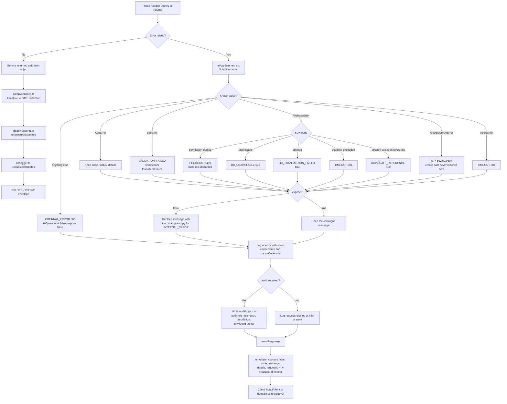

# 16 — Error Handling

**Project:** CareGrid AI
**Document type:** Server and client error contract
**Status:** Baseline v1.0 — normative for the envelope, the code catalogue, and the client policy
**Related:** [08 API Specification §1.3](./08_API_SPECIFICATION.md), [06 Backend Architecture](./06_BACKEND_ARCHITECTURE.md), [17 Validation Rules](./17_VALIDATION_RULES.md), [07 Database Schema](./07_DATABASE_SCHEMA.md), [09 AI Specification](./09_AI_GEMINI_SPECIFICATION.md), [22 User Roles & Permissions](./22_USER_ROLES_PERMISSIONS.md), [01 PRD §6.13, NFR-030](./01_PRODUCT_REQUIREMENTS_DOCUMENT.md)

---

## 0. Principles

| # | Principle | Consequence in code |
| ---: | --- | --- |
| 1 | **One envelope.** Success and failure look the same at the top level, so a client has exactly one parsing path. | FR-140. `lib/api/respond.ts` is the only writer. |
| 2 | **A code is a contract; a message is a courtesy.** `code` is a stable machine string that may be branched on. `message` is English prose, safe to show, and may be reworded without a version bump. | A client never string-matches a message. |
| 3 | **Internal errors are never exposed.** No stack trace, no SDK message, no document path, no bucket name, no project ID, no SQL/Firestore query text, no raw exception `message`. | `AppError.expose === false` for every non-catalogue error. |
| 4 | **Failure is not always an error.** AI failure falls back; notification failure is logged; a heartbeat that is too frequent is a client-behaviour hint. FR-029 and FR-107 both require this. | Some codes are recorded but never returned. Marked in the catalogue. |
| 5 | **Every response carries a `requestId`.** Success, failure, CSV, 204. | FR-141, US-041 AC3. |
| 6 | **Calm copy.** No exclamation marks, no blame, no jargon, no scary words. The reader may be in an emergency. | `scripts/check-copy.ts` asserts it. |
| 7 | **No existence oracles.** "Not found" and "not yours" are byte-identical. | [22](./22_USER_ROLES_PERMISSIONS.md) §5. |
| 8 | **Never swallow.** An empty `catch` is a bug; every `catch` either recovers to a documented fallback or rethrows. | [06](./06_BACKEND_ARCHITECTURE.md) §3.8. |

---

## 1. The envelope

### 1.1 Success ([08](./08_API_SPECIFICATION.md) §1.2)

```json
{
  "success": true,
  "data": { "incidentId": "r7Kp2mQ9xL4nT8vB3cD6", "reference": "CG-7QK4M2" },
  "meta": { "requestId": "req_7Kd2mQ9xL4n", "timestamp": "2026-09-26T10:05:31.000Z" }
}
```

### 1.2 Failure ([08](./08_API_SPECIFICATION.md) §1.3)

```json
{
  "success": false,
  "error": {
    "code": "INCIDENT_NOT_FOUND",
    "message": "We could not find that incident.",
    "details": [{ "field": "id", "issue": "not_found" }],
    "requestId": "req_7Kd2mQ9xL4n"
  }
}
```

### 1.3 TypeScript types

```ts
// types/api.ts
export type ApiErrorDetail = {
  /** Dotted path of the offending field: "location.lat", "media[1].sizeBytes", "body". */
  field: string;
  /** Zod issue code, or a documented code-specific issue string. Lowercase snake. */
  issue: string;
  /**
   * Optional, small, non-sensitive context. Only the codes listed in §1.5 may populate it,
   * and only from a fixed allow-list. Never a stack, never a path, never raw user data
   * beyond what the user just typed.
   */
  value?: string | number | boolean | null | Record<string, string | number | boolean | null>;
};

export type ApiErrorBody = {
  code: ErrorCode;
  message: string;
  details?: ApiErrorDetail[];
  requestId: string;
};

export type ApiEnvelope<T> = {
  success: true;
  data: T;
  meta: { requestId: string; timestamp: string; noop?: boolean };
};

export type ApiErrorEnvelope = {
  success: false;
  error: ApiErrorBody;
};

export type ApiResponse<T> = ApiEnvelope<T> | ApiErrorEnvelope;
```

`details` is **optional** and is reserved for field-level validation and a small set of documented conflict codes ([08](./08_API_SPECIFICATION.md) §1.3: "never stack traces, never internal IDs"). When a code has no field-level information, `details` is omitted rather than sent empty.

### 1.4 HTTP status mapping (normative)

| Status | Codes | Notes |
| --- | --- | --- |
| 200 | any success, including a replayed idempotent create, and a no-op status transition (`meta.noop: true`) | |
| 201 | resource created | `POST /api/incidents`, `.../dispatch`, `.../uploads/sign`, `POST /api/notifications`, `POST /api/me/bootstrap` (new) |
| 202 | accepted for asynchronous completion | role change with an unsynchronised custom claim ([08](./08_API_SPECIFICATION.md) §10), `POST /api/analytics/recompute` |
| 204 | no body | no route in v1 returns 204; the writer exists for future `DELETE` routes |
| 400 | `VALIDATION_FAILED`, `LOCATION_OUT_OF_RANGE`, `INVALID_CURSOR`, `CURSOR_COMBINATION_INVALID`, `INVALID_RESOLUTION_CODE`, `REASON_REQUIRED`, `SELF_MERGE_NOT_ALLOWED`, `SELF_ROLE_CHANGE_FORBIDDEN`, `SELF_DISABLE_FORBIDDEN` | |
| 401 | `AUTH_REQUIRED`, `AUTH_INVALID_TOKEN`, `AUTH_EXPIRED` | |
| 403 | `FORBIDDEN`, `ROLE_MISMATCH`, `ACCOUNT_UNAVAILABLE`, `CSRF_FAILED`, `UPLOAD_FORBIDDEN_PATH`, `ROLE_ESCALATION_GUARD` | `403` means the **role** can never do this |
| 404 | `INCIDENT_NOT_FOUND`, `USER_NOT_FOUND`, `RESPONDER_NOT_FOUND`, `NOTIFICATION_NOT_FOUND`, `MEDIA_NOT_FOUND`, `DISPATCH_NOT_FOUND` | also "not visible to you" |
| 409 | state conflict | `INVALID_STATUS_TRANSITION`, `TRANSITION_NOT_ALLOWED_YET`, `ALREADY_ASSIGNED`, `ALREADY_VERIFIED`, `ALREADY_ROLE`, `INCIDENT_ALREADY_DELETED`, `DUPLICATE_REFERENCE`, `MERGE_BLOCKED_ACTIVE_ASSIGNMENT`, `DISPATCH_EXPIRED`, `DISPATCH_ALREADY_ACCEPTED`, `RESPONDER_NOT_VERIFIED`, `RESPONDER_UNAVAILABLE`, `RESPONDER_AT_CAPACITY`, `UPLOAD_INCOMPLETE` |
| 413 | `UPLOAD_TOO_LARGE` | |
| 415 | `UNSUPPORTED_MEDIA_TYPE`, `UPLOAD_SIGNATURE_MISMATCH` | |
| 422 | well-formed but semantically rejected | `EMPTY_REPORT`, `RESOLUTION_CODE_REQUIRED`, `LOCATION_REQUIRED`, `UPLOAD_NOT_FOUND`, `UPLOAD_QUARANTINED`, `MEDIA_NOT_VERIFIED`, `INVALID_CAPABILITY`, `RESOURCE_REQUIRED`, `UNSUPPORTED_NOTIFICATION_TYPE`, `RECIPIENT_NOT_FOUND`, `BATCH_TOO_LARGE`, `AI_OUTPUT_INVALID`, `RISK_DISABLED`, `FEATURE_DISABLED`, `MAINTENANCE_DISABLED`, `CONFIG_CHANGE_LOCKED`, `NOTIFICATION_DISABLED`, `GEOCODE_FAILED` |
| 429 | `RATE_LIMIT_EXCEEDED`, `HEARTBEAT_TOO_FREQUENT` | always with `Retry-After` |
| 500 | `INTERNAL_ERROR` | body never leaks internals |
| 502 | `AI_UNAVAILABLE`, `AI_BLOCKED`, `MAPS_UNAVAILABLE`, `NOTIFICATION_SEND_FAILED` | |
| 503 | `DB_UNAVAILABLE`, `DB_TRANSACTION_FAILED`, `STORAGE_UNAVAILABLE`, `AI_QUOTA`, `SERVICE_UNAVAILABLE` | `Retry-After` where meaningful |
| 504 | `AI_TIMEOUT`, `TIMEOUT` | |

### 1.5 Which codes may carry `details[].value`

| Code | `field` | `issue` | `value` allow-list |
| --- | --- | --- | --- |
| `VALIDATION_FAILED` | the field path | Zod issue code | none |
| `EMPTY_REPORT` | `text` | `no_evidence_channel` | none |
| `INVALID_STATUS_TRANSITION` | `status` | `not_allowed_from` | `{ from, to, allowed: string[] }` — statuses only |
| `TRANSITION_NOT_ALLOWED_YET` | `status` | `sequence_violation` | `{ from, to, requiredFirst: string[] }` |
| `ALREADY_ASSIGNED` | `responderUid` | `already_assigned` | `{ uid, displayName }` |
| `RESPONDER_UNAVAILABLE` | `responderUid` | `not_available` | `{ status }` |
| `RESPONDER_AT_CAPACITY` | `responderUid` | `at_capacity` | `{ activeIncidentCount, maxConcurrentIncidents }` |
| `RESPONDER_NOT_VERIFIED` | `responderUid` | `verification_required` | `{ verification }` |
| `MERGE_BLOCKED_ACTIVE_ASSIGNMENT` | `primaryIncidentId` | `active_dispatch` | `{ dispatchId, responderUid, expiresAt }` |
| `UPLOAD_INCOMPLETE` | `mediaId` | `size_mismatch` | `{ declared, actual }` — byte counts only |
| `CURSOR_COMBINATION_INVALID` | `sort` / `center` | `requires` | `{ requires: string[] }` |
| `HEARTBEAT_TOO_FREQUENT` | `capturedAt` | `too_soon` | `{ minIntervalSec, lastCapturedAt }` |
| `RATE_LIMIT_EXCEEDED` | — | omitted | none (use the `Retry-After` header) |
| everything else | — | — | `details` omitted |

---

## 2. `AppError`

### 2.1 Class design

```ts
// lib/api/errors.ts
export class AppError extends Error {
  readonly code: ErrorCode;
  readonly httpStatus: number;
  readonly details?: ApiErrorDetail[];
  readonly isOperational: boolean;   // true = we understand it and it is expected
  readonly expose: boolean;          // true = the message may be shown to the user
  readonly retryable: boolean;       // drives the client retry policy
  readonly audit: boolean;           // a failed attempt must be recorded
  readonly cause?: unknown;          // original error, for logs only

  constructor(init: {
    code: ErrorCode;
    httpStatus?: number;             // defaults to the catalogue value
    message?: string;                // defaults to the catalogue copy
    details?: ApiErrorDetail[];
    cause?: unknown;
    isOperational?: boolean;         // default true for catalogue codes
    expose?: boolean;                // default = isOperational
    retryable?: boolean;             // default from the catalogue
    audit?: boolean;                 // default from the catalogue
  });

  static from(err: unknown, ctx?: RequestContext): AppError;
}
```

| Field | Meaning | Invariant |
| --- | --- | --- |
| `code` | stable machine string from the catalogue | **Never** invented at a call site. `new AppError({ code: 'SOMETHING_NEW' })` is a compile error because `ErrorCode` is a union generated from the catalogue. |
| `httpStatus` | the HTTP status | Always equals the catalogue value for that code. The parameter exists only so the catalogue and the throw site cannot drift: a mismatch throws at construction in development. |
| `message` | user-facing copy | When omitted it is the catalogue copy, so a service throw never needs to write prose. When supplied, it must be one of the catalogue's approved variants (§7) — an ad-hoc message is a lint error. |
| `details` | field-level info | Only per §1.5. |
| `cause` | the original error | Logged as `{ causeName, causeCode }` only. Never serialised into a response. |
| `isOperational` | expected vs bug | `false` ⇒ `INTERNAL_ERROR`, `expose: false`, `error`-level log with a stack. |
| `expose` | may the message reach the user | `false` ⇒ the response uses the generic message for the code, or `INTERNAL_ERROR`'s copy. |
| `retryable` | safe for the client to retry | Must be `false` for any non-idempotent mutation without an idempotency key. |
| `audit` | write an `auditLogs` row for the **failed** attempt | `true` for role mismatches, denied escalations, and privileged denials. Not for ordinary validation. |

### 2.2 Construction sites

```ts
// Preferred: catalogue code, no prose.
throw new AppError({ code: 'INVALID_STATUS_TRANSITION', details: [
  { field: 'status', issue: 'not_allowed_from', value: { from, to, allowed } },
]});

// Catalogue code with a variant copy from the approved list.
throw new AppError({ code: 'ACCOUNT_UNAVAILABLE', message: ACCOUNT_UNAVAILABLE_SUSPENDED });

// Wrapping an SDK failure. The cause is logged, never shown.
try { await tx.commit(); }
catch (e) { throw AppError.from(e, ctx); }   // -> DB_TRANSACTION_FAILED / DB_UNAVAILABLE
```

### 2.3 `toAppError` — the single funnel

| Thrown value | Resulting code | Status |
| --- | --- | --- |
| `AppError` | itself | catalogue |
| `ZodError` | `VALIDATION_FAILED` with `details` from `formatZodIssues` | 400 |
| `FirebaseError` `permission-denied` | `FORBIDDEN` (the rules text is discarded) | 403 |
| `FirebaseError` `unavailable` | `DB_UNAVAILABLE` | 503 |
| `FirebaseError` `deadline-exceeded` | `TIMEOUT` | 504 |
| `FirebaseError` `aborted` / `ABORTED` | `DB_TRANSACTION_FAILED` | 503 |
| `FirebaseError` `already-exists` (on `incidents.reference`) | `DUPLICATE_REFERENCE` | 409 |
| `FirebaseError` `resource-exhausted` | `RATE_LIMIT_EXCEEDED` only when the code came from our own bucket; otherwise `DB_UNAVAILABLE` | 429 / 503 |
| `StorageError` | `STORAGE_UNAVAILABLE` | 503 |
| `GoogleGenAIError` (5xx / network after retries) | `AI_UNAVAILABLE` | 502 |
| `GoogleGenAIError` quota | `AI_QUOTA` | 503 |
| `AbortError` | `TIMEOUT` | 504 |
| `TypeError` | `INTERNAL_ERROR`, `isOperational: false` | 500 |
| anything else | `INTERNAL_ERROR`, `isOperational: false`, `expose: false` | 500 |

> An `AI_*` error is **never** produced on the create path. `services/ai/triage.ts` catches its own failures and returns the fallback (FR-029), so `POST /api/incidents` only ever sees a successful or fallback triage result. `AI_*` can reach a client only from `POST /api/incidents/:id/triage` and only when the fallback is explicitly disabled in config.

---

## 3. The complete error catalogue

**Reading the tables.** "User-facing message" is the exact string, used when `expose: true`. "Retryable" drives the automatic retry policy (§6.4). "Logged?" is the level. "Audit?" means a failed attempt is recorded in `auditLogs`. "Endpoints" lists the routes that can return the code; `—` means the code is internal only and is recorded elsewhere (e.g. `aiRuns`, `rateLimits`, the log stream).

### 3.1 Authentication

| Code | HTTP | Category | When it happens | User-facing message | Retryable | Logged | Audit | Endpoints |
| --- | --- | --- | --- | --- | :-: | :-: | :-: | --- |
| `AUTH_REQUIRED` | 401 | Authentication | No `Authorization` header on a route with `auth: 'required'` | `Sign in to continue.` | No — requires a new sign-in | info | No | every protected route |
| `AUTH_INVALID_TOKEN` | 401 | Authentication | `verifyIdToken` rejected the token (malformed, wrong project, revoked by `checkRevoked`, signature failure) | `Your session could not be verified. Sign in again to continue.` | Yes — once, after `getIdToken(true)` | info | No | every protected route |
| `AUTH_EXPIRED` | 401 | Authentication | The token parsed but its `exp` has passed, or `auth_time` predates `users.tokensValidAfter` | `Your session has expired. Sign in again to continue.` | Yes — once, after `getIdToken(true)` | info | No | every protected route |
| `ACCOUNT_UNAVAILABLE` | 403 | Authentication | `users/{uid}` missing, or `status ∈ {suspended, disabled, pending_verification}` | `This account is not available. Contact an administrator if you think this is a mistake.` | No | warn | No | every protected route except `POST /api/me/bootstrap` and `GET /api/me` ([22](./22_USER_ROLES_PERMISSIONS.md) §1) |
| `ROLE_MISMATCH` | 403 | Authentication | The Firestore `role` (authoritative) and the token `role` claim disagree | `Your access level has changed. Refresh the page and sign in again.` | Yes — after `getIdToken(true)` | warn | **Yes** (`auth.role_mismatch`, see §3.14 D-16-7) | every protected route |

### 3.2 Authorization

| Code | HTTP | Category | When it happens | User-facing message | Retryable | Logged | Audit | Endpoints |
| --- | --- | --- | --- | --- | :-: | :-: | :-: | --- |
| `FORBIDDEN` | 403 | Authorization | Gate 1 failed: the role may never perform this action (matrix rows marked `—` in [22](./22_USER_ROLES_PERMISSIONS.md) §3), or a write Gate 2 failed, or a field is not permitted for this role | `You do not have permission to do that.` | No | info | Only for privileged routes | all; specifically `POST/PATCH /api/incidents*`, `/api/responders*`, `/api/dispatches*`, `GET /api/analytics`, `POST /api/notifications`, `/api/admin/*` |
| `CSRF_FAILED` | 403 | Authorization | `Origin`/`Referer` does not match `NEXT_PUBLIC_APP_URL` on a non-GET request | `This request could not be verified. Reload the page and try again.` | No — a reload is required | warn | No | every non-GET route |
| `ROLE_ESCALATION_GUARD` | 403 | Authorization | A non-admin (or a non-super-admin, if that tier is ever added) attempted to grant `admin` | `Only a platform administrator can grant this role.` | No | warn | **Yes** | `PATCH /api/admin/users/:id/role` |
| `SELF_ROLE_CHANGE_FORBIDDEN` | 400 | Authorization | An admin targeted their own uid in a role change (row 61, a hard denial) | `You cannot change your own role.` | No | warn | **Yes** | `PATCH /api/admin/users/:id/role` |
| `SELF_DISABLE_FORBIDDEN` | 400 | Authorization | An admin targeted their own uid in a status change | `You cannot disable your own account.` | No | warn | **Yes** | `PATCH /api/admin/users/:id/status` |
| `UPLOAD_FORBIDDEN_PATH` | 403 | Authorization | The `storagePath` does not match the storage path pattern, or was not issued to this uid, or lives under `incidents/` without an ownership check | `That file cannot be attached to this report.` | No | warn | No | `POST /api/incidents`, `GET /api/uploads/:mediaId/url` |

### 3.3 Validation

| Code | HTTP | Category | When it happens | User-facing message | Retryable | Logged | Audit | Endpoints |
| --- | --- | --- | --- | --- | :-: | :-: | :-: | --- |
| `VALIDATION_FAILED` | 400 | Validation | Zod rejected the body, query, or params. `details[]` lists dotted field paths and Zod issue codes | `Some of the details you entered need attention.` | No — the user must change input | info | No | every route with a request body or query ([17](./17_VALIDATION_RULES.md)) |
| `VALIDATION_EMPTY_REPORT` | 400 | Validation | **FR-002 code name** for an empty submission. The emitted code is `EMPTY_REPORT` (see D-16-3) | `Add a description or at least one photo so we can act on this.` | No | info | No | `POST /api/incidents` (catalogue alias) |
| `EMPTY_REPORT` | 422 | Validation | No text of ≥ 20 characters **and** no valid media item after media verification dropped the bad ones | `Add a description of at least 20 characters, or attach a photo, so we can act on this.` | No | info | No | `POST /api/incidents` |
| `LOCATION_OUT_OF_RANGE` | 400 | Validation | `lat` outside [-90, 90] or `lng` outside [-180, 180], or `accuracyM` outside its range | `That location does not look right. Try using your current location or dropping a pin.` | No | info | No | `POST /api/incidents`, `PATCH /api/incidents/:id`, `PATCH /api/responders/:id/location` |
| `LOCATION_REQUIRED` | 422 | Validation | An operation that needs a distance ranking was given an incident with no coordinates (e.g. candidate ranking) | `This incident has no location yet, so responders cannot be ranked by distance. Add a location and try again.` | Yes — after a location is added | info | No | `GET /api/incidents/:id/dispatch/candidates` |
| `INVALID_CURSOR` | 400 | Validation | The `cursor` token does not resolve to a document, or does not belong to this query's filter set | `This page link has expired. Start again from the first page.` | No | info | No | every cursor-paginated list route |
| `CURSOR_COMBINATION_INVALID` | 400 | Validation | A filter/sort combination the cursor cannot serve: `sort=distance` without `center`, or a cursor with a changed `sort`/`status` set | `That paging option cannot be used with the current filters. Reset the filters and try again.` | No | info | No | `GET /api/incidents`, other list routes |
| `INVALID_RESOLUTION_CODE` | 400 | Validation | `resolutionCode` is not one of the six controlled values | `Choose how this incident was resolved from the list.` | No | info | No | `PATCH /api/incidents/:id/status` |
| `INVALID_CAPABILITY` | 422 | Validation | A `capabilities` entry is not an active `resourceId` in the catalogue | `One of the selected skills is not on our list. Remove it and try again.` | No | info | No | `PATCH /api/responders/:id`, `POST /api/responders/:id/verify` |
| `RESOURCE_REQUIRED` | 422 | Validation | A resource the operation needs was absent — e.g. an `aiRunId` referenced by `?expand=ai` that no longer exists, or a configuration block required by the feature | `Some required information is missing for this action.` | No | info | No | `GET /api/incidents/:id` (`expand=ai`), `GET /api/analytics` |
| `REASON_REQUIRED` | 400 | Validation | A privileged mutation requires a `reason` of 10–280 characters and it was absent or too short | `Add a short reason so this change can be reviewed later.` | No | info | No | `DELETE /api/incidents/:id`, `.../restore`, `.../merge`, `.../merge/undo`, `.../duplicates/dismiss`, `POST /api/responders/:id/reject`, `PATCH /api/admin/users/:id/{role,status}`, `POST /api/admin/users/:id/reset-claims`, `PATCH /api/admin/config`, `POST /api/admin/maintenance/[job]`, `POST /api/dispatches/:id/withdraw` |
| `SELF_MERGE_NOT_ALLOWED` | 400 | Validation | `primaryIncidentId === :id` | `An incident cannot be merged into itself. Choose a different report.` | No | info | No | `POST /api/incidents/:id/merge` |
| `UNSUPPORTED_MEDIA_TYPE` | 415 | Validation | The declared `contentType` is not in the allow-list for the upload `kind` | `That file type is not supported. Use a photo or a supported audio format.` | No | info | No | `POST /api/uploads/sign`, `POST /api/incidents` |
| `UPLOAD_TOO_LARGE` | 413 | Validation | Declared or actual size exceeds `UPLOAD_MAX_IMAGE_BYTES` (5 MiB) or `UPLOAD_MAX_AUDIO_BYTES` (15 MiB) | `That file is too large. Photos must be under 5 MB and audio under 15 MB.` | No | info | No | `POST /api/uploads/sign`, `POST /api/uploads/finalize`, `POST /api/incidents` |
| `UPLOAD_NOT_FOUND` | 422 | Validation | A `storagePath` in the create body does not exist in Storage, or the staging object expired (30 min) | `One of the files could not be found. Upload it again.` | Yes — re-upload that single file | warn | No | `POST /api/incidents` |
| `UPLOAD_INCOMPLETE` | 409 | Validation | The object exists but is 0 bytes, or the actual size differs from the declaration by more than 1 % | `That file did not finish uploading. Try uploading it again.` | Yes — re-upload | info | No | `POST /api/uploads/finalize` |
| `UPLOAD_QUARANTINED` | 422 | Validation | Magic bytes indicate an executable, archive, or script | `That file type cannot be used as evidence.` | No | warn | **Yes** (`incident.create` with `scanStatus: 'quarantined'`) | `POST /api/uploads/finalize` |
| `MEDIA_NOT_VERIFIED` | 422 | Validation | A read URL was requested for media whose `scanStatus` is not `clean` | `That file is still being checked. Try again in a moment.` | Yes — after ~30 s | info | No | `GET /api/uploads/:mediaId/url` |

### 3.4 Not found (all also mean "not visible to you")

| Code | HTTP | Category | When it happens | User-facing message | Retryable | Logged | Audit | Endpoints |
| --- | --- | --- | --- | --- | :-: | :-: | :-: | --- |
| `INCIDENT_NOT_FOUND` | 404 | Client | The incident does not exist, is soft-deleted and the caller is not privileged, or Gate 2 read failed | `We could not find that incident.` | No | info | No | `GET/PATCH/DELETE /api/incidents/:id*` |
| `USER_NOT_FOUND` | 404 | Client | The target `users/{uid}` document does not exist | `We could not find that user.` | No | info | No | `/api/admin/users/:id*`, `POST /api/responders/:id/*` |
| `RESPONDER_NOT_FOUND` | 404 | Client | `responders/{uid}` does not exist | `We could not find that responder.` | No | info | No | `/api/responders/:id*`, `POST /api/incidents/:id/dispatch` |
| `NOTIFICATION_NOT_FOUND` | 404 | Client | The notification does not exist or belongs to another recipient | `We could not find that notification.` | No | info | No | `PATCH/DELETE /api/notifications/:id` |
| `MEDIA_NOT_FOUND` | 404 | Client | The media object is not in Storage, or its document was never created | `We could not find that file.` | No | info | No | `POST /api/uploads/finalize`, `GET /api/uploads/:mediaId/url` |
| `DISPATCH_NOT_FOUND` | 404 | Client | The dispatch does not exist or is not visible to the caller | `We could not find that assignment.` | No | info | No | `POST /api/dispatches/:id/{claim,withdraw}` |

### 3.5 State conflict

| Code | HTTP | Category | When it happens | User-facing message | Retryable | Logged | Audit | Endpoints |
| --- | --- | --- | --- | --- | :-: | :-: | :-: | --- |
| `INVALID_STATUS_TRANSITION` | 409 | Client | The requested transition is not in the table for the current status ([07](./07_DATABASE_SCHEMA.md) §4.3). Dispatcher skips are allowed **with** a reason | `This incident is already at that step. Refresh to see the latest status.` | No | info | No | `PATCH /api/incidents/:id/status`, `POST /api/incidents/:id/dispatch`, `POST /api/incidents/:id/triage` |
| `TRANSITION_NOT_ALLOWED_YET` | 409 | Client | A responder tried to skip a state (e.g. `on_scene` before `en_route`) | `Complete the previous step first, then continue.` | Yes — after the earlier step | info | No | `PATCH /api/incidents/:id/status` |
| `RESOLUTION_CODE_REQUIRED` | 422 | Client | `status: 'resolved'` without a `resolutionCode` | `Choose how this incident was resolved before marking it resolved.` | No | info | No | `PATCH /api/incidents/:id/status` |
| `ALREADY_ASSIGNED` | 409 | Client | An active dispatch exists and `replaceExisting` was `false` | `This incident is already assigned. Unassign the current responder or choose to replace them.` | No | info | No | `POST /api/incidents/:id/dispatch` |
| `ALREADY_VERIFIED` | 409 | Client | `verification` is already `verified` | `This responder is already verified.` | No | info | No | `POST /api/responders/:id/verify` |
| `ALREADY_ROLE` | 409 | Client | The requested role equals the current role | `That user already has this role.` | No | info | No | `PATCH /api/admin/users/:id/role` |
| `INCIDENT_ALREADY_DELETED` | 409 | Client | `deletedAt` is already set | `This incident has already been deleted.` | No | info | No | `DELETE /api/incidents/:id` |
| `DUPLICATE_REFERENCE` | 409 | Client | Three generated `CG-XXXXXX` references collided in the create transaction | `We could not finish creating your report. Please submit it again.` | Yes — with a new key | error | No | `POST /api/incidents` |
| `MERGE_BLOCKED_ACTIVE_ASSIGNMENT` | 409 | Client | The secondary incident has an `active` or `accepted` dispatch | `Unassign the responder on this incident before merging it.` | No | info | No | `POST /api/incidents/:id/merge` |
| `DISPATCH_EXPIRED` | 409 | Client | `expiresAt` has passed on an unaccepted dispatch | `This assignment expired. Ask the dispatcher to send it again.` | No | info | No | `POST /api/dispatches/:id/claim` |
| `DISPATCH_ALREADY_ACCEPTED` | 409 | Client | Another responder already accepted, or the dispatch is no longer `active` | `Another responder has taken this assignment.` | No | info | No | `POST /api/dispatches/:id/claim` |
| `RESPONDER_NOT_VERIFIED` | 409 | Client | `verification !== 'verified'` at assignment time (FR-064) | `This responder is not verified yet and cannot be assigned incidents.` | No | info | No | `POST /api/incidents/:id/dispatch`, `POST /api/dispatches/:id/claim` |
| `RESPONDER_UNAVAILABLE` | 409 | Client | `status === 'offline'` | `This responder is offline. Choose another responder or ask them to come on duty.` | No | info | No | `POST /api/incidents/:id/dispatch`, `POST /api/dispatches/:id/claim` |
| `RESPONDER_AT_CAPACITY` | 409 | Client | `activeIncidentCount >= maxConcurrentIncidents` | `This responder is already handling as many incidents as they can.` | No | info | No | `POST /api/incidents/:id/dispatch`, `POST /api/dispatches/:id/claim` |

### 3.6 AI (see also FR-029, [09](./09_AI_GEMINI_SPECIFICATION.md))

| Code | HTTP | Category | When it happens | User-facing message | Retryable | Logged | Audit | Endpoints |
| --- | --- | --- | --- | --- | :-: | :-: | :-: | --- |
| `AI_UNAVAILABLE` | 502 | AI | Gemini failed after `GEMINI_MAX_RETRIES` on 429/503, or the local RPM/RPD guard short-circuited | `Automatic analysis is not available right now. The incident was saved and needs a person to review it.` | No | warn | No | `POST /api/incidents/:id/triage` only; **never** on create |
| `AI_TIMEOUT` | 504 | AI | The 20 s hard timeout elapsed | `Automatic analysis took too long. The incident was saved and needs a person to review it.` | Yes — a dispatcher may re-run triage | warn | No | `POST /api/incidents/:id/triage` |
| `AI_QUOTA` | 503 | AI | The project's free-tier quota is exhausted, or the local guard refused to call | `Automatic analysis is paused for now. The incident was saved and needs a person to review it.` | No — retrying makes it worse | warn | No | `POST /api/incidents/:id/triage` |
| `AI_OUTPUT_INVALID` | 422 | AI | The model output failed `aiTriageOutputSchema` after one repair attempt, **and** the fallback is disabled in config | `The analysis could not be read. Please review the report and set the details yourself.` | Yes — a human retry after review | warn | **Yes** | `POST /api/incidents/:id/triage` |
| `AI_BLOCKED` | 502 | AI | A safety filter blocked the content | `Some of the description could not be analysed automatically. The incident was saved and needs a person to review it.` | No | warn | No | — (recorded as `aiRuns.outcome: 'blocked'`; on create the fallback is used and nothing is returned) |

### 3.7 Database

| Code | HTTP | Category | When it happens | User-facing message | Retryable | Logged | Audit | Endpoints |
| --- | --- | --- | --- | --- | :-: | :-: | :-: | --- |
| `DB_UNAVAILABLE` | 503 | Database | Firestore or Storage unreachable after the SDK's own retries | `We could not reach the system just now. Your work has not been lost. Try again in a moment.` | Yes — for reads and for idempo**t**ent writes | error | No | any |
| `DB_TRANSACTION_FAILED` | 503 | Database | A transaction exhausted its 5 automatic retries on contention, or `ABORTED` | `Someone else updated this at the same time. Refresh to see the latest, then try again.` | Yes — after a refresh | error | No | any transactional route |
| `STORAGE_UNAVAILABLE` | 503 | Database | Cloud Storage unreachable while signing a URL, finalising, or promoting media | `We could not reach the file store just now. Try again in a moment.` | Yes | error | No | `/api/uploads/*`, `POST /api/incidents` |

### 3.8 Maps

| Code | HTTP | Category | When it happens | User-facing message | Retryable | Logged | Audit | Endpoints |
| --- | --- | --- | --- | --- | :-: | :-: | :-: | --- |
| `MAPS_UNAVAILABLE` | 502 | Maps | The Geocoding/Places API failed, timed out (8 s), or the key is misconfigured | `Place lookup is not available right now. The coordinates are still saved.` | No — the coordinates are already stored | warn | No | `POST /api/incidents`, `PATCH /api/incidents/:id` (reverse geocode) |
| `GEOCODE_FAILED` | 422 | Maps | Reverse geocoding returned no result for usable coordinates | `We could not find a place name for that point. The coordinates are still saved.` | No | info | No | `POST /api/incidents`, `PATCH /api/incidents/:id` |

> Both Maps codes are **non-fatal by design**: `placeName` and `placeId` are optional display fields, and a missing label must never prevent an incident from being created (FR-035, NFR-012).

### 3.9 Notifications

| Code | HTTP | Category | When it happens | User-facing message | Retryable | Logged | Audit | Endpoints |
| --- | --- | --- | --- | --- | :-: | :-: | :-: | --- |
| `NOTIFICATION_SEND_FAILED` | 502 | Notifications | An out-of-band channel (SMS/WhatsApp/email) failed after `NOTIFICATION_RETRY_LIMIT` attempts | — (**never returned**; FR-107) | Yes — the channel is retried by the job | warn | No | — (surfaced in the `channels` map of `POST /api/notifications`) |
| `NOTIFICATION_DISABLED` | 422 | Notifications | The requested channel is disabled in `config.notifications.channels` or by `ENABLE_SMS_NOTIFICATIONS` / `ENABLE_WHATSAPP_NOTIFICATIONS` | `That notification channel is turned off.` | No | info | No | `POST /api/notifications` |
| `UNSUPPORTED_NOTIFICATION_TYPE` | 422 | Notifications | `type` is not one of the 12 controlled values | `Choose a supported notification type.` | No | info | No | `POST /api/notifications` |
| `RECIPIENT_NOT_FOUND` | 422 | Notifications | `recipientUid` does not resolve to an active user | `We could not find a recipient for that notification.` | No | info | No | `POST /api/notifications` |
| `BATCH_TOO_LARGE` | 422 | Notifications | `POST /api/notifications/read-all` would update more than 200 documents | `That is more notifications than we can mark at once. Mark them a page at a time.` | Yes — the client pages | info | No | `POST /api/notifications/read-all` |

### 3.10 Rate limiting

| Code | HTTP | Category | When it happens | User-facing message | Retryable | Logged | Audit | Endpoints |
| --- | --- | --- | --- | --- | :-: | :-: | :-: | :-: |
| `RATE_LIMIT_EXCEEDED` | 429 | Rate limiting | The Firestore token bucket for the route class is exhausted ([08](./08_API_SPECIFICATION.md) §1.9). Always with `Retry-After` | `You have sent a few of these in a short time. Please wait a moment before sending another.` | Yes — after `Retry-After` | info | No | every limited route |
| `HEARTBEAT_TOO_FREQUENT` | 429 | Rate limiting | A heartbeat `capturedAt` is less than 20 s after the stored one ([08](./08_API_SPECIFICATION.md) §4.4) | `Location updates are already arriving often enough.` | Yes — back off to 60 s | info | No | `PATCH /api/responders/:id/location` |

### 3.11 Network and infrastructure

| Code | HTTP | Category | When it happens | User-facing message | Retryable | Logged | Audit | Endpoints |
| --- | --- | --- | --- | --- | :-: | :-: | :-: | --- |
| `TIMEOUT` | 504 | Network | `REQUEST_TIMEOUT_MS` or an `AbortSignal` elapsed for a non-AI operation | `That took too long. Try again in a moment.` | Yes | warn | No | any |
| `SERVICE_UNAVAILABLE` | 503 | Network | A dependency is degraded in a way that is not one of the more specific codes (health check reports `degraded`) | `The system is temporarily unavailable. Your work has not been lost. Try again shortly.` | Yes | error | No | any |
| `INTERNAL_ERROR` | 500 | Client (unexpected) | A bug: an unmapped throw, a `TypeError`, a broken invariant. Details are suppressed | `Something went wrong on our side. The team has been notified.` | Yes, once, for reads only | **error** (with stack) | No | any |

### 3.12 Maintenance, configuration, and feature flags

| Code | HTTP | Category | When it happens | User-facing message | Retryable | Logged | Audit | Endpoints |
| --- | --- | --- | --- | --- | :-: | :-: | :-: | --- |
| `MAINTENANCE_DISABLED` | 422 | Maintenance | A maintenance job was requested while `ENABLE_MAINTENANCE_JOBS !== 'true'` or `config.features.maintenance !== true` | `Maintenance jobs are not enabled in this environment.` | No | info | **Yes** (the attempt is recorded) | `POST /api/admin/maintenance/[job]` |
| `CONFIG_CHANGE_LOCKED` | 422 | Maintenance | The requested `config/app` key is environment-only (e.g. anything sourced from `GEMINI_*`, `RATE_LIMIT_*`, `UPLOAD_MAX_*`) | `That setting comes from the environment and cannot be changed here.` | No | info | **Yes** | `PATCH /api/admin/config` |
| `RISK_DISABLED` | 422 | Maintenance | `include=risk` while `features.riskZones === false` (or `ENABLE_RISK_ZONES` is false) | `Risk zones are not turned on in this environment.` | No | info | No | `GET /api/analytics` |
| `FEATURE_DISABLED` | 422 | Maintenance | A feature-flagged capability was requested while its flag is off (e.g. voice evidence with `features.voice === false` or `ENABLE_VOICE_REPORTING=false`; bulk actions with `features.bulkActions === false`) | `That option is not turned on in this environment.` | No | info | No | `POST /api/incidents` (audio), bulk admin actions |

### 3.13 Never returned to a client (internal codes)

| Code | Recorded where | Why it is internal |
| --- | --- | --- |
| `AUTH_EXPIRED` vs `AUTH_INVALID_TOKEN` | log line only, when the distinction is not user-relevant | Both map to the same recovery |
| `DB_TRANSACTION_FAILED` retry count | log line | The user sees one message |
| `AI_BLOCKED` | `aiRuns.outcome` | FR-029: the fallback answers, not an error |
| `NOTIFICATION_SEND_FAILED` | `notifications` channel result, `aiRuns`-style log | FR-107: never fails the request |
| `RESPONDER_UNAVAILABLE` when detected by the **candidate list** | not an error; the candidate is filtered out | The list is not an error surface |

### 3.14 Catalogue gaps and inconsistencies — `DECISION REQUIRED`

| ID | Issue | Where | Recommendation |
| --- | --- | --- | --- |
| D-16-1 | `DISPATCH_EXPIRED` and `DISPATCH_ALREADY_ACCEPTED` are referenced in [08](./08_API_SPECIFICATION.md) §5.2 but are absent from the status table in §1.7 | | Both `409`. Amend §1.7. |
| D-16-2 | `INVALID_CAPABILITY` and `RESOURCE_REQUIRED` appear in route error lists but not in §1.7 | | `422` for both. Amend §1.7. |
| D-16-3 | `EMPTY_REPORT` ([08](./08_API_SPECIFICATION.md) §3.1, 422) vs `VALIDATION_EMPTY_REPORT` (FR-002) | [01](./01_PRODUCT_REQUIREMENTS_DOCUMENT.md) FR-002, [08](./08_API_SPECIFICATION.md) §1.7 | Emit `EMPTY_REPORT`. Keep `VALIDATION_EMPTY_REPORT` as the FR-facing alias in the catalogue and note it is never returned. Amend FR-002 to name `EMPTY_REPORT`. |
| D-16-4 | `SELF_DISABLE_FORBIDDEN` has no status in [08](./08_API_SPECIFICATION.md) §10 | | `400`, matching `SELF_ROLE_CHANGE_FORBIDDEN`. Amend §10. |
| D-16-5 | `RECIPIENT_NOT_FOUND` — `404` (not-found convention) or `422` (semantic body rejection)? | [08](./08_API_SPECIFICATION.md) §6.4 | `422`: the request is well-formed, the referenced user simply is not an eligible recipient. Keeps the not-found family reserved for the caller's own resource lookups, where opacity matters. |
| D-16-6 | `UPLOAD_INVALID_SIGNATURE` (US-002 AC5, [01](./01_PRODUCT_REQUIREMENTS_DOCUMENT.md)) vs `UPLOAD_SIGNATURE_MISMATCH` ([08](./08_API_SPECIFICATION.md) §3.1, §8.2) | | One code: `UPLOAD_SIGNATURE_MISMATCH`, `415`. Amend US-002 AC5. |
| D-16-7 | Audit action `auth.role_mismatch` is used in [22](./22_USER_ROLES_PERMISSIONS.md) §2 and [21](./21_ENVIRONMENT_VARIABLES.md) §6, but the `AuditAction` list in [07](./07_DATABASE_SCHEMA.md) §11.5 has no such value. `user.create` ([08](./08_API_SPECIFICATION.md) §2.1) and `user.update` (§2.3) are likewise missing | | Add `auth.role_mismatch`, `user.create`, `user.update` to the `AuditAction` enum. Until then, a drift event is recorded as `auth.login_failed` with a `reason` and the change log entry, and `user.update` is recorded as `responder.update` where applicable — both are compromises and both should be fixed in [07](./07_DATABASE_SCHEMA.md). |
| D-16-8 | `AI_QUOTA` — `429` (semantically a rate limit) or `503` (it is *our* provider's quota, not the caller's)? | | `503`, so the client's rate-limit UI and `Retry-After` handling are not triggered by a third-party quota. Recorded in `GET /api/admin/system/health` as the AI failure rate. |
| D-16-9 | `NOTIFICATION_SEND_FAILED` has no status because it is never returned | | No status needed. Documented in §3.13. |

---

## 4. The error-handling flow



**Ordering note.** Step 1 of the pipeline ([06](./06_BACKEND_ARCHITECTURE.md) §3.1) can throw before the service is reached: `requireUser`, `assertRole`, `assertResourceAccess`, `assertSameOrigin`, `enforceRateLimit`, and `parseJsonBody` all raise `AppError` directly. Those flow through the same funnel, so a validation failure and a bug produce structurally identical responses. The only difference is `logLevel` (`info` vs `error`) and whether a stack is attached.

---

## 5. Server implementation checklist

Per route, before merge:

- [ ] Every `throw` uses `new AppError({ code })`; no ad-hoc strings, no `throw new Error(message)`.
- [ ] Every catalogue code the route can emit appears in that route's row of §3.3–§3.12 (and in [08](./08_API_SPECIFICATION.md) §"Errors").
- [ ] No `catch` block rethrows a raw `Error`.
- [ ] No `details[].value` outside the §1.5 allow-list.
- [ ] No `message` that is not a §7 catalogue string.
- [ ] `INTERNAL_ERROR` responses contain no `details` at all.
- [ ] A `Retry-After` header is present on every 429 and on every 503 that is retryable.
- [ ] `Cache-Control: no-store` on every response containing user data.
- [ ] The integration test asserts the exact `code` **and** the exact `message` for each negative case, so copy cannot drift silently.

---

## 6. Client-side handling

### 6.1 `lib/api/client.ts` normalisation

```ts
// lib/api/client.ts
export class ApiError extends Error {
  readonly code: ErrorCode;
  readonly status: number;
  readonly details: readonly ApiErrorDetail[];
  readonly requestId: string;
  readonly retryable: boolean;
  readonly fieldErrors: Readonly<Record<string, string>>;   // dotted path -> first message
  readonly isNetwork: boolean;                               // "Failed to fetch"
  readonly isAuth: boolean;                                  // 401, and one refresh was already tried

  constructor(init: { code; status; message; details?; requestId; retryable; isNetwork?; isAuth? });
}

export type ApiResult<T> = { ok: true; value: T; requestId: string } | { ok: false; error: ApiError };

export async function apiFetch<T>(path: string, init: ApiRequestInit): Promise<ApiResult<T>>;
```

Normalisation steps, in order:

1. **Fetch.** A `TypeError` with message `Failed to fetch` (or `ERR_NETWORK`, or a DNS/connection failure) never produced a response. Construct `ApiError` with `code: 'SERVICE_UNAVAILABLE'`, `status: 0`, `isNetwork: true`, and the current `requestId` from the request that failed (or a locally generated one).
2. **Parse.** `response.json()` inside a `try/catch`. A non-JSON body on a route that should return JSON becomes `INTERNAL_ERROR` — this is how a misconfigured edge/proxy is detected.
3. **Read `X-Request-Id`.** If present, it is the correlation id shown to the user; otherwise fall back to `error.requestId`.
4. **401 handling, once.** On 401 with `code ∈ {AUTH_EXPIRED, AUTH_INVALID_TOKEN}`, call `getIdToken(true)` and replay the request **once**. A second 401 surfaces `ApiError.isAuth = true` and the session layer signs the user out with a calm message. A 401 with `AUTH_REQUIRED` is **not** retried.
5. **Envelope validation.** `success === false` and a string `code` are required. An unknown `code` string is preserved verbatim (so a newer server is not silently mis-mapped) but marked `isKnown: false`, and the client shows the generic message.
6. **Field errors.** `details[]` is reduced to `fieldErrors[field] = <the mapped message for that issue>`; the first entry for a given path wins. A `React Hook Form` `setError` loop consumes this directly; the error summary lists them in the order returned.
7. **Retryable flag.** Taken from the catalogue, not from the status code, because `409 RESPONDER_UNAVAILABLE` and `409 DISPATCH_EXPIRED` behave very differently from `503`.
8. **Telemetry hook.** If a reporter is configured (`SENTRY_DSN`, disabled by default — NFR-030, [06](./06_BACKEND_ARCHITECTURE.md) §11), it receives `{ code, status, requestId, path, isNetwork, fieldErrors }` and **no** request body, no user input, no token.

### 6.2 Code → user message map

The client has its own table (`lib/api/errors.ts` on the client side — the two catalogues are kept identical by a unit test, per [20](./20_PROJECT_FOLDER_STRUCTURE.md) §5.3 S4) so the wording can be tuned per surface without a server deploy. Rules for the client table:

| Rule | Detail |
| --- | --- |
| Never show a raw server `message` for a `5xx` | Replace with the catalogue's calm line. A server message in an outage is often useless and sometimes alarming. |
| Never show a raw server `message` for `isNetwork` | Use the offline line (§6.5). |
| Show the server `message` for `4xx` | It is written for exactly this audience, and it is the fastest way to keep copy consistent. |
| Per-surface overrides | The dispatcher queue needs "Yusuf Khan was assigned first", not the generic `ALREADY_ASSIGNED` line, so `ALREADY_ASSIGNED` may render `details.value.responder.displayName` inline **with** the generic sentence as the accessible name. |
| Field errors | `details[].field` maps to an inline message under the input; the top-level `message` is only shown when no field owns the error. |
| Every error is quotable | The UI shows a `Request id: req_…` chip wherever a toast is shown (US-041 AC3). |

### 6.3 Toast policy

| Situation | Surface | Behaviour |
| --- | --- | --- |
| `VALIDATION_FAILED` with field errors | Form | **Inline**, under each field; an error summary at the top with `role="alert"` and links to the inputs. **No toast.** |
| `VALIDATION_FAILED` without field errors (query/params) | Any | **Inline** banner, dismissible |
| `RATE_LIMIT_EXCEEDED` | Any | **Toast**, neutral tone, auto-dismiss 6 s, plus a disabled control with the reason as helper text (FR-017 pattern) |
| `HEARTBEAT_TOO_FREQUENT` | Responder availability | **Silent.** The client backs off to `RESPONDER_HEARTBEAT_SEC`; showing anything would alarm a responder for correct behaviour |
| `AUTH_REQUIRED` | Any | **Full-page** sign-in state, with the intended path preserved |
| `AUTH_EXPIRED` / `AUTH_INVALID_TOKEN` | Any | **Toast** ("Your session has expired. Sign in again.") then full-page sign-in |
| `ACCOUNT_UNAVAILABLE` | Any | **Full-page** notice, no retry action |
| `FORBIDDEN` | Any | **Full-page** forbidden state, never a toast (a toast implies you might retry) |
| `*_NOT_FOUND` | Detail page | **Full-page** not-found state, identical for "not yours" |
| `INVALID_STATUS_TRANSITION`, `TRANSITION_NOT_ALLOWED_YET`, `ALREADY_ASSIGNED`, `RESPONDER_UNAVAILABLE`, `RESPONDER_AT_CAPACITY`, `DISPATCH_EXPIRED`, `DISPATCH_ALREADY_ACCEPTED`, `INCIDENT_ALREADY_DELETED`, `ALREADY_ROLE`, `ALREADY_VERIFIED` | Mutation | **Toast**, warning tone, with a **Refresh** action. Optimistic UI rolls back visibly (FR-076) |
| `UPLOAD_*` | Report form, per file | **Inline** on the file chip. The other files and the text are preserved (US-002 AC4) |
| `EMPTY_REPORT` | Report form | **Inline** on the description field, plus focus |
| `RATE_LIMIT_EXCEEDED` on submit | Report form | **Inline** helper text under Submit; the button stays disabled until the window resets |
| `DB_UNAVAILABLE`, `SERVICE_UNAVAILABLE`, `TIMEOUT` on a mutation | Any | **Toast**, with a **Retry** action. Never a silent failure (FR-098) |
| `INTERNAL_ERROR` | Any | **Full-page** error state with the `requestId` and the line "The team has been notified." |
| `FEATURE_DISABLED`, `RISK_DISABLED`, `MAINTENANCE_DISABLED`, `CONFIG_CHANGE_LOCKED`, `NOTIFICATION_DISABLED` | Admin | **Toast**, informational tone; the control is disabled with the reason as helper text |
| Background read failure (polling/listener) | Any | **No toast.** The "Reconnecting…" banner plus a subtle stale-data indicator (FR-094) |
| Client validation failure before any request | Form | **Inline only** |

Rules:

- **One toast at a time.** A second toast replaces the first; a storm of toasts is a defect.
- **No toast for anything the user just did correctly** (heartbeat, idempotent replay, no-op transition).
- **Toasts never contain a raw error object, a stack, a URL, or a code string.** The `requestId` chip is the only machine detail.
- Every toast that offers **Retry** must use the retry policy in §6.4 and must re-run through `apiFetch` (which refreshes the token if needed).

### 6.4 Retry policy

| Class | Codes | Auto-retry | Conditions |
| --- | --- | :-: | --- |
| Safe to auto-retry (read) | `TIMEOUT`, `SERVICE_UNAVAILABLE`, `DB_UNAVAILABLE`, `MAPS_UNAVAILABLE`, `AI_UNAVAILABLE`, `AI_QUOTA`, `STORAGE_UNAVAILABLE` | Yes | 1 automatic retry after 400 ms ± 100 ms jitter; 2 for the heartbeat GET; **never** for a `GET` that has already been issued 3 times in 15 s |
| Retryable on user action | `DB_TRANSACTION_FAILED`, `AUTH_EXPIRED`, `AUTH_INVALID_TOKEN`, `RATE_LIMIT_EXCEEDED`, `HEARTBEAT_TOO_FREQUENT`, `UPLOAD_INCOMPLETE`, `UPLOAD_NOT_FOUND`, `MEDIA_NOT_VERIFIED`, `TRANSITION_NOT_ALLOWED_YET`, `AI_TIMEOUT`, `LOCATION_REQUIRED` | No | A visible **Retry** action, or automatic after `Retry-After` for the 429s |
| Never retry — state conflict | `INVALID_STATUS_TRANSITION`, `ALREADY_ASSIGNED`, `ALREADY_VERIFIED`, `ALREADY_ROLE`, `INCIDENT_ALREADY_DELETED`, `MERGE_BLOCKED_ACTIVE_ASSIGNMENT`, `DUPLICATE_REFERENCE`, `DISPATCH_EXPIRED`, `DISPATCH_ALREADY_ACCEPTED`, `RESPONDER_NOT_VERIFIED`, `RESPONDER_UNAVAILABLE`, `RESPONDER_AT_CAPACITY`, `RESOLUTION_CODE_REQUIRED`, `INVALID_RESOLUTION_CODE`, `*_NOT_FOUND`, `FORBIDDEN`, `ROLE_MISMATCH`, `SELF_*`, `REASON_REQUIRED`, `SELF_MERGE_NOT_ALLOWED`, `INVALID_CURSOR`, `CURSOR_COMBINATION_INVALID` | No | These need a **new decision**, not the same request again |
| Never retry — client input | all `VALIDATION_FAILED`, `EMPTY_REPORT`, `LOCATION_OUT_OF_RANGE`, `INVALID_CAPABILITY`, `RESOURCE_REQUIRED`, `UNSUPPORTED_MEDIA_TYPE`, `UPLOAD_TOO_LARGE`, `UNSUPPORTED_NOTIFICATION_TYPE`, `RECIPIENT_NOT_FOUND`, `BATCH_TOO_LARGE` | No | |
| Never retry — a mutation without an idempotency key | every non-GET other than `POST /api/incidents` and `POST /api/incidents/:id/dispatch` | **No** | See below |

> **The absolute rule:** a non-GET mutation is **never** automatically retried unless the request carried an `Idempotency-Key` (or a `clientActionId` for `PATCH /status`) **and** the retry reuses the same key. This applies even to a 503. A citizen who taps Submit twice during an outage must produce one incident, not two — and the only thing that guarantees that is the key ([06](./06_BACKEND_ARCHITECTURE.md) §9).

| Situation | Behaviour |
| --- | --- |
| Network failure on `POST /api/incidents` | The key is retained with the draft. The retry replays the same key, so the server either creates once or replays the original body. The UI says "Sending your report…" and stays on the screen until it resolves. |
| Network failure on a mutation with no key | **Queue it in the offline queue** (§6.5) if the action is in the queueable set, otherwise surface a **Retry** action and let the user decide. Never a silent automatic retry. |
| 5xx on `POST /api/notifications/read-all` | One automatic retry is safe (it is a `writeBatch` of set-values), but the client still honours the idempotency rule by treating the operation as naturally idempotent and recording it. |
| 5xx on `DELETE /api/incidents/:id` | No auto-retry. A second soft delete would return `409 INCIDENT_ALREADY_DELETED` and confuse the user. |

### 6.5 Offline and network failure

`TypeError: Failed to fetch` is intercepted in `apiFetch` and becomes `ApiError { code: 'SERVICE_UNAVAILABLE', status: 0, isNetwork: true }`. The offline queue lives in `features/responders/hooks/useOfflineQueue.ts`.

| Property | Value | Rationale |
| --- | --- | --- |
| Scope | **Responder status actions only** | US-014, NFR-012. These are the actions a responder takes with one hand, on a bad signal, in a hurry |
| Bounded size | **20 queued actions** | A responder queue beyond 20 is a stale list, not a safety feature. On overflow the **oldest** entry is dropped and a warning is shown |
| Order | Strict FIFO by `enqueuedAt` | A status sequence replayed out of order would produce `TRANSITION_NOT_ALLOWED_YET` for correct history |
| Payload | `{ clientActionId, incidentId, status, reason, note, resolutionCode, enqueuedAt }` | `clientActionId` is a client-generated `a_` + 8 hex, used as the replay dedupe key |
| Storage | `localStorage` (JSON), not IndexedDB | A heartbeat-sized payload; `localStorage` is synchronous and survives a reload. IndexedDB adds async complexity for no benefit here |
| UI | "Pending sync" badge on each affected incident; a global "Reconnecting…" banner (FR-094) | |
| Replay | On `online` and on the next successful `GET`, drain in order with a 1 s gap between items | Prevents a replay storm after a 10-minute tunnel |
| Success | Entry removed; the row's `updatedAt` is replaced by the server value | |
| `TRANSITION_NOT_ALLOWED_YET` / `INVALID_STATUS_TRANSITION` | Entry **kept**, marked **conflict**, and surfaced: "This incident was updated by someone else" (US-014 AC3). The client does **not** overwrite and does **not** silently drop. A conflict entry is only removed by an explicit user discard | A conflict must be visible |
| `RESOLUTION_CODE_REQUIRED` | Entry kept, marked **needs input**, and the form re-opens with the resolution picker focused | |
| `AUTH_*` | The whole queue is **paused**, not discarded. After re-authentication it resumes in order | Losing status updates because a token expired is unacceptable |
| `429 RATE_LIMIT_EXCEEDED` on replay | Stop draining; wait `Retry-After`; resume | |
| 4xx other than the above | Entry marked **rejected** with the code, and removed after the user acknowledges it | |
| Nothing else | — | Citizen reporting, dispatcher actions, and admin actions are **not** queued. An optimistic dispatcher mutation rolls back visibly (FR-076) instead |

The queue length, the conflict count, and the last successful drain are stored so a "pending sync" badge is accurate across a reload.

---

## 7. Approved user-facing copy

Exact strings. No exclamation marks. No blame. No jargon, no internal names, no "invalid", no "illegal", no "unauthorized". Sentences are short enough to read on a cracked screen while panicking.

### 7.1 Authentication and authorization

| Code | Copy |
| --- | --- |
| `AUTH_REQUIRED` | `Sign in to continue.` |
| `AUTH_INVALID_TOKEN` | `Your session could not be verified. Sign in again to continue.` |
| `AUTH_EXPIRED` | `Your session has expired. Sign in again to continue.` |
| `ACCOUNT_UNAVAILABLE` | `This account is not available. Contact an administrator if you think this is a mistake.` |
| `ACCOUNT_UNAVAILABLE` (suspended variant) | `This account has been paused. Contact an administrator if you think this is a mistake.` |
| `ROLE_MISMATCH` | `Your access level has changed. Refresh the page and sign in again.` |
| `FORBIDDEN` | `You do not have permission to do that.` |
| `CSRF_FAILED` | `This request could not be verified. Reload the page and try again.` |
| `ROLE_ESCALATION_GUARD` | `Only a platform administrator can grant this role.` |
| `SELF_ROLE_CHANGE_FORBIDDEN` | `You cannot change your own role.` |
| `SELF_DISABLE_FORBIDDEN` | `You cannot disable your own account.` |
| `UPLOAD_FORBIDDEN_PATH` | `That file cannot be attached to this report.` |

### 7.2 Validation

| Code / issue | Copy |
| --- | --- |
| `VALIDATION_FAILED` (general) | `Some of the details you entered need attention.` |
| `text too short` | `Tell us a little more. We need at least 20 characters.` |
| `text too long` | `That description is longer than we can store. Please shorten it to 2000 characters.` |
| `EMPTY_REPORT` | `Add a description of at least 20 characters, or attach a photo, so we can act on this.` |
| `LOCATION_OUT_OF_RANGE` | `That location does not look right. Try using your current location or dropping a pin.` |
| `LOCATION_REQUIRED` | `This incident has no location yet, so responders cannot be ranked by distance. Add a location and try again.` |
| `INVALID_CURSOR` | `This page link has expired. Start again from the first page.` |
| `CURSOR_COMBINATION_INVALID` | `That paging option cannot be used with the current filters. Reset the filters and try again.` |
| `INVALID_RESOLUTION_CODE` | `Choose how this incident was resolved from the list.` |
| `INVALID_CAPABILITY` | `One of the selected skills is not on our list. Remove it and try again.` |
| `RESOURCE_REQUIRED` | `Some required information is missing for this action.` |
| `REASON_REQUIRED` | `Add a short reason so this change can be reviewed later.` |
| `REASON_REQUIRED` (too short) | `Please write a slightly longer reason so this change can be reviewed later.` |
| `SELF_MERGE_NOT_ALLOWED` | `An incident cannot be merged into itself. Choose a different report.` |
| `UNSUPPORTED_MEDIA_TYPE` | `That file type is not supported. Use a photo or a supported audio format.` |
| `UPLOAD_TOO_LARGE` | `That file is too large. Photos must be under 5 MB and audio under 15 MB.` |
| `UPLOAD_NOT_FOUND` | `One of the files could not be found. Upload it again.` |
| `UPLOAD_INCOMPLETE` | `That file did not finish uploading. Try uploading it again.` |
| `UPLOAD_QUARANTINED` | `That file type cannot be used as evidence.` |
| `UPLOAD_SIGNATURE_MISMATCH` | `That file does not look like the type it was uploaded as. Remove it and try again.` |
| `MEDIA_NOT_VERIFIED` | `That file is still being checked. Try again in a moment.` |
| enum (`invalid_enum_value`) | `Choose one of the listed options.` |
| `too_small` (numbers) | `That value is too low.` |
| `too_big` (numbers) | `That value is too high.` |
| `unrecognized_keys` | `One of the fields sent is not part of this form. Reload the page and try again.` |
| `invalid_json` | `We could not read what was sent. Reload the page and try again.` |
| `invalid_combination` (cross-field) | `Some of these fields do not go together. Check the highlighted fields.` |

### 7.3 Not found — one message per resource, always identical

| Code | Copy |
| --- | --- |
| `INCIDENT_NOT_FOUND` | `We could not find that incident.` |
| `USER_NOT_FOUND` | `We could not find that user.` |
| `RESPONDER_NOT_FOUND` | `We could not find that responder.` |
| `NOTIFICATION_NOT_FOUND` | `We could not find that notification.` |
| `MEDIA_NOT_FOUND` | `We could not find that file.` |
| `DISPATCH_NOT_FOUND` | `We could not find that assignment.` |

### 7.4 State conflict

| Code | Copy |
| --- | --- |
| `INVALID_STATUS_TRANSITION` | `This incident is already at that step. Refresh to see the latest status.` |
| `TRANSITION_NOT_ALLOWED_YET` | `Complete the previous step first, then continue.` |
| `RESOLUTION_CODE_REQUIRED` | `Choose how this incident was resolved before marking it resolved.` |
| `ALREADY_ASSIGNED` | `This incident is already assigned. Unassign the current responder or choose to replace them.` |
| `ALREADY_ASSIGNED` (dispatcher variant, with the name) | `{name} was assigned first. Choose to replace them or keep the current assignment.` |
| `ALREADY_VERIFIED` | `This responder is already verified.` |
| `ALREADY_ROLE` | `That user already has this role.` |
| `INCIDENT_ALREADY_DELETED` | `This incident has already been deleted.` |
| `DUPLICATE_REFERENCE` | `We could not finish creating your report. Please submit it again.` |
| `MERGE_BLOCKED_ACTIVE_ASSIGNMENT` | `Unassign the responder on this incident before merging it.` |
| `DISPATCH_EXPIRED` | `This assignment expired. Ask the dispatcher to send it again.` |
| `DISPATCH_ALREADY_ACCEPTED` | `Another responder has taken this assignment.` |
| `RESPONDER_NOT_VERIFIED` | `This responder is not verified yet and cannot be assigned incidents.` |
| `RESPONDER_UNAVAILABLE` | `This responder is offline. Choose another responder or ask them to come on duty.` |
| `RESPONDER_AT_CAPACITY` | `This responder is already handling as many incidents as they can.` |

### 7.5 AI, Maps, Storage — degradation, not failure

| Code | Copy |
| --- | --- |
| `AI_UNAVAILABLE` | `Automatic analysis is not available right now. The incident was saved and needs a person to review it.` |
| `AI_TIMEOUT` | `Automatic analysis took too long. The incident was saved and needs a person to review it.` |
| `AI_QUOTA` | `Automatic analysis is paused for now. The incident was saved and needs a person to review it.` |
| `AI_OUTPUT_INVALID` | `The analysis could not be read. Please review the report and set the details yourself.` |
| `AI_BLOCKED` | `Some of the description could not be analysed automatically. The incident was saved and needs a person to review it.` |
| `MAPS_UNAVAILABLE` | `Place lookup is not available right now. The coordinates are still saved.` |
| `GEOCODE_FAILED` | `We could not find a place name for that point. The coordinates are still saved.` |
| `STORAGE_UNAVAILABLE` | `We could not reach the file store just now. Try again in a moment.` |

The pattern for every AI and Maps message is: **what still worked, then what is missing**. A citizen whose report was saved must never read as though the report was lost.

### 7.6 Notifications, rate limiting, infrastructure

| Code | Copy |
| --- | --- |
| `NOTIFICATION_DISABLED` | `That notification channel is turned off.` |
| `UNSUPPORTED_NOTIFICATION_TYPE` | `Choose a supported notification type.` |
| `RECIPIENT_NOT_FOUND` | `We could not find a recipient for that notification.` |
| `BATCH_TOO_LARGE` | `That is more notifications than we can mark at once. Mark them a page at a time.` |
| `RATE_LIMIT_EXCEEDED` | `You have sent a few of these in a short time. Please wait a moment before sending another.` |
| `RATE_LIMIT_EXCEEDED` (incident creation) | `You have sent several reports in a short time. If this is a different emergency, call your local emergency number.` |
| `HEARTBEAT_TOO_FREQUENT` | `Location updates are already arriving often enough.` |
| `TIMEOUT` | `That took too long. Try again in a moment.` |
| `SERVICE_UNAVAILABLE` | `The system is temporarily unavailable. Your work has not been lost. Try again shortly.` |
| `SERVICE_UNAVAILABLE` (offline) | `You appear to be offline. Your work is saved on this device and will be sent when you reconnect.` |
| `DB_UNAVAILABLE` | `We could not reach the system just now. Your work has not been lost. Try again in a moment.` |
| `DB_TRANSACTION_FAILED` | `Someone else updated this at the same time. Refresh to see the latest, then try again.` |
| `INTERNAL_ERROR` | `Something went wrong on our side. The team has been notified.` |
| `MAINTENANCE_DISABLED` | `Maintenance jobs are not enabled in this environment.` |
| `CONFIG_CHANGE_LOCKED` | `That setting comes from the environment and cannot be changed here.` |
| `RISK_DISABLED` | `Risk zones are not turned on in this environment.` |
| `FEATURE_DISABLED` | `That option is not turned on in this environment.` |

> The incident-creation rate-limit message deliberately points a genuinely-distressed user at their local emergency number. This is the only place the product refers to a real service, and it is the honest thing to say when we are throttling a report.

---

## 8. Multi-layer error aggregation

| Layer | Source | Aggregation rule |
| --- | --- | --- |
| Zod issues → `details` | `validators/*` | **All** issues are collected, not just the first. `zod`'s `error.issues` is already exhaustive for a single parse. Cross-field `superRefine` failures run after the field pass so both a bad field and a bad combination can appear. `formatZodIssues` maps `path: []` (a root-level failure) to `field: "body"`. |
| Cross-field rules | `superRefine` on the domain schema | Reported against the **offending** field so the message can be rendered under it: `resolved` without `resolutionCode` → `field: "resolutionCode"`; `sort=distance` without `center` → `field: "center"`; `source: 'address_text'` without `location.text` → `field: "location.text"`. |
| Media verification → evidence error | `services/uploads/finalizeUpload` | Several media items can fail. Each failure produces its own `details` entry (`field: "media[2]"`) and **the rest of the submission continues**. If every item fails and there is no text, the request then fails once with `EMPTY_REPORT` rather than N upload errors. |
| Firestore permission errors → 403 | `toAppError` | A `permission-denied` is collapsed to `FORBIDDEN` with **no** `details` and **no** rules text. The rules may reveal collection names, field names, and expressions. Internally the log records the SDK `code` and the request `path` at `warn`. |
| Gemini failure → fallback, not error | `services/ai/triage.ts` | A timeout, a block, a quota, a parse failure, a Zod failure — none of these produce an API error on the create path. Each maps to an `aiRuns.outcome`, `fallbackUsed: true`, `triageSource: 'fallback'`, `aiConfidence ≤ 0.55`, and a visible "Needs review" state (FR-024, FR-029). |
| Maps failure → omission | `services/*` | A reverse-geocode failure leaves `placeName: null` and records `GEOCODE_FAILED` in the log. The incident is created. |
| Notification failure → omission | `services/notifications` | Out-of-band channel failure is returned in the `channels` map and logged; the originating request succeeds (FR-107). |
| Transaction contention → refresh | `toAppError` | `DB_TRANSACTION_FAILED` surfaces the "someone else updated this" line, which is a **prompt to refresh**, not a retry loop. |
| Client field errors → form state | `lib/api/client.ts` | `fieldErrors` is passed to React Hook Form's `setError`. A path that the form does not own is rendered in the error summary rather than dropped, so nothing fails silently. |
| Multi-error UI | `components/feedback/error-state.tsx` | Renders the summary list, the `requestId` chip, and the actions. It never invents a message for a code the catalogue does not contain; an unknown code falls back to the generic line. |

---

## 9. Error telemetry

### 9.1 What is recorded, where

| Event | Destination | Contents | Never |
| --- | --- | --- | --- |
| Every request | Structured log (`lib/logger.ts`) | `msg: request.completed`, `requestId`, `routeKey`, `method`, `path`, `status`, `durationMs`, `uid`, `role`, `errorCode` | request body, query values, IP in clear |
| Every 4xx before execution | Log at `info` | `msg: request.rejected`, `errorCode`, `requestId` | — |
| Every 5xx | Log at `error` | `causeName`, `causeCode`, stack **only** for `isOperational === false` | exception `message` in the response; never a `cause.message` in the log either (it can contain paths and project IDs) |
| Rate limiting | Log at `info` | `routeKey`, hashed `windowKey`, `limit`, `count`, `retryAfterSec` | the uid in the key |
| AI runs | `aiRuns/{runId}` | model, `promptVersion`, `attempt`, `outcome`, `latencyMs`, tokens, `fallbackUsed`, `errorCode`, `rawOutputHash` | raw model output, prompt text, media |
| Notification channel failures | Log at `warn` | `type`, `dedupeKey`, `channel`, `attempt` of `NOTIFICATION_RETRY_LIMIT` | recipient phone, channel credentials |
| Privilege denials and drift | `auditLogs` | `action: auth.role_mismatch`, actor, target, reason | — |
| Client errors | `reportError` hook, **disabled by default** | `code`, `status`, `requestId`, `path`, `isNetwork`, field-error keys | body, user input, token. Enabled by setting `SENTRY_DSN` (NFR-030) |

### 9.2 Correlation

`requestId` is the single join key:

```
client error toast  ──▶  requestId: req_7Kd2mQ9xL4n
                              │
                              ├─▶ X-Request-Id response header
                              ├─▶ meta.requestId (success) / error.requestId (failure)
                              ├─▶ every log line for the request
                              ├─▶ auditLogs.requestId          (FR-130)
                              ├─▶ statusHistory.requestId     ([07] §6)
                              └─▶ client error reporter
```

Acceptance: quoting a `requestId` in a bug report is sufficient to find the full server-side story, including the Firebase operation that failed. This is the mechanism behind US-041 AC3.

### 9.3 How a user quotes a requestId

1. Every error surface shows a `Request id: req_…` chip (copyable, one tap).
2. Every toast with an error includes it.
3. `GET /api/health` and `GET /api/admin/system/health` report the `VERCEL_GIT_COMMIT_SHA` and version so a report can be tied to a deploy.
4. The bug-report template asks for: what you were doing, the exact time (with timezone), the role you were signed in as, and the `request id`. It explicitly asks for **no** screenshots of evidence files and **no** personal details.

---

## 10. Anti-patterns — forbidden

| # | Anti-pattern | Why it is forbidden | Instead |
| ---: | --- | --- | --- |
| 1 | `catch {}` / `catch (e) { /* ignore */ }` | Hides bugs and turns a 500 into a silent wrong answer. The single most damaging pattern in this list. | `catch` only to recover to a **documented** fallback (AI, Maps, notification), and log the recovery. Otherwise rethrow. |
| 2 | `return ok({ error: … })` — a 200 with an error body | Breaks the single-envelope contract in a way the client cannot detect. | `fail()` with the right status. |
| 3 | Returning `err.message`, `err.stack`, or a stringified SDK error in the response body | Leaks project IDs, collection names, bucket names, and internal paths. | The catalogue message. `expose: false` for anything unmapped. |
| 4 | Logging PII: `logger.info('report', { text })`, `console.log(body)`, `console.log(token)` | Incident text, addresses, phone numbers, and tokens end up in a log store with a different retention and access model than the database. | Field names and counts. `lib/logger.ts` additionally drops any field whose name matches its secret-name guard (token, secret, password, authorization, apiKey, privateKey). |
| 5 | `console.log` in committed code | Bypasses `LOG_LEVEL`, the redaction guard, and `requestId` binding. Noise in an emergency UI. | `logger.*`. `console.warn`/`console.error` only in `lib/observability`, `lib/firebase/listener-registry.ts`, and dev-only blocks. |
| 6 | Automatically retrying a non-idempotent mutation | Duplicate incidents, double assignments, double notifications. The most likely real-world harm in this list. | Retry only with the same `Idempotency-Key` / `clientActionId`. |
| 7 | Showing a raw server `message` on a 5xx | During an incident the message is usually useless and sometimes alarming. | The catalogue copy. |
| 8 | `catch (e: any)` / `unknown` narrowed with `as` | Defeats the funnel and hides SDK code mapping. NFR-022 forbids `any` in `app/`, `features/`, `services/`, `lib/`. | `catch (e: unknown)` + `AppError.from(e, ctx)`, or a typed `instanceof` check. |
| 9 | Swallowing a `role` mismatch by trusting the claim | A stale claim becomes a privilege escalation. | `403 ROLE_MISMATCH` + audit, per [22](./22_USER_ROLES_PERMISSIONS.md) §2. |
| 10 | Returning `403` when a resource is not the caller's | Creates an existence oracle (US-005). | `404` with the not-found message, identical to a missing document. |
| 11 | Inventing a new `code` string at a throw site | Two codes for one condition; the client cannot branch on either. | Add it to the catalogue in [16](./16_ERROR_HANDLING.md) §3 and to the client table in the same commit. |
| 12 | A different message per call site for the same code | Copy drift; a test that asserts one message fails for no real reason. | The catalogue copy, or a listed variant. |
| 13 | Putting a stack trace in `details` | `details` is for field-level validation ([08](./08_API_SPECIFICATION.md) §1.3). | Log it. Never return it. |
| 14 | `details[].value` carrying arbitrary objects | Reintroduces a data leak through a "context" field. | The §1.5 allow-list only. |
| 15 | Disabling CSRF "temporarily" for a route that uses cookies | Defence in depth removed for a reason that is never removed. | Keep it. All non-GET routes, always. |
| 16 | Using `no-store`-less responses for user data | A CDN or browser cache holding an incident row is a data breach. | `Cache-Control: no-store` on every user-specific response. |
| 17 | Treating AI failure as a request failure | Directly violates FR-029: a report must never be lost because a model was slow. | Fallback + `aiRuns` telemetry. |
| 18 | Blocking a notification on the request path | Violates FR-107. | Emit after the response-critical write; never fail the request. |
| 19 | Rejecting the whole request because one media item failed | A citizen with two good photos and one bad file should still get an incident. | Per-item `details`, continue, then `EMPTY_REPORT` only if nothing is left. |
| 20 | An empty `catch` around a `setCustomUserClaims` call | A claim that silently failed leaves the user in a half-changed state. | `roleChangePending = true`, `202`, `claims.sync_failed` log, admin health counter. |

---

## Phase 10 logging and disclosure audit (2026-09-30)

All **14** `console.*` call sites in the repository were read. Findings:

**No secret, token, password, uploaded content or exact coordinate is logged
anywhere.** Three sites are guarded by `NODE_ENV !== 'production'`; the remainder are
an error boundary, a mapped Firestore code, and budget counts.

### The one judgement call

The Phase 10 listener teardown logs a **count and a reason**, never a uid:

```ts
console.warn(`[auth] closed ${closed} realtime listener(s): ${reason}`);
```

Naming the account would make the log more useful for debugging, and it is
deliberately omitted. A log line carrying a uid is a record of which human was signed
in at a moment in time, retained wherever logs are retained, for a diagnostic that a
count satisfies. The *reason* (`signed_out`, `switched_account`) is what tells an
investigator whether the teardown was correct, and it carries no identity.

### Stack traces and internals

The funnel is unchanged: `toAppError` maps to a typed `AppError`, and a production
response carries a code, a safe message and a request id. No stack trace, no
filesystem path, no Firestore internal, no credential reaches a client. Verified by
reading every error construction site reachable from a route.

### The rate limiter fails closed

Not an error-handling change, but it belongs in this document's spirit: if the
rate-limit bucket read fails, `enforceRateLimit` throws `DB_UNAVAILABLE` (503) rather
than allowing the request. A limiter that fails open is not a limiter.
