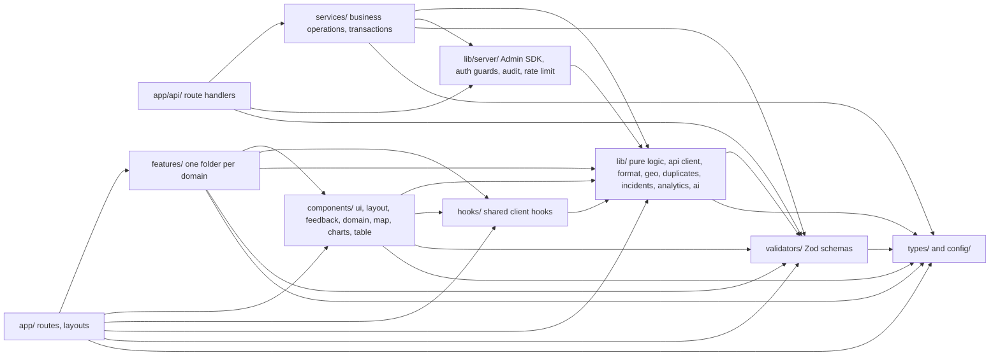

# 20 — Project Folder Structure

**Project:** CareGrid AI
**Document type:** Directory layout, import boundaries, naming conventions, and file-placement rules
**Status:** Baseline v1.0 — normative for every path referenced in [05](./05_FRONTEND_ARCHITECTURE.md)
**Related documents:** [05 Frontend Architecture](./05_FRONTEND_ARCHITECTURE.md), [06 Backend Architecture](./06_BACKEND_ARCHITECTURE.md), [04 UI/UX Specification](./04_UI_UX_DESIGN_SPECIFICATION.md), [18 Testing & QA Plan](./18_TESTING_QA_PLAN.md)

> This document describes the **recommended** layout. If a folder or filename appears here, it may be referenced from code; if a path does not appear here, creating it requires amending this document first (§7, §8).

---

## 0. How to read this document

| Section | Contains |
| --- | --- |
| §1 | Layout principles |
| §2 | The complete annotated tree |
| §3 | Directory ownership and the import boundary rules (with the ESLint config) |
| §4 | Naming conventions |
| §5 | "Where does new code go?" — a text decision flowchart |
| §6 | Where config, security rules, and tooling files live |
| §7 | Files that must **not** exist |
| §8 | `DECISION REQUIRED` register |

---

## 1. Principles

| # | Principle |
| --- | --- |
| P1 | **One top-level concern per directory.** `app/` routes, `features/` domains, `components/` presentation, `lib/` pure logic, `services/` server I/O, `hooks/` shared behaviour. |
| P2 | **The dependency graph is a DAG with no cycles.** `app → features → components → lib`. A cycle is a bug, not a style issue. |
| P3 | **`lib/` is pure.** No Firebase, no `fetch`, no React. Anything in `lib/` can be unit-tested with zero mocks (FR-049, FR-043). |
| P4 | **`services/` is server-only and I/O-bound.** Admin SDK, Gemini, Storage, signed URLs. Never imported from a client file (NFR-013). |
| P5 | **A feature folder is the unit of ownership.** If a piece of code is only useful to one domain, it lives in that domain's `features/<domain>/`, not in `components/`. |
| P6 | **Shared means shared by two or more features.** One consumer is not "shared". |
| P7 | **Config and constants are named, not inlined.** Every enumerating value has a home in `config/`, `validators/enums.ts`, or `lib/`. |
| P8 | **No file over 400 lines** (NFR-024). No file over 250 lines unless it is a generated barrel or a seed fixture. |
| P9 | **A file's name states its layer**, so the path alone tells you what it may import. `*.server.ts` is server-only; `*.client.ts` is browser-only; `*-view.tsx` is a server-safe presentational component (§5.2 of [05](./05_FRONTEND_ARCHITECTURE.md)). |
| P10 | **Every `index.ts` is a deliberate public API.** A barrel file exists to define the boundary of a directory, not to shorten imports inside it. |

---

## 2. The complete tree

Root files are listed in §6. Annotations state purpose and give representative filenames.

```
caregrid-ai/
│
├── app/                                  ← App Router. Routes, layouts, route handlers. No domain logic.
│   ├── layout.tsx                        Root layout: <html lang>, Inter via next/font, AppProviders, Toaster, SkipLink
│   ├── loading.tsx                       Root-level fallback (rarely reached; groups have their own)
│   ├── error.tsx                         Root error boundary (Client Component)
│   ├── global-error.tsx                  Last-resort boundary, supplies its own <html>
│   ├── not-found.tsx                     404 for unmatched paths
│   ├── icon.svg  robots.ts  sitemap.ts    Metadata routes
│   │
│   ├── (public)/                         No session required. No Firestore listeners anywhere (FR-095).
│   │   ├── layout.tsx                     Centred shell + footer with the demo disclaimer
│   │   ├── page.tsx                       "/" landing. Note: file is `page.tsx` under the group
│   │   ├── error.tsx  not-found.tsx
│   │   ├── login/page.tsx                 Client form island + server shell
│   │   ├── signup/page.tsx
│   │   └── forgot-password/page.tsx
│   │
│   ├── (auth)/                           Session required, minimal chrome
│   │   ├── layout.tsx                     requireSession() → redirect to /login?next=
│   │   ├── error.tsx
│   │   └── track/
│   │       ├── page.tsx                   "/track?ref=CG-XXXXXX"; awaits searchParams
│   │       ├── loading.tsx  error.tsx
│   │
│   ├── (app)/                            Session required, full app chrome
│   │   ├── layout.tsx                     Sidebar + TopBar + BottomNav + LiveProvider + SessionProvider consumption
│   │   ├── loading.tsx  error.tsx  not-found.tsx
│   │   ├── report/page.tsx                "/report"       (FR-001)
│   │   ├── dashboard/page.tsx             "/dashboard"    dispatcher queue | responder assignments
│   │   ├── incidents/page.tsx             "/incidents"    role-scoped history
│   │   ├── incidents/[id]/page.tsx        "/incidents/[id]" resource-visibility enforced server-side
│   │   ├── map/page.tsx                   "/map"
│   │   ├── responders/page.tsx            "/responders"
│   │   ├── dispatches/page.tsx            "/dispatches"
│   │   ├── analytics/page.tsx             "/analytics"
│   │   ├── notifications/page.tsx         "/notifications"
│   │   ├── profile/page.tsx               "/profile"
│   │   └── settings/page.tsx              "/settings"     personal only
│   │
│   ├── (ops)/                            role >= dispatcher
│   │   ├── layout.tsx                     requireRole(['dispatcher','admin']) → renders ForbiddenState (403) on failure
│   │   ├── error.tsx
│   │   └── admin/
│   │       ├── audit-logs/page.tsx        admin (full) | dispatcher (read-only)
│   │       ├── incidents/page.tsx         includeDeleted view (always audited)
│   │       ├── settings/page.tsx          platform config            (DECISION REQUIRED: [04] D7)
│   │       ├── users/page.tsx             admin only
│   │       ├── responders/page.tsx        admin verification queue
│   │       └── (admin-gated)/             admin only
│   │           └── page.tsx               "/admin" overview + system health
│   │
│   ├── forbidden/page.tsx                 Explicit destination for "you need access" links. Never auto-redirected to.
│   │
│   ├── styles/                            Global CSS. Exactly two files.
│   │   ├── globals.css                    @theme tokens (the single palette source) + reduced-motion block
│   │   └── maps.css                       Map-specific overrides and the map skeleton frame
│   │
│   └── api/                              Route Handlers. EVERY file starts with runtime='nodejs' ([08] §12.1)
│       ├── me/
│       │   ├── route.ts                   GET + PATCH /api/me
│       │   └── bootstrap/route.ts         POST /api/me/bootstrap
│       ├── auth/event/route.ts            POST /api/auth/event (audit only)
│       ├── incidents/
│       │   ├── route.ts                   GET (list) + POST (create, the big one)
│       │   ├── [id]/
│       │   │   ├── route.ts               GET + PATCH + DELETE
│       │   │   ├── status/route.ts        PATCH /status
│       │   │   ├── triage/route.ts        POST /triage
│       │   │   ├── dispatch/route.ts      POST /dispatch
│       │   │   ├── dispatch/candidates/route.ts   GET ranked responders
│       │   │   ├── merge/route.ts         POST /merge
│       │   │   ├── merge/undo/route.ts    POST /merge/undo
│       │   │   ├── duplicates/dismiss/route.ts
│       │   │   ├── reports/route.ts       supplements + corrections
│       │   │   ├── restore/route.ts       POST /restore
│       │   │   └── export/route.ts        GET CSV
│       ├── responders/
│       │   ├── route.ts                   GET /api/responders
│       │   └── [id]/
│       │       ├── route.ts               GET + PATCH
│       │       ├── location/route.ts      PATCH heartbeat (FR-066)
│       │       ├── incidents/route.ts     GET a responder's assignments
│       │       ├── verify/route.ts        POST (admin only)
│       │       └── reject/route.ts        POST (admin only)
│       ├── dispatches/
│       │   ├── route.ts                   GET /api/dispatches
│       │   ├── summary/route.ts           GET /api/dispatches/summary
│       │   └── [id]/{claim,withdraw}/route.ts
│       ├── notifications/
│       │   ├── route.ts                   GET + POST (admin-only internal dispatch)
│       │   ├── [id]/route.ts              PATCH (mark read) + DELETE (soft-expire)
│       │   └── read-all/route.ts          POST
│       ├── analytics/{route.ts,recompute/route.ts}
│       ├── uploads/{sign,finalize}/route.ts  uploads/[mediaId]/url/route.ts
│       ├── resources/route.ts  config/route.ts  health/route.ts
│       ├── admin/
│       │   ├── users/route.ts  users/[id]/{route.ts,role/route.ts,status/route.ts,reset-claims/route.ts}
│       │   ├── audit-logs/route.ts  config/route.ts  responders/route.ts
│       │   ├── system/health/route.ts
│       │   └── maintenance/[job]/route.ts
│       └── cron/[job]/route.ts            Guarded by CRON_SECRET (Authorization: Bearer)
│
├── components/                            Presentation only. Imports from lib/ and types/; never services/ or features/.
│   ├── ui/                                shadcn/ui primitives, "new-york" style, base colour neutral. Owned by the shadcn CLI.
│   │   ├── button.tsx  icon-button.tsx  input.tsx  textarea.tsx  select.tsx
│   │   ├── checkbox.tsx  radio-group.tsx  switch.tsx  label.tsx  field.tsx
│   │   ├── card.tsx  badge.tsx  alert.tsx  dialog.tsx  sheet.tsx  tabs.tsx
│   │   ├── table.tsx  pagination.tsx  breadcrumb.tsx  tooltip.tsx  progress.tsx
│   │   ├── skeleton.tsx  avatar.tsx  separator.tsx  scroll-area.tsx  popover.tsx
│   │   ├── dropdown-menu.tsx  command.tsx  slider.tsx  sonner.tsx  empty-state.tsx
│   │   └── index.ts                        The ONLY public entry point for components/ui
│   ├── layout/                            App chrome. Owns the per-role visual hierarchy ([04] §12).
│   │   ├── app-shell.tsx  sidebar.tsx  sidebar-nav.tsx  top-bar.tsx  bottom-nav.tsx
│   │   ├── mobile-nav-sheet.tsx  page-header.tsx  breadcrumbs.tsx  toaster.tsx
│   │   ├── live-indicator.tsx  connectivity-banner.tsx  skip-link.tsx
│   │   ├── providers/app-providers.tsx    Firebase bootstrap + SessionProvider + Toaster + TooltipProvider
│   │   └── index.ts
│   ├── feedback/                          The state components from [04] §5.22–5.23 and §9
│   │   ├── empty-state.tsx  error-state.tsx  forbidden-state.tsx  not-found-state.tsx
│   │   ├── live-region.tsx  pending-badge.tsx  request-id.tsx  retry-action.tsx
│   │   └── index.ts
│   ├── map/                               Client-only map surface (FR-080…FR-088). All "use client".
│   │   ├── map-panel.tsx                  dynamic(() => import('./live-map'), { ssr: false }) — FR-086
│   │   ├── live-map.tsx                   APIProvider + Map + layers
│   │   ├── map-marker.tsx  map-marker-cluster.tsx  marker-legend.tsx
│   │   ├── map-detail-panel.tsx  map-list-fallback.tsx  map-layer-control.tsx
│   │   ├── duplicate-radius-ring.tsx  accuracy-radius.tsx  unknown-location-marker.tsx
│   │   ├── map-adapter.ts                 The interface the tests implement
│   │   └── index.ts
│   ├── charts/                            Recharts 3 wrappers. All "use client" + dynamic.
│   │   ├── chart-frame.tsx                 Card + heading + "View as table" + IntersectionObserver lazy mount
│   │   ├── bar-category-chart.tsx  line-trend-chart.tsx
│   │   ├── response-histogram.tsx  sparkline.tsx  risk-zone-chart.tsx
│   │   └── index.ts
│   ├── domain/                            Presentational composites used by ≥2 features
│   │   ├── urgency-badge.tsx  status-badge.tsx  confidence-badge.tsx  confidence-bar.tsx
│   │   ├── sla-meter.tsx  role-badge.tsx  timestamp.tsx  relative-time.tsx
│   │   ├── kpi-tile.tsx  timeline.tsx  evidence-grid.tsx  location-badge.tsx
│   │   ├── safety-flag-chips.tsx  avatar-name.tsx  filter-bar.tsx  search-input.tsx
│   │   ├── pagination-bar.tsx  reason-dialog.tsx  confirm-dialog.tsx
│   │   ├── command-palette.tsx             DECISION REQUIRED — [04] D1. Excluded from the build until decided.
│   │   └── index.ts
│   └── table/
│       ├── queue-table.tsx  queue-table-view.tsx  queue-card-list.tsx
│       ├── history-table.tsx  audit-table.tsx  users-table.tsx
│       ├── virtualized-table.tsx            DECISION REQUIRED — [05] F4
│       └── index.ts
│
├── features/                              One folder per domain. See [05] §5 for the full per-file listing.
│   ├── auth/                              login, signup, forgot-password, session, permissions
│   ├── reporting/                         the report form: text, images, audio, location, draft, success
│   ├── incidents/                         queue, history, detail, timeline, AI panel, duplicates, mutations
│   ├── incident-archive/                  the privileged includeDeleted view and restore
│   ├── dispatch/                          ledger, candidates, assign, claim, withdraw, expiry
│   ├── responders/                        directory, own profile, availability, heartbeat, verification queue
│   ├── map/                               map feature logic and hooks (presentation stays in components/map)
│   ├── notifications/                     bell, list, mark-read, mark-all-read
│   ├── analytics/                         range control, tiles, chart wrappers, CSV export
│   ├── admin/                             users, roles, config, audit, system health, maintenance
│   ├── track/                             reference lookup, tracking summary, what-happens-next
│   ├── location/                          shared location primitives: accuracy badge, pin drop, address input
│   └── <domain>/                          each folder internally:
│       api/*.ts  hooks/*.ts  components/*.tsx  schemas.ts  copy.ts  types.ts  index.ts
│
├── hooks/                                 Cross-feature client hooks. No feature imports.
│   ├── useAuth.ts  useToast.ts  useOnlineStatus.ts  useDebounce.ts
│   ├── useGeolocation.ts  useMediaRecorder.ts?    ← NO: these live in features/reporting (§7)
│   ├── usePagination.ts  useCopyToClipboard.ts  useMediaQuery.ts
│   ├── usePrefersReducedMotion.ts  useUnsavedChangesGuard.ts  useUiPreference.ts
│   └── index.ts
│
├── lib/                                   Pure, isomorphic-unless-suffixed. No React, no Firebase client.
│   ├── api/
│   │   ├── client.ts                      apiFetch + every typed endpoint function ([05] §7.3)
│   │   ├── server.ts                      Server-Component variant (reads the session from cookies/headers)
│   │   ├── envelope.ts  errors.ts  schemas.ts  types.ts  query.ts
│   ├── firebase/
│   │   ├── client.ts                      initializeApp/getAuth/getFirestore/getStorage, once
│   │   └── listener-registry.ts           Enforces the 8-listener budget (FR-091)
│   ├── geo/
│   │   ├── haversine.ts  geohash.ts  nearest.ts  geo-cells.ts  accuracy-grade.ts
│   ├── duplicates/
│   │   └── score.ts                       classifyDuplicate + jaccard + breakdown (pure; FR-049)
│   ├── incidents/
│   │   ├── lifecycle.ts                   The transition table from [07] §4.3, as pure functions
│   │   ├── sla.ts                         slaState from slaTargetMin + verifiedAt ?? createdAt
│   │   ├── reference.ts                   CG-XXXXXX generation + validation
│   │   └── allowed-next.ts                Drives the single primary action (US-012 AC1)
│   ├── analytics/
│   │   ├── risk-score.ts  aggregates.ts  rollup-window.ts
│   ├── ai/
│   │   ├── confidence.ts                  Banding: >=0.80 high, 0.60–0.79 medium, <0.60 low
│   │   ├── explain.ts  fallback-summary.ts
│   ├── format/
│   │   ├── relative-time.ts  distance.ts  duration.ts  bytes.ts  percent.ts
│   ├── env.ts                             Server env validation at boot ([21] §7)
│   ├── env.client.ts                      The NEXT_PUBLIC_* subset for the browser
│   ├── errors.ts  result.ts  cn.ts  assert-never.ts  constants.ts
│   ├── observability/report-error.ts      Pluggable reporter, default DISABLED (NFR-030)
│   └── server/                            Server-only. Never imported by a client file.
│       ├── firebase-admin.ts              The single Admin SDK bootstrap
│       ├── require-session.ts             requireSession() → redirect
│       ├── require-role.ts                requireRole() → ForbiddenState
│       ├── auth-guard.ts                  requireUser(), assertRole(), assertResourceAccess() ([08] §1.6)
│       ├── audit.ts                       auditLog() inside the same transaction
│       ├── rate-limit.ts                  Firestore token bucket ([07] §11.6)
│       ├── serialize.ts                   Timestamp/GeoPoint → JSON + field-level redaction
│       ├── request-id.ts  logging.ts  headers.ts  csrf.ts
│       └── errors.ts                      Error catalogue → HTTP status + envelope
│
├── services/                              Server-only business services. Transaction owners. I/O boundary.
│   ├── ai/
│   │   ├── gemini.ts                      The ONLY file that constructs GoogleGenAI ([09] §3)
│   │   ├── triage.ts  prompts.ts  schema.ts  sanitize.ts  rules.ts  fallback.ts  explain.ts
│   │   └── provider.ts                    TriageProvider interface; exactly one implementation
│   ├── incidents/
│   │   ├── create-incident.ts             The create pipeline in the documented order ([08] §3.1)
│   │   ├── get-incident.ts  list-incidents.ts  update-incident.ts
│   │   ├── change-status.ts  delete-incident.ts  restore-incident.ts
│   │   └── export-incidents.ts
│   ├── dispatch/
│   │   ├── assign.ts  unassign.ts  candidates.ts  claim.ts  withdraw.ts  expire-sweeper.ts
│   ├── duplicates/
│   │   ├── find-candidates.ts             ONE array-contains read, limit 50, then Haversine ([07] §9.2)
│   │   └── merge.ts  dismiss.ts  undo-merge.ts
│   ├── responders/
│   │   ├── get.ts  list.ts  update.ts  location-heartbeat.ts  verify.ts  reject.ts
│   ├── notifications/
│   │   ├── dispatch-notification.ts  channels.ts  template.ts  dedupe.ts
│   ├── analytics/
│   │   ├── query.ts  rollup.ts  recompute.ts  risk-zones.ts  export-csv.ts
│   ├── uploads/
│   │   ├── sign-upload.ts  finalize-upload.ts  signed-url.ts  staging-sweeper.ts
│   ├── auth/
│   │   ├── bootstrap-user.ts  update-me.ts  claims.ts  auth-event.ts
│   ├── admin/
│   │   ├── list-users.ts  change-role.ts  set-user-status.ts  reset-claims.ts
│   │   ├── audit-logs.ts  config.ts  system-health.ts  maintenance.ts
│   ├── seed/
│   │   └── seed-data.ts                   Shared seed payload, used only by scripts/seed.ts
│   └── index.ts                           Barrel used ONLY by app/api/**
│
├── types/                                 Shared type declarations. `import type` only.
│   ├── api.ts  enums.ts  domain.ts  permissions.ts  nav.ts  ui.ts  firebase.d.ts
│   └── index.ts
│
├── validators/                            Zod schemas shared by client forms and API routes (NFR-025)
│   ├── enums.ts                           The single source for the 11 statuses, 4 urgencies,
│   │                                      11 categories, 13 safety flags, 6 resolution codes,
│   │                                      12 notification types, 4 roles, 4 slaStates
│   ├── me.ts  incident.ts  incident-query.ts  responder.ts  dispatch.ts
│   ├── notification.ts  analytics.ts  upload.ts  config.ts  admin.ts  ai.ts
│   ├── search-params.ts                   URL query parsing for useIncidentFilters
│   └── index.ts
│
├── config/                                Tunables and static data. No logic.
│   ├── maps/caregrid-dark-style.json       Google Maps dark style matching the palette ([04] §2.9)
│   ├── maps/caregrid-light-style.json
│   ├── categories.ts                      IncidentCategory → icon, label, colour, similarity group
│   ├── statuses.ts                        IncidentStatus → icon, label, colour, terminal flag
│   ├── urgencies.ts                       Urgency → icon, shape, colour, SLA minutes
│   ├── resources.ts                       Local mirror of the resources catalogue for offline labels
│   ├── safety-flags.ts                    SafetyFlag → chip label, icon, tone
│   ├── nav.ts                             Per-role nav tables ([04] §8.5) — the single source for the sidebar
│   ├── roles.ts                           Role metadata, landing route, label
│   ├── timeouts.ts  limits.ts             Client-visible mirrors of [21] values
│   └── index.ts
│
├── scripts/                               Node scripts. Never imported by app code.
│   ├── seed.ts                            Guarded by NODE_ENV !== 'production' AND ALLOW_SEED (FR-147)
│   ├── create-admin.ts                    The only path to the first admin ([22] §8.1)
│   ├── emulators.ts                       Local emulator suite runner
│   ├── check-bundle.ts                    Asserts the Maps key is absent from the /dashboard chunk
│   ├── check-listeners.ts                 Static check: every onSnapshot has a limit()
│   ├── check-copy.ts                      Asserts no "!" and no forbidden phrases in features/*/copy.ts
│   └── release-checklist.md
│
├── tests/
│   ├── unit/                              Vitest. Pure functions, zero mocks.
│   │   ├── lib/{geo,duplicates,incidents,analytics,ai,format}/**.test.ts
│   │   └── lib/duplicates/score.test.ts    ≥ 20 cases incl. 499/500/501 m (FR-049)
│   ├── integration/                       Vitest + Firebase Emulator Suite
│   │   ├── api/**                          Route handler contract tests, Zod-before-DB assertions
│   │   ├── firestore-rules.test.ts        Every row of [22] §3 + negatives for rows 59 and 61
│   │   ├── storage-rules.test.ts
│   │   └── listeners.test.ts              Listener budget ≤ 8, teardown, role scoping
│   ├── e2e/                               Playwright
│   │   ├── citizen.spec.ts  responder.spec.ts  dispatcher.spec.ts  admin.spec.ts
│   │   ├── a11y.spec.ts                   @axe-core/playwright
│   │   ├── keyboard.spec.ts               Keyboard-only report submission + queue navigation
│   │   ├── responsive.spec.ts             360/768/1024/1440 screenshots, no horizontal scroll
│   │   └── visual/
│   ├── helpers/
│   │   ├── mock-api.ts  mock-firestore.ts  mock-maps.ts  mock-media.ts  mock-toast.ts
│   │   ├── fixtures/{incident,responder,notification,audit,analytics}.ts
│   │   └── factories.ts
│   ├── fixtures/ai/                       ≥ 40 adversarial fixtures ([09] §10)
│   ├── setup.ts                           Seeds process.env with dummy values; no network at import
│   └── vitest.setup.ts
│
├── docs/                                  This documentation set
├── public/                                favicon, icons, og image, robots assets, demo assets
└── (root config files)                    See §6
```

### 2.1 `types/` — the only file in the repo allowed to be a "dumping ground", and even then

`types/` holds **type-only** declarations shared by two or more layers. It never holds runtime values, never holds a Zod schema, and never holds a class.

| File | Contains |
| --- | --- |
| `types/enums.ts` | Re-exports the tuple types derived from `validators/enums.ts` |
| `types/api.ts` | `ApiEnvelope<T>`, `ApiErrorBody`, `CursorPage<T>` |
| `types/domain.ts` | `Incident`, `IncidentListRow`, `IncidentDetail`, `StatusHistoryEvent`, `Dispatch`, `Responder`, `NotificationItem`, `AuditLogEntry`, `ResourceCatalogueItem` — all `z.infer` aliases |
| `types/permissions.ts` | `Permission` union + `Role` |
| `types/nav.ts` | `NavItem`, `NavGroup` |
| `types/ui.ts` | `BadgeSpec`, `ChipSpec`, `EmptyStateProps`-adjacent value types |
| `types/firebase.d.ts` | Ambient declarations for `firebase.json` if needed |

---

## 3. Ownership and import boundaries

### 3.1 What may live where

| Directory | May contain | May **not** contain |
| --- | --- | --- |
| `app/` | Route files, layouts, route handlers, `globals.css` | Any domain logic. A `page.tsx` composes `features/` and `components/`; it does not implement a reducer or a query |
| `app/api/` | Thin route handlers: parse params → call one `services/*` function → serialise | Business logic, Firestore calls, Gemini calls, validation beyond param binding |
| `components/ui/` | shadcn primitives + the project props layered on them | Any import from `caregrid/` |
| `components/layout`,`feedback`,`domain`,`map`,`charts`,`table` | Presentational components and their local hooks | `services/**`, `features/**` |
| `features/<domain>/` | The domain's components, hooks, API wrappers, schemas, copy, types | `services/**` from a client file; another feature's internals (only its `index.ts` exports) |
| `lib/` | Pure functions, shared clients, formatters, config readers | React, `next/*`, Admin SDK (except `lib/server/**`), `process.env` reads other than `lib/env.ts` and `lib/env.client.ts` |
| `lib/server/` | Admin SDK, auth guards, audit, rate limit, serialisation | Anything imported by a `"use client"` file |
| `services/` | Business operations with transactions and I/O | React, `next/*`, `features/**`, `components/**` |
| `hooks/` | Cross-feature client hooks | `features/**`, `services/**` |
| `types/` | Types only | Any runtime value |
| `validators/` | Zod schemas | Runtime data, DB access, React |
| `config/` | Static tables, JSON, local catalogue mirrors | Functions with logic beyond trivial derivation |
| `scripts/` | Executable scripts | Anything imported by `app/` or `features/` |
| `tests/` | Tests, fixtures, helpers | Production code (helpers may import `lib/` and `validators/`) |

### 3.2 The allowed import matrix

Arrows point in the only legal direction. There is no edge that points left.



Three rules fall out of the picture and are enforced by §3.3:

1. **`lib/` has no inbound dependency from React.** It is the floor, and it is pure.
2. **`lib/server/` sits between `services/` and the Admin SDK**, so a client import is caught by one rule.
3. **`components/` never reaches `features/`, and `hooks/` never reaches `features/`.** Data flows one way: route → feature → component → lib.

| Importer ↓ / imported → | `app/` | `features/` | `components/` | `lib/` | `services/` | `hooks/` | `types/validators/config` |
| --- | :-: | :-: | :-: | :-: | :-: | :-: | :-: |
| `app/api/**` | ✔ | ✖ | ✖ | ✔ | ✔ | ✖ | ✔ |
| `app/**` (pages/layouts) | ✔ | ✔ | ✔ | ✔ | ✖ | ✔ (server-safe only) | ✔ |
| `features/**` | ✖ | ✖ (other features via `index.ts` only) | ✔ | ✔ | ✖ | ✔ | ✔ |
| `components/**` | ✖ | ✖ | ✔ | ✔ | ✖ | ✔ | ✔ |
| `hooks/**` | ✖ | ✖ | ✔ | ✔ | ✖ | ✔ | ✔ |
| `lib/**` | ✖ | ✖ | ✖ | ✔ | ✖ | ✖ | ✔ |
| `services/**` | ✖ | ✖ | ✖ | ✔ | ✔ | ✖ | ✔ |
| `scripts/**` | ✖ | ✖ | ✖ | ✔ | ✔ | ✖ | ✔ |

### 3.3 ESLint enforcement (`eslint.config.mjs`, flat config)

```js
// eslint.config.mjs
import js from '@eslint/js';
import tseslint from 'typescript-eslint';
import nextVitals from 'eslint-config-next/core-web-vitals';
import nextTs from 'eslint-config-next/typescript';
import boundaries from 'eslint-plugin-boundaries';        // or hand-rolled no-restricted-imports
import restrict from 'eslint-plugin-import-x';

export default tseslint.config(
  {
    ignores: [
      '.next/**', 'node_modules/**', 'coverage/**', 'playwright-report/**',
      'test-results/**', 'docs/**', 'public/**', '*.config.mjs',
    ],
  },
  js.configs.recommended,
  ...tseslint.configs.strictTypeChecked,
  ...tseslint.configs.stylisticTypeChecked,
  nextVitals,
  nextTs,

  // ---- 1. boundary rules (import-x `no-restricted-imports` with patterns) --------
  {
    files: ['components/**/*.{ts,tsx}'],
    rules: {
      'import-x/no-restricted-imports': ['error', {
        patterns: [
          { group: ['**/features/**'], message: 'components/ must not import from features/. Move the component into the owning feature.' },
          { group: ['**/services/**'], message: 'components/ must not import from services/. services/ is server-only (NFR-013).' },
          { group: ['**/app/**'], message: 'components/ must not import from app/.' },
        ],
      }],
    },
  },
  {
    files: ['components/ui/**/*.{ts,tsx}'],
    rules: {
      'import-x/no-restricted-imports': ['error', {
        patterns: [
          { group: ['**/lib/**'], message: 'shadcn/ui components must stay diffable against upstream.' },
          { group: ['**/features/**', '**/services/**', '**/hooks/**', '**/app/**'] },
        ],
      }],
    },
  },
  {
    files: ['lib/**/*.{ts,tsx}'],
    rules: {
      'import-x/no-restricted-imports': ['error', {
        patterns: [
          { group: ['**/features/**', '**/components/**', '**/hooks/**', '**/app/**'],
            message: 'lib/ is the lowest layer and must not import upward.' },
          { group: ['firebase-admin', '**/lib/server/**'], message: 'lib/ (non-server) must not import the Admin SDK.' },
          { group: ['react', 'react-dom', 'next/**'],
            message: 'lib/ is pure. React and Next APIs belong in features/ or components/.' },
        ],
      }],
    },
  },
  {
    files: ['lib/server/**/*.{ts,tsx}'],
    rules: {
      'import-x/no-restricted-imports': ['error', {
        patterns: [{ group: ['react', 'react-dom'], message: 'lib/server/ is not a client module.' }],
      }],
    },
  },
  {
    files: ['services/**/*.{ts,tsx}'],
    rules: {
      'import-x/no-restricted-imports': ['error', {
        patterns: [
          { group: ['**/features/**', '**/components/**', '**/hooks/**', '**/app/**'],
            message: 'services/ must not depend on the UI.' },
        ],
      }],
    },
  },
  {
    files: ['hooks/**/*.{ts,tsx}'],
    rules: {
      'import-x/no-restricted-imports': ['error', {
        patterns: [{ group: ['**/features/**'], message: 'hooks/ is shared; features/ consume hooks, never the reverse.' }],
      }],
    },
  },
  {
    files: ['**/*.client.ts', '**/*.client.tsx'],
    rules: {
      'import-x/no-restricted-imports': ['error', {
        patterns: [{ group: ['**/lib/server/**', '**/services/**'], message: 'Client modules must not reach server-only code.' }],
      }],
    },
  },
  {
    files: ['**/*.server.ts', '**/*.server.tsx'],
    rules: {
      'import-x/no-restricted-imports': ['error', {
        patterns: [{ group: ['**/components/**', '**/features/**', '**/hooks/**'],
                     message: 'A *.server module is imported by route handlers only.' }],
      }],
    },
  },

  // ---- 2. "use client" discipline ------------------------------------------------
  {
    files: ['app/**/*.tsx', 'lib/**/*.ts', 'services/**/*.ts', 'scripts/**/*.ts'],
    rules: {
      'no-restricted-syntax': ['error', {
        selector: "ExpressionStatement > Literal[value='use client']",
        message: 'Only files under components/ and features/ may be Client Components ([05] §3).',
      }],
    },
  },

  // ---- 3. secrets & env ------------------------------------------------------------
  {
    files: ['**/*.{ts,tsx}'],
    ignores: ['lib/env.ts', 'lib/env.client.ts', 'lib/server/**', 'app/api/**'],
    rules: {
      'no-restricted-properties': ['error', {
        object: 'process',
        property: 'env',
        message: 'Read env only through lib/env.ts (server) or lib/env.client.ts (client). ([21] §1.3)',
      }],
      'no-restricted-syntax': ['error',
        { selector: "MemberExpression[object.object.name='process'][object.property.name='env'] > Identifier[name=/^(?!NEXT_PUBLIC_)[A-Z]/]",
          message: 'Only NEXT_PUBLIC_* may be referenced from application code. ([21] §1.2)' },
        // The "use client" guard from block 2, repeated so it also covers this scope
        { selector: "ExpressionStatement > Literal[value='use client']",
          message: 'Only files under components/ and features/ may be Client Components ([05] §3).' },
      ],
    },
  },

  // ---- 4. type discipline (NFR-022) ----------------------------------------------
  {
    files: ['app/**/*.{ts,tsx}', 'features/**/*.{ts,tsx}', 'services/**/*.{ts,tsx}', 'lib/**/*.{ts,tsx}'],
    rules: {
      '@typescript-eslint/no-explicit-any': 'error',
      '@typescript-eslint/no-unsafe-assignment': 'error',
      '@typescript-eslint/consistent-type-imports': ['error', { prefer: 'type-imports', fixStyle: 'separate-type-imports' }],
      '@typescript-eslint/no-non-null-assertion': 'warn',
    },
  },

  // ---- 5. design-system discipline ([04] §1.3 anti-patterns) -----------------------
  {
    files: ['components/**/*.{ts,tsx}', 'features/**/*.{ts,tsx}', 'app/**/*.{ts,tsx}'],
    rules: {
      'no-restricted-syntax': ['error',
        { selector: "CallExpression[callee.property.name=/^gradient-to-/]",
          message: 'No gradients. CareGrid AI is a flat operational console ([04] A1).' },
        { selector: "JSXAttribute[name.name='className'] Literal[value=/#[0-9a-fA-F]{3,8}/]",
          message: 'No hex literals in components. Use a design token ([04] §2.1).' },
        { selector: "JSXAttribute[name.name='style'] > Literal[value=/(background|backgroundColor|color)\\s*:/]",
          message: 'No inline colour styles. Use a token class.' },
        { selector: "JSXAttribute[name.name='aria-label'] Literal",
          message: 'Icon-only controls must pass a non-literal aria-label so it can be asserted ([04] §5.2).' },
      ],
    },
  },

  // ---- 6. Firestore discipline ([07] §12.2, §12.4) --------------------------------
  {
    files: ['**/*.{ts,tsx}'],
    ignores: ['lib/server/**', 'services/**', 'scripts/**', 'tests/**'],
    rules: {
      'no-restricted-syntax': ['error',
        { selector: "CallExpression[callee.property.name='onSnapshot'] > CallExpression[callee.property.name='where']",
          message: 'Listener queries must be built with the scoped helpers in lib/firebase/.' },
      ],
    },
  },
);
```

> The Firestore and secret rules above are the two that a reviewer must not let slide: `onSnapshot` without a `limit()` is a silent budget breach, and a `process.env` read in a client file is a leak ([21](./21_ENVIRONMENT_VARIABLES.md) §1.2). Both are additionally checked by the scripts in §6.3.

---

## 4. Naming conventions

### 4.1 Files and folders

| Kind | Convention | Example |
| --- | --- | --- |
| Folders | `kebab-case` | `incident-archive`, `use-map-instance` (no) — folders are nouns, not hooks |
| React components | `PascalCase.tsx` | `UrgencyBadge.tsx`, `QueueTableView.tsx` |
| Presentational split (server-safe) | `<Name>-view.tsx` | `QueueTableView.tsx` |
| Client interactivity | `<name>-client.tsx` or plain `<Name>.tsx` with `"use client"` | `useGeolocation.ts` |
| Hooks | `use<Thing>.ts` | `useRealtimeIncidents.ts` |
| Non-component modules | `kebab-case.ts` | `caregrid-dark-style.json`, `nearest.ts`, `haversine.ts` |
| API route folders | the URL segment, in `[param]` form | `app/api/incidents/[id]/status/route.ts` |
| Test files | `<module>.test.ts` / `<module>.spec.ts` | `score.test.ts`, `dispatcher.spec.ts` |
| Types file | `types.ts` (feature-local) or `types/<topic>.ts` (shared) | `features/incidents/types.ts` |
| Schemas | `schemas.ts` or `validators/<domain>.ts` | `validators/incident.ts` |
| Copy | `copy.ts` — every user-visible string in the feature | `features/reporting/copy.ts` |
| Barrel | `index.ts` | `components/domain/index.ts` |
| Server-only module | `*.server.ts` | `lib/server/firebase-admin.ts` |
| Client-only module | `*.client.ts` | `lib/env.client.ts` |
| Environment template | `.env.example` at the root | — |
| Config data | `config/<topic>.ts` or `config/maps/*.json` | `config/urgencies.ts` |

### 4.2 Identifiers

| Kind | Convention | Example |
| --- | --- | --- |
| Enumerated values | `lower_snake_case` strings, matching the database exactly | `'on_scene'`, `'false_alarm'`, `'manual_pin'`, `'potential_duplicate'` |
| Enum tuple names | `<thing>Values` | `incidentStatusValues` |
| Types from enums | `PascalCase` singular | `IncidentStatus`, `Urgency`, `SafetyFlag` |
| Booleans | `is` / `has` / `can` prefix | `isLoading`, `hasMore`, `canAssign` |
| Event handlers | `on<Event>` for props, `handle<Event>` internally | `onSelect`, `handleSubmit` |
| Async functions | verb + noun; the API client uses the resource verb | `listIncidents`, `changeIncidentStatus` |
| Hook return objects | A named type, one per hook | `RealtimeQueue`, `UploadApi` |
| Constants | `SCREAMING_SNAKE_CASE` | `SLA_MINUTES`, `MAX_LISTENERS` |
| CSS class helpers | `cn()` from `lib/cn.ts` (clsx + tailwind-merge) | `cn('px-4', isActive && 'bg-elevated')` |
| Private module members | `export` only when cross-file; otherwise module-private | — |

### 4.3 Naming that encodes a requirement

These names are chosen so that the requirement is visible in the code:

| Name | Requirement it makes obvious |
| --- | --- |
| `triageSource` badge "Fallback triage" | FR-029 (reporting never fails) |
| `aiNeedsReview` | FR-024 |
| `LocationBadge` with `accuracyGrade` | FR-032, FR-034 |
| `SlaMeter` reading `slaState` | FR-057, FR-058 |
| `useLocationHeartbeat` (not `useLocation`) | FR-066 |
| `useDebounce(300)` at every search call site | FR-087 |
| `maxListeners = 8` in `lib/firebase/listener-registry.ts` | FR-091 |
| `MapListFallback` | FR-085 |
| `ForbiddenState` (never a redirect) | [22](./22_USER_ROLES_PERMISSIONS.md) §9 |

---

## 5. Where new code goes

### 5.1 Decision flowchart (text)

```
Is it a route, layout, error boundary, or a Route Handler?
├─ YES → app/  (…/route.ts must be a thin wrapper: bind params → call services/ → serialise)
└─ NO  ↓

Does it need the Admin SDK, Gemini, a transaction, or a server secret?
├─ YES → services/<domain>/<verb>.ts, imported only by app/api/** and by other services/
│        If it needs request context (headers, uid) → lib/server/<thing>.ts
└─ NO  ↓

Is it pure (no React, no fetch, no Firebase)?
├─ YES → lib/<area>/<kebab-case>.ts   (geo, duplicates, incidents, sla, analytics, ai, format)
│        If it is only meaningful to one feature → features/<domain>/<file>.ts instead
└─ NO  ↓

Is it stateful behaviour used by one domain?
├─ YES → features/<domain>/hooks/use<Thing>.ts
└─ NO  ↓

Is it used by two or more features?
├─ Hook          → hooks/use<Thing>.ts
├─ Component     → components/domain/<Thing>.tsx   (presentation only, no data fetching)
├─ Layout chrome → components/layout/<Thing>.tsx
├─ Map           → components/map/<Thing>.tsx
├─ Chart         → components/charts/<Thing>.tsx
├─ shadcn-grade  → components/ui/<Thing>.tsx  (via the shadcn CLI, then extend)
└─ NO  ↓

Is it form validation or a shared enum?
├─ Zod schema    → validators/<domain>.ts
├─ Enum tuple    → validators/enums.ts
└─ NO  ↓

Is it a tunable, a static table, or a JSON asset?
└─ YES → config/<topic>.ts  or  config/maps/*.json

Is it a Node script, a test, or documentation?
├─ Script → scripts/<name>.ts
├─ Test   → tests/{unit,integration,e2e}/…
└─ Doc    → docs/<NN>_<TITLE>.md
```

### 5.2 The two judgement calls

| Situation | Rule | Example |
| --- | --- | --- |
| A component is used by **one** feature | Keep it in `features/<domain>/components/`. Do not promote it to `components/` "just in case" (P6). | `CandidateList` stays in `features/dispatch/` |
| A component is used by **two** features but renders *data* | Promote the **presentation** only, and pass props. Data fetching stays in each feature. | `UrgencyBadge` is in `components/domain/`, receives `urgency` as a prop |
| A hook needs a value from a context | Consume the context in the component; the hook stays pure | `usePermission` reads `SessionContext`; `useSlaCountdown` takes plain inputs |
| A server component needs a client child | Pass serialisable props only. If the child would need the whole incident, the server component should be doing less | `<SlaMeter slaState={…} slaTargetMin={…} startedAt={…} />` |

### 5.3 Worked examples

| Task | Where the code goes |
| --- | --- |
| Add a new `safetyFlags` value | `validators/enums.ts` → `lib/ai/rules.ts` → `config/safety-flags.ts` (chip spec) → `components/domain/safety-flag-chips.tsx` → `copy.ts` in the owning feature. Database first ([07](./07_DATABASE_SCHEMA.md) is authoritative), then the API schema, then the UI |
| Add a new API endpoint | `app/api/<path>/route.ts` → `services/<domain>/<verb>.ts` → the Zod schema in `validators/<domain>.ts` → the typed function in `lib/api/client.ts` → the feature's `api/<name>.ts` wrapper → a test in `tests/integration/api/` → **and a row in [08](./08_API_SPECIFICATION.md) §11** (NFR-025) |
| Add a new status transition | `lib/incidents/lifecycle.ts` (the pure table, from [07](./07_DATABASE_SCHEMA.md) §4.3) → the API's status handler → the `allowedNext` derivation → `config/statuses.ts` → the `UrgencyBadge`/`StatusBadge` maps. Never in a component |
| Add a chart | `components/charts/<name>.tsx` (the Recharts wrapper, `ChartFrame` + a table alternative) → `features/analytics/components/<name>.tsx` (the data mapping) → a dynamic import in `analytics/page.tsx` |
| Add a form | `validators/<domain>.ts` (zod) → `features/<domain>/components/<name>-form.tsx` (RHF) → the strings in `features/<domain>/copy.ts` → an error-summary and a disabled-with-reason |

---

## 6. Where config, rules, and tooling files live

### 6.1 Root files

| File | Purpose |
| --- | --- |
| `package.json` | Dependencies (§1.1 of [05](./05_FRONTEND_ARCHITECTURE.md)), `engines.node`, scripts: `dev`, `build`, `start`, `lint`, `lint:fix`, `format`, `format:check`, `typecheck`, `test`, `test:unit`, `test:int`, `test:e2e`, `test:a11y`, `seed`, `emulators`, `check:bundle`, `check:listeners`, `check:copy` |
| `tsconfig.json` | `strict`, `noUncheckedIndexedAccess`, `verbatimModuleSyntax`, `paths: { "@/*": ["./*"] }` (§15 of [05](./05_FRONTEND_ARCHITECTURE.md)) |
| `next.config.ts` | `reactStrictMode`, `poweredByHeader: false`, `images.remotePatterns` (pending F5), `experimental.optimizePackageImports` for `lucide-react` |
| `eslint.config.mjs` | Flat config (§3.3) |
| `.prettierrc.json` | Single quotes, trailing commas, 100 print width, no bracket spacing |
| `.prettierignore` | `docs/`, `.next/`, `coverage/`, `*.json` in `public/` |
| `vitest.config.ts` | Unit + integration projects; `tests/setup.ts`; environment `node` for `lib`/`services`, `jsdom` for hooks/components |
| `playwright.config.ts` | `baseURL` from `NEXT_PUBLIC_APP_URL`, projects for `chromium`/`mobile-chrome` (Pixel 7 viewport 360×915), `webServer` running `npm run build && npm start` |
| `firebase.json` | Emulator config: auth 9099, firestore 8080, storage 9199, hosting rules pointers |
| `firestore.rules` | Firestore Security Rules. The **source of truth** for the readable form in [22](./22_USER_ROLES_PERMISSIONS.md) §7 |
| `firestore.indexes.json` | Exactly the 11 composite indexes on `incidents` from [07](./07_DATABASE_SCHEMA.md) §4, plus the responder/dispatch/notification/audit composites |
| `storage.rules` | Storage Security Rules ([22](./22_USER_ROLES_PERMISSIONS.md) §7.1) |
| `.firebaserc` | Project aliases: `dev`, `staging`, `prod` ([21](./21_ENVIRONMENT_VARIABLES.md) §4) |
| `vercel.json` | `crons` (`0 3 * * *` for the daily rollup — Hobby allows once per day), `headers` for CSP, `X-Content-Type-Options`, `Referrer-Policy`, `Permissions-Policy` (`geolocation=(self)`, `microphone=(self)`, `camera=(self)`), `preferredRegion` |
| `middleware.ts` | Edge middleware. Redirect-only + security headers ([05](./05_FRONTEND_ARCHITECTURE.md) §9) |
| `.env.example` | The full template from [21](./21_ENVIRONMENT_VARIABLES.md) §3. Placeholders only |
| `.env.local`  `.env.*.local` | Git-ignored, never committed |
| `.gitignore` | `node_modules`, `.next`, `out`, `coverage`, `playwright-report`, `test-results`, `.env*` (except `.env.example`), `*.tsbuildinfo`, `.firebase/`, `firebase-debug.log` |
| `.editorconfig` | 2-space indent, LF, final newline |
| `.nvmrc` | Node version, matching `engines.node` |
| `README.md` | What it is, the honest demo disclaimer ([09](./09_AI_GEMINI_SPECIFICATION.md) §13), setup, seed, the four role logins, the demo script pointer |
| `LICENSE` | Add before any public release |
| `components.json` | shadcn config: `style: "new-york"`, `rsc: true`, `tsx: true`, `baseColor: "neutral"`, aliases `@/components` and `@/lib/utils` |
| `index.html` | **Does not exist** — this is Next.js, not Vite. See §7 |

### 6.2 Where the Firebase rules tests live

| Test | Path |
| --- | --- |
| Firestore rules (emulator) | `tests/integration/firestore-rules.test.ts` using `@firebase/rules-unit-testing` |
| Storage rules | `tests/integration/storage-rules.test.ts` |
| API contract | `tests/integration/api/<resource>.test.ts` |
| Listener budget and teardown | `tests/integration/listeners.test.ts` |

### 6.3 CI-only scripts (run in GitHub Actions, not on every save)

| Script | Asserts |
| --- | --- |
| `scripts/check-bundle.ts` | The Maps key / `@vis.gl` chunk is **absent** from the `/dashboard` build output (FR-086); the `/dashboard` first-JS budget is ≤ 220 KB gzip |
| `scripts/check-listeners.ts` | Every `onSnapshot` call site has a `limit()` and a teardown in the same file |
| `scripts/check-copy.ts` | No `!` in any `features/*/copy.ts` string, and none of the forbidden phrases ("AI decided", "AI dispatched", "emergency services dispatched") appear anywhere in `features/`, `components/`, or `app/` ([04](./04_UI_UX_DESIGN_SPECIFICATION.md) §15.7) |
| `scripts/check-secrets.ts` | No `-----BEGIN` in any built client chunk; no non-empty `NEXT_PUBLIC_*` value that looks like a server secret (NFR-013) |

### 6.4 Environment

| File | Location | Notes |
| --- | --- | --- |
| `.env.example` | Repository root | Committed; placeholders only |
| `.env.local` | Repository root | Git-ignored. Local development |
| Vercel env vars | Vercel project settings, per environment | Never in the repo. `CRON_SECRET` and `ALLOW_SEED=false` enforced in production ([21](./21_ENVIRONMENT_VARIABLES.md) §7) |
| Emulator flags | `.env.local` only (`NEXT_PUBLIC_FIREBASE_USE_EMULATORS=true`) | **Must be absent/false in production** ([21](./21_ENVIRONMENT_VARIABLES.md) §2) |

---

## 7. Files that must **not** exist

Each entry is a specific, named failure mode with the reason and the correct alternative.

| # | Forbidden file / pattern | Why | Do this instead |
| --- | --- | --- | --- |
| 1 | `lib/firebase-admin.ts` (or any Admin SDK bootstrap outside `lib/server/`) | It is the most dangerous import in the project; one accidental client import is a full database compromise (NFR-013) | `lib/server/firebase-admin.ts` only, imported by `services/**` and `app/api/**` |
| 2 | `lib/utils.ts`, `helpers.ts`, `misc.ts`, `common.ts`, `helpers/index.ts` with unrelated exports | The god-file dump. It becomes an import cycle magnet and hides boundaries | Named modules: `lib/format/distance.ts`, `lib/geo/haversine.ts`, `lib/cn.ts` |
| 3 | `types.ts` at the repository root, or `types.ts` in `components/` or `lib/` | Duplicated type declarations drift. `types/` is the single home for shared types; a feature keeps `features/<domain>/types.ts` | `types/<topic>.ts`, or the feature's own folder |
| 4 | `app/types.ts`, `app/constants.ts` | Routes must not declare domain types or tables | `types/` and `config/` |
| 5 | Any file with `any` in `app/`, `features/`, `services/`, `lib/` | NFR-022 — zero `any`, enforced by ESLint | `unknown` + narrowing, or a Zod-derived type |
| 6 | A second copy of an enum literal list (`'new', 'triaged', …` inline in a component) | Enums drift and filters break silently. The list lives once in `validators/enums.ts` | `import { incidentStatusValues } from '@/validators/enums'` |
| 7 | `components/Shared.tsx`, `components/Common.tsx`, `components/index.tsx` (a component) | A grab-bag module that defeats the taxonomy | `components/domain/<Name>.tsx` with an `index.ts` barrel of *values* only |
| 8 | `constants.ts` at the root or in `components/` | Same reason as #6 | `config/<topic>.ts` or `lib/constants.ts` |
| 9 | `index.html`, `vite.config.ts`, `src/main.tsx`, `src/App.tsx` | This is Next.js App Router. A Vite entry point would mean someone scaffolded the wrong tool | `app/layout.tsx` + `app/page.tsx` under a route group |
| 10 | `.env` (non-example), `.env.production`, `serviceAccountKey.json`, `*-firebase-adminsdk-*.json` | NFR-013; the pre-commit and CI secret scans fail on these | Vercel env vars and `.env.local` only ([21](./21_ENVIRONMENT_VARIABLES.md) §6) |
| 11 | `next.config.js` **and** `next.config.ts` | Duplicate config; Next picks one and the other silently rots | `next.config.ts` only |
| 12 | `middleware.ts` **and** `src/middleware.ts` / a second middleware file | Next 15 allows one middleware; a second is ignored without a warning | `middleware.ts` at the root only |
| 13 | A `store/`, `state/`, or `context/` directory holding global app state | Rejected architecture (§10 of [05](./05_FRONTEND_ARCHITECTURE.md)) | RSC + `onSnapshot` hooks + URL + RHF + local `useState` |
| 14 | `redux/`, `store/`, `zustand/`, `react-query/` config or wrapper files | Same | — |
| 15 | `components/legacy/`, `old/`, `deprecated/`, `tmp/`, `backup/` | Dead code in a repository is a security and review liability. FR-131 makes the audit trail append-only; the source tree should be too | Delete it, or move it to a branch |
| 16 | `docs/` files that contradict this document set | Doc drift is the same class of bug as schema drift ([07](./07_DATABASE_SCHEMA.md) is authoritative; code is wrong if it differs) | Amend the anchor document first, then the dependents |
| 17 | A `catch {}` that swallows an error without a `reportError` call or a user-facing state | Silent failure in a triage tool is a safety problem (US-041 AC3 requires a message and a `requestId`) | `catch (e) { reportError.captureException(e, { requestId, route }); setError(normaliseError(e)) }` |
| 18 | `console.log` left in committed code (only `console.warn`/`console.error` are allowed, and only in `lib/observability`, `lib/firebase/listener-registry.ts`, and dev-only blocks) | Log noise in an emergency UI | `logger` (`lib/server/logging.ts`) on the server; nothing in the browser |
| 19 | A second `components/ui/button.tsx` "override" in a feature folder | Two buttons means inconsistent states and focus rings | Extend via props; shadcn components are edited in place |
| 20 | `firestore.rules` with a `match /{document=**} { allow read, write: if true }` catch-all | The single most dangerous rules bug possible. The default deny is mandatory | `match /{document=**} { allow read, write: if false; }` ([22](./22_USER_ROLES_PERMISSIONS.md) §7) |
| 21 | Client-side `role` persistence (`localStorage['role']`, a `role` cookie) | It invites a future "just read the role client-side" bug and violates [22](./22_USER_ROLES_PERMISSIONS.md) §2 | `GET /api/me` → `data.user.role`, re-fetched |
| 22 | A `DELETE` UI affordance for audit logs | Row 59 is a hard denial for every role including admin (FR-131) | There is no such control anywhere in `features/admin/` |
| 23 | An `Alert`-style component that renders a red banner for a non-critical state | Anti-pattern A3 ([04](./04_UI_UX_DESIGN_SPECIFICATION.md) §1.3) | `tone="warning"` with an icon + text |
| 24 | A `command-palette.tsx` that is built before D1 is decided | The DECISION REQUIRED is a product decision, not a code toggle | Keep `components/domain/command-palette.tsx` as a stub returning `null` with a comment, excluded from the route tree |
| 25 | A `utils/` directory that duplicates `lib/` | Two homes for the same helpers | `lib/` only |

---

## 8. `DECISION REQUIRED` register (this document)

| # | Item | Recommendation | Blocks |
| --- | --- | --- | --- |
| S1 | `components/domain/command-palette.tsx` and `components/table/virtualized-table.tsx` are listed in the tree but are blocked by product/dependency decisions | Keep both as documented stubs (returning `null`, with the blocking decision in a comment) until [04](./04_UI_UX_DESIGN_SPECIFICATION.md) D1 and [05](./05_FRONTEND_ARCHITECTURE.md) F4 are resolved. Do **not** add a dependency speculatively | — |
| S2 | `app/(ops)/admin/settings/page.tsx` — the route exists in the tree because PRD US-033 names `/admin/settings`, but it is not in the assigned route list | Confirm `/admin/settings` as a distinct route, or make it `/admin?tab=settings` and keep a redirect ([04](./04_UI_UX_DESIGN_SPECIFICATION.md) D7) | Admin IA |
| S3 | `app/forbidden/page.tsx` — kept for explicit "you need access" links, never auto-redirected to | Keep. If a reviewer prefers no such route, remove it and render `ForbiddenState` in place everywhere, including for those links | — |
| S4 | `lib/server/errors.ts` vs `lib/api/errors.ts` — two error modules exist on purpose (one server catalogue → HTTP, one client catalogue → `ApiError`) | Keep both, and add a unit test asserting the code sets are identical so they cannot drift | — |
| S5 | `services/index.ts` barrel used only by `app/api/**` | Keep. A route handler importing one function should not need to know the internal file layout of a domain | — |
| S6 | `types/ui.ts` — the closest thing to a "types grab bag" in this layout | Acceptable only because it holds value types (badge/chip specs) shared by 3+ features. If it exceeds ~80 lines, split it | — |
| S7 | Whether `tests/fixtures/` (test data) may live under `tests/` while `services/seed/seed-data.ts` holds the demo seed | Keep them separate: `services/seed/` is referenced by the demo script, `tests/fixtures/` is not part of the app build | — |
| S8 | Whether the ESLint boundary config uses `eslint-plugin-boundaries` (declarative elements) or hand-rolled `no-restricted-imports` patterns | Use `no-restricted-imports` (already shown in §3.3) to avoid one more dependency. `eslint-plugin-boundaries` is worth it only if the element matrix grows beyond ~12 entries | Tooling |
