# 23 — Data Flow Diagrams

**Project:** CareGrid AI
**Document type:** Behavioural specification (the flows the system must execute)
**Status:** Baseline v1.0 — normative for sequencing; authoritative on field names, error codes, and actors
**Related documents:** [01 Product Requirements Document](./01_PRODUCT_REQUIREMENTS_DOCUMENT.md) · [03 System Architecture](./03_SYSTEM_ARCHITECTURE.md) · [07 Database Schema](./07_DATABASE_SCHEMA.md) · [08 API Specification](./08_API_SPECIFICATION.md) · [09 AI / Gemini Specification](./09_AI_GEMINI_SPECIFICATION.md) · [11 Realtime System](./11_REALTIME_SYSTEM.md) · [13 Notification System](./13_NOTIFICATION_SYSTEM.md) · [15 File Storage Specification](./15_FILE_STORAGE_SPECIFICATION.md) · [16 Error Handling](./16_ERROR_HANDLING.md) · [22 User Roles & Permissions](./22_USER_ROLES_PERMISSIONS.md)

---

## 0. How to read these diagrams

| Notation | Meaning |
| --- | --- |
| Solid arrow `-->` | A synchronous call or a data write whose result the caller waits for |
| Dashed arrow `-.->` | Fire-and-forget, best-effort, or a push the caller does not await |
| `⇢` (in prose) | A push from Firestore to a connected client without the client asking |
| Rectangle | A process, service, or function |
| Cylinder | A Firestore collection or a Storage prefix |
| Rounded/`([...])` | A decision or gate |
| `{{...}}` | A terminal outcome the user sees |
| Actor labels (`dispatcher`, `responder`, `system`, `reporter`) | The **actor uid** that will be written to `statusHistory.actorUid` and `auditLogs.actorUid`; `"system"` for automation |

**Universal rules that apply to every diagram in this document** (each is a restatement of [08](./08_API_SPECIFICATION.md) §1.6, §12, and [03](./03_SYSTEM_ARCHITECTURE.md) R1–R10):

| # | Rule | Where it comes from |
| --- | --- | --- |
| F-1 | Authorization precedes validation; validation precedes **any** Firestore, Storage, Maps, or Gemini call | [08](./08_API_SPECIFICATION.md) §1.6 step 7, FR-142 |
| F-2 | Every request gets a `requestId`, echoed in the envelope, in `statusHistory.requestId`, in `auditLogs.requestId`, and in the server log | FR-141 |
| F-3 | Every response is the success or error envelope; errors carry a catalogue `code` and never a stack trace | FR-140, [08](./08_API_SPECIFICATION.md) §1.3 |
| F-4 | Notification dispatch never blocks or fails the originating call | FR-107 |
| F-5 | A status change appends `statusHistory` **in the same transaction** as the status write | FR-052 |
| F-6 | A privileged mutation writes `auditLogs` in the same operation | FR-130 |
| F-7 | AI failure never fails the originating request | FR-029 |
| F-8 | File bytes never transit an API route | FR-007 |
| F-9 | Every default query filters `deletedAt == null` | [07](./07_DATABASE_SCHEMA.md) §12.4 |
| F-10 | `requestId` and `reason` are the two fields that make an irreversible action reconstructable | FR-133 |

### 0.1 Flow → requirement map

| # | Flow | Primary FR | Also implements |
| --- | --- | --- | --- |
| 1 | Citizen report submission | FR-001, FR-010 | FR-002, FR-003, FR-015, FR-018, FR-020, FR-029, FR-140, FR-141, FR-143 |
| 2 | AI triage (validate, repair, fallback) | FR-020, FR-021, FR-022, FR-023, FR-028, FR-029 | FR-024, FR-025, FR-026, FR-027 |
| 3 | Duplicate detection | FR-040 … FR-049 | FR-036, FR-041, FR-042, FR-043, FR-044, FR-045, FR-048 |
| 4 | Incident lifecycle | FR-050, FR-051, FR-052 | FR-053, FR-054, FR-055, FR-056, FR-057, FR-058 |
| 5 | Dispatch | FR-053, FR-065, FR-074 | FR-062, FR-108, FR-130 |
| 6 | Realtime propagation | FR-090, FR-092, FR-098 | FR-091, FR-093, FR-094, FR-099 |
| 7 | Notification fan-out | FR-101, FR-108 | FR-100, FR-102, FR-103, FR-104, FR-107 |
| 8 | Media upload | FR-005, FR-006, FR-007, FR-008 | FR-037, §3.9 |
| 9 | Authentication and authorization | NFR-015 | FR-133, FR-135 |
| 10 | Analytics rollup | FR-110 … FR-118 | FR-099, FR-116 |
| 11 | Risk zone computation | FR-114, FR-115 | FR-117, §12.1 |
| 12 | Audit log write | FR-130 … FR-136 | FR-131, FR-132 |
| 13 | Rate-limit token bucket | FR-015, NFR-016 | FR-135 |
| 14 | Error propagation | FR-140 | NFR-030, §12 of [16](./16_ERROR_HANDLING.md) |
| 15 | Data lifecycle and retention | FR-123, NFR-028 | FR-136, FR-007 |

---

## 1. Citizen report submission, end to end

**Actor:** a signed-in `citizen` (or `responder`/`dispatcher`/`admin` — FR-001 allows all four). **Endpoint:** `POST /api/incidents`. **This is the single most important flow in the product**: the PRD's success metric is ≤ 30 s to submit, and the guarantee is that it cannot fail because an optional service failed.

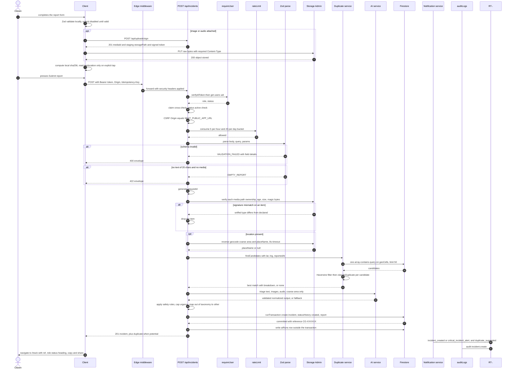

### 1.1 Step-by-step notes

| Step | What actually happens | Failure handling |
| --- | --- | --- |
| 1 | `requireUser()`: header → `verifyIdToken` → `users/{uid}` read → claim cross-check → `status` gate | `401 AUTH_REQUIRED` / `AUTH_INVALID_TOKEN` / `AUTH_EXPIRED`; `403 ACCOUNT_UNAVAILABLE`; `403 ROLE_MISMATCH` (+ audit) |
| 2 | CSRF: `Origin` (or `Referer`) must equal `NEXT_PUBLIC_APP_URL` | `403 CSRF_FAILED` |
| 3 | Rate limit: **two** buckets, 5/hour and 20/day, keyed on `uid` + route + window | `429 RATE_LIMIT_EXCEEDED` with `Retry-After` |
| 4 | Zod: `text` 20–2000 after trim, `media` ≤ 3 items with a path regex and a 30-minute issuance window, `location` bounds, `reportedAt` within [−24 h, +5 min], `language` ISO-639-1, `skipTriage` restricted to `dispatcher`/`admin` | `400 VALIDATION_FAILED` with `details`; `422 EMPTY_REPORT` |
| 5 | Media verification: for each `storagePath`, Admin SDK `stat` + first-4-KiB sniff + size check. **The client `contentType` is ignored in favour of the sniffed type** | `UPLOAD_NOT_FOUND` 422; `UPLOAD_SIGNATURE_MISMATCH` 415 (item dropped); `UPLOAD_TOO_LARGE` 413; `UPLOAD_FORBIDDEN_PATH` 403; if nothing survives and there is no text → `EMPTY_REPORT` |
| 6 | Reverse geocode (best-effort, 8 s timeout). Only the **coarse** area label is passed to Gemini; the street-level `placeName` is stored for dispatchers and is never sent to the model (FR-035) | `placeName: null`; incident still created |
| 7 | Duplicate search: exactly **one** `array-contains` query on `geoCells`, `limit(50)`; skipped entirely when there is no location, with `duplicateStatus: 'none'` and the reason recorded | Firestore failure → `DB_UNAVAILABLE` 503 |
| 8 | AI triage: sanitise → prompt → call → Zod `.strict()` → one repair → fallback (see §2) | **Never** fails the request (FR-029) |
| 9 | Transaction: `incidents/{id}` (with `reference` uniqueness retry), `incidents/{id}/statusHistory` `eventType: 'created'`, `incidents/{id}/reports/{reportId}` | `503 DB_UNAVAILABLE` |
| 10 | `aiRuns/{runId}` written **outside** the transaction, so an AI-log failure cannot roll back the incident | best-effort |
| 11 | Response `201` with the incident and, when relevant, `data.duplicate` with the full `breakdown` and `canLink` | — |
| 12 | Notification fan-out and audit are fire-and-forget | `FR-107`: never blocks; failures logged |

### 1.2 Idempotent replay

```
POST /api/incidents
  Idempotency-Key: 8f3a...            (required by the CSRF rule)
        │
        ├─ first time   → run the pipeline → 201 with the incident
        │
        └─ replay       → no pipeline; the stored response is returned
                           with header  Idempotent-Replay: true
```

The key is stored alongside the uid in `rateLimits` for 24 hours ([08](./08_API_SPECIFICATION.md) §3.1). A citizen who taps Submit twice, or who retries on a flaky connection, gets **one** incident.

### 1.3 What the citizen sees, in order

1. A disabled submit button with `aria-describedby` helper text until one evidence channel is valid (FR-017).
2. Per-file upload progress; submit disabled while any upload is in flight.
3. On `201`: a `role="status"` success heading with the reference `CG-XXXXXX`, a copy button, and a share action. Focus moves to the heading (US-001).
4. Navigation to `/track?ref=CG-XXXXXX`, which is scoped to the owner and shows status, a timeline, and a "what happens next" sentence (FR-011, FR-145).
5. If `data.duplicate.status === 'potential_duplicate'`: "There may already be a report for this", with "add my details to it" or "this is a different incident" (the second requires a reason) (US-007).

---

## 2. AI triage flow — validation, repair, fallback

**Entry:** `POST /api/incidents` step 8, or `POST /api/incidents/:id/triage` for a deliberate re-run (`dispatcher`/`admin`, plus a reporter re-analyse affordance on their own `new`/`triaged` incident). **Normative source:** [09](./09_AI_GEMINI_SPECIFICATION.md).

```mermaid
flowchart TB
  IN(["Report accepted"]) --> B1["buildTriageInput<br/>text 2000 chars, images 3, audio 1,<br/>coarseArea label only, hasLocation flag"]
  B1 --> S1["Step 1 length cap to 2000"]
  S1 --> S2["Step 2 NFKC, strip zero-width<br/>and bidi override characters"]
  S2 --> S3["Step 3 strip control characters"]
  S3 --> S4["Step 4 wrap in citizen_report<br/>and untrusted_extract"]
  S4 --> S5["Step 5 neutralise instruction markers"]
  S5 --> S6["Step 6 redact PII in the copy sent to the model only"]
  S6 --> S7["Step 7 flood guard, 8-gram repeated over 6"]
  S7 --> S8["Step 8 suspicionScore from injection heuristics"]
  S8 --> P1["buildSystemPrompt<br/>PROMPT_VERSION triage-v3<br/>plus 3 few-shot examples"]

  P1 --> G1{"Local quota guard<br/>RPM and RPD within limits?"}
  G1 -->|"no"| FB["fallback.ts<br/>keyword rules, offline, confidence at most 0.55"]
  G1 -->|"yes"| C1["generateContent<br/>responseMimeType json, responseSchema,<br/>BLOCK_ONLY_HIGH safety, temperature 0.1"]
  C1 --> T1{"Returned within 20s?"}
  T1 -->|"timeout"| ERR1["outcome timeout"]
  T1 -->|"429"| ERR2["retry up to 3x for 429 and 503 only<br/>then outcome error, errorCode AI_QUOTA"]
  T1 -->|"5xx"| ERR2
  T1 -->|"blocked by safety filter"| ERR3["outcome blocked<br/>urgency forced to at least high"]
  T1 -->|"ok"| V1["JSON parse"]

  V1 --> V2{"Passes aiTriageOutputSchema<br/>Zod strict, no extra keys?"}
  V2 -->|"no"| RP["One repair attempt<br/>temperature 0, only the Zod issue paths,<br/>the prior response is not echoed"]
  RP --> V3{"Valid now?"}
  V3 -->|"yes"| RULES
  V3 -->|"no"| FB2["outcome validation_failed<br/>then fallback"]
  V2 -->|"yes"| RULES["rules.ts deterministic post-processing"]
  ERR1 --> FB
  ERR2 --> FB
  ERR3 --> FB
  FB2 --> FB

  RULES --> R1["R1 critical flags force at least high"]
  R1 --> R2["R2 trapped expressions raise urgency and add medical flags"]
  R2 --> R3["R3 gas leak or fire at least high"]
  R3 --> R4["R4 peopleAffected stays null, never substituted"]
  R4 --> R5["R5 confidence below 0.6 adds low_confidence"]
  R5 --> R6["R6 no coordinates adds unclear_location"]
  R6 --> R7["R7 suspicion 3 or more caps confidence at 0.4"]
  R7 --> R8["R8 diagnosis terms not in the input are removed from the summary"]
  R8 --> R9["R9 urgency is never lowered by code"]
  R9 --> R10["R10 unsupported language forced to en with a note"]
  R10 --> NORM["normalizeTriageOutput<br/>single conversion into incidents fields"]

  NORM --> LOG["logAiRun<br/>model, promptVersion, latency, tokens,<br/>outcome, fallbackUsed, rawOutputHash"]
  FB --> LOG
  LOG --> OUT(["category, urgency, summary,<br/>safetyFlags, aiConfidence, requiredResources,<br/>peopleAffected, language"])
```

### 2.1 The decision table, verbatim in effect

| Condition | `aiRuns.outcome` | Next | Resulting `triageSource` |
| --- | --- | --- | --- |
| Local guard tripped (RPM or RPD) | `error` (`errorCode: 'AI_QUOTA'`) | fallback, **no network call** | `fallback` |
| Timeout at 20 s | `timeout` | fallback | `fallback` |
| 429 after retries | `error` | fallback | `fallback` |
| Network/5xx after retries | `error` | fallback | `fallback` |
| Safety-blocked | `blocked` | fallback for the rest; urgency forced to ≥ `high` | `fallback` |
| JSON parse failure | `validation_failed` | one repair | `fallback` if the repair fails |
| Zod failure after one repair | `validation_failed` | fallback | `fallback` |
| `finishReason === 'MAX_TOKENS'` | `validation_failed` | fallback | `fallback` |
| `suspicionScore >= 3` | `success` | confidence forced to ≤ 0.4, `low_confidence` added | `ai` |
| Valid on the first attempt | `success` | rules → normalise | `ai` |
| Valid on the repair attempt | `success`, `attempt: 2` | rules → normalise | `ai` |

### 2.2 Output → field mapping that matters

| AI field | Incident field | Rule |
| --- | --- | --- |
| `category` | `category` | Out of taxonomy ⇒ `other`, and the model's own word is kept in `categoryRaw` (FR-025) |
| `urgency` | `urgency` | After R1–R10. **May be raised by code, never lowered** (R9) |
| — | `urgencySource` | `ai` or `fallback` |
| `summary` | `summary` | ≤ 240 chars, sentence-cased; R8 removes unsupported diagnosis clauses |
| `people_affected` | `peopleAffected` | `null` unless `people_affected_stated === true`. **Never** defaulted to 0 or 1 (FR-023) |
| `required_resources[]` | `requiredResources[]` | `source: 'ai'`, `confidence` capped at 0.5 unless explicitly requested, in which case `source: 'reporter'` and 1.0 |
| `safety_flags` ∪ hazards mapping | `safetyFlags` | Union, deterministically sorted |
| `location_hint` | **not stored** | Shown only in the dispatcher AI panel, prefixed "approximate". A model-generated location is not evidence |
| `audio_transcript` | **not on the incident** | Stored on the **report**; `aiRuns` keeps only a SHA-256 |
| `confidence` | `aiConfidence` | Rounded to 2 dp; `aiNeedsReview = aiConfidence < 0.60` |
| — | `slaTargetMin` | From `config.slaMinutes[urgency]` — 5 / 15 / 60 / 240 |
| — | `status` | Only ever `new → triaged` |

### 2.3 The three hard prohibitions, shown as structure

1. **No outbound capability.** `tools` is never configured. There is no telephony integration in v1. A model output cannot cause a call, an SMS, or a public alert.
2. **No status field.** `aiTriageOutputSchema` contains no status key, so there is no value the model could return that would move an incident.
3. **No coordinates.** The only location output is `location_hint`, free text ≤ 120 chars, described by the prompt as an approximation, and not persisted on the incident.

### 2.4 Failure of the AI never fails the report

```
any failure ──► fallback.ts ──► urgency medium at worst,
                (pure, offline)   triageSource fallback, triageError recorded,
                                  confidence ≤ 0.55 ⇒ "Needs review" always visible
```

The fallback `summary` is deliberately uninformative — `"Reported {category} near {coarseArea or an unknown location}. Automated triage only — needs human review."` — because it has no basis for saying anything about the facts. `peopleAffected` is always `null`; `requiredResources` is always `[]`; `location_hint` is always `null`.

---

## 3. Duplicate detection flow

**Entry:** `POST /api/incidents` step 7, `PATCH /api/incidents/:id` when `location` changes, and `services/duplicates/findCandidates`. **Normative source:** [07](./07_DATABASE_SCHEMA.md) §9. Every gate below is from §9.4.

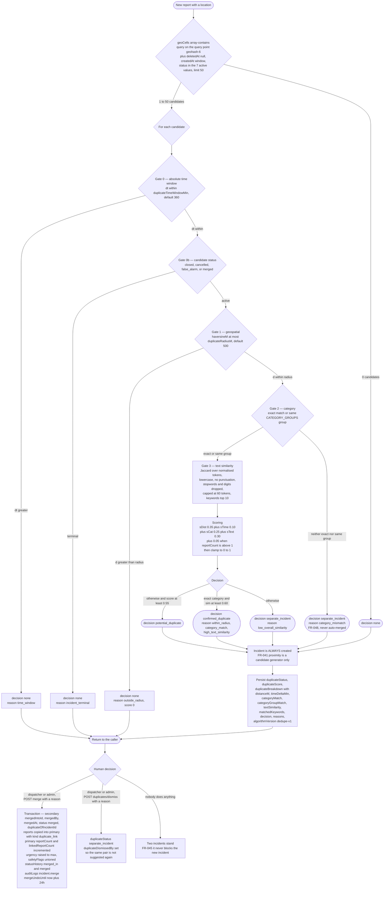

### 3.1 The Firestore query is one read, and it is complete

```ts
// services/duplicates/findCandidates.ts
const cells = buildGeoCells(lat, lng);            // exactly 10 geohash-6 strings
const snap  = await db.collection('incidents')
  .where('geoCells', 'array-contains', cells[0])  // ← ONE query, on the query point's own cell
  .where('deletedAt', '==', null)                 // F-9
  .where('createdAt', '>=', timeWindowStart)
  .where('status', 'in', OPEN_STATUSES)            // 7 active values, under the 30-value limit
  .orderBy('createdAt', 'desc')
  .limit(50)                                      // FR-037 / duplicateMaxCandidates
  .get();
// then: exact Haversine filter, then classifyDuplicate per survivor
```

**Why one query is enough and doing ten would be a 10× read-cost bug:** every incident stores *its own* cell plus its 8 neighbours. Therefore a single `array-contains` on the query point's cell already returns every incident in that cell, and every incident in a neighbouring cell that is within 500 m — because *it* stored this cell too. The other 9 cells would only be needed if incidents did **not** store their neighbours.

**Read cost:** ≤ 51 reads (1 `users` read + ≤ 50 candidates). When a live listener is active the cap drops to 25 ([07](./07_DATABASE_SCHEMA.md) §15).

### 3.2 What the gates buy, and what they cost

| Gate | Requirement | Prevents | Cost |
| --- | --- | --- | --- |
| 0 time window | FR-042 | Merging yesterday's accident with today's | Few candidates |
| 0b terminal status | FR-041 | Linking to a closed incident | Zero |
| 1 radius 500 m | FR-040, DEC-01 | Cross-street merges | Narrower candidate set |
| 2 category group | FR-042, FR-048 | `medical` ≠ `traffic_accident` 20 m apart | **The most important gate** — it is what makes an automatic `separate_incident` honest |
| 3 text similarity | FR-043 | A bus and a lorry in the same spot becoming one incident | Needs a language-appropriate stopword list (English only today) |
| Score + threshold | FR-044, §9.5 | Merging on a single signal | Tunable by an admin with a reason and an audit entry |

### 3.3 Merge reversibility (FR-047)

```
POST /api/incidents/{id}/merge
  → 200 with undoAvailableUntil = now + 24h
  → statusHistory.metadata on both the merged_in and merged events carries mergeUndoUntil

POST /api/incidents/{id}/merge/undo      (dispatcher or admin, reason required)
  → reverses the merge, audit incident.merge_revert
```

A confirmed merge is a **human** action with a **reason** and an **audit row**. Proximity is never sufficient (FR-041), and the merged incident is never hard-deleted (FR-046).

---

## 4. Incident lifecycle state machine

**Statuses (11):** `new`, `triaged`, `verified`, `assigned`, `en_route`, `on_scene`, `resolved`, `closed`, `cancelled`, `false_alarm`, `merged`.
**Normative source:** [07](./07_DATABASE_SCHEMA.md) §4.3, enforced in `lib/incidents/lifecycle.ts` and by `PATCH /api/incidents/:id/status`.

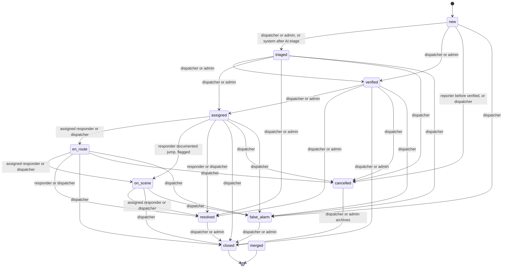

### 4.1 Additional rules enforced alongside the table

| Rule | Implementation | Error when violated |
| --- | --- | --- |
| `resolved` requires a `resolutionCode` from the controlled list | `resolutionCode` is required in the Zod schema for `status: 'resolved'` | `422 RESOLUTION_CODE_REQUIRED`; `400 INVALID_RESOLUTION_CODE` |
| `en_route` / `on_scene` require an active assignment belonging to the actor, unless the actor is `dispatcher`/`admin` | `assertResourceAccess` + the `dispatches` read in the same transaction | `403 FORBIDDEN` |
| `assigned` requires a `dispatches/{id}` with `status == 'active'` | Same transaction reads the dispatch | `409 INVALID_STATUS_TRANSITION` |
| Reporter cancellation is rejected once `verifiedAt` is set | `assertTransitionAllowed` checks `verifiedAt` (FR-019) | `409 INVALID_STATUS_TRANSITION` |
| A responder may not skip states; a dispatcher may, with a `reason` ≥ 10 chars, recorded as `statusHistory.metadata.skippedStates` | `lib/incidents/lifecycle.ts` | `409 TRANSITION_NOT_ALLOWED_YET` for a responder |
| Repeating the same transition is a no-op | Idempotent transition | `200` with `meta.noop: true` |
| Every accepted transition appends `statusHistory` **in the same transaction** | F-5 (FR-052) | — |
| `slaBreachedAt` is set the first time `slaState` evaluates to `breached`, and is **never cleared** | Set-once guard | — |
| `respondedAt` is set on the **first** `en_route` only; likewise `arrivedAt`, `resolvedAt`, `closedAt` | Set-once guard per timestamp | — |

### 4.2 The status-change sub-flow

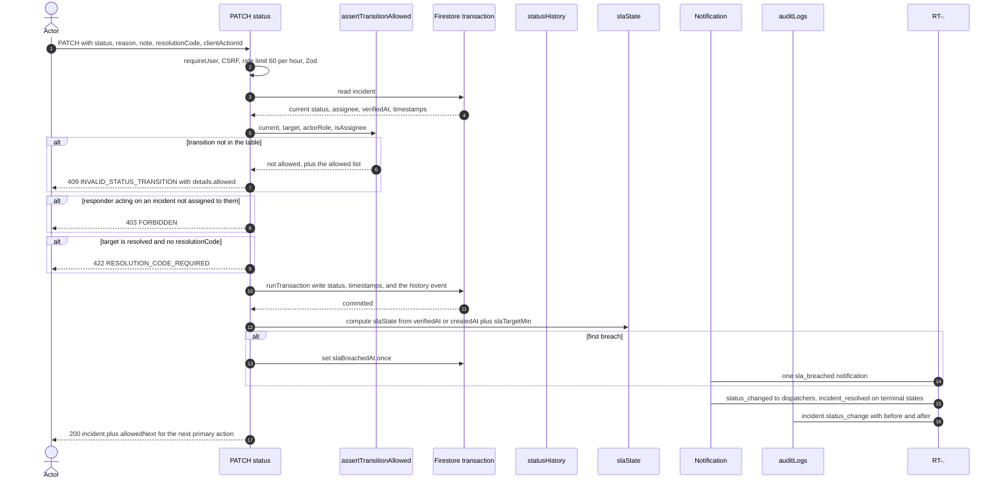

`allowedNext` is returned by the API so the client renders exactly **one** primary action without re-implementing the transition table (US-012). Illegal transitions are impossible in the UI *and* rejected by the API (US-012 criterion 2).

### 4.3 Dispatcher override semantics

A status override that skips a state (e.g. `triaged → on_scene`) is permitted for a `dispatcher`/`admin` **only with a `reason` ≥ 10 chars**, and the jump is recorded as `statusHistory.metadata.skippedStates = ["verified","assigned"]` so the audit trail shows it ([22](./22_USER_ROLES_PERMISSIONS.md) §4.2). A responder can never skip (FR-055).

> **`DECISION REQUIRED` (DR-13).** [07](./07_DATABASE_SCHEMA.md) §4.3 lists the actor for `new → triaged` as *dispatcher/admin*, but [08](./08_API_SPECIFICATION.md) §3.5 states that `POST /api/incidents/:id/triage` "sets `status = triaged` when it was `new`", and [09](./09_AI_GEMINI_SPECIFICATION.md) §6.4 shows the AI triage step producing `status: triaged`. The diagram above represents the implementation (`system` is a valid actor) and the discrepancy is flagged rather than silently resolved. Either amend the §4.3 table to include `system`, or state that the triage step writes the `ai_triaged` history event **without** changing status. **This must be settled before the lifecycle unit tests are written**, because the answer changes the `actorRole` on the first `statusHistory` row of every incident.

---

## 5. Dispatch flow

**Endpoint:** `POST /api/incidents/:id/dispatch` (`dispatcher`/`admin` only). Self-service claim is `POST /api/dispatches/:id/claim` (`responder`, P1).

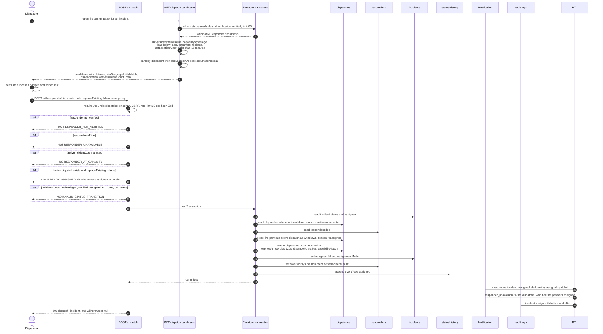

### 5.1 Notes

| Property | Value | Source |
| --- | --- | --- |
| At most one active assignment | Enforced inside the transaction: the previous `active`/`accepted` dispatch is closed before the new one is created | FR-053 |
| Unaccepted assignment expiry | `expiresAt = now + DISPATCH_EXPIRY_SEC` (120 s), swept by `sweep-expired-dispatches` | [08](./08_API_SPECIFICATION.md) §8 |
| Candidate cap | ≤ 10 returned, from ≤ 60 considered | FR-065 |
| Ranking | `distanceM` ascending, then `lastLocationAt` descending; stale (> 15 min) sorted last | US-022 |
| Capability match | `capabilityMatch` is true only when every `incidents.requiredResources[].resourceId` is present in `responders.capabilities` | [07](./07_DATABASE_SCHEMA.md) §8 |
| Outside `serviceRadiusM` | A **warning, not a rejection**, if a `homeBase` is within range | [08](./08_API_SPECIFICATION.md) §3.6 |
| No location | `GET .../candidates` returns `422 LOCATION_REQUIRED` and a first-page-by-freshness list instead of a distance ranking | [08](./08_API_SPECIFICATION.md) §3.7 |
| Duplicate submit | Re-dispatching the same responder to the same incident returns `200` with the existing dispatch | [08](./08_API_SPECIFICATION.md) §3.6 |
| Privacy | The `incident_assigned` notification carries reference, category, urgency, distance, and "Open in maps" — **never** the citizen's name, phone, or address text | FR-068, US-011 |

### 5.2 Human-in-the-loop gate

```
report ──► AI triage ──► triaged ──► [HUMAN] verify ──► verified ──► [HUMAN] assign
                                │                             │
                                └── never skips to ───────────┘
```

`POST /api/incidents/:id/dispatch` requires the incident to be in `triaged`, `verified`, `assigned`, `en_route`, or `on_scene`. The candidate panel **is** shown for a `triaged` incident, but the UI must present a one-click **"Verify and assign"** combined action so the guardrail is one click, not a speed bump. There is no configuration, environment variable, or code path that creates a `dispatches` document without a human actor uid in `dispatches.dispatchedBy` ([09](./09_AI_GEMINI_SPECIFICATION.md) §6.4, DEC-05).

---

## 6. Realtime propagation flow

**Mechanism:** Firestore `onSnapshot` on the client. No polling (FR-090). The database pushes; the application never asks again.

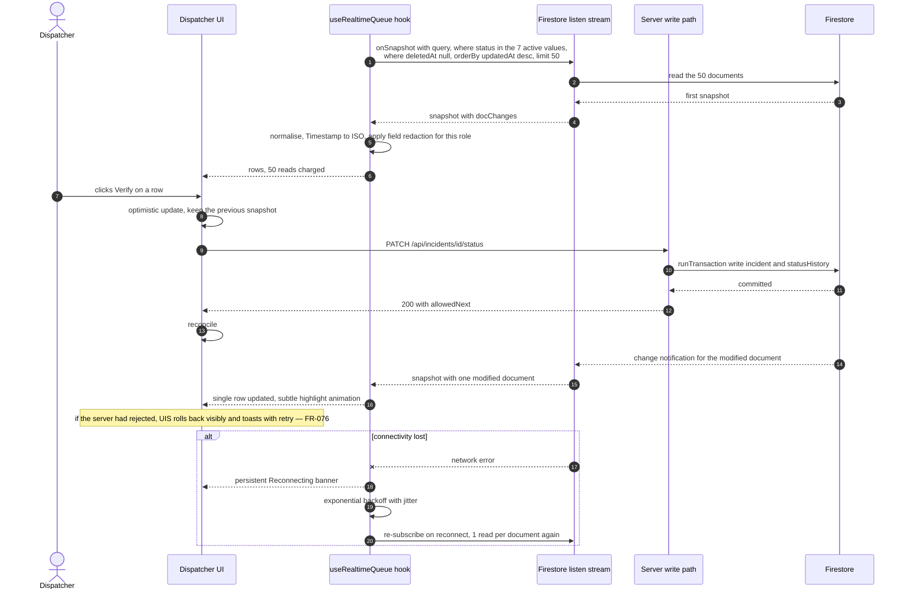

### 6.1 Read accounting

```
attach cost   = 1 read per document in the first snapshot       (50 for the queue)
steady cost   = 1 read per changed document, per listener, per change
window cost   = 1 read per document that falls out of the limit() window
```

A `limit(50)` queue that sees 30 changes in an hour costs ≈ 50 + 30 + (documents that aged out). A listener that is never unsubscribed keeps paying the steady cost forever. Therefore:

| Rule | Requirement |
| --- | --- |
| Every listener query has a `limit()` | FR-092 |
| ≤ 8 concurrent listeners per client | FR-091 |
| Unsubscribe on unmount **and** on role change | FR-092; a citizen's tab must never stay subscribed to dispatcher data |
| `includeMetadataChanges: true` only where the UI shows a pending state | FR-093 |
| No listener on login, marketing, or `/track` | FR-095 |
| No listener for analytics | FR-099 |
| All listener logic lives in `hooks/useRealtime*` | One place to enforce the rules |

### 6.2 What is *not* realtime, and why

| Surface | Transport | Reason |
| --- | --- | --- |
| Analytics | `GET /api/analytics` reading `analyticsDaily` | FR-099 forbids a listener for historical/aggregated queries; a listener on `incidents` for analytics would be a read disaster |
| The full incident queue beyond 50 | Paginated `GET /api/incidents` | Read budget (NFR-007). Documented in [03](./03_SYSTEM_ARCHITECTURE.md) §14 as L-03 |
| Presence ("who is viewing this incident") | **Optional** heartbeat doc | FR-097 is P2 and MUST NOT be required for core function |
| SLA breach state | Computed server-side on read/write | `SLA_BREACH_SWEEP=on_write`; so that multiple dispatcher clients agree (US-025 criterion 3). A `breached` incident still appears within 3 s because the listener pushes the `updatedAt` change |

### 6.3 Optimistic mutation and rollback (FR-076)

```
user action
   │
   ├─ 1. snapshot the current row
   ├─ 2. apply the optimistic change and render it
   ├─ 3. await the server response          (FR-098 — acknowledgement is awaited)
   │
   ├─ success ──► reconcile with the server payload, toast confirms
   └─ rejection ─► restore the snapshot, toast shows the catalogue code
                   and a Retry action
```

If the network drops mid-transition, the responder's action is queued locally, marked "pending sync", and replayed in order on reconnect with the same `clientActionId`; a conflict is reported as "This incident was updated by someone else" and never overwrites (US-014).

---

## 7. Notification fan-out flow

**Trigger:** a state change that appears in the dispatch matrix. **Guarantee:** fire-and-forget; the originating call is never blocked or failed (FR-107). **Dedupe:** exactly one notification per `dedupeKey` (FR-108).

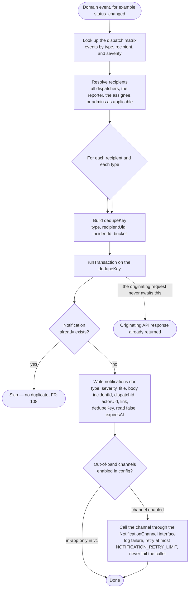

### 7.1 Dispatch matrix (from [07](./07_DATABASE_SCHEMA.md) §10.2)

| Event | Recipients | Severity | In-app in MVP |
| --- | --- | --- | :-: |
| `incident_created` | all available dispatchers | `critical` if `urgency == critical`, else `info` | ✔ |
| `critical_incident_alert` | all dispatchers + admins, deduped per incident | `critical` | ✔ |
| `incident_verified` | the reporter | `info` | ✔ |
| `incident_assigned` | the assigned responder | `critical` | ✔ |
| `status_changed` | all dispatchers; the reporter for terminal states only | `info` | ✔ |
| `incident_resolved` | reporter, all dispatchers, assignee | `info` | ✔ |
| `duplicate_suggested` | all dispatchers | `warning` | ✔ |
| `responder_unavailable` | the dispatchers who had that responder assigned | `warning` | ✔ |
| `sla_breached` | all dispatchers, **once per incident** | `critical` | ✔ |
| `responder_verified` / `role_changed` / `account_suspended` | the affected user | `warning` | ✔ |

`FR-109` is reserved and MUST NOT be used, to keep the traceability table honest.

### 7.2 Rules

| Rule | Requirement | Enforcement |
| --- | --- | --- |
| One notification per `dedupeKey` | FR-108 | `runTransaction` on the key; a replay is a no-op |
| `sla_breached` fires once per incident, not once per render | US-025 | `slaBreachedAt` is set once and never cleared |
| Only the recipient reads or marks a notification | FR-103 | `GET /api/notifications` **always** filters `recipientUid == token.uid`; there is **no** `recipientUid` parameter; rules require `resource.data.recipientUid == request.auth.uid` |
| Only `read` and `readAt` are client-writable | FR-104 | Rules `hasOnly(['read','readAt'])` |
| Title ≤ 90 chars, body ≤ 240 chars, plain text only | FR-102 | Zod `.strict()`, no HTML accepted or rendered (XSS defence T-09) |
| Mark-all-as-read is a `writeBatch` of ≤ 200 | [08](./08_API_SPECIFICATION.md) §6.3 | `422 BATCH_TOO_LARGE` above 200; the client pages |
| Expiry hides, never deletes | [08](./08_API_SPECIFICATION.md) §6.5 | `expiresAt` set; `POST /api/notifications/:id` is a soft-expire |
| Channels are optional and provider-free | FR-105, FR-106 | `NotificationChannel` interface, one implementation, no credentials. `ENABLE_SMS_NOTIFICATIONS=false`, `ENABLE_WHATSAPP_NOTIFICATIONS=false` |

### 7.3 The bell

`GET /api/notifications` returns `{ items, unreadCount, page }` with `unreadCount` from the same query shape (`recipientUid ASC, read ASC, createdAt DESC`). The live unread count in the header comes from a `limit(50)` listener, which is one of the ≤ 8 permitted listeners (FR-091). `GET /api/resources` is cached client-side for 1 h; notifications never are.

---

## 8. Media upload flow

**Endpoints:** `POST /api/uploads/sign`, `POST /api/uploads/finalize`, then `POST /api/incidents` claims the object. **Normative source:** [08](./08_API_SPECIFICATION.md) §8, [15](./15_FILE_STORAGE_SPECIFICATION.md), [22](./22_USER_ROLES_PERMISSIONS.md) §7.1.

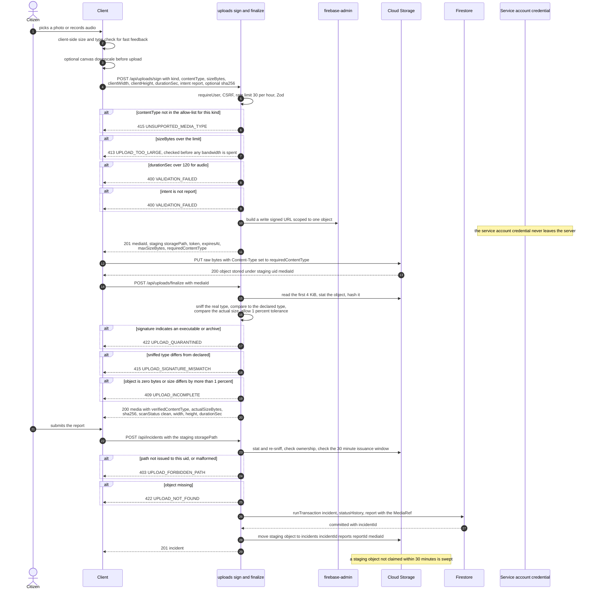

### 8.1 The Storage permission shape

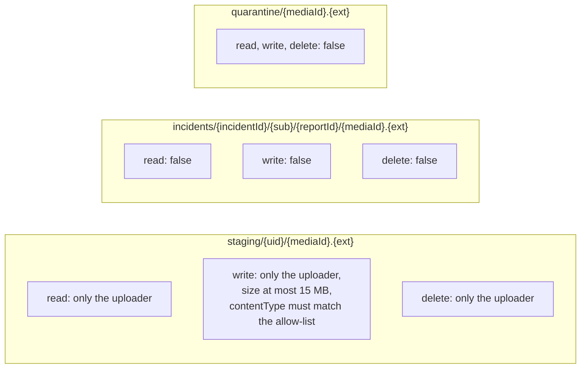

A client **never** receives a Storage service-account credential. It receives a short-lived V4 signed URL scoped to one object with `PUT` only. Every read is a fresh 15-minute signed **read** URL issued by the API after a resource-level authorization check, and only for `scanStatus == 'clean'`. **There is no public or unauthenticated media URL in the system.**

### 8.2 Path contract

| Aspect | Rule | Enforced by |
| --- | --- | --- |
| Staging path | `staging/{uid}/{mediaId}.{ext}` | Storage rules match on `staging/{uid}/…` |
| Final path | `incidents/{incidentId}/(reports\|supplements)/{reportId}/{mediaId}.{ext}` | Regex in the Zod schema + Storage rules |
| Regex | `^incidents/[A-Za-z0-9]{20}/(reports\|supplements)/[A-Za-z0-9]{2,}/[A-Za-z0-9_.-]+$` | `UPLOAD_FORBIDDEN_PATH` |
| Issuance window | Must have been signed to this uid within 30 minutes | `UPLOAD_FORBIDDEN_PATH` |
| Counts | ≤ 3 images, ≤ 1 audio, ≤ 3 items total | `VALIDATION_FAILED` |
| Sizes | image ≤ `UPLOAD_MAX_IMAGE_BYTES` (5 242 880); audio ≤ `UPLOAD_MAX_AUDIO_BYTES` (15 728 640) | `UPLOAD_TOO_LARGE` |
| MIME allow-list | image: `image/jpeg`, `image/png`, `image/webp` · audio: `audio/webm`, `audio/mp4`, `audio/mpeg` | `UNSUPPORTED_MEDIA_TYPE` |

### 8.3 The "what if the bytes are evil" path

```
sniffed signature not in the allow-list
        │
        ├─ declared type was plausible  → UPLOAD_SIGNATURE_MISMATCH 415, item dropped
        ├─ executable or archive        → UPLOAD_QUARANTINED 422
        └─ nothing left and no text     → EMPTY_REPORT 422
```

**Honest limitation:** this is signature validation, not malware scanning. A polyglot file satisfying both a signature and a benign declared type is not detected. `scanStatus: 'clean' | 'pending' | 'quarantined'` exists in the schema precisely so a real scanner can be added with no migration ([03](./03_SYSTEM_ARCHITECTURE.md) ADR-016).

---

## 9. Authentication and authorization flow

### 9.1 Session establishment

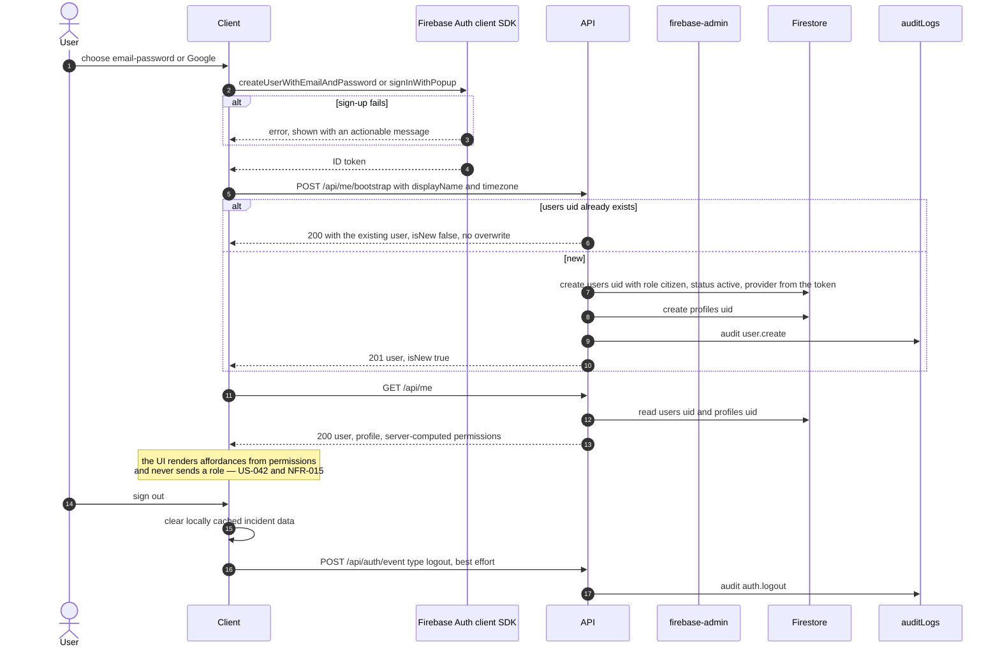

### 9.2 Per-request authorization

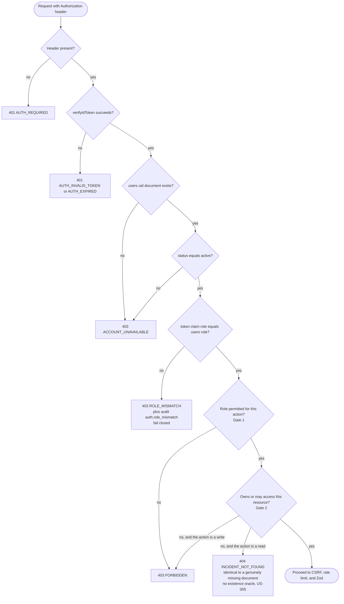

### 9.3 The two gates

```
Gate 1 — role:        may this ROLE perform this ACTION type?
Gate 2 — ownership:   may this USER perform it on THIS resource?
```

| Resource | Gate 2 rule |
| --- | --- |
| `incidents/{id}` read | own (`reporterUid == uid`) · assigned (`assigneeUid == uid`) · in-radius unassigned (responder **and** `available`) · any (dispatcher/admin) |
| `incidents/{id}` write | own + pre-verification + limited fields (citizen) · assigned + specific transitions (responder) · any (dispatcher/admin) |
| `incidents/{id}/reports` | inherits the parent read gate; create requires the parent to be own + pre-verification |
| `incidents/{id}/statusHistory` | inherits the parent read gate; **no client write, ever** |
| `dispatches/{id}` | `responderUid == uid` · dispatcher/admin |
| `responders/{uid}` | self · dispatcher/admin, with redaction of `phone` and `verificationNote` |
| `responderLocations/{uid}` | self writes · dispatcher/admin read · **no other role reads** |
| `notifications/{id}` | `recipientUid == uid` only. There is no `?recipientUid=` parameter |
| `users/{uid}` | self (redacted) · admin |
| `auditLogs/{id}` | dispatcher read · admin read · **no writes at all** |
| `config/app` | all authenticated read the client-safe subset; admin reads and writes the full document |
| `rateLimits/{key}` | no client access whatsoever — server-mediated |

### 9.4 Role change

```mermaid
sequenceDiagram
  autonumber
  actor A as Admin
  participant UI as Two-step confirm dialog
  participant RT as PATCH admin users id role
  participant FS as Firestore transaction
  participant AC as setCustomUserClaims
  participant U2 as Affected user client

  A->>UI: choose the new role and type a reason of at least 10 chars
  UI->>UI: second dialog naming the user and both roles
  UI->>RT: PATCH with role and reason, plus Idempotency-Key
  alt admin is changing their own role
    RT-->>UI: 400 SELF_ROLE_CHANGE_FORBIDDEN
  end
  alt role is unchanged
    RT-->>UI: 409 ALREADY_ROLE
  end
  alt no reason
    RT-->>UI: 400 REASON_REQUIRED
  end
  RT->>FS: runTransaction update users role, write auditLogs user.role_change with before, after, reason
  FS-->>RT: committed
  RT->>AC: set the custom claim, retried up to 3 times
  alt claim write succeeded
    RT->>FS: clear roleChangePending
    RT-->>UI: 200
  else claim write failed
    RT->>FS: set roleChangePending true
    RT-->>UI: 202 with claimsSynchronised false
  end
  UI-->>U2: the client shows permissions changed, refresh to apply
  U2->>U2: getIdToken true, then the claim matches the role
  Note over FS,AC: Firestore role is authoritative; the claim exists only for Security Rules
```

**Guards:** `SELF_ROLE_CHANGE_FORBIDDEN`, `SELF_DISABLE_FORBIDDEN`, `REASON_REQUIRED`, `ALREADY_ROLE`, `ROLE_ESCALATION_GUARD`, `USER_NOT_FOUND`. The first `admin` is created out of band by `scripts/create-admin.ts`; **no endpoint can create the first admin**.

**Account suspension:** `PATCH /api/admin/users/:id/status` with `suspended` requires a reason, writes `user.disable`, notifies the user in-app, and sets `users/{uid}.tokensValidAfter` so `verifyIdToken(token, true)` rejects tokens issued earlier. **Honest residual risk:** rules still allow an old token to read its own user document until it expires, which is exactly why all privileged data reads are server-mediated.

---

## 10. Analytics rollup flow

**Endpoint reads:** `GET /api/analytics` (`dispatcher`/`admin` only, 30/min). **Writers:** the daily cron route (guarded by `CRON_SECRET`) and `POST /api/analytics/recompute` (`admin`, 5/hour).

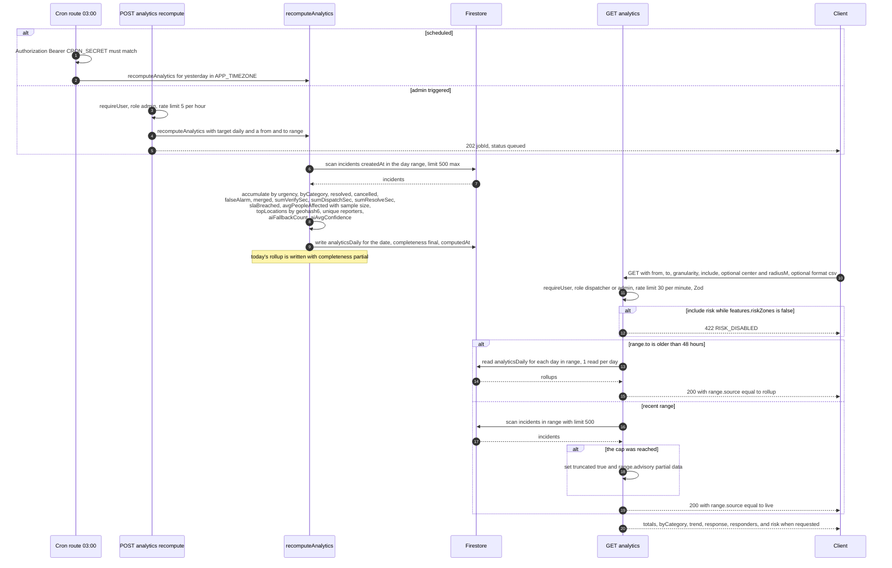

### 10.1 Why rollups exist

Firestore has no `GROUP BY` and no aggregation. Computing a 30-day window on the fly would cost **1 read per incident**. A rollup costs **1 read per day**, so a 30-day analytics view is ~30 reads whether there are 500 incidents or 50 000 (FR-116, [07](./07_DATABASE_SCHEMA.md) §11.7).

### 10.2 Rollup document fields

| Group | Fields |
| --- | --- |
| Identity | `date` (`YYYY-MM-DD` in `APP_TIMEZONE`, = doc ID), `timezone`, `schemaVersion` |
| Urgency counts | `total`, `critical`, `high`, `medium`, `low` |
| Category | `byCategory` — 11 keys |
| Outcomes | `resolvedCount`, `cancelledCount`, `falseAlarmCount`, `mergedCount` |
| Time sums | `sumVerifySec`, `sumDispatchSec`, `sumResolveSec` (means are derived) |
| SLA | `slaBreachedCount` |
| People | `avgPeopleAffected`, `peopleSampleSize` — the null-heavy field is shown honestly |
| Geography | `topLocations` — up to 10 `{ geohash6, count }` |
| Quality | `reporterCount`, `aiFallbackCount`, `aiAvgConfidence` |
| Meta | `computedAt`, `completeness` (`partial` for today, `final` otherwise) |

### 10.3 Response honesty markers

| Marker | Meaning |
| --- | --- |
| `range.source: 'rollup' \| 'live'` | Tells the client which path produced the numbers — visible in the UI as a footnote |
| `truncated: true` + `range.advisory: 'partial data'` | The live scan hit the 500-document cap; the numbers are a floor, not a total |
| `peopleSampleSize` | How many incidents had a non-null `peopleAffected` |
| `completeness: 'partial'` | Today is still accruing |

---

## 11. Risk zone computation flow

**Enabled by:** `ENABLE_RISK_ZONES` / `config.features.riskZones`. Disabled in the MVP. **Endpoints:** `GET /api/analytics?include=risk` (reads, never recomputes) and `POST /api/analytics/recompute { target: 'risk' }` (`admin`).

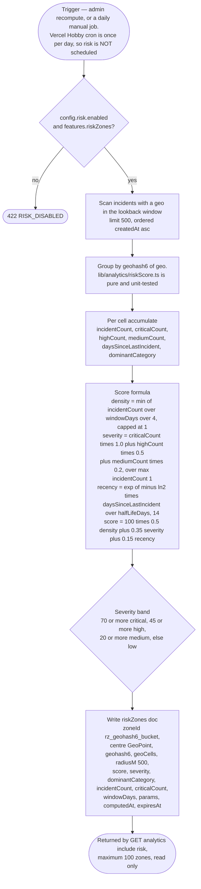

### 11.1 Rules

| Rule | Value | Source |
| --- | --- | --- |
| Never recompute on a `GET` | A read must not mutate | [08](./08_API_SPECIFICATION.md) §7.1 |
| Store the parameters used | `params: { weightDensity, weightSeverity, halfLifeDays }` so a score is reproducible | FR-115 |
| Stale zones are hidden | `expiresAt`; a zone is not shown after it | [07](./07_DATABASE_SCHEMA.md) §11.3 |
| The formula is pure and unit-tested | `lib/analytics/riskScore.ts`, no Firestore import | FR-049 pattern |
| Heuristic, not ML | DEC-13 — no training data, zero cost | [01](./01_PRODUCT_REQUIREMENTS_DOCUMENT.md) §12 |
| Access | `dispatcher` reads; `responder` gets a redacted read-only view; `citizen` has no access | FR-117, [22](./22_USER_ROLES_PERMISSIONS.md) rows 48–49 |

> **`DECISION REQUIRED` (DR-14).** [08](./08_API_SPECIFICATION.md) §7.2 says `POST /api/analytics/recompute` accepts `target: 'daily' | 'risk'`, but it is unclear whether a `risk` target accepts the same `from`/`to` range as a `daily` target, or whether it always uses `config.risk.windowDays` as its lookback. Recommend: `target: 'risk'` **ignores** `from`/`to` and uses `config.risk.windowDays`, because the score formula is defined over a lookback window and mixing a range parameter with a window parameter invites two implementations of the same computation. Confirm before the endpoint is written.

---

## 12. Audit log write flow

**Collection:** `auditLogs` — append-only, and no role may update or delete a row, **including `admin`** (FR-131).

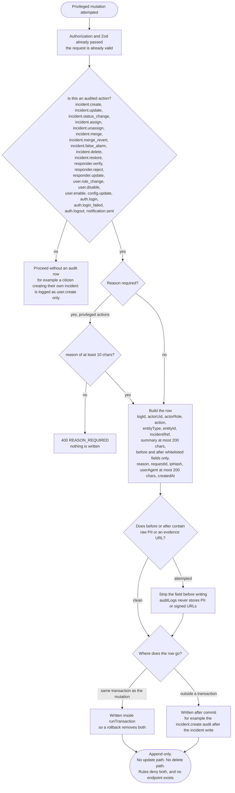

### 12.1 Required content of an audit row

| Field | Rule |
| --- | --- |
| `actorUid` | The authenticated uid, or the literal `"system"` for automation |
| `actorRole` | The role **at the time of the action** |
| `action` | One of the 24 `AuditAction` values |
| `entityType` / `entityId` | `incident`, `user`, `responder`, `dispatch`, `config`, `auth`, or `notification`, plus the id |
| `incidentRef` | The human `CG-XXXXXX` reference, for human readability |
| `summary` | ≤ 200 chars, human readable |
| `before` / `after` | **Whitelisted fields only** — never raw PII, never an evidence signed URL |
| `reason` | Required for privileged actions (FR-133) |
| `requestId` | Correlation with the server log (FR-141) |
| `ipHash` | SHA-256 of the IP plus the **daily rotating** `IP_HASH_SALT`. The raw IP is never stored |
| `userAgent` | ≤ 200 chars |
| `createdAt` | Server `Timestamp` |

### 12.2 The two hard denials

| Denial | Mechanism | Test |
| --- | --- | --- |
| Delete an audit log entry — **every role including admin** | No endpoint exists; rules `allow write: if false` on `auditLogs` | Negative test: admin `delete` ⇒ denied |
| Change your own role | `SELF_ROLE_CHANGE_FORBIDDEN` on `PATCH /api/admin/users/:id/role` | Negative test per role |

### 12.3 Index and query

`createdAt DESC` (default), `actorUid ASC, createdAt DESC`, `action ASC, createdAt DESC`, `entityType ASC, entityId ASC, createdAt DESC`. `GET /api/admin/audit-logs` filters by actor, action, entity type, entity id, and date range, paginates at 50 (≤ 100), and supports `format=csv` reflecting the active filters (FR-134, US-032).

### 12.4 Log-flood protection

`auth.login_failed` is rate-limited to **10 per IP per hour** (FR-135), so an attacker cannot fill `auditLogs` and starve the real trail. Failed sign-ins arrive at `POST /api/auth/event` **without** a token, and the endpoint **never** reveals whether a user exists.

---

## 13. Rate-limit token bucket flow

**Store:** Firestore. `rateLimits/{sha256(uid + route + windowBucket)}`. **Cost:** 1 read + 1 write per limited request. **Why not in-memory:** Vercel functions are stateless and concurrent ([03](./03_SYSTEM_ARCHITECTURE.md) §10.2).

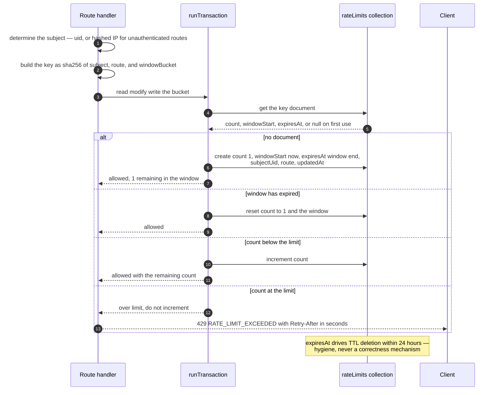

### 13.1 Limit table (from [08](./08_API_SPECIFICATION.md) §1.9)

| Route class | Limit | Window |
| --- | --- | --- |
| `POST /api/incidents` | 5 / 20 | 1 h / 24 h |
| `POST /api/incidents/:id/triage` | 20 | 1 h |
| `PATCH /api/incidents/:id/status` | 60 | 1 h |
| `POST /api/incidents/:id/dispatch` | 30 | 1 h |
| `POST /api/incidents/:id/merge` | 20 | 1 h |
| `POST /api/uploads/sign` | 30 | 1 h |
| `PATCH /api/responders/:id/location` | 120 | 1 h (≈ 30 s effective floor) |
| `GET /api/incidents` | 120 | 1 min |
| `GET /api/analytics` | 30 | 1 min |
| `POST /api/notifications` | 10 | 1 min |
| Unauthenticated `POST /api/auth/login-failed` | 10 per IP | 1 h |

### 13.2 The heartbeat's second guard

`PATCH /api/responders/:id/location` has a rate limit **and** a stale-read abuse guard: the server rejects an update whose `capturedAt` is less than 20 s after the previously stored `capturedAt`, with `429 HEARTBEAT_TOO_FREQUENT` and a `Retry-After`. The rate limit alone cannot stop a client that replays a *newer* timestamp at high frequency, because each request looks new; the `capturedAt` comparison catches that. The client backs off to `RESPONDER_HEARTBEAT_SEC = 60`.

### 13.3 Notes

| Property | Behaviour |
| --- | --- |
| Doc ID | Hashed, so the document ID does not leak a uid; `subjectUid` is stored as a separate field for admin visibility |
| `rateLimits` client access | **None.** `allow read, write: if false` in the rules |
| Failure behaviour | If the rate-limit read/write fails, the request is **allowed** and the failure is logged. A broken limiter must not take the reporting path down |
| Staging/dev values | Dev and staging may use 5× the production values; production uses the table above ([21](./21_ENVIRONMENT_VARIABLES.md) §4) |

---

## 14. Error propagation across layers

### 14.1 The envelope

```json
{ "success": false,
  "error": { "code": "INCIDENT_NOT_FOUND",
             "message": "Incident could not be found.",
             "details": [ { "field": "urgency", "issue": "invalid_enum_value" } ],
             "requestId": "req_7Kd2mQ9xL4n" } }
```

| Field | Rule |
| --- | --- |
| `code` | A stable machine string from the catalogue. The UI branches on it; a human never sees it |
| `message` | Human-readable English, safe to display. No internal identifiers |
| `details` | Field-level validation information **only**. Never a stack trace, never an internal id |
| `requestId` | **Always present**, including on a 500, so a user can quote it in a bug report (US-041) |

### 14.2 The propagation ladder

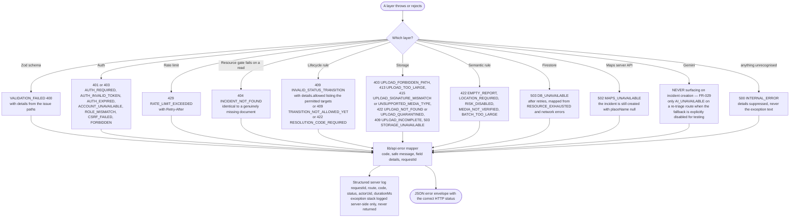

### 14.3 Status code map

| Status | Meaning | Representative codes |
| --- | --- | --- |
| 200 / 201 | Success | — |
| 400 | Schema validation | `VALIDATION_FAILED`, `INVALID_RESOLUTION_CODE`, `REASON_REQUIRED`, `SELF_MERGE_NOT_ALLOWED` |
| 401 | Missing/invalid token | `AUTH_REQUIRED`, `AUTH_INVALID_TOKEN`, `AUTH_EXPIRED` |
| 403 | Authenticated but not permitted | `FORBIDDEN`, `ROLE_MISMATCH`, `ACCOUNT_UNAVAILABLE`, `CSRF_FAILED`, `UPLOAD_FORBIDDEN_PATH`, `ROLE_ESCALATION_GUARD` |
| 404 | Not found **or** not visible — identical response | `INCIDENT_NOT_FOUND`, `RESPONDER_NOT_FOUND`, `USER_NOT_FOUND`, `DISPATCH_NOT_FOUND`, `NOTIFICATION_NOT_FOUND` |
| 409 | State conflict | `INVALID_STATUS_TRANSITION`, `TRANSITION_NOT_ALLOWED_YET`, `ALREADY_ASSIGNED`, `ALREADY_ROLE`, `ALREADY_VERIFIED`, `INCIDENT_ALREADY_DELETED`, `DISPATCH_EXPIRED`, `DISPATCH_ALREADY_ACCEPTED`, `MERGE_BLOCKED_ACTIVE_ASSIGNMENT`, `UPLOAD_INCOMPLETE` |
| 413 / 415 | Upload size / media type | `UPLOAD_TOO_LARGE`, `UPLOAD_SIGNATURE_MISMATCH`, `UNSUPPORTED_MEDIA_TYPE` |
| 422 | Well formed but semantically rejected | `EMPTY_REPORT`, `RESOLUTION_CODE_REQUIRED`, `UPLOAD_NOT_FOUND`, `UPLOAD_QUARANTINED`, `MEDIA_NOT_VERIFIED`, `LOCATION_REQUIRED`, `RISK_DISABLED`, `BATCH_TOO_LARGE` |
| 429 | Rate limited | `RATE_LIMIT_EXCEEDED`, `HEARTBEAT_TOO_FREQUENT` |
| 500 | Unexpected | `INTERNAL_ERROR` |
| 502 / 503 | Upstream failure | `AI_UNAVAILABLE`, `MAPS_UNAVAILABLE`, `DB_UNAVAILABLE`, `STORAGE_UNAVAILABLE` |

### 14.4 Layer-to-layer degradation, in one table

| Failing layer | HTTP to the caller | What still works | User-visible state |
| --- | --- | --- | --- |
| Edge / CDN | Network error | Nothing on that route | Browser error page |
| Route handler logic | `500 INTERNAL_ERROR` | Other routes | Toast with the `requestId` |
| `requireUser` | `401` / `403` | Nothing on that route | Sign-in prompt or an account-state message |
| Rate limit store | Request **allowed**, logged | Everything | None |
| Duplicate search (Firestore) | `503 DB_UNAVAILABLE` | Nothing in that request | Retry toast |
| AI | `200`/`201` **success** | Everything | "Needs review" badge, `triageSource: fallback` |
| Media verification (Storage) | Item dropped; `422 EMPTY_REPORT` only if nothing survives | Text-only reporting | Per-file retry with progress |
| Reverse geocode (Maps) | `200`/`201` success | Everything | `placeName` missing; the dispatcher sees coordinates |
| Map SDK in the browser | N/A | Every list surface | Static list with coordinates + "Retry map" |
| Notification fan-out | `200`/`201` success | Everything | A stale bell |
| Firestore listener | N/A | The initial snapshot is retained | "Reconnecting…" banner |
| Analytics rollup | `200` with `truncated: true` | Everything | "partial data" footnote |

---

## 15. Data lifecycle and retention flow

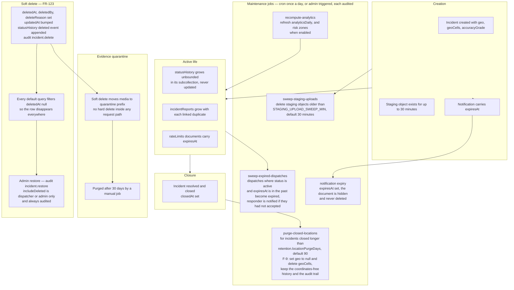

### 15.1 Retention table

| Entity | Trigger | Action | Field written | Config / env | Requirement |
| --- | --- | --- | --- | --- | --- |
| Precise incident location | Incident closed longer than the retention window | **Purge** the coordinates; keep the rest | `geo = null`, `geoCells` removed, `updatedAt` bumped | `config.retention.locationPurgeDays` = 90, or `NFR-028` default | NFR-028 |
| Staging uploads | Object older than 30 minutes and unclaimed | Delete | n/a (Storage) | `STAGING_UPLOAD_SWEEP_MIN` | FR-007 |
| Expired dispatches | `expiresAt` in the past and `status == 'active'` | Mark `expired`, free the responder's load | `status`, `updatedAt` | `DISPATCH_EXPIRY_SEC` = 120 | FR-053 |
| Notifications | `expiresAt` in the past | **Hide**, never delete | `expiresAt` | set by the creator or by `DELETE /api/notifications/:id` | [08](./08_API_SPECIFICATION.md) §6.5 |
| Rate-limit buckets | `expiresAt` in the past | TTL delete (within 24 h — hygiene only) | — | `RATE_LIMIT_WINDOW_SEC` | NFR-016 |
| Risk zones | `expiresAt` in the past | Hidden | `expiresAt` | `config.risk` | FR-115 |
| Quarantined evidence | 30 days after moving to `quarantine/` | Delete | n/a (Storage) | Manual job | [07](./07_DATABASE_SCHEMA.md) §12.4 |
| `auditLogs` | Never within the retention period | **Retained** ≥ 365 days | — | `config.retention.auditDays` = 365 | FR-136 |
| `incidents` | Never hard-deleted | Soft delete only | `deletedAt` | — | FR-123, DEC-11 |
| `statusHistory` | For the lifetime of the incident | Never updated, never deleted | — | — | FR-059 |

### 15.2 Two rules that must not be violated

1. **TTL is a hygiene tool, never a correctness mechanism.** Firestore deletes "within 24 h of `expiresAt`", so anything that must be *gone* within a bounded time (precise location, quarantined evidence) needs a job that explicitly clears or deletes it — not a TTL field.
2. **Location purge must not destroy the record.** The incident, its `statusHistory`, its `auditLogs` row, and its category/urgency/outcome all survive. Only `geo` and `geoCells` go. A dispatcher investigating an incident from six months ago sees "location no longer retained" — not a hole in the data.

### 15.3 Maintenance job authorisation

```
POST /api/admin/maintenance/sweep-expired-dispatches   { reason }
POST /api/admin/maintenance/sweep-staging-uploads      { reason }
POST /api/admin/maintenance/purge-closed-locations     { reason }
POST /api/admin/maintenance/recompute-analytics        { reason }

  requireUser ──► role admin ──► config.features.maintenance must be true
              ──► reason required ──► each execution writes its own audit row
  else 422 MAINTENANCE_DISABLED
```

`config.features.maintenance` is not in the `features` map shown in [07](./07_DATABASE_SCHEMA.md) §11.8, which lists `{ voice, image, clusters, riskZones, bulkActions }`. Either the flag is added to the map or the gate reads `ENABLE_MAINTENANCE_JOBS` from the environment. Logged as **DR-15** in §18.

---

## 16. Cross-diagram consistency checks

Use this as a review checklist when any of these diagrams changes.

| # | Check | Why |
| --- | --- | --- |
| X-1 | Every endpoint named in a diagram exists in [08](./08_API_SPECIFICATION.md) with the same method and path | A flow that invents an endpoint is a spec change |
| X-2 | Every collection named exists in [07](./07_DATABASE_SCHEMA.md) with the same name | `incidents`, `incidentReports`, `statusHistory`, `users`, `profiles`, `responders`, `responderLocations`, `dispatches`, `notifications`, `resources`, `riskZones`, `auditLogs`, `aiRuns`, `rateLimits`, `analyticsDaily`, `config/app` |
| X-3 | Every error code used appears in the [08](./08_API_SPECIFICATION.md) catalogue with the same status | A new code needs an entry in [16](./16_ERROR_HANDLING.md) too |
| X-4 | Every field written appears in the [07](./07_DATABASE_SCHEMA.md) field table | Field names are normative |
| X-5 | Every actor label is one of `citizen`, `responder`, `dispatcher`, `admin`, or the literal `system` | Anything else in `actorUid` breaks the audit model |
| X-6 | Every status in §4 is one of the 11 in [07](./07_DATABASE_SCHEMA.md) §4.3 | No ad-hoc status |
| X-7 | Every transition in §4 is in the §4.3 table (or is explicitly flagged as `DECISION REQUIRED`) | FR-051 |
| X-8 | Every env var named exists in [21](./21_ENVIRONMENT_VARIABLES.md) | No invented variable names |
| X-9 | Every read in a diagram is `limit()`-bounded, and every default query filters `deletedAt == null` | R4, F-9 |
| X-10 | No diagram shows a notification write, an audit write, or an AI call blocking the request that triggered it | F-4, F-6, F-7 |
| X-11 | Every diagram that shows a 404 for a visibility failure shows the identical shape as a genuinely missing document | US-005, [22](./22_USER_ROLES_PERMISSIONS.md) §5 |
| X-12 | No diagram shows a client writing status, urgency, merge, dispatch, or role | R3, [22](./22_USER_ROLES_PERMISSIONS.md) §3 |

---

## 17. Flows deliberately not drawn

| Flow | Why there is no diagram |
| --- | --- |
| Sign-up / sign-in form validation | Trivial; the interesting part is §9.1 |
| CSV export | A straight serialisation of a bounded query; columns are enumerated in [08](./08_API_SPECIFICATION.md) §3.11 |
| Pagination mechanics | Covered in prose in [07](./07_DATABASE_SCHEMA.md) §12.3 and ADR-017 |
| Map viewport cell queries | Covered in [03](./03_SYSTEM_ARCHITECTURE.md) §14 L-08 and [26](./26_PERFORMANCE_REQUIREMENTS.md) §7 |
| The seed script | Not a runtime flow; guarded by `ALLOW_SEED` and `NODE_ENV` (FR-147) |
| Responder offline action replay | The queue itself is a client detail; its *server* contract is `clientActionId` idempotency, covered in §4.2 and §6.3 |

---

## 18. `DECISION REQUIRED` items raised by these diagrams

| ID | Question | Where it arises | Why it matters | Proposed resolution |
| --- | --- | --- | --- | --- |
| **DR-13** | Is `new → triaged` a dispatcher/admin transition, a `system` transition, or both? | §4, against [07](./07_DATABASE_SCHEMA.md) §4.3 vs [08](./08_API_SPECIFICATION.md) §3.5 and [09](./09_AI_GEMINI_SPECIFICATION.md) §6.4 | It changes the `actorRole` on the first `statusHistory` row of **every** incident, and it decides whether the lifecycle unit tests accept a system actor | Amend [07](./07_DATABASE_SCHEMA.md) §4.3 to list `system` for `new → triaged` on the AI path, and keep the re-triage route as an explicit dispatcher action that produces the same status with `actorUid` = the dispatcher. Resolve before the lifecycle tests are written |
| **DR-14** | Does `POST /api/analytics/recompute { target: 'risk' }` accept a `from`/`to` range? | §11, against [08](./08_API_SPECIFICATION.md) §7.2 | The risk formula is defined over `config.risk.windowDays`; accepting a range invites two implementations of one computation | `target: 'risk'` ignores `from`/`to` and uses `config.risk.windowDays`. Reject the params with `VALIDATION_FAILED` if supplied |
| **DR-15** | Which flag gates `POST /api/admin/maintenance/*` — a new `config.features.maintenance` key, or the existing `ENABLE_MAINTENANCE_JOBS` env var? | §15.3, against [08](./08_API_SPECIFICATION.md) §10 vs [07](./07_DATABASE_SCHEMA.md) §11.8 | The `features` map in [07](./07_DATABASE_SCHEMA.md) does not contain `maintenance`; adding a key changes the authoritative `config/app` document | Use `ENABLE_MAINTENANCE_JOBS` as the environment-level kill switch (already defined in [21](./21_ENVIRONMENT_VARIABLES.md) §2) and add `maintenance: false` to the `features` map in [07](./07_DATABASE_SCHEMA.md) §11.8, with the handler requiring **both** to be true. Two independent switches is defensible for a destructive job |
| **DR-16** | Should `analyticsDaily` be written with `completeness: 'partial'` for today, or should today's numbers be omitted entirely? | §10.2 | The API already switches to a live scan for ranges ending less than 48 h ago, so today's rollup is never served to a client | Omit today from the rollup entirely. The `partial` field then exists only for a same-day manual `recompute` and the "partial data" advisory remains the sole honesty signal. Fewer states, no conflicting numbers |
| **DR-17** | Is the AI triage `system` actor allowed to be the actor of the `ai_triaged` `statusHistory` event, and does the event also carry a `status` change? | §4.3 | Same root cause as DR-13; separating the question avoids an ambiguous first history row | If DR-13 resolves to "system may transition", the triage step writes **both** a status change and an `ai_triaged` event, and `eventType: 'ai_triaged'` carries `toStatus: 'triaged'`. If it resolves to "no status change", the event carries `toStatus: null` |
| **DR-18** | Does a soft-deleted incident still count toward the `live queue` active-status set? | §4, §6 | `deletedAt` is filtered in every default query, so no — but a listener that has already delivered a row must be told to drop it | The listener applies the `deletedAt == null` predicate in the client-side normalisation step, so a deleted row disappears from a live queue within the same snapshot that carries the delete. No extra flow needed; documented so it is implemented deliberately |
