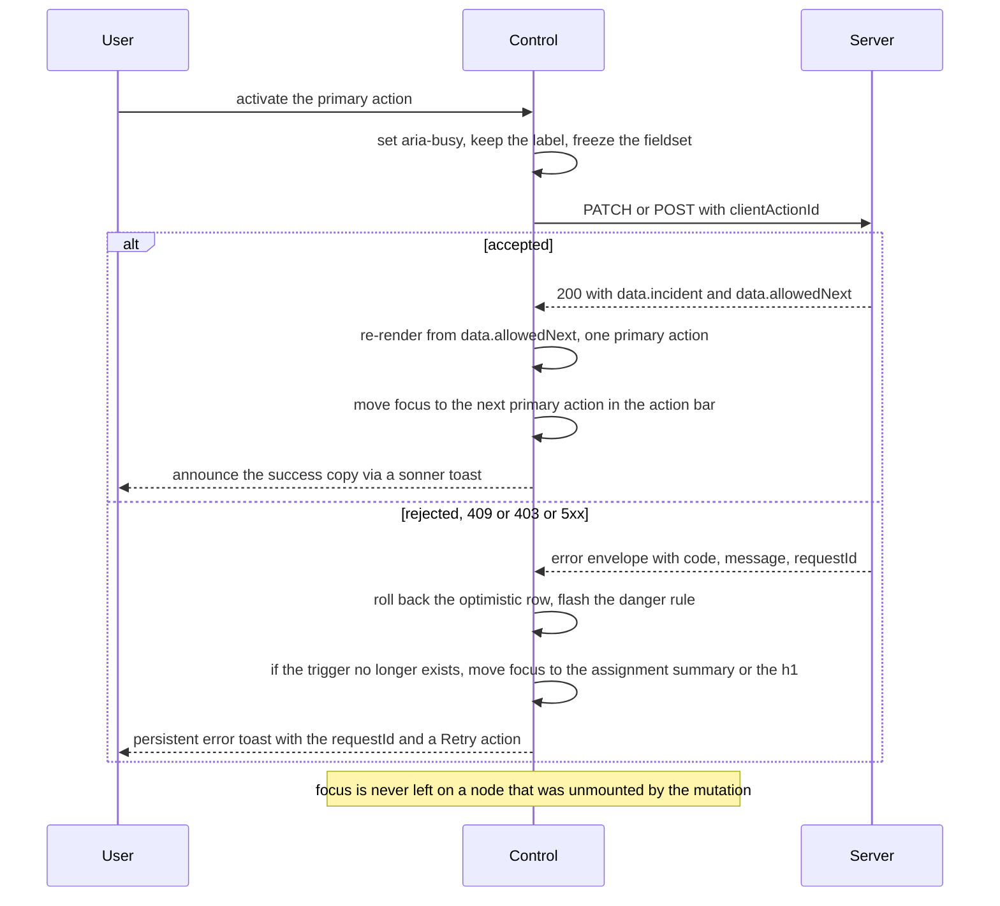

# 25 — Accessibility & Responsiveness

**Project:** CareGrid AI
**Document type:** Conformance target, keyboard/focus/screen-reader contracts, contrast evidence, responsive matrix
**Status:** Baseline v1.0 — normative; implements NFR-017 … NFR-021 and US-040
**Related documents:** [04 UI/UX Specification](./04_UI_UX_DESIGN_SPECIFICATION.md), [05 Frontend Architecture](./05_FRONTEND_ARCHITECTURE.md), [01 PRD §7 NFRs](./01_PRODUCT_REQUIREMENTS_DOCUMENT.md), [18 Testing & QA Plan](./18_TESTING_QA_PLAN.md)

> Accessibility here is not a compliance exercise. A dispatcher using a keyboard at 03:00, a responder wearing gloves on a cracked screen, and a screen-reader user checking a status are the **same** user with different hardware. Every rule below is written for one of those three people.

---

## 0. How to read this document

| Section | Contains |
| --- | --- |
| §1 | Conformance target, scope, and honest caveats |
| §2 | Keyboard operation and the shortcut table |
| §3 | Focus management and the exact focus-ring spec |
| §4 | Screen-reader contract: landmarks, titles, live regions, tables, the map list alternative |
| §5 | Colour and contrast evidence |
| §6 | Forms |
| §7 | Motion and `prefers-reduced-motion` |
| §8 | Touch and pointer |
| §9 | Breakpoints and the per-route responsive matrix |
| §10 | Mobile-specific patterns |
| §11 | Testing: what is automated and what is manual |
| §12 | Known limitations and honest gaps |
| §13 | `DECISION REQUIRED` register |

---

## 1. Conformance target, scope, and caveats

### 1.1 Target

| Standard | Level | Scope |
| --- | --- | --- |
| **WCAG 2.1** | **AA** | Every screen in the application. NFR-017 requires 0 serious violations for the citizen and responder flows; this document targets **0 violations at any level** on those flows and **0 serious/critical** on the dispatcher and admin surfaces |
| WCAG 2.2 | AA (subset adopted early) | 2.2.1 Timing Adjustable, 2.2.2 Pause/Stop/Hide (no auto-playing motion exists), 2.4.11 Focus Not Obscured, 2.5.7 Dragging Movements, 2.5.8 Target Size (Minimum) — adopted because they are cheap now and expensive later |
| EN 301 549 | Level AA (partial) | **Not claimed.** Self-certification to EN 301 549 requires a public-sector conformance statement, a complaints procedure, and a documented accessibility policy, none of which exist for a hackathon MVP. **Do not claim it** |
| Section 508 | — | **Not claimed.** Requires the same as above plus a remediation process |
| ADA / EAA (European Accessibility Act) | — | **Not claimed.** The EAA applies to commercial products; a public-sector notification is a legal question, not an engineering one. Flagged in §12 |

### 1.2 What "conforming" means here — precisely

This project may state *"built to WCAG 2.1 AA and tested against it"* only when **all** of the following are true:

1. `axe-core` reports **0 violations** (any level) on the automated sweep of the citizen and responder flows, and **0 serious/critical** on the dispatcher and admin flows, at 360 px, 768 px, and 1440 px, in Chromium.
2. The manual checklist in §11.2 has been completed and signed off by a named person for the four role journeys.
3. The keyboard-only script in §11.3 passes end to end **without a mouse**.
4. The screen-reader spot check in §11.4 has been performed with at least one desktop screen reader (NVDA on Windows **and** VoiceOver on macOS/iOS) and at least one mobile screen reader (TalkBack on Android).
5. Every known failure is listed in §12 with an owner and a severity, and no failure in §12 is "critical" for a citizen or responder flow.

Until then, the README and the `/` page say: *"This interface is designed to meet WCAG 2.1 AA. It has been tested with automated tools and manual keyboard and screen-reader checks. It has not been independently audited."* That sentence is the honest claim, and it is the only one permitted.

### 1.3 Explicit scope decisions

| In scope | Out of scope (v1) | Why |
| --- | --- | --- |
| All 21 routes + `/not-found` + `/error` + the 403 state | — | — |
| The map's list alternative | Making the map canvas itself accessible | A WebGL/canvas map cannot be made perceivable in any practical sense. The **list** is the accessible artefact; the canvas is `aria-hidden`. See §4.6 |
| Realtime `aria-live` announcements for critical/warning notifications | Announcing every queue-row change | 50 rows changing every 3 s would make the app unusable with a screen reader. The announcement set is bounded to severity + one per item (§4.4) |
| Chart data tables | Per-point chart descriptions | A Recharts canvas is not screen-reader-usable; every chart ships a table alternative (§4.7) |
| `prefers-reduced-motion` and `prefers-contrast` | User-configurable animation levels beyond that | `auto / reduced` is a sufficient control surface |
| Full keyboard operation of the report form, the queue, and the map list | Keyboard shortcuts inside the map canvas | FR-018, NFR-018; the canvas is decorative |
| `forced-colors` support | A custom high-contrast theme | OS high contrast is the correct mechanism (§5.5) |

### 1.4 Honest caveats

- **Automated testing finds roughly a third of real problems.** `axe-core` cannot tell you that a live row flash is distracting, that the 300 ms debounce makes a search feel broken, or that the sticky submit bar covers the keyboard.
- **No user testing with disabled users has been performed.** This document is engineering conformance, not usability validation. A real product would need sessions with users, and a 2026 MVP has none.
- **A Google Maps canvas is a known WCAG 1.1.1 / 2.1.1 failure** that this project mitigates rather than fixes. The mitigation is real (a complete list alternative, always present) but the failure is not eliminated, and this must be stated rather than argued away.
- **No screen-reader testing has been done on a real responder device outdoors in daylight.** Contrast ratios do not model a phone at 20,000 lux.
- **Reduced-motion support is implemented, not verified with users.** Vestibular-sensitivity triggers are a list, not a science.

---

## 2. Keyboard operation

### 2.1 Principles

| Rule | Detail |
| --- | --- |
| Everything is reachable | Every action in this application is possible with `Tab` / `Shift+Tab` / `Enter` / `Space` / arrow keys. No drag-only, swipe-only, or hover-only control |
| No keyboard trap | `Dialog` and `Sheet` trap focus **intentionally** and release it on `Escape` or close. Nothing else traps |
| Logical order | DOM order equals visual order at every breakpoint. No `tabindex` above `0` anywhere in the codebase (a lint rule) |
| Focus is always visible | The two-band focus ring (§3.2) on every focusable element, in both themes and in forced-colors |
| No keyboard trap in a table | The queue table scrolls with `PageUp`/`PageDown`/`Home`/`End` and does not trap arrow keys |
| Reduced target count | On `/report` the whole flow is 14 tab stops (below) so a one-handed phone flow is short |

### 2.2 Tab order — the report flow (the canonical citizen journey)

The order below is normative. It is asserted by `tests/e2e/keyboard.spec.ts` and by a manual pass.

| # | Stop | Element | Notes |
| --- | --- | --- | --- |
| — | Skip links | `Skip to main content`, `Skip to navigation` | First two focusables on every authenticated page; visible on focus |
| 1 | "Report an incident" | `Button primary` | The page's single primary action. First focusable in `<main>` |
| 2 | Text label → 3 | `Textarea` (the description) | 2000 characters, `aria-describedby` → the character counter |
| 4 | "Add a photo" | `Button` | Opens the file picker; the first of three photo slots |
| 5 | "Remove photo 1" | `IconButton` | Present only when a photo exists |
| 6 | "Add a photo" | `Button` | Slot 2 |
| 7 | "Add a photo" | `Button` | Slot 3 (disabled with the reason when 3 are attached) |
| 8 | "Record a voice note" | `Button` (56 px) | Hidden entirely when `MediaRecorder` is unsupported |
| 9 | "Use my current location" | `Button` | The **only** way to request geolocation (FR-030) |
| 10 | "Drop a pin on the map" | `Button` | Opens the pin `Sheet` |
| 11 | "Type an address" | `Button` | Inline `Input` appears with the label as the focus |
| 12 | "Continue without location" | `Button variant="link"` | Always present |
| 13 | "Submit report" | `Button primary` (sticky bottom bar) | `aria-disabled` + a visible reason until one evidence channel is valid (FR-017) |
| 14 | Privacy note link | `Link` → `/settings` privacy summary | Last stop in `<main>` |

After `Enter` on **Submit report**, focus moves to the success heading (`role="status"`, `tabIndex={-1}`), and the next tab stop is **Copy reference** (US-001 AC3).

### 2.3 Tab order — the dispatcher queue

| # | Stop | Notes |
| --- | --- | --- |
| 1–2 | Skip links | — |
| 3 | Sidebar first item | `nav aria-label="Console"` |
| … | Sidebar items | 6–10 items depending on role |
| … | Top bar: breadcrumb, `SearchInput`, notifications, avatar | `SearchInput` supports `/` to focus |
| … | KPI strip | **Not focusable.** Tiles are informational, not links |
| … | `FilterBar` controls, in visual order: Search → status → urgency → category → verification → slaState → unassigned → sort | Each is a labelled control; the active-filter chips follow |
| … | `<table>` `<thead>` `<th scope="col">` sort buttons | One tab stop per sortable column (8) |
| … | Row 1's first cell link (`CG-XXXXXX`) | `<th scope="row">` |
| … | Row 1's action buttons | Up to 5 per row: Verify, Assign, False alarm, Link report, Export |
| … | Rows 2…50 | Same structure |
| … | `Pagination` nav | `Previous` / `Next` / page-size `Select` |

**Row virtualisation conflict.** If a table is virtualised ([05](./05_FRONTEND_ARCHITECTURE.md) F4), the row set in the DOM changes as the user scrolls, which breaks Tab. Rule: **the queue table is capped at 50 rows and is never virtualised**; the admin/audit tables are 50 rows per page and are also not virtualised. If virtualisation is ever introduced, the keyboard contract becomes: `j`/`k` moves a **roving** row cursor (`tabIndex={0}` on the active row, `-1` on the rest, `role="row"` + `aria-rowindex`), and the table has a `aria-rowcount` so the total is still announced. That is the only acceptable way to do it.

### 2.4 Tab order — the map list fallback

The list is the accessible alternative, so it follows the standard table contract: `<th scope="col">` with `aria-sort` on the active column, one tab stop per sortable header, one tab stop per row's primary link, and the row action buttons after it. The map canvas is `aria-hidden="true"` and `tabIndex={-1}`; it is **not** in the tab order. The "Show list" toggle is the tab stop that switches the visual mode.

### 2.5 Shortcut table — `DECISION REQUIRED`

> **These shortcuts are a proposal, not a shipped commitment.** They must be approved before implementation because a mistyped shortcut in a control room can assign a responder to the wrong incident. `DECISION REQUIRED` — see §13. Until approved, the route is a manual `KeyboardShortcutsDialog` opened from `/settings` (a button, not a hidden chord), and **no mutating action has a shortcut**.

**Proposed non-mutating navigation shortcuts** (safe, global, disabled while a text field has focus):

| Keys | Action | Scope | Notes |
| --- | --- | --- | --- |
| `?` | Open the "Keyboard shortcuts" dialog | Global | `?` requires Shift on most layouts; `Shift+/` is the same physical key |
| `g` then `d` | Go to `/dashboard` | `(app)` | "go" chord, vim-style |
| `g` then `i` | Go to `/incidents` | `(app)` | — |
| `g` then `m` | Go to `/map` | `(app)` | — |
| `g` then `n` | Go to `/notifications` | `(app)` | — |
| `g` then `r` | Go to `/report` | `(app)` | — |
| `g` then `p` | Go to `/profile` | `(app)` | — |
| `g` then `a` | Go to `/admin` | `(ops)` | Only if the role permits |
| `g` then `b` | Go back | Global | Equivalent to the browser Back button |
| `/` | Focus the search / reference input | `/dashboard`, `/incidents`, `/track` | Prevents default; does not work inside an `Input` |
| `/` | Focus the map list search | `/map` | — |
| `[` / `]` | Previous / next page | Paginated routes | Equivalent to the pagination buttons |
| `t` | Focus "Use my current location" | `/report` | **Proposing a keyboard route to a permission-gated browser prompt.** Safer: omit `t` and require a real click/Enter on the visible button. **Recommendation: drop `t`.** |
| `Escape` | Close the topmost layer | Global | `Dialog`, `Sheet`, `Tooltip`, `CommandPalette`, native file picker cancel |
| `Tab` | Next focusable, trapped inside a modal | Global | Standard |

**Proposed shortcuts for the dispatcher queue only, all read-only or opening a dialog:**

| Keys | Action | Notes |
| --- | --- | --- |
| `j` | Move the row cursor down | Roving `tabIndex`; does **not** change the focus order |
| `k` | Move the row cursor up | — |
| `Enter` | Open the incident under the row cursor | Equivalent to activating the reference link |
| `x` | Select the row for a bulk action | Only for `verify` / `false_alarm` (FR-077); never assigns |
| `v` | Open **Verify** for the row under the cursor | Opens the confirm `Dialog`; **no mutation without the dialog's button** |
| `o` | Open **Assign responder** for the row under the cursor | Opens the candidate `Dialog`; selection still requires clicking or tabbing to a candidate and confirming |
| `s` | Cycle the sort | Announced in an `aria-live` region |
| `c` | Toggle the cluster layer on `/map` | — |
| `l` | Toggle the map list on `/map` | — |

**Hard rules for any approved shortcut set**

1. **No shortcut performs a mutation on its own.** Every mutating shortcut opens a `Dialog` whose primary action must be activated.
2. **Shortcuts are disabled** whenever focus is inside an `input`, `textarea`, `select`, `contenteditable`, or an open `Dialog`/`Sheet` (except `Escape`).
3. Every shortcut is listed in the `KeyboardShortcutsDialog` reachable from `/settings` and from the sidebar footer. Nothing is undiscoverable.
4. The `g`-chord has a 1200 ms timeout and a visible hint in the shortcut dialog.
5. Shortcuts are additive. Every action remains reachable by `Tab` + `Enter`.
6. `?` and `/` do not fire when a modifier key (`Ctrl`, `Alt`, `Meta`) is held, so browser and OS shortcuts are not stolen.

### 2.6 Focus management for overlays

| Overlay | On open | On close | Escape | Notes |
| --- | --- | --- | --- | --- |
| `Dialog` | Focus the first field (form variant) or the `Cancel` button (confirm variant) — **never** the destructive action | Focus returns to the trigger | Closes | Focus trapped; `aria-modal="true"`; background content is `inert` |
| `Sheet` (filters, mobile nav, pin picker) | Focus the sheet heading container (`tabIndex={-1}`) | Returns to the trigger | Closes | Same contract as `Dialog` |
| `Tooltip` | Does not take focus | n/a | Dismisses | Opens on focus; `aria-describedby` only |
| `Popover` (date range) | Focus the first control | Returns to the trigger | Closes | Standard |
| Mobile nav sheet | Focus the first nav link | Returns to the hamburger | Closes | — |
| `CommandPalette` (if it ships) | Focus the input | Returns to the prior element | Closes | `role="dialog"`, `aria-activedescendant` on the results list |

### 2.7 Skip links

Two skip links are the first focusables in the root layout:

```html
<a href="#main" class="skip-link">Skip to main content</a>
<a href="#console-nav" class="skip-link">Skip to navigation</a>
```

- `main` has `id="main"` and `tabIndex={-1}`; the desktop sidebar `<nav>` has `id="console-nav"`.
- Visually hidden until focused, then a visible 44 px-high accent-bordered bar pinned to the top-left, above all other content (`z-index` above the top bar).
- The skip link text is "Skip to main content" / "Skip to navigation" — never an arrow glyph alone.
- On mobile there is one skip link (`#main`) plus a visible back `IconButton` in the top bar, which is a normal focusable control in DOM order.

---

## 3. Focus management

### 3.1 The focus ring (normative)

```css
/* app/globals.css — the single focus treatment for the whole application */
:where(a, button, input, select, textarea, summary, [tabindex]):focus-visible {
  outline: 2px solid transparent;          /* forced-colors fallback */
  outline-offset: 2px;
  box-shadow:
    0 0 0 2px var(--color-bg-app),        /* inner band: guarantees separation from ANY fill */
    0 0 0 4px var(--color-border-focus);  /* outer band: #7CC4FF */
  border-radius: inherit;
}
```

Why two bands: a single `#7CC4FF` ring on the `accent` primary button computes to **1.33:1** and fails WCAG 2.4.11/1.4.11. The inner `--color-bg-app` band puts a high-contrast boundary between the control and the ring on every fill, and the outer band measures **8.35–10.25:1** against every surface ([04](./04_UI_UX_DESIGN_SPECIFICATION.md) §2.11).

Additional rules:

| Rule | Detail |
| --- | --- |
| `:focus-visible` only | A mouse click does not draw a ring; a keyboard interaction always does. This is the platform default and is not overridden |
| Never `outline: none` | A `no-restricted-syntax` lint rule bans `outline: 'none'` / `outline: 0` in `app/`, `components/`, and `features/` |
| Radius preserved | The ring uses `border-radius: inherit` so it follows the control's radius; on a `Sheet` the ring is drawn inside the sheet's clipped area |
| Not obscured | The ring is never clipped by an `overflow:hidden` ancestor. `top-bar`, `bottom-nav`, and the sticky action bar all reserve 4 px of padding for it (WCAG 2.4.11 Focus Not Obscured) |
| forced-colors | `outline: 2px solid Highlight` (the media query block in §5.5) — a box-shadow is invisible in forced-colors mode, so the `outline` declaration above is the accessible one |
| Custom controls | `Switch`, `Checkbox`, `Radio`, `Tabs`, `Select` all render the ring on the **focusable** element, which for Radix is the trigger |
| Charts | Chart cards are not focusable; the "View as table" `Button` is |

### 3.2 Focus on route change

| Route | Focus target | Implementation |
| --- | --- | --- |
| Any page in `(app)` | The `<h1>` page title | A client `<RouteFocusManager />` in `(app)/layout.tsx` calls `usePathname()`; on change (skipping the first render) it focuses `main h1` via a `ref` with `tabIndex={-1}` and announces the new page title in a `aria-live="polite"` region |
| `/incidents/[id]` | The `<h1>`, which is the reference `CG-XXXXX` | Same |
| `/login`, `/signup`, `/forgot-password` | The `<h1>` | Same (the `(public)` layout mounts its own manager) |
| After a filter/pagination change | The **table container** with `aria-label` ("Incident list, rows 26 to 50") | Focus is moved to the container, not the first row, so the user is not dropped into row 1 unexpectedly |
| After a tab change (URL-backed) | The new panel's heading | — |
| A 403 or 404 render | The error/not-found `<h1>` | — |

`RouteFocusManager` **must not** run on the first render (it would steal focus from the page on hydration) and **must not** run for a `router.refresh()` (the pathname does not change).

### 3.3 Focus after a mutation



| Mutation | Focus moves to | Why |
| --- | --- | --- |
| Submit report → success | The success heading (`role="status"`, `tabIndex={-1}`) | US-001 AC3 |
| Verify / False alarm / Cancel / Close / status change | The updated action bar's next primary action | The action the user performed no longer exists; leaving focus on a removed node sends it to `<body>` |
| Assign responder (one click from the candidate list) | The toast's action region, then the incident header's assignee `Avatar`+name link | The candidate `Dialog` closes; focus returns to its trigger if still present, otherwise to the assignment summary |
| Merge | The incident header's reference heading | The duplicate panel disappears |
| Role change (admin) | The `RoleBadge` in the updated row | — |
| Any mutation that fails | The **error summary** (§6.4) | The user must be told why nothing changed |
| `Mark all as read` | The notifications list container (the button is disabled) | — |
| Toggle availability | The toggle itself (it stays mounted) | — |

### 3.4 Focus on error summary

When a form submission fails, `onInvalid` (RHF) or an `ApiError` from a server mutation:

1. The form renders/updates an error summary at the top of the form: `role="alert"`, `Alert tone="danger"`, heading "Check these before sending" (form) or the plain-language message (mutation).
2. The summary receives focus (`tabIndex={-1}`).
3. Each entry in the summary is an `<a href="#field-id">` that moves focus to the offending control and focuses it.
4. The summary is **not** an `aria-live` region; `role="alert"` is the assertive announcement, and it is used exactly once per failed submission (not once per field).
5. The submit button is **not** refocused — the user is sent to the problems, not back to the button they already pressed.

---

## 4. Screen-reader contract

### 4.1 Landmarks

| Landmark | Element | Where | `aria-label` |
| --- | --- | --- | --- |
| Banner | `<header role="banner">` | Top bar (all authenticated routes) | — |
| Navigation (primary) | `<nav aria-label="Console">` | Desktop sidebar | — |
| Navigation (mobile) | `<nav aria-label="Main">` | Mobile bottom nav / nav sheet | Unique per document |
| Navigation (breadcrumb) | `<nav aria-label="Breadcrumb">` | Incident detail, admin | — |
| Navigation (pagination) | `<nav aria-label="Pagination">` | Every paginated list | — |
| Main | `<main id="main" tabIndex={-1}>` | Exactly **one** per page, every route | — |
| Complementary | `<aside>` | Map legend, filter rail, AI panel, action rail | `aria-label="Map legend"` etc. |
| Content info | `<footer role="contentinfo">` | `(public)` routes only | — |
| Status | `role="status"` | Live indicator, reconnecting banner, toasts, submit success, SLA breach announcement | Descriptive, or none |
| Alert | `role="alert"` | Offline-as-error, form error summary, critical mutation failure | — |
| Live region (polite) | `<div aria-live="polite" aria-atomic="true">` | A single page-level region that receives composed announcements | — |

Rules: exactly one `<main>`; nested landmarks always labelled; `role="navigation"` never on a `<div>` without a label when there is more than one nav on the page.

### 4.2 Page titles per route

| Route | `document.title` | `<h1>` |
| --- | --- | --- |
| `/` | "CareGrid AI" | "Community incident reporting, routed to the people who can help." |
| `/report` | "Report an incident · CareGrid AI" | "Report an incident" |
| `/track` | "Track a report · CareGrid AI" | "Track a report" |
| `/login` | "Sign in · CareGrid AI" | "Sign in" |
| `/signup` | "Create an account · CareGrid AI" | "Create your account" |
| `/forgot-password` | "Reset your password · CareGrid AI" | "Reset your password" |
| `/dashboard` | "Dashboard · CareGrid AI" | Dispatcher: "Dashboard" · Responder: "Your assignments" |
| `/incidents` | "Incidents · CareGrid AI" | Citizen/responder: "My reports" · Dispatcher: "Incidents" |
| `/incidents/[id]` | "{reference} · CareGrid AI" | "{reference}" (mono) |
| `/map` | "Map · CareGrid AI" | "Live map" |
| `/responders` | Dispatcher: "Responders" · Responder: "Your responder profile" | Matching |
| `/dispatches` | Responder: "My assignments" · Dispatcher: "Dispatches" | Matching |
| `/analytics` | "Analytics · CareGrid AI" | "Analytics" |
| `/notifications` | "Notifications · CareGrid AI" | "Notifications" |
| `/profile` | "Profile · CareGrid AI" | "Profile" |
| `/settings` | "Settings · CareGrid AI" | "Settings" |
| `/admin` | "Administration · CareGrid AI" | "Administration" |
| `/admin/users` | "Users · Administration · CareGrid AI" | "Users" |
| `/admin/incidents` | "Incident archive · Administration · CareGrid AI" | "Incident archive" |
| `/admin/responders` | "Responder verification · Administration · CareGrid AI" | "Responder verification" |
| `/admin/audit-logs` | "Audit log · CareGrid AI" | "Audit log" |
| `/admin/settings` | "Platform settings · Administration · CareGrid AI" | "Platform settings" |
| `/not-found` | "Page not found · CareGrid AI" | "We could not find that page" |
| `/error` | "Something went wrong · CareGrid AI" | "Something went wrong" |
| 403 state | "No access · CareGrid AI" | "You do not have access to this page" |

One `<h1>` per page. Sections use `<h2>`, panels use `<h3>`; heading levels are never skipped. The `KpiTile` strip is a `<section aria-labelledby>` whose heading is `sr-only` "Live counts" — it is not an `<h2>` competing with the page title.

### 4.3 Accessible names for icon controls

Every `IconButton` requires a non-optional `label: string` prop; the ESLint rule in [20](./20_PROJECT_FOLDER_STRUCTURE.md) §3.3 bans a literal `aria-label` so the value can be asserted in a test.

| Control | Accessible name |
| --- | --- |
| Notification bell | "Notifications, {n} unread" (or "Notifications, none unread") |
| Menu toggle | "Open menu" / "Close menu" |
| Search clear | "Clear search" |
| Remove photo {n} | "Remove photo {n} of {total}" |
| Audio play | Provided by the native `<audio controls>` element |
| Map zoom in / out | "Zoom in" / "Zoom out" |
| Map centre | "Centre on my location" |
| Map fit | "Fit map to results" |
| Map list toggle | "Show list" / "Show map" |
| Map legend toggle | "Map legend" |
| Map retry | "Retry map" |
| Row action | "Verify {reference}", "Assign a responder to {reference}", "Mark {reference} as a false alarm", "Export {reference}" |
| Sidebar collapse | "Collapse navigation" / "Expand navigation" |
| Dialog close | "Close dialog" |
| Sheet close | "Close panel" |
| Toast dismiss | "Dismiss notification" |
| Table column sort | "Sort by urgency" (+ `aria-sort` on the `<th>`) |

### 4.4 `aria-live` regions and realtime announcements

There is **one** page-level polite live region per route, plus a separate `aria-live="assertive"` region reserved for form/validation errors (which use `role="alert"` instead). `sonner` toasts carry their own regions; the app does not duplicate them.

**What is announced (and what is deliberately not):**

| Event | Announced? | Text | Mechanism |
| --- | --- | --- | --- |
| New notification, `severity: critical` | **Yes, once** | "Critical: {title}. {incident reference}." | Polite region, deduped by `notificationId` |
| New notification, `severity: warning` | **Yes, once** | "Warning: {title}." | Polite region, deduped |
| New notification, `severity: info` | **No** | — | The unread count in the bell's accessible name changes; a sighted user sees the badge |
| Any queue row changing | **No** | — | 50 rows × every 3 s is unusable. The `LiveIndicator`'s accessible name updates instead |
| Responder availability change | **No** | — | Visible on the map/list |
| `SlaMeter` ticking | **No** | — | `aria-valuetext` only |
| SLA transitioning to `breached` | **Yes, once per incident** | "Response target passed for {reference}. {n} minutes over." | Polite region, deduped by `incidentId` (US-025 AC2) |
| Going offline / reconnecting / live again | **Yes** | "You are offline." / "Reconnecting." / "Live updates resumed." | The `ConnectivityBanner` is `role="status"` |
| A user-initiated mutation pending | **No** | — | `aria-busy` on the control; the toast carries the outcome |
| Mutation succeeded | **Yes**, via a toast | The success copy from `copy.ts` | `sonner`'s region |
| Mutation failed | **Yes, assertive** | The error copy + `requestId` | Persistent `error` toast (`role="alert"`) |
| Form validation failure | **Yes, assertive** | The error summary heading | `role="alert"` on the summary |
| Location acquired / denied | **Yes** | "Location added, accurate to about {n} metres." / "Location access is off." | Polite region |
| Page change (route navigation) | **Yes** | The new `<h1>` | `RouteFocusManager` polite region |

Rules: every announcement is composed from `copy.ts` (no raw enum values, no `false_alarm` shown raw); the polite region is `aria-atomic="true"` and is only ever written by `announce()`; a burst is coalesced with a 1 s debounce so three simultaneous notifications produce one announcement.

### 4.5 Table semantics

Every table in the application is a real `<table>` with real header cells. No `div`-based grids, no `role="grid"` without full keyboard support.

```html
<table data-testid="incident-queue-table">
  <caption class="sr-only">
    Live incident queue, sorted by urgency. 11 incidents. Column 4 of 10 is AI confidence.
  </caption>
  <thead>
    <tr>
      <th scope="col" aria-sort="none"><button type="button">Reference</button></th>
      <th scope="col" aria-sort="none"><button type="button">Category</button></th>
      <th scope="col" aria-sort="descending"><button type="button">Urgency</button></th>
      <!-- … -->
    </tr>
  </thead>
  <tbody>
    <tr aria-selected="true">
      <th scope="row"><a href="/incidents/r7Kp…">CG-7QK4M2</a></th>
      <td><span class="category-icon" aria-hidden="true">…</span> Traffic accident</td>
      <td><span aria-label="Urgency: critical, response target 5 minutes">…Critical</span></td>
      <!-- … -->
    </tr>
  </tbody>
</table>
```

| Rule | Detail |
| --- | --- |
| `<caption>` | Always present, always `sr-only`, always describing the table's *current* state and sort |
| `scope` | `scope="col"` on every header, `scope="row"` on the row's primary cell (the reference link) |
| `aria-sort` | Exactly one column has `aria-sort="ascending|descending"`; the rest are `"none"` |
| `aria-selected` | On the selected row of a single-select table (the dispatcher queue), **not** on a multi-select table (use `aria-selected` on each row for the audit table's bulk actions) |
| Header buttons | The sort control is a `<button>` inside the `<th>`, with an accessible name "Sort by {column}" and a visible sort direction icon plus the `aria-sort` value — never direction by icon alone |
| Sticky header | `position: sticky; top: var(--topbar-h)` with `background: var(--color-bg-surface)` so rows do not show through |
| Horizontal scroll | Below 768 px the `<table>` is inside a `tabIndex={0}` `role="region"` with `aria-label="Incident queue, scrollable"` and a visible "Scroll sideways for more columns" hint, so a keyboard user can reach the overflow. **This region is only rendered on ≥ 768 px; the < 768 px view is the card list, so there is no scrollable table at all on a phone** |
| The card list | A `<ul role="list">` of `<li>` cards, **not** a table. It is a different component with a different semantic, not a `display:block` table |

### 4.6 The map needs a list alternative (explicit requirement, not optional)

| Requirement | Implementation |
| --- | --- |
| The map MUST have an equivalent list | `MapListFallback` is always in the DOM on `/map`. While the map is visible it is inside a collapsed region; the "Show list" toggle (`aria-pressed`) reveals it |
| The map canvas is not exposed to assistive technology | `<div class="map-canvas" aria-hidden="true" tabIndex={-1}>`. `AdvancedMarker` contents are `aria-hidden`; the Google Maps default UI is disabled (`disableDefaultUI`) and replaced with our own labelled controls |
| When the map fails to load | `MapListFallback` replaces the map entirely, expanded, with a `warning` Alert and a `Retry map` button (FR-085). The failure is announced politely: "The map could not load. A list of incidents is shown instead." |
| The list carries everything a marker carries | Reference, urgency badge (icon + label), status badge, category, `placeName`, `accuracyGrade` with metres, `lat, lng` in `font-mono`, distance, age, and the row's actions (Open incident, Assign responder, Verify) |
| Map keyboard operation | Zoom +/−, "Centre on my location", "Fit to results", "Layers", "Show list" are all real buttons in the tab order, each `aria-label`led. Panning/rotating the canvas is a pointer-only enhancement with a list equivalent for every outcome |
| Auto-motion is never used | No auto-pan, no auto-zoom, no fly-to on a realtime update ([04](./04_UI_UX_DESIGN_SPECIFICATION.md) §5.30) |
| Announcements | Selecting a marker moves focus to the detail panel heading and announces "Details for {reference}"; the list row that corresponds to it receives `aria-current="true"` |

**Honest statement for the conformance report:** the presence of a complete list alternative is a *mitigation* of WCAG 1.1.1 and 2.1.1 for the map canvas, not a cure. The claim to publish is: *"The map is decorative for assistive technology. Every function it performs is available in an equivalent, fully keyboard- and screen-reader-operable list that is always present."* That is the honest framing and it is the one used in the README.

### 4.7 Charts

| Rule | Detail |
| --- | --- |
| The chart canvas is `aria-hidden` | Recharts renders SVG; the whole `<svg>` gets `aria-hidden="true" focusable="false"` |
| A table alternative is mandatory | `ChartFrame` renders a `Sheet` "View as table" `Button` and the underlying `data.byCategory` / `data.trend` / `data.response` rows as a real `<table>` with `<caption>`, `scope="col"`, and a `<th scope="row">` per row label |
| The table is collapsed, not removed | It is in the DOM, so it is findable by a screen reader and by `Tab` through the "View as table" button |
| Axis and legend text | Never the only carrier of a value; every value also exists in the table |
| Colour in charts | Series colours are the palette tokens; a category bar chart also prints the category label on the axis, and a "critical" portion of a stacked bar carries the `Critical` `text-2xs` label. Never colour-only |
| Tooltips | Recharts `<Tooltip>` content is mirrored into an `aria-live="polite"` region only on keyboard focus, and the values are in the table anyway |

### 4.8 Badges, status, and the "never colour alone" rule

| Component | Accessible name | Contains visible text? |
| --- | --- | --- |
| `UrgencyBadge` | "Urgency: {level}, response target {n} minutes" | Yes — "Critical" / "High" / "Medium" / "Low" |
| `StatusBadge` | "Status: {status label}" | Yes |
| `ConfidenceBadge` (high/medium) | "AI confidence {0.xx}, {band}. AI estimate, check the original report." | Yes — "AI estimate 0.83" |
| `ConfidenceBadge` (low) | "Needs review. The AI was not confident about this report." | Yes — "Needs review" |
| `SlaMeter` | `aria-valuetext` = "On track, 3 minutes left" | Yes |
| `LocationBadge` | "Location approximate, within 800 metres" · "Location unknown" | Yes |
| `SafetyFlagChip` | "{flag label}" | Yes |
| `RoleBadge` | "{role label}" | Yes |
| `source` badge | "AI triaged" · "Fallback triage" · "Human verified" | Yes |
| `stale location` | "Location 22 minutes old" | Yes |
| `pending sync` | "Pending sync" | Yes |

Icons inside badges are `aria-hidden="true"`; the text carries the meaning. No badge is `aria-label`-only, and no badge relies on a background tint (the tints measure 1.0–1.14:1 against the surface by design).

### 4.9 Media and evidence

| Case | Rule |
| --- | --- |
| Evidence images | `alt` is written from the report context, not from the file name: `alt="Photo attached to report CG-7QK4M2"` (the citizen's content is unknown to us, so we do not invent a description). Never `alt="image1.png"`. Decorative icons use `alt=""` |
| Photos open in a lightbox `Dialog` | The `Dialog` has a `DialogTitle` ("Evidence for CG-7QK4M2, photo 1 of 3") and a "Download" `Button` that requests a fresh 15-minute signed URL from `GET /api/uploads/:mediaId/url` ([08](./08_API_SPECIFICATION.md) §8.3) |
| Audio evidence | A native `<audio controls preload="none">` (never autoplay). The accessible alternative is the AI transcript, which is rendered **adjacently and always**, not behind a disclosure: an `Alert` "Transcript (automatic, may be inaccurate)" with the text from `reports[].media[].audio_transcript` and, when `audio_transcript_uncertain` is true, a "Some parts could not be heard" line ([09](./09_AI_GEMINI_SPECIFICATION.md) §5.1) |
| The transcript is never treated as fact | It is labelled "automatic, may be inaccurate" and is always presented **after** the reporter's own text, never as a replacement for it |
| No video | Out of scope ([01](./01_PRODUCT_REQUIREMENTS_DOCUMENT.md) §9) |
| Avatars | `alt=""` when the name is adjacent text; `alt={displayName}` only when the avatar stands alone |

---

## 5. Colour and contrast

### 5.1 The token pairs and their ratios

Measured WCAG 2.1 ratios. Full table in [04](./04_UI_UX_DESIGN_SPECIFICATION.md) §2.11; the interactive pairs are repeated here because they are the conformance evidence.

| # | Foreground | Background | Ratio | Requirement | Verdict |
| --- | --- | --- | --- | --- | --- |
| 1 | `text-primary` `#E9EFF6` | `bg-surface` `#121820` | **15.41** | 1.4.3 AA (4.5) | Pass |
| 2 | `text-secondary` `#A8B6C6` | `bg-surface` | **8.64** | 1.4.3 | Pass |
| 3 | `text-muted` `#82909F` | `bg-surface` | **5.47** | 1.4.3 | Pass |
| 4 | `text-muted` `#82909F` | `bg-elevated` `#1B2430` | **4.80** | 1.4.3 | Pass |
| 5 | `accent` `#2AB3C9` | `bg-surface` | **7.13** | 1.4.3 | Pass |
| 6 | `text-on-solid` `#04191D` | `accent` `#2AB3C9` (primary button) | **7.22** | 1.4.3 | Pass |
| 7 | `urgency-critical` `#FF5C5C` | `bg-surface` | **5.89** | 1.4.3 | Pass |
| 8 | `urgency-high` `#FF8A3D` | `bg-surface` | **7.61** | 1.4.3 | Pass |
| 9 | `urgency-medium` `#F2C744` | `bg-surface` | **11.07** | 1.4.3 | Pass |
| 10 | `urgency-low` `#4C9BF0` | `bg-surface` | **6.16** | 1.4.3 | Pass |
| 11 | `status-closed` label = `text-secondary` | `bg-surface` | **8.64** | 1.4.3 | Pass |
| 12 | `confidence-low` `#FFA23A` | `bg-surface` | **8.90** | 1.4.3 | Pass |
| 13 | `border-control` `#5E7085` | `bg-surface` | **3.06** | 1.4.11 (3.0) | Pass |
| 14 | `border-control` `#5E7085` | `bg-elevated` | **3.08** | 1.4.11 | Pass |
| 15 | `border-focus` `#7CC4FF` | `bg-app` `#0B0F14` | **10.25** | 1.4.11 | Pass |
| 16 | `border-focus` `#7CC4FF` | `bg-elevated` | **8.35** | 1.4.11 | Pass |
| 17 | `text-inverse` `#E9EFF6` on `danger` `#FF6B6B` | — | **2.16 → replaced** | 1.4.3 | **The primary button label on `accent` at `#E9EFF6` is only 2.16:1 and is therefore NEVER used.** The primary button always uses `--color-text-on-solid` `#04191D` (7.22:1). A lint rule and a component test assert the pairing. |
| 18 | Light theme `text-primary` `#0E1620` | `bg-surface` `#FFFFFF` | **18.19** | 1.4.3 | Pass |
| 19 | Light theme `control-border` `#7A8898` | `#FFFFFF` | **3.62** | 1.4.11 | Pass |
| 20 | Light theme `urgency-medium` `#7A5A00` | `#FFF3D6` (tint) | **5.79** | 1.4.3 | Pass |

### 5.2 Colour is never the only channel

| Information | Channels used |
| --- | --- |
| Urgency | Colour + **shape** (octagon / triangle / circle / hollow circle) + `lucide` icon + visible text label + `aria-label` |
| Status | Colour + distinct icon + visible text label |
| SLA state | Colour + icon + text + a `Progress` meter's `aria-valuetext` |
| AI confidence | Colour + icon + text (`AI estimate 0.83` / `Needs review`) |
| Verification source | Text only |
| Location accuracy | Icon + text with the metre value |
| Stale responder location | Icon + text with the minute count |
| Online / offline | Different dot shape (filled vs ring) + text + an `aria-live` announcement |
| Selected row | 3 px left rule + `bg-elevated` + `aria-selected` |
| Focus | Two-band ring (§3.1) |
| Chart series | Colour + axis labels + a data table |

Verification: `tests/e2e/visual/urgency-monochrome.spec.ts` renders the queue in greyscale and asserts that each urgency level is still distinguishable by shape/icon/label.

### 5.3 Greyscale test (normative)

The colour-blindness story is not a theory. Two screenshots are part of the visual test suite:

1. The **greyscale** queue: all four urgency badges and all eleven status badges must remain distinguishable by their icon and text.
2. A **protanopia/deuteranopia simulation** of the same queue. The critical/high/medium triple (red/orange/amber) is the risky one; it passes only because the three levels differ in **shape** (octagon / triangle / circle) and in **icon** (`Siren` / `TriangleAlert` / `CircleAlert`) and in **SLA text** ("response target 5 minutes"). Colour was never load-bearing.

### 5.4 `prefers-contrast`

`@media (prefers-contrast: more)` raises `--color-border-subtle` to `border-default` and `--color-border-default` to `border-control`, so panel edges that were decorative become perceivable boundaries. No token value changes; only borders tighten. This costs 6 lines of CSS and is the correct response to the preference.

### 5.5 `forced-colors` (Windows High Contrast)

```css
@media (forced-colors: active) {
  :root {
    --color-bg-app: Canvas;      --color-bg-surface: Canvas;
    --color-text-primary: CanvasText;  --color-text-secondary: CanvasText;
    --color-text-muted: GrayText;
    --color-border-subtle: CanvasText; --color-border-default: CanvasText;
    --color-border-control: CanvasText; --color-border-focus: Highlight;
  }
  /* The focus ring must use outline, not box-shadow, in this mode. */
  :where(a, button, input, select, textarea, [tabindex]):focus-visible {
    outline: 2px solid Highlight;
    outline-offset: 2px;
    box-shadow: none;
  }
  /* Badges keep their text; the tint is dropped because it is invisible here. */
  [data-badge] { forced-color-adjust: none; border: 1px solid CanvasText; background: Canvas; color: CanvasText; }
  .map-canvas { forced-color-adjust: none; }
}
```

Rules: the application must remain usable with every background collapsed to `Canvas`; no information may depend on a background tint; borders become the only structure; the map canvas opts out of forced-colors adjustments so the map does not become a solid block.

---

## 6. Forms

### 6.1 Label association

| Rule | Detail |
| --- | --- |
| Every control has a `<label htmlFor>` | Enforced by an `id` from `useId()` and a lint rule banning `aria-label` on a control that has a visible label |
| Visible labels, always | No placeholder-as-label. A placeholder is an example value (`e.g. near the metro gate`) and is never the only label |
| Groups use `fieldset`/`legend` | Radio groups, checkbox sets, and the filter sheet |
| Grouping in a card | A card with a title and several related controls uses `<fieldset>` + `<legend>` referencing the card title, so a screen reader announces "Urgency filter, group" |
| Required is stated in words | "required" in the label, or `aria-required="true"` plus a helper. **Never** a bare asterisk |
| One control per label | No `<label>` wrapping two inputs |

### 6.2 `aria-describedby` and `aria-invalid`

| Field | `aria-describedby` targets | `aria-invalid` |
| --- | --- | --- |
| Report `Textarea` | the character counter (`id`), and the error `<p>` when invalid | `true` on a validation failure |
| Image slots | the "Up to 3 photos, 5 MB each" helper and, per file, its status/progress region | `true` on a rejected file type/size |
| Audio recorder | the "Maximum 2 minutes" helper, the elapsed time, and the `MediaRecorder`-unsupported note when relevant | — |
| Location button group | the accuracy line (`"Location is approximate, within 800 metres"`) | `true` when `accuracyGrade` is `unknown` and the user has not resolved it |
| Address input | the "3 to 200 characters" helper | `true` when out of range |
| Reason `Textarea` (every privileged dialog) | the "At least 10 characters. This is recorded in the audit log." helper | `true` when < 10 characters on submit |
| Email / password | the field's own helper and the neutral error region | `true` |
| Phone (`type="tel"`) | the "+country code, digits only" helper | `true` |
| All others | their helper, and their error `<p>` when invalid | `true` |

Rules: `aria-invalid` is set **only** on a real validation failure, never on an empty field before interaction; `aria-errormessage` is added alongside `aria-invalid`; an error `<p>` uses `role="alert"` **once** on first appearance (it is then removed from the live announcement to avoid repeats on every keystroke).

### 6.3 `autocomplete` tokens and input modes

| Field | `autocomplete` | `inputMode` | `type` |
| --- | --- | --- | --- |
| Sign-in email | `email` | `email` | `email` |
| Sign-in password | `current-password` | — | `password` |
| Sign-up display name | `name` | `text` | `text` |
| Sign-up password | `new-password` | — | `password` |
| Reset email | `email` | `email` | `email` |
| Report text | `off` (it is free-form incident content, not a personal field) | `text` | `text` |
| Reference lookup (`/track`) | `off` | `text` | `search` |
| Search (`/dashboard`, `/incidents`) | `off` | `text` | `search` |
| Display name (`/profile`) | `name` | `text` | `text` |
| Phone (responder profile) | `tel` | `tel` | `tel` |
| Timezone | `off` | — | `select` (not a text input; a curated IANA list) |
| Email (profile, read-only) | `email` | `email` | `email` |
| OTP / verification code | `one-time-code` | `numeric` | reserved, unused in v1 |

Rules: `autocomplete="off"` is used **only** for incident content and search fields, never for a field a browser could usefully fill. `inputMode="numeric"` is used for numeric fields and `inputMode="tel"` for phone numbers so a phone user gets the right keyboard. `spellCheck="false"` and `autoCorrect="off"` are set on the reference and `requestId` inputs; `spellCheck` remains **on** for the report text (FR-003 stores it verbatim and a browser's red squiggles are not a spelling correction).

### 6.4 Error summary

```html
<div role="alert" tabindex="-1" aria-labelledby="form-error-summary-title" data-testid="form-error-summary">
  <h2 id="form-error-summary-title">Check these before sending</h2>
  <ul>
    <li><a href="#report-text">Description: tell us a little more (20 characters minimum)</a></li>
    <li><a href="#report-reason">Reason: at least 10 characters</a></li>
  </ul>
</div>
```

| Rule | Detail |
| --- | --- |
| Position | First element inside the `<form>`, above the first field |
| Role | `role="alert"` — asserted once per failed submission |
| Focus | `tabIndex={-1}`, focused by `onInvalid` / the mutation failure handler (§3.4) |
| Each entry is a link | Moves focus to the control via the fragment |
| Server field errors | Mapped by `error.details[].field`; an unmapped code becomes a form-level message below the summary |
| Never cleared silently | The summary disappears only when the underlying errors are resolved |
| No duplicate announcements | The summary is `role="alert"`, and the per-field errors are **not** `role="alert"` if the summary already announced them — they are plain `<p>` referenced by `aria-describedby` |

### 6.5 Disabled-with-reason, restated for accessibility

A `disabled` attribute removes a control from the tab order and prevents a screen reader from reading its reason. The project therefore uses:

```tsx
<Button aria-disabled="true" aria-describedby="submit-reason" onClick={focusReason}>
  Submit report
</Button>
<p id="submit-reason">Tell us a little more — 20 characters minimum, or add a photo or a voice note.</p>
```

| Rule | Detail |
| --- | --- |
| The control stays focusable | `aria-disabled`, not `disabled` |
| The reason is visible text, always | Not a tooltip, not a `title` |
| The reason is linked | `aria-describedby` |
| Activating it moves focus to the reason | So a keyboard or screen-reader user is not left with "nothing happened" |
| The native `disabled` attribute is still used for a control that is disabled **because the page is loading** | There is nothing to explain, and a loading control is announced with `aria-busy` |

Used for: the report submit until one evidence channel is valid (FR-017); responder availability while `verification !== 'verified'` ("Your account is awaiting admin verification", US-010 AC3); role change until a reason reaches 10 characters; bulk actions until at least one row is selected; maintenance buttons unless `features.maintenance` is true.

---

## 7. Motion

### 7.1 The single reduced-motion block

```css
/* app/globals.css — global, and per-component replacements are still required */
@media (prefers-reduced-motion: reduce) {
  *, *::before, *::after {
    animation-duration: 0.01ms !important;
    animation-iteration-count: 1 !important;
    transition-duration: 0.01ms !important;
    scroll-behavior: auto !important;
  }
}
```

The CSS block alone is **not sufficient** — it shortens durations but leaves *layout-shifting* effects. Every animated element therefore also has a non-motion equivalent ([04](./04_UI_UX_DESIGN_SPECIFICATION.md) §4.6).

### 7.2 Per-element matrix

| Element | Normal motion | Reduced-motion replacement | Suppressible? |
| --- | --- | --- | --- |
| Dialog / Sheet open | Opacity + 8 px translate, 260 ms | Opacity only, 80 ms | Yes, automatic |
| Dropdown / Popover / Tooltip | Opacity + 4 px translate, 120–180 ms | Opacity only, 80 ms | Automatic |
| Live queue row update | 600 ms background flash to `--color-accent` 8 % | A **static** 3 px `--color-border-selected` left rule for 2 s, then removed | Yes, automatic + a `/settings` "Reduce motion" override that can be set to `reduced` even when the OS says `no-preference` |
| Skeleton shimmer | 1400 ms linear gradient sweep | Static `--color-bg-elevated` fill, no sweep | Yes, automatic |
| Sonner toast | Fade + 8 px translate in, 160 ms; fade out 120 ms | Opacity only, 80 ms | Yes, automatic |
| `SlaMeter` fill on a state change | 180 ms width transition | Instant width set | Yes, automatic |
| KPI value change | **No animation at all** (no count-up, by policy) | n/a | n/a |
| Map marker reposition | 180 ms | Instant reposition, **no fly-to** | Yes, automatic; an explicit "Zoom to incident" `Button` replaces the fly-to |
| Map pan/zoom (user-driven) | Native Google Maps animation | Instant jump | Yes, automatic |
| Chart entry animation | **Disabled entirely** (Recharts `isAnimationActive={false}`) | n/a | n/a — the charts never animate, because a count-up in an analytics panel is noise |
| "Live" dot pulse | **Not implemented** (a pulsing dot is motion noise and a 2.2.2 risk) | n/a | n/a |
| Notification badge change | No animation; the number swaps | n/a | n/a |
| Focus ring | Instant | Instant | n/a |

### 7.3 Hard rules

1. **No parallax.** No scroll-linked transform anywhere.
2. **No auto-playing motion.** Nothing loops, nothing auto-advances, nothing moves without user input. WCAG 2.2.2 is satisfied by construction, not by a pause button.
3. **No motion longer than 400 ms** anywhere, and nothing on a critical path is animated.
4. **No animation blocks an interaction.** Every animated control is operable at any point in its animation; nothing waits for an animation to finish.
5. **Live-update animation is always suppressible**, and it is decorative — the same information is available in the row's data and in the `aria-live` announcement (§4.4).
6. `scroll-behavior: smooth` is used only for in-page anchor navigation (the skip link) and is disabled under reduced motion.
7. There is **no sound** anywhere: no audio cues, no notification sounds, no vibration API use. A responder in a public place does not want their phone to buzz.

---

## 8. Touch and pointer

### 8.1 Target size

| Rule | Value | Source |
| --- | --- | --- |
| Minimum interactive target | **44 × 44 CSS px** for every control, without exception | NFR-021, WCAG 2.5.8 (24 px minimum) exceeded by 20 px |
| Implementation | A `min-h-11 min-w-11` (44 px) wrapper on every mobile-facing control, even when the visual box is smaller (e.g. a 32 px `sm` table button inside a 48 px padded cell) | — |
| `icon-xs` decorative marks inside buttons | Not targets; they sit inside the 44 px box | — |
| Row targets | The whole `<tr>` of the queue is a target (Open incident) plus individual 44 px action buttons | — |
| Slider | `Switch` 44 × 26 with a 44 × 44 hit area; the service-radius `Slider` has a 44 px tall thumb hit area and a 44 px tall track padding | — |
| Map controls | The zoom +/− buttons are 44 × 44 with 8 px separation | — |
| Bottom nav items | 64 px tall × equal width, full-width-per-item (≥ 64 px wide at 360 px) | — |

### 8.2 Spacing between targets

| Pair | Minimum gap |
| --- | --- |
| Adjacent `icon-sm` buttons in a table row | 8 px |
| Adjacent bottom-nav items | 0 (they are full-width cells, each ≥ 64 px) |
| The report submit bar's buttons | 12 px |
| The candidate list's "Assign" buttons (rows, not side by side) | Rows are 8 px apart; the button is full-row-width |
| Photo slot remove button vs the slot's own tap area | The remove button sits in the slot's top-right corner with a 44 × 44 hit area that overlaps the slot edge but not another target |

### 8.3 No hover-only affordances

| Rule | Detail |
| --- | --- |
| Nothing is revealed on hover alone | A tooltip supplements an already-visible label; a row action is a real button, not a hover-revealed icon |
| `:hover` styles must have a `:focus-visible` equivalent | Every interactive `:hover` rule has a matching focus treatment (the ring in §3.1 plus the same fill change where it conveys state) |
| Long-press is never required | A `Sheet` is opened by a click/tap, not a long press |
| Gestures are enhancements | Swipe-to-dismiss on a `Sheet` and swipe-to-reveal on a table row are **not implemented** in v1. Every gesture that exists has a button equivalent |

### 8.4 Stylus, one-handed reach, and glare

| Concern | Mitigation |
| --- | --- |
| One-handed reach on a 5.5–6.7" phone | The primary action on `/report` and `/dashboard` (mobile) is in a **sticky bottom bar** inside `env(safe-area-inset-bottom)`; the bottom nav occupies the thumb zone; top-corner controls (the close `X` on a sheet, the remove-photo button) are duplicated at the bottom on `/report` where they matter |
| On-screen keyboard covering the submit button | The sticky bar's bottom padding is driven by `visualViewport` (`window.visualViewport.height` + a resize listener) so the submit button is never behind the keyboard |
| Glare / daylight | Dark surfaces (`#0B0F14`) with light text at 15.41:1 are easier to read in glare than dark text on white; every status uses **shape + icon + text**, not a subtle tint that washes out |
| Stylus precision | Primary targets are 44 px, not 24 px; no target is smaller than 32 px visually; destructive actions are never in a corner a stylus would hit by accident — the "Delete incident" action is in the row action menu, not a trash icon |
| Grip / gloves | The responder's primary action ("I'm en route") is a full-width 56 px button with `text-base`; the availability toggle is a 44 × 26 `Switch` **plus** a full-width "Set myself available" / "Go off duty" `Button` as an alternative, because a wet glove is a bad switch target |
| Pointer events on the map | `touch-action: none` on the canvas only, so a page scroll over the map's edges still scrolls the page |
| Landscape phone | Below 640 px of **height** in landscape, the sticky action bar and the bottom nav are replaced by a top action row, because a bottom bar plus a keyboard leaves no room |

---

## 9. Breakpoints and the responsive matrix

### 9.1 Breakpoints (Tailwind v4 `@theme`)

| Name | Min width | What changes here |
| --- | --- | --- |
| `xs` (base) | 0 | Single column; bottom nav or stacked content; card lists instead of tables |
| `sm` | 640 px | Two-column filter rows; `RadioGroup` 2-up; the auth cards gain side padding; `SlaMeter` shows the numeric label inline |
| `md` | 768 px | The real `<table>` replaces the card list; the map becomes full-bleed; `Dialog` replaces the mobile `Sheet`; the report form gains its second column; the queue gains all FR-072 columns |
| `lg` | 1024 px | The desktop sidebar appears (240 px, collapsible to 64 px); the top bar is complete; the queue/map/detail three-pane layout becomes possible; charts go 2-up |
| `xl` | 1280 px | The incident detail gains its 400 px right action rail; the notifications page becomes list + detail; the map gains a 360 px left list rail *and* a 380 px right detail panel |
| `2xl` | **1440 px** (overrides Tailwind's 1536) | Content container caps at 1600 px and centres; `/analytics` tiles go 3-up × 6; the audit table shows the `before`/`after` diff columns inline |
| `3xl` | 1920 px | No layout change. The container cap holds; the map uses the extra space for the viewport. **This breakpoint exists so the cap is explicit rather than accidental** |

Container rules: `max-w` 1600 px for data-dense console routes, 960 px for `/incidents/[id]`, 760 px for `/track` and auth, 720 px for `/profile` and `/settings`, 400–440 px for the auth cards. All measured text is capped with `max-w-[72ch]`.

No horizontal scroll at 360 px (NFR-020). This is asserted in `tests/e2e/responsive.spec.ts` by comparing `document.documentElement.scrollWidth` with `clientWidth` on every route at 360 px.

### 9.2 Per-route responsive behaviour (all 22 routes + `/error`)

| Route | Mobile (< 768) | Tablet (768–1279) | Desktop (≥ 1280) |
| --- | --- | --- | --- |
| `/` | Single column, 20 px gutter; 3 feature cards stacked; the disclaimer above the footer; buttons full-width, primary first | Cards in a 3-up grid; a 2-column hero | Max 1100 px content; feature cards 3-up; the disclaimer as a full-width band |
| `/report` | Single column; **sticky bottom submit bar** with `env(safe-area-inset-bottom)`; the "what happens next" panel moves below the form; photo slots 3-up at 44 px min; the pin picker is a full-height `Sheet` | Two columns: form (min 0, 1fr) + 320 px help panel; the sticky bar is replaced by an inline submit at the end of the form; the pin picker is a centred `Dialog` | Two columns: form + 360 px help panel; the submit is an inline `primary` button plus a duplicate at the top-right of the card header; the pin picker is a 720 px `Dialog` with a search field |
| `/track` | Single column, 360 px; the reference `Input` full-width; the timeline is vertical with 12 px left padding; action buttons stack full-width | Single column, 720 px centred; the timeline gains the avatar column | Single column, 760 px; a right-hand 300 px "What happens next" card becomes sticky |
| `/login` | Centred card, 400 px, 20 px gutter; inputs 48 px (16 px font, no iOS zoom); the primary button full-width below the fold-safe area | Same card, vertically centred at 40 vh | Same card; no change (it is deliberately narrow) |
| `/signup` | As `/login`, with the 2 password fields and the required `Checkbox` stacked | Checkbox inline with the label if it fits | Same card; the privacy link is inline with the submit |
| `/forgot-password` | As `/login`, single field | Same | Same |
| `/dashboard` | **Responder-first.** Bottom nav; availability card; one assignment card per row; 56 px primary action; KPI strip becomes a horizontal `scroll-snap` row; filters open as a bottom `Sheet`; the queue (if a dispatcher is on a phone) is a **card list with triage + verify only** — assignment requires ≥ 768 px ([04](./04_UI_UX_DESIGN_SPECIFICATION.md) D12) | Sidebar collapses to 64 px; KPI strip wraps 3 + 2; the full `<table>` queue appears; the filter bar is one row; assignment is available | 240 px sidebar (collapsible to 64); KPI strip 5-up; filter bar one row with all 8 controls; the full queue table with all FR-072 columns; bulk select checkboxes; a keyboard row cursor if D2 is approved |
| `/incidents` | Card list: reference, urgency, status, category, age; filters in a bottom `Sheet`; "Export" moves into a `DropdownMenu` | Table with reference, urgency, status, category, age, assignee; filters wrap to 2 rows | Full table + all columns + the active-filter chip row + the sort chip with Clear + page-size `Select` + "Include deleted" (dispatcher/admin) |
| `/incidents/[id]` | Single column; a **sticky sub-header** with the reference (mono), `StatusBadge`, `UrgencyBadge`; the single primary action in a sticky bottom bar; the action rail (AI / duplicates / assignment) moves **above** the reports list; evidence is a 2-up grid; the assign candidate list is a full-screen `Sheet`; dialogs are bottom sheets | Single column, 960 px; the action rail moves above the reports list; evidence 3-up; dialogs are centred | Two columns: content + 400 px sticky right action rail; dialogs are centred with `md`/`lg` widths; evidence grid with a hover zoom |
| `/map` | Map at 60 `dvh` with a sheet list below (max 45 `dvh`); a "Show list" toggle swaps to a full-height list; the legend collapses to an "Map legend" button; **no clustering**; marker selection opens a bottom `Sheet`; filter state in the URL | Full-bleed map; the list is a bottom sheet at 45 `dvh`; the legend is expanded top-left; a `Drawer` (380 px) opens from the right for the marker detail | Map + 360 px left rail (legend + list) + 380 px right detail panel; clustering available; the ring and layers toggles are in a persistent control cluster |
| `/responders` | **Responder:** one form card (availability 56 px toggle, capability checkboxes full-width, radius slider, phone) | **Responder:** the form becomes 2-up for capabilities + radius; **dispatcher:** the table with name, status, verification, load, last fix | **Responder:** 3-up form; **dispatcher:** the full directory table + a 420 px detail `Drawer` |
| `/dispatches` | Cards: reference, incident urgency, responder name, status, the expiry/response bar; `Accept` is 56 px full-width; `Withdraw` is a `danger-outline` that opens a reason `Sheet` | Table: incident, urgency, responder, status, distance, response seconds | Full table + the `note` and `dispatchedBy` columns + `Export` |
| `/analytics` | One column; KPI tiles in a single column; each chart at `h-[220px]` in a horizontally scrollable 480 px frame with a "Scroll sideways" hint; **every chart has a "View as table" `Sheet`**; the range control is a bottom `Sheet` with `From`/`To` `input[type=date]` | Tiles 3-up; charts 2-up; the range control is a `Popover` | Tiles 3-up × 6; charts 2-up; the risk tab shows a 2-up layout with the zone list beside a zone chart; the responder table appears |
| `/notifications` | One column of cards (72 px min); the tab strip scrolls horizontally; a card is title (2-line clamp) + body (2-line clamp) + `RelativeTime` + Open; mark-read is a swipe-free `IconButton` | One column, wider cards, 3-line body clamp | List + detail 2-pane at ≥ 1280; the detail shows the full body, the actor, and the target route; "Mark all as read" in the toolbar |
| `/profile` | Single column, full-width fields (48 px); the header card collapses the avatar to `md` with the `RoleBadge` under the name | Single column, 720 px | Single column, 720 px; the SMS/WhatsApp disabled toggles show their reason inline |
| `/settings` | Single column; each preference is a full-width row with a stacked label/help layout and a 44 px row height | Single column, 720 px; the tab strip is inline | Single column, 720 px; tabs inline above the content |
| `/admin` | Single column; the trust queue is **first**; KPI tiles stack 2-up; `Approve`/`Reject` are full-width side by side (48 px) | 2/3 + 1/3 grid; health tiles 2-up | 2/3 + 1/3 grid; health tiles 3-up; the last-5-privileged-actions card is inline |
| `/admin/users` | Card list: name, `RoleBadge`, `status`, last login; actions move into a `Sheet` with a reason field; the role change is a **single `Sheet` with a "1 of 2 / 2 of 2" step indicator** (never two nested modals) | Table: uid (mono, 8 chars), name, `RoleBadge`, status, last login; actions in a `Sheet` | Full table + email + created + all actions inline; the detail is a 480 px `Drawer`; the two-step role `Dialog` is centred |
| `/admin/incidents` | Card list; a `warning` Alert about the audited view; deleted rows de-emphasised with a "Deleted" text label | Table + the `Deleted at`/`Reason` columns | Full table + the `Deleted by` column + `Restore`/`Delete` inline + the history `Timeline` in a `Drawer` |
| `/admin/responders` | Queue list; a full-screen `Sheet` for the detail with the certifications table and a sticky decision bar (`Approve` above `Reject` in DOM order, both full-width) | 480 px list + detail pane | 480 px list + detail pane; the decision bar is inline at the bottom of the detail; the reason `Textarea` is 3 rows |
| `/admin/audit-logs` | Card list per entry: timestamp, actor, action (mono), entity, reason (clamped), `requestId` (mono, copyable); the before/after diff is two stacked monospace blocks with `aria-label` "Value before" / "Value after" | Table + the diff in a `Drawer` | Full table + the diff columns inline; `requestId` copyable; `Export` in the toolbar |
| `/not-found` | Centred `icon-2xl` + `h1` + body + a full-width primary `Button` | Same, centred at 40 vh | Same, with the sidebar and top bar rendered so the user can navigate away |
| `/error` | As `/not-found` plus the mono `requestId` and a "Report this problem" `Button` | Same | Same |
| **403 state** | Centred `icon-2xl` + `h1` + body with the `RoleBadge` + a full-width primary action + `Sign out` + the mono server code; **no redirect** | Same, with the chrome | Same, with the sidebar; the `ROLE_MISMATCH` variant shows a `Refresh session` primary |

### 9.3 Why the dispatcher queue is read-mostly on a phone

A 360 px dispatcher view can triage and verify — two taps, low risk, high value. It **cannot** assign a responder, because the ranked candidate list is a comparison of distance, capability match, load, and location staleness across up to 10 people, and doing that from a card list under time pressure causes wrong assignments. The candidate list requires ≥ 768 px. This is a deliberate, documented limitation, not an oversight ([04](./04_UI_UX_DESIGN_SPECIFICATION.md) D12), and it is stated in the mobile 403-adjacent help text: "Assigning a responder needs a wider screen. Open this incident on a tablet or desktop."

---

## 10. Mobile-specific patterns

### 10.1 Bottom-sheet filters

| Rule | Detail |
| --- | --- |
| Trigger | A `Filter` `Button` labelled "Filters" with the active-count chip ("Filters (3)") and the `aria-expanded` state |
| Panel | `Sheet side="bottom"`, `max-h-[85dvh]`, a 40 × 4 px grab handle (`aria-hidden`), a header with the title and a close `IconButton`, a scrollable group body, and a **sticky footer** with `Reset` (ghost) and `Apply (3)` (primary, 48 px) |
| State | Filters live in the URL, so a filtered mobile view is shareable and survives a rotation |
| Grouping | Filters are grouped `Status` / `Urgency` / `Category` / `Verification` / `SLA` with `fieldset`+`legend`; "Clear all" is in the sticky footer, not the header, so it is reachable with a thumb |
| Keyboard | The sheet traps focus; `Escape` closes; focus returns to the trigger |
| Reduced motion | Opacity only |

### 10.2 Sticky primary action

| Route | Sticky element | Details |
| --- | --- | --- |
| `/report` | Bottom bar: `Submit report` (full-width 48–56 px) | `position: sticky; bottom: 0` inside a padded container; `padding-bottom: max(16px, env(safe-area-inset-bottom))`; bottom padding grows with `visualViewport` when the keyboard is open |
| `/dashboard` (responder) | The primary transition for the top assignment | The bar is `position: sticky` at the bottom of the assignment card list; the assignment card under it is never permanently covered because the list has 24 px bottom padding equal to the bar height |
| `/incidents/[id]` (mobile) | The single permitted next action | Same pattern; a `Sheet` with the secondary actions sits above it |
| `/incidents/[id]` (mobile) | Sticky sub-header (top): reference + badges | `position: sticky; top: 0`, `bg-app`, 8 px below it |
| `/admin/responders` (mobile) | Decision bar: `Approve` / `Reject` | Sticky at the bottom of the detail `Sheet` |

Rule: the sticky bar must never cover the last row of a list. Every container that has a sticky bar has a bottom spacer equal to the bar's height.

### 10.3 No pull-to-refresh

| Rule | Detail |
| --- | --- |
| `overscroll-behavior-y: contain` on all scroll containers | Stops the browser's pull-to-refresh gesture from firing |
| No pull-to-refresh implementation, native or JS | A refresh on a live queue is ambiguous: is the user refreshing the data, or scrolling? Data freshness is the `LiveIndicator`'s job, and it is explicit |
| Realtime instead | The queue, the map, and the notification list are live; there is nothing to pull |
| An explicit refresh `IconButton` where a manual refresh is genuinely needed | `/analytics` (after a `Recompute`) and the map's list fallback after a failure. Labelled "Refresh", never a gesture |

### 10.4 Offline banner

- `position: sticky; top: 0` (above the top bar's content, below the top bar itself) on every `(app)` route; full width; 40 px min height.
- Two states: **offline** (`warning` tone, `WifiOff`) and **reconnecting** (`accent` tone, `RefreshCw` — spinning only when motion is allowed).
- `role="status"`, `aria-live="polite"`, text from `copy.ts` (§9.4/§9.5 of [04](./04_UI_UX_DESIGN_SPECIFICATION.md)).
- Dismissible? **No.** It is a state, not a notification. It disappears when connectivity returns.
- The banner is the only element allowed to be `sticky` at `top: 0` besides the incident detail sub-header; the two never overlap (the banner is `z-30`, the sub-header `z-20`).

### 10.5 Thumb-zone placement

| Zone (approximate, right-handed 6.1" phone) | Contents |
| --- | --- |
| Easy (bottom 45 %) | Primary action, submit, `Accept`, availability toggle, bottom nav, "Load more", filter sheet's primary |
| Stretch (45–75 %) | Secondary actions, cancel, list row actions, the map list's row actions |
| Reach (top 25 %) | Top bar: search, notifications, avatar, hamburger; the "what happens next" panel; any read-only content |
| **Never** in the top corner on a critical path | Remove-photo, sheet close, and destructive actions. The sheet close is mirrored in a footer `Button` on `/report`'s sheets; the remove-photo control also exists in the photo preview `Sheet`'s footer |

### 10.6 One-handed report flow (NFR-020, US-001, PRD §4.1 AC)

| Requirement | Implementation |
| --- | --- |
| Completable in under 30 s | 3 fields maximum: description, evidence, location. The default path is: type → `Use my current location` → `Submit report` |
| One-handed at 360 px with the keyboard closed | The sticky submit bar is in the thumb zone; the location button is directly above it; the form does not require scrolling to reach the submit |
| With the keyboard open | `visualViewport`-driven padding keeps the submit bar and the focused field both visible; the character counter is not hidden |
| Target: 360 px, no horizontal scroll | Asserted by `tests/e2e/responsive.spec.ts` |
| Voice alternative for a non-typing user | The 56 px record button sits **above** the text field, not below, so it is reachable without scrolling. If `MediaRecorder` is unsupported the control is hidden and a text alternative note is shown (US-003 AC3) |
| Shaky hands / cracked screen | 44 px minimum targets, 12 px gaps, the primary action is the widest element on the screen, and no destructive action is near it |

---

## 11. Testing

### 11.1 Automated (CI, blocking)

| Test | Tool | What it asserts | Where |
| --- | --- | --- | --- |
| Axe sweep, citizen + responder flows | `@axe-core/playwright` | **0 violations at any level** on `/report`, `/track`, `/login`, `/signup`, `/dashboard` (responder), `/notifications`, `/profile`, `/settings`, `/not-found` | `tests/e2e/a11y.spec.ts` |
| Axe sweep, dispatcher + admin flows | `@axe-core/playwright` | **0 serious/critical** on `/dashboard`, `/incidents`, `/incidents/[id]`, `/map`, `/responders`, `/dispatches`, `/analytics`, `/admin/*` | `tests/e2e/a11y.spec.ts` |
| Axe at three widths | `page.setViewportSize` 360 / 768 / 1440 | The above at each width; a violation that only appears at 360 fails the build | `tests/e2e/a11y.spec.ts` |
| Keyboard-only report submission | Playwright | Tab order matches §2.2 exactly; the report submits with no mouse event; the success heading receives focus | `tests/e2e/keyboard.spec.ts` |
| Keyboard-only queue operation | Playwright | `j`/`k` + `Enter` (if D2 is approved); every row action reachable by `Tab`; the sort headers are buttons with `aria-sort` | `tests/e2e/keyboard.spec.ts` |
| Dialog focus contract | Playwright | Focus enters, is trapped, `Escape` closes, focus returns to the trigger | `tests/e2e/keyboard.spec.ts` |
| No horizontal scroll | Playwright | `scrollWidth <= clientWidth` on every route at 360 px (NFR-020) | `tests/e2e/responsive.spec.ts` |
| Target sizes | Playwright | Every `[data-testid$="-action"]`, `button`, and `a` has a bounding box ≥ 44 × 44 on mobile routes (NFR-021) | `tests/e2e/responsive.spec.ts` |
| Landmark/title structure | Playwright | Exactly one `<main>`; the `document.title` matches the §4.2 table; one `<h1>` | `tests/e2e/a11y.spec.ts` |
| Table semantics | Testing Library | `caption`, `scope` on every header, one `aria-sort`, `aria-selected` on the queue's selected row | `tests/unit/components/table.test.tsx` |
| Badges never colour-only | Testing Library | Each `UrgencyBadge`/`StatusBadge` has visible text and a non-empty `aria-label` | `tests/unit/components/badges.test.tsx` |
| No `!` in copy | Node script | `features/*/copy.ts` and the forbidden-phrase list ([04](./04_UI_UX_DESIGN_SPECIFICATION.md) §15.7) | `scripts/check-copy.ts` |
| Reduced motion | Playwright (`reducedMotion: 'reduce'`) | No animation longer than 80 ms; the live-row flash is a static rule; the skeleton has no gradient sweep | `tests/e2e/a11y.spec.ts` |
| Forced colours | Manual + emulated | Launch with `--force-prefers-reduced-motion` / a forced-colors build; the app remains usable | `tests/e2e/manual-forced-colors.md` |
| Focus ring contrast | Unit (computed) | The two-band ring's inner band ≥ 3:1 against every token fill (a static assertion over the palette) | `tests/unit/design/contrast.test.ts` |
| Palette contrast | Unit (computed) | Every pair in [04](./04_UI_UX_DESIGN_SPECIFICATION.md) §2.11 recomputes to the documented ratio (± 0.01) | `tests/unit/design/contrast.test.ts` |

### 11.2 Manual checklist (required before any release, signed off by a named person)

| # | Check | Method | Pass criteria |
| --- | --- | --- | --- |
| M1 | Full keyboard operation, citizen journey | Unplug the mouse. Sign in → report → submit → track. | Completed with no mouse. Focus always visible. No trap. |
| M2 | Full keyboard operation, dispatcher journey | Unplug the mouse. `/dashboard` → filter → sort → open → verify → assign → merge. | Completed. |
| M3 | Focus visibility on every interactive element | `Tab` through a page and photograph the ring at 1440 and 360. | The ring is visible on all, including on the accent primary button and inside `Dialog`/`Sheet`. |
| M4 | Focus not obscured | Scroll each page with a sticky bar/sub-header present. | The focused element is never behind the sticky bar, the bottom nav, or the top bar. |
| M5 | `prefers-reduced-motion` | OS setting on; walk all four journeys. | No sliding, no flashing, no spinning. Information is unchanged. |
| M6 | Windows High Contrast (forced colours) | Turn on the OS setting; walk all four journeys. | Usable; structure from borders; the focus ring visible. |
| M7 | 200 % zoom (WCAG 1.4.4) | Browser zoom to 200 % on `/dashboard` and `/report`. | No loss of content or function; no horizontal scroll at 1440 × 2. |
| M8 | 400 % zoom / 1280 px reflow (1.4.10) | 400 % at 1280 px wide on `/dashboard`, `/incidents/[id]`, `/analytics`. | Content reflows into one column; no two-dimensional scrolling except inside a data table. |
| M9 | Text spacing override (1.4.12) | Apply the bookmarklet that sets line-height 1.5×, paragraph spacing 2×, letter-spacing 0.12 em, word-spacing 0.16 em. | No content is clipped or overlapped anywhere. |
| M10 | Target sizes on a real phone | Physical device (not a simulator) at 360 × 800; measure with a ruler overlay. | All ≥ 44 × 44 (NFR-021). |
| M11 | One-handed report flow | On a phone, one hand, standing, 30 s timer. | Submitted in under 30 s with no two-handed gesture. |
| M12 | Map list fallback | Disable the Maps script in DevTools (block `maps.googleapis.com`). | The list is shown, expanded, fully operable, and the reason is announced. |
| M13 | Live region behaviour | With a screen reader on, trigger 3 critical notifications in 3 s and one queue update. | Three announcements coalesced into one (or at most two); the queue update is **not** announced. |
| M14 | Chart table alternatives | Open every chart's "View as table". | All values present and correct. |
| M15 | Offline banner and reconnect | DevTools → offline, perform a mutation, come back online. | The banner appears, the action is queued or rejected with a reason, and the banner clears on reconnect. |
| M16 | Colour-blind simulation | Greyscale + protanopia/deuteranopia simulation of `/dashboard` and `/incidents/[id]`. | All four urgency levels and all statuses distinguishable. |
| M17 | Sunset / 100 % contrast | macOS "Increase contrast" + Night Shift; Windows night mode. | Readable; the blue accent does not disappear against the surface. |
| M18 | Long content | A report with a 2000-character text, 5 reports, a 90-character place name, and a 280-character note. | No layout break; truncation only where the spec allows it. |

### 11.3 Keyboard-only script (the acceptance run)

Run with the mouse unplugged or a `pointer-events` blocker extension. A failure at any step blocks the release.

```
CITIZEN
 1. Load /. Press Tab. Expect: "Skip to main content" visible.
 2. Tab. Expect: "Skip to navigation".
 3. Tab ×N to reach "Sign in". Enter.
 4. On /login: Tab to email, type, Tab to password, type, Enter.
 5. Expect: focus on the /report h1 ("Report an incident").
 6. Tab to the Textarea, type 25 characters.
 7. Tab to "Use my current location". Enter. Expect: a polite announcement "Location added…".
 8. Shift+Tab until "Submit report". Enter.
 9. Expect: focus on the success heading; the reference is readable.
10. Tab to "Copy reference". Enter. Tab to "Track this report". Enter.
11. On /track: the timeline is readable in order; every "what happens next" is announced.

RESPONDER
12. Sign in. Expect: focus on "Your assignments" h1.
13. Tab to the availability Switch. Space. Expect: a toast and a status change.
14. Tab to the first assignment's "I'm en route". Enter.
15. Expect: a status update toast; the card shows "En route".

DISPATCHER
16. Sign in. Expect: focus on "Dashboard".
17. Press "/" (if D2 is approved) → the search input is focused. Escape.
18. Tab to the urgency filter, choose "Critical". Apply.
19. Tab to the table. Tab to a sort header. Enter. Expect: aria-sort changes.
20. Tab to row 1's reference. Enter. On /incidents/[id], expect focus on the h1 "CG-…".
21. Tab to "Verify". Enter → a Dialog opens with focus on "Cancel". Enter on "Verify incident".
22. Expect: a success toast; focus is on the next primary action in the action bar.
23. Tab to "Assign responder". Enter. The candidate list is fully tabbable.
24. Tab to the first candidate's "Assign". Enter. Expect: a confirm Dialog; Enter to confirm.
25. Escape twice. Expect: focus back on the reference link.
26. Press "?" → the keyboard shortcuts dialog. Escape.

GLOBAL
27. On every route: Tab once from the top → the skip link appears.
28. On every route: no element has an invisible focus state.
29. No route traps focus.
```

### 11.4 Screen-reader spot check

Minimum: **NVDA + Firefox on Windows**, **VoiceOver + Safari on macOS/iOS**, and **TalkBack + Chrome on Android**. (JAWS is the de-facto enterprise standard and is in the list for a v1.1 audit, not for the hackathon.)

| # | Check | What to listen for | Pass |
| --- | --- | --- | --- |
| S1 | Landmarks | "banner", "navigation Console", "main", "contentinfo" on `(public)` | Named landmarks announced in order |
| S2 | Page navigation | The new page name is announced on route change | Announced without the user having to hunt |
| S3 | `/report` | Label → control → helper → error for each field; the character counter; the disabled submit's reason | No unlabeled control; the reason is read, not just visible |
| S4 | `/report` success | "Report received", then the reference, then the actions | The heading is announced as a status |
| S5 | Error summary | "Check these before sending", then each linked item | Announced once; the links are operable |
| S6 | `/dashboard` table | "Incident queue, 11 incidents…", column headers with sort state, row reference as the row header | The row's reference, urgency and status are all conveyed |
| S7 | Badges | "Urgency: critical, response target 5 minutes"; "Needs review. The AI was not confident…" | The meaning is conveyed without sight |
| S8 | Live region | One announcement for a critical notification; nothing for a row change; "Response target passed for CG-…" once | No flood |
| S9 | Dialog | "dialog", the title, the description, focus inside, `Escape` returns focus | Announced and correct |
| S10 | `/map` | The canvas is not announced; the list is reachable and complete; the marker detail is announced on selection | The list is a complete substitute |
| S11 | `/analytics` | The chart is skipped; "View as table" opens a table with all values | All data reachable |
| S12 | `/track` | The plain-language timeline; no raw enum (`en_route`) is ever read | Plain language only |
| S13 | 403 state | "You do not have access to this page… You are signed in as Dispatcher." | Readable, no HTTP jargon |
| S14 | Notifications | The bell's name includes the unread count; the list reads newest-first with `RelativeTime` giving an absolute time | Count and times are meaningful |
| S15 | Forms, all routes | `autocomplete` is honoured (no "edit text" surprises); phone fields use the right keyboard | No mis-typed input caused by the wrong keyboard |

### 11.5 What is automated vs manual — the honest split

| Concern | Automated | Manual | **Not covered by either** |
| --- | --- | --- | --- |
| Contrast ratios | ✔ computed from tokens | spot check | — |
| Missing/duplicate labels | ✔ axe | ✔ | Labels that are present but *wrong* |
| Focus order matches the visual order | partial (our own spec test) | ✔ | — |
| Focus visibility | partial (computed ring ratios) | ✔ | Whether the ring is visible against *every* real background |
| Landmark structure | ✔ axe + our own test | ✔ | — |
| `aria-live` behaviour | partial (assert the region exists; assert the debounce function) | ✔ | Whether an announcement is *useful* or just present |
| Target size | ✔ measured | ✔ on a real phone | Comfort under gloves (physics) |
| Reflow / zoom | ✔ at 400 % | ✔ | — |
| Reduced motion | ✔ durations | ✔ | Whether an animation was actually vestibular-triggering |
| Map alternative | ✔ structure | ✔ | Whether the list is *fast enough* under pressure |
| Chart alternatives | ✔ structure | ✔ | Whether a table is a good substitute for a trend |
| Screen-reader usability | ✖ (axe does not run a screen reader) | ✔ (15 checks × 3 readers) | Cognitive load, speed, anxiety |
| Real-world use by disabled users | ✖ | ✖ | **Everything. This is the honest gap in §1.4.** |

---

## 12. Known limitations and honest gaps

| # | Gap | Severity | Why | Mitigation / plan |
| --- | --- | --- | --- | --- |
| L1 | The map canvas is not perceivable by assistive technology | **Medium** (mitigated) | Google Maps' canvas has no accessible surface. This is a platform limitation, not a project choice | A complete, always-present, fully operable list alternative; the canvas is `aria-hidden`. Published framing in §4.6. Conformance claim is "mitigated", not "conforming to 1.1.1 for the map" |
| L2 | No testing with disabled users | **High** (process) | A hackathon MVP has no user panel | Documented as a gap. A production build would need at least 3 sessions with a keyboard-only user, 3 with a screen-reader user, and 2 with a motor-impairment user, before any conformance statement |
| L3 | No independent accessibility audit | **High** (process) | Cost | Never claim external conformance. A v1.1 budget line should include a paid audit (typically a day of an experienced consultant) |
| L4 | En/EN 301 549 and Section 508 are not claimed | Medium | They require a policy, a complaints process, and a conformance statement | Correct decision. Revisit with a legal/advisory input if the product is ever deployed publicly |
| L5 | The `prefers-contrast: more` treatment is borders-only | Low | It is the cheapest correct response | Tokens are unchanged; if a user reports insufficient separation, add a full high-contrast theme |
| L6 | Greyscale/protanopia simulation is a rendering filter, not a real test with a real user | Low | No colour-blind user on the team | The shape+icon+text design means the outcome does not depend on hue discrimination at all; this is a structural argument, which is stronger than a simulation |
| L7 | No high-contrast *brand* light theme in v1 | Low | Dark-only is a deliberate decision ([04](./04_UI_UX_DESIGN_SPECIFICATION.md) §2.10) | The light palette is specified and measured; `DECISION REQUIRED` D4 |
| L8 | The dispatcher queue is read-mostly below 768 px | Medium (product) | Candidate ranking needs width | Documented and surfaced in-app ([04](./04_UI_UX_DESIGN_SPECIFICATION.md) D12). A future compact candidate sheet with an explicit "Assign" confirm is possible |
| L9 | Row virtualisation would break keyboard navigation if introduced | Low (latent) | The tables are 50 rows/page today | [05](./05_FRONTEND_ARCHITECTURE.md) F4 recommends no virtualisation. If introduced, the roving-tabindex contract in §2.3 is mandatory |
| L10 | Voice reporting is P1 and hidden when unsupported | Low | `MediaRecorder` support varies | A text alternative is always shown (US-003 AC3); a "call for help" path is out of scope and the product states it is not an emergency number |
| L11 | Two colour themes increase the contrast-test matrix from 1 to 2 | Low | Maintenance | The contrast test is a unit test over the token tables, so both themes are covered automatically |
| L12 | `forced-colors` is emulated in CI but verified on one Windows machine only | Low | CI has no real forced-colors mode | M6 is a manual gate. A second machine with the setting on would improve confidence |
| L13 | No automated check that a `Tooltip` content string matches its trigger's `aria-label` | Low | Would need a custom rule | A unit test asserts the invariant in `components/ui/tooltip.tsx` |
| L14 | The `aria-live` coalescing debounce (1 s) could swallow a second critical notification | Low | Trade-off against flooding | The unread count in the bell's name is always accurate, and `/notifications` is complete. Documented rather than hidden |
| L15 | Zoom to 400 % on `/dashboard` with 8 filter controls is cramped | Low | Information density is the product | The filter `Sheet` becomes a full-screen panel below 768 px *and* at 400 % zoom (the media query is width-based, and reflow reduces the effective width) |
| L16 | No `lang` attribute per content language | Low | The UI is English only ([01](./01_PRODUCT_REQUIREMENTS_DOCUMENT.md) §9) | `<html lang="en">` is set. If multi-language UI is ever added, per-element `lang` is required |

---

## 13. `DECISION REQUIRED` register (this document)

| # | Item | Recommendation | Blocks |
| --- | --- | --- | --- |
| A1 | **Keyboard shortcut set** (§2.5) — no shortcut may ship before product approval, because a mis-typed chord can assign a responder | Approve the *navigation* set (`g`-chords, `/`, `[`/`]`, `?`, `Escape`, `j`/`k`/`Enter`, `v`, `o`, `x`, `s`, `c`, `l`) with the hard rules in §2.5. **Drop the proposed `t` shortcut for "Use my current location"** — a keyboard route to a browser permission prompt is a surprising side effect. Until approved, ship the `KeyboardShortcutsDialog` reachable from `/settings` and the sidebar footer, and no shortcuts at all | Phase 4; `tests/e2e/keyboard.spec.ts` step 17 |
| A2 | **Light mode exposure** — [04](./04_UI_UX_DESIGN_SPECIFICATION.md) D4/D5 | Dark-only in v1. The light palette is specified and measured; the toggle needs a `theme` field in the `PATCH /api/me` schema ([08](./08_API_SPECIFICATION.md) §2.3) | v1.1 |
| A3 | **Dispatcher assign on mobile** (§9.3) | Confirm the read-mostly mobile queue is acceptable for US-040, or fund a compact candidate `Sheet` with a mandatory confirm step | Product sign-off |
| A4 | **Table virtualisation** — [05](./05_FRONTEND_ARCHITECTURE.md) F4 | Prefer no virtualisation (cursor pagination already bounds tables to 50 rows). If adopted, the roving-tabindex contract in §2.3 is mandatory, not optional | — |
| A5 | **Automated coverage percentage** — `axe-core` at 360/768/1440 on 21 routes | Confirm the CI runtime is acceptable; if not, prioritise (a) the four role journeys, (b) `/incidents/[id]`, (c) the 403 and 404 states, and defer the rest to a nightly job | CI budget |
| A6 | **Screen-reader matrix** (§11.4) | NVDA + VoiceOver + TalkBack for v1. Add JAWS in the v1.1 audit. Confirm whether a paid audit is in scope | Release gate |
| A7 | **`prefers-reduced-motion` override persistence** — `/settings` "Reduce motion" is currently `localStorage`-only ([04](./04_UI_UX_DESIGN_SPECIFICATION.md) D9) | Acceptable for v1; a cross-device setting needs a `PATCH /api/me` schema change | v1.1 |
| A8 | **Sticky-bar spacer enforcement** — no automated test that a sticky bar never covers the last list row | Add a Playwright assertion (`lastElementBottom <= stickyBarTop` after scrolling to the end) for `/report`, `/dashboard` (mobile), and `/incidents/[id]` (mobile). Recommended for v1, not deferred | Test suite |
