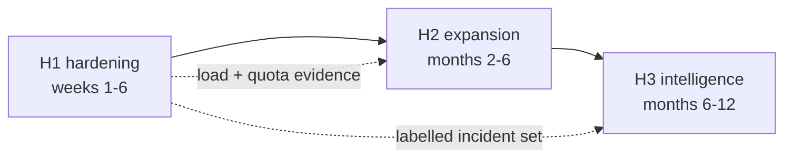

# 28 — Future Roadmap

**Project:** CareGrid AI
**Document type:** Post-hackathon horizons, the technical debt we knowingly carry, the data model's evolution path, and the compatibility policy
**Status:** Baseline v1.0 — **not** a commitment document. Every horizon is conditional on a named trigger
**Related documents:** [01 PRD §9 out of scope](./01_PRODUCT_REQUIREMENTS_DOCUMENT.md) · [02 TRD §3, §4, §6, §13](./02_TECHNICAL_REQUIREMENTS_DOCUMENT.md) · [07 Database Schema §12.7](./07_DATABASE_SCHEMA.md) · [18 Testing & QA §20](./18_TESTING_QA_PLAN.md) · [19 Deployment & DevOps §16, §17](./19_DEPLOYMENT_DEVOPS.md) · [26 Performance Requirements §5, §13](./26_PERFORMANCE_REQUIREMENTS.md) · [27 Hackathon MVP Scope §3](./27_HACKATHON_MVP_SCOPE.md) · [30 Development Phase Plan](./30_DEVELOPMENT_PHASE_PLAN.md)

> **How to read this document.** Nothing in it is scheduled. Each item has a **trigger** — the concrete event that would make it worth doing — and most of them will never fire. The document exists for three reasons: (1) so the next person does not re-derive the reasoning, (2) so a "what's next?" question in Q&A has an honest answer, and (3) so the *refusals* are written down, because the refusals are the more valuable half.
>
> **It is strictly separate from the MVP.** Nothing here is a reason to cut a MUST HAVE ([27 §1](./27_HACKATHON_MVP_SCOPE.md)). If an item in this document appears to be needed for the hackathon demo, it is a scope error in the other direction.

---

## 0. The three horizons

| Horizon | Window | What it is for | The single question it answers |
| --- | --- | --- | --- |
| **H1 — hardening** | weeks 1–6 | Make the system safe to put in front of a real user, even a small number of them | "Would it be negligent to let a real person use this?" |
| **H2 — expansion** | months 2–6 | Make the system useful to the organisations that would actually deploy it | "What would a real operations centre ask for that we do not have?" |
| **H3 — intelligence** | months 6–12 | Make the system predictive rather than reactive | "What becomes possible once there is real data?" |

**The dependency chain between them is one-directional and it is the point of the document:**



H3 items are **blocked on H1 data**, not on H1 code. Predictive risk models need a labelled incident set, and a labelled incident set comes from H1's accuracy study — not from a model.

---

## 1. Horizon 1 — post-hackathon hardening (weeks 1–6)

Effort scale used throughout: **S** ≤ 1 day · **M** ≤ 1 week · **L** 1–2 months · **XL** > 2 months.

| # | Item | Motivation | Technical approach | Prerequisites | Effort | Risk | Cost impact | Privacy / regulatory | **What would make it NOT worth doing** |
| --: | --- | --- | --- | --- | :-: | --- | --- | --- | --- |
| H1-1 | **Independent security review of `firestore.rules` and `storage.rules`** | The rules are the only client-side enforcement layer, and they were written and reviewed by the same people. [10](./10_AUTHORIZATION_SECURITY.md) §9.1 enumerates 95 assertions; none of them was written by an adversary | A second reader walks [22 §3](./22_USER_ROLES_PERMISSIONS.md)'s 61 rows and [22 §7](./22_USER_ROLES_PERMISSIONS.md)'s rule text and writes, for each row, the exact `allow` expression that satisfies it. Then a third pass attempts an escalation per row and records the outcome. A rules diff is merged only if the test suite grows | None | **M** | Low. The risk of *not* doing it is the whole point | $0 | No personal data leaves the environment | If there is no second reader. A self-review of a security boundary is not a review |
| H1-2 | **Resolve every open `DECISION REQUIRED`** | Nine open items ([19 §17](./19_DEPLOYMENT_DEVOPS.md), [02 §13.2](./02_TECHNICAL_REQUIREMENTS_DOCUMENT.md) DR-01…DR-09, [26 §15](./26_PERFORMANCE_REQUIREMENTS.md) DR-19…DR-24) is a decision that will be made by accident rather than by choice. `DEC-01` in particular can break the core narrative | A single review meeting. For each: read the current plan fact from the provider console, record the value, mark the item resolved with the evidence, or record the decision and its reason | Provider console access | **S** | Very low | $0 | None | Nothing. This is the highest ratio of value to effort in the entire document |
| H1-3 | **Service-account and secret key rotation, on a schedule** | [21 §6](./21_ENVIRONMENT_VARIABLES.md) specifies 90/180-day cadences and nothing enforces them. A leaked service-account key bypasses every rule (NFR-013) | Add the §15.1 procedure to a recurring calendar task with a named owner. Add a `GET /api/admin/system/health` field that reports the age of the active key so "is it time?" is a dashboard question rather than a memory test | H1-1 complete | **S** | Very low | $0 | Key material is the most sensitive artefact the project holds | If the deployment target has no key concept to rotate. Not our case |
| H1-4 | **Load test at and beyond the stated scale** | [26 §5.4](./26_PERFORMANCE_REQUIREMENTS.md) shows the naive read composition for an active dispatcher session landing at ≈ 5 180 against a 4 000 budget. That is an **unresolved arithmetic discrepancy**, and DR-19 says the honest fix is a lower map cap, not a higher target | Run S-1…S-12 against the dev project at 3 000, 10 000, and 30 000 incidents. Measure reads per dispatcher session-hour. If it exceeds 4 000, reduce the map listener from 150 to 75 documents and amend [07 §12.5](./07_DATABASE_SCHEMA.md) | Load script ([26 §11.1](./26_PERFORMANCE_REQUIREMENTS.md)) | **M** | Low. The risk is a surprise, not a hazard | $0 | The load script uses seeded demo accounts, no real data | If the measured number stays inside the budget. Then record the measurement and close DR-19 |
| H1-5 | **Backup and restore verification** | [19 §10](./19_DEPLOYMENT_DEVOPS.md) describes an export-based backup. An unverified backup is a guess | Run a full export, restore into a **scratch project**, and verify document counts for `incidents`, `statusHistory`, `auditLogs`, and `users`. Separately, sync Storage to a second bucket — `gcloud firestore export` does **not** cover evidence bytes, and that is the most commonly missed step | A backup bucket in a **separate** GCP project | **S** | Low | $0 for a demo-scale export; a lifecycle rule is mandatory so the bucket cannot grow unbounded | The export contains `originalText`, reporter UIDs, and IP hashes. It is the most sensitive artefact produced. Restrict to the project owner | If the seed script remains the authoritative source of a demo-scale database. Then the honest statement is "we can rebuild from the seed; we have not verified that an export restores" — and that statement should be made rather than avoided |
| H1-6 | **Error monitoring with a real alert path** | NFR-030 asks for a *pluggable, default-disabled* reporter. Default-disabled plus never-enabled equals no monitoring, and a 5xx at 3 a.m. is invisible | Enable `SENTRY_DSN` on a free tier, or implement the free alternative: a `POST /api/admin/cron/error-digest` that aggregates `aiRuns.outcome = 'error'` and a `counters` document, mailed once a day | `GET /api/admin/system/health` already aggregates most of the inputs | **S** for the digest, **S** for Sentry | Low | $0 on a free tier, and it must stay $0 | Error payloads must never contain a body, a token, or user input ([26 §10.4](./26_PERFORMANCE_REQUIREMENTS.md) TC-INT-008) | If nobody will read a daily email. Then the honest answer is "we do not detect production errors; we detect them when a user reports one" — which is a real answer with a real cost |
| H1-7 | **Triage accuracy study on a labelled incident set** | The product's core claim is that the AI extracts structure accurately. **Nothing has measured it.** 50 adversarial fixtures prove it does not *misbehave*; they do not prove it is *right* | Collect 200–500 real incident reports with a human-labelled `(category, urgency)` pair. Measure per-category precision/recall, urgency confusion matrix, calibration of `aiConfidence` against correctness, and the fallback rate. Publish the result, including the unflattering numbers | Real reports, which means a real deployment or a synthetic-but-reviewed set. Both are weaker; say which | **L** | Medium: the risk is finding that the model is much worse than the demo suggested, which is *information*, not a disaster | $0 at 500 triage calls (`GEMINI_RPD_LIMIT` = 200/day, so ~3 days) | Reports contain citizen text. Consent, a stated retention period, and redaction before any external use are required. The sanitiser already redacts PII for the model; the study needs the same discipline for its storage | If fewer than ~200 labelled examples can be obtained. Below that the statistics are not meaningful and a number produced anyway would be misleading |
| H1-8 | **Privacy impact assessment + a published privacy notice** | The system holds emergency reports, precise locations, evidence media, and IP hashes, and sends (redacted) content to a third-party AI provider. A real deployment needs the assessment, not just the notice. NFR-028, NFR-029, and FR-136 all make commitments that are currently only in documents | A structured PIA covering: data inventory, lawful basis, the Gemini free tier's data-handling terms, retention (audit ≥ 365 days, location purge at 90 days), the subject-rights path, and the breach path. Then a `/privacy` page that says the same things in plain language | H1-7 informs what is actually collected | **M** | Low | $0 | **This item *is* the regulatory work** | Nothing. A system that collects emergency data without a PIA should not be deployed at all |
| H1-9 | **Accessibility audit with real disabled users** | [18 §20](./18_TESTING_QA_PLAN.md) states this gap plainly: axe checks markup, not comprehension. NFR-017/018 are verified against WCAG checks, which is not the same as being usable | Recruit 3–5 users across the categories that matter for this product: screen-reader (NVDA, VoiceOver, TalkBack), motor (switch access, voice control), cognitive, and low vision. Run the four primary journeys (J1–J4, [18 §11.1](./18_TESTING_QA_PLAN.md)) | Recruitment; a stipend is a real cost and should be budgeted | **L** | Low | Stipends are a real cost — the first item in this document with one | Test data must be synthetic | If no users can be recruited. Then the honest claim stays "tested against WCAG 2.1 AA checks" and **not** "accessible", which is exactly what [18 §20](./18_TESTING_QA_PLAN.md) already says |
| H1-10 | **Abuse and fraud controls** | DEC-10 requires identity, which makes fake reports *possible* rather than *anonymised*. Rate limits (5/hour, 20/day) bound volume, not intent. Nothing detects a coordinated fake-report campaign | Report-rate anomaly detection per `reporterUid` and per geohash-6 cell; a coordinator-side "flag for review" affordance writing an audit row; a responder identity-verification trail; a rate-limit review keyed on `RATE_LIMIT_*` abuse patterns | `rateLimits`, `auditLogs`, `reports.ipHash` | **L** | Medium: a false positive that silences a real emergency is the worst possible failure. **Every anomaly signal must be advisory, never blocking** | $0 | A fraud score is a personal-data inference about a citizen. It must be explainable, auditable, and deletable, and the citizen must be able to see it | If the responder base is trusted enough that a coordinator handles reports manually. Then this is a process, not a feature |
| H1-11 | **Dependency and supply-chain hygiene** | The project runs on a transitive dependency tree, and NFR-013's secret scan does not cover a compromised package | Dependabot; `npm ci` everywhere (never `npm install`); a lockfile-diff review on every Dependabot PR; `npm audit` in CI as a report, not a gate until its false-positive rate is understood | CI (already in [19 §14](./19_DEPLOYMENT_DEVOPS.md)) | **S** | Low | $0 | None | Nothing |
| H1-12 | **Multi-region and failover design** | Single-region is a deliberate ADR ([02 §4.4](./02_TECHNICAL_REQUIREMENTS_DOCUMENT.md)) and it means a regional outage is a total outage | Only worth designing once there is a second city. Document the read-replication topology, the consistency model for `incidents` across regions, and what happens to realtime listeners on a failover | A second city, i.e. H2's multi-tenant work, i.e. H3-5 | **XL** | High: cross-region realtime consistency is the hardest problem in this product | **Breaks the $0 claim.** Multi-region Firestore roughly doubles per-operation cost | Cross-region transfer of citizen location data is a cross-border question in many jurisdictions | Single-city product. [01 §9](./01_PRODUCT_REQUIREMENTS_DOCUMENT.md) explicitly excludes multi-tenant federation |
| H1-13 | **A real incident-response runbook and a named on-call rotation** | There is no on-call ([19 §16](./19_DEPLOYMENT_DEVOPS.md) row 2) and no detection ([19 §11.3](./19_DEPLOYMENT_DEVOPS.md)) | Extend [19 §15](./19_DEPLOYMENT_DEVOPS.md) with: severity definitions tied to user impact, a triage decision tree keyed to the degraded paths, a customer-communication template, and a post-incident review format | H1-6 (detection), otherwise the runbook is never triggered | **M** | Low | $0 | The communication template must not disclose citizen data | A volunteer-operated demo with no users has no one to page. The runbook is for when that stops being true |

### 1.1 The five H1 items that are not optional

If H1 is cut to five items, they are **H1-2** (close the open decisions), **H1-1** (independent rules review), **H1-8** (privacy assessment), **H1-3** (key rotation), and **H1-6** (an error-detection path). In that order. The rest are valuable and none of them is a prerequisite for anything else.

---

## 2. Horizon 2 — product expansion (months 2–6)

| # | Item | Motivation | Technical approach | Prerequisites | Effort | Risk | Cost impact | Privacy / regulatory | **What would make it NOT worth doing** |
| --: | --- | --- | --- | --- | :-: | --- | --- | --- | --- |
| **H2-1** | **Government emergency-service integration** | The product routes *community relief responders*, not statutory services ([09 §13](./09_AI_GEMINI_SPECIFICATION.md)). A real city's next question is "can this reach the fire brigade?" | **See §2.1 for the full treatment.** The short version: this is an **inter-agency agreement**, not an API integration | A named public-safety authority, a signed memorandum, an access agreement, and legal review | **XL** | **Very high** — the risk is regulatory and reputational, not technical | Institutional, not cloud. Any gateway is institutional cost | **The entire item** | If no authority will enter an agreement. Then the correct product decision is to *not* build the integration and to say so publicly |
| H2-2 | **Hospital and EMS integration** | Ambulance destination, bed availability, and patient handover are the highest-value data in an emergency system, and a responder currently has none of it | Start read-only: an availability feed consumed into a `facilities/{id}` collection with a strict TTL and no citizen data. Write-back (handover) only after H2-1 exists | A data-sharing agreement per facility; a legal basis for health data | **XL** | Very high: health data is the most regulated category in most jurisdictions | Hosting is trivial; integration and legal is not | Health data brings a separate, stricter regime (special-category data under GDPR-equivalent rules, HIPAA-equivalent obligations, and stricter regimes elsewhere) | If no facility will share. And note: this is a **different product** wearing the same UI. Do not bolt it on |
| H2-3 | **Native mobile apps** | The personas need a phone at incident time, and a browser tab is one backgrounded process away from useless on a low-end device. PWA installability is already shipped; a native app adds background location, offline storage, and push | React Native or a PWA hardened to the next level. Decide: *one* platform first, and measure whether the install rate justifies the second. Push notifications are the real prize — they work with the app closed, which is the only time an alert matters | H1 complete; an app-store review cycle; a real device matrix | **L** per platform | Medium: two codebases for one product, and the second one is worse than the first forever | Apple and Google developer accounts are **$99/year each** — a real recurring cost that breaks the strict $0 claim | Push token handling is device-identity data; store it as such, and make it revocable | If the PWA install rate is low. Measure it first: if 5 % of users install, a native app is 5 % of users with two codebases |
| H2-4 | **Offline-first sync** | A responder in a basement or a basement-level metro station has no signal, and the current answer is a FIFO queue that surfaces a conflict message ([27 §3](./27_HACKATHON_MVP_SCOPE.md) out-of-scope table) | A real sync engine: a local store, an operation log with stable client-generated ids, a vector clock or a server-assigned revision per incident, a **field-level merge policy** for the fields that can merge (notes, `statusHistory` appends) and an explicit conflict for the ones that cannot (`status`, `assigneeUid`). The lifecycle state machine becomes the merge arbiter, not a last-write-wins | H1-4 (the read budget must be understood before replication multiplies writes) | **XL** | **Very high** — a conflict that resolves to the wrong incident status is a safety bug, not a data bug. This is why [01 §9](./01_PRODUCT_REQUIREMENTS_DOCUMENT.md) excludes it from v1 | $0 at this scale | Offline stores are copies of personal data on a device. Encryption at rest, remote wipe on sign-out, and a documented device-loss path | If the deployment's connectivity is good. Measure the actual offline rate before building an engine for it |
| H2-5 | **Multi-language UI** | FR-004 already records the detected input `language` as data, so the AI half is done. The UI half is the gap. In a multilingual city, an English-only emergency form is a report that never gets made | Add the i18n layer (`next-intl` or an equivalent), a message catalogue per locale, locale-aware date/number formatting via `APP_TIMEZONE`-style per-locale config, and a **RTL** pass. Prioritise by the `language` distribution in `incidents`, which is already stored | H1-7 (know which languages actually arrive) | **L** | Medium: every string becomes a key, so a late addition touches every file. This is why it must be done **before** H2-3's two codebases, or it is done twice | Translation itself costs money or volunteer time. The framework is $0 | None specific | If the `language` distribution is > 90 % one language. Then the honest answer is "we store the detected language, so the hard part is already measured" |
| H2-6 | **Multi-channel intake: SMS, WhatsApp, IVR** | The people who most need to report an emergency are disproportionately the people who will not open a web app. This is the single largest **coverage** gap in the product | `source: 'sms' \| 'whatsapp' \| 'webhook'` is already reserved in the schema ([07 §4.1](./07_DATABASE_SCHEMA.md), FR-009) and currently **rejected if enabled but unimplemented** — which is the correct behaviour. Build one channel at a time, behind `ENABLE_*_NOTIFICATIONS` and a new `ENABLE_<CHANNEL>_INTAKE`. A webhook channel is the cheapest: any civic/nonprofit app that already has a hotline can post a report in, using the same `POST /api/incidents` contract plus a signed shared secret | H2-1 for anything touching statutory services; a per-channel provider decision | **L** per channel | **High** — a channel with weak identity is a spam and prank-call vector, and a channel that drops a report is a lost emergency | **Breaks the $0 claim for SMS and WhatsApp.** WhatsApp Business Cloud API additionally requires a registered business account and a Meta app review (FR-106), which cannot complete inside a sprint. **A civic webhook channel is the one genuinely $0 option** | Channel-specific data-protection and telecom regulation. An SMS channel collects phone numbers, which is a stronger identifier than an account | If the product is not being deployed anywhere with a real non-web-reporting population. Then a webhook for an existing partner hotline is the whole win at 1/4 the cost |
| H2-7 | **Advanced routing: travel time, traffic, capability-aware optimisation** | Straight-line distance is a poor proxy for arrival time, and it is the least defensible number in the candidate ranking | Replace `haversineM` with a travel-time estimate. Three tiers, cheapest first: (1) an **isochrone** precomputation per responder's `homeBase` at setup time; (2) a straight-line distance with a road-network correction factor derived from the observed `respondedAt − dispatchedAt` distribution; (3) a real routing API. Then a **matching problem**: at incident volume, "assign the nearest available responder" is a bipartite matching problem with capability, capacity, `serviceRadiusM`, and fairness constraints — not a sort | H1-7 (arrival-time data to learn from); the matching algorithm needs no external dependency | **L** for tier 1–2, **XL** for tier 3 | Medium: a routing API is metered per request and would become the second cost risk after Maps | Tier 1 is $0. Tier 3 is metered and would break the $0 claim. `etaSec` is currently **advisory only** ([07 §8](./07_DATABASE_SCHEMA.md)) and should stay advisory until it is measured | If the observed straight-line-vs-actual error is small. Measure it from existing `distanceM` and `responseSec` pairs before building anything |
| H2-8 | **Responder teams, shifts, and rosters** | Today `responders/{uid}` is an individual with a `status` and a radius. Real volunteer organisations have teams, shift patterns, and a duty roster, and "who is on duty tonight" is a question the system cannot answer | Add `teams/{teamId}`, `shifts/{shiftId}`, and a `responders/{uid}.teamIds[]`. Candidate ranking becomes "who is **on shift** and has the capability", with a shift-derived availability fallback when a live heartbeat is stale. Keep `status` as the live signal and shifts as the planned one, and show both in the UI so a mismatch is visible | H2-7 (roster-aware ranking) | **L** | Low–medium: the hard part is the UI honesty when live and planned disagree | $0 | Shift rosters are personal data (working patterns). Retention and access need defining | If responders are individually managed. A 12-person volunteer team does not need a roster system |
| H2-9 | **Resource inventory management** | `resources/{resourceId}` is a **capability catalogue** — a list of resource *types*. There is no inventory: nobody knows whether the community centre has 4 or 40 first-aid kits. `incidents/{id}/resources` records what was *requested* and *supplied*, not what exists | Add `inventory/{locationId}` with counts and a `lastCountedAt`, and link `requiredResources` to availability at dispatch time. Then reorder suggestions. Start with **counts at named locations** and explicitly do **not** try to track individual items | H2-8 (who owns a location) | **L** | Medium: an inventory that is wrong is worse than none, because a dispatcher will trust it | $0 | None significant — this is operational, not personal, data | If resource requests are satisfied by a partner organisation that already runs inventory. Then integrate, do not duplicate |
| H2-10 | **Public incident transparency view** | A city that publishes "in the last 7 days: 148 reports, 26 critical, 88 % within SLA, 12 % were duplicates of an existing report" builds public trust and gets more reports. It is also the single cheapest credibility win available | A public, read-only, **aggregated-only** surface. Hard constraints: minimum cell size before any cell is shown (k-anonymity, e.g. ≥ 5 incidents), no `reference` in the list, no free text, no `placeName` below street granularity, a `config.publicView.enabled` flag, and the same `analyticsDaily` rollups already computed. Reuse the existing `GET /api/analytics` computation with a public-safe serialiser | H1-8 (the PIA must cover public disclosure) | **M** | **High** — publishing emergency locations can help an attacker and can expose individual citizens. The mitigation is aggregation-only plus k-anonymity, and the residual risk must be written down | $0 | **Publishing aggregated personal data is a disclosure decision with legal consequences.** Requires the PIA and probably legal sign-off | If the city does not want it. Also: it is the item most likely to be demanded by a stakeholder who has not thought about the disclosure risk, so the risk conversation comes before the code |
| H2-11 | **MapLibre migration** | The single real cost risk in the project is the Google Maps monthly credit ([02 §7.5](./02_TECHNICAL_REQUIREMENTS_DOCUMENT.md)). MapLibre GL + OpenStreetMap raster tiles have **no per-load billing** | [02 §3.10](./02_TECHNICAL_REQUIREMENTS_DOCUMENT.md) already records this as "the most likely post-hackathon migration". The `map-adapter` interface exists precisely so the swap is a new adapter plus new marker rendering. Cost: OSM tile usage policy is not a *contractual* free tier; marker/cluster styling costs more implementation; `AdvancedMarkerElement` has no MapLibre equivalent | The `map-adapter` interface ([20](./20_PROJECT_FOLDER_STRUCTURE.md) `components/map/map-adapter.ts`) | **L** | Medium: the map is the surface with the most untested-by-automation code ([18 §3.1](./18_TESTING_QA_PLAN.md) sets `components/map/**` to 70 % because "the real map is not testable headlessly") | **Potentially removes the project's only cost risk** | None | If the Maps credit is comfortable for the actual deployment's traffic. Then the migration is a *risk reduction* for a risk that is not materialising, and it trades a metered-but-reliable dependency for an unmetered-but-policy-governed one |

### 2.1 H2-1 in full — government emergency-service integration

This is the item judges ask about most often, and the one where an overclaim does the most damage. So it gets its own treatment.

**What the product does today.** CareGrid AI routes **community relief responders** — volunteers. `dispatches.dispatchedBy` is always a human actor's uid ([09 §6.4](./09_AI_GEMINI_SPECIFICATION.md)), and DEC-05 forbids the AI from dispatching anything. There is no code path anywhere that causes an outbound call, an SMS to an authority, or a public alert ([09 §1.2](./09_AI_GEMINI_SPECIFICATION.md)).

**What "integration" would actually require, in layers:**

| Layer | What it means | Why it is the hard part |
| --- | --- | --- |
| 1. **Access** | A formal, bilateral agreement with the public safety authority that owns dispatch in the jurisdiction. This is the layer everything else depends on, and it is not a technical problem | There is **no self-serve, public, free API** through which a third-party application can request a statutory dispatch. Where such interfaces exist, access is an inter-agency arrangement with a named authority, and it carries data-protection, liability, audit, and availability conditions. **VERIFY the specific position with the specific authority before any claim is made — do not assert that an API exists** |
| 2. **Protocol** | A message format, an authentication model, a delivery guarantee, and a status feed back from the authority's system | The authority's system is typically legacy, and the integration is frequently a fax/telephony bridge rather than an API. A fax bridge is a real and common answer and it is an integration |
| 3. **Legal and regulatory** | Liability for a mis-routed emergency, data-protection obligations for citizen personal data crossing into a statutory system, sector-specific record-keeping, and procurement | This is where the project actually stops. It is months of work by people who are not on a hackathon team |
| 4. **Human confirmation** | Even with access, the AI must not initiate. A dispatcher confirms; the system records the confirmation | **Already designed.** [09 §6.4](./09_AI_GEMINI_SPECIFICATION.md)'s gate: `report → AI triage → status: triaged → [HUMAN] verify → verified → [HUMAN] assign`. There is no configuration, environment variable, or code path that allows an assignment without a human actor uid. This part needs no new work — it needs to be *preserved* |
| 5. **Fallback and failure** | What happens when the statutory integration is down, and the citizen's report is real | The honest answer: the community-responder path continues, the incident is flagged as escalated-to-authority, and the dispatcher is told the statutory route is unavailable. **Never** silently drop a report because a partner integration failed |

**The decision rule we would apply:**

> If layer 1 has no answer, do not build layers 2–5. The engineering is not the constraint; the agreement is. A team that has built a beautiful integration against a hypothetical API has built a demo, and it must say so.

**What to say in Q&A, today, honestly:**

> "The system routes community responders and the dispatch path always has a human with an actor id in it. Connecting to a statutory service is not an API integration, it is an inter-agency agreement with a public safety authority, and in most jurisdictions there is no self-serve interface at all. The engineering half is already designed — the human-in-the-loop gate means the AI can never initiate — and the constraint is entirely the institutional half. We have written the protocol shape so that if an authority gives us access, the integration is a new `NotificationChannel`-shaped adapter rather than a rewrite."

---

## 3. Horizon 3 — intelligence (months 6–12)

Every item in this horizon is blocked on H1-7's labelled incident set. That is not a scheduling convenience; it is the substance. [DEC-13](./01_PRODUCT_REQUIREMENTS_DOCUMENT.md) accepts a heuristic risk score precisely because there is no data, and the trigger for revisiting it is "≥ 5 000 labelled incidents".

| # | Item | Motivation | Technical approach | Prerequisites | Effort | Risk | Cost impact | Privacy / regulatory | **What would make it NOT worth doing** |
| --: | --- | --- | --- | --- | :-: | --- | --- | --- | --- |
| H3-1 | **Predictive risk models** | Heuristic risk (density × severity × recency, DEC-13) tells you where incidents *have* been. Prediction tells you where they *will* be, which changes prevention and pre-positioning | Three honest tiers. **(1) Better statistics, still not ML:** per-cell and per-hour-of-week baselines with confidence intervals, and a Poisson rate estimate with an explicit "not enough data" state. **(2) A gradient-boosted model per (geohash-6 cell, weekday, hour)**, trained on the labelled set, with a **calibration check** before deployment and a **heuristic fallback when the model abstains**. **(3) A sequence model over incident streams** — this is where the real value is and it needs far more data than (1) or (2) | **H1-7's labelled set, at ≥ 5 000 examples** (DEC-13's own trigger). Below that, a model memorises | **XL** for tier 2, > **XL** for tier 3 | **High, and it is a *safety* risk, not an accuracy risk.** A false positive concentrates responders on a cell that has no incident; a false negative removes the whole value. Therefore: the model must **never** gate dispatch, only inform pre-positioning, and it must report its own confidence and abstain below a threshold | Tier 1 is $0. Tier 2/3 need training infrastructure. **Breaks the $0 claim** at any serious scale | A risk score is an **inference about a place and therefore about the people in it**. It can become a proxy for protected characteristics. That makes it high-risk personal data in most regimes, with corresponding access, retention, and explanation duties | Below 5 000 labelled examples, absolutely. And if the model's out-of-sample lift over the heuristic is not clearly positive, the heuristic stays and the model is deleted. **A heuristic you can explain to a dispatcher beats a model you cannot** |
| H3-2 | **Weather, satellite, and IoT sensor feeds** | Heatwave, flood, and severe-storm are three of the eleven categories, and all three are *predictable from external data* hours before a report arrives. This is the highest leverage per unit of effort in Horizon 3 | Ingest public meteorological forecasts and observed rainfall, and (optionally) IoT feeds from municipal water-level and temperature sensors. Compute a **cell-level environmental risk** and attach it to `riskZones` as an *input*, alongside the existing density/severity/recency terms. Then use it for **pre-positioning alerts to dispatchers**, never for auto-dispatch | A data source with a licence that permits it; a per-cell spatial join (the geohash machinery already exists — this is a second `array-contains` query) | **L** | Medium: a bad sensor reading becomes a bad alert, and responders stop trusting alerts. Every feed needs a staleness indicator shown in the UI | Public forecast APIs have free tiers with usage limits. Satellite imagery is metered. **Sensor hardware is capital cost** | Environmental data is not personal, but a cell-level risk overlay can be joined back to an individual. Keep the join one-way | If the existing heuristic already surfaces the right cells on real data. Validate before ingesting: run H3-2's value *offline* against historical reports before building any ingestion |
| H3-3 | **Automated resource optimisation** | Which resources should be pre-positioned where, and when, given predicted risk and actual supply | A constrained optimisation over (location × resource × time) using the H3-1 risk surface and an H2-9 inventory. Solve as an integer program offline (nightly or on a schedule) and publish the **recommendation**; a human approves. Never auto-dispatch | H3-1, H2-9 | **XL** | High: an optimiser that moves a scarce ambulance is making a safety decision. Human approval is mandatory, not optional | Compute is metered. The data volumes are small; the cost is engineering | Inventory location data is operationally sensitive | If H2-9 does not exist, there is nothing to optimise. Optimising an unknown inventory is arithmetic without meaning |
| H3-4 | **Computer-vision hazard detection** | Evidence photos are uploaded and then only read by a human dispatcher. A model could detect a fire, a flooded roadway, a structural collapse, or an injured person in an image the reporter uploaded and did not describe | A classification model over the `MediaRef` on `incidentReports`, at triage time, producing a *label set* that is **advisory, never a status**. The existing safety pipeline is the right shape: schema-constrained output, strict validation, and a deterministic fallback. Same architecture as the text triage, so the risk profile is already understood | H1-7 (labelled *images*, which is a much harder labelling task than text) | **XL** | **High, and higher than the text risk.** A CV model produces a confident wrong answer about a physical, safety-relevant fact — "no hazard detected" on an image where someone is trapped. **Therefore: it must never reduce an urgency, only ever add a flag and raise it.** The same rule R1–R3 already enforce for text ([09 §5.3](./09_AI_GEMINI_SPECIFICATION.md)) | Inference cost. Free tiers are small; production needs GPU inference, which **breaks the $0 claim** | Processing citizen images with a model is processing personal data. Faces, licence plates, and home interiors must be handled explicitly | If the text triage already classifies the photo adequately — and Gemini's vision input already does ([02 §3.9](./02_TECHNICAL_REQUIREMENTS_DOCUMENT.md)). **A dedicated CV model competes with a capability the system already has.** That is the strongest argument against it |
| H3-5 | **Multi-city federation** | A city council wants the same platform for two of its wards, and a second city wants a deployment of their own | Two options, in order of preference. **(a) Separate deployments per city** — the current architecture, one Firebase project per city, no code change, and the honest answer for two cities. **(b) A shared database with a `regionId` on every collection** — only when a cross-city query is a genuine requirement, and then it touches every index, every query, the rate-limit subject, and the auth boundary | A governance decision about whether cities' data may be pooled at all | **L** for (a), **XL** for (b) | **High for (b).** `regionId` on every collection means every existing query changes, every index changes, and a missing `regionId` is a **cross-tenant data leak**. Every query would need a region filter, and a forgotten filter is a breach | (a) is $0 per city but N projects. (b) is cheaper to operate and **breaks the single-tenant simplicity the whole design rests on** | **Pooling citizens' emergency data across municipal boundaries is a governance and legal question before it is an engineering one.** Separate deployments is often the *only* answer | If a single-city deployment is not yet proven. A multi-city platform built on an unproven single-city one is two unproven things |
| H3-6 | **Incident knowledge graph** | After a year, the relationships are the asset: this intersection repeatedly produces collisions; this responder team is effective for this category; this building has repeated power failures; these two incident types co-occur | A derived graph over existing documents — `(incident)–[category]–(cell)`, `(incident)–[responder]–(capability)`, `(incident)–[co-occurs]–(incident)`. Two implementation options: a **derived** graph (recomputed from Firestore, no new store, cheap to delete) or a **dedicated** graph store (Neo4j/Arango). **Take the derived one.** The question "what else happened here last month?" is one `geoCells array-contains` query and it already works | **A year of real data.** A graph over 9 incidents is a diagram of nothing | **M** for derived, **XL** for a dedicated store | Low for the derived option — it is a read model, and deleting it costs one rebuild. High for a dedicated store: a second datastore to operate, secure, back up, and keep consistent | Derived: $0. Dedicated: hosting is cheap; the operational cost is not | A graph that links responders to incident locations is a graph of who was where. That is sensitive, and it is exactly the data FR-068 is designed to hide from other responders — so the graph's access model must be stricter than the incident's | If nobody asks cross-cutting questions. Instrument the question count first: log how often an operator opens two incidents in the same cell within an hour. If the answer is "never", the graph is premature |

---

## 4. "When to say no" — features we are deliberately rejecting

This is the more useful half of the document. A roadmap that only says yes is a wish list.

| # | Rejected | Why we say no, permanently or for now | What would change our mind |
| --: | --- | --- | --- |
| N-1 | **Let the AI auto-dispatch, auto-verify, or auto-close** | DEC-05, mandatory. The safety argument is not "it might be wrong" — it is that a false negative here consumes a scarce responder. **This is not a roadmap item at any confidence level.** [09 §1.2](./09_AI_GEMINI_SPECIFICATION.md)'s prohibition table is the design | **Nothing.** Even a 99.99 %-accurate model gets it wrong 1 in 10 000 times, and 1 in 10 000 of "close a cardiac arrest as resolved" is a death. The gate stays forever |
| N-2 | **Anonymous reporting** | DEC-10. Accountability and abuse prevention both need an identity. A moderator-reviewed anonymous tier is a legitimate *design* (randomised moderation, rate limits by fingerprint, delayed publication) | Only if a regulator or a city requires it, with the moderator queue built in the same change |
| N-3 | **A second AI provider, "for resilience"** | [02 ADR-012](./02_TECHNICAL_REQUIREMENTS_DOCUMENT.md) deliberately implements one. A second provider is a second schema-mapping exercise and a second adversarial test set. `TriageProvider` exists so the swap is one file — that is sufficient, and speculative generality is worse than a migration | A real availability requirement, i.e. an SLO someone is accountable for. Then the swap is a sprint, not a rewrite (§7.3) |
| N-4 | **A general-purpose query builder over incidents** | The dispatcher needs 6 filters ([08 §3.2](./08_API_SPECIFICATION.md)). A query builder is an injection surface, an index-explosion surface, and a read-budget surface, for a user who is not asking for it | A real operator asking for a filter the current six cannot express, more than twice |
| N-5 | **A real-time chat between a citizen and a responder** | The product routes incidents; it is not a messaging product. Chat invites a whole moderation, retention, and safety surface, and it moves the interaction somewhere the audit trail does not reach | Never for v2. If a city asks for it, that is a different product |
| N-6 | **A public API for third parties** | [02 §6.13](./02_TECHNICAL_REQUIREMENTS_DOCUMENT.md) rejects GraphQL and a public read API. A second, differently-authorised way to read data is the fastest way to defeat the two-gate model in [22 §6](./22_USER_ROLES_PERMISSIONS.md) | A named partner with a named use case, behind a scoped API key, audited, and rate-limited. Never a general-purpose one |
| N-7 | **Gamification: responder points, leaderboards, badges** | This is a safety-critical operations tool. A leaderboard incentivises speed over care, and it turns responder performance data into a public ranking — which is an HR liability and a privacy problem (FR-069's stats are **admin-only** for a reason) | Never, for this product. If engagement is the goal, that is a different product |
| N-8 | **Predictive *dispatch* (assigning before a report exists)** | Everything in N-1, plus: pre-emptive dispatch spends scarce capacity on a prediction. Pre-*positioning* is fine (H3-3, human-approved); pre-*dispatch* is not | Nothing |
| N-9 | **Inferring demographics or risk from location** | A location-derived inference about a population is high-risk personal data, is trivially biased, and has no operational use in this product. It is also the fastest route to a discrimination finding | Never |
| N-10 | **More than 11 categories "just in case"** | DEC-12. Taxonomy drift silently breaks every filter, chart, and SLA mapping. A 12th category with one incident is a worse filter | A category with ≥ 5 % of volume over 3 months, added as a config change with a migration note |
| N-11 | **A 13th/14th…: voice, video, and file attachments generally** | Size, cost, the 4.5 MB body limit, the Gemini payload budget, and the browser-MIME matrix. Each channel multiplies the test matrix and the failure modes | Evidence of demand, plus a per-channel cost and quota budget |
| N-12 | **Owning the map tiles / building map infrastructure** | That is a different company. [02 §3.10](./02_TECHNICAL_REQUIREMENTS_DOCUMENT.md) rejects it for v1 and records MapLibre as the realistic migration | Never |
| N-13 | **Building a training or workforce-management product for responders** | H2-8 covers rosters because dispatch needs them. Certification expiry tracking, continuing education, and performance management are a different product with a different buyer | A partner organisation asking for it as their primary need, which means it is their product and we are the integration |
| N-14 | **Anything that requires a real user to trust us with their safety before H1 is complete** | H1 is six weeks of work. Deploying a safety-relevant system to real users before an independent rules review, a key rotation schedule, a privacy assessment, and an accuracy study is negligence, not ambition | H1 complete, on all five non-optional items |
| N-15 | **Blocking on a provider's roadmap** | The whole architecture is chosen so the expensive dependencies are replaceable: `services/ai/provider.ts` for the AI, `components/map/map-adapter.ts` for the map, `services/firestore/*` for the datastore. A migration is bounded, so a provider's roadmap is not our critical path | Never. This is a property to preserve, not a thing to revisit |

---

## 5. Technical debt register

Everything the current design **knowingly** trades away. Each row: what we gave up, why, the symptom it causes, and the trigger to fix it. This is a register, not a complaint.

| # | Debt | Why we took it | The symptom it causes | Trigger to fix |
| --: | --- | --- | --- | --- |
| TD-1 | **No geospatial queries.** Firestore cannot do `near`, `geoWithin`, radius, or polygon. Every distance filter is a geohash-6 footprint + exact Haversine in code ([07 §9.1](./07_DATABASE_SCHEMA.md)) | DEC-15 + C1/C2. PostGIS is the correct answer and it is a paid or credit-metered datastore | The entire location design is an **emulation**. A 500 m query is 1 read + N in-memory distance computations. Map viewports cost **up to 9 sequential reads** because `in` cannot combine with `array-contains` | A real geospatial requirement: > 1 city (H3-5), or a viewport that must answer a shape query |
| TD-2 | **`geoCells` neighbour derivation is approximate.** `ngeohash` 0.6 may not expose a neighbour helper, so the 8 neighbours are computed from degree offsets, and those offsets are **approximations** | The offset method is 10 lines; a canonical neighbour algorithm is a dependency and a licence question | A wrong neighbour set means **false negatives in duplicate detection** — a missed duplicate, which is the product's core value. `DR-06`/`DR-08` | **Resolve before real use.** Validate against a reference table, and if the offsets cannot be made exact, raise the fan-out to precision-5 and re-verify the read budget |
| TD-3 | **No `GROUP BY` / aggregation.** Firestore has none | DEC-15 | Every aggregate reads `analyticsDaily` rollups, and the live-scan path is hard-capped at 500 reads with `truncated: true` | Any range the rollups do not cover, or a volume where the cap binds (see §6) |
| TD-4 | **10-value array index limit, 30-value `in` limit, 10-value `or` limit** | Platform constants | `geoCells` is **exactly 10 by design**; the active status set is **7 by design**. Both are load-bearing design constraints, and both break silently if a status is added | Adding a 12th category or an 8th active status. **Design constraint, not a bug** |
| TD-5 | **Transactions retry silently up to 5 times, so every transaction body must be idempotent** | Platform behaviour | A subtle, permanent correctness obligation. A non-idempotent transaction body double-counts under retry and nobody notices | Never "fixed". It is a permanent rule, enforced by TC-LIFE-003b, TC-INT-138, and review |
| TD-6 | **Auth custom claims are not transactional with Firestore** | Firebase platform limit | A role change can leave `roleChangePending: true` and a 202 response. The server treats `users/{uid}.role` as authoritative and the claim as a rules-only mirror, so the *security* outcome is correct; the *UX* outcome is a refresh prompt | Never. It is a platform constraint, and the compensating design is correct |
| TD-7 | **Token revocation is API-layer only** | `checkRevoked: true` requires the Admin SDK | An un-expired token can still read its **own** `users/{uid}` doc through Security Rules until it expires. Documented as a residual risk in [22 §8.3](./22_USER_ROLES_PERMISSIONS.md) | H1-1's independent review. All privileged data reads are already server-mediated, which bounds it |
| TD-8 | **The rate limiter is a Firestore transaction: 1 read + 1 write on every limited request, and a single hot document per subject** | [02 §6.7](./02_TECHNICAL_REQUIREMENTS_DOCUMENT.md) — Redis is a $0 risk and a network dependency on every write | Correctness under contention relies on Firestore's transaction retry semantics. It is correct but it is 1 read + 1 write of overhead per write route, and a 60 s window is coarse. **Honest limitation: `RATE_LIMIT_STORE=memory` is documented as unsafe on Vercel** (serverless instances are ephemeral and per-instance) and is a known landmine | Read volume justifying a shared store, or a plan budget that tolerates one |
| TD-9 | **Single region, no failover, no read replica** | ADR; single-city product | A regional outage is a total outage. There is no scale-out path that does not involve a second datastore | A second city, or an availability requirement with an owner (H1-12, H1-13) |
| TD-10 | **No horizontal scale path for the server layer** | Vercel serverless is the scale path — but every instance is stateless, which is a *strength* — and the *state* is all in one regional Firestore | Vercel scales; the database is the ceiling. Not a bottleneck at any projected demo or early-deployment volume | Firestore operation limits at real traffic. H3-5 is where this stops being free |
| TD-11 | **One AI provider.** `services/ai/provider.ts` defines the interface; exactly one implementation exists | [02 ADR-012](./02_TECHNICAL_REQUIREMENTS_DOCUMENT.md): a second provider is a second schema mapping and a second adversarial test set, and speculative generality is worse than a migration | A Gemini quota or availability problem is a single point of failure with no failover | A real SLO. §7.3 is the migration plan |
| TD-12 | **Free-tier quotas are not contractual** | C1 | Quotas can change without notice. Every optional dependency has a degraded path; the core one (Firestore) does not | A quota change that breaks the core flow. Response: the degradation ladder, and then a budget conversation |
| TD-13 | **No offline write conflict resolution.** Only a FIFO action queue with a "conflict" message (US-014) | [01 §9](./01_PRODUCT_REQUIREMENTS_DOCUMENT.md) excludes full offline sync; conflict resolution is a distributed-systems problem needing domain input | A responder action replayed after someone else changed the incident is reported, not resolved | A measured offline rate that makes it a real problem (H2-4) |
| TD-14 | **No server-side image processing (no `sharp`)** | [02 §6.2](./02_TECHNICAL_REQUIREMENTS_DOCUMENT.md), ADR-016: a native module in the Vercel build image is a whole class of "works locally, fails on deploy" | No server guarantee about dimensions. `width`/`height` on `MediaRef` are **client-reported** and labelled as such. No thumbnails, so every evidence view is a full-size signed-URL download and a Storage egress event | Upload volume making display cost visible, or a design that needs multi-size derivatives |
| TD-15 | **Magic-byte sniffing is not a virus scanner** | Honest. `scanStatus: 'clean' \| 'pending' \| 'quarantined'` exists in the schema ([07 §10.1](./07_DATABASE_SCHEMA.md)) **precisely so a real scanner can be added later without a migration** | Polyglot files are mitigated (rejected rather than carved), not eliminated. The residual risk is documented in [24](./24_THREAT_MODEL_SECURITY.md) | Uploading evidence from untrusted public sources at volume |
| TD-16 | **`deletedAt == null` must appear in every default query** | [07 §12.4](./07_DATABASE_SCHEMA.md): it is the most commonly forgotten rule in this design | A forgotten filter leaks soft-deleted incidents to non-privileged readers. Enforced by review, a lint rule, a custom scan (TC-INT-144), and rules tests — **not by the platform** | Never "fixed". A permanent rule with four enforcement layers |
| TD-17 | **The listener registry is the only thing bounding realtime read cost** | ADR-009: Firestore listeners instead of polling, because a listener costs zero Vercel invocations and 1 read per changed document | An un-unsubscribed listener is a **permanent read leak**. FR-091's cap of 8 and the mandatory teardown are architectural requirements, not lint suggestions | Never. RT-1…RT-10 in [26 §7.1](./26_PERFORMANCE_REQUIREMENTS.md) are the rules |
| TD-18 | **Map viewport queries cost up to 9 sequential reads** | `in` cannot combine with `array-contains` ([07 §12.1](./07_DATABASE_SCHEMA.md)) | Pan-and-zoom is the most expensive read in the product. Mitigated by a ≥ 400 ms debounce, cell dedup, a 150-document total cap, and skipping cells a listener already covers | H2-11's MapLibre migration, or a viewport query that must be a shape query |
| TD-19 | **`RATE_LIMIT_STORE=memory` exists as a config value and is unsafe** | Documented for completeness | The single most dangerous config value in the project: it *looks* free and it is not correct on Vercel. A reviewer should add a lint rule or a boot-time guard that rejects it in production | **Now.** Cheap: add `DECISION REQUIRED` → resolved, with a `lib/env.ts` guard |
| TD-20 | **`schemaVersion: 1` with no migration tooling** | Schema-free Firestore is a genuine advantage: a deploy involves no migration, and rollback involves no migration | Backfill is an ad-hoc script. A reader must tolerate an absent field ([07 §2](./07_DATABASE_SCHEMA.md)), which is the actual discipline | The first field rename. §7.1 is the policy |
| TD-21 | **Custom-claim staleness forces a client token refresh after every role change** | Firebase token TTL | A user whose role changed needs `getIdToken(true)` to see the new claim. Before that, the server returns `403 ROLE_MISMATCH` — **fail-closed, which is the correct trade** | Never. It is the right failure direction |
| TD-22 | **NFR-007's 4 000 reads/session-hour is an unresolved arithmetic discrepancy** | [26 §5.4](./26_PERFORMANCE_REQUIREMENTS.md) computes ≈ 5 180 for an active session before relaxing the traffic assumption | Either the target is met for active sessions and comfortably met for idle ones, or the map listener cap must drop from 150 to 75. **The target does not move.** `DR-19` | H1-4. Measure, then reduce the cap — never raise the number |
| TD-23 | **A 4.5 MB serverless body limit, worked around by direct-to-Storage signed uploads** | DEC-08, ADR-004. The bytes genuinely do not need to transit the function | A two-step upload (sign → PUT → claim) is more client code than one POST, and a user who abandons between steps leaves an orphan in `staging/` | Storage free tier becoming a constraint, or a need for multipart uploads |
| TD-24 | **The Vercel function-duration cap may be shorter than the AI timeout** | Platform plan limit, `DEC-01` | If unmitigated, a function killed mid-request means a 5xx instead of a `201` with fallback — a direct FR-029 violation | **Before the first deploy.** §17.1 of [19](./19_DEPLOYMENT_DEVOPS.md): Option A with A′, Option B pre-built |
| TD-25 | **Backups are exports, not point-in-time recovery** | No free PITR tier we can rely on for a $0 claim | RTO in hours; RPO is one export interval | H1-5, then a real deployment's data-loss appetite |
| TD-26 | **The seed script is the de-facto source of a demo-scale database** | It is the only thing that makes a 36-hour rebuild possible | A restore that is never verified is a guess | H1-5 |
| TD-27 | **No WAF, no bot management, no on-call, no availability alerting** | C1; a free uptime service does not exist honestly | Attacks are bounded by rate limits, not prevented. Outages are discovered by a user, not detected | H1-6, H1-13 |
| TD-28 | **The AI's `peopleAffected` is null-heavy by design** | FR-023 forbids fabricating a count, so `null` is correct when unstated | `avgPeopleAffected` has a small sample. `analyticsDaily` records `peopleSampleSize` **precisely to expose this** | H1-7's labelled set. A UI that shows the average without the sample size would be the debt, not the schema |
| TD-29 | **The 60-word stopword list is embedded, English-only, and of unrecorded provenance** | `DR-08` in [02 §13.2](./02_TECHNICAL_REQUIREMENTS_DOCUMENT.md) | Duplicate text similarity is **weaker for non-English reports**, which is most of them in the target city. `language` is surfaced in the breakdown so a dispatcher can see why | H1-7, and a `NOTICE` in the repo. Until then the honest claim is "duplicate detection is strong for English and approximate for other languages" |
| TD-30 | **`incident` documents are denormalised for queue read speed, so summary fields can drift** | 1 read per queue row instead of 5 ([07 §1.1](./07_DATABASE_SCHEMA.md)) | A summary field that disagrees with its source. Mitigated by writing them only inside the server transaction — which is why the transaction discipline is load-bearing | Nothing foreseeable. It is a correct trade |

---

## 6. Evolution of the data model

The current horizon is **NFR-010: 50 000 incidents** over 3 years ([01 §7](./01_PRODUCT_REQUIREMENTS_DOCUMENT.md)). This section says what changes at 100 k, 1 M, and 10 M, and — more usefully — **which change is forced at each level**.

### 6.1 The thresholds and what forces them

| Scale | What is fine | **What breaks first** | The forced change |
| --- | --- | --- | --- |
| **50 k** (the stated horizon) | Every query budget is already volume-independent (NFR-010, [26 §5.6](./26_PERFORMANCE_REQUIREMENTS.md)). `limit()` everywhere, rollups, ≤ 8 listeners, ≤ 50 duplicate candidates | Nothing structural. The stored-data allowance on the free tier becomes the number to watch | None. Verify the read budget with H1-4 |
| **100 k** | Query budgets, indexes, and the transaction patterns are all unchanged | **The 500-read cap on the live analytics scan.** A 24-hour range now routinely contains more than 500 incidents, so `GET /api/analytics` returns `truncated: true` and a "partial data" advisory for ranges it previously served fully | **Hourly rollups.** Add `analyticsHourly/{YYYY-MM-DDTHH}` alongside the daily documents, and have `GET /api/analytics` prefer hourly buckets for ranges ending within 72 h. The API's response shape does not change; only the source does. **Cheap, additive, and it removes the first wall** |
| **1 M** | Firestore as the **operational** store: incidents, dispatches, responders, notifications, audit | **Analytics and any cross-incident aggregate.** 1 M incidents × even a 1 % scan is 10 000 reads per view. And stored data plus a 5-write-per-incident lifecycle becomes a material line item | **(a) Move analytics off Firestore** — a scheduled Firestore→BigQuery export plus BigQuery queries, or a warehouse the deployer already pays for. **(b) Partition by month for archival** — `incidents/{yyyy}/{mm}/{id}` so a closed-and-archived incident leaves the hot path entirely. **(c) Move analytics to hourly + a dedicated store.** **(d) A real geospatial datastore for the viewport and duplicate search** — PostGIS or BigQuery GIS, because the geohash emulation's read cost grows with the number of *active* incidents in a cell, not with the total |
| **10 M** | Almost nothing at the operational layer | **Firestore is the wrong primary store.** 10 M incidents with 5 writes each is 50 M lifecycle writes; the read amplification of the fan-out model becomes dominant; and 10 M documents in one collection makes every index rebuild an event | **Firestore becomes a realtime projection of current state, not the system of record.** The system of record moves to a partitioned store (Postgres/PostGIS or a columnar store), keyed by `{regionId}/{yyyyMM}` with the incident aggregate plus its subcollections. `incidents` in Firestore holds only the **active window** (the last N days), written by an outbox/CDC from the system of record. Duplicate search and the map viewport move to the geospatial store; analytics moves to the warehouse; realtime stays on Firestore because that is what it is genuinely good at |

### 6.2 What would *not* change

| Property | Why it survives every scale transition |
| --- | --- |
| **The 11-value controlled category taxonomy** | DEC-12. A taxonomy that changes with volume is not a taxonomy |
| **The 4-level urgency scale and the 4 SLA targets** | DEC-04. Interpretable, sortable, SLA-mappable. If ML scoring arrives (H3-1), it *informs* a level rather than replacing it |
| **The human-in-the-loop gate** | [09 §6.4](./09_AI_GEMINI_SPECIFICATION.md). Non-negotiable at any scale, at any confidence level, for any reason |
| **`CG-XXXXXX` as the human reference** | DEC-09. Citizens quote short codes in the field at any volume |
| **Append-only `auditLogs`** | FR-131. Compliance value grows with volume; the design does not change |
| **Soft delete** | DEC-11. Legal defensibility grows with volume |
| **The `geoCells` footprint, if the datastore stays Firestore** | It is a Firestore-specific emulation, so it disappears at 1 M+ rather than scaling. That is the honest answer: it is a bridge, not an architecture |

### 6.3 The migration sequence, if 100 k arrives

Ordered so that each step is independently useful and independently reversible:

1. **Hourly rollups** alongside daily. Additive. `GET /api/analytics` prefers hourly for recent ranges. No schema change to `incidents`.
2. **A `volume` field on `config/app`** recording the last measured incident count and the thresholds at which each mitigation applies. The architecture becomes self-describing: a reader can see which regime the system believes it is in.
3. **A `archival` map on `config/app`** with `enabled` and `closedAfterDays`. While `false`, nothing changes. When `true`, a nightly job moves incidents closed longer than the window to a partitioned path. **Reversible**: set `false` and the partition is left alone.
4. **A datastore adapter boundary.** `services/firestore/*` is already the only path to the database ([02 §4.1](./02_TECHNICAL_REQUIREMENTS_DOCUMENT.md) escape hatch (a)). Widening it to a `services/datastore/*` interface — with Firestore as the first implementation — is what makes 1 M possible without a rewrite of the app.
5. **Analytics to a warehouse.** The last step, because the rollups work fine below 1 M and a warehouse is a new operational dependency.

---

## 7. Migration and compatibility policy

### 7.1 `schemaVersion` and field evolution

`schemaVersion` exists on `users/{uid}`, `incidents/{id}`, and `config/app` ([07 §3](./07_DATABASE_SCHEMA.md), [07 §4.1](./07_DATABASE_SCHEMA.md), [07 §11.8](./07_DATABASE_SCHEMA.md)). It is currently `1` everywhere.

**The five rules:**

| # | Rule | Reason |
| --- | --- | --- |
| V1 | **Never rename a field.** Add the new field, dual-write it, backfill, switch the readers, then deprecate the old one — and record the deprecation in a decision register | A rename is a silent data loss across every reader, every listener, every export, and every saved report. It is the single most destructive thing that can be done to a schema-free store |
| V2 | **Every reader MUST tolerate a missing field.** The old code does not know the new field; the new code must not require it until the backfill is complete | A deploy that reads a field the backfill has not written yet is a `500` on a live surface. This is why rules/indexes go first ([19 §7.1](./19_DEPLOYMENT_DEVOPS.md)) and why the reader discipline matters more than the writer's |
| V3 | **The writer sets the version; the reader accepts `≤ current`.** A reader that rejects a higher version fails closed, loudly | Forward compatibility: new writers must not break old readers that are still serving traffic during a rolling deploy |
| V4 | **Every backfill is an idempotent script in `scripts/backfill-*.ts`**, runnable more than once, with a dry-run mode and a count reported before it writes | A non-idempotent backfill run twice is a data-corruption incident. This mirrors the transaction-idempotency obligation ([07 §12.7](./07_DATABASE_SCHEMA.md)) |
| V5 | **A `schemaVersion` bump is a release-gate item.** It appears in the release checklist, the PR template, and the decision register, with the reason | A version bump is the only signal that says "this release is not backward compatible". Without it, a rollback becomes a data-safety question |

**The deprecation lifecycle, concretely:**

```
  add new field (writers dual-write, new field may be absent)
      ↓
  backfill script, idempotent, dry-run first
      ↓
  readers switch to the new field, tolerate absence
      ↓
  writers stop writing the old field          ← one release later, never the same release
      ↓
  readers stop reading the old field
      ↓
  old field removed, in a release with a schemaVersion bump and a decision-register entry
```

### 7.2 API versioning, for a second consumer

[08 §1.1](./08_API_SPECIFICATION.md) defers a `/api/v1/**` path prefix because there is a single consumer. The policy when that changes:

| # | Rule | Detail |
| --- | --- | --- |
| A1 | **Adopt `/api/v1/**` when a second consumer exists**, and keep the un-prefixed routes as a v1 alias for a deprecation window | The prefix is a *routing* change, so it is cheap to add and cheap to remove. Adding it later is easier than adding it now, because there is exactly one client to move |
| A2 | **The envelope never changes.** `{ success, data, meta }` / `{ success, error }` with a stable `code` and a `requestId` on every response, including errors (FR-140, FR-141) | A second consumer integrating against a shape that is not stable is a support burden forever |
| A3 | **A breaking change is a new major version, never a surprise.** Additive changes (new optional field, new endpoint, new enum value *on the response*) are minor | An enum value added to a response breaks a client with a strict switch. So: enum *sets* are versioned, and a new value is a major change unless the contract documents unknown-value tolerance |
| A4 | **Never change the meaning of a field, ever.** A field's type, units, timezone semantics, and nullability are part of the contract. Renaming to a clearer name is still a break | "It is the same field with a better name" is how a two-year integration war starts |
| A5 | **`Idempotency-Key` and `clientActionId` are versioned behaviour, not fields.** Their guarantees (24 h replay, per-action dedupe) are part of the contract and are tested (TC-INT-128, TC-LIFE-011) | A second consumer will depend on replay semantics. Changing them silently is worse than changing a field |
| A6 | **Every route keeps exporting its Zod schema, and the schema remains the executable contract** (NFR-025) | A hand-written second document drifts. The schema cannot |
| A7 | **Deprecate with a header, not a 404.** `Deprecation: true` + `Sunset: <date>` + the replacement path, for at least one full release cycle | A hard cut breaks an integration that had no way to know |
| A8 | **A second consumer gets its own authorization story, written down before it is built.** If the second consumer is a machine, its identity is a service account, its authorisation is a scoped claim, and every call is audited | The two-gate model in [22 §6](./22_USER_ROLES_PERMISSIONS.md) exists because "one HTTP surface" is a security property. A second consumer that reuses the citizen surface breaks it |

### 7.3 Introducing a second AI provider

The seam already exists and was built for exactly this: `services/ai/provider.ts` defines `TriageProvider`; exactly one implementation is shipped, **on purpose** ([02 §3.5](./02_TECHNICAL_REQUIREMENTS_DOCUMENT.md), [09 §11](./09_AI_GEMINI_SPECIFICATION.md)).

| Step | Action | What must **not** change |
| --- | --- | --- |
| 1 | Implement `services/ai/providers/<name>.ts` against `TriageProvider` | `aiTriageOutputSchema`. **The schema is the contract.** A provider that cannot produce the schema does not get a relaxed schema — it gets the fallback |
| 2 | Select by an env var (`GEMINI_MODEL` is already the model-change lever, so a provider key follows the same pattern) | `services/ai/triage.ts`'s orchestration order, `rules.ts`, `fallback.ts`, `sanitize.ts`, `logAiRun` |
| 3 | **Shadow mode:** run both providers on the labelled set from H1-7 and compare. Record per-provider category/urgency precision and the hallucination rate (the R8 diagnosis filter firing) | The safety rules R1–R10. They are provider-independent and must stay in code, never in a prompt |
| 4 | **Adversarial set against the new provider** — all 50 fixtures in `tests/fixtures/ai/` | A provider is an adversary until proven otherwise ([18 §1.1](./18_TESTING_QA_PLAN.md) belief 4). If the new provider needs a *different* adversarial set, the abstraction is weaker than believed and that is the finding |
| 5 | Flip by env var. No redeploy of code, no schema change, no API change | `PROMPT_VERSION` and `aiRuns.model`. Old records stay interpretable because both are stored per run |
| 6 | Keep both configured; a `triageSource` value of `ai` stays `ai` regardless of provider, and `aiRuns.model` is the discriminator | The **meaning** of `triageSource`. A new provider is not a new trust level |

**What this buys, and what it does not:** a swap is a bounded sprint rather than a rewrite. It does **not** buy redundancy for free — two providers means two adversarial suites, two latency profiles, two quota guards, and a per-provider field in `config/app`. That is why it is not built until a real availability requirement exists (N-3).

---

## 8. Horizon summary

| Horizon | Items | Earliest defensible start | Blocked on |
| --- | --: | --- | --- |
| **H1 — hardening** | 13 | Immediately after the event | Nothing. All of it is within reach of the existing team |
| **H2 — expansion** | 11 | Month 2, and only the items whose prerequisite exists. H2-11 (MapLibre) can start at week 3; H2-1 cannot start until an authority says yes | H1 complete; a real deployment for most items |
| **H3 — intelligence** | 6 | Month 6 | **H1-7's labelled incident set.** H3-1 and H3-4 need ≥ 5 000 labelled examples (DEC-13's own trigger); H3-5 and H3-6 need a year of data |
| **Refusals** | 15 | Never, for N-1, N-5, N-7, N-8, N-9, N-12, N-15 | Not applicable. These are decisions, not backlog |

**The one-paragraph version, for Q&A:**

> "Horizon 1 is six weeks of unglamorous work: an independent review of our Firestore rules, closing the nine open decisions, key rotation, a real load test, an accuracy study against a labelled set, and a privacy impact assessment. Horizon 2 is the expansion a real operations centre would ask for — statutory integration, native apps, offline sync, multi-channel intake, travel-time routing — and the hardest part of the first of those is not engineering, it is an inter-agency agreement. Horizon 3 is predictive, and it is blocked on data we do not have yet: a risk model over nine incidents is a number with no meaning. And there are fifteen things on the 'when to say no' list, starting with letting the AI dispatch on its own, which is not a roadmap item at any confidence level."

---

## 9. Appendices

### 9.1 The first two weeks, itemised

Horizon 1 is 13 items and 6 weeks, which sounds like a backlog and behaves like a checklist. This is the actual order, with the parallelism stated.

| Week | Days | Items | Parallel? | The gate at the end of the week |
| --- | --- | --- | --- | --- |
| **1** | 1–2 | H1-2 (close the open decisions), H1-11 (dependency hygiene) | Sequential, tiny | Every `DECISION REQUIRED` has a resolution or a named owner and a date |
| 1 | 3–5 | H1-1 (independent rules review) — **the only thing that must be done by someone other than the author** | One person reviewing, one answering | A written review with every matrix row mapped to an `allow` expression, and every escalation attempt recorded |
| 1 | 3–5 | H1-3 (key rotation, on a schedule) | Yes | The rotation procedure is a calendar task with a named owner, and `system/health` reports the key's age |
| 1 | 3–5 | H1-5 (backup and restore verification) | Yes | One export, one restore into a scratch project, four document counts verified — and the **Storage** gap closed |
| **2** | 6–8 | H1-4 (load test at 3 000 / 10 000 / 30 000 incidents) | Yes, long-running | `DR-19` resolved: either the budget is met, or the map cap is documented as 75 |
| 2 | 6–8 | H1-6 (an error-detection path) | Yes | A daily digest that reports, or `SENTRY_DSN` enabled on a free tier |
| 2 | 9–10 | H1-8 (privacy impact assessment) | Begins; needs H1-7's findings for the "what is actually collected" section | A drafted inventory and a retention table |
| **3–4** | 11–22 | **H1-7 — the accuracy study.** The long pole. Label 200–500 reports, measure, publish | One person labelling, one analysing | A published result **including the unflattering numbers**, and `PR-21` adjusted if the model is worse than the demo suggested |
| **4–6** | 23–40 | H1-9 (accessibility audit with real disabled users), H1-10 (abuse controls), H1-12 (multi-region design — *document only*), H1-13 (incident-response runbook) | H1-9 and H1-10 in parallel; H1-12 and H1-13 are documents | A signed accessibility report; a fraud-signal design where **every signal is advisory**; a runbook with a named on-call rotation |

**The load-bearing observation:** H1-7 dominates the schedule and everything in Horizon 3 depends on it. If it slips, H3 slips, and the honest response is to say so rather than to start labelling reports "roughly".

### 9.2 The three technical debts that would bite a real user first

Ranked by expected harm to a real person, not by engineering interest. The full register is §5.

| Rank | Debt | The scenario where a real user is harmed | The interim mitigation, today |
| --: | --- | --- | --- |
| **1** | **TD-2 — the geohash neighbour derivation is approximate** (`DR-06`) | Two people report the same cardiac arrest 300 m apart. The engine's candidate query misses one because the neighbour cell is wrong. The dispatcher sees two incidents and sends one responder. **The second caller believes help is coming and it is not.** | The candidate query is a **superset** by construction and the exact Haversine filter runs afterwards, so a wrong neighbour is a **missed duplicate**, not a wrong merge. The harm is a duplicated incident, not a lost one. Validate against a reference table **before any real use** — this is the single highest-priority H1 item |
| **2** | **TD-5 / TD-6 — transactions retry silently; claims are not transactional** | A role change lands while a claim write is in flight. The server reads the new Firestore role, the claim still says the old one, and a dispatcher sees `403 ROLE_MISMATCH` on a valid session. **A dispatcher locked out of the console during an incident** | The drift detection is **fail-closed and audited**, which is the right direction: it denies rather than grants. `roleChangePending` plus `POST /api/admin/users/:id/reset-claims` recovers it. Document the UI copy so it reads as "refresh to apply", not as an error |
| **3** | **TD-8 — the rate limiter costs 1 read + 1 write per limited request, and `RATE_LIMIT_STORE=memory` is unsafe on Vercel** | Someone sets `RATE_LIMIT_STORE=memory` in production. Serverless instances are ephemeral and per-instance, so the effective limit becomes **per instance** — 5 reports/hour × 40 instances. Abuse control silently stops working exactly when it is needed. | It is documented as unsafe. **Add a boot-time guard that rejects it when `NODE_ENV === 'production'`** — a one-line fix, logged as `TD-19`, and not yet made. That is the cheapest risk reduction on this list |

### 9.3 A worked example of a schema migration, using the five rules from §7.1

The most likely first migration: `incidents.originalText` needs to become `incidents.reportText` for clarity, plus a new `reportTextVersion`.

| Release | Writer | Reader | Backfill | `schemaVersion` | What can break |
| --- | --- | --- | --- | --- | --- |
| **R1** | Dual-writes `originalText` **and** `reportText`, both with the same value | Reads `originalText` (unchanged) | — | 1 | Nothing. The new field is written and never read |
| **R2** | Dual-writes | Reads `reportText`, **falling back to `originalText`** when `reportText` is absent | Idempotent `scripts/backfill-reports-text.ts`, dry-run first, count reported before writing | 1 | Nothing. Old documents without the new field still read |
| **R3** | Writes only `reportText` | Reads `reportText` | Re-run to catch writes that raced the backfill | 1 | Nothing. The old field is stale but unread |
| **R4** | Writes only `reportText` | Reads `reportText` | — | **2**, with a decision-register entry | Nothing. A rollback to R2's code is safe because R2's code can read both |
| **R5** | Writes only `reportText` | Reads `reportText` | — | 2 | Removing `originalText` would be the first genuinely breaking change, and it is **not in this sequence** |

The four properties that make this safe, and the test of any future migration:

1. **R1 is the only release that can be rolled back with zero risk**, because nothing reads the new field yet.
2. **No release reads a field unconditionally until the backfill that writes it has completed and been re-run.**
3. **The `schemaVersion` bump is R4, one release after the last read of the old field** — so a rollback never lands on code that expects a version that no longer exists.
4. **Every backfill is idempotent, has a dry-run, and reports a count before it writes.** A non-idempotent backfill run twice is a data-corruption incident; a backfill with no dry-run is a production incident waiting for a nervous first run.

**The test to apply to a proposed migration:** *can the previous release's code read data written by this release's code?* If yes, the deploy is safe in either order. If no, the two releases must be separated by a compatibility release, and that release is mandatory.

### 9.4 The two refusals that will be hardest to hold

Everything in §4 is a decision. These two will be argued for by someone senior, and both arguments will sound reasonable.

**N-1 — "let the AI auto-dispatch when confidence is above 0.9"**

| The argument you will hear | The answer |
| --- | --- |
| "At 0.9 confidence the model is more accurate than a tired dispatcher at 3 a.m." | Possibly. And irrelevant. The failure is not a wrong dispatch 9 times in 10; it is a wrong dispatch 1 time in 10 000, and 1 in 10 000 of closing a cardiac arrest is a death. **A confidence threshold is not a safety argument — a base rate is.** How many cardiac arrests does this city have per year? If the answer is 200, then 0.1 % false-negative-on-critical is 0.2 deaths a year from a system nobody chose to be accountable |
| "We would keep it behind a feature flag and off by default." | A flag that is off by default is not a plan; it is a stored disagreement. And `DEC-05` is a **safety requirement**, not a preference |
| "The human confirms anyway, one click." | Then it is not auto-dispatch. It is the current design with extra steps |
| **The decision** | **Never, at any confidence level, for any reason.** [09 §1.2](./09_AI_GEMINI_SPECIFICATION.md)'s prohibition table is the design, [09 §6.4](./09_AI_GEMINI_SPECIFICATION.md)'s gate is enforced in code, and `dispatches.dispatchedBy` is always a human uid. This is the one line on the "when to say no" list that is not a roadmap item at all |

**N-7 — "add a leaderboard so responders compete"**

| The argument you will hear | The answer |
| --- | --- |
| "It would make the app fun and drive engagement." | This is a safety-critical operations console. Engagement is not a goal, and the people using it during an emergency are volunteers who are already at capacity |
| "It would increase response times, which is the metric we care about." | It would increase response times *as a measured quantity*, which is worse. A responder who is three ranks from the top on a heatwave evening makes a different decision about whether to take a low-urgency call. **The metric becomes the objective and the objective corrupts the metric** — Goodhart, in an incident response system |
| "We would only show aggregate, not individual, stats." | Then there is no leaderboard. A leaderboard is a ranking of individuals by definition |
| "FR-069's stats are already admin-only; this would just be a new view." | FR-069's admin-only restriction exists precisely because responder performance data is sensitive — an HR liability and, in most jurisdictions, employment data with its own legal regime. A public ranking turns a measurement into a judgement about a person |
| **The decision** | **Never, for this product.** If engagement is the goal, that is a different product with a different user and a different risk profile. Building it here would damage the thing that makes this product worth deploying |

---

**End of document 28.** Nothing in this document may be cited as a reason to cut, defer, or simplify a MUST HAVE in [27 §1](./27_HACKATHON_MVP_SCOPE.md). Amendments must not introduce an FR ID, a collection, an env var, an endpoint, or a file path that is not already defined in [07](./07_DATABASE_SCHEMA.md), [08](./08_API_SPECIFICATION.md), [20](./20_PROJECT_FOLDER_STRUCTURE.md), or [21](./21_ENVIRONMENT_VARIABLES.md).
