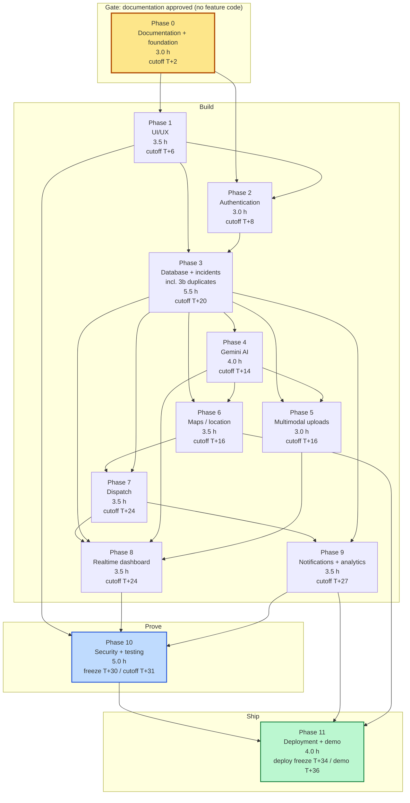

# 30 — Development Phase Plan

**Project:** CareGrid AI
**Document type:** The 36-hour build plan. Twelve phases, a hard gate, per-phase acceptance criteria, a traceability proof, and a cut list for every phase
**Status:** Baseline v1.0 — normative for phase order, phase ownership, and the exit criteria
**Related documents:** [01 PRD §6, §7, §13](./01_PRODUCT_REQUIREMENTS_DOCUMENT.md) · [02 TRD §11](./02_TECHNICAL_REQUIREMENTS_DOCUMENT.md) · [05 Frontend Architecture](./05_FRONTEND_ARCHITECTURE.md) · [06 Backend Architecture](./06_BACKEND_ARCHITECTURE.md) · [07 Database Schema](./07_DATABASE_SCHEMA.md) · [08 API Specification](./08_API_SPECIFICATION.md) · [09 AI Specification](./09_AI_GEMINI_SPECIFICATION.md) · [18 Testing & QA Plan §4, §11, §16, §17](./18_TESTING_QA_PLAN.md) · [19 Deployment & DevOps](./19_DEPLOYMENT_DEVOPS.md) · [20 Project Folder Structure](./20_PROJECT_FOLDER_STRUCTURE.md) · [21 Environment Variables](./21_ENVIRONMENT_VARIABLES.md) · [22 Roles & Permissions](./22_USER_ROLES_PERMISSIONS.md) · [25 Accessibility](./25_ACCESSIBILITY_RESPONSIVENESS.md) · [26 Performance Requirements](./26_PERFORMANCE_REQUIREMENTS.md) · [27 Hackathon MVP Scope](./27_HACKATHON_MVP_SCOPE.md) · [29 Demo Scenario](./29_DEMO_SCENARIO.md)

> **Anchor rule.** Every file path in this document comes from [20 §2](./20_PROJECT_FOLDER_STRUCTURE.md)'s tree. Every FR ID, NFR ID, and test ID comes from [01](./01_PRODUCT_REQUIREMENTS_DOCUMENT.md) and [18](./18_TESTING_QA_PLAN.md). This plan **invents no path, no endpoint, no env var, and no test**. A path that is not in [20](./20_PROJECT_FOLDER_STRUCTURE.md) requires amending that document first.

---

## 0. The gate, stated before anything else

> ### ⛔ CRITICAL SEQUENCING RULE
>
> **Phase 1 coding MUST NOT begin while documentation is being generated.**
>
> Not in parallel. Not "just the components". Not "the tokens". **Not one line of feature code.** The repository is empty of `app/`, `features/`, `components/`, `services/`, `lib/`, `hooks/`, `validators/`, or `config/` content until the documentation set is approved.
>
> **Why this is a gate and not a preference:**
>
> 1. **The docs are the specification, and they are not finished.** [07](./07_DATABASE_SCHEMA.md) is normative for every field name. [08](./08_API_SPECIFICATION.md) is normative for every route, its status codes, and its error codes. [21](./21_ENVIRONMENT_VARIABLES.md) is normative for every env var. A developer who starts in Phase 3 before [07 §4](./07_DATABASE_SCHEMA.md) is settled invents a field name, and per [20 §7](./20_PROJECT_FOLDER_STRUCTURE.md) the code is then *wrong* — the document wins. Rewriting 40 FRs' worth of field names at T+14 h is not a typo fix; it is a lost phase.
> 2. **The cost of being wrong is asymmetric.** Reading a document costs ~10 minutes. Discovering a naming disagreement costs ~3 hours of rework and a merge conflict in the worst possible week. The gate is cheap at the front and ruinous at the back.
> 3. **The AI layer is unusable without its specification.** [09 §5.1](./09_AI_GEMINI_SPECIFICATION.md) defines an exact `.strict()` Zod schema and an exact `responseSchema` that is passed to Gemini by *identity*, asserted by a test (TC-AI-001b). A developer who guesses the schema writes a different one, and then the AI phase is a rewrite rather than an implementation.
> 4. **The security boundaries cannot be retrofitted.** [22 §7](./22_USER_ROLES_PERMISSIONS.md)'s rules, [22 §3](./22_USER_ROLES_PERMISSIONS.md)'s 61-row matrix, and [10 §15](./10_AUTHORIZATION_SECURITY.md)'s header table are structural. Adding authorization after the routes exist means auditing every route instead of writing the guards once.
> 5. **The read budget is architectural.** [26 §5.7](./26_PERFORMANCE_REQUIREMENTS.md)'s guard rails (listener caps, query caps, the `deletedAt == null` rule) are decisions, not optimisations. Retrofitting them means finding every query, and the most commonly forgotten rule in this design is the one that leaks soft-deleted incidents.
>
> **The gate's own gate.** The gate lifts when **all** of the following are true:
>
> | # | Condition | Verified by |
> --: | --- | --- |
> G1 | [01](./01_PRODUCT_REQUIREMENTS_DOCUMENT.md), [07](./07_DATABASE_SCHEMA.md), and [08](./08_API_SPECIFICATION.md) have been read in full by **all three** developers | Each developer states the transition table's 11 statuses and the create pipeline's 8 steps from memory. If anyone cannot, the read is not done |
> G2 | Every `DECISION REQUIRED` in the doc set is either resolved or written down with an owner and a deadline | The register at the end of this document is non-empty and every row has a name |
> G3 | The repository exists with `npm ci` green and `npm run typecheck` green on an empty tree | `node --version` ≥ 22.11; a `git rev-parse HEAD` exists |
> G4 | The three Firebase projects exist, the Maps keys are restricted, and the Google Cloud budget alert is armed | [19 §5.2](./19_DEPLOYMENT_DEVOPS.md) step 9 |
> G5 | `firestore.indexes.json` and a deny-by-default `firestore.rules` are committed | The file has the 11 `incidents` composites and ends in `if false` |

### 0.1 What a developer does during Phase 0 — the actual list

Three hours. This is not a break; it is the highest-leverage work in the event.

| # | Task | Hours | Output | Why it matters |
| --: | --- | :-: | --- | --- |
| 0.1 | **Read [01](./01_PRODUCT_REQUIREMENTS_DOCUMENT.md) §6 in full** | 0.5 | The 133 FR rows and their P0/P1 flags in your head | Without the P0/P1 flags you cannot judge what to cut, and cutting is the most common decision in a hackathon |
| 0.2 | **Read [07](./07_DATABASE_SCHEMA.md) in full** | 1.0 | Every collection and field name; the 11×11 transition table; §9.4's duplicate pseudocode | The two highest-risk areas — the transition table and the duplicate algorithm — are pure functions that are trivial to write correctly and easy to write wrongly |
| 0.3 | **Read [08](./08_API_SPECIFICATION.md) §1.6 and §3.1**, skim the rest | 0.5 | The 8-step auth pipeline; the create pipeline's step order | The order is normative: **Zod validation before any DB or AI call** (FR-142). Getting it backwards is a security finding |
| 0.4 | **Read [09](./09_AI_GEMINI_SPECIFICATION.md) §1.2, §5.1, §5.3, §6.4, §7** | 0.5 | The prohibition table; `aiTriageOutputSchema`; rules R1–R10; the human-in-the-loop gate; the fallback guarantee | R1–R10 are **code, not prompt**. A developer who does not know that will put them in the prompt |
| 0.5 | **Read [22](./22_USER_ROLES_PERMISSIONS.md) §2, §3, §5, §6** | 0.5 | The authoritative role source; the matrix; the two-gate model; the six layers | The two hard denials — row 59 (no role may delete an audit log) and row 61 (no one may change their own role) are the two things a reviewer checks first |
| 0.6 | **Read [20](./20_PROJECT_FOLDER_STRUCTURE.md) §2, §3.2, §7** | 0.5 | The tree; the import matrix; the 25 forbidden files | The boundary rules are lint-enforced and they will block your first commit if you do not know them |
| 0.7 | **Read [18](./18_TESTING_QA_PLAN.md) §2.3 (the ten test rules), §17 (`npm run verify`)** | 0.25 | T1–T10; the single gate | T2 (no `it.skip` without a GitHub issue URL) and T3 (no `Date.now()` in an assertion) are the two that will bite |
| 0.8 | **Install the toolchain** | 0.25 | `node --version` ≥ 22.11, npm ≥ 10.9, Java 11+ for the emulators, `firebase-tools`, Vercel CLI | The Java requirement is the one that is discovered at the worst moment |
| 0.9 | **Create the repository skeleton** from [20 §2](./20_PROJECT_FOLDER_STRUCTURE.md) — every directory, empty; plus `package.json`, `tsconfig.json`, `eslint.config.mjs`, `.prettierrc.json`, `vitest.config.ts`, `playwright.config.ts`, `.nvmrc`, `.editorconfig`, `.gitignore`, `.env.example`, `components.json` | 0.5 | `npm ci` green; `npm run typecheck` green on an empty tree | `tsconfig.json` with `strict: true` and `noUncheckedIndexedAccess` decided **now**; [18 D-18-4](./18_TESTING_QA_PLAN.md) records that deciding it after 200 optional props exist is expensive |
| 0.10 | **Create the three Firebase projects**, enable Email/Password + Google, generate the service accounts, create Storage buckets, restrict both Maps keys, **arm the Google Cloud budget alert** | 0.5 | Three projects; two restricted keys; one budget alert | Per [19 §5.2](./19_DEPLOYMENT_DEVOPS.md). The budget alert is the one item that can cost real money, and it must exist before the first deploy, not before the demo |
| 0.11 | **Write `firestore.rules` v1 and `firestore.indexes.json`** from [22 §7](./22_USER_ROLES_PERMISSIONS.md) and [07 §4](./07_DATABASE_SCHEMA.md) §4 | 0.5 | Both files committed; `npm run test:rules` has a skeleton to grow into | The 11 composites are specified. Writing them from the table is 30 minutes; deriving them from a `FAILED_PRECONDITION` at runtime is an afternoon |
| 0.12 | **Create the CI skeleton** — `.github/workflows/ci.yml` with the §14 stage list, `CODEOWNERS`, the PR template, branch protection on `main` and `develop` | 0.5 | A required-status-check list that actually runs | Branch protection configured **after** the first merge is branch protection that already failed once |
| 0.13 | **Hold the 15-minute gate review** — §0's five conditions, out loud | 0.25 | A recorded decision to lift or hold the gate | The gate is lifted **deliberately**, in a conversation, not by the clock reaching T+2 |

> **What a developer must NOT do in Phase 0:** create a component, write a Zod schema, start a route handler, scaffold a feature folder, or "just get the tokens in". Every one of those is feature code, and every one of them encodes an assumption that a later document will contradict.

---

## 1. Plan arithmetic

```
Team                             3 developers
Event window                     36 h elapsed
Less sleep + setup               −4 h per person  ⇒  32 productive hours each
Gross person-hours               3 × 32           =  96
Less coordination and review     −8 h  (≈ 2.7 h/person)
Usable person-hours                                =  88
Ideal → actual multiplier        × 1.7   (integration, debugging, review, rework)
                                                 ⇒  ≈ 51.8 ideal hours of capacity

Plan consumption (this document)                   =  48.5 ideal hours
Surplus                                           ≈   3.3 ideal hours
```

**The surplus is one nice-to-have and a contingency.** It is *not* the 19.25 hours of nice-to-haves in [27 §2](./27_HACKATHON_MVP_SCOPE.md), and the 17-row cut ladder in [27 §4.2](./27_HACKATHON_MVP_SCOPE.md) exists because a plan that assumes the whole menu fits has already failed. **Track the multiplier live:** if the observed ideal→actual ratio at T+12 h is above 1.9, the plan is behind, and the G1 cut gate at T+30 will be aggressive rather than considered.

The hour-by-hour allocation and the Gantt-style schedule are in **[27 §5.3](./27_HACKATHON_MVP_SCOPE.md)**. This document defines *what* each phase contains; that one defines *when*.

---

## 2. Phase overview

| Phase | Name | Ideal h | Wall-clock window | Hard cutoff | Owns (FR count) |
| --: | --- | --: | --- | --- | --: |
| **0** | Documentation + foundation | 3.0 | T+0 → T+2 | **T+2** | 0 (NFR enablers) |
| **1** | UI/UX | 3.5 | T+2 → T+6 | T+6 | 1 |
| **2** | Authentication | 3.0 | T+4 → T+8 | **T+8** | 7 |
| **3** | Database + incidents | 5.5 | T+6 → T+20 | T+20 | 40 |
| **4** | Gemini AI | 4.0 | T+9 → T+14 | T+14 | 10 |
| **5** | Multimodal uploads | 3.0 | T+12 → T+16 | T+16 | 5 |
| **6** | Maps / location | 3.5 | T+6 → T+16 | T+16 | 16 |
| **7** | Dispatch | 3.5 | T+14 → T+24 | T+24 | 11 |
| **8** | Realtime dashboard | 3.5 | T+18 → T+24 | T+24 | 14 |
| **9** | Notifications + analytics | 3.5 | T+22 → T+27 | T+27 | 16 |
| **10** | Security + testing | 5.0 | T+27 → T+31 | T+31 (freeze **T+30**) | 12 |
| **11** | Deployment + hackathon demo | 4.0 | T+31 → T+36 | **T+34** (deploy freeze), demo T+36 | 1 |
| | **Total** | **48.5** | | | **133** ✓ |

---

## 3. Phase 0 — Documentation + foundation

### 3.1 Objective

**Approve the specification, install the toolchain, and create the repository skeleton — with zero feature code.**

### 3.2 Tasks

| # | Task | h | Files | FR/NFR |
| --: | --- | :-: | --- | --- |
| 0.1 | Read [01](./01_PRODUCT_REQUIREMENTS_DOCUMENT.md) §6; list every P0/P1 flag from memory | 0.5 | — | all |
| 0.2 | Read [07](./07_DATABASE_SCHEMA.md) in full; recite the 11×11 transition table and §9.4 | 1.0 | — | FR-050…FR-058, FR-040…FR-049 |
| 0.3 | Read [08](./08_API_SPECIFICATION.md) §1.6, §1.8, §1.9, §3.1 | 0.5 | — | FR-142, FR-140, FR-141 |
| 0.4 | Read [09](./09_AI_GEMINI_SPECIFICATION.md) §1.2, §5.1, §5.3, §6.4, §7 | 0.5 | — | FR-020…FR-029 |
| 0.5 | Read [22](./22_USER_ROLES_PERMISSIONS.md) §2, §3, §5, §6 | 0.5 | — | NFR-015, NFR-027 |
| 0.6 | Read [20](./20_PROJECT_FOLDER_STRUCTURE.md) §2, §3.2, §6, §7 | 0.5 | — | NFR-024, NFR-025 |
| 0.7 | Read [18](./18_TESTING_QA_PLAN.md) §2.3, §17 | 0.25 | — | — |
| 0.8 | Install and verify the toolchain | 0.25 | `.nvmrc` | NFR-022 |
| 0.9 | `npm init`, install every dependency at the majors in [02 §2](./02_TECHNICAL_REQUIREMENTS_DOCUMENT.md), `npm ci` green | 0.5 | `package.json`, `package-lock.json` | — |
| 0.10 | `tsconfig.json` with `strict`, `noUncheckedIndexedAccess`, `verbatimModuleSyntax`, `paths: { "@/*": ["./*"] }`; `eslint.config.mjs` with the §3.3 boundary rules; `.prettierrc.json` + `.prettierignore` | 0.5 | `tsconfig.json`, `eslint.config.mjs`, `.prettierrc.json`, `.prettierignore` | NFR-022, NFR-023, NFR-024 |
| 0.11 | Every directory from [20 §2](./20_PROJECT_FOLDER_STRUCTURE.md), empty | 0.25 | the whole tree | — |
| 0.12 | `.env.example` transcribed from [21 §3](./21_ENVIRONMENT_VARIABLES.md) with placeholders only; `.env.local` filled with the dev values | 0.25 | `.env.example`, `.env.local` | NFR-013 |
| 0.13 | `lib/env.ts` (the [21 §7](./21_ENVIRONMENT_VARIABLES.md) boot-validation schema) and `lib/env.client.ts` | 0.5 | `lib/env.ts`, `lib/env.client.ts` | FR-144 |
| 0.14 | Create the three Firebase projects; enable Email/Password + Google; create Storage buckets; create + restrict both Maps keys; **arm the Google Cloud budget alert** | 0.5 | — | NFR-026 |
| 0.15 | `firestore.rules` v1 from [22 §7](./22_USER_ROLES_PERMISSIONS.md) | 0.5 | `firestore.rules` | NFR-014 |
| 0.16 | `storage.rules` from [22 §7.1](./22_USER_ROLES_PERMISSIONS.md) | 0.25 | `storage.rules` | NFR-014 |
| 0.17 | `firestore.indexes.json` — the 11 `incidents` composites + the collection composites ([19 §7.4](./19_DEPLOYMENT_DEVOPS.md)) | 0.5 | `firestore.indexes.json` | FR-037 |
| 0.18 | `firebase.json` with the emulator block from [18 §7.1](./18_TESTING_QA_PLAN.md) and `.firebaserc` with `dev`/`staging`/`prod` | 0.25 | `firebase.json`, `.firebaserc` | — |
| 0.19 | `vitest.config.ts` (unit + integration projects), `playwright.config.ts`, `lighthouserc.json` | 0.5 | `vitest.config.ts`, `playwright.config.ts`, `lighthouserc.json` | NFR-017, NFR-001 |
| 0.20 | `next.config.ts`, `app/layout.tsx`, `app/styles/globals.css` (tokens only), `middleware.ts` (headers only) | 0.5 | `next.config.ts`, `app/layout.tsx`, `app/styles/globals.css`, `middleware.ts` | NFR-019 |
| 0.21 | `vercel.json` from [19 §9](./19_DEPLOYMENT_DEVOPS.md) — crons + headers + region | 0.25 | `vercel.json` | — |
| 0.22 | CI skeleton: `.github/workflows/ci.yml`, `CODEOWNERS`, `pull_request_template.md`, branch protection on `main` and `develop` | 0.5 | `.github/**` | NFR-023 |
| 0.23 | `.husky/pre-commit` — the secret-pattern scan from [21 §6](./21_ENVIRONMENT_VARIABLES.md) | 0.25 | `.husky/pre-commit` | NFR-013 |
| 0.24 | **Gate review** — §0's five conditions, out loud, recorded | 0.25 | — | — |

**Total: 12.0 ideal hours of effort across 3 people = 4.0 h wall-clock, compressed to 2 h by parallel reading and by tasks 0.14–0.23 being one person's afternoon.** The 3.0 h in the overview is the *critical-path* figure after overlap.

### 3.3 Files involved

**Create (all):** the complete [20 §2](./20_PROJECT_FOLDER_STRUCTURE.md) directory tree, empty · `package.json` · `package-lock.json` · `tsconfig.json` · `next.config.ts` · `eslint.config.mjs` · `.prettierrc.json` · `.prettierignore` · `vitest.config.ts` · `playwright.config.ts` · `lighthouserc.json` · `firebase.json` · `.firebaserc` · `firestore.rules` · `firestore.indexes.json` · `storage.rules` · `vercel.json` · `middleware.ts` · `.env.example` · `.nvmrc` · `.editorconfig` · `.gitignore` · `components.json` · `.github/workflows/ci.yml` · `.github/CODEOWNERS` · `.github/pull_request_template.md` · `.husky/pre-commit` · `lib/env.ts` · `lib/env.client.ts` · `app/layout.tsx` · `app/styles/globals.css`

**Modify:** none.

### 3.4 Dependencies

| Kind | Item | Needed by |
| --- | --- | --- |
| External account | GitHub org/repo with write access | T+1 h |
| External account | Google account able to own the Firebase projects | T+1 h |
| External account | Google Cloud project with **billing enabled** for Maps | T+1 h |
| External account | Vercel account | T+2 h |
| External key | `GEMINI_API_KEY` from AI Studio (free tier) | **Phase 4** (T+9 h) — **not** needed in Phase 0 |
| Document | All 12 anchor documents, read in full by all three developers | **the gate** |
| Decision | `tsconfig` `exactOptionalPropertyTypes` — decide now ([18 D-18-4](./18_TESTING_QA_PLAN.md)) | T+1 h |

### 3.5 Acceptance criteria

- [ ] Every document in §0 has been read in full by all three developers
- [ ] All three can recite the 11 incident statuses and the 8 steps of `POST /api/incidents` from memory
- [ ] All three can state the two hard denials (matrix rows 59 and 61) without looking
- [ ] `node --version` ≥ 22.11.0; `npm --version` ≥ 10.9; Java present
- [ ] `npm ci` is green from a clean checkout
- [ ] `npm run typecheck` is green on the empty tree
- [ ] `npm run lint` is green and **rejects** a violation of each boundary rule (test it by writing one deliberately, in a scratch branch)
- [ ] Three Firebase projects exist; Email/Password and Google sign-in are enabled; Storage buckets exist
- [ ] Both Maps keys have **application restrictions** set (referrer for the browser key, IP for the server key)
- [ ] The Google Cloud budget alert is armed
- [ ] `firestore.rules` ends in `match /{document=**} { allow read, write: if false; }` and contains no `if true` catch-all (TC-RULES-028)
- [ ] `firestore.indexes.json` contains the 11 `incidents` composites, including index #6 with `geoCells` (CONTAINS) **first**
- [ ] `vercel.json` has the crons entry and every header from [19 §9](./19_DEPLOYMENT_DEVOPS.md)
- [ ] CI runs all 14 required checks on a pull request
- [ ] Branch protection is on for `main` and `develop`, with the 14 required checks
- [ ] `lib/env.ts` **throws** at import when a required var is missing, naming the variable and never its value
- [ ] `lib/env.ts` **throws** when `NODE_ENV === 'production'` and `ALLOW_SEED === 'true'`
- [ ] `.env.local` is git-ignored (`git check-ignore -v .env.local` prints a rule)
- [ ] `npm run emulators` starts Auth 9099 / Firestore 8080 / Storage 9199
- [ ] `git rev-parse HEAD` returns a commit, and `main` is protected

### 3.6 Testing

| Class | What must pass | Command |
| --- | --- | --- |
| Static | `npm run typecheck`, `npm run lint`, `npm run format:check` | as written |
| Emulator | The emulator suite starts and the harness connects | `npm run test:rules` with a single smoke assertion |
| Negative lint | Each boundary rule **fires** | deliberate violations on a scratch branch |
| Security | `gitleaks detect --no-git` is clean; the client-bundle secret scan passes on an empty build | `npm run check:secrets` |
| Manual | `lib/env.ts` throws with a **named** variable and no value in the message | delete one var, import the module |

### 3.7 Deliverables

A repository with a green toolchain, a deployed-to-dev rules file, the index set, a CI pipeline with 14 required checks, three provisioned Firebase projects, two restricted Maps keys, an armed budget alert, and — the actual deliverable — **three developers who have read the specification**. If a judge asks "how did you avoid building the wrong thing", this phase is the answer.

### 3.8 Risks

| Risk | Mitigation | Early-warning signal |
| --- | --- | --- |
| The team reads only the PRD and starts coding at T+40 min | The gate is a spoken review, and §0.1's "recite from memory" is the test | Someone asks "what should this field be called?" during Phase 1 |
| A Firebase project or the billing account is not created in time | Task 0.14 is on the critical path from hour 1; the Maps fallback exists if billing is blocked | No budget alert at T+1 h |
| `tsconfig` decisions are deferred and become expensive | Task 0.10 settles `strict` + `noUncheckedIndexedAccess` + `exactOptionalPropertyTypes` | A pull request adding an optional prop without a decision |
| A dependency install fails on Node 22.11 | Verify `node --version` **before** installing | Install error mentioning `require(esm)` |

### 3.9 Cut list (if the gate slips past T+2)

| Cut | Saves | Consequence |
| --- | --: | --- |
| `playwright.config.ts` + `lighthouserc.json` | 0.25 h | Moved to Phase 10. E2E and Lighthouse are Phase-10 gates, not Phase-0 ones |
| `.husky/pre-commit` | 0.25 h | CI's `gitleaks` stage still catches the same patterns; the local hook is convenience |
| `storage.rules` | 0.25 h | **Do not** cut. Storage rules gate every upload in Phase 5 |
| CODEOWNERS | 0.25 h | With one team, the second-pair-of-eyes routing is advisory anyway |
| `next.config.ts` beyond `poweredByHeader: false` | 0.25 h | `optimizePackageImports` is a bundle optimisation for Phase 10 |

> **Never cut:** `tsconfig.json` strictness, `eslint.config.mjs` boundary rules, `firestore.rules`, `firestore.indexes.json`, the Google Cloud budget alert, or the gate review itself. All six are the difference between a rebuild and a rewrite.

---

## 4. Phase 1 — UI/UX

### 4.1 Objective

**Build the design system, the app shell, and the domain badge/table primitives that every later phase renders into, with accessibility and responsiveness enforced from the first component.**

### 4.2 Tasks

| # | Task | h | Files | FR/NFR |
| --: | --- | :-: | --- | --- |
| 1.1 | Configure `components.json` (`style: "new-york"`, `baseColor: "neutral"`) and bring in the shadcn primitives actually used: button, input, textarea, select, checkbox, switch, label, card, badge, alert, dialog, sheet, tabs, table, pagination, tooltip, progress, skeleton, separator, scroll-area, popover, dropdown-menu, sonner | 1.0 | `components.json`, `components/ui/**` | NFR-024 |
| 1.2 | The token set: `@theme` in `globals.css` — surface, text, border, and the four urgency colours + three severity tones, all contrast-verified against [04 §2](./04_UI_UX_DESIGN_SPECIFICATION.md) | 0.5 | `app/styles/globals.css` | NFR-017 |
| 1.3 | `cn()` helper | 0.25 | `lib/cn.ts` | — |
| 1.4 | The domain badges: `UrgencyBadge`, `StatusBadge`, `ConfidenceBadge`, `RoleBadge`, `LocationBadge`, `SlaMeter`, `Timestamp`, `RelativeTime`, `SafetyFlagChips` — each with visible text **and** a non-empty `aria-label`; **no status by colour alone** | 1.0 | `components/domain/**` | **FR-072**, NFR-017 |
| 1.5 | The queue table primitives: `queue-table.tsx`, `queue-table-view.tsx`, `queue-card-list.tsx`, `history-table.tsx`, `audit-table.tsx`, `users-table.tsx` — `<caption>`, `scope` on every header, one `aria-sort`, `aria-selected` on the selected row | 0.5 | `components/table/**` | FR-072, NFR-018 |
| 1.6 | The feedback states: `EmptyState`, `ErrorState`, `ForbiddenState`, `NotFoundState`, `LiveRegion`, `PendingBadge`, `RequestId`, `RetryAction` | 0.5 | `components/feedback/**` | NFR-012 |
| 1.7 | The app chrome: `app-shell.tsx`, `sidebar.tsx`, `sidebar-nav.tsx`, `top-bar.tsx`, `bottom-nav.tsx`, `mobile-nav-sheet.tsx`, `page-header.tsx`, `breadcrumbs.tsx`, `toaster.tsx`, `live-indicator.tsx`, `connectivity-banner.tsx`, `skip-link.tsx`, `providers/app-providers.tsx` | 0.75 | `components/layout/**` | NFR-019 |
| 1.8 | The three route-group layouts: `(public)`, `(auth)`, `(app)`, `(ops)` — with the `(ops)` layout rendering `ForbiddenState` on a role failure, never a redirect | 0.5 | `app/(public)/layout.tsx`, `app/(auth)/layout.tsx`, `app/(app)/layout.tsx`, `app/(ops)/layout.tsx` | NFR-018 |
| 1.9 | The static tables: `config/categories.ts`, `config/statuses.ts`, `config/urgencies.ts`, `config/safety-flags.ts`, `config/nav.ts`, `config/roles.ts`, `config/limits.ts`, `config/timeouts.ts`, `config/resources.ts` | 0.5 | `config/**` | FR-025, FR-026 |
| 1.10 | The formatters: `lib/format/{relative-time,distance,duration,bytes,percent}.ts` — `APP_TIMEZONE`-aware, `date-fns` **subpath imports only** | 0.5 | `lib/format/**` | FR-146 |
| 1.11 | Reduced-motion block in `globals.css`; the live-row highlight respects it | 0.25 | `app/styles/globals.css` | NFR-019 |
| 1.12 | The 400-line ESLint rule and the `date-fns` root-import rule | 0.25 | `eslint.config.mjs` | NFR-024 |

### 4.3 Files involved

**Create:** `components/ui/**` (via the shadcn CLI) · `components/domain/**` · `components/table/**` · `components/feedback/**` · `components/layout/**` · `config/**` · `lib/format/**` · `lib/cn.ts` · the four group layouts
**Modify:** `app/styles/globals.css` · `eslint.config.mjs`

### 4.4 Dependencies

| Kind | Item | From |
| --- | --- | --- |
| Phase | Phase 0 complete (the gate) | Phase 0 |
| Design | The [04](./04_UI_UX_DESIGN_SPECIFICATION.md) palette, spacing, and per-route `document.title` table | Phase 0 read |
| Decision | The two documented stubs stay stubs: `components/domain/command-palette.tsx` and `components/table/virtualized-table.tsx` return `null` and are excluded from the route tree ([20 S1](./20_PROJECT_FOLDER_STRUCTURE.md)) | — |

### 4.5 Acceptance criteria

- [ ] Every component in `components/ui/**` is shadcn-generated and diffable against upstream (no hand-edits beyond props)
- [ ] The only public entry point to `components/ui` is its `index.ts`
- [ ] `UrgencyBadge`, `StatusBadge`, `ConfidenceBadge` each have visible text **and** a non-empty `aria-label`; no status is conveyed by colour alone
- [ ] The queue table has a `<caption>`, `scope` on every header, exactly one `aria-sort`, and `aria-selected` on the selected row
- [ ] Every disabled primary action has an `aria-describedby`-linked reason in the accessibility tree
- [ ] Exactly one `<main>` and one `<h1>` per route; `document.title` matches the [25 §4.2](./25_ACCESSIBILITY_RESPONSIVENESS.md) table
- [ ] `SkipLink` is the first focusable element in the document
- [ ] `prefers-reduced-motion: reduce` yields no animation over 80 ms
- [ ] `scoreboard: no gradient-to-*`, no hex literal in `className`, no inline colour style, no literal `aria-label` (the four [20 §3.3](./20_PROJECT_FOLDER_STRUCTURE.md) block-5 rules) — enforced by lint and green
- [ ] No file in `components/**` exceeds 400 lines
- [ ] `config/categories.ts` has exactly 11 values; `config/statuses.ts` exactly 11 with a terminal flag; `config/urgencies.ts` exactly 4 with SLA minutes `{critical: 5, high: 15, medium: 60, low: 240}`
- [ ] `date-fns` is imported by subpath only, everywhere
- [ ] The `(ops)` layout renders `ForbiddenState` with the server code on a role failure — it does **not** redirect

### 4.6 Testing

| Class | What must pass | Test IDs |
| --- | --- | --- |
| Component | Badge rendering with visible text + `aria-label`; the four urgency tones and the four status shapes | TC-ACC-013 |
| Component | Table semantics | TC-ACC-014 |
| Component | Disabled-with-reason | TC-ACC-015 |
| Component | No literal `aria-label` in any component (static scan) | TC-ACC-017 |
| Component | Reduced motion | TC-ACC-018, TC-ACC-033 |
| Static | The four design-system lint rules fire | NFR-024 |
| Static | `date-fns` root import is rejected | O-24 |
| Manual | Keyboard-only traversal of the shell; the focus ring is visible at 1440 and at 360 | M1, M2, M3 |
| Manual | Windows High Contrast / forced colours | M6 |
| Manual | Greyscale + protanopia + deuteranopia on the badges | M16 |

### 4.7 Deliverables

A shell that three later phases can drop real features into without a redesign, a badge and table vocabulary, and a contrast-verified token set. On stage it is invisible, and that is correct — but it is the reason the queue is readable from 2 m on a projector.

### 4.8 Risks

| Risk | Mitigation | Early-warning signal |
| --- | --- | --- |
| A shadcn component is hand-edited and upstream fixes become unmergeable | Edit only props; keep the upstream body diffable; a lint note in the file header | A `components/ui/**` diff longer than ~20 lines |
| The token set is revised in Phase 4 because urgency colours need to change | Urgency colours are the one thing that cannot be revisited late. Settle them **now** from [04](./04_UI_UX_DESIGN_SPECIFICATION.md) and never touch them again | Someone proposes a sixth urgency colour |
| The 400-line rule is hit by a badge file | Split by concern, not by line count, and never by creating `helpers.ts` ([20 §7 #2](./20_PROJECT_FOLDER_STRUCTURE.md)) | Any file approaching 350 lines |
| The shell is built for 1440 and the citizen flow is 360 | Build `bottom-nav.tsx` and `mobile-nav-sheet.tsx` in this phase, not later | A horizontal scrollbar on any shell route at 360 |

### 4.9 Cut list

| Cut | Saves | Consequence |
| --- | --: | --- |
| `components/table/history-table.tsx`, `audit-table.tsx`, `users-table.tsx` — one generic `DataTable` instead | 0.25 h | The admin audit log renders in a plainer table. FR-134 still works |
| `breadcrumbs.tsx` | 0.25 h | Deep routes lose a breadcrumb. No FR requires it |
| `scroll-area.tsx`, `command.tsx`, `slider.tsx` from the shadcn set | 0.25 h | Bring them in on demand |
| `mobile-nav-sheet.tsx` as a shadcn `Sheet` rather than a bespoke sheet | 0.25 h | Cosmetic |
| **Never cut** | | `UrgencyBadge`/`StatusBadge`/`ConfidenceBadge`, the a11y attributes, the tokens, the lint rules |

---

## 5. Phase 2 — Authentication

### 5.1 Objective

**Make role authoritative on the server, enforced on the client, and auditable — so that every later phase can assume a known authorization model exists.**

### 5.2 Tasks

| # | Task | h | Files | FR/NFR |
| --: | --- | :-: | --- | --- |
| 2.1 | `lib/firebase/client.ts` — `initializeApp`/`getAuth`/`getFirestore`/`getStorage`, once, from `lib/env.client.ts` | 0.25 | `lib/firebase/client.ts` | — |
| 2.2 | `lib/server/firebase-admin.ts` — the single Admin SDK bootstrap, lazy and memoised per instance | 0.25 | `lib/server/firebase-admin.ts` | NFR-015 |
| 2.3 | `lib/server/auth-guard.ts` — `requireUser()`, `assertRole()`, `assertResourceAccess()` implementing [08 §1.6](./08_API_SPECIFICATION.md)'s 8 steps: header → `verifyIdToken` → `users/{uid}` exists and is `active` → role from Firestore, claim cross-checked, mismatch ⇒ `403 ROLE_MISMATCH` + audit | 0.75 | `lib/server/auth-guard.ts` | **FR-001**, NFR-015 |
| 2.4 | `lib/server/require-session.ts`, `lib/server/require-role.ts` — the server-component variants | 0.25 | `lib/server/require-session.ts`, `lib/server/require-role.ts` | NFR-015 |
| 2.5 | `lib/server/audit.ts` — `auditLog()` callable **inside** a transaction | 0.25 | `lib/server/audit.ts` | FR-130 |
| 2.6 | `lib/server/{request-id,logging,csrf,errors}.ts` and `lib/api/{envelope,errors,schemas}` | 0.5 | `lib/server/*`, `lib/api/*` | FR-140, FR-141 |
| 2.7 | `validators/enums.ts` — the 11 statuses, 4 urgencies, 11 categories, 13 safety flags, 6 resolution codes, 12 notification types, 4 roles, 4 `slaState`s | 0.5 | `validators/enums.ts` | FR-025, FR-026, FR-101 |
| 2.8 | `validators/me.ts`, `validators/admin.ts` | 0.25 | `validators/me.ts`, `validators/admin.ts` | — |
| 2.9 | `services/auth/{bootstrap-user,update-me,claims,auth-event}.ts` | 0.5 | `services/auth/**` | FR-001, FR-135 |
| 2.10 | `app/api/me/route.ts` (GET + PATCH), `app/api/me/bootstrap/route.ts`, `app/api/auth/event/route.ts` | 0.5 | `app/api/me/**`, `app/api/auth/event/route.ts` | FR-001, FR-132, FR-135 |
| 2.11 | `app/api/admin/users/route.ts`, `app/api/admin/users/[id]/role/route.ts`, `status/route.ts`, `reset-claims/route.ts` — `admin` only, reason required, self-change forbidden, `roleChangePending` marker + `202` on claim failure | 0.75 | `app/api/admin/users/**` | **FR-130, FR-132, FR-133**, FR-135 |
| 2.12 | `app/api/admin/audit-logs/route.ts` — filtered, cursor-paginated, `format=csv` | 0.5 | `app/api/admin/audit-logs/route.ts` | FR-134 |
| 2.13 | `features/auth/**` — login, signup, forgot-password, session provider, permissions hook, the two-step role-change dialog | 1.0 | `features/auth/**` | FR-133 |
| 2.14 | `hooks/useAuth.ts` | 0.25 | `hooks/useAuth.ts` | — |
| 2.15 | `app/(public)/login/page.tsx`, `signup/page.tsx`, `forgot-password/page.tsx` | 0.5 | `app/(public)/**` | FR-001 |
| 2.16 | `app/forbidden/page.tsx` and the `ForbiddenState` wiring | 0.25 | `app/forbidden/page.tsx` | NFR-018 |
| 2.17 | `firestore.rules` for `users`, `profiles`; the rules tests for rows 1–3, 59, 61 | 0.5 | `firestore.rules`, `tests/integration/firestore-rules.test.ts` | NFR-014, NFR-027 |

### 5.3 Files involved

**Create:** `lib/firebase/client.ts` · `lib/server/firebase-admin.ts` · `lib/server/auth-guard.ts` · `lib/server/require-session.ts` · `lib/server/require-role.ts` · `lib/server/audit.ts` · `lib/server/request-id.ts` · `lib/server/logging.ts` · `lib/server/csrf.ts` · `lib/server/errors.ts` · `lib/api/envelope.ts` · `lib/api/errors.ts` · `lib/api/schemas.ts` · `lib/api/client.ts` · `validators/enums.ts` · `validators/me.ts` · `validators/admin.ts` · `services/auth/**` · `app/api/me/**` · `app/api/auth/event/route.ts` · `app/api/admin/users/**` · `app/api/admin/audit-logs/route.ts` · `features/auth/**` · `hooks/useAuth.ts` · `app/(public)/login/page.tsx` · `app/(public)/signup/page.tsx` · `app/(public)/forgot-password/page.tsx` · `app/forbidden/page.tsx` · `tests/integration/firestore-rules.test.ts`
**Modify:** `firestore.rules` · `components/layout/**` (the session consumption) · `eslint.config.mjs`

### 5.4 Dependencies

| Kind | Item | Needed by |
| --- | --- | --- |
| Phase | Phase 1 (the shell renders the session) | T+4 h |
| External | Firebase project with Auth enabled and the Google OAuth client configured | T+3 h |
| External | `FIREBASE_PRIVATE_KEY` in `.env.local` | T+3 h |
| Decision | `SESSION_SECRET` is **intentionally undefined** — no server sessions ([21 §9](./21_ENVIRONMENT_VARIABLES.md)) | — |

### 5.5 Acceptance criteria

- [ ] A new signup creates `users/{uid}` with `role: "citizen"`, `status: "active"`, `schemaVersion: 1`, and a `profiles/{uid}` doc, via `POST /api/me/bootstrap`
- [ ] `POST /api/me/bootstrap` is idempotent: a second call returns `200` with `isNew: false` and does **not** overwrite
- [ ] `GET /api/me` returns a **server-computed** `permissions[]`; the UI renders affordances from it and the API re-checks every action regardless
- [ ] A role is resolved from `users/{uid}.role` on **every** protected request — never from the token
- [ ] A token whose claim disagrees with the Firestore role gets `403 ROLE_MISMATCH` **and** an `auditLogs` row
- [ ] A `role` in a request body, query, or header has **no effect** (the "anti-bribe" test)
- [ ] A suspended user gets `403 ACCOUNT_UNAVAILABLE` on every route except `POST /api/me/bootstrap` and `GET /api/me`
- [ ] A role change requires a reason ≥ 10 chars and a two-step UI confirmation naming the user; an admin targeting themselves gets `400 SELF_ROLE_CHANGE_FORBIDDEN`; granting the same role gets `409 ALREADY_ROLE`
- [ ] A claim-write failure sets `users/{uid}.roleChangePending = true`, returns `202 { claimsSynchronised: false }`, and logs an alert — never an empty `catch`
- [ ] **No role, including `admin`, can update or delete an `auditLogs` document** (matrix row 59, TC-RULES-013)
- [ ] No role can write `users/{uid}` through the client SDK (TC-RULES-002)
- [ ] A non-existence read returns a **byte-identical** `404` body to a missing resource, with `requestId` masked
- [ ] Every response carries `meta.requestId` **and** an `X-Request-Id` header; a hostile inbound `x-request-id` is not honoured
- [ ] `/login`, `/signup`, and `/track` create **zero** Firestore listeners and **zero** reads on first paint
- [ ] A citizen deep-linking to `/dashboard` gets `ForbiddenState` with the server code — no redirect loop, no data fetched
- [ ] The `usage` screen-reader check passes for the login form's `autocomplete` tokens

### 5.6 Testing

| Class | What must pass | Test IDs |
| --- | --- | --- |
| Unit | The role tuple; the `ROLE_MISMATCH` path; claim-staleness handling | TC-FR-061, TC-SEC-015 |
| Rules | 6 `users` assertions + 5 `profiles` + **4 `auditLogs` immutability** + 2 deny-by-default + 2 missing-claim | TC-RULES-002…004, 012, 013, 022, 023 |
| Integration | `POST /api/me/bootstrap` (1 happy + 3 failure), `GET /api/me` (2), `PATCH /api/me` (3), `POST /api/auth/event` (2), `PATCH /api/admin/users/:id/role` (4), `GET /api/admin/audit-logs` (3) | TC-INT-010…013, 060, 063 |
| Integration | The 8 shared pipeline assertions, including **Zod before DB** with Firestore stubbed to throw | TC-INT-120…130, TC-FR-142 |
| Security | The 9 required negative tests from [18 §7.3](./18_TESTING_QA_PLAN.md) — rows 59 and 61, the citizen's audit denial, the claim drift, the suspension | TC-RULES-013, TC-INT-060, TC-SEC-013…015 |
| E2E | `auth.spec.ts` (signup, login, reset, logout, session expiry) and `rbac.spec.ts` | [18 §11.2](./18_TESTING_QA_PLAN.md), [18 §11.3](./18_TESTING_QA_PLAN.md) |
| E2E | Zero listeners and zero reads on `/login`, `/signup`, `/track` | TC-RT-006 |
| Manual | Keyboard-only sign-in; focus visible; no trap | M1 |

### 5.7 Deliverables

A working sign-in for all four roles; a server-authoritative authorization model every later phase builds on; an append-only audit log with a filterable admin view; and a two-step role change that requires a reason. On stage this is beat 0's credibility and Q5/P5's evidence.

### 5.8 Risks

| Risk | Mitigation | Early-warning signal |
| --- | --- | --- |
| A developer caches the role in `localStorage` for convenience | [20 §7 #21](./20_PROJECT_FOLDER_STRUCTURE.md) forbids it; `getIdToken(true)` after a role change; a lint rule | A `localStorage['role']` grep hit |
| The claim and the Firestore role drift and nobody notices in the demo | Drift is a `403` + an audit row, so it is *loud*; rehearse the drift case | A `ROLE_MISMATCH` in the rehearsal log |
| `POST /api/me/bootstrap` races and creates two user docs | Idempotent by `uid`; a Firestore `create` on a fixed path is atomic | Two `users/{uid}` docs, impossible — but a duplicate *seed* is possible |
| Google sign-in's popup is blocked | `Cross-Origin-Opener-Policy: same-origin-allow-popups` is **required** for `signInWithPopup` and must not be tightened | Console error on the demo laptop, found at Phase 11 not Phase 2 |

### 5.9 Cut list

| Cut | Saves | Consequence |
| --- | --: | --- |
| `POST /api/auth/event` (the login/logout/failure audit endpoint) | 0.25 h | `auth.login_failed` rate limiting (FR-135) is unverifiable. Prefer to cut something else first |
| `app/forbidden/page.tsx` as a route; render `ForbiddenState` in place everywhere | 0.25 h | [20 S3](./20_PROJECT_FOLDER_STRUCTURE.md) records this as an acceptable alternative |
| Google sign-in (Email/Password only) | 0.5 h | **Significant loss.** FR-004's `provider` field still works; but Google sign-in is a credibility beat. Cut only if Phase 2 is at real risk |
| The CSV format on `/api/admin/audit-logs` | 0.25 h | FR-134's export half becomes Q&A-only |
| `reset-claims` | 0.25 h | A claim failure is then fixed by a redeploy, not a button. Documented |
| **Never cut** | | `auth-guard.ts`'s 8 steps, the role-from-Firestore rule, the `403 ROLE_MISMATCH` drift path, the audit-immutability rules test, `SELF_ROLE_CHANGE_FORBIDDEN` |

---

> ## ⚠ PHASE-NUMBERING NOTICE (added after the build, 2026-09-26)
>
> The build called "Phase 3" the **backend foundation** — the request pipeline, the service
> layer, centralized validation/authorization/rate limiting, the Firebase server architecture, the
> environment-variable system, and the Gemini/Maps/Twilio connection points. **The Phase 3 in
> this document is a different phase**: the incident create pipeline, the lifecycle table, and
> the duplicate engine.
>
> **The brief is the authority on sequencing; this document is the authority on identifiers.**
> So the sequence is renumbered rather than argued with, and the two are kept distinguishable:
>
> | Name | What it is | Where it is recorded |
> | --- | --- | --- |
> | **Phase 3 (built)** | The backend foundation. **Implemented and verified** | [30.4](./30.4_PHASE_3_FOUNDATION.md) |
> | **§6 Phase 3 (not built)** | Database + incidents + duplicates. **Not started** | this section, unchanged |
>
> The Phase 4 brief ("Gemini AI Multimodal Emergency Triage") depends on §6 Phase 3's
> `CreateIncidentInput` and the create pipeline, so **§6 Phase 3 must be built before or
> alongside the Gemini work** — its `services/ai/*` is explicitly "Phase 4 adds triage into step
> 5", and step 5 does not exist yet.
>
> Every file path §6 lists is still correct. Nothing §6 specifies was built, and nothing this
> foundation built is a substitute for it. [34](./34_BACKEND_INTEGRATION_POINTS.md) §4 states
> exactly which files §6 will create and which of them already exist.

## 6. Phase 3 — Database + incidents (including 3b: duplicates)

### 6.1 Objective

**Make the incident the atom of the system: a validated create pipeline, a server-enforced state machine with an append-only timeline, cursor-paginated role-scoped history, and a pure duplicate engine that finds real duplicates in one read.**

### 6.2 Tasks

| # | Task | h | Files | FR/NFR |
| --: | --- | :-: | --- | --- |
| 3.1 | `validators/incident.ts` (the create schema), `validators/incident-query.ts`, `validators/search-params.ts` | 0.5 | `validators/incident.ts`, `validators/incident-query.ts`, `validators/search-params.ts` | FR-002, FR-003, FR-009, FR-142 |
| 3.2 | `lib/incidents/reference.ts` — `CG-` + 6 Crockford base32 chars, uniqueness retry inside the transaction | 0.25 | `lib/incidents/reference.ts` | FR-010 |
| 3.3 | `lib/incidents/lifecycle.ts` — the 11×11 transition table from [07 §4.3](./07_DATABASE_SCHEMA.md), as pure functions, with `allowedNext` derived by role | 0.5 | `lib/incidents/lifecycle.ts` | **FR-051**, FR-055, FR-056 |
| 3.4 | `lib/incidents/sla.ts` — `slaState` from `slaTargetMin` + `verifiedAt ?? createdAt`, with the 80 % `at_risk` boundary | 0.25 | `lib/incidents/sla.ts` | FR-057 |
| 3.5 | `lib/incidents/allowed-next.ts` — the single primary action for the responder view | 0.25 | `lib/incidents/allowed-next.ts` | FR-050 |
| 3.6 | `lib/geo/{haversine,geohash,geo-cells,accuracy-grade,nearest}.ts` — pure, no Firebase import | 0.5 | `lib/geo/**` | FR-032, FR-036, FR-040 |
| 3.7 | `services/incidents/create-incident.ts` — the 8-step pipeline in [08 §3.1](./08_API_SPECIFICATION.md): `requireUser` → Zod → media verify → duplicate search → AI triage → one `runTransaction` → fire-and-forget notifications → audit | 1.0 | `services/incidents/create-incident.ts` | FR-001…FR-011, FR-020, FR-040 |
| 3.8 | `services/incidents/{get-incident,list-incidents,update-incident,change-status,delete-incident,restore-incident,export-incidents}.ts` | 1.0 | `services/incidents/**` | FR-073, FR-118, FR-120…FR-124 |
| 3.9 | `lib/server/{serialize,rate-limit}.ts` — Timestamp/GeoPoint → JSON with field-level redaction; the Firestore token bucket | 0.5 | `lib/server/serialize.ts`, `lib/server/rate-limit.ts` | FR-015, FR-143, NFR-027 |
| 3.10 | `app/api/incidents/route.ts` (GET + POST), `[id]/route.ts` (GET + PATCH + DELETE), `[id]/status/route.ts`, `[id]/reports/route.ts`, `[id]/restore/route.ts`, `[id]/export/route.ts` | 1.0 | `app/api/incidents/**` | FR-002, FR-003, FR-010, FR-011, FR-014, FR-017, FR-019, FR-054, FR-119, FR-120…FR-124, FR-140…FR-143 |
| 3.11 | `features/reporting/**` — the form, the character counter, submit-disabled-with-reason, the local draft, the success screen, the reference copy button | 1.0 | `features/reporting/**` | FR-002, FR-003, FR-010, FR-011, FR-014, FR-017 |
| 3.12 | `features/track/**` — reference lookup, the status summary, the "what happens next" explainer, the neutral not-found copy | 0.5 | `features/track/**` | FR-011, FR-145 |
| 3.13 | `features/incidents/**` — the timeline, the history list with cursor pagination, the detail shell, the soft-delete/restore surface | 0.75 | `features/incidents/**` | FR-120…FR-124, FR-052 |
| 3.14 | `features/incident-archive/**` — the privileged `includeDeleted` view | 0.25 | `features/incident-archive/**` | FR-123 |
| 3.15 | **3b — `lib/duplicates/score.ts`** — `classifyDuplicate` + `jaccard` + `normTokens` + the breakdown, pure, no `firebase-admin` import | 0.5 | `lib/duplicates/score.ts` | **FR-043, FR-044, FR-048, FR-049** |
| 3.16 | `services/duplicates/find-candidates.ts` — **exactly one** `array-contains` read, `limit(50)`, `orderBy createdAt desc` | 0.25 | `services/duplicates/find-candidates.ts` | FR-040, FR-041, FR-037 |
| 3.17 | `services/duplicates/{merge,dismiss,undo-merge}.ts` — the merge transaction, the 24 h undo window, `separate_incident` with a reason | 0.5 | `services/duplicates/**` | FR-045, FR-046, FR-048 |
| 3.18 | `app/api/incidents/[id]/merge/route.ts`, `merge/undo/route.ts`, `duplicates/dismiss/route.ts` | 0.25 | `app/api/incidents/[id]/**` | FR-046, FR-048 |
| 3.19 | The duplicate panel on the incident detail + the citizen's "there may already be a report" notice | 0.25 | `features/incidents/**` | FR-018, FR-045 |

### 6.3 Files involved

**Create:** `validators/incident.ts` · `validators/incident-query.ts` · `validators/search-params.ts` · `lib/incidents/**` · `lib/geo/**` · `lib/duplicates/score.ts` · `lib/server/serialize.ts` · `lib/server/rate-limit.ts` · `services/incidents/**` · `services/duplicates/**` · `app/api/incidents/**` · `features/reporting/**` · `features/track/**` · `features/incidents/**` · `features/incident-archive/**` · `tests/unit/lib/duplicates/score.test.ts` · `tests/unit/lib/incidents/*.test.ts` · `tests/unit/lib/geo/*.test.ts`
**Modify:** `services/ai/*` (Phase 4 adds triage into step 5; Phase 3 stubs it behind the `TriageProvider` interface) · `app/api/incidents/route.ts`

### 6.4 Dependencies

| Kind | Item | Needed by |
| --- | --- | --- |
| Phase | Phase 2 (auth, audit, envelope, request id) | T+6 h |
| External | Composite indexes deployed to `caregrid-ai-dev` | T+6 h |
| External | `GEMINI_API_KEY` — for the create pipeline's step 5. **Without it, the mock `TriageProvider` in tests and the fallback in dev both work; the create pipeline ships and the AI lands in Phase 4** | T+9 h |
| Decision | `DR-06` — the geohash neighbour derivation must be validated against a reference table **before** this phase's exit | T+17 h |

### 6.5 Acceptance criteria

- [ ] `POST /api/incidents` with 19 characters of text and no media returns `422 EMPTY_REPORT` and writes **no** incident and **no** `aiRuns` doc
- [ ] `text` is stored **verbatim** — outer whitespace included, inner double spaces preserved (FR-003)
- [ ] The create pipeline validates with Zod **before any** Firestore, Storage, or AI call (proved by a test that stubs Firestore to throw on any access and still gets a `400`)
- [ ] One `runTransaction` writes `incidents/{id}` + `statusHistory/created` + `reports/{reportId}`; all three exist or none do
- [ ] `reference` matches `^CG-[0-9A-HJKMNP-TV-Z]{6}$` and is unique across 200 sequential creates
- [ ] `Idempotency-Key` is required; a replay returns the original `201` with `Idempotent-Replay: true` and creates nothing
- [ ] The **full 11 × 11 transition table** is asserted, every `✖` cell included, with 100 % branch coverage on `lib/incidents/lifecycle.ts`
- [ ] An illegal transition returns `409 INVALID_STATUS_TRANSITION` with `details[0].value = { from, to, allowed }` — statuses only
- [ ] Every accepted transition appends **exactly one** `statusHistory` document **in the same transaction**, with `actorUid`, `actorRole`, `fromStatus`, `toStatus`, `reason`, `requestId`, `createdAt`
- [ ] A transaction retry produces **one** history document, not two — the body is idempotent
- [ ] `resolved` without a `resolutionCode` returns `422 RESOLUTION_CODE_REQUIRED`; an invalid code returns `400 INVALID_RESOLUTION_CODE`
- [ ] `slaState` boundary: 4 min = `at_risk`, 5 min 1 s = `breached`; `verifiedAt == null` ⇒ the clock starts at `createdAt`; a breach fires **exactly one** notification
- [ ] `allowedNext` in the response equals `assertTransitionAllowed` filtered to the caller's role
- [ ] Cursor pagination: page 1 = 25 rows, `nextCursor` opaque, `limit=101` clamps to 100 with `meta.limitClamped`, a missing cursor doc is `400 INVALID_CURSOR`, a cursor from a different filter set is `400 CURSOR_COMBINATION_INVALID`
- [ ] **Every** list query on `incidents` includes `where('deletedAt','==',null)` and a `limit()` — asserted by instrumenting the SDK over a full suite run, not by reading the source
- [ ] A citizen's list is **forced** to `reporterUid == self` server-side; other filters are ignored, never applied
- [ ] Soft delete sets `deletedAt`/`deletedBy`/`deleteReason`, moves media to `quarantine/`, writes one `incident.delete` audit row, and the row disappears from **every** default query; admin restore clears it and audits `incident.restore`; a citizen passing `includeDeleted=true` gets `403`
|  |  |  |
|  | **3b — duplicate acceptance criteria** |  |
| [ ] `buildGeoCells` returns **exactly 10** unique 6-character strings, the first being the point's own geohash-6, validated against an `ngeohash` reference table |
| [ ] `classifyDuplicate` is **pure** — asserted by a static source scan proving no `firebase-admin` / `firebase/firestore` / `lib/server` import |
| [ ] ≥ 20 unit cases including 0/499/500/501/1000 m, 359/360/361 min, same category + different wording, different category + same spot, identical text 2 km apart, empty text, inverted hemispheres, a pole, identical coordinates |
| [ ] The candidate search performs **exactly one** read with `limit(50)` — a test **fails at 10** (TC-GEO-009b) |
| [ ] The decision is exactly one of `none`/`potential_duplicate`/`confirmed_duplicate`/`separate_incident`, and the stored breakdown carries `distanceM`, `timeDeltaMin`, `categoryMatch`, `categoryGroupMatch`, `textSimilarity`, `matchedKeywords` (≤ 10), `decision`, `reasons`, `algorithmVersion` |
| [ ] `confirmed_duplicate` is a **suggestion**: the incident is always created and the merge is never automatic |
| [ ] A merge requires `dispatcher`/`admin` + a reason 10–280 chars; it sets `mergedIntoId`/`mergedBy`/`mergedAt`/`merged`, appends the report as `kind: 'duplicate_link'`, increments `reportCount`/`linkedReportCount`, unions `safetyFlags`, takes `max(urgency)`, appends history on **both**, and writes exactly one `incident.merge` audit row. **Nothing is hard-deleted** |
| [ ] A merge with an active dispatch is `409 MERGE_BLOCKED_ACTIVE_ASSIGNMENT`; the responder is **not** silently unassigned |
| [ ] A citizen attempting a merge gets `403`; a citizen writing `mergedIntoId` through the client SDK is denied by rules (TC-DUP-007c) |
| [ ] A report with no location skips the search entirely: 0 candidate reads, `duplicateStatus: 'none'`, a reason recorded |

### 6.6 Testing

| Class | What must pass | Test IDs |
| --- | --- | --- |
| Unit | `lib/incidents/lifecycle.ts` — the 121-cell table, 100 %/100 % | TC-LIFE-002 |
| Unit | `lib/duplicates/score.ts` — ≥ 20 boundary cases, 100 %/100 % | TC-DUP-010, TC-DUP-010b |
| Unit | `lib/incidents/sla.ts` — the 80 %/100 % boundaries, `verifiedAt == null` | TC-LIFE-008, TC-LIFE-008b |
| Unit | `lib/geo/**` — haversine within 0.5 m of the reference; accuracy-grade at 50/51/200/201/1000/1001 | TC-GEO-001b, TC-GEO-004 |
| Unit | `lib/incidents/reference.ts` — the Crockford alphabet, the collision retry | TC-FR-010, TC-LIFE-015 |
| Unit | Every numeric bound in [17](./17_VALIDATION_RULES.md) at boundary−1 / boundary / boundary+1 | [18 §7.7](./18_TESTING_QA_PLAN.md) |
| Integration | `POST /api/incidents` — 1 happy + 9 failure paths | TC-INT-020 |
| Integration | `GET /api/incidents` — filters, sort, cursor, the forced citizen filter | TC-UI-001, TC-FR-121, TC-FR-124 |
| Integration | `GET`/`PATCH`/`DELETE /api/incidents/:id` | TC-INT-022, 023, 032, 033, 034 |
| Integration | `PATCH …/status` — the role matrix rows 3, 4, 14–20 | TC-INT-027, TC-LIFE-003…007 |
| Integration | `POST …/merge`, `…/merge/undo`, `…/duplicates/dismiss` | TC-INT-028, 029, 030 |
| Integration | **Transactions** — the create, the reference collision, the retry-idempotency, the soft delete | TC-INT-131…133, 138, 144, 145 |
| Integration | **Pipelines** — Zod-before-DB, auth-before-rate-limit, resource-gate-before-business-logic, audit-inside-the-transaction, notification-after-the-critical-write | TC-INT-124…130 |
| Component | Disabled-with-reason on the report form; the 2000-char no-layout-break case | TC-FR-017, TC-FR-003c |
| E2E | `J1 citizen submits a text report` — the whole flow under 30 s at 360 px | [18 §11.1](./18_TESTING_QA_PLAN.md) |
| E2E | `track.spec.ts` — the owner view, the non-existent reference, another citizen's reference, and the byte-identical bodies | [18 §11.4](./18_TESTING_QA_PLAN.md) |
| E2E | `merge.spec.ts` — link, undo within 24 h, undo after 24 h, dismiss, the citizen's 403 | [18 §11.6](./18_TESTING_QA_PLAN.md) |
| Manual | Script **A** (citizen text report, one-handed, 30 s) and Script **B** (photo report with a bad file — the media half lands in Phase 5) | [18 §18.1](./18_TESTING_QA_PLAN.md) |
| Load | **S-5 duplicate search under load** — 60 submissions from 6 coordinates in one cell; ≤ 51 reads per creation; the 25-candidate cap applies with a live listener | TC-PERF-033 |

### 3.7 Deliverables

A citizen can submit a report and get a reference they can quote and a tracking page they can read. A dispatcher has an incident with a complete, actor-attributed timeline, a live SLA meter, and a role-scoped history. And the duplicate engine finds the real second report in **one** read with a full, auditable breakdown — which is demo beat 5, the turn of the story.

### 3.8 Risks

| Risk | Mitigation | Early-warning signal |
| --- | --- | --- |
| **The geohash neighbour derivation is wrong** (`DR-06`) | `buildGeoCells` is validated against an `ngeohash` reference table in a unit test. If the offsets cannot be made exact, raise the fan-out to precision-5 and **re-verify the read budget** | The reference-table test fails, or a boundary case (499/500/501 m) disagrees with the geohash result |
| A developer writes 10 candidate queries instead of 1 | The normative rule is in [07 §9.2](./07_DATABASE_SCHEMA.md) and **TC-GEO-009b fails at 10** | A 10× read count in the S-5 load run |
| The transition table is implemented from memory rather than from [07 §4.3](./07_DATABASE_SCHEMA.md) | The 121-cell test is written from the table, and a change to the table without a change to the test fails | A `✖` cell in the table that the test allows |
| `deletedAt == null` is forgotten in a query | Instrumented SDK scan over a full suite run (TC-INT-144), plus a lint rule, plus review | Any `list()` on `incidents` without the filter |
| The AI call blocks the create pipeline before Phase 4 | Step 5 is a stub behind `TriageProvider`; the mock provider and the deterministic fallback both work | A create that needs a real Gemini key in a unit test — that is a T6 violation |
| The reference alphabet disagrees between the generator and the assertion | [18 D-18-3](./18_TESTING_QA_PLAN.md) recommends Crockford; adopt it in `lib/incidents/reference.ts` and in the `^CG-[0-9A-HJKMNP-TV-Z]{6}$` assertion **in the same commit** | A test asserting a different alphabet from the generator |

### 3.9 Cut list (in order)

| Cut | Saves | Consequence | Narrative after the cut |
| --- | --: | --- | --- |
| `GET /api/incidents/:id/export` (CSV) | 0.25 h | FR-118 becomes Q&A-only. The *no-PII-in-the-export* argument is still available in words | "The export exists and is tested; it deliberately has no reporter identity in it" |
| `POST /api/incidents/:id/restore` and `features/incident-archive/**` | 0.25 h | FR-123's restore half is unavailable; soft delete still works. Admin can restore via a script | "Soft delete is one-way through the UI in the demo; restore is a documented admin path" |
| The citizen's supplement/correction report (`[id]/reports/route.ts`, P1 FR-012) | 0.25 h | FR-012 unavailable. A P1 | Nothing — it is not a demo beat |
| **3b — `merge/undo` (P1 FR-047)** | 0.25 h | A merge is irreversible for 24 h in practice. **Narrow this first** | "A merge is undoable for 24 hours; that is implemented and tested, and we chose not to spend the last hour on the button" |
| `POST …/duplicates/dismiss` (keep the merge, drop the dismiss) | 0.25 h | FR-048's UI is missing; the classification still returns `separate_incident` automatically for a category mismatch, which is the demo-relevant half | The FR-048 story survives — the demo's four rejected heatwave candidates are `separate_incident` **by rule**, not by dismissal |
| The cursor-pagination token *validation* (`INVALID_CURSOR`, `CURSOR_COMBINATION_INVALID`) | 0.25 h | A stale cursor yields an empty page instead of an error. Keep the cursor, drop the strict errors | Never on stage |
| **Never cut** | | The transition table, `classifyDuplicate`, the **one-query** candidate search, `lib/incidents/reference.ts`, `lib/server/serialize.ts`'s redaction, the `deletedAt == null` rule | These are the correctness spine and 2 of them are demo beats |

---

## 7. Phase 4 — Gemini AI

### 7.1 Objective

**Turn an unstructured, multi-modal, possibly-hostile citizen report into a fixed, validated, audited structure — and guarantee that if any of that fails, the report is still recorded.**

### 7.2 Tasks

| # | Task | h | Files | FR/NFR |
| --: | --- | :-: | --- | --- |
| 4.1 | `services/ai/schema.ts` — `aiTriageOutputSchema` (Zod, `.strict()`) **and** the JSON Schema exported to Gemini, generated from that single definition | 0.5 | `services/ai/schema.ts` | **FR-021** |
| 4.2 | `lib/validation/ai.ts` — re-export so client and server share one definition | 0.15 | `lib/validation/ai.ts` | FR-142 |
| 4.3 | `services/ai/prompts.ts` — the `triage-v3` system prompt, `PROMPT_VERSION`, the three few-shot examples, the user-content template | 0.5 | `services/ai/prompts.ts` | FR-023, FR-025, FR-026 |
| 4.4 | `services/ai/sanitize.ts` — the 9 sanitisation steps: length cap, NFKC + invisible-Unicode strip, control-char strip, `<citizen_report>`/`<untrusted_extract>` wrapping, instruction-marker neutralisation, PII redaction, repeated-token flood guard, injection heuristics → `suspicionScore`, no tools | 0.5 | `services/ai/sanitize.ts` | FR-023, NFR-013 |
| 4.5 | `services/ai/provider.ts` — the `TriageProvider` interface, **exactly one** implementation | 0.25 | `services/ai/provider.ts` | — |
| 4.6 | `services/ai/gemini.ts` — the only file that constructs `GoogleGenAI`; owns the 20 s `AbortSignal.timeout`, 3 retries at 1/2/4 s for **429/503 only**, the RPM/RPD local guard, `responseSchema` by identity, `safetySettings` at `BLOCK_ONLY_HIGH` | 0.5 | `services/ai/gemini.ts` | FR-028, NFR-004 |
| 4.7 | `services/ai/rules.ts` — R1…R10, deterministic, in code | 0.5 | `services/ai/rules.ts` | FR-023…FR-027 |
| 4.8 | `services/ai/fallback.ts` — the offline keyword engine, with the 0.55 confidence ceiling and the exact summary template | 0.5 | `services/ai/fallback.ts` | **FR-029** |
| 4.9 | `services/ai/{triage,explain}.ts` — the orchestrator (build → call → validate → repair once → fallback → normalise → log) and the plain-language explanation builder | 0.5 | `services/ai/triage.ts`, `services/ai/explain.ts` | FR-022, FR-024, FR-028 |
| 4.10 | `lib/ai/{confidence,explain,fallback-summary}.ts` | 0.25 | `lib/ai/**` | FR-024 |
| 4.11 | The AI panel on the incident detail: model, `promptVersion`, confidence, the explanation, the source badge, the "Needs review" state, the "Analysing your report…" progress state on `/report` | 0.5 | `features/incidents/**`, `features/reporting/**` | FR-024, FR-028, FR-075 |
| 4.12 | `tests/helpers/mock-ai.ts` — the mock `TriageProvider` with all six behaviours | 0.25 | `tests/helpers/mock-ai.ts` | — |
| 4.13 | 50 adversarial fixtures + 10 golden files | 0.75 | `tests/fixtures/ai/**` | FR-021…FR-029 |
| 4.14 | The property test: `incidents.geo` is derived from the request, never from model output, over 50 fixtures + 200 seeded fuzz outputs | 0.25 | `tests/unit/ai/no-fabricated-location.test.ts` | FR-023 |
| 4.15 | Wire `services/ai/triage.ts` into `services/incidents/create-incident.ts` step 5 and `logAiRun` into `aiRuns/{runId}` | 0.25 | `services/incidents/create-incident.ts` | FR-020, FR-028 |

### 7.3 Files involved

**Create:** `services/ai/**` (all 9 files) · `lib/validation/ai.ts` · `lib/ai/**` · `tests/helpers/mock-ai.ts` · `tests/fixtures/ai/**` (50 + 10) · `tests/unit/ai/no-fabricated-location.test.ts`
**Modify:** `services/incidents/create-incident.ts` (step 5) · `features/incidents/**` (the AI panel) · `features/reporting/**` (the progress state) · `app/api/incidents/[id]/triage/route.ts` · `.env.local`

### 7.4 Dependencies

| Kind | Item | Needed by |
| --- | --- | --- |
| Phase | Phase 3 (the create pipeline's step 5 slot) | T+9 h |
| External | **`GEMINI_API_KEY`** from AI Studio, free tier. Read the project's quota page and set `GEMINI_RPM_LIMIT`/`GEMINI_RPD_LIMIT` **below** it with ≥ 50 % headroom | T+9 h |
| Document | [09 §5.1](./09_AI_GEMINI_SPECIFICATION.md) §5.1 and §6 must be read **verbatim**. The prompt is a specification, not a starting point | Phase 0 |
| Test rule | T6: no test reaches the internet. The real SDK is never in the PR path | — |

### 7.5 Acceptance criteria

- [ ] `aiTriageOutputSchema` is `.strict()`; an extra key such as `dispatch: true` is a **validation failure**, and no such field exists on the incident
- [ ] The object passed to Gemini as `responseSchema` is `===` the export from `schema.ts` — identity, not a copy
- [ ] `tools` is `undefined`; `responseMimeType` is `application/json`; `temperature 0.1`, `topP 0.8`, `topK 20`, `maxOutputTokens 1024`
- [ ] `safetySettings` is `BLOCK_ONLY_HIGH` for all four categories
- [ ] `AbortSignal.timeout(20_000)` is used, and a fake-timer test proves the abort fires at exactly 20 000 ms
- [ ] Retries: 3, exponential backoff 1/2/4 s, **only** for `429` and `503`; a `400` is not retried
- [ ] A Zod failure triggers **exactly one** repair call at `temperature: 0` whose prompt contains only the Zod issue **paths**, never the prior raw output
- [ ] Two failures ⇒ fallback. **No third call, no escalation to a larger model**
- [ ] `peopleAffected` is `null` unless `people_affected_stated === true`; a stated `0` and a stated `47` both survive
- [ ] `incidents.geo` equals the request location or is `null`; it is **never** derived from model output (the property test over 200 fuzz outputs)
- [ ] `location_hint` is never persisted on the incident and is shown only behind an "approximate:" prefix
- [ ] R1–R3 can **raise** urgency; **R9 means code can never lower it**; the test asserts this both ways
- [ ] A trapped-expression phrase raises urgency and adds `medical_critical`/`injured_trapped`
- [ ] `confidence < 0.6` ⇒ `low_confidence` + `aiNeedsReview` + a visible badge; the 0.60 and 0.80 band boundaries are asserted
- [ ] A `suspicionScore ≥ 3` forces `aiConfidence ≤ 0.4`
- [ ] A diagnosis term not in the input is stripped from the summary, `low_confidence` is added, and `aiRuns` records `hallucinationFiltered: true`
- [ ] An out-of-taxonomy category maps to `other` with the raw word in `categoryRaw`
- [ ] **Fallback confidence never exceeds 0.55**, `peopleAffected` is `null`, `required_resources` is `[]`, `location_hint` is `null` — all four asserted
- [ ] All 7 fallback triggers produce the documented `aiRuns.outcome`; with the fallback reached, `POST /api/incidents` still returns `201` with a **Fallback triage** badge
- [ ] `aiRuns/{runId}` has `model`, `promptVersion`, `latencyMs`, `attempt`, `outcome`, `fallbackUsed`, `rawOutputHash` — and **no** raw model text, **no** prompt text, **no** media bytes
- [ ] With `GEMINI_RPD_LIMIT` consumed, the provider is **not called at all** and `aiRuns.errorCode` is `AI_QUOTA`
- [ ] `PROMPT_VERSION === 'triage-v3'` and the constant matches the version in the prompt text
- [ ] All 50 adversarial fixtures and 10 golden files pass; a static test greps `tests/unit/**` and `tests/integration/**` for `@google/genai` and **fails** if found
- [ ] The fallback's summary matches its template exactly, including the em dash and the trailing period
- [ ] `lib/ai/fallback.ts` imports nothing from `firebase`, `fetch`, `services/`, or `lib/server/` — asserted by a static scan

### 7.6 Testing

| Class | What must pass | Test IDs |
| --- | --- | --- |
| Unit — AI adapter | ~90 tests: schema, rules R1–R10, fallback, sanitize, explain, quota guard, repair, timeout wiring, generation-config identity | TC-AI-001…TC-AI-049, TC-AI-070…TC-AI-078 |
| Unit — adversarial | 50 fixtures, one property each | TC-AI-001…TC-AI-050 |
| Unit — golden | 10 normalised projections | TC-AI-060…TC-AI-069 |
| Unit — **property** | P1–P7 over 50 fixtures + 200 seeded fuzz outputs | TC-AI-080…TC-AI-083, TC-GEO-007c |
| Integration | The create pipeline with a mock provider: success, timeout, 500-after-retries, blocked, guard-tripped, fallback-disabled | TC-FR-020, 028, 029, 029b…029e |
| Component | The AI panel; the confidence bands; the progress state; the "Needs review" badge (icon + text, not colour) | TC-FR-024c, TC-AI-014 |
| Static | The prompt-version constant matches the prompt | TC-AI-033 |
| Static | `tests/**` never imports `@google/genai` | TC-AI-030 |
| Manual | Script **F** rows F2 and F5 — block the Gemini endpoint; the report is saved, badged, and visible | [18 §18.1](./18_TESTING_QA_PLAN.md) |
| Load | **NFR-004** — p95 `latencyMs` ≤ 8 s over ≥ 30 runs, measured from `aiRuns` | TC-PERF-004 |
| Nightly | The 50 fixtures + 10 goldens against the **live** model, `ALLOW_NIGHTLY_AI=1`, non-blocking | [18 §2.2](./18_TESTING_QA_PLAN.md) |

### 7.4 Deliverables

A report becomes structured data with a visible confidence and a visible reason. And the property that makes the demo credible: **the incident's coordinates come from the phone, never from the model.** Plus a fallback that guarantees the report is recorded no matter what Gemini does — which is the safest beat in the entire demo when the quota is low.

### 7.5 Risks

| Risk | Mitigation | Early-warning signal |
| --- | --- | --- |
| **The quota is exhausted mid-demo** | RPM/RPD guard, the 20 s timeout, the fallback, `GEMINI_AUDIO_ENABLED=false` below 50 % headroom, and the §3 pre-flight check. **Never** a paid key | `GET /api/admin/system/health` headroom < 50 % at T−30 min |
| The dev's `GEMINI_RPD_LIMIT` is above the real quota | Read the project's quota page in Phase 0; set the local limits **below** it | A `429` in the rehearsal with headroom supposedly available |
| The prompt drifts from the schema and starts emitting a field the schema forbids | One definition, exported to both places; the identity assertion; the nightly real-model run | A nightly golden-file diff |
| A developer puts the safety rules in the prompt instead of in code | R1–R10 in `rules.ts`, asserted individually; the prompt is versioned separately from the rules | A PR that edits `prompts.ts` to change an urgency |
| A test depends on the real Gemini API (T6 violation) | The mock adapter is mandatory; a static grep for `@google/genai` in `tests/**` fails CI | A flaky test that passes once |
| Latency exceeds 8 s and NFR-004 fails | The degradation ladder: drop audio; then text-only | `aiRuns.latencyMs` p95 > 8 s in the load run |

### 7.6 Cut list

| Cut | Saves | Consequence | Narrative after the cut |
| --- | --: | --- | --- |
| **Audio** in the AI call — `GEMINI_AUDIO_ENABLED=false` | 0 h (config) | FR-006's AI half; the incident still records audio and the fallback still triages it | "Audio increases payload, latency, and quota, and the MIME path is the most fragile thing in the browser matrix. We feature-detect it and we leave the flag off." |
| The `explanation` string on the AI panel | 0.25 h | The panel shows model, version, and confidence but no prose | "The confidence is shown with a band. The plain-language explanation is a roadmap item" |
| Few-shot examples 2 and 3 (keep G1) | 0.25 h | Weaker behaviour on audio-only and injection cases | — |
| The repair attempt (`AI_REPAIR_ATTEMPTS=0`) | 0.25 h | **Not recommended.** One repair recovers real transient schema drift, and the test for "exactly two calls" is a safety assertion | — |
| The nightly real-AI job | 0.25 h | No real-prompt regression detection | "The adversarial corpus runs against a mock in CI and against the live model manually before the demo" |
| **Never cut** | | `aiTriageOutputSchema` strictness, `sanitize.ts`, `rules.ts` R1–R10, `fallback.ts`, the `aiRuns` write, the property test | These are FR-021, FR-023, FR-024, FR-027, FR-029 |

---

## 8. Phase 5 — Multimodal uploads

### 8.1 Objective

**Let a citizen attach up to three photos or one audio clip, with the bytes never transiting the application function and the file's real type verified server-side.**

### 8.2 Tasks

| # | Task | h | Files | FR/NFR |
| --: | --- | :-: | --- | --- |
| 5.1 | `validators/upload.ts` — the sign request and the media item schemas, with the allow-lists and the path pattern | 0.25 | `validators/upload.ts` | FR-005, FR-007, FR-008 |
| 5.2 | `services/uploads/sign-upload.ts` — a V4 signed **write** URL scoped to one object, `PUT` only, `staging/{uid}/{mediaId}.{ext}`, `UPLOAD_SIGNED_URL_TTL_SEC` | 0.4 | `services/uploads/sign-upload.ts` | FR-007 |
| 5.3 | `services/uploads/finalize-upload.ts` — read the first 4 KiB, sniff the real type, compare with the declared type, measure the actual size, detect a polyglot | 0.4 | `services/uploads/finalize-upload.ts` | **FR-008** |
| 5.4 | `services/uploads/signed-url.ts` — 15-minute read URLs, only for `scanStatus == 'clean'` media the caller may see | 0.3 | `services/uploads/signed-url.ts` | FR-007 |
| 5.5 | `services/uploads/staging-sweeper.ts` — delete `staging/` objects older than `STAGING_UPLOAD_SWEEP_MIN` not referenced by any report | 0.25 | `services/uploads/staging-sweeper.ts` | — |
| 5.6 | The staging→final **move** in the create pipeline (Admin SDK `copy` + `delete`) and the `MediaRef` write | 0.4 | `services/incidents/create-incident.ts` | FR-005, FR-007 |
| 5.7 | `app/api/uploads/{sign,finalize}/route.ts`, `app/api/uploads/[mediaId]/url/route.ts` | 0.4 | `app/api/uploads/**` | FR-005…FR-008 |
| 5.8 | `features/reporting/media/**` — the file input with `capture`, client-side type/size validation, per-file progress, per-file retry that does not clear the others, the inline chip-level rejection, client-side downscale via `createImageBitmap` | 0.8 | `features/reporting/**` | FR-005, FR-007, FR-008, FR-017 |
| 5.9 | The `useMediaRecorder` hook (in `features/reporting`, **not** `hooks/` — [20 §2](./20_PROJECT_FOLDER_STRUCTURE.md) marks this) with the 120 s auto-stop, the ≥ 56 px button, and the feature-detect hide | 0.4 | `features/reporting/hooks/useMediaRecorder.ts` | FR-006 |
| 5.10 | `components/domain/evidence-grid.tsx` and the evidence panel on the incident detail, with `loading="lazy"` and explicit `width`/`height` | 0.25 | `components/domain/evidence-grid.tsx` | FR-075 |
| 5.11 | Storage rules + CORS for the bucket; the `storage.rules` test | 0.4 | `storage.rules`, `tests/integration/storage-rules.test.ts` | NFR-014 |

### 8.3 Files involved

**Create:** `validators/upload.ts` · `services/uploads/**` · `app/api/uploads/**` · `features/reporting/media/**` · `features/reporting/hooks/useMediaRecorder.ts` · `components/domain/evidence-grid.tsx` · `tests/integration/storage-rules.test.ts`
**Modify:** `services/incidents/create-incident.ts` (media verify step 3, the move in step 6) · `storage.rules` · `features/reporting/**`

### 8.4 Dependencies

| Kind | Item | Needed by |
| --- | --- | --- |
| Phase | Phase 3 (the create pipeline) | T+12 h |
| External | Storage bucket created with the three prefixes `staging/`, `incidents/`, `quarantine/` | T+12 h |
| External | Bucket CORS allowing `PUT` from `NEXT_PUBLIC_APP_URL` | T+13 h |
| Decision | [02 §6.2](./02_TECHNICAL_REQUIREMENTS_DOCUMENT.md): **no `sharp`**. Client-side downscale only, and `width`/`height` on `MediaRef` are client-reported and labelled as such | Phase 0 |

### 8.5 Acceptance criteria

- [ ] Up to 3 images and 1 audio clip; a 4th image, a 2nd clip, or a 4th total item is rejected
- [ ] Image ≤ 5 242 880 bytes, audio ≤ 15 728 640; one byte over is `413 UPLOAD_TOO_LARGE` and **nothing** is written
- [ ] `image/svg+xml` is rejected at sign time with `415` — no SVG, ever
- [ ] The sign response contains **no** service-account credential, only a scoped short-lived `PUT` URL
- [ ] A 3-image submission's `POST /api/incidents` body is **under 100 KB** — the bytes never transit the function
- [ ] A `.png` containing JPEG bytes gets `415 UPLOAD_SIGNATURE_MISMATCH`; the stored `contentType` is the **sniffed** type
- [ ] Bytes beginning `MZ` are `422 UPLOAD_QUARANTINED`, the object moves under `quarantine/`, and it is never attached
- [ ] A declared size differing by > 1 % from the actual is `409 UPLOAD_INCOMPLETE`; 0.9 % passes
- [ ] A zero-byte upload is `409 UPLOAD_INCOMPLETE` and the object is swept
- [ ] A `storagePath` belonging to another uid is `403 UPLOAD_FORBIDDEN_PATH`; a path containing `..`, `/./`, `%2e`, `//`, or a null byte is rejected **before** Storage is touched
- [ ] A 31-minute-old unclaimed staging object is `422 UPLOAD_NOT_FOUND` and the sweep removes it
- [ ] The submit button is disabled while any upload is in flight; one file's failure does not clear the others or the text
- [ ] A read URL for `scanStatus: 'pending'` media is `422 MEDIA_NOT_VERIFIED`
- [ ] **There is no public media URL anywhere.** Every read is a fresh 15-minute signed URL issued after an authorization check
- [ ] Storage rules: staging write by the owner with an allowed content type ✔; over 15 MB ✖; a non-allowed type ✖; another user's staging read ✖; `incidents/{id}/...` client read **✖**; `quarantine/...` read/write/delete ✖; an unknown path ✖
- [ ] A responder's evidence payload contains media but **no** `reporterUid`, `displayName`, `email`, `locationText`, or non-original `reports[].text`

### 8.6 Testing

| Class | What must pass | Test IDs |
| --- | --- | --- |
| Unit | Every media bound at 3/4, 1/2, 5 242 880/881, 15 728 640/641, duration 120/121, `durationSec` on an image | TC-FR-005, 005b…005e, TC-FR-006, 006b…006d |
| Integration | `POST /api/uploads/sign` — happy + 4 failure paths; the TTL is 900 s ahead; **no** credential in the body | TC-FR-007, TC-INT-053 |
| Integration | `POST /api/uploads/finalize` — the signature mismatch, the quarantine, the incomplete upload | TC-FR-008, TC-INT-054 |
| Integration | `GET /api/uploads/:mediaId/url` — happy + 4 failure paths | TC-INT-055 |
| Integration | The real signed `PUT` against the Storage emulator | TC-FR-007b |
| Rules | 8 Storage assertions | TC-RULES-024 |
| Component | The chip-level rejection preserves the other files and the text; the per-file retry; the 56 px record button | TC-FR-002c, TC-INT-077, TC-ACC-022 |
| E2E | `J2 citizen submits a photo report` — including the mislabelled file | [18 §11.1](./18_TESTING_QA_PLAN.md) |
| Load | **S-10 Storage throughput** — 20 concurrent 4.9 MB images and 14 MB audio; **no** API request exceeds 4.5 MB | TC-PERF-038 |
| Manual | Script **B** end to end; the 6 MB photo rejected client-side with no upload attempted | [18 §18.1](./18_TESTING_QA_PLAN.md) |
| Manual | Real `MediaRecorder` capture on a physical device (the headless browser produces synthetic audio) | [18 §20](./18_TESTING_QA_PLAN.md) |

### 8.7 Deliverables

A citizen can photograph an accident and the evidence is stored, verified, moved to its permanent path, and visible to a dispatcher through a short-lived signed URL — and **no byte of it ever passed through the application function**, which is why the 4.5 MB serverless body limit is irrelevant to us. Plus a polyglot file gets rejected, which is a better demo beat than a successful upload.

### 8.8 Risks

| Risk | Mitigation | Early-warning signal |
| --- | --- | --- |
| CORS on the signed `PUT` fails and looks like a rules failure | The bucket CORS allows `PUT` from `NEXT_PUBLIC_APP_URL`; the `Content-Type` must equal `requiredContentType` exactly. **A CORS failure is not a rules failure** — the object may already be written | A console CORS error with no `permission-denied` |
| The client downscale is skipped and a 12 MP phone photo exceeds the budget | `createImageBitmap` downscale above a threshold, feature-detected; the original uploads if the API is absent | An `UPLOAD_TOO_LARGE` on the demo phone |
| `MediaRecorder` MIME differs by browser (`audio/webm` vs `audio/ogg`) | The allow-list maps what it can; the audio option **hides** when unsupported (feature-detect, not UA-sniff) | A missing audio option on the demo laptop — fine, that is the designed hide |
| The staging→final move leaves orphans | `sweep-staging-uploads` + `GET /api/admin/system/health` reporting staging objects older than 30 min | A non-zero staging count on the health page |
| A polyglot file is carved rather than rejected | The rule is **reject**; TC-FR-008b asserts the quarantine | A carve-out appearing in a PR |

### 8.9 Cut list

| Cut | Saves | Consequence | Narrative after the cut |
| --- | --: | --- | --- |
| **Voice / `MediaRecorder` entirely** (P1 FR-006) | 0.4 h | The voice option is gone. `ENABLE_VOICE_REPORTING=false` | [27 §4.2](./27_HACKATHON_MVP_SCOPE.md) cut 13's words. This is the **first** thing to cut in this phase |
| Client-side downscale | 0.25 h | Big photos are rejected by size instead of being downscaled. UX loss, no correctness loss | "We resize on the client because we deliberately do not run `sharp` on the server" |
| `POST /api/uploads/finalize` (the early magic-byte check) | 0.25 h | Verification happens only at incident creation, so a bad file fails later with a per-item `details` entry. FR-008 still holds | "The type is verified when the incident is created; the early check is a UX nicety we dropped" |
| `components/domain/evidence-grid.tsx` polish (lazy loading, explicit dimensions) | 0.15 h | CLS risk on the detail page. Keep the attributes, cut the polish | — |
| **Never cut** | | The signed-URL flow, `finalize-upload.ts`'s magic-byte sniff, the quarantine, `UPLOAD_FORBIDDEN_PATH`, the Storage rules | These are FR-007, FR-008, NFR-014, and the "bytes never transit the function" claim |

---

## 9. Phase 6 — Maps / location

### 9.1 Objective

**Make location trustworthy, visible, and degradable: an explicit geolocation request, a graded accuracy, three fallbacks when GPS fails, server-side reverse geocoding that never leaks a street address to the model, and a lazily-loaded map with a first-class list fallback.**

### 9.2 Tasks

| # | Task | h | Files | FR/NFR |
| --: | --- | :-: | --- | --- |
| 6.1 | `hooks/useGeolocation.ts` — **explicit user action only**, no prompt on page load, accuracy grading, the three-option fallback on denial | 0.4 | `hooks/useGeolocation.ts` | **FR-030**, FR-033 |
| 6.2 | `lib/geo/accuracy-grade.ts` + the boundary tests at 50/51/200/201/1000/1001 | 0.2 | `lib/geo/accuracy-grade.ts` | FR-032 |
| 6.3 | `services/geo/*` — the server-side reverse geocode with an 8 s `AbortSignal.timeout`, `locality`/`sublocality`/`administrative_area_level_2` only, street components discarded before the AI sees anything | 0.4 | `services/geo/**` | FR-035, NFR-013 |
| 6.4 | `validators/` — the location bounds: `lat ±90`, `lng ±180`, `accuracyM [0,1000]` for an incident and `[0,5000]` for a heartbeat, `source` ↔ coordinates consistency | 0.25 | `validators/incident.ts` | FR-031, FR-032 |
| 6.5 | `features/location/**` — the accuracy badge, the pin drop, the address input, the "LOCATION UNKNOWN" treatment | 0.5 | `features/location/**` | FR-033, FR-034 |
| 6.6 | Location handling in the create pipeline: `source = none` ⇒ `geo: null` and `geoCells` **absent**; a 900 km outlier is **flagged, never rejected** | 0.3 | `services/incidents/create-incident.ts` | FR-034, FR-038 |
| 6.7 | Location edit + duplicate re-run: `PATCH /api/incidents/:id` recomputes `geoCells`, `accuracyGrade`, and re-runs duplicate detection, returning the new `duplicateStatus` in `meta.duplicate` | 0.3 | `services/incidents/update-incident.ts` | FR-039 |
| 6.8 | `components/map/map-adapter.ts` — **the interface the tests implement** | 0.25 | `components/map/map-adapter.ts` | FR-085 |
| 6.9 | `components/map/{live-map,map-panel,map-marker,map-marker-cluster,marker-legend,map-detail-panel,map-layer-control,duplicate-radius-ring,accuracy-radius,unknown-location-marker}.tsx` | 0.7 | `components/map/**` | FR-080, FR-081, FR-083, FR-084 |
| 6.10 | `components/map/map-list-fallback.tsx` — expanded, keyboard-operable, with coordinates and a **Retry map** action, and the reason announced to assistive technology | 0.3 | `components/map/map-list-fallback.tsx` | **FR-085** |
| 6.11 | `app/map/page.tsx` with `map-panel.tsx`'s `dynamic(() => import('./live-map'), { ssr: false })` and a skeleton frame | 0.3 | `app/map/page.tsx`, `components/map/map-panel.tsx` | **FR-086** |
| 6.12 | `features/map/**` — the viewport hook with a ≥ 400 ms debounce, cell dedupe, the 150-document total cap, the 25 km span cap, and "skip a cell a listener already covers" | 0.4 | `features/map/**` | FR-037, FR-087 |
| 6.13 | `hooks/useDebounce.ts`, Places Autocomplete wired at ≥ 300 ms | 0.2 | `hooks/useDebounce.ts` | FR-087 |
| 6.14 | `config/maps/{caregrid-dark-style,caregrid-light-style}.json`, `app/styles/maps.css` | 0.15 | `config/maps/**`, `app/styles/maps.css` | — |
| 6.15 | `tests/helpers/mock-maps.ts` — the map double, with a `load-failure` behaviour | 0.25 | `tests/helpers/mock-maps.ts` | — |

### 9.3 Files involved

**Create:** `hooks/useGeolocation.ts` · `services/geo/**` · `features/location/**` · `components/map/**` · `app/map/page.tsx` · `features/map/**` · `hooks/useDebounce.ts` · `config/maps/*.json` · `app/styles/maps.css` · `tests/helpers/mock-maps.ts` · `tests/helpers/mock-geolocation.ts`
**Modify:** `services/incidents/create-incident.ts` · `services/incidents/update-incident.ts` · `validators/incident.ts` · `features/reporting/**` · `scripts/check-bundle.ts`

### 9.4 Dependencies

| Kind | Item | Needed by |
| --- | --- | --- |
| Phase | Phase 3 (`geoCells`, `haversineM`) and Phase 4 (the coarse-area label the model receives) | T+6 h |
| External | `NEXT_PUBLIC_GOOGLE_MAPS_API_KEY` with an HTTP-referrer restriction, and `GOOGLE_MAPS_SERVER_KEY` with an IP restriction | T+6 h |
| External | The deployed host added to the referrer list and to Firebase Auth's authorised domains | T+16 h |
| Decision | **`DR-02`** — the Firestore region must be confirmed against the Vercel region before this phase, or every geocode is a cross-region round trip | T+6 h |

### 9.5 Acceptance criteria

- [ ] **`navigator.geolocation.getCurrentPosition` has not been called 5 s after `/report` mounts** — no permission prompt (TC-GEO-001)
- [ ] One call after **Use my current location**; a polite announcement; the accuracy badge shows the graded band
- [ ] Grading: ≤ 50 m `high`, ≤ 200 m `medium`, ≤ 1000 m `low`, else `unknown`; incident `accuracyM > 1000` is `too_big`; heartbeat ≤ 5000
- [ ] `source` ↔ coordinates consistency is enforced: `none` with coordinates is `must_be_null`; `gps`/`address_text` without coordinates is `required_for_source`; `address_text` without `location.text` is rejected
- [ ] `lat 90.1` / `lng 180.1` ⇒ `LOCATION_OUT_OF_RANGE`; `lat -90` / `lng -180` pass
- [ ] Denied permission offers **exactly three** options — drop a pin, type an address, continue without location — non-blocking
- [ ] With no location, `geo === null`, `accuracyGrade === 'unknown'`, `source === 'none'`, and **`geoCells` is absent** — not an empty array
- [ ] `LOCATION UNKNOWN` renders in the queue, the detail header, **and** on the map, and sorts above `low`-accuracy rows
- [ ] A 900 km outlier is **flagged, never rejected** — the incident is created with `unclear_location` and a dispatcher note
- [ ] A reverse geocode stores `placeName` and leaves the reporter's `locationText` `null`; a Geocoding 5xx is a log line and `placeName: null`, and the incident is still created
- [ ] The Gemini request body contains a **district label only** — asserted by a test that the street-level `placeName` is absent
- [ ] The map renders markers coloured by **urgency** and **shaped by status**, with a legend and a text label; colour is never the only channel
- [ ] Responder markers: `available` green, `busy` amber, `offline` hidden with a toggle
- [ ] Marker selection opens a side panel with the summary and **Open incident**; the route does not change
- [ ] A 500 m ring is drawn around the selected incident, read from `config.duplicate` so an admin change is reflected
- [ ] With the Maps script failing, `MapListFallback` renders expanded, fully operable, with coordinates and **Retry map**
- [ ] `scripts/check-bundle` proves **no** `@vis.gl` or `maps.googleapis.com` reference in the `/dashboard` chunk; the `/map` lazy chunk is ≤ 180 KB gzip
- [ ] A viewport request performs **≤ 9** `array-contains` reads, **≤ 150** documents, a ≤ 25 km span, and has a `limit()`
- [ ] Geocoding search is debounced ≥ 300 ms — 4 characters typed in 400 ms produces **one** call
- [ ] A citizen reading `GET /api/incidents?center=…&radiusM=500` sees only their own incidents
- [ ] `respondERs/{uid}`'s `homeBaseGeoCells` uses the same 10-cell scheme

### 9.6 Testing

| Class | What must pass | Test IDs |
| --- | --- | --- |
| Unit | Every accuracy and coordinate bound at boundary−1 / boundary / boundary+1 | TC-GEO-004, 012…018 |
| Unit | `buildGeoCells` — 10 unique 6-char strings against an `ngeohash` reference table | TC-GEO-008 |
| Unit | `geoCells` in a request body is `unrecognized_keys` — **server-computed only** | TC-GEO-008b |
| Component | No prompt on page load; one call on the button; the three-option fallback; the accuracy badge; "approximate location" | TC-GEO-001…007, 018, 019, 021…028 |
| Component | `LOCATION UNKNOWN` in all three surfaces; the sort above `low` | TC-GEO-006, 006b |
| Component | The marker styling through the `map-adapter` double; the cluster threshold is `> 20`; the side panel; the radius ring; the debounce | TC-UI-020…024, 026b, 027 |
| Component | The map load-failure fallback | TC-UI-025 |
| Integration | The reverse-geocode success and failure; the coarse-area-only AI request | TC-GEO-007, 007b, 007c |
| Integration | The viewport query count; the **one-read** duplicate search | TC-GEO-009, 009b |
| Integration | A location edit recomputes cells, grade, and the duplicate result | TC-GEO-011, 011b |
| Integration | A responder in-radius read is `404` with no `reporterUid`, no `reporter`, no `locationText` | TC-GEO-010, 010b |
| Rules | A citizen reading `responderLocations` is denied; a responder reading another's is denied; an unconstrained citizen `list` of `incidents` is denied | TC-GEO-010, TC-UI-028b, TC-RULES-009, 004 |
| E2E | The responsive matrix at 5 viewports; `/map` at 360 px is 60 dvh with a **Show list** toggle | TC-ACC-020, 025, 026 |
| Manual | **M12** — the map list fallback with `maps.googleapis.com` blocked | [25 §11.2](./25_ACCESSIBILITY_RESPONSIVENESS.md) |
| Manual | A real 360 × 800 phone; the accuracy badge against a real GPS fix | M10, M11 |
| Load | S-2's map viewport component; the debounce effect on reads | [26 §5.4](./26_PERFORMANCE_REQUIREMENTS.md) |

### 9.7 Deliverables

A citizen's location is captured deliberately, graded honestly, and degradable three ways. A dispatcher sees where everything is, with a shape and a colour and a legend, and — when the map will not load — sees the same information as a working list. And the model never sees a street address.

### 9.8 Risks

| Risk | Mitigation | Early-warning signal |
| --- | --- | --- |
| **`RefererNotAllowedMapError` on the demo host** | Add the host to the key's referrer list **and** to Firebase Auth's authorised domains as part of the first deploy, not the demo | The console error on the deployed preview |
| A geohash fan-out sneaks in and costs 9 reads per viewport query | M-1/M-2 in [26 §5.4](./26_PERFORMANCE_REQUIREMENTS.md): dedupe cells, cap the total at 150, skip cells a listener covers, debounce at ≥ 400 ms | The viewport read count in the S-2 run |
| The map lands in the `/dashboard` bundle | `map-panel.tsx`'s `dynamic(..., { ssr: false })` plus `scripts/check-bundle` failing the build | A bundle-budget CI failure |
| **The map is the only real cost risk in the project** | Both keys restricted, the budget alert armed, and every map surface has a tested fallback | A charge on the Google Cloud billing page |
| `neighbour(centre)` is unavailable in `ngeohash` 0.6, so the offsets are wrong | The reference-table unit test. If it cannot be made exact, raise the fan-out to precision-5 and **re-verify the read budget** | The reference-table test failing |
| The region mismatch adds a round trip to every geocode | **`DR-02`** resolved in Phase 0 | Measured geocode p95 > 800 ms |

### 9.9 Cut list

| Cut | Saves | Consequence | Narrative after the cut |
| --- | --: | --- | --- |
| **The live map entirely** (`components/map/*` minus the fallback, `app/map/page.tsx`, `features/map/hooks`) | 0.7 h | FR-080…FR-088 unavailable. **This is [27 cut 16](./27_HACKATHON_MVP_SCOPE.md) and the narrative gets *stronger*** | "Our map is lazily loaded, it is not in the dashboard bundle, and every map surface has a list fallback. Here is the fallback." Beat 6 is delivered from the incident detail with coordinates |
| Marker clustering (`map-marker-cluster.tsx`, the `clusters` flag) | 0.25 h | FR-082 (P1). ~9 markers is below the threshold anyway | — |
| The 500 m duplicate-radius ring | 0.15 h | FR-084 (P1). The **numbers** in the duplicate panel carry the same point | "140 metres, 3 minutes, 0.73 similarity" |
| The `unknown-location-marker.tsx` special case, using the standard marker with a text label instead | 0.15 h | FR-034's visual treatment is weaker. The **sort order** and the queue flag stay | — |
| The dark/light map style JSON (use `roadmap`) | 0.1 h | A lighter map. The dark style is an operational preference, not a requirement | — |
| **Never cut** | | The accuracy grading, the three-option fallback, the no-prompt-on-load rule, `LOCATION UNKNOWN` in the queue, the coarse-area-only AI request, the viewport caps | These are FR-030…FR-036, and beats 1, 3, and 4 depend on them |

---

## 10. Phase 7 — Dispatch

### 10.1 Objective

**Turn a verified incident into a single, accountable assignment: a verified responder directory, a ranked candidate list, and a transaction that can never produce two active dispatches.**

### 10.2 Tasks

| # | Task | h | Files | FR/NFR |
| --: | --- | :-: | --- | --- |
| 7.1 | `validators/responder.ts`, `validators/dispatch.ts` — `serviceRadiusM [500, 50000]`, `phone ^\+[1-9]\d{7,14}$`, capabilities must exist in `resources`, `status ∈ available\|busy\|offline` | 0.3 | `validators/responder.ts`, `validators/dispatch.ts` | FR-062 |
| 7.2 | `services/responders/{get,list,update,verify,reject,location-heartbeat}.ts` | 0.6 | `services/responders/**` | FR-060…FR-064, FR-066, FR-069 |
| 7.3 | `services/dispatch/{candidates,assign,claim,withdraw,expire-sweeper}.ts` — `candidates.ts` reads ≤ 60 and ranks in code; `assign.ts` is the one `runTransaction` that closes the previous and creates the new atomically | 0.8 | `services/dispatch/**` | **FR-053**, FR-065, FR-074 |
| 7.4 | `app/api/responders/route.ts`, `[id]/route.ts`, `[id]/location/route.ts`, `[id]/verify/route.ts`, `[id]/reject/route.ts`, `[id]/incidents/route.ts` | 0.5 | `app/api/responders/**` | FR-060…FR-064, FR-066, FR-069 |
| 7.5 | `app/api/incidents/[id]/dispatch/route.ts`, `app/api/incidents/[id]/dispatch/candidates/route.ts`, `app/api/dispatches/route.ts`, `summary/route.ts`, `[id]/claim/route.ts`, `[id]/withdraw/route.ts` | 0.5 | `app/api/**` | FR-053, FR-065, FR-074 |
| 7.6 | `features/responders/**` — the directory, the own profile, the availability toggle, the heartbeat hook, the verification queue | 0.6 | `features/responders/**` | FR-060, FR-061, FR-064, FR-069 |
| 7.7 | `features/dispatch/**` — the ledger, the candidate list, the assign action, the claim, the withdraw, the expiry | 0.5 | `features/dispatch/**` | FR-065, FR-074 |
| 7.8 | `app/(app)/dashboard/page.tsx` (the responder variant) and `responders/page.tsx`, `dispatches/page.tsx` | 0.3 | `app/(app)/**` | FR-067 |
| 7.9 | The responder-payload redaction in `lib/server/serialize.ts` — omit `reporterUid`, `reporter.displayName`, `reporter.email`, `locationText`, `reports[].text` for non-original reports, `ipHash` | 0.3 | `lib/server/serialize.ts` | **FR-068**, NFR-027 |
| 7.10 | The heartbeat guard: only while `available`/`busy` and the tab visible; `429 HEARTBEAT_TOO_FREQUENT` for a `capturedAt` under 20 s after the stored one; `stale: true` forced when `offline` | 0.3 | `features/responders/hooks/**`, `services/responders/location-heartbeat.ts` | FR-066, FR-081 |
| 7.11 | `config/resources.ts` — the local 12-entry mirror of the `resources` catalogue | 0.2 | `config/resources.ts` | FR-062 |

### 10.2 Files involved

**Create:** `validators/responder.ts` · `validators/dispatch.ts` · `services/responders/**` · `services/dispatch/**` · `app/api/responders/**` · `app/api/incidents/[id]/dispatch/**` · `app/api/dispatches/**` · `features/responders/**` · `features/dispatch/**` · `app/(app)/responders/page.tsx` · `app/(app)/dispatches/page.tsx`
**Modify:** `lib/server/serialize.ts` · `firestore.rules` (`responders`, `responderLocations`, `dispatches`) · `app/(app)/dashboard/page.tsx`

### 10.3 Dependencies

| Kind | Item | Needed by |
| --- | --- | --- |
| Phase | Phase 3 (`geo`, `resources`, the incident) and Phase 6 (`haversineM` for the ranking) | T+14 h |
| External | `resources` seeded (12 entries) | T+14 h |
| Document | [07 §12.6](./07_DATABASE_SCHEMA.md)'s assign transaction is **normative** | Phase 0 |
| Decision | DEC-05: a human always dispatches. No code path assigns without a `dispatchedBy` uid | Non-negotiable |

### 10.4 Acceptance criteria

- [ ] A user promoted to `responder` gets a `responders/{uid}` doc with `verification: 'pending'`, `status: 'offline'`, `serviceRadiusM: 5000`, `maxConcurrentIncidents: 1`
- [ ] A `pending` responder's availability switch is **disabled** with the explanation "Your account is awaiting admin verification"
- [ ] Only an `admin` may verify, a `reason` is required, and the write produces exactly one `responder.verify` audit row plus a `responder_verified` notification
- [ ] A dispatcher calling verify gets `403` (matrix row 38)
- [ ] A `pending` responder is **absent** from the candidate list — the absence is not an error
- [ ] Candidates: ≤ 60 read, ranked by `distanceM` then `lastLocationAt` desc, ≤ 10 returned, `consideredCount` reported, `truncated` when applicable
- [ ] A responder whose `lastLocationAt` is 16 min old is included with `staleLocation: true` and sorted **last**
- [ ] Capability filtering: a missing resource appears in `missingResources`; with `capabilityRequired=true` they are filtered out
- [ ] An incident with `geo === null` returns `422 LOCATION_REQUIRED` and the client falls back to a first-page-by-freshness list
- [ ] **One active dispatch, always.** Two simultaneous assignments leave exactly one survivor; the loser gets `409 ALREADY_ASSIGNED`; `incidents.assigneeUid` matches the survivor; `activeIncidentCount` is correct for both responders; **no state ever has two active dispatches**
- [ ] `replaceExisting: false` with an active dispatch ⇒ `409 ALREADY_ASSIGNED` with the current assignee in `details`; `true` ⇒ the previous becomes `withdrawn` with `withdrawnReason: 'reassigned'`
- [ ] Unverified ⇒ `409 RESPONDER_NOT_VERIFIED`; `offline` ⇒ `409 RESPONDER_UNAVAILABLE`; at capacity ⇒ `409 RESPONDER_AT_CAPACITY`
- [ ] Assignment sets the incident to `assigned`, the responder to `busy`, increments `activeIncidentCount`, and appends a `statusHistory` `assigned` event
- [ ] An unaccepted dispatch **expires** at `DISPATCH_EXPIRY_SEC` (120) and the sweeper closes it, decrements the count, restores the status at zero, and audits `incident.unassign`
- [ ] A claim transaction reads `expiresAt` **inside** the transaction, so a claim cannot succeed on an expired dispatch
- [ ] A heartbeat writes `responderLocations/{uid}` with `receivedAt` = **server** clock, `stale: false`, and the denormalised `responders` fields; `stale: true` is forced when `offline`
- [ ] A heartbeat `capturedAt` 19 s after the stored one is `429 HEARTBEAT_TOO_FREQUENT` with `Retry-After`, handled **silently** by the client
- [ ] A responder writing another responder's location is `403`; a citizen reading any `responderLocations` is denied by rules and by the API
- [ ] **A responder's incident payload contains no** `reporterUid`, `reporter.displayName`, `reporter.email`, `locationText`, `reports[].ipHash`, or non-original report text; the original text is replaced by `summary`
- [ ] Responder performance `stats` are present for `dispatcher`/`admin` and absent for a `responder`
- [ ] Client writes to `dispatches` are **denied for every role** — assignment is server-mediated only (TC-RULES-010)

### 10.5 Testing

| Class | What must pass | Test IDs |
| --- | --- | --- |
| Unit | The `available`/`busy`/`offline` tuple; `serviceRadiusM` bounds 499/500/50000/50001; a bad capability id | TC-FR-061, 062, 062b |
| Rules | 7 `responders` + 6 `responderLocations` + 4 `dispatches` assertions | TC-RULES-008, 009, 010 |
| Integration | `GET`/`PATCH /api/responders*`, `verify`, `reject`, `location`, `incidents` — the full matrix rows 33–39, 41, 42 | TC-INT-035…041 |
| Integration | `POST …/dispatch` and `…/dispatch/candidates` — 6 and 4 failure paths | TC-INT-025, 026 |
| Integration | `GET /api/dispatches`, `claim`, `withdraw`, `summary` | TC-INT-042…045 |
| **Integration — transactions** | The double-dispatch race, the capacity case, the unverified case, the merge-with-active-assignment case | TC-INT-134…137, TC-LIFE-004c, TC-LIFE-019, TC-LIFE-020, TC-DUP-013 |
| Integration | **IDOR sweep** per resource: `responders/{uid}`, `responderLocations/{uid}`, `dispatches/{id}` | TC-SEC-022d–022g |
| Component | The candidate list fields; the disabled switch for a `pending` responder; the single primary action on an assigned incident | TC-FR-061b, 064b, TC-UI-005, TC-LIFE-014 |
| E2E | `J4 responder moves an incident through its lifecycle`, including the **offline half** and the network-payload assertion | [18 §11.1](./18_TESTING_QA_PLAN.md) |
| Manual | Script **D** end to end, including airplane mode | [18 §18.1](./18_TESTING_QA_PLAN.md) |
| Load | **S-8 heartbeat** — 8 responders at 60 s for 30 min, half with the tab hidden; ~2 writes per heartbeat; `HEARTBEAT_TOO_FREQUENT` **never** fires for a compliant client | TC-PERF-036 |
| Load | **S-3 queue actions** — `POST /dispatch` ≤ 550 ms p95, zero `409 INVALID_STATUS_TRANSITION` for legal actions | TC-PERF-032 |

### 10.6 Deliverables

One click sends the nearest capable verified responder, transactionally, with a provable guarantee that a second responder is never double-sent. And the responder's phone shows an assignment that contains **nothing** about who reported it — which is the privacy claim the demo makes in beat 10.

### 10.7 Risks

| Risk | Mitigation | Early-warning signal |
| --- | --- | --- |
| Two active dispatches under concurrency | One `runTransaction`; the transaction suite fires two parallel assigns and asserts one survivor | A test producing two `active` dispatches |
| `activeIncidentCount` drifts on a transaction retry | Idempotent body; the count is asserted after accept, withdraw, **and** resolve | A count mismatch in the transaction suite |
| The candidate list is uncapped and blows the read budget | `limit(60)` in `services/dispatch/candidates.ts`, asserted by TC-FR-065 | A read count > 61 in the S-3 run |
| A responder at capacity is assigned anyway | `RESPONDER_AT_CAPACITY` checked inside the transaction, not before it | A `responderLocations.activeIncidentId` pointing at two incidents |
| The heartbeat doubles the write volume — it dominates a demo day | Only while `available`/`busy` and the tab visible; back off when `document.hidden`; 2 writes per beat | Write count > 2 per heartbeat in S-8 |
| A responder's payload leaks the reporter | Redaction in `lib/server/serialize.ts` plus an E2E assertion on the **network response**, not the DOM | The E2E finding a `reporterUid` in the payload |

### 10.8 Cut list

| Cut | Saves | Consequence | Narrative after the cut |
| --- | --: | --- | --- |
| **Self-claim dispatch** (`claim.ts`, the claim route, the claim UI) — P1 | 0.4 h | FR-025 row 31 unavailable | "A control room allocates scarce responders; it does not let them self-serve. Self-claim is on the roadmap and we deliberately did not build it" — **the cut improves the narrative** |
| `GET /api/dispatches/summary` and the responder KPI counts | 0.3 h | The dispatcher summary panel is unavailable. The queue's own "available responders" tile is Phase 8 | — |
| `withdraw` as a *responder* action (keep dispatcher-only) | 0.2 h | Matrix row 30's `◐` half. A responder cannot self-withdraw | — |
| The `avgResponseSec` / `totalAssignments` stats on the directory | 0.15 h | FR-069 (P1, admin-only) | — |
| `POST /api/responders/:id/reject` (keep `verify`) | 0.15 h | A rejected responder stays `pending` instead of `suspended` | — |
| **Never cut** | | The single `runTransaction` for assign, the ≤ 60 candidate cap, the staleness badge, the responder-payload redaction, the admin-only verify with a reason, the heartbeat guard | These are FR-053, FR-063, FR-064, FR-065, FR-066, FR-068, and beats 8–11 depend on them |

---

## 11. Phase 8 — Realtime dashboard

### 11.1 Objective

**Make the dispatcher console a live operational picture: a filtered, sorted queue that updates without a refresh, a bounded listener budget, and optimistic mutations that roll back visibly.**

### 11.2 Tasks

| # | Task | h | Files | FR/NFR |
| --: | --- | :-: | --- | --- |
| 8.1 | `lib/firebase/listener-registry.ts` — the ≤ 8 budget, `limit()`-required, mandatory unsubscribe on unmount and on role change | 0.3 | `lib/firebase/listener-registry.ts` | **FR-091**, FR-092 |
| 8.2 | `hooks/useRealtime*.ts` — the listener factory: `limit` required, `includeMetadataChanges` only where a pending state exists, exponential-backoff reconnect, the reconnecting indicator | 0.5 | `hooks/useRealtime*.ts` | FR-090, FR-092, FR-093, FR-094 |
| 8.3 | `services/incidents/list-incidents.ts` — the filter/sort/cursor composition, the **forced** citizen filter, the default sort (active → urgency desc → breached → newest; unassigned outranks assigned) | 0.4 | `services/incidents/list-incidents.ts` | **FR-070**, FR-071, FR-124 |
| 8.4 | The `/dashboard` RSC first paint: queue `limit(50)` + KPI window `limit(20)` + responder snapshot `limit(50)` = **≤ 120 reads** | 0.4 | `app/(app)/dashboard/page.tsx` | FR-078, NFR-001 |
| 8.5 | `features/dispatch/queue/**` — the row, the filter bar, the search input with a ≥ 300 ms debounce, the sort chip with **Clear**, the KPI tiles with per-tile as-of times, the optimistic mutation with visible rollback | 0.9 | `features/dispatch/**` | FR-070…FR-073, FR-076, FR-078 |
| 8.6 | The per-incident action panel: verify, false alarm (reason required), cancel, link duplicate, assign, unassign, force status (reason required) | 0.5 | `features/dispatch/**` | **FR-073** |
| 8.7 | The incident detail's full composition: original report, linked reports, evidence, the complete history, the AI panel — plus the server-computed per-resource `permissions[]` | 0.4 | `features/incidents/detail/**` | **FR-075** |
| 8.8 | `hooks/useOnlineStatus.ts`, `hooks/useResilientAction` (in `hooks/`), `components/domain/live-indicator.tsx`, `components/feedback/connectivity-banner.tsx` | 0.3 | `hooks/**`, `components/**` | FR-094, FR-098 |
| 8.9 | `app/(app)/incidents/page.tsx` — the role-scoped history with cursor pagination | 0.25 | `app/(app)/incidents/page.tsx` | FR-120, FR-121 |
| 8.10 | The `x-request-id` validation against `/^[A-Za-z0-9_-]{8,64}$/` | 0.15 | `lib/server/request-id.ts` | FR-141 |
| 8.11 | `scripts/check-listeners.ts` — the static check that every `onSnapshot` has a `limit()` and a teardown in the same file | 0.2 | `scripts/check-listeners.ts` | FR-092 |

### 11.2 Files involved

**Create:** `lib/firebase/listener-registry.ts` · `hooks/useRealtime*.ts` · `hooks/useOnlineStatus.ts` · `hooks/usePagination.ts` · `hooks/useMediaQuery.ts` · `features/dispatch/**` · `features/incidents/detail/**` · `app/(app)/dashboard/page.tsx` · `app/(app)/incidents/page.tsx` · `scripts/check-listeners.ts`
**Modify:** `services/incidents/list-incidents.ts` · `lib/server/request-id.ts` · `components/layout/connectivity-banner.tsx` · `features/incidents/**`

### 11.3 Dependencies

| Kind | Item | Needed by |
| --- | --- | --- |
| Phase | Phases 3 (list + status), 4 (the AI panel), 6 (distance), 7 (dispatch actions) | T+18 h |
| Document | [26 §7.1](./26_PERFORMANCE_REQUIREMENTS.md) RT-1…RT-10 are **normative** | Phase 0 |
| Document | [26 §7.2](./26_PERFORMANCE_REQUIREMENTS.md)'s listener inventory is the design: 5 on `/dashboard`, 5 on `/map`, 6+7+8 on the responder view | Phase 0 |

### 11.4 Acceptance criteria

- [ ] A new incident appears in the queue **within 3 s**, unrefreshed, with a row highlight that respects reduced motion
- [ ] A status change is painted **within 3 s p95** commit-to-client
- [ ] The registry **refuses** a 9th listener (throws in development, warns in production)
- [ ] `/dashboard` uses exactly 4 listeners; the responder dashboard 3; `/report` **0**; `/map` ≤ 5
- [ ] **Every** listener query has a `limit()` and a teardown in the same file — `scripts/check-listeners` is green
- [ ] **Every** listener query on `incidents` has `where('deletedAt','==',null)`
- [ ] A role switch without a page load unsubscribes the citizen-scoped listeners; a citizen is never left subscribed to dispatcher data
- [ ] `includeMetadataChanges: true` appears **only** on the queue (which shows a pending state) and **not** on the notification list
- [ ] The dashboard first paint is **≤ 120 reads** — 50 queue + 20 KPI + 50 responders
- [ ] The default sort is active → `urgency` desc → breached first → newest, with unassigned outranking assigned at equal urgency; the active sort is visible and clearable
- [ ] Every FR-072 field is on the row; a `responder`'s view omits the privileged columns **rather than showing them blank**
- [ ] Filters compose and an **unknown** filter parameter is `400 unrecognized_keys` — a filter that is not applied must be visible
- [ ] A `q` of 5 fast characters issues **one** request after ≥ 300 ms
- [ ] All seven dispatcher mutations work from the queue **and** the detail page; a forced status without a reason is `400 REASON_REQUIRED`; a `false_alarm` without a reason is `400`
- [ ] A `responder` calling any queue action is `403`
- [ ] An optimistic action that the server rejects **rolls back visibly** with a warning toast and a **Refresh**; a `503 DB_UNAVAILABLE` rolls back with a **Retry**
- [ ] The 5 KPI tiles update without a refresh and each carries its own as-of time; the "available responders" tile caps at 50 and says "showing 50 of N"
- [ ] The detail page shows all five sections: original report, linked reports, evidence, full history, AI panel
- [ ] The per-resource `permissions[]` from the server drives which actions render
- [ ] Going offline shows a persistent **Reconnecting…** banner with the snapshot retained and **no toast storm**; on reconnect the listeners re-attach and queued actions drain in FIFO order
- [ ] A user-initiated mutation failure shows a toast with **Retry**; a failed `POST /api/incidents` replays the **same** `Idempotency-Key`
- [ ] The KPI tiles and the queue **cannot disagree** — the tiles are derived from the same listener, not a second one

### 11.5 Testing

| Class | What must pass | Test IDs |
| --- | --- | --- |
| Unit | The 8-listener budget; a 9th registration is refused | **TC-RT-002** |
| Component | The dashboard mounts with exactly 4 listeners; the responder dashboard 3; `/report` 0 | TC-RT-002b |
| Component | A role switch unsubscribes the citizen-scoped listeners | TC-RT-003 |
| Component | `includeMetadataChanges` only where a pending state exists | TC-RT-004, 004b |
| Component | Offline → banner, snapshot retained, no toast storm; reconnect → re-attach, FIFO drain | TC-RT-005, 005b |
| Component | The row's ten fields; the `responder` variant; the sort chip and **Clear**; the disabled-with-reason; the optimistic rollback on `409` and on `503` | TC-UI-002b, 003, 003b, 005b, 007, 007b, 009, 009b, 010 |
| Integration | The 8 pipeline assertions plus the 3 pipeline-order assertions that matter here (auth-before-rate-limit, resource-gate-before-business-logic) | TC-INT-125, 126 |
| Integration | `listeners.test.ts` — the budget, the teardown, the role scoping, no listeners on public pages, `deletedAt` + `limit` on every listener query | TC-RT-006, 011 |
| Integration | `GET /api/incidents` with the full filter set; `sort=distance` without `center` is `400 CURSOR_COMBINATION_INVALID` | TC-UI-001, 001b, TC-FR-121d |
| Static | `scripts/check-listeners` | FR-092 |
| E2E | `J3 dispatcher verifies and dispatches` — including the **negative half**: a citizen context renders the 403 state with **no queue data in the network log** | [18 §11.1](./18_TESTING_QA_PLAN.md) |
| E2E | `rbac.spec.ts`; `responsive.spec.ts` at 5 viewports | [18 §11.3](./18_TESTING_QA_PLAN.md) |
| Load | **S-2** — 10 dispatchers, 1 `/dashboard` render every 30 s for 10 min; ≤ 120 reads/render, p95 ≤ 700 ms, cumulative tracked against the 4 000/session-hour budget | TC-PERF-031 |
| Load | **S-4** — a status change every 2 s for 5 min with 10 listeners; ≤ 3 s p95 commit-to-paint; reads-per-change **equals** the listener count, not more | TC-RT-012 |
| Manual | Script **C** end to end; the second-window update within 3 s | [18 §18.1](./18_TESTING_QA_PLAN.md) |
| Manual | M2 keyboard-only dispatcher journey; M13 the live region coalescing 3 critical notifications into ≤ 2 announcements | [25 §11.2](./25_ACCESSIBILITY_RESPONSIVENESS.md) |

### 11.6 Deliverables

The dispatcher console. Everything before this phase was plumbing; this is the surface a judge looks at for 20 seconds and understands the whole system from. It is also where the realtime claim becomes **visible** — and therefore where a `listener-registry` leak would be most expensive.

### 11.7 Risks

| Risk | Mitigation | Early-warning signal |
| --- | --- | --- |
| **An un-unsubscribed listener is a permanent read leak** | The registry caps at 8 and the cleanup is one `useEffect` return; a unit test asserts `unsubscribe` is called | A listener count above 4 on `/dashboard` |
| **NFR-007's arithmetic lands at ≈ 5 180 against a 4 000 budget** (`DR-19`) | M-1…M-6 in [26 §5.4](./26_PERFORMANCE_REQUIREMENTS.md), plus a queue `limit(50)` and a "showing 50 of N" affordance. **If measured, the map cap drops from 150 to 75 — the target does not move** | The S-2 cumulative exceeding 4 000/session-hour |
| A second listener for the KPI tiles doubles the attach cost | Derive the tiles from the queue listener; only "available responders" needs its own, because it is a different collection (`DR-22`) | A dashboard with 5 listeners where 4 were planned |
| The queue row re-renders 50 rows on every change and blows the p95 | Cap at 50, and if the measured p95 exceeds the budget, virtualise above 30 rows | p95 commit-to-paint > 3 s in S-4 |
| The live-region floods a screen reader | A coalescing live region: at most 2 announcements for 3 critical notifications in 3 s, and the queue update is **not** announced | M13 failing |
| The optimistic UI "succeeds" and the server rejects | `useResilientAction` awaits the write and toasts on failure; a `503` offers **Retry** | A component test not covering the rollback |

### 11.8 Cut list

| Cut | Saves | Consequence | Narrative after the cut |
| --- | --: | --- | --- |
| **Bulk verify / bulk false alarm** (P1 FR-077) | 0.3 h | FR-077 unavailable. `config.features.bulkActions` is already `false` | "Bulk actions are behind a feature flag; we chose the last hour for the map instead" |
| The queue free-text `q` search | 0.25 h | FR-070's search half. The filters remain | "Filtering is live; the token search is a `searchTokens` array on the incident and it is not wired in the demo" |
| The `force status` override (with a reason) | 0.2 h | FR-073's most dangerous action. Everything else remains | — |
| `includeMetadataChanges` / the pending badge | 0.2 h | FR-093 (P1). No "pending" visual state; the server-confirmed value still arrives | — |
| The 5th KPI tile ("available responders") | 0.15 h | 4 tiles instead of 5. Its own listener goes with it, which also **saves reads** | Keep 4 tiles: active, unassigned, critical, breached |
| **Never cut** | | The listener registry's 8-budget, the `limit(50)` queue, the `deletedAt == null` rule, the optimistic rollback, the reconnect banner, the per-tile as-of time | These are FR-090…FR-092, FR-076, FR-078, and the whole demo's credibility rests on beat 12 |

---

## 12. Phase 9 — Notifications + analytics

### 12.1 Objective

**Close the loop: tell the right person the right thing exactly once, and turn the incident stream into a rollup that makes the heatwave visible without scanning anything.**

### 12.2 Tasks

| # | Task | h | Files | FR/NFR |
| --: | --- | :-: | --- | --- |
| 9.1 | `validators/notification.ts`, `validators/analytics.ts` | 0.25 | `validators/notification.ts`, `validators/analytics.ts` | FR-102 |
| 9.2 | `services/notifications/{template,dedupe,dispatch-notification,channels}.ts` — the plain-text templates, the `dedupeKey` transaction, the fire-and-forget dispatcher with ≤ 2 retries and a never-fail guarantee, and the `NotificationChannel` interface with **no provider implemented** | 0.5 | `services/notifications/**` | **FR-107**, FR-108 |
| 9.3 | `services/analytics/{rollup,query,recompute,risk-zones,export-csv}.ts` — the daily rollup, the rollup-vs-live strategy (48 h boundary), the ≤ 500-read live scan with `truncated`, the risk-score formula, the CSV writer with no PII | 0.7 | `services/analytics/**` | FR-110…FR-118, NFR-003 |
| 9.4 | `app/api/notifications/route.ts`, `[id]/route.ts`, `read-all/route.ts`; `app/api/analytics/route.ts`, `recompute/route.ts`; `app/api/cron/[job]/route.ts` guarded by `CRON_SECRET` | 0.5 | `app/api/notifications/**`, `app/api/analytics/**`, `app/api/cron/**` | FR-103, FR-104, FR-115, FR-116 |
| 9.5 | `features/notifications/**` — the bell with the unread count **in the accessible name**, the list, mark-read, mark-all-read with ≤ 200 paging | 0.4 | `features/notifications/**` | FR-100, FR-101, FR-104 |
| 9.6 | `components/charts/{chart-frame,bar-category-chart,line-trend-chart,response-histogram,sparkline,risk-zone-chart}.tsx` — each `ChartFrame` carrying a working **View as table** | 0.4 | `components/charts/**` | FR-111, FR-112, NFR-017 |
| 9.7 | `features/analytics/**` — the range control, the tiles, the chart wrappers behind a dynamic import, the CSV export | 0.4 | `features/analytics/**` | FR-110, FR-111, FR-112, FR-118 |
| 9.8 | `app/(app)/analytics/page.tsx`, `notifications/page.tsx` | 0.25 | `app/(app)/**` | — |
| 9.9 | The dispatch matrix from [07 §10.2](./07_DATABASE_SCHEMA.md) — all 12 types, their recipients, their severities, and their `dedupeKey` shapes | 0.3 | `services/notifications/template.ts` | FR-101 |
| 9.10 | `lib/analytics/{aggregates,risk-score,rollup-window}.ts` | 0.25 | `lib/analytics/**` | FR-113, FR-114 |

### 12.2 Files involved

**Create:** `validators/notification.ts` · `validators/analytics.ts` · `services/notifications/**` · `services/analytics/**` · `app/api/notifications/**` · `app/api/analytics/**` · `app/api/cron/[job]/route.ts` · `features/notifications/**` · `features/analytics/**` · `components/charts/**` · `lib/analytics/**` · `app/(app)/analytics/page.tsx` · `app/(app)/notifications/page.tsx`
**Modify:** `features/dispatch/**` (the bell in the chrome) · `services/incidents/**` (notification triggers) · `config/app` features

### 12.3 Dependencies

| Kind | Item | Needed by |
| --- | --- | --- |
| Phase | Phases 3 (the incident), 7 (dispatch, so `incident_assigned` can fire) | T+22 h |
| External | `CRON_SECRET` set in the target Vercel environment (the cron route returns `401` without it) | T+27 h |
| Document | [14](./14_ANALYTICS_SPECIFICATION.md) owns the rollup fields; [07 §11.7](./07_DATABASE_SCHEMA.md) §11.7 owns `analyticsDaily` | Phase 0 |
| Decision | Vercel Hobby's **one** cron per day owns the rollup; risk recompute is admin-triggered (`DR-09`) | Phase 0 |

### 12.4 Acceptance criteria

- [ ] All 12 `NotificationType` values exist; FR-101's 9 are among them; `FR-109` is **reserved and unused**
- [ ] A notification is readable and markable **only** by its `recipientUid`; there is **no** `recipientUid` query parameter (a request with one is `unrecognized_keys`)
- [ ] A recipient may change only `read` and `readAt`; changing `recipientUid`/`type`/`body` is denied by rules
- [ ] `title` ≤ 90 and `body` ≤ 240; `<b>Critical</b>` is **rejected**, not escaped; a `link` to `https://evil.example` is rejected
- [ ] The bell's accessible name includes the unread count; mark-read and mark-all-read work; 200 unread updates in one `writeBatch`; 201 is `422 BATCH_TOO_LARGE` and the client pages
- [ ] `POST /api/notifications` is **`admin` only** — a normal user cannot spam others
- [ ] A channel that throws leaves the originating request at `201`, logs at `warn`, retries at most `NOTIFICATION_RETRY_LIMIT` (2), and reports the failure in the `channels` map
- [ ] One assignment produces **exactly one** `incident_assigned` notification, with `dedupeKey = assign:{dispatchId}` and `dispatches.notified === true`; two concurrent dispatches of the same `dispatchId` still produce one
- [ ] `NotificationChannel` is an interface; **no provider SDK is imported**; `sms` is disabled by default and a dispatch request against it is `422 NOTIFICATION_DISABLED`
- [ ] `GET /api/analytics` returns every `totals` field from [08 §7.1](./08_API_SPECIFICATION.md), numerically correct
- [ ] A range ending more than 48 h ago reports `source: "rollup"` at **1 read per day**; a range ending within 48 h reports `source: "live"`, caps at 500 reads, and sets `truncated: true` plus a `partial data` advisory when capped
- [ ] `avgPeopleAffected` excludes nulls and reports `peopleSampleSize`
- [ ] A citizen **and** a responder get `403` on analytics (matrix rows 48, 49)
- [ ] `include=risk` with `features.riskZones === false` is `422 RISK_DISABLED`
- [ ] `riskScore` reproduces the formula exactly, is 0–100, is 0 with no data, and has no `NaN`; the bands are ≥ 70 critical, ≥ 45 high, ≥ 20 medium
- [ ] `POST /api/analytics/recompute` is **`admin` only**, ≤ 5/hour, returns `202 { jobId, status: 'queued' }`; a `dispatcher` gets `403`
- [ ] CSV export is `text/csv` with a `Content-Disposition` filename and contains **no** reporter identity, no IP hash, and no free text
- [ ] Every chart has a working **View as table** exposing every value
- [ ] `/analytics` creates **zero** listeners (FR-099)
- [ ] The daily rollup writes `completeness: 'partial'` for today and `'final'` for closed days
- [ ] `GET /api/cron/analytics-daily` without a valid `Authorization: Bearer $CRON_SECRET` is `401`; with a wrong secret, `403`

### 12.5 Testing

| Class | What must pass | Test IDs |
| --- | --- | --- |
| Unit | The 12-value tuple; the title/body bounds; the HTML-rejection; the link rejection; the response buckets; the risk-score formula; `avgPeopleAffected` | TC-FR-101, 102, 102b…102d, TC-FR-113, 114, 114b, 110b |
| Rules | 5 `notifications` assertions; `analyticsDaily` read by `dispatcher` only; `riskZones` read by a `responder`, written by neither | TC-RULES-011, 016, 017 |
| Integration | `GET`/`PATCH /api/notifications`, `read-all`, the admin dispatch, the soft-expire | TC-INT-046…050 |
| Integration | The **notification-dedupe concurrency** test | TC-FR-108, 108b, TC-INT-139 |
| Integration | `GET /api/analytics` and `POST /api/analytics/recompute` | TC-INT-051, 052 |
| Integration | `GET /api/cron/[job]` — 200 with the secret, 401 without, 403 wrong, `VALIDATION_FAILED` for an unknown job | TC-INT-068 |
| Component | The bell's accessible name; the charts with **View as table**; the responsive chart frame | TC-FR-104, 111, 112, TC-ACC-019, 026 |
| Component | `/analytics` creates no listener | TC-RT-010 |
| E2E | The analytics page; the responsive chart frame at 360 px | [18 §12.2](./18_TESTING_QA_PLAN.md) |
| Manual | **M14** — every chart's **View as table** | [25 §11.2](./25_ACCESSIBILITY_RESPONSIVENESS.md) |
| Load | **S-6** — a 7-day rollup ≤ 7 reads, a 365-day ≤ 366, p95 ≤ 900 ms | TC-PERF-034 |
| Load | **S-7** — a 24 h live scan capped at 500, `truncated` set correctly, CSV streamed without buffering the set | TC-PERF-035 |

### 12.6 Deliverables

The loop closes. The assignment reaches the responder's phone within 3 seconds, exactly once. And the incident becomes a row in a rollup, which means the analytics beat in the demo is a **real read of a real precomputed day** costing about seven reads — which is the design decision that makes the $0 claim true.

### 12.7 Risks

| Risk | Mitigation | Early-warning signal |
| --- | --- | --- |
| A notification fan-out fails and fails the originating request | Fire-and-forget **after** the response-critical write; ≤ 2 retries; the failure is logged and surfaced in the `channels` map | `TC-INT-130` failing |
| A double dispatch produces two notifications to one responder | The `dedupeKey` **transaction**, not application logic | Two `incident_assigned` rows in the concurrency test |
| `read-all` on 201+ notifications is a silent partial update | `422 BATCH_TOO_LARGE` and the client pages | A notification left unread after a mark-all |
| **A chart lands in the `/dashboard` shell and blows the B-5 budget** | A dynamic import behind a skeleton; `scripts/check-bundle` | A bundle-budget CI failure |
| The live analytics scan is unbounded and breaks the read budget | `limit(500)` with `truncated: true` and a `partial data` advisory | A read count > 500 in S-7 |
| The cron never runs and "today" has no rollup | Accepted (`DR-09`): ranges ending within 48 h use a live scan, so no user sees a hole. `POST /api/analytics/recompute` covers the demo | A missing `analyticsDaily` for a day older than 48 h |
| A risk-zone computation is needed but the feature is off | `RISK_DISABLED` is a documented `422`, not a `500` | — |

### 12.8 Cut list

| Cut | Saves | Consequence | Narrative after the cut |
| --- | --: | --- | --- |
| **Risk zones entirely** (`risk-zones.ts`, `risk-score.ts`, `risk-zone-chart.tsx`, the `include=risk` branch) — P1 | 0.4 h | FR-114, FR-115 unavailable. The `heatwave` cluster still shows in the category chart | "The risk score is a density-times-severity-times-recency heuristic with nine incidents behind it. We would rather show you the formula than a colour gradient with no calibration" |
| **The response-time histogram** (`response-histogram.tsx`, the `response` aggregates) — P1 | 0.25 h | FR-113 (P1). The trend and category charts carry the beat | "Response-time percentiles are the first thing we would add with real volume" |
| **CSV export** (`export-csv.ts`, the button) — P1 | 0.2 h | FR-118 (P1) | "The export exists and is tested, and it deliberately has no reporter identity in it" |
| Sparkline | 0.1 h | Cosmetic | — |
| `DELETE /api/notifications/:id` (the soft-expire) | 0.1 h | Notifications are hidden by `expiresAt` in the query instead | — |
| **Never cut** | | The `dedupeKey` transaction, the `recipientUid` absence, the admin-only dispatch endpoint, the rollup-vs-live 48 h switch, the ≤ 500 cap with `truncated`, the `View as table` on every chart, `CRON_SECRET` | These are FR-100…FR-108, FR-116, and beats 10, 13 and 14 depend on them |

---

## 13. Phase 10 — Security + testing

### 13.1 Objective

**Make the build verifiable, the client bundle leak-free, the rules deployed and tested, the cost provably $0, and the remaining P1 items either built or explicitly not.**

### 13.2 Tasks

| # | Task | h | Files | FR/NFR |
| --: | --- | :-: | --- | --- |
| 10.1 | `middleware.ts` — the nonce CSP with `strict-dynamic` and no `'unsafe-inline'` in `script-src`, plus `nosniff`, `Referrer-Policy`, `Permissions-Policy`, `X-Frame-Options: DENY`, `COOP: same-origin-allow-popups`, `CORP: same-origin`, `X-Robots-Tag` on the admin surfaces | 0.5 | `middleware.ts` | NFR-013, NFR-018 |
| 10.2 | `lib/server/csrf.ts` — the `Origin`/`Referer` check against `NEXT_PUBLIC_APP_URL` for every non-GET | 0.2 | `lib/server/csrf.ts` | NFR-015 |
| 10.3 | `lib/server/rate-limit.ts` — apply the token bucket to **every** write route class, with the per-route limits from [08 §1.9](./08_API_SPECIFICATION.md) | 0.3 | `lib/server/rate-limit.ts` | **FR-015**, NFR-016 |
| 10.4 | `services/admin/{system-health,maintenance,config}.ts` + `app/api/admin/system/health/route.ts`, `app/api/admin/maintenance/[job]/route.ts` — the four sweeps, each individually audited and refused with `MAINTENANCE_DISABLED` when the flag is off | 0.4 | `services/admin/**`, `app/api/admin/**` | FR-115, NFR-028 |
| 10.5 | The `purge-closed-locations` job: `geo`, `geoCells`, `locationText` removed for incidents closed > `retention.locationPurgeDays`; the incident, history, audit, and `placeName` retained | 0.25 | `services/admin/maintenance.ts` | NFR-028 |
| 10.6 | `scripts/check-bundle.ts` — the B-1…B-7 budgets and the assertion that no Maps code is in the `/dashboard` chunk | 0.3 | `scripts/check-bundle.ts` | FR-086, NFR-001 |
| 10.7 | `scripts/check-secrets.ts` — the `.next/static` scan for `-----BEGIN`, `AIza`, and a non-empty `NEXT_PUBLIC_FIREBASE_API_KEY=` | 0.2 | `scripts/check-secrets.ts` | **NFR-013** |
| 10.8 | `scripts/check-copy.ts` — no `!` in `features/*/copy.ts` and none of the forbidden AI-claim phrases | 0.2 | `scripts/check-copy.ts` | NFR-026 |
| 10.9 | `scripts/check-fixtures.ts` — no `Math.random`, `Date.now`, or `new Date(` in a fixture | 0.15 | `scripts/check-fixtures.ts` | — |
| 10.10 | `lib/api/cache/resources.ts`, `lib/api/cache/config.ts` — 1 h and 5 min client caches, plus `React cache()` per request | 0.2 | `lib/api/cache/**` | NFR-007 |
| 10.11 | `lib/observability/report-error.ts` — the pluggable reporter, **default disabled** unless `SENTRY_DSN` is set; the payload never contains a body, a token, or user input | 0.2 | `lib/observability/report-error.ts` | NFR-030 |
| 10.12 | `features/admin/**` — users, roles, config, audit, system health, maintenance; the trust queue; the last-5-privileged-actions card | 0.4 | `features/admin/**` | FR-130…FR-134 |
| 10.13 | `app/(ops)/admin/**` — the six pages including `/admin` (system health) | 0.25 | `app/(ops)/admin/**` | FR-134 |
| 10.14 | **P1 items that survive the cut ladder**: bulk actions (`bulkActions`), marker clustering (`clusters`), risk zones (`riskZones`), merge undo, self-claim, the response histogram, CSV export, do-not-disturb, PWA manifest + a minimal service worker, light mode, voice — each behind its existing flag | 0.75 | the owning features | FR-047, FR-077, FR-082, FR-084, FR-113…FR-115, FR-118 |
| 10.15 | The remaining rules tests: `storage-rules.test.ts`, the negative tests, the deny-by-default static scan, the index-parity static check | 0.4 | `tests/integration/**` | NFR-014 |
| 10.16 | The a11y pass: the axe sweep, the keyboard-only journeys, the reduced-motion pass, the forced-colours pass, the contrast recomputation | 0.4 | `tests/e2e/{a11y,keyboard}.spec.ts` | NFR-017, NFR-018 |
| 10.17 | The responsive pass: the 5-viewport × 12-route matrix, no horizontal scroll at 360, every touch target ≥ 44 px, the record button ≥ 56 | 0.35 | `tests/e2e/responsive.spec.ts` | NFR-020, NFR-021 |
| 10.18 | `npm run verify` green; the Lighthouse run on the three blocking routes; `gitleaks` | 0.25 | — | NFR-001, NFR-002, NFR-022, NFR-023 |
| 10.19 | The load rehearsal `scripts/load/**` — S-1…S-12, the report writer, and the report artefact | 0.4 | `scripts/load/**` | NFR-003, NFR-006, NFR-007, NFR-008, NFR-009 |
| 10.20 | The `README.md` with the honest disclaimer, the $0 line-by-line argument, and the four role logins | 0.2 | `README.md` | NFR-026, NFR-029 |

### 13.3 Files involved

**Create:** `middleware.ts` (modify) · `lib/server/csrf.ts` · `lib/server/rate-limit.ts` · `services/admin/**` · `app/api/admin/**` · `app/api/incidents/[id]/dispatch/candidates` (modify) · `scripts/check-bundle.ts` · `scripts/check-secrets.ts` · `scripts/check-copy.ts` · `scripts/check-fixtures.ts` · `scripts/check-listeners.ts` · `scripts/load/**` · `lib/api/cache/**` · `lib/observability/report-error.ts` · `features/admin/**` · `app/(ops)/admin/**` · `tests/e2e/{a11y,keyboard,responsive}.spec.ts` · `tests/integration/storage-rules.test.ts` · `README.md`
**Modify:** `features/**` (the P1 flags) · `vercel.json` · `.github/workflows/ci.yml`

### 13.4 Dependencies

| Kind | Item | Needed by |
| --- | --- | --- |
| Phase | **All** of Phases 1–9 | T+27 h |
| External | A Google Cloud budget alert (armed in Phase 0) — verified, not assumed | T+27 h |
| External | The real Firebase usage page, read **after** the rehearsal | T+31 h |
| Decision | `DR-19`'s resolution: measure, and if the active session exceeds 4 000 reads, **drop the map cap to 75** — do not raise the target | T+31 h |

### 13.5 Acceptance criteria

- [ ] `npm run verify` is **green**: typecheck → lint → format:check → test:unit → test:integration → test:rules → check:bundle → check:listeners → check:copy → check:fixtures
- [ ] All 14 required CI checks pass on the PR, and the `unit-only (no emulator)` leg is green
- [ ] The nonce CSP is present with `'strict-dynamic'` and **no** `'unsafe-inline'` in `script-src`; an injected inline script does not execute
- [ ] `COOP` is `same-origin-allow-popups` — **not** tightened, because Google sign-in needs it
- [ ] Every header from [10 §15.1](./10_AUTHORIZATION_SECURITY.md) §15.1 is set in **both** `vercel.json` and `middleware.ts`
- [ ] `X-Robots-Tag: noindex, nofollow` on `/admin/*`, `/dashboard`, `/map`
- [ ] Every non-GET route rejects a cross-origin request with `403 CSRF_FAILED`
- [ ] Every write route class enforces its [08 §1.9](./08_API_SPECIFICATION.md) limit, and **20 parallel writes admit exactly the limit** — never more (S-9)
- [ ] An unauthorised caller spamming a write route gets `403` every time and **never** `429`; `rateLimits` is untouched (auth before rate limit)
- [ ] The `.next/static` scan finds **0** occurrences of `-----BEGIN`, a real `AIza` key, or a non-empty `NEXT_PUBLIC_FIREBASE_API_KEY=`
- [ ] `gitleaks detect --no-git` is clean
- [ ] Every API route exports a Zod schema and appears in [08 §11](./08_API_SPECIFICATION.md) §11 (NFR-025)
- [ ] 0 `any` in `app/ features/ services/ lib/`; 0 type errors; no file over 400 lines in `features/` or `components/`
- [ ] `scripts/check-listeners` is green: every `onSnapshot` has a `limit()` and a teardown
- [ ] `scripts/check-copy` is green: no `!` in any `copy.ts` and none of the forbidden AI-claim phrases
- [ ] The rules suites are **95 assertions across 24 specs**, all green, including the 4 `auditLogs`-immutability assertions and the 2 deny-by-default ones
- [ ] The deployed rules hash equals the repository file (TC-RULES-026)
- [ ] `firestore.indexes.json`'s `incidents` set is exactly the 11 of [07 §4](./07_DATABASE_SCHEMA.md) §4 (TC-RULES-029)
- [ ] axe: **0 violations at any level** on the citizen and responder routes; **0 serious, 0 critical** on the dispatcher and admin routes
- [ ] The keyboard-only journeys complete with no mouse event; the focus ring is visible at 1440 and 360; the focus is never obscured by sticky chrome
- [ ] 0 horizontal scroll at 360, 390, 768, 1024, 1440 across 12 routes (60 combinations)
- [ ] Every touch target ≥ 44 × 44 px; the record button ≥ 56 px
- [ ] Lighthouse green on `/report`, `/dashboard`, `/map`, `/incidents/[id]`
- [ ] The load rehearsal report is attached, and **every** §11.5 exit criterion is met or the documented mitigation is applied and re-measured
- [ ] **After** the rehearsal, the Firebase console shows reads/writes under the allowance with headroom, and the Google Cloud billing page shows **zero charges**
- [ ] `SENTRY_DSN` is unset; `reportError` is a no-op; enabling it changes no behaviour other than reporting
- [ ] `purge-closed-locations` on a 91-day-old closed incident removes `geo`/`geoCells`/`locationText`, keeps `placeName`, and audits — and is `422 MAINTENANCE_DISABLED` with the flag off
- [ ] `GET /api/admin/system/health` reports the AI success rate, fallback rate, p50/p95 latency, quota headroom, the `rateLimits` count, the staging-object count, the config `schemaVersion`, the commit SHA, and the **deployed rules hash**
- [ ] The README contains the honest disclaimer, the $0 line-by-line table, and the lock-in statement

### 13.6 Testing

| Class | What must pass | Test IDs |
| --- | --- | --- |
| **The gate** | `npm run verify` in full | [18 §17](./18_TESTING_QA_PLAN.md) |
| Rules | 95 assertions / 24 specs; the 9 required negatives; the storage rules | TC-RULES-002…029 |
| Rules — operational | The deployed hash; the re-run against the deployed rules; the no-catch-all static scan; the index parity | TC-RULES-026…029 |
| Integration | Every route: 1 happy + ≥ 2 failure paths — **40 routes** | TC-INT-010…068 |
| Integration | The 16 pipeline assertions | TC-INT-120…154 |
| Integration | The 15 transaction assertions | TC-INT-131…145 |
| Integration | The 15 rate-limit assertions | TC-INT-100…115 |
| E2E | All 4 primary journeys, plus auth, rbac, track, admin, merge | [18 §11](./18_TESTING_QA_PLAN.md) |
| A11y | The axe sweep at 3 widths; the 19 structural checks | TC-ACC-001…036 |
| A11y — manual | **M1…M18**, signed off by a named person | [25 §11.2](./25_ACCESSIBILITY_RESPONSIVENESS.md) |
| Responsive | 60 route/viewport combinations; the touch-target DOM assertion; the 400 % reflow | TC-ACC-020…029 |
| Performance | Lighthouse CI on 9 routes; the B-1…B-7 bundle budgets; the icon and chart-DOM budgets | TC-PERF-001…029 |
| Load | **S-1…S-12** with all thresholds and a written pass/fail per target | TC-PERF-030…040 |
| Cost | TC-PERF-041…045 — the Firestore reads/writes, the Gemini headroom, the budget alert, the `rateLimits` count | [18 §14.4](./18_TESTING_QA_PLAN.md) |
| Manual | Script **E** (admin) and Script **F** (degradation) | [18 §18.1](./18_TESTING_QA_PLAN.md) |

### 13.7 Deliverables

A build that passes a single command a reviewer can run. A client bundle with zero secrets. Rules that are deployed **and** verified against the deployed artefact. A measured read budget with a documented reconciliation. A demonstrated $0. And a P1 set that is either built behind a flag or explicitly not built.

### 13.8 Risks

| Risk | Mitigation | Early-warning signal |
| --- | --- | --- |
| **The read budget fails (NFR-007 / `DR-19`)** | Measure it. If it fails, drop the map listener from 150 to 75 and amend [07 §12.5](./07_DATABASE_SCHEMA.md). **Do not raise the target** | S-2 cumulative > 4 000/session-hour |
| A CSP change breaks the app on stage | The nonce CSP is built in Phase 0's `middleware.ts` and exercised from T+2 h, not at T−2 h | A console CSP violation in the rehearsal |
| A secret reaches the client bundle | Three layers: the `lib/env.client.ts` split, a lint rule on `process.env`, and the `.next/static` scan | Any `AIza` in `.next/static` |
| The rules pass locally but the deployed rules differ | TC-RULES-026/027: compare the deployed hash and re-run against the deployed artefact | A hash mismatch on the health page |
| The a11y pass finds a serious violation late | The axe sweep runs in CI on **every** PR from Phase 1, not just in Phase 10 | The first red a11y job |
| The load rehearsal reveals a `5xx` | S-11 fires 10 % error-path traffic deliberately; an unexpected `500` is a release blocker | Any `500` in the report |
| Scope creep re-opens during Phase 10 | The **T+30 feature freeze** is absolute; Phase 10 is verification, not construction | A new `feat/*` branch after T+30 |

### 13.9 Cut list

| Cut | Saves | Consequence |
| --- | --: | --- |
| **The 3-browser nightly matrix** (Chromium only) | 0.25 h | A WebKit-only bug reaches the demo. The manual Safari pass is the mitigation ([18 D-18-8](./18_TESTING_QA_PLAN.md)) |
| The full 9-route Lighthouse run (3 blocking routes only) | 0.1 h | A regression on an unmonitored route reaches the demo |
| The `unit-only (no emulator)` CI leg | 0.15 h | A test may secretly depend on the emulator. Keep this before the Lighthouse change |
| The keyboard-only journeys (keep the axe sweep) | 0.2 h | NFR-018 becomes unverified. **This is a real accessibility claim loss** — prefer to cut a P1 feature instead |
| The 5-viewport matrix (360 and 1440 only) | 0.15 h | NFR-020's middle widths unverified |
| **P1 items**, in [27 §4.2](./27_HACKATHON_MVP_SCOPE.md) order 1→17 | 0.1 h each | Each is already flag-gated, so the cut is a config change |
| **Never cut** | | `npm run verify` green, the secret scan, the rules suites, the deployed-hash check, the budget alert verification, the load rehearsal report, the 3-browser → 1-browser trade only if the manual Safari pass happens |

---

## 14. Phase 11 — Deployment + hackathon demo

### 14.1 Objective

**Deploy the verified build, verify every integration against the production URL, freeze the demo dataset, rehearse twice, and stop deploying.**

### 14.2 Tasks

| # | Task | h | Files | FR/NFR |
| --: | --- | :-: | --- | --- |
| 11.1 | Rehearsal 1 against the deployed **preview**, timed, from [29 §10](./29_DEMO_SCENARIO.md) | 0.5 | — | — |
| 11.2 | Deploy rules + indexes to `caregrid-ai-prod`: `firebase deploy --only firestore:rules,firestore:indexes,storage` (with `--dry-run` first and `--project` always) | 0.25 | — | NFR-014 |
| 11.3 | Confirm every index is `READY` — none `BUILDING` | 0.15 | — | FR-037 |
| 11.4 | The production Vercel deploy (or the promote of the intended build); confirm the commit SHA | 0.25 | — | NFR-001 |
| 11.5 | Enter the production env vars per [19 §2.2](./19_DEPLOYMENT_DEVOPS.md), production last; set `ALLOW_SEED=false`, `ENABLE_MAINTENANCE_JOBS=false`, `CRON_SECRET` | 0.35 | — | FR-147 |
| 11.6 | Run [19 §5.5](./19_DEPLOYMENT_DEVOPS.md)'s **V1–V18** integration verification against the production URL, and record every observation | 0.5 | — | all P0 |
| 11.7 | Add the deployed host to Firebase Auth → authorised domains and to the Maps browser key's referrer list | 0.15 | — | — |
| 11.8 | `ALLOW_SEED=true npm run seed` and `scripts/create-admin.ts` on the **staging** project (production seeding stays blocked) | 0.25 | — | FR-147 |
| 11.9 | The demo dataset freeze: the seed at T−6 min per [29 §1](./29_DEMO_SCENARIO.md) step 25, the three browser profiles, the 13 accounts, the map centre, the queue filter, the analytics range | 0.4 | — | — |
| 11.10 | The fallback screenshot set (6 images) stored offline | 0.2 | — | — |
| 11.11 | The three warm-up checks: `GET /api/health`, `GET /api/admin/system/health`, the Google Cloud billing page — all read aloud | 0.2 | — | **NFR-026** |
| 11.12 | Rehearsal 2 on the **demo machine and network**, timed; the 60-second version; the five failure drills; the role-mixup recovery | 0.6 | — | — |
| 11.13 | The Q&A rehearsal: the twelve questions, the three weaknesses stated unprompted, the architecture narration from memory | 0.4 | — | NFR-011, NFR-029 |
| 11.14 | **Verify the rollback path by clicking it once**: promote a previous deployment and re-promote | 0.15 | — | — |
| 11.15 | The final budget + quota + usage read, and the no-deploy freeze declared | 0.15 | — | NFR-026 |
| 11.16 | The post-demo follow-up: the `DECISION REQUIRED` register updated, the load report attached to the release, the `DR-01` verification recorded | 0.25 | `docs/**` | — |

### 14.3 Files involved

**Modify:** `docs/**` (the decision register, the rehearsal log) · `README.md` (the submission URL)
**Create:** `reports/load-<ts>.json` (the load-rehearsal artefact) · the fallback screenshot set (outside the repository)
**Deploy:** the app (Vercel) · `firestore.rules`, `storage.rules`, `firestore.indexes.json` (Firebase)

### 14.4 Dependencies

| Kind | Item | Needed by |
| --- | --- | --- |
| Phase | Phase 10 green | T+31 h |
| External | A Vercel project with the production env vars entered | T+32 h |
| External | The Google Cloud budget alert armed and read | T+32 h |
| External | 13 demo accounts, password-managed, none in the repository | T+32 h |
| Decision | **`DR-01`** must be resolved before the first production deploy | T+31 h |
| Decision | Production deployment set to **manual** for the event window ([19 §14.4](./19_DEPLOYMENT_DEVOPS.md)) | T+31 h |

### 14.5 Acceptance criteria

- [ ] `npm run verify` is green on **the exact commit that is deployed**
- [ ] The deployed rules hash equals the repository file; all 11 `incidents` indexes are `READY`
- [ ] `GET /api/health` is `200` with `checks.firestore`/`gemini`/`storage` all `ok`, and no project id, bucket name, or stack in the body
- [ ] Auth works for Email/Password **and** Google from the production host
- [ ] A report submits, is triaged, appears in the queue, and has `statusHistory/created`
- [ ] A citizen reading another citizen's incident gets a **byte-identical** `404` to a non-existent id
- [ ] A photo upload lands at `incidents/{id}/reports/{reportId}/{mediaId}.{ext}`; a mislabelled file is rejected on its chip
- [ ] The map renders, **and** `npm run check:bundle` proves it is absent from the `/dashboard` chunk
- [ ] All five security headers are present on `/dashboard`
- [ ] `ALLOW_SEED=true` + `NODE_ENV=production` exits non-zero (FR-147 enforced in code)
- [ ] `GET /api/cron/analytics-daily` without `CRON_SECRET` is `401`
- [ ] The Google Cloud billing page shows **zero charges**; the Firebase usage page is under the allowance
- [ ] The AI pre-flight shows success ≥ 95 %, fallback ≤ 5 %, headroom ≥ 50 % (or `GEMINI_AUDIO_ENABLED=false` is set and redeployed **now**)
- [ ] The demo dataset matches [29 §2](./29_DEMO_SCENARIO.md) exactly — the duplicate partner at ~140 m, the 4-incident heatwave cluster in one cell, 12 resources, 14 days of rollups
- [ ] The duplicate arithmetic has been read from a **real** response and matches [29 §2.5](./29_DEMO_SCENARIO.md)
- [ ] The responder's network payload was inspected and contains **no** reporter identity
- [ ] Rehearsal 1 and 2 both finish inside 4:40; the 60-second version inside 65 s
- [ ] All five failure drills recovered inside 15 s with the words memorised
- [ ] The rollback was clicked once and re-promoted successfully
- [ ] **Nothing is deployed after T+34**

### 14.6 Testing

| Class | What must pass | Reference |
| --- | --- | --- |
| Integration | **V1–V18** — every row, every environment | [19 §5.5](./19_DEPLOYMENT_DEVOPS.md) |
| E2E | `npm run test:e2e -- --project=chromium` and `npm run test:a11y` against the deployment | [18 §11](./18_TESTING_QA_PLAN.md) |
| Performance | The Lighthouse run on the three blocking routes | NFR-001, NFR-002 |
| Rules | The deployed-hash check (TC-RULES-026) and the re-run against the deployed rules (TC-RULES-027) | [18 §8.3](./18_TESTING_QA_PLAN.md) |
| Cost | The post-rehearsal console read and the budget read | TC-PERF-041…044 |
| Rehearsal | R1–R16 in [29 §10](./29_DEMO_SCENARIO.md), each logged | [29](./29_DEMO_SCENARIO.md) |
| Drills | The five failure drills | [29 §7](./29_DEMO_SCENARIO.md) |
| Manual | Script **F** against the deployed URL | [18 §18.1](./18_TESTING_QA_PLAN.md) |

### 14.7 Deliverables

A deployed, verified, rehearsed system with a frozen dataset, three warmed browser profiles, a rehearsed rollback, an offline fallback set, and a team that can say its three weaknesses out loud. And a `DECISION REQUIRED` register with fewer open items than it started with.

### 14.8 Risks

| Risk | Mitigation | Early-warning signal |
| --- | --- | --- |
| **`DR-01` (the Vercel function-duration cap) is still open at T−2 h** | Resolve in Phase 0 or immediately after. Option A with A′; Option B pre-built behind `triageMode` | A `POST /api/incidents` that takes > 15 s and returns a gateway error |
| The venue network is unusable | The offline fallback set, the architecture narration, the 60-second version, and a deliberate network check at T−1 h | A `curl` to the production URL from the venue failing |
| A cold start eats 10 s of a 5-minute slot | **Warm the routes 15 minutes before** and report cold and warm separately | A > 2 500 ms first request |
| The Google Cloud bill is non-zero | The budget alert, the billing read at T−30 min and T−1 h, and the map-off path | Any charge on the billing page |
| A demo account's session expired | Sign in during setup, not on stage; refresh 5 minutes before | A redirect to `/login` on stage |
| A seed run overwrites a report the demo needs | The seed is the **last** setup step; the duplicate partner is re-verified at T−5 | The duplicate panel not appearing at beat 5 |
| Someone deploys in the last 30 minutes | The freeze is announced and the production branch is set to manual | A Vercel deployment timestamped after T+34 |

### 14.9 Cut list

| Cut | Saves | Consequence |
| --- | --: | --- |
| Rehearsal 2 on the demo machine (keep rehearsal 1) | 0.3 h | The demo runs on hardware nobody rehearsed on. **This is the last thing to cut in this phase** |
| The Q&A rehearsal | 0.2 h | Answers are improvised. Weaknesses may not be named unprompted |
| The rollback click-through | 0.15 h | The rollback is untested. Only do this if it is genuinely the lowest-value 9 minutes |
| The `reports/load-*.json` attachment | 0.1 h | The measured numbers are not in the release notes. They are still real |
| **Never cut** | | V1–V18, the rules deploy, the seed, the duplicate re-verification, the AI pre-flight, the budget read, the no-deploy freeze |

---

## 15. Dependency graph



### 15.1 Reading the graph

| Edge | Why it is a hard edge |
| --- | --- |
| `P0 → everything` | The gate. No feature code before the docs are approved. See §0 |
| `P1 → P2` | The shell renders the session; authentication needs somewhere to render it |
| `P2 → P3` | Every write needs `requireUser()`, the audit writer, and the envelope. There is no "unauthenticated incident" in this system |
| `P3 → P4` | Triage runs in the create pipeline's step 5. Without step 5 there is no slot |
| `P3 → P5` | Media verification is the create pipeline's step 3, and the move is step 6 |
| `P3 → P6` | `geoCells`, `haversineM`, and the accuracy grader are Phase 3's pure functions |
| `P6 → P7` | Candidate ranking is Haversine plus capability plus radius over Phase 6's geo layer |
| `P7 → P8` | The queue's "assign" and "unassign" actions are Phase 7's routes; the queue renders them from the server's `permissions[]` |
| `P7 → P9` | `incident_assigned` is a Phase 7 event fanned out by Phase 9's notifier |
| `P1, P8, P9 → P10` | Phase 10 verifies what exists. It cannot verify a phase that has not run |
| `P10 → P11` | A red gate means there is no verified build to deploy |
| `P9, P6 → P11` | The demo beats that must be verified on the production URL: analytics (14), the map (6) |

### 15.2 The soft edges — where a phase can start early

| Soft edge | Condition | Saves |
| --- | --- | ---: |
| `P1 → P6` | `components/map/map-adapter.ts` (the interface the tests implement) can be written during Phase 1 | 0.25 h |
| `P1 → P5` | `components/domain/evidence-grid.tsx` is a Phase 1 component | 0.25 h |
| `P2 → P10` | The secret-scan script and the `.next/static` scan exist from Phase 0 (`lib/env.client.ts` split) | 0.2 h |
| `P3 → P10` | The rules file and its tests are written in Phase 0 and grow in each phase; the rules CI runs from the first commit | — |
| `P4 → P9` | The `sla_breached` notification is Phase 9's, but `lib/incidents/sla.ts` is Phase 3's | — |

---

## 16. Parallel work split for 3 developers

| Block | Clock | **Dev A — Backend & AI** | **Dev B — Frontend** | **Dev C — Infra, Map, Test** | Merge order | Integration point |
| --- | --- | --- | --- | --- | --- | --- |
| B0 | T+0 → T+2 | Read [07](./07_DATABASE_SCHEMA.md), [08](./08_API_SPECIFICATION.md). Create the repo, `package.json`, `tsconfig`, `eslint.config.mjs` | Read [04](./04_UI_UX_DESIGN_SPECIFICATION.md), [25](./25_ACCESSIBILITY_RESPONSIVENESS.md). Create the tree, `.env.example` | Create the three Firebase projects, the service accounts, restrict both Maps keys, **arm the budget alert**. Write `firestore.indexes.json` | Dev C merges the config, then Dev A, then Dev B — **never three concurrent changes to root config** | The repo skeleton must exist before anyone's first commit |
| B1 | T+2 → T+6 | `lib/api/*`, `lib/env.ts`, `lib/server/*` | Phase 1: shadcn, tokens, badges, tables, feedback, chrome, the four layouts, `config/*`, `lib/format/*` | `firestore.rules` v1, `storage.rules`, the emulator suite green, `vercel.json`, the CI skeleton, `CODEOWNERS`, the PR template | B merges first (largest surface, most files), C second, A last | Everyone's imports resolve against B's `components/ui/index.ts` and A's `lib/api/schemas.ts` |
| B2 | T+4 → T+8 | Phase 2 server: `auth-guard`, `require-session`, `require-role`, `audit`, `requests`, the `/api/me/*` and `/api/admin/users/*` routes, `validators/enums.ts` | Phase 2 client: `features/auth/**`, the three public pages, `hooks/useAuth.ts`, the `ForbiddenState` wiring, the nav gating | The Auth emulator rules tests; `scripts/create-admin.ts`; the `firestore.rules` `users`/`profiles` branches | A merges the server first (B's feature depends on the `permissions[]` shape), B second | `GET /api/me`'s `permissions[]` contract is agreed **before** either side starts |
| B3 | T+6 → T+12 | Phase 3a server: `validators/incident.ts`, `lib/incidents/**`, `services/incidents/create-incident.ts`, the `/api/incidents` routes | Phase 3a client: `features/reporting/**`, `features/track/**`, `features/incidents/**` | `services/geo/*` reverse geocode; the `deletedAt == null` lint rule; the `GET /api/incidents` contract tests | A merges, B rebases, C's lint rule lands last | The create request/response shape is frozen at T+8 and **not** changed again |
| B4 | T+9 → T+14 | Phase 4: all of `services/ai/**`, `lib/ai/**`, `lib/validation/ai.ts` | Phase 4 client: the AI panel, the progress state, the source badge, the confidence chip states | The mock adapter, the 50 fixtures, the 10 goldens, the property test, the nightly harness | A merges the AI server; B's panel merges immediately after; C's fixtures merge in the same PR | `aiTriageOutputSchema` is the contract between A and C. It is written **first** and frozen |
| B5 | T+12 → T+16 | Phase 5: `validators/upload.ts`, `services/uploads/**`, the `/api/uploads/**` routes, the media move | Phase 5 client: `features/reporting/media/**`, `useMediaRecorder`, the evidence grid | `storage.rules` tests, the bucket CORS, `services/geo/viewport.ts` | A, then B, then C | The `POST /api/uploads/sign` response (`storagePath`, `token`, `expiresAt`, `maxSizeBytes`, `requiredContentType`) is frozen at T+12 |
| B6 | T+14 → T+20 | Phase 3b: `lib/duplicates/score.ts`, `services/duplicates/**`, the merge routes | Phase 3b client: the duplicate panel, the citizen's duplicate notice | The 499/500/501 boundary suite; **TC-GEO-009b (fails at 10 queries)**; the `ngeohash` reference table | A merges `score.ts` **alone** — it is the highest-risk pure function and it must be reviewed by a second pair of eyes in isolation | `DuplicateBreakdown` is the contract between A and B |
| B7 | T+18 → T+24 | Phase 7: `services/dispatch/**`, `services/responders/**`, the dispatch and responder routes, the serialiser redaction | Phase 8: `lib/firebase/listener-registry.ts`, `hooks/useRealtime*`, `features/dispatch/**`, the dashboard RSC, the detail page | The transaction suite, the rules tests for `responders`/`responderLocations`/`dispatches`, `scripts/check-listeners.ts` | A merges the routes; B merges the queue; C's transaction suite merges with A's `assign.ts` in **one PR** | The candidate-list response shape and the `permissions[]` per resource are agreed at T+18 |
| B8 | T+22 → T+27 | Phase 9: `services/notifications/**`, `services/analytics/**`, the notification and analytics routes, the cron route | Phase 9: `features/notifications/**`, `components/charts/**`, `features/analytics/**`, the two pages | `lib/analytics/**`, the analytics contract tests, the CSV column check | A, then B, then C | The `totals` object from [08 §7.1](./08_API_SPECIFICATION.md) is the contract; B's tiles render exactly its keys |
| B9 | T+27 → T+31 | Phase 10: `middleware.ts`, CSRF, the rate limiter, `services/admin/**`, the maintenance jobs | Phase 10: the P1 items behind their flags, the a11y and responsive fixes, `features/admin/**`, `app/(ops)/admin/**` | `scripts/check-*.ts`, the rules test completion, the load script, `npm run verify`, the Lighthouse run, the visual review | **C's gate merges first and alone**, so a red verify is visible immediately. A and B merge in small PRs against it | `npm run verify` must be green **after every single merge** from T+27 |
| B10 | T+31 → T+34 | The rules deploy, the production deploy, the env vars, V1–V18 | The demo dataset freeze, the three profiles, the fallback set, the screenshots | The health/quota/budget reads, the rollback click-through, the rehearsal log | **Deploys are A's action alone**, with C verifying and B watching the demo surfaces | The commit SHA deployed must equal the commit `npm run verify` passed on |
| B11 | T+34 → T+36 | The responder window + the browser driver | The presenter, the narration | The dashboard watcher — owns "if something breaks, say so" | **No merges, no deploys** | — |

### 16.1 Merge discipline

| Rule | Reason |
| --- | --- |
| **Never three concurrent changes to root config** (`package.json`, `tsconfig.json`, `eslint.config.mjs`, `vercel.json`, `firestore.*`, `storage.rules`) | Every conflict there is a build-breaking conflict, and the loser loses 20 minutes |
| **Root config merges first and alone**; feature merges second | A green `npm run verify` must be reachable after every single merge |
| **One high-risk file per PR, alone**: `lib/duplicates/score.ts`, `lib/incidents/lifecycle.ts`, `services/ai/schema.ts`, `services/dispatch/assign.ts`, `lib/env.ts` | These need a second pair of eyes in isolation. A diff of 800 lines hides a one-line change to the transition table |
| **A contract is frozen when it is agreed** and changed only by a separate, announced PR with the anchor-document amendment in the same change | The 8-step create pipeline, the `DuplicateBreakdown`, the `aiTriageOutputSchema`, the `permissions[]` shape, the `totals` object, the sign response, the candidate row |
| **No PR mixes a feature with a refactor** | The review is the only test we have for the critical-path files |
| **After T+27, merges are small and frequent** | A long-lived branch at T−4 h is a merge conflict at T−3 h |

### 16.2 The integration points, stated once

Six moments where three people's work meets. Each has one owner and one agenda item.

| # | When | What meets | Owner | Agenda |
| --: | --- | --- | --- | --- |
| I1 | T+2 | The repo skeleton, the three configs, the env template | Dev C | Does `npm ci` + `typecheck` + `lint` pass on the empty tree? |
| I2 | T+8 | `GET /api/me`'s `permissions[]` and the four layouts | Dev A | Is the permission list a `Permission` union in `types/permissions.ts`? Does the nav render from `config/nav.ts` alone? |
| I3 | T+12 | The create request/response shape; the sign response | Dev A | Is the shape frozen, written down, and referenced from [08](./08_API_SPECIFICATION.md) §3.1? |
| I4 | T+18 | `DuplicateBreakdown`; the candidate row; the per-resource `permissions[]` | Dev A | Does the panel render `matchedKeywords` and `algorithmVersion` verbatim? |
| I5 | T+24 | The assignment notification and the queue's assign action | Dev B | Does the toast name the responder, and does the queue update **without a refresh**? |
| I6 | T+31 | The deployed commit; the demo dataset | Dev A | Is the deployed SHA the one `npm run verify` passed on, and is the dataset exactly [29 §2](./29_DEMO_SCENARIO.md)? |

---

## 17. Phase-to-FR traceability

> **The count.** [01 §13](./01_PRODUCT_REQUIREMENTS_DOCUMENT.md) §13 states **127** assigned FRs; its §6 tables enumerate **133** rows, and four ranges (`FR-070…079`, `FR-080…089`, `FR-125…129`, `FR-137…139`) name IDs with no row. [18 D-18-1](./18_TESTING_QA_PLAN.md) records this and recommends amending [01](./01_PRODUCT_REQUIREMENTS_DOCUMENT.md) to state **133** and to reserve the missing IDs. This plan traces all **133** assigned rows and treats FR-013, FR-016, FR-079, FR-089, FR-109, FR-119, FR-125…FR-129, and FR-137…FR-139 as **reserved and never reused**.

| Phase | FR IDs owned | Count | Primary test IDs | Primary implementation sites |
| --- | --- | --: | --- | --- |
| **0** | *(none — infrastructure)* | 0 | — | the whole repository skeleton |
| **1** | FR-072 | 1 | TC-UI-003, TC-ACC-013…015, TC-INT-003 | `components/domain/**`, `components/table/**`, `config/**` |
| **2** | FR-001, FR-004, FR-130, FR-132, FR-133, FR-135, FR-136 | 7 | TC-FR-001, TC-FR-130…136, TC-INT-010…013, 060, 063, TC-RULES-002, 012, 013 | `lib/server/auth-guard.ts`, `app/api/me/**`, `app/api/admin/users/**`, `features/auth/**` |
| **3** | FR-002, FR-003, FR-009, FR-010, FR-011, FR-014, FR-017, FR-018, FR-019 · FR-040, FR-041, FR-042, FR-043, FR-044, FR-045, FR-046, FR-048, FR-049 · FR-050, FR-051, FR-052, FR-053, FR-054, FR-055, FR-056, FR-057, FR-058 · FR-120, FR-121, FR-122, FR-123, FR-124 · FR-140, FR-141, FR-142, FR-143, FR-144, FR-145, FR-146, FR-147 | 40 | TC-FR-002, 003, 009…011, 014, 017…019 · TC-DUP-001…016, TC-DUP-026 · TC-LIFE-001…015 · TC-FR-120…124 · TC-FR-140…147 · TC-INT-020…034, 131…145 | `services/incidents/**`, `services/duplicates/**`, `lib/incidents/**`, `lib/geo/**`, `lib/duplicates/score.ts`, `app/api/incidents/**`, `features/reporting/**`, `features/incidents/**` |
| **4** | FR-020, FR-021, FR-022, FR-023, FR-024, FR-025, FR-026, FR-027, FR-028, FR-029 | 10 | TC-FR-020…029, TC-AI-001…083, TC-AI-070…083 | `services/ai/**`, `lib/ai/**`, `lib/validation/ai.ts` |
| **5** | FR-005, FR-006, FR-007, FR-008, FR-012 | 5 | TC-FR-005…008, 012, TC-INT-053…055, TC-RULES-024 | `services/uploads/**`, `app/api/uploads/**`, `features/reporting/media/**` |
| **6** | FR-030, FR-031, FR-032, FR-033, FR-034, FR-035, FR-036, FR-037, FR-038 · FR-080, FR-081, FR-083, FR-085, FR-086, FR-087, FR-088 | 16 | TC-GEO-001…032, TC-UI-020…028, TC-INT-022, 023 | `hooks/useGeolocation.ts`, `services/geo/**`, `features/location/**`, `components/map/**`, `app/map/page.tsx` |
| **7** | FR-060, FR-061, FR-062, FR-063, FR-064, FR-065, FR-066, FR-067, FR-068, FR-069, FR-074 | 11 | TC-FR-060…069, TC-INT-025, 026, 035…045, TC-LIFE-004c, 019, 020, TC-RULES-008…010, TC-SEC-022d–g | `services/responders/**`, `services/dispatch/**`, `app/api/responders/**`, `app/api/dispatches/**`, `features/responders/**`, `features/dispatch/**` |
| **8** | FR-070, FR-071, FR-073, FR-075, FR-076, FR-078 · FR-090, FR-091, FR-092, FR-093, FR-094, FR-095, FR-097, FR-098 | 14 | TC-UI-001…011, TC-RT-001…012, TC-INT-021, 027 | `lib/firebase/listener-registry.ts`, `hooks/useRealtime*.ts`, `features/dispatch/**`, `features/incidents/detail/**`, `app/(app)/dashboard/page.tsx` |
| **9** | FR-099 · FR-100, FR-101, FR-102, FR-103, FR-104, FR-105, FR-106, FR-107, FR-108 · FR-110, FR-111, FR-112, FR-116, FR-117, FR-118 | 16 | TC-FR-100…108, 110…118, TC-RT-010, TC-INT-046…052, 068, TC-RULES-011, 016, 017 | `services/notifications/**`, `services/analytics/**`, `app/api/notifications/**`, `app/api/analytics/**`, `app/api/cron/[job]/route.ts`, `components/charts/**` |
| **10** | FR-015, FR-039, FR-047, FR-059, FR-077, FR-082, FR-084, FR-113, FR-114, FR-115, FR-131, FR-134 | 12 | TC-FR-015, 039, 047, 059, 077, 082, 084, 113…115, 131, 134 · TC-SEC-001…005 · TC-ACC-001…057 · TC-INT-100…115 | `middleware.ts`, `lib/server/rate-limit.ts`, `lib/server/csrf.ts`, `services/admin/**`, `scripts/check-*.ts`, `features/admin/**` |
| **11** | FR-096 | 1 | TC-RT-007, TC-PERF-006, TC-PERF-030…040 | `scripts/load/**`, `vercel.json`, `README.md` |
| | **Total** | **133** ✓ | | |

### 17.1 NFR coverage

| NFR | Owner phase | Verified by |
| --: | --- | --- |
| NFR-001, NFR-002 | 1 (budgets) / 11 (the gate) | Lighthouse CI; `scripts/check-bundle` |
| NFR-003, NFR-004 | 11 | S-1, S-3; the `aiRuns.latencyMs` distribution |
| NFR-005 | 6 | Lighthouse on `/map`; M12 |
| NFR-006 | 8 | S-4 |
| NFR-007 | 11 | S-2; the post-rehearsal console read |
| NFR-008, NFR-009 | 11 | S-1…S-3 |
| NFR-010 | 11 | S-5; the static query-budget check |
| NFR-011 | 11 | The provider status pages at T−1 h and T+1 h. **Not gated** |
| NFR-012 | 10 | The E2E fault injections; Script **F** |
| NFR-013 | 10 | `gitleaks`; the `.next/static` scan; the `process.env` lint rule |
| NFR-014 | 10 | The rules suites; the deployed-hash check |
| NFR-015 | 2 | TC-SEC-003; one test per matrix row |
| NFR-016 | 10 | TC-INT-100…115; S-9 |
| NFR-017, NFR-018, NFR-019, NFR-020, NFR-021, NFR-024 | 1 | axe; the keyboard journeys; the 60-combination viewport matrix; the 44 px DOM assertion; the 400-line rule |
| NFR-022, NFR-023, NFR-025 | 10 | `tsc --noEmit`; ESLint; Prettier; the route-schema test |
| NFR-026 | 10 | The $0 line-by-line; the post-rehearsal billing read |
| NFR-027 | 2 | The serialiser redaction; the per-role absence assertions |
| NFR-028 | 10 | TC-INT-006 (`purge-closed-locations`) |
| NFR-029 | 10 | The lock-in statement in the README and in the register |
| NFR-030 | 10 | TC-INT-008; the log format check |
| | **All 30 owned** ✓ | |

### 17.2 The reverse check — no phase owns an FR nobody builds

| Check | Result |
| --- | --- |
| Every assigned FR has exactly **one** owning phase | ✅ 133/133 |
| Every owned FR has at least one test ID in [18](./18_TESTING_QA_PLAN.md) | ✅ verified against [18 §21.1](./18_TESTING_QA_PLAN.md) |
| Every owned FR has at least one implementation site in [20 §2](./20_PROJECT_FOLDER_STRUCTURE.md)'s tree | ✅ no invented paths |
| Every NFR has an owner and a verification method | ✅ 30/30 |
| **No phase owns an FR that no other phase's acceptance criteria touch** | ✅ — a phase's acceptance criteria always name at least one of its own FRs, and every phase's exit is checkable |
| **No FR is owned by a phase that is cut first** | ✅ — the 17-row cut ladder in [27 §4.2](./27_HACKATHON_MVP_SCOPE.md) only cuts features whose FRs belong to Phases 5, 6, 7, 9, 10; Phases 0–4 and 8 are never cut wholesale |

---

## 18. Risk register for the plan itself

| # | Risk | Likelihood | Impact | Mitigation | Early-warning signal | Owner |
| --: | --- | :-: | :-: | --- | --- | --- |
| R1 | **The Gemini quota is exhausted** mid-demo | Medium | High — beat 2 loses its impact | RPM/RPD guard below the real quota; the 20 s timeout; the mandatory fallback; `GEMINI_AUDIO_ENABLED=false` below 50 % headroom; a pre-flight check at T−30 min. **Never** a paid key | `GET /api/admin/system/health` headroom < 50 % | Dev A |
| R2 | **The Vercel function-duration cap is below the ~21 s worst case** (`DR-01`) | Medium | **Critical** — a `5xx` instead of a `201` violates FR-029 and breaks beat 2 | Verify in Phase 0. Option A with A′ (timeout derived from the function budget); Option B pre-built behind `triageMode: 'sync' \| 'deferred'` with the anchor documents amended first. Reject Option C — it ends the $0 claim | A `POST /api/incidents` taking > 15 s, or a gateway error at ~10 s | Dev A |
| R3 | **The geohash neighbour derivation is wrong** (`DR-06`) | Medium | High — **missed duplicates**, the product's core value | Validate `buildGeoCells` against an `ngeohash` reference table; if exactness is unachievable, raise the fan-out to precision-5 and re-verify the read budget | The reference-table test failing; a 499/500/501 m boundary disagreement | Dev A |
| R4 | **The free-tier read budget is exceeded** (`DR-19`) | Medium | High — Firestore returns `RESOURCE_EXHAUSTED` and reporting fails, the one third-party failure that can break the core flow | `limit()` everywhere; ≤ 8 listeners; ≤ 50 duplicate candidates; the 150-document map cap; rollups; no polling. Measure with S-2. **If it fails, drop the map cap from 150 to 75; do not raise the target** | S-2 cumulative > 4 000 reads/session-hour | Dev C |
| R5 | **An external account or key is not created in time** | **High** — this is the most likely failure in the list | High — a phase cannot start | Every account is a Phase-0 task with a 1-hour deadline: three Firebase projects, two Maps keys, the budget alert, a GitHub repo, a Vercel project, `GEMINI_API_KEY`. The `NEXT_PUBLIC_` Firebase config is public data and can be read off the console in 60 s | Any account missing at T+1 h | Dev C |
| R6 | The region mismatch adds a round trip to every request (`DR-02`) | Medium | Medium | Decide the region before creating the Firestore database; read the actual location back and record it | Measured geocode p95 > 800 ms; measured `/dashboard` p95 > 700 ms | Dev C |
| R7 | The Google Cloud Maps credit is exceeded and a **bill** appears | Low | **High** — it breaks the $0 claim | Both keys restricted; the budget alert armed at 50/90/100 %; the billing page read at T−30 min and T−1 h; the map-off path rehearsed as a drill | Any charge on the billing page | Dev C |
| R8 | The rules pass locally but the deployed rules differ | Medium | High — a broken permission boundary in production | `--project` always explicit; `--dry-run` always first; the deployed-hash check is a release gate; re-run the suite against the deployed artefact | A hash mismatch on the health page | Dev C |
| R9 | The ideal→actual multiplier exceeds 1.7 | **High** | High — the plan is behind before it starts | Track the ratio at T+6 h and T+12 h. If above 1.9 at T+12, take the cut ladder at T+30 aggressively rather than at G1 | Any phase overrunning its hard cutoff | All three |
| R10 | The Vercel Hobby cron never fires, so "today" has no rollup | Low | Low | Accepted by `DR-09`: ranges ending within 48 h use a bounded live scan, so no user sees a hole. `POST /api/analytics/recompute` covers the demo | A missing `analyticsDaily` for a day older than 48 h | Dev A |
| R11 | Scope creep re-opens after the T+30 freeze | **High** | High — the demo is built in the last 2 hours | The freeze is absolute; production deployment is set to manual; one person has standing authority to say "park it" with no discussion ([27 §6.4](./27_HACKATHON_MVP_SCOPE.md)) | A `feat/*` branch opened after T+30 | All three |
| R12 | A secret reaches the client bundle or a service-account key is committed | Low | **Critical** | Three layers: the `lib/env.ts`/`env.client.ts` split, a lint rule on `process.env`, the `.next/static` scan, plus `gitleaks` pre-commit and in CI. The documented "revoke first" leak procedure | Any `AIza` or `-----BEGIN` in `.next/static` | Dev C |
| R13 | The venue network is unusable | Medium | High — beats 1, 2 and 10 are network-bound | The offline fallback set, the architecture narration, the 60-second version, and a **deliberate** network check at T−1 h on the venue's actual Wi-Fi | A `curl` to the production URL failing from the venue | Dev B |
| R14 | A cold start eats the middle of a 5-minute slot | Medium | Medium | Warm the routes 15 minutes before; report cold and warm separately; the "Sending your report…" state is honest rather than a spinner | A > 2 500 ms first request | Dev A |
| R15 | A demo account's session has expired or a claim drifted | Medium | Medium | Sign in during setup; `getIdToken(true)` after any role change; rehearse the `ROLE_MISMATCH` recovery | A redirect to `/login` on stage | Dev B |
| R16 | The team cannot answer a judge question honestly | Medium | High — it is the whole credibility of the pitch | Rehearse the 12 questions and the 3 weaknesses aloud; the Q&A appendix in [29 §9](./29_DEMO_SCENARIO.md) is the script; [28](./28_FUTURE_ROADMAP.md) has a "when to say no" table and an "answers we must not give" list | A rehearsal answer that overclaims | Dev B |
| R17 | A dependency install or a Node mismatch differs on the deploy target | Low | High — "works locally, fails on deploy" | `engines.node` **and** the Vercel Node setting **and** `.nvmrc` all say 22.11+; `npm ci` everywhere; `gitleaks` | A build error mentioning `require(esm)` | Dev C |
| R18 | The session's `IP_HASH_SALT` rotation breaks the audit-log hash chain | Low | Low | Historic hashes stay pseudonymous by design; rotation does not invalidate them. Documented in [21 §6](./21_ENVIRONMENT_VARIABLES.md) | An audit query by IP hash returning fewer rows after a rotation | Dev A |

---

## 19. Definition of "phase complete"

**This checklist is identical for every phase.** It is applied at the end of each phase's window, in order, and a phase is not complete until every box is ticked or an exception is written down with a reason and a name.

- [ ] **Every acceptance criterion in that phase's §"Acceptance criteria" is true**, or an exception is recorded with a reason and a person
- [ ] Every task in that phase's task table is **done, or explicitly cut** and recorded in that phase's cut list with its consequence
- [ ] `npm run typecheck` is green
- [ ] `npm run lint` is green, with **0** errors and 0 un-allowed warnings
- [ ] `npm run format:check` is green
- [ ] The **test classes** that phase owns are green, at the layer specified: unit, component, rules, integration, E2E, a11y, load — whichever apply
- [ ] Every file created or modified is in the [20 §2](./20_PROJECT_FOLDER_STRUCTURE.md) tree. A path that is not requires amending that document **in the same PR**
- [ ] Every **FR owned** by that phase has at least one test ID and the test exists and passes
- [ ] Every changed query has `where('deletedAt','==',null)` and a `limit()`
- [ ] Every changed `onSnapshot` has a `limit()` and a teardown in the same file
- [ ] No new `process.env` read outside `lib/env.ts` / `lib/env.client.ts`; no new `NEXT_PUBLIC_*`; no secret-looking literal
- [ ] No new `any`, no `dangerouslySetInnerHTML`, no `console.log`, no `catch {}` without a `reportError` call and a user-facing state
- [ ] No file in `features/` or `components/` exceeds 400 lines
- [ ] Any new copy passes `npm run check:copy` — no `!`, no AI-claim phrase
- [ ] The **PR description** names the FR/NFR IDs and the test IDs; a behaviour change without a test ID is a rejected PR
- [ ] The **hard cutoff** for the phase was met, or the overrun is recorded with the impact named
- [ ] The `DECISION REQUIRED` register is updated if anything was decided during the phase
- [ ] The next phase's **predecessor conditions** are satisfied — specifically, the external accounts and keys it needs exist

> **The discipline.** A red gate is a blocker, not a suggestion. If a test is wrong, fix the test **in the same PR** with an explanation. If a rule is wrong, amend the anchor document **first**, then the code, then the test. Silencing a test to make a build green is the failure mode this whole plan exists to prevent.

---

## 20. `DECISION REQUIRED` register

Open items that must be closed, with the phase that closes them and the deadline. Every one of these is inherited from an anchor document; none is invented here.

| # | Item | Source | Close by | Owner | If it is still open at the deadline |
| --: | --- | --- | --- | --- | --- |
| **D-30-1** | **Vercel function max duration vs the 20 s AI timeout** (`DR-01`) | [02 §13.2](./02_TECHNICAL_REQUIREMENTS_DOCUMENT.md), [21 §8](./21_ENVIRONMENT_VARIABLES.md), [19 §17.1](./19_DEPLOYMENT_DEVOPS.md) | **Phase 0, T+2 h** | Dev A | The demo's core narrative is at risk. Take Option A′ unconditionally and pre-build Option B behind `triageMode` |
| **D-30-2** | **Vercel region ↔ Firestore region** (`DR-02`) | [02 §4.4](./02_TECHNICAL_REQUIREMENTS_DOCUMENT.md), [19 §4](./19_DEPLOYMENT_DEVOPS.md) | **Phase 0, before the project is created** | Dev C | The Firestore location is **irreversible**. Getting it wrong means a new project and a data migration |
| **D-30-3** | The **geohash neighbour helper** and the reference-table validation (`DR-06`) | [02 §13.2](./02_TECHNICAL_REQUIREMENTS_DOCUMENT.md), [07 §9.2](./07_DATABASE_SCHEMA.md) | **Phase 3b, T+18 h** | Dev A | Missed duplicates. Raise the fan-out to precision-5 and re-verify the read budget |
| **D-30-4** | The **stopword list's provenance and licence**, and its non-English weakness (`DR-08`) | [02 §13.2](./02_TECHNICAL_REQUIREMENTS_DOCUMENT.md) | Phase 3b, T+20 h | Dev A | Duplicate text similarity is weak for non-English reports. Record a `NOTICE`; surface `language` in the breakdown |
| **D-30-5** | **NFR-007's read budget** (`DR-19`) | [26 §5.4](./26_PERFORMANCE_REQUIREMENTS.md) | **Phase 10, T+31 h** | Dev C | Measure it. If it fails, drop the map cap 150 → 75. **Never raise the target** |
| **D-30-6** | The **Maps monthly credit and the exact budget-alert amount** (`DR-05`) | [02 §13.2](./02_TECHNICAL_REQUIREMENTS_DOCUMENT.md), [19 §13.1](./19_DEPLOYMENT_DEVOPS.md) | **Phase 0, T+2 h** | Dev C | The one line that can cost real money. Read both numbers from the console and record them |
| **D-30-7** | The **reference alphabet** (Crockford base32) (`D-18-3`) | [18 §22](./18_TESTING_QA_PLAN.md) | Phase 3, T+10 h | Dev A | Two alphabets produce two incompatible reference formats. Adopt Crockford in the generator **and** the assertion in one commit |
| **D-30-8** | **`exactOptionalPropertyTypes`** (`D-18-4`) | [18 §22](./18_TESTING_QA_PLAN.md), [05 §15](./05_FRONTEND_ARCHITECTURE.md) | **Phase 0, T+1 h** | Dev A | Deciding after 200 optional props exist is expensive |
| **D-30-9** | The **FR count discrepancy** (127 vs 133) (`D-18-1`) | [01 §13](./01_PRODUCT_REQUIREMENTS_DOCUMENT.md) vs §6, [18 §22](./18_TESTING_QA_PLAN.md) | Phase 0, T+2 h | Dev A | Amend [01](./01_PRODUCT_REQUIREMENTS_DOCUMENT.md) to state **133** and reserve FR-079, FR-089, FR-125…129, FR-137…139. The traceability claim depends on it |
| **D-30-10** | The **cron job name** — `analytics-daily` vs `daily-rollup` | [14](./14_ANALYTICS_SPECIFICATION.md) vs [18 §18.2](./18_TESTING_QA_PLAN.md) | Phase 9, T+25 h | Dev A | One string, two documents. Amend the non-owning document |
| **D-30-11** | The **demo password** in documentation vs the password manager | [07 §14](./07_DATABASE_SCHEMA.md) vs [18 §15.3](./18_TESTING_QA_PLAN.md) | Phase 11, T+33 h | Dev C | Reconcile the two documents. This plan prints no password |
| **D-30-12 | **Custom domain vs `*.vercel.app`** (`DR-03`) and **Hobby's non-commercial terms** (`DR-04`) | [02 §13.2](./02_TECHNICAL_REQUIREMENTS_DOCUMENT.md) | Before the submission | Dev C | A domain breaks the strict $0 claim; it is the entrant's budget decision, not the project's |
| **D-30-13 | `/admin/settings` as a route vs `/admin?tab=settings` | [20 S2](./20_PROJECT_FOLDER_STRUCTURE.md) | Phase 1, T+5 h | Dev B | Build the route; a tab is a redirect away |
| **D-30-14** | The two **open product decisions** blocking `command-palette.tsx` and `virtualized-table.tsx` | [20 S1](./20_PROJECT_FOLDER_STRUCTURE.md), [04 D1](./04_UI_UX_DESIGN_SPECIFICATION.md), [05 F4](./05_FRONTEND_ARCHITECTURE.md) | Not during the event | — | Both stay documented stubs returning `null`. **Do not add a dependency speculatively** |

---

**End of document 30.** This plan is subordinate to [01](./01_PRODUCT_REQUIREMENTS_DOCUMENT.md) (what), [02](./02_TECHNICAL_REQUIREMENTS_DOCUMENT.md) and [07](./07_DATABASE_SCHEMA.md) (how), [18](./18_TESTING_QA_PLAN.md) (proof), and [27](./27_HACKATHON_MVP_SCOPE.md) (the cut-line). If a phase conflicts with an anchor document, the anchor document wins and this plan is amended. No amendment may introduce a file path that is not in [20](./20_PROJECT_FOLDER_STRUCTURE.md), an FR/NFR that is not in [01](./01_PRODUCT_REQUIREMENTS_DOCUMENT.md), or a test ID that is not in [18](./18_TESTING_QA_PLAN.md).
