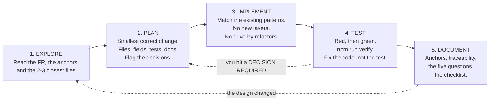

# 32 — AI Coding Agent Rules

**Project:** CareGrid AI
**Document type:** The operating contract for any AI coding agent — or human — working in this repository
**Status:** Baseline v1.0 — normative and non-negotiable unless an anchor document says otherwise
**Audience:** Any AI coding agent, and any human who reviews its output
**Related documents:** [01 PRD](./01_PRODUCT_REQUIREMENTS_DOCUMENT.md) · [05 Frontend Architecture](./05_FRONTEND_ARCHITECTURE.md) · [06 Backend Architecture](./06_BACKEND_ARCHITECTURE.md) · [07 Database Schema](./07_DATABASE_SCHEMA.md) · [08 API Specification](./08_API_SPECIFICATION.md) · [09 AI Specification](./09_AI_GEMINI_SPECIFICATION.md) · [16 Error Handling](./16_ERROR_HANDLING.md) · [17 Validation Rules](./17_VALIDATION_RULES.md) · [18 Testing & QA Plan](./18_TESTING_QA_PLAN.md) · [20 Folder Structure](./20_PROJECT_FOLDER_STRUCTURE.md) · [21 Environment Variables](./21_ENVIRONMENT_VARIABLES.md) · [22 Roles & Permissions](./22_USER_ROLES_PERMISSIONS.md) · [26 Performance](./26_PERFORMANCE_REQUIREMENTS.md) · [31 Coding Standards](./31_CODING_STANDARDS.md)

---

## 0. Preamble — how to use this document

### 0.1 The one rule

> **The documents are the source of truth. Not your memory, not a similar project you have seen, not what the framework's documentation says by default. If you cannot find it in a document here, you may not invent it.**

This repository is a regulated-shaped system: a fixed data schema, a fixed error catalogue, a fixed permission matrix, a fixed field-bound table, and a fixed cost constraint. A "reasonable improvement" that renames a field, adds an error code, or introduces an endpoint is not an improvement — it is a divergence that makes the documentation wrong, which makes the next agent's work wrong, and the error compounds.

### 0.2 The reading order, every time

Read in this order, and stop when you have what you need:

| # | Read | What you get |
| ---: | --- | --- |
| 1 | **[01](./01_PRODUCT_REQUIREMENTS_DOCUMENT.md)** — the PRD | What the product does, the FR IDs, the user stories, the decision register. Read §6 for your area. |
| 2 | **[07](./07_DATABASE_SCHEMA.md)** | Every field name, the state machine (§4.3), the geohash scheme (§9), the query limits (§12.5), the transaction patterns (§12.6). **This document is authoritative for field names.** |
| 3 | **[08](./08_API_SPECIFICATION.md)** | Every endpoint, every request shape, every rate limit, every status code. |
| 4 | **[22](./22_USER_ROLES_PERMISSIONS.md)** | The permission matrix, the two hard denials, the two-gate object authorization, the rules. |
| 5 | **The specific document for your task** | [05](./05_FRONTEND_ARCHITECTURE.md) UI · [06](./06_BACKEND_ARCHITECTURE.md) server · [09](./09_AI_GEMINI_SPECIFICATION.md) AI · [15](./15_FILE_STORAGE_SPECIFICATION.md) uploads · [16](./16_ERROR_HANDLING.md) errors · [17](./17_VALIDATION_RULES.md) validation · [18](./18_TESTING_QA_PLAN.md) tests · [20](./20_PROJECT_FOLDER_STRUCTURE.md) file placement · [21](./21_ENVIRONMENT_VARIABLES.md) env · [25](./25_ACCESSIBILITY_RESPONSIVENESS.md) a11y · [26](./26_PERFORMANCE_REQUIREMENTS.md) budgets |
| 6 | **[31](./31_CODING_STANDARDS.md)** | How to write the code: TypeScript, naming, components, hooks, routes, services, Firestore, realtime, errors, git, security, dependencies |
| 7 | **The code you are about to touch** | The two or three files that already do the closest thing to what you need. **Match them.** |
| 8 | **[18](./18_TESTING_QA_PLAN.md)** | The test ID for your requirement, and the test that must exist |

Reading order 1 → 4 is not a formality. Almost every catastrophic error in an agent-built codebase comes from skipping it: a plausible `status: 'acknowledged'`, a `POST /api/incidents/{id}/acknowledge`, an env var called `GEMINI_KEY`, an error code `NOT_AUTHORIZED`. All of them are hallucinated, and all of them are checkable by reading four documents.

### 0.3 What you are and are not allowed to do

| Allowed | Not allowed |
| --- | --- |
| Implement an FR exactly as written | Improve, refine, or "modernise" an FR |
| Add a field **after** amending doc 07 | Add a field "just for this endpoint" |
| Choose the simplest implementation that satisfies the FR | Add a layer you think will be needed later |
| Say "I could not determine this" | Guess a field name, an endpoint, or an error code |
| Mark an uncertainty `DECISION REQUIRED` | Resolve an ambiguity silently |
| Refuse a task that would violate a MUST rule | Comply and mention it afterwards |
| Stop and ask | Push a change you are unsure about and flag it "for review" |

**The asymmetry is deliberate.** Adding a wrong field is cheap to write and expensive to discover. Refusing one task is cheap. When in doubt, stop.

### 0.4 The commit-message convention for agent work

Agent commits are ordinary commits. They follow [31](./31_CODING_STANDARDS.md) §12, and the description must contain the traceability block. There is no `🤖`-prefixed commit type; the audit trail is for the product, not for the author's species.

---

## 1. The 15 MUST rules

Each rule is stated as a checkable instruction, with a violation example and the correct form.

### MUST 1 — Read the documentation before writing code

**Rule.** Before you write or modify a single line, read the anchor documents for the area you are touching (order in §0.2). If you have not read the specific document for your area in this session, you have not read it.

**Violation.**

```ts
// Asked: "add a way for a dispatcher to acknowledge an incident"
// The agent skipped doc 07 §4.3 and invented a status.
const STATUSES = ['new', 'acknowledged', 'assigned', 'resolved'];
```

`acknowledged` is not a status. The 11 statuses are `new`, `triaged`, `verified`, `assigned`, `en_route`, `on_scene`, `resolved`, `closed`, `cancelled`, `false_alarm`, `merged` ([07](./07_DATABASE_SCHEMA.md) §4.3), and acknowledgement is expressed by `triaged`.

**Correct.**

```ts
// Read doc 07 §4.3 first: acknowledgement is `triaged`, set by a dispatcher/admin.
import { incidentStatusValues } from '@/validators/enums';
```

### MUST 2 — Follow the documented architecture

**Rule.** Code goes where [20](./20_PROJECT_FOLDER_STRUCTURE.md) says, follows the import matrix, and never inverts a layer. `app/api/** → services/** → lib/server/**`. `lib/` is pure. A component never imports a service.

**Violation.**

```ts
// app/api/incidents/route.ts
import { db } from '@/lib/firebase-admin';
const snap = await db.collection('incidents').where('status', '==', 'new').get();
```

A route handler that talks to Firestore directly breaks three documented rules at once: routes are thin wrappers, `services/` owns transactions, and the Admin SDK is only importable from `lib/server/`.

**Correct.**

```ts
// app/api/incidents/route.ts
export const runtime = 'nodejs';
// …pipeline: context → requireUser → assertRole → assertResourceAccess →
//            assertSameOrigin → enforceRateLimit → parseSearchParams →
//            listIncidents({ ctx, filters }) → ok(serializeIncidentList(rows))
```

### MUST 3 — Never change the stack without approval

**Rule.** The stack is locked: Next.js 15 App Router, React 19, TypeScript 5.7 strict, Tailwind v4, shadcn/ui, the test stack in [18](./18_TESTING_QA_PLAN.md) §2, Firebase, Gemini via `@google/genai`. You may not swap, upgrade past the pinned range, or replace any of them.

**Violation.**

```bash
npm install axios                       # ❌ there is exactly one HTTP client: lib/api/client.ts
npm install @reduxjs/toolkit            # ❌ RSC + onSnapshot + URL + RHF is the state model
npm install moment                      # ❌ date-fns with subpath imports only
npm install @google/generative-ai       # ❌ @google/genai is the SDK; the other is deprecated
```

**Correct.** Use what exists. If you believe a change is necessary, write a decision note (§9) and stop.

### MUST 4 — Never replace Firebase

**Rule.** Cloud Firestore is the datastore ([01](./01_PRODUCT_REQUIREMENTS_DOCUMENT.md) DEC-15). Firebase Auth is the identity provider. Firebase Storage is the evidence store. Security Rules are the client-side guard. You may not add a second datastore, replace an SDK, or bypass the Admin SDK bootstrap with a different credential path.

**Violation.**

```ts
// ❌ a second datastore, a direct HTTP call to Firestore REST, or a service-account
//    JSON file in the repository
import { Firestore } from '@google-cloud/firestore';
const client = new Firestore({ keyFilename: './serviceAccountKey.json' });
```

**Correct.**

```ts
// ✅ the single bootstrap, server-only
import { getAdminDb } from '@/lib/server/firebase-admin';
```

### MUST 5 — Never expose a secret

**Rule.** No secret, ever, in any form: not in code, a comment, a test fixture, a log, a screenshot, a PR description, or a chat message. `FIREBASE_PRIVATE_KEY`, `GEMINI_API_KEY`, `GOOGLE_MAPS_SERVER_KEY`, and `CRON_SECRET` are server-only and read exclusively through `lib/env.ts`. Anything prefixed `NEXT_PUBLIC_` is public.

**Violation.**

```ts
// ❌ a key in code, a plausible-looking one, or a real one
const GEMINI_API_KEY = 'AIzaSyD-ExampleKey_1234567890abcdef';
// ❌ a service account committed to the repository
const serviceAccount = require('./serviceAccountKey.json');
// ❌ a token in a log line
logger.info('auth', { token });
```

**Correct.**

```ts
// ✅ validated at boot, named in the error, never printed
import { serverEnv } from '@/lib/env';
const client = new GoogleGenAI({ apiKey: serverEnv.GEMINI_API_KEY });
```

### MUST 6 — Never create fake functionality

**Rule.** Every button does something real. Every screen reads or writes real data. Every affordance is backed by an implemented, tested path. A disabled control has a reason. There is no "coming soon" UI, no hard-coded demo number presented as live, no simulated delay, no `# TODO: implement`.

**Violation.**

```tsx
// ❌ a button that pretends
<Button onClick={() => toast.success('Responder notified')}>Notify responder</Button>

// ❌ a chart fed a constant
const chartData = [{ day: 'Mon', incidents: 12 }, { day: 'Tue', incidents: 18 }];

// ❌ a permission check that exists only in the UI
const canVerify = user.role === 'dispatcher';   // and nothing on the server
```

**Correct.**

```tsx
// ✅ the real call, with the real error surface
const result = await assignResponder({ incidentId, responderUid, mode: 'manual' });
if (!result.ok) toast.warning(result.error.message);
// and the server re-checks assertRole + assertResourceAccess regardless
```

### MUST 7 — No mock data in production code paths

**Rule.** No fixtures, no fake records, no `if (import.meta.env.DEV) return FAKE_INCIDENTS`, no `__DEV__` data branch, no hard-coded "sample" arrays in a feature. Mocks and stubs live in `tests/`, keyed by a **seam** the code already has (a provider interface, an adapter, a route stub) — never by a branch in production code.

**Violation.**

```ts
// ❌ a dev-only fake data path inside the feature
export async function listIncidents() {
  if (process.env.NODE_ENV !== 'production') return SAMPLE_INCIDENTS;
  return fetchFromFirestore();
}
```

**Correct.**

```ts
// ✅ the seam is a real interface; the mock implements it in tests/ only
// services/ai/provider.ts → TriageProvider
// tests/helpers/mock-ai.ts    → makeTriageProvider()
```

The **only** permitted data-seeding path is `scripts/seed.ts`, guarded by `NODE_ENV !== 'production'` **and** `ALLOW_SEED` (FR-147), and it writes to the configured project — never to a code branch.

### MUST 8 — Keep TypeScript strict

**Rule.** `strict: true` plus the flags in [31](./31_CODING_STANDARDS.md) §2.1. Zero `any` in `app/`, `features/`, `services/`, `lib/`, `hooks/`, `types/`, `validators/`. No `!` outside tests. `import type` for type-only imports. Zod-derived types. Discriminated unions over optional-everything.

**Violation.**

```ts
const incident = data as any;                 // ❌
const first = candidates[0]!.uid;            // ❌
type Action = { verify?: boolean; assign?: { uid: string } };   // ❌ optional-everything
```

**Correct.**

```ts
const parsed = incidentSchema.safeParse(data);
if (!parsed.success) throw new AppError({ code: 'VALIDATION_FAILED', details: formatZodIssues(parsed.error) });

type Action =
  | { kind: 'verify' }
  | { kind: 'assign'; responderUid: string; mode: DispatchMode };
```

### MUST 9 — Validate all external input

**Rule.** Every body, query string, and path param is validated with a `.strict()` Zod schema from `validators/` **before** any database, AI, or Maps call (FR-142). `params` count. Unknown keys are rejected, not ignored. Declared file types and sizes are never trusted — magic bytes and the measured size win.

**Violation.**

```ts
export async function POST(req: Request) {
  const body = await req.json();                       // ❌ no validation at all
  const lat = Number(body.location.lat);               // ❌ manual coercion
  await db.collection('incidents').add({ lat, text: body.text });
}
```

**Correct.**

```ts
const { id } = await parseParams(params, incidentParamsSchema);   // params too
const body = await parseJsonBody(req, createIncidentBodySchema);   // .strict(), before any side effect
```

### MUST 10 — Respect the role permissions

**Rule.** Authorization is decided **server-side** from `users/{uid}.role`, read fresh per request. The token claim is a mirror used only by Security Rules; a mismatch is `403 ROLE_MISMATCH` plus an audit row, never a silent override. Two gates always apply: role, then ownership/visibility. Never widen Security Rules to make something work. Two permissions are hard-denied for every role including `admin`: **delete an audit log** (row 59) and **change your own role** (row 61).

**Violation.**

```ts
// ❌ trusting a client-supplied role
if (body.role === 'dispatcher') await verifyIncident(id);

// ❌ a 403 for "not yours" on a read — an existence oracle
if (incident.reporterUid !== user.uid) throw new AppError({ code: 'FORBIDDEN' });

// ❌ widening a rule to unblock a test
allow update: if isSignedIn();   // in firestore.rules
```

**Correct.**

```ts
const user = requireUser(ctx);                              // role from users/{uid}
assertRole(ctx, 'dispatcher', 'admin');
const access = await assertResourceAccess(ctx, 'incident', id, 'action');
// reads that fail Gate 2 → 404 INCIDENT_NOT_FOUND, identical to a missing document
```

### MUST 11 — Test your changes

**Rule.** Every change ships with tests. A bug fix ships with a test that fails without the fix. A new endpoint ships with 1 happy path and at least 2 failure paths. A pure function ships with unit tests; a transaction ships with an integration test against the emulator; a new status or field ships with the boundary cases. The test IDs are real and appear in [18](./18_TESTING_QA_PLAN.md). No skipped test without an issue link.

**Violation.**

```ts
// ❌ a fix with no regression test
// before: slaBreachedAt was set on every read
if (now > deadline) data.slaBreachedAt = now;   // fixed, and now untested
```

**Correct.**

```ts
// ✅ the boundary and the once-only property
it('sets slaBreachedAt exactly once', () => { /* TC-LIFE-008c */ });
it('does not overwrite slaBreachedAt on a later read', () => { /* TC-LIFE-008c */ });
```

### MUST 12 — Explain every file you changed

**Rule.** The PR description lists every file with a one-line reason, plus the FR/NFR IDs, the test IDs, the anchor documents amended, and the verification evidence. A reviewer must be able to reconstruct your reasoning from the description without reading the diff.

**Violation.**

```text
Files changed: 7
```

**Correct.**

```markdown
| File | Why |
| --- | --- |
| `services/dispatch/assign.ts` | closes the previous active dispatch in the same transaction (FR-053) |
| `lib/incidents/lifecycle.ts` | `assigned -> on_scene` for a responder is flagged as a documented jump |
| `tests/integration/transactions.test.ts` | the double-dispatch race (TC-LIFE-004c) |
```

### MUST 13 — Do not break existing functionality

**Rule.** Run `npm run verify` before you claim anything. If a test you did not write fails, you broke something — fix your change, not the test. If an existing test is genuinely wrong, amend the **anchor document first**, then the code, then the test, all in the same change, and say so explicitly in the description. Silencing a test to make a build green is the failure this rule exists to prevent.

**Violation.**

```ts
// ❌ making a build green
it.skip('geohash neighbours', () => { /* not important right now */ });
// eslint-disable-next-line @typescript-eslint/no-explicit-any
```

**Correct.**

```ts
// ✅ the test stays; the code is fixed
it('buildGeoCells returns exactly 10 cells', () => { /* TC-GEO-008 */ });
```

### MUST 14 — Reuse existing components and utilities

**Rule.** Before writing anything, find whether it already exists. Check `components/ui/`, `components/domain/`, `lib/format/`, `lib/geo/`, `validators/common.ts`, `config/`, and `lib/api/`. Reuse beats duplication; a third caller is the threshold for a new abstraction; one caller does not make it shared.

**Violation.**

```ts
// ❌ a second distance formatter, a second date formatter, a second debounce
export function formatDistanceKm(m: number) { return (m / 1000).toFixed(1) + ' km'; }
export function timeAgo(iso: string) { /* … */ }
function debounce<T>(fn: T, ms: number) { /* … */ }
```

**Correct.**

```ts
import { formatDistance } from '@/lib/format/distance';
import { relativeTime } from '@/lib/format/relative-time';
import { useDebounce } from '@/hooks/useDebounce';
```

### MUST 15 — Ask before a major architecture change

**Rule.** If your task requires changing the datastore, the auth model, the route structure, the state model, the data flow between a client and a service, the permission model, the error envelope, or the dependency set — **stop and ask**. Do not implement it "to unblock yourself". Write the decision note, present the alternatives with a recommendation, and wait.

**Violation.** Rewriting `services/ai/triage.ts` to call the model directly from a route "to save a hop". Introducing a cache layer. Adding a queue. Moving logic out of a transaction "to reduce contention".

**Correct.** A decision note with the problem, the options, the recommendation, the cost, and the rollback — then stop.

---

## 2. The 9 MUST NOT rules

Same shape: a rule, a violation, and the correct form.

### MUST NOT 1 — Must not invent a Firestore field

**Rule.** A field name that is not in [07](./07_DATABASE_SCHEMA.md) does not exist. If you need one, amend doc 07 **first**, in the same change, and add it to the correct collection's table with type, required flag, and notes.

**Violation.**

```ts
await incidentRef.set({ id, lat, lng, category, priority, notes, createdAt, updatedAt });
// `priority` is not a field. Urgency is `urgency` with 4 values.
// `notes` is not a field. The resolution note is `resolutionNote`.
// `lat`/`lng` live inside `geo`, server-computed.
// `id` duplicates `incidentId` and is forbidden.
```

**Correct.** Read the §4.1 field table. `urgency: 'critical'`, `summary`, `originalText`, `locationText`, `resolutionNote`, and `geo: { lat, lng, accuracyM, accuracyGrade, source }`.

### MUST NOT 2 — Must not invent an endpoint

**Rule.** Endpoints come from [08](./08_API_SPECIFICATION.md). If one is missing, the change requires an amendment to doc 08 §3 **and** §11, the Zod schema, the client function, the integration tests, and a reason. `DECISION REQUIRED` while the decision is open — [17](./17_VALIDATION_RULES.md) D-17-10 flags `POST /api/incidents/:id/reports` as exactly this case, still pending.

**Violation.**

```ts
// ❌ three invented endpoints
export async function POST(req: Request) { /* /api/incidents/:id/acknowledge */ }
export async function POST(req: Request) { /* /api/notifications/broadcast */ }
export async function DELETE(req: Request) { /* /api/users/:id */ }
```

**Correct.** Use `PATCH /api/incidents/:id/status` with the documented transition table, or amend doc 08 first.

### MUST NOT 3 — Must not invent an env var

**Rule.** Environment variables come from [21](./21_ENVIRONMENT_VARIABLES.md). If one is missing, amend doc 21 §2 and `.env.example` in the same change, with visibility, required flag, and default. Never read `process.env.X` directly — go through `lib/env.ts` (server) or `lib/env.client.ts` (client, `NEXT_PUBLIC_*` only).

**Violation.**

```ts
const model = process.env.AI_MODEL ?? 'gemini-2.5-flash';   // ❌ the variable is GEMINI_MODEL
const key = process.env.FIREBASE_KEY;                        // ❌ reads nothing, and bypasses validation
```

**Correct.**

```ts
import { serverEnv } from '@/lib/env';
const model = serverEnv.GEMINI_MODEL;   // default 'gemini-2.5-flash', validated at boot
```

### MUST NOT 4 — Must not invent an error code

**Rule.** `ErrorCode` is a union generated from the catalogue in [16](./16_ERROR_HANDLING.md) §3, so inventing one is a **compile error**. If a genuinely new condition exists, add it to the catalogue **and** the client table in the same commit, with an HTTP status, a user-facing message, retryability, and a log level. Do not reuse an existing code for a different condition.

**Violation.**

```ts
throw new AppError({ code: 'INCIDENT_LOCKED' });            // ❌ not in the catalogue
throw new AppError({ code: 'FORBIDDEN', message: 'This incident is locked by another dispatcher' });
// ❌ a different message for the same code: copy drift
```

**Correct.** `INVALID_STATUS_TRANSITION` with `details[0].value = { from, to, allowed }`; the message comes from the catalogue.

### MUST NOT 5 — Must not invent a collection

**Rule.** Collections come from [07](./07_DATABASE_SCHEMA.md) §1. If one is missing, amend doc 07 §1 **and** add it to `config/collections.ts` **and** write the rules tests for it. Never create a collection from a client, and never add a document outside a service.

**Violation.**

```ts
await db.collection('incidentActivity').add({ … });   // ❌ statusHistory is a subcollection
await db.collection('userSessions').doc(uid).set({ … });   // ❌ no server sessions by design ([21] §9)
```

**Correct.** `incidents/{id}/statusHistory/{eventId}` via `services/incidents/change-status.ts`, inside the transaction.

### MUST NOT 6 — Must not skip the `deletedAt == null` filter

**Rule.** Every default list query filters `where('deletedAt', '==', null)`. Soft-deleted incidents are hidden from every default view and remain recoverable by an admin. The only exceptions are `includeDeleted=true` (dispatcher/admin, always audited) and the admin restore view.

**Violation.**

```ts
db.collection(COLLECTIONS.incidents).where('reporterUid', '==', uid).orderBy('createdAt', 'desc').limit(25);
```

**Correct.**

```ts
db.collection(COLLECTIONS.incidents)
  .where('deletedAt', '==', null)
  .where('reporterUid', '==', uid)
  .orderBy('createdAt', 'desc')
  .limit(25);
```

### MUST NOT 7 — Must not claim a location is exact

**Rule.** Location is always graded and always sourced. The AI has **no** coordinate output field. `geoCells` is server-computed. `accuracyGrade` is derived. `location_hint` is prefixed "approximate" everywhere it is shown. Never describe an incident as "at 17.4478, 78.4874" when `accuracyGrade` is `low` or `unknown`.

**Violation.**

```tsx
<span>Location: {incident.geo.lat}, {incident.geo.lng}</span>   // ❌ no grade, no source
<span>{aiOutput.location_hint}</span>                            // ❌ presented as a location
const geo = aiOutput.geo;                                        // ❌ the field does not exist
```

**Correct.**

```tsx
<LocationBadge grade={incident.geo.accuracyGrade} source={incident.geo.source} />
{/* and the AI panel renders: approximate: {aiOutput.location_hint} */}
```

### MUST NOT 8 — Must not let AI output drive a dispatch

**Rule.** There is no code path from an AI output to a dispatch, a notification to an external service, or a lifecycle transition beyond `new → triaged`. The AI has no tools. `dispatches.dispatchedBy` is always a human uid. This is a mandatory safety requirement (DEC-05), not a preference.

**Violation.**

```ts
if (triage.urgency === 'critical') {
  await assignNearestResponder(incident.id);          // ❌ AI driving a dispatch
  await notifyEmergencyServices(incident.geo);        // ❌ no such integration exists
}
await setIncidentStatus(incident.id, 'verified');    // ❌ the AI cannot verify
```

**Correct.**

```ts
// The AI writes triage fields only. A human dispatcher assigns.
await writeTriageResult(incident.id, normalised);    // category, urgency, summary, flags, confidence
// status moves new → triaged at most
```

### MUST NOT 9 — Must not leave a `console.log`

**Rule.** Logging goes through `lib/server/logging.ts` (server) and nothing at all in the browser. `console.warn` and `console.error` are allowed only in `lib/observability/`, `lib/firebase/listener-registry.ts`, and dev-only blocks. `console.log` in committed code is a build failure under the project lint rules.

**Violation.**

```ts
console.log('got incidents', incidents);              // ❌ and it may contain PII
console.log('token', token);                          // ❌ a secret in a log
console.debug(state);                                 // ❌ the logger has levels and a redaction guard
```

**Correct.**

```ts
logger.info('incidents.listed', { requestId: ctx.requestId, count: rows.length });
```

---

## 3. Additional agent-specific rules

These go beyond the brief's 15 + 9. Each exists because it has caused a real, expensive class of error in agent-built codebases.

### 3.1 Never add a Firestore listener without a `limit()`

An unbounded listener is a silent, compounding read-budget breach that no type system sees. The budget is ≤ 200 per listener, ≤ 8 listeners per client (FR-091), and every query needs a teardown.

```ts
// ❌ unbounded, unscoped, and never torn down
onSnapshot(query(collection(COLLECTIONS.incidents), where('status', '==', 'triaged')), cb);

// ✅ bounded, role-scoped, torn down, and registered so the budget is enforced
const unsubscribe = onSnapshot(
  query(
    collection(COLLECTIONS.incidents),
    where('deletedAt', '==', null),
    where('status', 'in', ACTIVE_STATUSES),
    orderBy('updatedAt', 'desc'),
    limit(LIMITS.QUEUE_LIMIT),              // 50
  ),
  handleSnapshot,
  handleError,
);
return unsubscribe;
```

Register through `lib/firebase/listener-registry.ts`, which enforces the 8-listener budget and the teardown in one place.

### 3.2 Never widen Security Rules

Rules are the client-side guard. Widening one to make a test, a demo, or your own change work creates a silent authorisation hole that no other test will catch.

```js
// ❌ widening
match /incidents/{id} { allow read, write: if isSignedIn(); }

// ❌ widening "temporarily" — there is no legitimate version of this
match /auditLogs/{lid} { allow write: if isAdmin(); }

// ✅ if a rule is genuinely wrong, fix the CALL SITE. If the rule itself must change, it
//    is a security change: explicit reviewer approval, a new negative test in
//    tests/integration/firestore-rules.test.ts, and a note in the PR body.
```

### 3.3 Always update the traceability when adding an FR

[01](./01_PRODUCT_REQUIREMENTS_DOCUMENT.md) §13 requires every assigned FR to have at least one implementation site **and** at least one test case.

1. Add the row to [01](./01_PRODUCT_REQUIREMENTS_DOCUMENT.md) §6 with a unique ID, the priority, and the **test ID that verifies it**.
2. Add the test row to [18](./18_TESTING_QA_PLAN.md) §4 with that ID.
3. Add the implementation site to the phase plan.
4. **Never** reuse a reserved ID: FR-013, FR-016, FR-109, FR-119, or the unused ranges listed in [18](./18_TESTING_QA_PLAN.md) §21.3.

### 3.4 Never rename a field without amending doc 07 first

Doc 07 opens with: *"field names in this document are normative. If code uses a different field name, the code is wrong."* A rename is a three-step change, in this order:

1. Amend [07](./07_DATABASE_SCHEMA.md): the field table, every example document, every collection that embeds the type, and the §16 traceability.
2. Amend [08](./08_API_SPECIFICATION.md) if the field appears in a request or response.
3. Change the code, in the same commit, with a migration note if data exists.

### 3.5 Never add a dependency without a decision note

Five questions, all answered in the PR body: alternatives, bundle impact, maintenance, licence, free-tier fit ([31](./31_CODING_STANDARDS.md) §14). `npm install` in a feature branch without the note is a rejection.

### 3.6 Never write `any`, and never disable a type error with `as any` or `!`

The escape is `unknown` plus narrowing, or a single justified `eslint-disable` with a reason and an immediate narrow cast. More than one such disable in a file is a review failure. A `!` is allowed only in `tests/`, and only after an explicit `expect(x).toBeDefined()`.

### 3.7 Never claim a test passed unless you ran it

This is the honesty rule with teeth. See §9.1 for the concrete red-then-green form.

### 3.8 Never commit a secret, and never paste one into a conversation

If a secret appears in your output, say so immediately and treat it as compromised. The rotation procedures are in [21](./21_ENVIRONMENT_VARIABLES.md) §6.

### 3.9 Never mark a `DECISION REQUIRED` as decided

If you find yourself choosing between two documented-but-unresolved options, you may implement the **recommended** option from the register, but you must mark the decision **provisional**, keep the `DECISION REQUIRED` row, and say so in the PR body. You do not have the authority to close a decision.

### 3.10 Never delete or weaken a test to make a build pass

A failing test is information. The three acceptable responses are: fix your code; fix the test **because an anchor document says the test was wrong** (and amend the anchor in the same change); or mark it `skip` with an issue link. Removing the assertion is not one of them.

### 3.11 Never claim in prose a field, endpoint, code, env var, or collection that does not exist

This applies to your PR description, your comments, and your documentation, not just to code. "I added a `POST /api/incidents/:id/acknowledge` endpoint" is a false statement about the system even if no code exists.

### 3.12 Never put a raw enum in user-facing text

`en_route` reads as "En route"; `on_scene` as "Arrived on scene"; `false_alarm` as "Marked as a false alarm". Every enum has a label in `config/`. Rendering the raw value is a bug a screen-reader user notices immediately (TC-ACC-058).

### 3.13 Never add a `setInterval` for data fetching

`onSnapshot` is the transport (FR-090). `setInterval` exists for exactly two UI clocks: `useSlaCountdown` (15 s) and `RelativeTime` (30 s).

### 3.14 Never make a route handler do business logic

`app/api/**` parses, calls one service, and serialises. A `switch` on business intent inside a route is a sign the intent should be its own endpoint and its own service function.

### 3.15 Never add a second copy of an enum list

`validators/enums.ts` is the single source. A literal list of statuses in a component is a bug waiting for a 12th status.

---

## 4. Mandatory pre-flight checklist

Run through this **before writing code**. Two minutes, and it prevents every catastrophic error class in this document.

```text
PRE-FLIGHT

1. REQUIREMENT
   [ ] I can name the FR ID(s) this change implements, from doc 01.
   [ ] I have read the user story and its acceptance criteria (doc 01 §8).
   [ ] I know the priority (P0/P1) and whether this blocks the demo.

2. ANCHOR DOCUMENTS
   [ ] doc 07 — the exact fields, types, and the relevant state machine / geohash /
         transaction pattern, for the collections I will touch.
   [ ] doc 08 — the exact endpoint, its request shape, its auth, its rate limit,
         its error codes, and its row in §11.
   [ ] doc 22 — the permission matrix row for this action, and Gate 2 for this resource.
   [ ] doc 16 — the error codes I may emit, and the approved copy.
   [ ] doc 17 — the field bounds and the cross-field rules.
   [ ] The area doc: 05 / 06 / 09 / 15 / 25 / 26, as applicable.
   [ ] doc 31 — the conventions I am about to violate if I do not check.

3. EXISTING CODE
   [ ] I have read the 2-3 files that do the closest thing to what I need.
   [ ] I am matching their naming, structure, error handling, and test style.
   [ ] I know whether the utility I am about to write already exists.

4. TEST
   [ ] I know the test ID for my requirement (doc 18 §4).
   [ ] I know which layer the test belongs in (unit / component / rules /
         integration / E2E).
   [ ] I know the coverage target for the area (doc 18 §3.1).
   [ ] For a new endpoint: 1 happy path + >= 2 failure paths.
   [ ] For a new status or field: the boundary cases at -1 / value / +1.

5. BOUNDARIES
   [ ] I know which folder this goes in (doc 20 §5.1 flowchart).
   [ ] I know the import direction I must not cross (doc 20 §3.2).
   [ ] I know whether the file needs *.server.ts or *.client.ts.

6. SAFETY
   [ ] No secret, no dangerouslySetInnerHTML, no client-trusted role.
   [ ] No console.*, no any, no ! outside tests.
   [ ] Every new query has a limit(); every list query has deletedAt == null.
   [ ] Any new listener has a limit() and a teardown.
   [ ] No AI output reaches a dispatch, a verification, or a coordinate.

7. DECISIONS
   [ ] I have not silently resolved a DECISION REQUIRED.
   [ ] If I hit one, I have stopped and asked, or implemented the documented
         recommendation and marked it provisional.

8. SCOPE
   [ ] This is the smallest correct change.
   [ ] It contains no drive-by refactor.
   [ ] It adds no layer, abstraction, or dependency I do not need right now.
```

---

## 5. Mandatory post-flight checklist

Run through this **before you claim the work is done**. "Done" without this checklist is a guess.

```text
POST-FLIGHT

1. VERIFICATION — actually run these, do not assume
   [ ] npm run typecheck          — green
   [ ] npm run lint               — green
   [ ] npm run format:check       — green
   [ ] npm run test:unit          — green
   [ ] npm run test:integration   — green   (emulator running)
   [ ] npm run test:rules         — green   (emulator running)
   [ ] npm run verify             — green, on THIS commit
   [ ] If the change touches a route: npm run test:e2e and npm run test:a11y.

2. TESTS
   [ ] My new test FAILS without my change. (Prove it. Revert the change, run
         the test, watch it fail, restore. This is the only way to know the
         test has teeth.)
   [ ] Every negative path is tested, not just the happy one.
   [ ] No Date.now(), no unseeded randomness, no wall-clock dependence.
   [ ] No skipped test without an issue link.
   [ ] The test IDs I used exist in doc 18 §4.

3. DOCUMENTATION
   [ ] Every field I touched exists in doc 07 with the name I used.
   [ ] Every error code I emit is in doc 16 §3.
   [ ] Every endpoint I added or changed is in doc 08 §3 and §11.
   [ ] Every env var I used is in doc 21 §2.
   [ ] Every collection I touched is in doc 07 §1 and in config/collections.ts.
   [ ] I amended an anchor document, in the same change, if the design changed.
   [ ] doc 18 §4 has a row (or an extended row) for my requirement.

4. TRACEABILITY
   [ ] FR: FR-###
   [ ] NFR: NFR-###
   [ ] Test IDs: TC-XXX-###
   [ ] Phase: N
   [ ] Anchor document amended: none, or which section and why

5. THE FIVE QUESTIONS
   [ ] What did I change and why?                      (one paragraph)
   [ ] What did I consider and reject?                (with the reason)
   [ ] What could break, and how does it fail?        (the degraded path)
   [ ] What did I NOT do, and what would it take?     (honest scope)
   [ ] What am I unsure about?                        (DECISION REQUIRED, or nothing)

6. SELF-AUDIT — the anti-hallucination pass
   [ ] Is every identifier I used present in a document I read? Name the section.
   [ ] Did I copy an existing pattern, or did I invent one?
   [ ] Is anything here "probably how it works" rather than "documented"?
   [ ] If I removed a feature or a file, can I say why in one sentence?
   [ ] Have I claimed anything I did not verify?
```

---

## 6. The definition of a valid code change

A change is **valid** when all seven of these are true:

| # | Condition | How you check it |
| ---: | --- | --- |
| 1 | It implements a documented requirement | The FR ID exists in [01](./01_PRODUCT_REQUIREMENTS_DOCUMENT.md) and the behaviour matches its wording |
| 2 | Every identifier it uses exists in an anchor document | Field, endpoint, error code, env var, collection, enum, permission row |
| 3 | It respects every MUST and MUST NOT in this document | §1 and §2 |
| 4 | It is verified | `npm run verify` green on this commit, with the output quoted |
| 5 | It is tested | The test ID exists, the test fails without the change, and the negative paths are covered |
| 6 | It is documented | The anchor documents and [18](./18_TESTING_QA_PLAN.md) are updated in the same change if the design moved |
| 7 | It is explained | The PR description answers the five questions in §5 and the checklist in [31](./31_CODING_STANDARDS.md) §15 |

If any of the seven is false, the change is not ready. "It is small" does not exempt it.

### 6.1 The required PR description template

```markdown
## What
<Two or three sentences. The requirement, not the file list.>

## Traceability
- **FR:** FR-0xx, FR-0xx
- **NFR:** NFR-0xx
- **Test IDs:** TC-XXX-00x
- **Anchor documents amended:** none | doc 0X §N.N — <why it was necessary>
- **Phase:** N

## Files changed
| File | Why |
| --- | --- |
| `path/to/file.ts` | <one line> |
| `tests/…` | <one line> |

## Test evidence
- `npm run verify` → green on `<sha>`
- New tests: <n> (<m> negative)
- **Red-then-green proof:** with this change reverted, `<test name>` fails with `<actual>`.
  Restored, it passes.
- Manual verification: <what you did by hand, and the result>
- Not covered: <anything, and why>

## Design notes
### What I considered and rejected
- <Option A> — rejected because <reason>.
### Constraints from the anchor documents
- <"doc 07 §4.3 has no `acknowledged` status, so this uses `triaged`.">
### Provisional decisions
- <DECISION REQUIRED D-x implemented per the recommendation, marked provisional.>

## Risk
- **What could break:** <...>
- **How it fails if it does:** <the degraded path, per NFR-012>
- **Rollback:** <revert the commit; data migration: yes/no, and which>

## Checklist
- [ ] `npm run verify` green on this commit
- [ ] Every new exported function has JSDoc with `@param` and `@returns`
- [ ] No `any`, no `!` outside tests, no `console.*`
- [ ] Every new query has `limit()`; every list query has `deletedAt == null`
- [ ] Every listener has `limit()` and a teardown
- [ ] New endpoint: Zod schema exported, listed in doc 08 §11, 1 happy + 2 failure tests
- [ ] New error code: in doc 16 §3 and the client table, in this commit
- [ ] No secret, no `dangerouslySetInnerHTML`, no client-trusted role
- [ ] `"use client"` justified in a comment, if present
- [ ] Dependency added → decision note attached (or "none added")
```

---

## 7. "If you need X, do Y"

The most common agent requests and the documented path for each. **If your request is not in this table and you cannot find it in an anchor document, stop and ask.**

| You need to… | Do this, in this order | Do **not** |
| --- | --- | --- |
| **Add an endpoint** | 1. Amend [08](./08_API_SPECIFICATION.md) §3 (the contract) and §11 (the FR coverage table). 2. Add the Zod schema in `validators/<domain>.ts`, `.strict()`. 3. Add `services/<domain>/<verb>.ts` — explicit inputs and outputs, transactions here. 4. Add the thin route handler in `app/api/**/route.ts` with the pipeline order. 5. Add the typed function in `lib/api/client.ts`. 6. Add the feature wrapper in `features/<domain>/api/`. 7. Add integration tests: 1 happy + ≥ 2 failure. 8. Update [18](./18_TESTING_QA_PLAN.md) §4. | Invent the route shape. Put logic in the handler. Skip the doc-08 amendment. |
| **Add a field** | 1. Amend [07](./07_DATABASE_SCHEMA.md): the collection's field table, every example document, and the §16 traceability. 2. Add the write path in a service (transactional; server-computed if derived). 3. Add the Zod bound in `validators/`. 4. Add boundary tests at −1 / value / +1. 5. If it is in a response, amend [08](./08_API_SPECIFICATION.md) and the serialiser. 6. If it belongs in an audit `before`/`after`, add it to that allow-list. | Add the field only to the TypeScript type. Make it client-writable. Skip the boundary tests. |
| **Change a status or add a transition** | 1. Amend [07](./07_DATABASE_SCHEMA.md) §4.3 (the table and the additional rules). 2. Update `lib/incidents/lifecycle.ts` — the single source both the server and `allowedNext` read. 3. Update the 121-case table test; it stays 100 % branch covered. 4. Update `config/statuses.ts` (label, icon, colour, terminal flag). 5. Check the role column against [22](./22_USER_ROLES_PERMISSIONS.md) §3 rows 14–19. 6. Add a `statusHistory.eventType` value if a new event kind is needed. | Put a transition in a component. Put it in a route handler. Add it without the table test. |
| **Add a role or a permission** | 1. Amend [22](./22_USER_ROLES_PERMISSIONS.md) §1 (the role) or §3 (the matrix row with its FR). 2. Amend `firestore.rules` **narrowly**, with an explicit approval note in the PR. 3. Add the API check (`assertRole` or `assertResourceAccess`). 4. Add the rules test, positive **and** negative. 5. Add the matrix-row test in [18](./18_TESTING_QA_PLAN.md) §7.4. 6. Roles are set by an `admin` route with a reason and an audit row — never self-assignable. | Add a permission to the client list without the server check. Widen a rule to match. Make a role self-assignable. |
| **Add a notification type** | 1. Amend [07](./07_DATABASE_SCHEMA.md) §10.2 (`NotificationType` and the dispatch matrix). 2. Add the value to `validators/enums.ts`. 3. Add the template in `services/notifications/template.ts`. 4. Add the `dedupeKey` — FR-108 requires one notification per key. 5. Add the client-facing string to `copy.ts`. 6. Test the dedupe under concurrency. | Reuse an existing type for a new meaning. Send without a dedupe key. Put it on the request path so it can fail the request (FR-107). |
| **Add a chart** | 1. Add a wrapper in `components/charts/` (`"use client"`, dynamic import). 2. Wrap it in `chart-frame.tsx` with a heading, a `View as table` alternative, and `IntersectionObserver` lazy mounting. 3. Add the data mapping in `features/analytics/components/`. 4. Reuse an existing wrapper if one fits. 5. Check the DOM-size budget (150 KB) and the Recharts chunk budget (110 KB). 6. Test that the table alternative shows every value. | Import Recharts at the top of a page. Render a chart with no table alternative. Use colour alone to distinguish series. |
| **Add a page or a route** | 1. Choose the route group: `(public)` no session, `(auth)` session + minimal chrome, `(app)` session + full chrome, `(ops)` role ≥ dispatcher. 2. Add `app/(group)/<route>/page.tsx` plus `loading.tsx` / `error.tsx` where needed. 3. Guard in the layout with `requireSession()` / `requireRole()`, which renders `ForbiddenState` — never a redirect loop. 4. Compose from `features/`; no domain logic in a page. 5. Add the a11y title (doc 25 §4.2) and the responsive behaviour (doc 25 §9.2). 6. Add the route to the viewport matrix and the axe sweep. | Put business logic in a page. Add a listener on a public or auth page (FR-095). Redirect a forbidden user instead of rendering 403. |
| **Add an env var** | 1. Amend [21](./21_ENVIRONMENT_VARIABLES.md) §2: visibility, required, default, where used. 2. Add it to `.env.example` with a **placeholder only**. 3. Add it to the Zod schema in `lib/env.ts` (server) or `lib/env.client.ts` (client, `NEXT_PUBLIC_*` only). 4. Add a production guard if it must not be absent in production. 5. Document it in the per-environment matrix if it varies. | Read `process.env.X` directly. Give a secret a `NEXT_PUBLIC_` prefix. Commit a real value to `.env.example`. |
| **Add a config tunable** | 1. Amend [07](./07_DATABASE_SCHEMA.md) §11.8 (`config/app`) with the key, type, default, and range. 2. Add the bound to `validators/config.ts` and a boundary test. 3. Make the change audited (`config.update`) with a reason. 4. Decide whether it is env-only — if so, return `CONFIG_CHANGE_LOCKED`. 5. Expose only the client-safe subset in `GET /api/config`. | Put an admin-tunable in a code constant. Skip the range validation. |
| **Add a safety flag** | 1. Amend [07](./07_DATABASE_SCHEMA.md) §4.5, and §5.3 of [09](./09_AI_GEMINI_SPECIFICATION.md) if it forces urgency. 2. Add it to the AI output schema in `services/ai/schema.ts` **and** `validators/ai.ts`. 3. Add the chip spec in `config/safety-flags.ts`. 4. Add a deterministic rule in `services/ai/rules.ts` if it affects urgency. 5. Bump `PROMPT_VERSION` — the model must be told. | Add it only to the UI. Add it only to the database. Skip the prompt bump, which makes historical `aiRuns` uninterpretable. |
| **Add a resource** | 1. Amend [07](./07_DATABASE_SCHEMA.md) §11.1 with the `resourceId` and its fields. 2. Add it to `services/seed/seed-data.ts` and to the offline mirror `config/resources.ts`. 3. Add it to the AI catalogue so the model may request it. 4. **Never delete** a resource — deactivate with `active: false`. | Rename a `resourceId` that existing incidents reference. Add a resource the AI may request but that is not in the catalogue. |
| **Change the AI prompt** | 1. Bump `PROMPT_VERSION` in `services/ai/prompts.ts`. 2. Update the golden files in `tests/fixtures/ai/golden/`, one at a time, with a stated reason each. 3. Re-run the adversarial suite. 4. State the measured impact on `aiRuns` outcomes in the PR body. | Edit a prompt without bumping the version — that is what makes `aiRuns.promptVersion` meaningless. |
| **Change a duplicate threshold** | 1. Amend [07](./07_DATABASE_SCHEMA.md) §9.5 (key, default, range), and doc 17 if the admin bound changes. 2. Bump `algorithmVersion` (`dedupe-v1` → `dedupe-v2`) so stored breakdowns stay interpretable. 3. Update the config schema and its boundary tests. 4. Note that the change applies to **new** incidents only. | Change a weight without bumping `algorithmVersion`, which makes old `duplicateBreakdown` values unreadable. |
| **Add a maintenance job** | 1. Add it to the `POST /api/admin/maintenance/[job]` list in [08](./08_API_SPECIFICATION.md) §10. 2. Implement it in `services/admin/maintenance.ts`. 3. Require a reason; write an `auditLogs` row. 4. Gate it on `ENABLE_MAINTENANCE_JOBS` and `config.features.maintenance`; return `422 MAINTENANCE_DISABLED` when off. 5. It must be **idempotent** and safe to run twice. | Run it from a request path. Let it delete data — a purge needs an explicit job, an audit row, and a documented retention rule. |
| **Add a rate limit** | 1. Add the row to [08](./08_API_SPECIFICATION.md) §1.9 with the limit, window, and over-limit response. 2. Add the rule to `lib/api/ratelimit.ts` keyed by a stable `routeKey`. 3. The bucket doc id is a **hash** of subject + route + window, never the uid. 4. Every 429 carries `Retry-After`. 5. Test at limit and limit+1. | Add it in a route handler. Key the bucket on something that leaks the uid. Rate-limit a `GET` a user cannot abuse. |
| **Change an error message** | 1. Amend [16](./16_ERROR_HANDLING.md) §7 with the new approved string. 2. Update the client table if the wording is surface-specific. 3. Update the integration test that asserts the exact `code` **and** message. | Change the message at a throw site. Have two messages for one code. |
| **Add a `data-testid`** | 1. Follow doc 05 §17.1: `<element>-<role-or-state>`, only on things a test must find, never for styling, never the only place a string appears. 2. Prefer a role/label query in the test; the testid is the fallback. 3. Dynamic ids are encouraged: `queue-row-${reference}`. | Add a testid to a purely visual wrapper. Write a test that can only find the element by testid. |
| **Add a dependency** | 1. Write the five-question decision note ([31](./31_CODING_STANDARDS.md) §14). 2. Check for a duplicate-purpose library already present. 3. Measure the client bundle delta. 4. `npm ls` must show one version. 5. Update [02](./02_TECHNICAL_REQUIREMENTS_DOCUMENT.md) and [20](./20_PROJECT_FOLDER_STRUCTURE.md) if named there. | `npm install` and move on. Add a second HTTP client, date library, or validation library. |
| **Remove a feature or a file** | 1. Justify it in one sentence. 2. Remove its tests, docs, copy, config entry, and trace rows. 3. If it was in an anchor document, amend the anchor. 4. Confirm nothing still references it (`npm run typecheck` plus a grep). | Comment it out. "Deprecate" it in place. Leave a `legacy/` folder ([20](./20_PROJECT_FOLDER_STRUCTURE.md) §7 #15). |

---

## 8. Common agent failure modes, and how to avoid them

Each entry: how it presents, why it happens, and the specific defence.

### 8.1 Hallucinated APIs

**How it presents.** A `where` on a string with `>=` as if Firestore did range queries on strings; the wrong import shape for the modular SDK; `runTransaction` imported from the wrong package; a Zod v3 method where the project has v4; a React 18 idiom whose behaviour changed in React 19; a Tailwind v3 utility that v4 replaced.

**Why it happens.** The training data contains many similar-looking APIs, and the nearest match is not the correct one.

**Defence.** Before any SDK call, find it in this repository's existing code. If it is not already used, read the installed version's types in `node_modules` — not your memory. **[MUST 1]**

### 8.2 Plausible-but-wrong Firestore usage

**How it presents.** A composite index that does not exist; `array-contains` combined with `in` or a range on another field; an `in` list over 30 values; a `geoCells` array with 6 elements instead of 10, which silently stops matching neighbours; a non-Firestore `await` inside a transaction; a `where` on a field the schema does not store.

**Why it happens.** Firestore's constraints are unusual, easy to get subtly wrong, and they fail at runtime rather than at compile time.

**Defence.** [07](./07_DATABASE_SCHEMA.md) §12.7 is a table of known constraints written precisely so this does not happen: the 10-element array-index limit, the 30-value `in` limit, the 500-doc batch limit, the 1 MiB document limit, and the silent 5-retry transaction. **[TEST]** TC-GEO-008 asserts exactly 10 cells; TC-GEO-009b asserts exactly one candidate read.

### 8.3 Silently changing the design

**How it presents.** The agent "improves" something while implementing an unrelated task: a different status name, a new endpoint shape, a folder that is not in the tree, a helper in the wrong layer, an extra `any` to move faster.

**Why it happens.** The agent is optimising for a working build rather than a correct system, and does not realise that a divergence is a defect here.

**Defence.** Re-read the design table in [07](./07_DATABASE_SCHEMA.md) §1.1. Every shape in it has a documented reason and a stated trade-off. If your change contradicts one, you are not improving it. **[MUST 2]** **[MUST 13]**

### 8.4 Over-engineering

**How it presents.** A generic `useEntity<T>()` hook, a `BaseService` class, a factory for the duplicate engine, a strategy pattern with one strategy, an abstraction "for the next feature", 400 lines of infrastructure for 20 lines of need.

**Why it happens.** Generalisation feels like quality. In a hackathon repository it is a liability: it cannot be deleted, it must be documented, and it hides the actual logic.

**Defence.** The threshold for a shared abstraction is **three** call sites. One is not shared; two is a coincidence. Ask: "what is the smallest thing that satisfies the FR?" and ship that. **[MUST 14]** **[MUST 15]**

### 8.5 Writing docs that contradict the anchors

**How it presents.** A JSDoc comment describing a field that does not exist; a README claiming a feature that is not implemented; a doc that says "the AI suggests a responder" when the AI must never do that; a test ID that is not in [18](./18_TESTING_QA_PLAN.md).

**Why it happens.** Prose is written from the agent's model of the system rather than from the system.

**Defence.** Every identifier in a comment must be traceable to a document section. If you cannot cite the section, do not write the claim. **[MUST 11]** **[MUST 12]**

### 8.6 Claiming tests pass without running them

**How it presents.** "The tests should pass." "I believe the build succeeds." "This follows the existing pattern, so it should work." A PR description with a green tick that was never produced.

**Why it happens.** The agent wants to report success, and running commands is slower than asserting an outcome.

**Defence.** Run it. Quote the real output. If you cannot run it, say so and state exactly what you could not verify. **[MUST 11]** **[MUST 13]**; the concrete form is the red-then-green proof in §9.1.

### 8.7 Leaving TODOs and stubs

**How it presents.** `// TODO: implement`, a component returning `null` with a comment, a route returning `201` with a hard-coded body, a "coming soon" badge.

**Why it happens.** The agent needed to close a type error or a render path, and a stub is the fastest way.

**Defence.** A stub is acceptable **only** where the block is a documented `DECISION REQUIRED` — for example `components/domain/command-palette.tsx` under [20](./20_PROJECT_FOLDER_STRUCTURE.md) S1, which must return `null` with the blocking decision in a comment and stay excluded from the route tree. Everywhere else, a stub is fake functionality. A `TODO` needs an owner and an issue link. **[MUST 6]**

### 8.8 Duplicating an existing utility

**How it presents.** A second `haversine`, a second `formatDistance`, a second `timeAgo`, a second `debounce`, a second error-code table, a second copy of the status list.

**Why it happens.** The agent did not search before writing, or searched in the wrong place.

**Defence.** Search by *concept*, not by the name you invented: `grep -r "haversine" lib/`, `grep -r "formatDistance" lib/format/`. **[MUST 14]**

### 8.9 Getting the AI safety model wrong

**How it presents.** Using the model's urgency to route, to notify, or to auto-assign; trusting a `location_hint` as a location; keeping a `people_affected` the reporter never stated; letting a safety filter stop a report from being created; storing raw model output in `aiRuns`.

**Why it happens.** It looks like a reasonable optimisation: "if it is critical, skip the queue".

**Defence.** [09](./09_AI_GEMINI_SPECIFICATION.md) §1.2 and §6.4 are normative and short. The AI is decision support; a human disposes. Reporting never fails because AI failed (FR-029). **[MUST NOT 7]** **[MUST NOT 8]**

### 8.10 Optimising a number instead of the system

**How it presents.** Reaching 100 % coverage with trivial tests; making a percentage green rather than a behaviour correct; "reduced bundle size" by removing a feature; "faster" by dropping the authorisation check; a skipped test with a note that reads like a justification.

**Why it happens.** Metrics are legible and correctness is not.

**Defence.** [18](./18_TESTING_QA_PLAN.md) §3.2 and §19.4 exist for exactly this. A coverage number is a smoke detector. A skipped test needs an issue link, and "not important right now" is not a reason. **[MUST 11]** **[MUST 13]**

### 8.11 Being technically correct and operationally reckless

**How it presents.** A query without a `limit()`; a listener without a teardown; a document approaching 1 MiB; a `writeBatch` of 800; a Geocoding call per incident instead of per batch; an analytics query that scans incidents instead of reading `analyticsDaily`.

**Why it happens.** The free-tier budget is invisible at the code level, and the $0 claim is the project's headline constraint.

**Defence.** Every query needs a `limit()`; every list query needs `deletedAt == null`; analytics reads rollups for anything older than 48 h; the budget is 4 000 reads per dispatcher session-hour. **[MUST 2]**; [31](./31_CODING_STANDARDS.md) §8.

### 8.12 Being confidently wrong about the product

**How it presents.** "Since the AI is confident, the dispatcher can skip verification." "Because the photo shows a fire, set the category directly." "The responder is 2 km away, so the ETA is 3 minutes."

**Why it happens.** The agent reasons about what *seems* right instead of what is *specified*.

**Defence.** Each is forbidden or qualified in the anchors: confidence below 0.6 is a visible "needs review" state and a human verifies (FR-024, FR-056); the category is the AI's **suggestion** with a confidence and a `categoryRaw` (FR-025); the ETA is advisory, derived from `avgResponseSec`, and is not a commitment ([07](./07_DATABASE_SCHEMA.md) §8).

### 8.13 Failing to say "I don't know"

**How it presents.** Inventing a plausible answer to a question about the system rather than saying the information is not in the documents.

**Why it happens.** A confident wrong answer is more damaging than an admitted gap, and the agent is rewarded for sounding certain.

**Defence.** "Not in the documents — `DECISION REQUIRED`" is a professional answer, and is often the correct one. This project has open decisions on purpose; pretending otherwise is a defect. See §9 and §13.

---

## 9. Honesty — the rules that protect the user

These are not stylistic. They exist because this system is used in an emergency-adjacent context, where a false claim has consequences beyond the code.

| # | Rule | The failure it prevents |
| ---: | --- | --- |
| H1 | **Never claim a test passed unless you ran it and saw it pass.** If you ran only part of the suite, say which part. | A red suite reported as green. The worst single failure an agent can commit. |
| H2 | **Never claim a free tier is unlimited.** The Gemini free tier has real RPM/RPD limits that must be read from the AI Studio quota page and must not be hard-coded in code. | A demo that dies at minute three because the quota was assumed. |
| H3 | **Never claim the system is production-ready, certified, or safe for real emergencies.** It is a demonstration system; the README, `/about`, and the demo script all say so, and the claim must never be softened in a comment, a commit, or a PR. | Someone trusting it with a real emergency. [09](./09_AI_GEMINI_SPECIFICATION.md) §13 is explicit. |
| H4 | **Never invent a number.** Latency, quota, cost, coverage, throughput, and accuracy figures come from a measurement or a document, with the method stated. "Roughly 800 ms" with no method is a fabricated number. | Cost and performance planning built on fiction. NFR-026 is a $0 claim, and it must be checkable. |
| H5 | **Mark every uncertainty `DECISION REQUIRED`** — including the ones you could resolve yourself. You do not have the authority to close a decision, only to implement a recommendation provisionally. | A quiet assumption becoming an undocumented design decision. |
| H6 | **Say what you did not do.** "This does not handle X" is a required sentence, not an apology. | A false impression of completeness. |
| H7 | **Distinguish "verified", "asserted by a document", and "inferred".** Three different epistemic states; the PR body must not blur them. | A reader trusting an inference as if it were specified. |
| H8 | **Never hide a failure behind a fallback.** If a step failed and something else compensated, say both. The AI fallback is the designed exception and it is logged, not silent — apply the same standard everywhere. | Silent degradation presented as success. |
| H9 | **Never report a green check you did not see.** Do not paraphrase a command as passing. Quote the output or omit the claim. | H1, applied to shell output. |
| H10 | **When you are wrong, say so in the same change that fixes it.** Amend the document, add the regression test, and note the correction. | A quiet rewrite of history in a documentation set whose entire value is that it is accurate. |

### 9.1 The red-then-green proof

H1 has a concrete form, and this is it:

```text
1. Write the test.
2. Run it against the code WITHOUT your change.   → it must FAIL
3. Record the failure message.
4. Apply your change.
5. Run it again.                                  → it must PASS
6. Put both results in the PR body:

   Red:   TC-LIFE-004c — expected 1 active dispatch, found 2
   Green: TC-LIFE-004c — expected 1 active dispatch, found 1
```

A test that has never failed has not been shown to have teeth. Step 2 is not optional, and it is the step everyone skips.

---

## 10. How to work in this repository — the workflow

Five phases. Not a ceremony: the shortest path to a change that is correct rather than merely working.



### Phase 1 — Explore (do not skip this)

1. Name the FR ID. If you cannot, you do not have a task yet — ask.
2. Read doc 01 for the requirement, the story, and the acceptance criteria.
3. Read doc 07 for the collections and fields you will touch, plus the relevant state machine, geohash, or transaction pattern.
4. Read doc 08 for the endpoint, if any.
5. Read doc 22 for the permission row and Gate 2.
6. Read doc 31 for the conventions.
7. **Open the two or three files that do the closest existing thing.** This is the highest-value step and the one most often skipped. They tell you the naming, the structure, the error handling, the test style, and the comment density — all of which the documents describe only in the abstract.
8. Run the pre-flight checklist (§4).

### Phase 2 — Plan

Before writing code, write down:

- The exact files you will add or change, and why each one.
- The exact fields, endpoint, and error codes you will use, with the document section for each.
- The test IDs, and the boundary cases.
- The anchor documents to amend, if any.
- Any `DECISION REQUIRED` you hit, and what you will do about it (stop, or implement provisionally and mark it).
- What you are **not** doing, and why.

If the plan is more than about ten files, it is probably two changes. Split it.

### Phase 3 — Implement the smallest correct change

- Write the test first where the behaviour is testable in isolation (a pure function, a validator, a scoring rule).
- Match the existing pattern exactly. Consistency beats personal preference, every time.
- No new folder, no new layer, no new abstraction, no new dependency.
- No drive-by refactor, even an obvious one. A separate PR exists for that.
- If you discover something unrelated that is wrong, note it in the PR body. Do not fix it here.

### Phase 4 — Test

1. Run your new test against the un-changed code. Watch it fail. Record the message.
2. Apply the change. Watch it pass.
3. Run `npm run verify`.
4. Run the E2E and a11y suites if a route or a component changed.
5. Fix the **code**, not the test. If the test is genuinely wrong, amend the anchor first, then the test, and say so.

### Phase 5 — Document and report

1. Amend the anchor documents if the design moved.
2. Add or extend the test row in [18](./18_TESTING_QA_PLAN.md).
3. Write the PR description from the template in §6.1.
4. Answer the five questions in §5.
5. State what you did not do, and what you are unsure about.

---

## 11. Worked example — "add the responder availability toggle"

Traced end to end: which documents are read, which files are touched, which FRs and tests it satisfies, and what the PR description says.

### 11.1 The request

> "Add the responder availability toggle so a responder can go on and off duty."

### 11.2 Phase 1 — the documents, in order

| # | Document | What was read, and what it decided |
| ---: | --- | --- |
| 1 | [01](./01_PRODUCT_REQUIREMENTS_DOCUMENT.md) | FR-061 (availability is `available`/`busy`/`offline`, settable by the responder) and FR-066 (heartbeat only when not `offline`). US-010 and its four acceptance criteria: a single toggle switches `available` ⇄ `offline`; `busy` is set automatically on assignment; the state is reflected in the dispatcher map within 3 s; a `pending` responder's toggle is disabled with the explanation. DEC-07: roles are custom claims, and `verification` is a separate attribute, not a role. |
| 2 | [07](./07_DATABASE_SCHEMA.md) | §7.1: `responders/{uid}.status`, `verification`, `lastLocationAt`, `lastLocationAccuracyGrade`, `activeIncidentCount`, `maxConcurrentIncidents`. §7.2: `responderLocations.status` **mirrors** `responders.status` "so one listener can render the map". §12.6: availability must stay consistent with `activeIncidentCount`. |
| 3 | [08](./08_API_SPECIFICATION.md) | §4.3 `PATCH /api/responders/:id`: a responder may set their **own** `status`, `capabilities`, `serviceRadiusM`, `phone`, `notifPrefs`; setting `status` updates `responderLocations.status` **in the same batch**; validation `status ∈ available\|busy\|offline`; rate limit 60/hour; audit `responder.update` with before/after. |
| 4 | [22](./22_USER_ROLES_PERMISSIONS.md) | §3 row 34: "Set own availability / capabilities / radius" — `responder ●`. §4.3: verification is a **distinct capability** with its own endpoints, so this change cannot touch it. §5 Gate 2: `responders/{uid}` — self, or dispatcher/admin with redaction. |
| 5 | [17](./17_VALIDATION_RULES.md) | §5.21 `PATCH /api/responders/:id`: the status enum, the field allow-list, and that `verification` in this body is `forbidden_field`. |
| 6 | [31](./31_CODING_STANDARDS.md) | §3.2 naming; §4.1 function components; §4.6 memoisation on primitives; §4.8 accessibility by default; §5 hooks; §8 Firestore conventions. |
| 7 | **The existing code** | `features/responders/components/availability-form.tsx` (already renders capabilities, the radius slider, and the phone field), `app/api/responders/[id]/route.ts` (the `PATCH` pipeline), `services/responders/update.ts` (the transaction and the audit write), and the existing component test for the form. **The toggle is added to the form that already exists, in the style it already uses.** |

### 11.3 Phase 2 — the plan

- **Change:** add an availability `Switch` to the responder profile form, wired to the existing `PATCH /api/responders/:id` the form already calls for capabilities and radius. **No new endpoint.**
- **Files:** the form component (the control and its disabled-with-reason), an extracted control component, the feature's `copy.ts`, the feature's `api/update-responder.ts` (add `status` to the existing request type), one unit test, one E2E addition.
- **Fields used:** `responders.status`, `responders.verification` — both from doc 07 §7.1.
- **Endpoint:** the existing `PATCH /api/responders/:id` — doc 08 §4.3.
- **Tests:** TC-FR-061 (the enum), TC-FR-061b (pending → disabled with a reason), TC-FR-061c (the write and the mirror), TC-FR-066e (`offline` → no heartbeat), TC-UI-007 (visible roll-back), TC-ACC-015 (the reason is in the accessibility tree), TC-RT-003 (the listener re-scopes).
- **Anchor documents amended:** **none.** The endpoint, the fields, and the permission row all already exist. This is the desired outcome — a well-scoped change amends nothing.
- **Not doing:** no `PATCH /api/responders/me/availability` endpoint; no `busy` toggle (assignment sets it); no re-verification flow; no change to `firestore.rules` beyond what already permits a self-update of `status`.

### 11.4 Phase 3 — the implementation

```tsx
// features/responders/components/availability-toggle.tsx
import { useCallback, useState } from 'react';
import { Switch } from '@/components/ui/switch';
import { availabilityCopy } from '../copy';
import { updateResponder } from '../api/update-responder';
import type { ResponderAvailability, ResponderVerification } from '@/validators/enums';

export interface AvailabilityToggleProps {
  readonly availability: ResponderAvailability;
  readonly verification: ResponderVerification;
  readonly onChanged: (next: ResponderAvailability) => void;
}

/**
 * On-duty / off-duty control for a responder profile.
 *
 * FR-061 and US-010 AC1: a single toggle switches `available` <-> `offline`. `busy` is
 * never user-settable — it is set by assignment (US-010 AC1), so offering it here would let
 * `activeIncidentCount` (doc 07 §7.1) disagree with the UI.
 *
 * US-010 AC3: while `verification !== 'verified'` the control is disabled and the reason is
 * rendered as visible text linked with `aria-describedby`, so it is in the accessibility tree
 * and not colour-only (doc 25 §6.5, NFR-021).
 *
 * @param props.availability - The responder's current availability.
 * @param props.verification - The responder's verification state; gates the control.
 * @param props.onChanged - Called optimistically on change and again on roll-back.
 */
export function AvailabilityToggle({ availability, verification, onChanged }: AvailabilityToggleProps) {
  const [pending, setPending] = useState(false);
  const isBlocked = verification !== 'verified';
  const helperId = 'availability-helper';

  const handleToggle = useCallback(
    async (checked: boolean) => {
      const next: ResponderAvailability = checked ? 'available' : 'offline';
      const previous = availability;

      onChanged(next);                       // optimistic update (FR-076)
      setPending(true);
      try {
        // One endpoint, already documented: PATCH /api/responders/:id (doc 08 §4.3).
        // `status` is in that request's allow-list, and the server mirrors it onto
        // responderLocations in the same batch — the client must not write that collection.
        await updateResponder({ status: next });
      } catch (e: unknown) {
        onChanged(previous);                 // visible roll-back on failure
        throw e;                              // the form's error surface reports it
      } finally {
        setPending(false);
      }
    },
    [availability, onChanged],
  );

  return (
    <div className="space-y-1">
      <div className="flex items-center justify-between">
        <span className="text-sm font-medium">{availabilityCopy.label}</span>
        <Switch
          checked={availability === 'available'}
          disabled={isBlocked || pending}
          onCheckedChange={handleToggle}
          aria-describedby={helperId}
          aria-label={availabilityCopy.switchLabel}
          data-testid="availability-toggle"
        />
      </div>
      <p id={helperId} className="text-xs text-muted-foreground">
        {isBlocked ? availabilityCopy.blockedPending : availabilityCopy.helper}
      </p>
    </div>
  );
}
```

The server side already exists: `services/responders/update.ts` handles `status` and mirrors it in the same batch, per doc 08 §4.3. So the change is genuinely frontend-scoped. **If the server had not supported it, that would have been a doc-08 amendment plus a service change — discovered in Phase 1, not in Phase 4.**

### 11.5 Phase 4 — the tests

```ts
// tests/unit/components/availability-toggle.test.tsx
it('is disabled with an accessible reason while verification is pending', () => {
  // US-010 AC3 · TC-FR-061b
  render(<AvailabilityToggle availability="offline" verification="pending" onChanged={vi.fn()} />);

  const toggle = screen.getByRole('switch', { name: availabilityCopy.switchLabel });
  expect(toggle).toBeDisabled();

  // The reason must be IN the accessibility tree, not merely visible (TC-ACC-015).
  const describedBy = toggle.getAttribute('aria-describedby');
  expect(describedBy).not.toBeNull();
  expect(screen.getByText(availabilityCopy.blockedPending)).toBeInTheDocument();
  expect(document.getElementById(describedBy!)).toHaveTextContent(availabilityCopy.blockedPending);
});

it('rolls back visibly when the server rejects the change', async () => {
  // FR-076 · TC-UI-007
  mockUpdateResponder.mockRejectedValue(
    new ApiError({ code: 'DB_UNAVAILABLE', status: 503, message: '…', requestId: 'req_test' }),
  );
  const onChanged = vi.fn();
  render(<AvailabilityToggle availability="available" verification="verified" onChanged={onChanged} />);

  await userEvent.click(screen.getByRole('switch'));

  expect(onChanged).toHaveBeenNthCalledWith(1, 'offline');    // optimistic
  expect(onChanged).toHaveBeenNthCalledWith(2, 'available');   // visible roll-back
});
```

```ts
// tests/e2e/responder.spec.ts
test('a verified responder goes on and off duty', async ({ page, dispatcherPage }) => {
  // FR-061 · FR-066 · US-010 · TC-FR-061c
  await signInAs(page, RESPONDER_VERIFIED);
  await page.goto('/responders');

  const toggle = page.getByRole('switch', { name: availabilityCopy.switchLabel });
  await expect(toggle).toBeEnabled();
  await toggle.click();

  // The dispatcher map must reflect it within 3 s (US-010 AC2 / NFR-006). Asserted in a
  // second context, which is a dispatcher with the map open.
  await signInAs(dispatcherPage, DISPATCHER);
  await dispatcherPage.goto('/map');
  await expect(dispatcherPage.getByTestId('responder-marker-u_respA')).toHaveAttribute(
    'data-availability', 'available',
    { timeout: 3_000 },
  );
});
```

**Red-then-green proof.**

```text
Red:   TC-FR-061b — expected the switch to be disabled; it was enabled.
       (before this change, no availability control existed at all)
Green: TC-FR-061b — passed.
       TC-UI-007  — passed.
       TC-FR-061c — passed.
       npm run verify — green on <sha>.
```

### 11.6 Phase 5 — the PR description

```markdown
## What
Adds the on-duty / off-duty toggle to the responder profile form, wired to the existing
`PATCH /api/responders/:id` with `status`. `busy` is not user-settable: it is set automatically
on assignment (US-010 AC1). While verification is `pending` the control is disabled with a
reason that is visible and in the accessibility tree (US-010 AC3, NFR-021).

## Traceability
- **FR:** FR-061, FR-066
- **NFR:** NFR-006, NFR-017, NFR-021
- **Test IDs:** TC-FR-061, TC-FR-061b, TC-FR-061c, TC-FR-066e, TC-UI-007, TC-ACC-015
- **Anchor documents amended:** none — `PATCH /api/responders/:id` (doc 08 §4.3) already
  accepts `status` and already mirrors it onto `responderLocations`; doc 22 §3 row 34 already
  grants the permission.
- **Phase:** 3 — Responders

## Files changed
| File | Why |
| --- | --- |
| `features/responders/components/availability-form.tsx` | renders the new control |
| `features/responders/components/availability-toggle.tsx` | the control, extracted so it is testable in isolation |
| `features/responders/copy.ts` | the new strings, so no user-visible text lives in a component |
| `features/responders/api/update-responder.ts` | adds `status` to the existing request type |
| `tests/unit/components/availability-toggle.test.tsx` | the disabled-with-reason and the roll-back |
| `tests/e2e/responder.spec.ts` | the journey, including the 3 s dispatcher-map propagation |

## Test evidence
- `npm run verify` → green on `<sha>`
- New tests: 3 (1 negative)
- **Red-then-green proof:** with this change reverted, `TC-FR-061b` fails with
  "expected the switch to be disabled; it was enabled". Restored, it passes.
- Manual verification: toggled on a 360 px phone; the switch is 56 px, the helper text is
  readable, and the dispatcher context updated in about 1.2 s.
- Not covered: the `busy` transition is driven by assignment, so it is covered by
  TC-LIFE-004b rather than here.

## Design notes
### What I considered and rejected
- A dedicated `PATCH /api/responders/me/availability` endpoint — rejected: doc 08 §4.3 already
  covers this, and a second endpoint for the same field is duplicate surface area.
- A user-settable `busy` — rejected: it would let a responder claim to be busy without an
  assignment, and `activeIncidentCount` (doc 07 §7.1) would then disagree with the UI.
### Constraints from the anchor documents
- `busy` is set by assignment, not by the user (US-010 AC1).
- A `pending` responder's toggle is disabled, with a specific string (US-010 AC3).
- The mirror onto `responderLocations` happens server-side in the same batch (doc 08 §4.3);
  the client must not write that collection.

## Risk
- **What could break:** the dispatcher map marker state if the server-side mirror stopped happening.
- **How it fails if it does:** the responder's own state is still correct; dispatchers would see
  a stale marker. `GET /api/admin/system/health` reports responder-location staleness.
- **Rollback:** revert the commit. No data migration; `responders.status` keeps its value.

## Checklist
- [x] `npm run verify` green on this commit
- [x] Every new exported function has JSDoc with `@param` and `@returns`
- [x] No `any`, no `!` outside tests, no `console.*`
- [x] No new query and no new listener in this change
- [x] No new endpoint, so no doc 08 amendment was needed
- [x] No new error code
- [x] No secret, no `dangerouslySetInnerHTML`, no client-trusted role
- [x] No new dependency
- [x] `"use client"` justified: the control uses `useState`/`useCallback` and an event handler
```

### 11.7 What this example is meant to teach

| Lesson | Where it shows up |
| --- | --- |
| Reading doc 08 **before** proposing an endpoint is what made this a frontend-only change | Phase 1, row 3 |
| Reading doc 07 revealed that `responderLocations.status` is a server-side mirror, so the client must not write it | Phase 1, row 2 |
| Reading doc 22 gave the permission row and stopped a "then anyone can set it" design | Phase 1, row 4 |
| Reading the **existing code** produced an extraction in the existing style rather than a new file with a new pattern | Phase 1, row 7; the files table |
| "Anchor documents amended: **none**" is the ideal outcome for a well-scoped change | Traceability block |
| The disabled-with-reason is a **stated requirement** (US-010 AC3), not a nice touch | The implementation |
| The red-then-green proof is included, with the actual message | Test evidence |
| "Not covered" is stated explicitly | Test evidence |
| The rejected options are named, with the reason | Design notes |
| The rollback is a revert with no migration | Risk block |

---

## 12. Quick reference card

```text
BEFORE
  Read doc 01 -> 07 -> 08 -> 22 -> the area doc -> 31 -> the existing code -> 18.
  Run the pre-flight checklist (§4). If you cannot name the FR ID, stop.

WHILE
  No invented field / endpoint / error code / env var / collection / enum.
  No secrets. No fake functionality. No mocks in production paths.
  strict TS, no any, no !, import type, no console.*.
  Zod .strict() before any side effect; params too.
  Auth: requireUser -> assertRole -> assertResourceAccess, in that order.
  Firestore: limit() everywhere, deletedAt == null on lists, idempotent transactions.
  Realtime: limit() + teardown + registry, never polling.
  Errors: AppError with a catalogue code and the catalogue copy.
  AI: decision support only. Never a coordinate, never a dispatch.

AFTER
  npm run verify, and quote the output.
  Red-then-green proof.
  Update the anchors and the traceability if the design moved.
  Answer the five questions. State what you did not do.
  Mark uncertainty DECISION REQUIRED.

NEVER
  Claim a test passed without running it.
  Claim a free tier is unlimited.
  Claim this is production-ready.
  Close a DECISION REQUIRED.
  Widen Security Rules to make something work.
  Skip a test to make a build green.
```

---

## 13. `DECISION REQUIRED` items that block agent work

Open right now. An agent that hits one must either stop, or implement the documented recommendation and mark it provisional.

| Reference | Item | Recommendation | If you hit it |
| --- | --- | --- | --- |
| D-31-1 | `exactOptionalPropertyTypes` | Decide before the first component; enabled is safer, disabled is cheaper. See [31](./31_CODING_STANDARDS.md) §17. | **Stop.** It changes the shape of every optional prop. |
| D-18-3 | The `CG-XXXXXX` reference alphabet | Crockford base32 — no `I`, `L`, `O`, `U`. | Provisional: implement Crockford; keep the row open. |
| D-17-10 | `POST /api/incidents/:id/reports` is not in doc 08 | Add it to doc 08 §3 and §11 **before** building; FR-012 and US-006 need it. | **Stop** if the task is the supplement endpoint. |
| D-17-2 / D-17-3 | `UPLOAD_INVALID_SIGNATURE` vs `UPLOAD_SIGNATURE_MISMATCH`; `VALIDATION_EMPTY_REPORT` vs `EMPTY_REPORT` | One code each: `UPLOAD_SIGNATURE_MISMATCH` (415) and `EMPTY_REPORT` (422). | Provisional: use the recommended code; note the amendment needed. |
| D-17-9 | The heartbeat `capturedAt` past bound | Add a 15-minute past bound and amend doc 08 §4.4. | Provisional: implement the bound; keep the row open. |
| D-18-5 | The nightly real-AI job's quota budget | Read the real quota from AI Studio; set `GEMINI_RPD_LIMIT` below it with ≥ 50 % headroom. | **Never** hard-code a quota number. |
| doc 21 §8 | The Vercel Hobby function-duration cap vs the 20 s AI timeout | Verify the plan's maximum duration **before** the demo. If the cap is 10 s, the triage call must move or become fire-and-forget after creation. | **Stop** if the task depends on in-request AI triage under a 10 s cap. |
| D-18-2 | [29](./29_DEMO_SCENARIO.md) does not exist | Author it from the dataset in [18](./18_TESTING_QA_PLAN.md) §15.3 and the journeys in §11.1. | Do not invent demo data that contradicts §15.3. |
| [22](./22_USER_ROLES_PERMISSIONS.md) §3 rows 59 and 61 | Deleting an audit log; changing your own role | Hard-denied for **every** role including `admin`. | **Never** implement, under any framing. |

---

## Appendix A — Anchor document map

| You are changing… | Read first | Then | Never |
| --- | --- | --- | --- |
| A field | [07](./07_DATABASE_SCHEMA.md) §4–§11 | [08](./08_API_SPECIFICATION.md) if it is in a request/response; [17](./17_VALIDATION_RULES.md) for the bound | Rename a field without amending doc 07 |
| An endpoint | [08](./08_API_SPECIFICATION.md) §3 and §11 | [06](./06_BACKEND_ARCHITECTURE.md) §3.1 for the pipeline; [17](./17_VALIDATION_RULES.md) for the schema | Invent an endpoint |
| An error code | [16](./16_ERROR_HANDLING.md) §3 and §7 | [17](./17_VALIDATION_RULES.md) if it is a validation issue | Invent a code at a throw site |
| A validation bound | [17](./17_VALIDATION_RULES.md) §2 and §5 | [08](./08_API_SPECIFICATION.md) §1.4 for the status | Add a second clamp site |
| A permission | [22](./22_USER_ROLES_PERMISSIONS.md) §3 and §5 | [10](./10_AUTHORIZATION_SECURITY.md); `firestore.rules` | Widen a rule |
| A status or transition | [07](./07_DATABASE_SCHEMA.md) §4.3 | [22](./22_USER_ROLES_PERMISSIONS.md) §3 rows 14–19 | Put a transition in a component |
| An AI behaviour | [09](./09_AI_GEMINI_SPECIFICATION.md) | [07](./07_DATABASE_SCHEMA.md) §4.5 for the safety flags | Let AI output drive a dispatch |
| An upload rule | [17](./17_VALIDATION_RULES.md) §7 | [15](./15_FILE_STORAGE_SPECIFICATION.md) | Trust a declared MIME type or size |
| A notification | [07](./07_DATABASE_SCHEMA.md) §10.2 | [08](./08_API_SPECIFICATION.md) §6 | Send without a `dedupeKey` |
| A file location | [20](./20_PROJECT_FOLDER_STRUCTURE.md) §5.1 | [31](./31_CODING_STANDARDS.md) §7.6 | Create a path not in the tree |
| A budget or a query | [26](./26_PERFORMANCE_REQUIREMENTS.md) §2 and §5 | [07](./07_DATABASE_SCHEMA.md) §12.5 | Ship a query without a `limit()` |
| A UI behaviour | [04](./04_UI_UX_DESIGN_SPECIFICATION.md) | [25](./25_ACCESSIBILITY_RESPONSIVENESS.md) | Ship a state the design system does not define |
| A test | [18](./18_TESTING_QA_PLAN.md) | [31](./31_CODING_STANDARDS.md) §15 for the DoD | Write a test that asserts nothing |

## Appendix B — Vocabulary for agents

| Term | Meaning, so the agent does not misread it |
| --- | --- |
| **Anchor document** | One of 01, 07, 08, 16, 17, 20, 21, 22. Authoritative for its concern; everything else is subordinate. |
| **Normative** | Binding. "Normative" means the code must match, not that it "should" match. |
| **Hard denial** | A permission no role has, including `admin` (rows 59, 61). Not a default; an absolute. |
| **Reserved** | An FR ID that appears in a range but has no row, and must never be reused. |
| **DECISION REQUIRED** | An open question with a documented recommendation. Implement provisionally or stop. Never close it. |
| **Server-authoritative** | The value the server reads from the database, not from the token or the request. |
| **Non-existence opacity** | "Not found" and "not yours" produce byte-identical responses. |
| **Fallback** | A documented, logged, tested substitute for a failed dependency. Never a silent one. |
| **Degrade, do not fail** | NFR-012: map, AI, and realtime failure each have a designed degraded state. |
| **The critical path** | Report → triage → dedupe → create → verify → assign → status → resolve. |
| **Demo-blocking** | [18](./18_TESTING_QA_PLAN.md) §6.2: seven concrete conditions. |
| **Anchor-consistent** | Every identifier traceable to a document section. The only acceptable standard. |

---

**End of document 32.** This document may not introduce a field, an endpoint, an error code, an environment variable, a collection, an enum value, or a permission that is not already defined in [07](./07_DATABASE_SCHEMA.md), [08](./08_API_SPECIFICATION.md), [16](./16_ERROR_HANDLING.md), [17](./17_VALIDATION_RULES.md), [21](./21_ENVIRONMENT_VARIABLES.md), or [22](./22_USER_ROLES_PERMISSIONS.md). If this document and an anchor document disagree, the anchor document wins and this file is amended.
